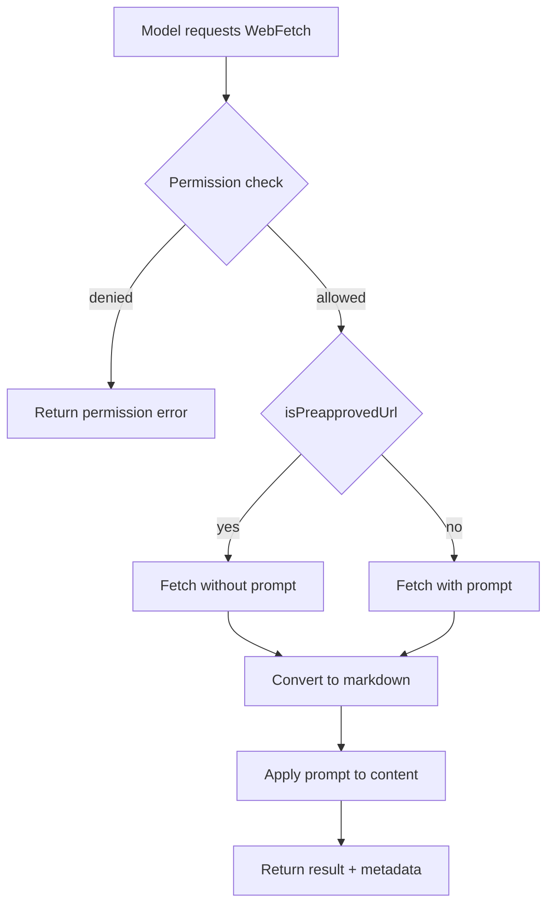
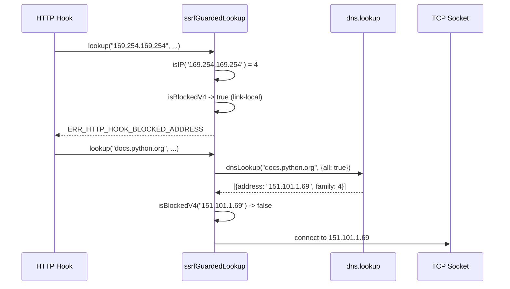

# Diagrams Audit Report for Chapter 16

## Diagram 1: WebFetch flowchart (line 119)

- **Type**: flowchart (valid)
- **Nodes**: 9 (A through I) - not trivial
- **Edge operators**: `-->` (valid for flowchart)
- **Brackets**: balanced
- **No Unicode arrows or smart quotes**
- **Verdict**: valid and useful

## Diagram 2: SSRF sequenceDiagram (line 193)

- **Type**: sequenceDiagram (valid)
- **Participants**: 4 (Hook, SSRF, DNS, Socket) - not trivial
- **Edge operators**: `->>`, `-->>` (valid for sequenceDiagram)
- **Brackets**: balanced
- **No Unicode arrows or smart quotes**
- **Verdict**: valid and useful

## Summary

- 2 diagrams total
- Required minimum: 2 (meets)
- Brief requires: 2 ((a) flowchart of WebFetch with SSRF guard, (b) sequenceDiagram of web-content sanitization)
- Both required diagram types present
- All diagrams syntactically valid and non-trivial
