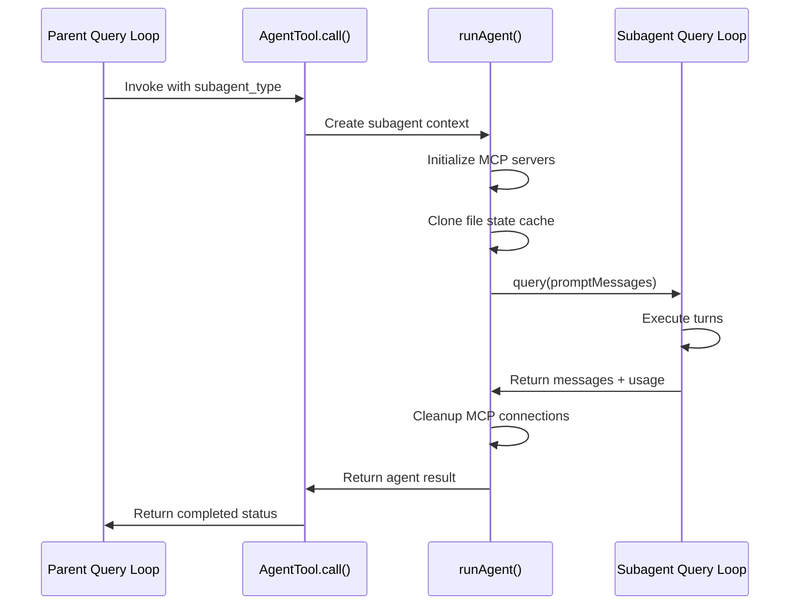
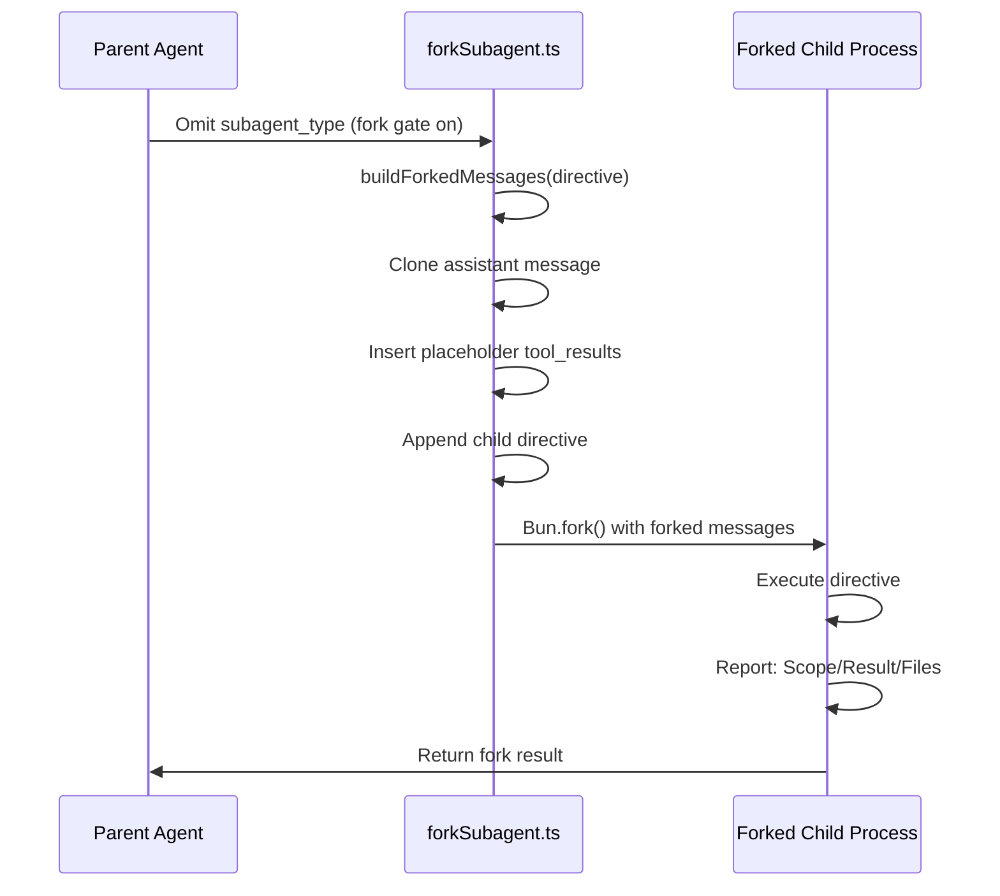
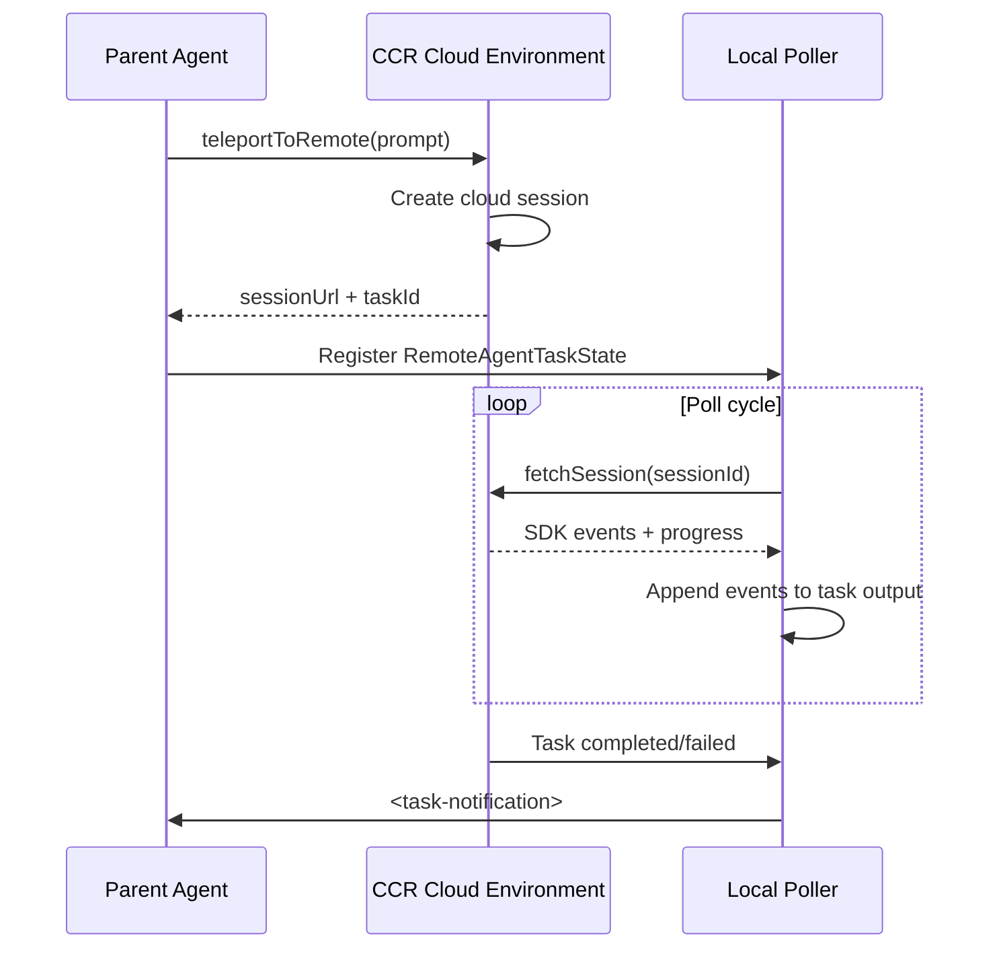

# Diagrams Audit: Chapter 19 — Sync vs Fork vs Remote: The Execution Modes

## Diagram Inventory

### Diagram 1: Sync mode execution (line ~169)

- Type: sequenceDiagram — valid
- Balanced brackets: YES
- Valid edge operators: `->>` — valid for sequenceDiagram
- No Unicode arrows or smart quotes
- Nodes/actors: 4 (Parent, AgentTool, RunAgent, SubAgent) — non-trivial
- Verdict: **valid, useful**

### Diagram 2: Fork mode execution (line ~273)

- Type: sequenceDiagram — valid
- Balanced brackets: YES
- Valid edge operators: `->>` — valid for sequenceDiagram
- No Unicode arrows or smart quotes
- Nodes/actors: 3 (Parent, ForkSub, Child) — non-trivial
- Verdict: **valid, useful**

### Diagram 3: Remote mode execution (line ~331)

- Type: sequenceDiagram — valid
- Balanced brackets: YES
- Valid edge operators: `->>`, `-->>` — valid for sequenceDiagram
- No Unicode arrows or smart quotes
- Nodes/actors: 3 (Parent, Remote, Poller) — non-trivial
- Verdict: **valid, useful**

## Brief Requirements

Required diagrams from brief:
- (a) sequenceDiagram for sync mode — **FOUND** (Diagram 1)
- (b) sequenceDiagram for fork mode — **FOUND** (Diagram 2)
- (c) sequenceDiagram for remote mode — **FOUND** (Diagram 3)

## Summary

- Diagram count: 3
- Minimum required: 2 (general), 3 (brief)
- All required diagram types present
- All diagrams syntactically valid and non-trivial
- Type breakdown: sequenceDiagram: 3
