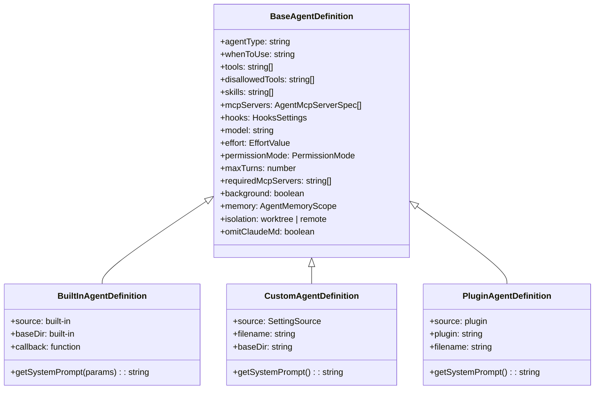
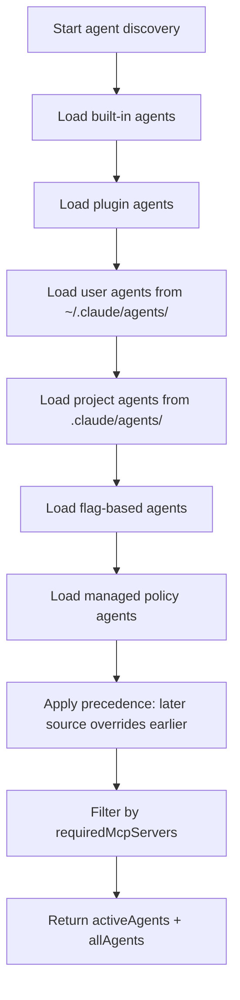

# Diagrams Audit: Chapter 20

## Diagram 1: classDiagram (line 159-200)

- Type: classDiagram (valid)
- Nodes: 4 classes (>= 3, not trivial)
- Brackets: Balanced
- Edge operators: `<|--` (valid for classDiagram inheritance)
- No Unicode arrows or smart quotes
- Verdict: VALID, USEFUL

## Diagram 2: flowchart (line 272-283)

- Type: flowchart (valid)
- Nodes: 10 nodes (>= 3, not trivial)
- Brackets: Balanced `[]` pairs
- Edge operators: `-->` (valid for flowchart)
- No Unicode arrows or smart quotes
- Verdict: VALID, USEFUL

## Required Diagrams from Brief

Brief requires:
1. (a) flowchart of agent discovery across directories - PROVIDED (flowchart TD)
2. (b) classDiagram of AgentDefinition shape - PROVIDED (classDiagram)

## Summary

- Total diagrams: 2
- Required: 2
- Invalid: 0
- Trivial: 0
- Type breakdown: classDiagram=1, flowchart=1

## Verdict: pass
