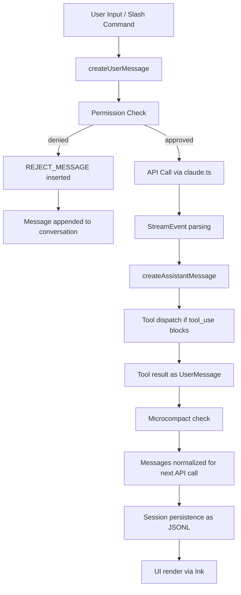
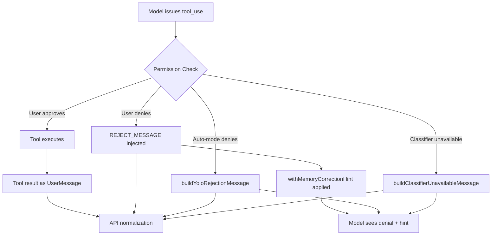

# Diagrams Audit Report - Chapter 25: Messages and the Conversation Model

## Diagram Extraction

Two mermaid diagrams found in the chapter:

### Diagram 1: Message Lifecycle (line ~230)

- Type: flowchart (valid)
- Nodes: 14 (A through N) - well above 3-node minimum
- Edge operators: `-->` and `-->|label|` - valid for flowchart
- Brackets: balanced
- No Unicode arrows or smart quotes
- Useful: yes

### Diagram 2: Synthetic Message Flow (line ~305)

- Type: flowchart (valid)
- Nodes: 10 (A through J) - well above 3-node minimum
- Edge operators: `-->` and `-->|label|` - valid for flowchart
- Brackets: balanced
- No Unicode arrows or smart quotes
- Useful: yes

## Required Diagrams from Brief

The brief requires:
- (a) classDiagram of message types
- (b) flowchart of message lifecycle

### Assessment

- Required (a) classDiagram of message types: NOT FOUND. Both diagrams are flowcharts.
- Required (b) flowchart of message lifecycle: FOUND (Diagram 1 covers this)

One required diagram type is missing (classDiagram of message types). The chapter provides two flowcharts instead of the required classDiagram + flowchart combination.

## Summary

- Diagram count: 2 (meets minimum of 2)
- Both diagrams are syntactically valid
- Both diagrams are non-trivial (>3 nodes)
- Missing required diagram type: classDiagram of message types
