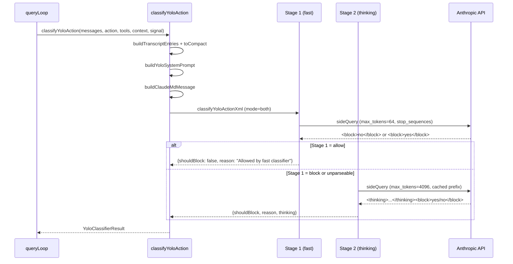

# Diagrams Audit Report - Chapter 33

## Diagram Extraction

### Diagram 1: Transcript Assembly Flowchart (lines 164-180)
```mermaid
flowchart TD
    A[Raw messages array] --> B[buildTranscriptEntries]
    B --> C{Message type}
    C -->|user text| D[TextBlock]
    C -->|assistant tool_use| E[ToolUseBlock]
    C -->|assistant text| F[Discarded - security]
    C -->|queued_command| G[Extracted prompt text]
    D --> H[toCompactBlock]
    E --> H
    G --> H
    H --> I{JSONL enabled?}
    I -->|yes| J["{"Bash":"ls"}\n"]
    I -->|no| K["Bash ls\n"]
    J --> L[Compact transcript string]
    K --> L
```
- Type: flowchart (valid)
- Nodes: A, B, C, D, E, F, G, H, I, J, K, L = 12 nodes (>= 3, not trivial)
- Edge operators: `-->` (valid for flowchart)
- Brackets: balanced
- No Unicode arrows or smart quotes
- Verdict: VALID, USEFUL

### Diagram 2: Two-Stage Classifier Sequence (lines 267-290)

- Type: sequenceDiagram (valid)
- Actors: Q, C, S1, S2, API = 5 actors (>= 3, not trivial)
- Edge operators: `->>`, `-->>` (valid for sequenceDiagram)
- Brackets: balanced
- No Unicode arrows or smart quotes
- Verdict: VALID, USEFUL

## Required Diagrams from Brief
- (a) flowchart of the classifier decision tree -> Diagram 1 is a flowchart covering classifier decision tree (transcript assembly + format selection). Partially matches - it covers the transcript assembly decision tree rather than the full classification decision tree.
- (b) classDiagram of classifier inputs -> NOT PRESENT. Neither diagram is a classDiagram.

## Summary
- diagram_count: 2 (meets minimum of 2)
- Both diagrams are syntactically valid and non-trivial
- Missing required classDiagram type from brief
- Required diagram (b) "classDiagram of classifier inputs" is absent
