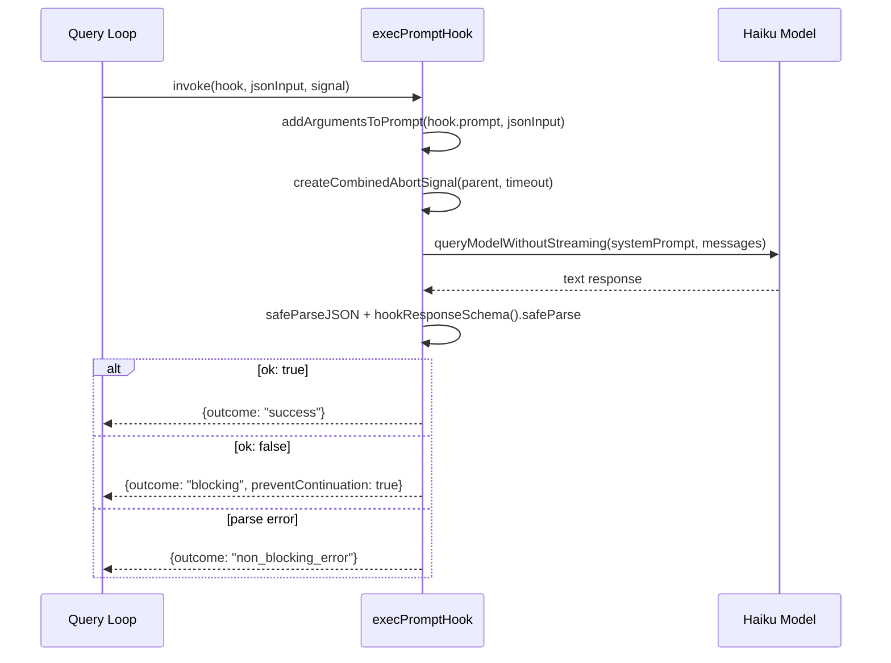
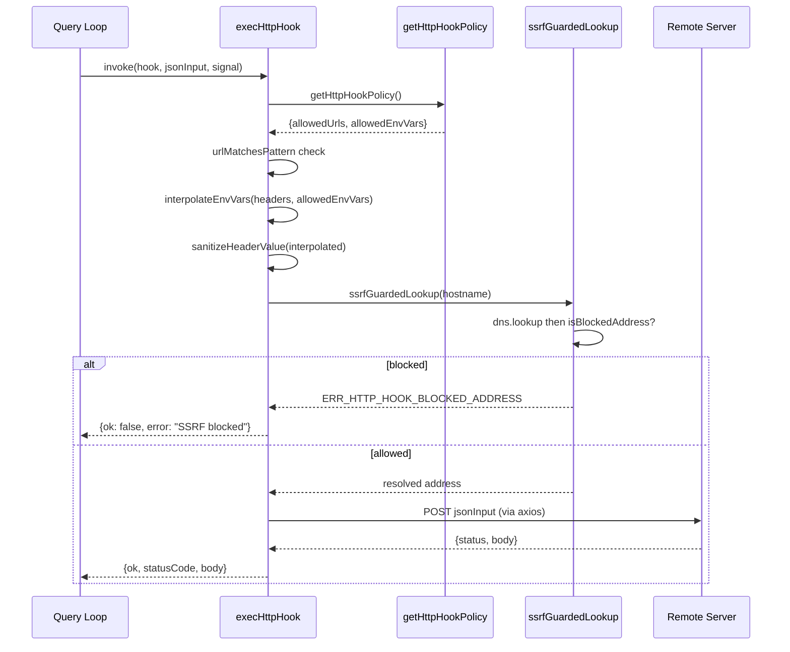

# Diagrams Audit: Chapter 37

## Extracted Mermaid Diagrams

### Diagram 1: Prompt hook sequence diagram (line 161)

- Type: sequenceDiagram (valid)
- 3 participants (valid, not trivial)
- Balanced brackets (valid)
- Valid edge operators: ->>, -->> (valid for sequenceDiagram)
- No Unicode arrows or smart quotes (valid)
- Verdict: valid, useful

### Diagram 2: HTTP hook sequence diagram with SSRF (line 235)

- Type: sequenceDiagram (valid)
- 5 participants (valid, not trivial)
- Balanced brackets (valid)
- Valid edge operators: ->>, -->> (valid for sequenceDiagram)
- No Unicode arrows or smart quotes (valid)
- Verdict: valid, useful

## Required Diagrams from Brief
- (a) sequenceDiagram of a prompt hook — present as Diagram 1
- (b) sequenceDiagram of an HTTP hook with SSRF check — present as Diagram 2

Both required diagrams are present and valid.

## Verdict: pass
