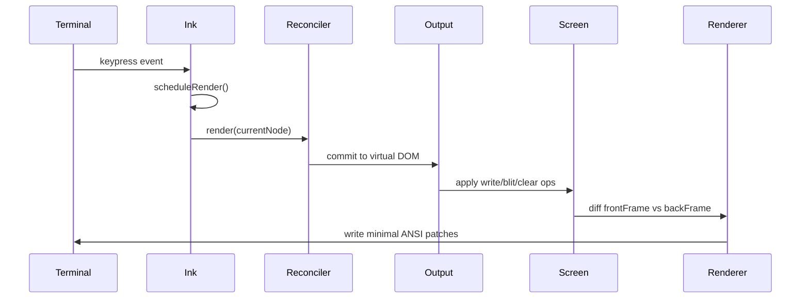
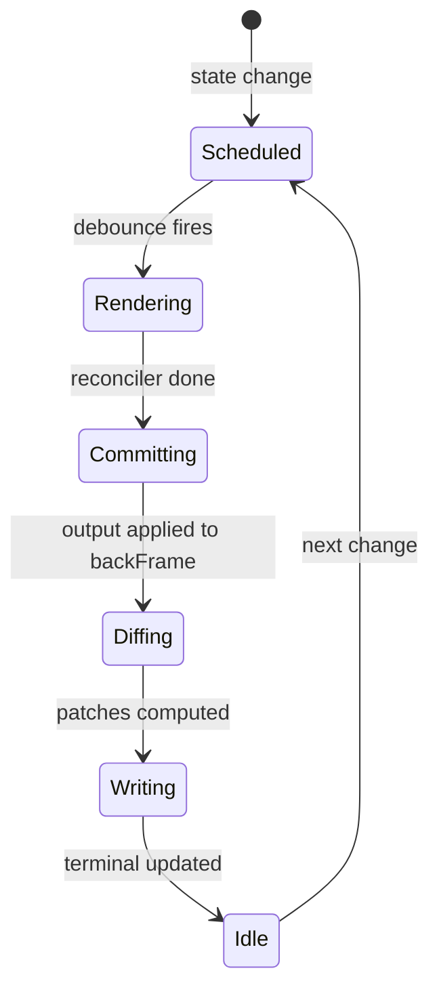

# Diagrams Audit: Chapter 42 — The Ink Renderer and Terminal Engine

## Extracted Mermaid Diagrams

### Diagram 1: Keypress to render cycle (sequenceDiagram)

- Type: sequenceDiagram — VALID
- 6 participants — above minimum of 3 — NOT trivial
- Edge operators: `->>` — valid for sequenceDiagram
- Balanced brackets: YES
- No Unicode arrows or smart quotes: PASS

### Diagram 2: Render state machine (stateDiagram-v2)

- Type: stateDiagram-v2 — VALID
- 6 states — above minimum of 3 — NOT trivial
- Edge operators: `-->` — valid for stateDiagram-v2
- Balanced brackets: YES
- No Unicode arrows or smart quotes: PASS

## Required Diagrams from Brief

The brief mandates:
1. (a) classDiagram of the Ink virtual DOM — NOT FOUND
2. (b) sequenceDiagram of a keypress → render cycle — FOUND (Diagram 1)
3. (c) stateDiagram-v2 of focus management — NOT FOUND

## Summary

- Diagram count: 2 (meets minimum of 2)
- Both diagrams are syntactically valid and non-trivial
- 2 of 3 required diagram types are missing:
  - classDiagram of Ink virtual DOM is absent
  - stateDiagram-v2 of focus management is absent
- The stateDiagram-v2 present covers the render state machine, not focus management
