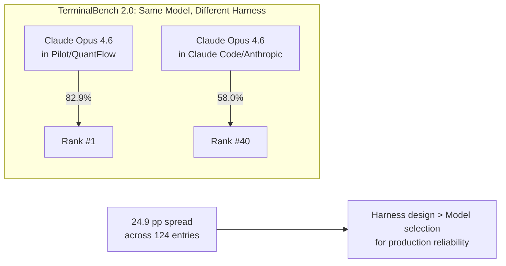

# Why This Book Exists: The Harness Engineering Moment

## Overview

In March 2026, the entire source code of Claude Code (cc), Anthropic's flagship AI coding CLI, was discovered sitting in plain sight on the npm registry via an unstripped sourcemap file. Chaofan Shou (@Fried_rice) identified the leak, which revealed something the AI engineering community had been sensing but could not yet name with precision: a 785KB `main.tsx` entry point, a custom React terminal renderer, 40+ tools, multi-agent orchestration, tiered memory, and a five-layer defense-in-depth security model. This was not a thin wrapper around a model API. It was a full *harness* -- the outer runtime layer that orchestrates the model's interactions with tools, permissions, hooks, memory, and the user.

This book exists because that harness, and the discipline it represents, matters more than most practitioners realize. The same model that ranks #1 in one harness ranks #40 in another -- a 24.9 percentage point spread that proves harness design is the dominant variable in production agent reliability (HER section 17, TerminalBench 2.0, tbench.ai, April 2026). cc is the most mature public example of a long-running agent harness. Understanding it deeply is the fastest path to understanding the emerging discipline of harness engineering itself.

The thesis of this book is twofold: first, that cc is the most complete existing instantiation of the harness engineering discipline; second, that studying its architecture -- every tradeoff, every divergence from published patterns, every defensive mechanism -- provides a concrete template for building trustworthy autonomous systems.

The book you are reading is organized into 57 chapters across 10 parts, moving from foundations through the runtime spine, tool system, sub-agents, context and memory, safety, interaction surfaces, long-running work, observability, and synthesis. Each technical chapter cites specific source files with line-number precision. Each maps cc's implementation to the published patterns and failure modes from the Harness Engineering Report (HER). The goal is not merely to describe what cc does but to extract the architectural principles that make it work -- and to identify where it does not work, so that the next generation of harnesses can do better.

## Data structures and contracts

The conceptual equation at the heart of harness engineering is:

```
Agent = Model + Harness
```

Popularized by Mitchell Hashimoto (co-founder of HashiCorp) in February 2026, this equation captures the insight that the harness encompasses "every piece of code, configuration, and execution logic that isn't the model itself" (HER section 1). The model provides intelligence; the harness makes that intelligence useful. The analogy is deliberate: a horse possesses strength but requires a harness to direct that power toward useful work.

Hashimoto's core principle, stated in his article "My AI Adoption Journey" (mitchellh.com, February 5, 2026), is: "Anytime you find an agent makes a mistake, you take the time to engineer a solution such that the agent never makes that mistake again." This principle is recursive: each mistake drives a new harness component, and the harness grows by accumulating defenses. cc's 4,683-line `main.tsx` is the accumulated result of hundreds of such iterations.

This equation is a pedagogical simplification. In practice, the harness itself contains model calls -- evaluator agents, summarization agents, routing classifiers -- making the relationship recursive rather than a clean sum. The equation's value is in establishing that the harness is at least as important as the model, not in providing a formal decomposition.

The cc codebase embodies this contract. Its entry point, `src/entrypoints/cli.tsx`, demonstrates the principle immediately: before any model call happens, the harness performs environment detection, feature gating, and fast-path routing:

```typescript
// src/entrypoints/cli.tsx:L33-L42
async function main(): Promise<void> {
  const args = process.argv.slice(2);

  // Fast-path for --version/-v: zero module loading needed
  if (args.length === 1 && (args[0] === '--version' || args[0] === '-v' || args[0] === '-V')) {
    // MACRO.VERSION is inlined at build time
    // biome-ignore lint/suspicious/noConsole:: intentional console output
    console.log(`${MACRO.VERSION} (Claude Code)`);
    return;
  }
```

The harness decides whether the model is even needed. The `--version` flag returns immediately with zero imports. This is not an afterthought -- it is the first architectural decision in the codebase: the harness owns the control flow, and the model is invoked only when the harness determines it is necessary. The rest of `src/entrypoints/cli.tsx:L108-L162` continues this pattern: bridge mode, daemon mode, background sessions, template jobs, and environment runners all bypass the model entirely, routing to specialized handlers instead. Only when no fast-path matches does the harness load the full `src/main.tsx` and prepare for model interaction.

The harness also controls environment variables that shape model behavior before any model is loaded:

```typescript
// src/entrypoints/cli.tsx:L16-L26
// Harness-science L0 ablation baseline. Inlined here (not init.ts) because
// BashTool/AgentTool/PowerShellTool capture DISABLE_BACKGROUND_TASKS into
// module-level consts at import time — init() runs too late. feature() gate
// DCEs this entire block from external builds.
if (feature('ABLATION_BASELINE') && process.env.CLAUDE_CODE_ABLATION_BASELINE) {
  for (const k of [
    'CLAUDE_CODE_SIMPLE',
    'CLAUDE_CODE_DISABLE_THINKING',
```

This ablation baseline code sets environment variables that disable thinking, compaction, auto-compact, auto-memory, and background tasks -- all before any tool or model is loaded. The harness is not just a wrapper around the model; it is the environment in which the model operates, and it shapes that environment deliberately.

## Control flow

The evolution from prompt engineering to context engineering to harness engineering is not a sequence of replacements but a nesting of scopes (HER section 2). Prompts tell the model *what to do*. Context gives the model *what to know*. Harnesses give the model *where to work*. Each layer adds scope without eliminating the previous.

```mermaid
flowchart TD
    A[Prompt Engineering<br/>~2020-2021<br/>"Talking to the AI"] --> B[Context Engineering<br/>~2023-2024<br/>"Feeding the AI"]
    B --> C[Harness Engineering<br/>~2025-2026<br/>"Housing the AI"]
    C --> D[Model API]
    C --> E[Tool Dispatch]
    C --> F[Permission System]
    C --> G[Memory & Compaction]
    C --> H[Multi-Agent Orchestration]
    D --> I[Agent = Model + Harness]
    E --> I
    F --> I
    G --> I
    H --> I
```

The HER identifies this evolution as nested layers, not sequential eras (HER section 2). Harness engineering encompasses context engineering, which encompasses prompt engineering. Each layer adds scope without eliminating the previous. The "emergence" dates indicate when each practice became a recognized discipline with its own terminology and community, not when the underlying techniques first appeared. Prompt engineering techniques predate GPT-3; workflow orchestration tools (LangChain, AutoGPT) predate the "harness engineering" label; RAG systems were active before "context engineering" became a term.

The DevOps lineage is important. Muhammad Raza argues that harness engineering maps directly to existing DevOps practices: execution environments equal CI runners, tool definitions equal API design, control loops equal health checks, guardrails equal IAM policies. The discipline is arguably DevOps applied to a new workload type, not an entirely novel field. cc's architecture supports this reading: its startup profiler (`src/utils/startupProfiler.js`), its analytics sinks (`src/services/analytics/index.ts:L1`), its policy limits (`src/services/policyLimits/index.js`), and its managed settings (`src/services/remoteManagedSettings/index.js`) all have direct analogs in traditional DevOps infrastructure.

The cc codebase makes this nesting concrete. `src/main.tsx` imports over 60 modules before the first model call ever fires. These imports establish the harness: settings, permissions, analytics, feature flags, tools, and the React/Ink terminal renderer. The model is the last thing initialized, not the first:

```typescript
// src/main.tsx:L9-L20
// These side-effects must run before all other imports:
// 1. profileCheckpoint marks entry before heavy module evaluation begins
// 2. startMdmRawRead fires MDM subprocesses (plutil/reg query) so they run in
//    parallel with the remaining ~135ms of imports below
// 3. startKeychainPrefetch fires both macOS keychain reads (OAuth + legacy API
//    key) in parallel — isRemoteManagedSettingsEligible() otherwise reads them
//    sequentially via sync spawn inside applySafeConfigEnvironmentVariables()
//    (~65ms on every macOS startup)
import { profileCheckpoint, profileReport } from './utils/startupProfiler.js';

// eslint-disable-next-line custom-rules/no-top-level-side-effects
profileCheckpoint('main_tsx_entry');
import { startMdmRawRead } from './utils/settings/mdm/rawRead.js';

// eslint-disable-next-line custom-rules/no-top-level-side-effects
startMdmRawRead();
```

The startup sequence explicitly prioritizes harness-side work: profiling checkpoints, MDM prefetch, keychain prefetch. The model is not even loaded at this point. The harness must be fully erected before the model is invited in.

The TerminalBench 2.0 evidence makes the practical consequences of this architecture stark. The same model (Claude Opus 4.6) ranks #1 in one harness (Pilot/QuantFlow, 82.9% accuracy) but #40 in another (Claude Code/Anthropic, 58.0%) -- a 24.9 percentage point spread across 124 leaderboard entries (HER section 17). On SWE-bench Verified, Augment Code, Cursor, and Claude Code all ran the same model (Opus 4.5) but scored 17 problems apart (out of 731 total). Same model, different harness, different results.



The task-duration capability of AI agents is doubling approximately every seven months, with recent evidence suggesting acceleration to roughly 4.3 months (METR, March 2025). This trajectory means that tasks which were impossible for autonomous agents in 2024 became routine in 2025, and tasks that require human supervision today will likely be within agent reach within a year. As task duration grows, the harness becomes proportionally more important: a model that can run for six hours instead of twenty minutes encounters context rot, cost explosion, checkpoint-restore side effects, and silent failures on a scale that no amount of prompt engineering can address. The harness is the only layer that scales with task duration.


The verified metrics from HER section 17 provide additional quantitative evidence. A solo agent costs $9 for 20 minutes and produces broken results; a harness-wrapped agent costs $200 for 6 hours and produces working results (Anthropic/Rajasekaran). The Meta-Harness approach yields +7.7 points SOTA with 4x fewer tokens (arXiv:2603.28052). A smaller model with a harness outperforms a larger model without one (AutoHarness, arXiv:2603.03329). Observation masking delivers a 52% cost reduction (JetBrains Research). These are not marginal improvements; they are order-of-magnitude differences that the harness makes possible.

The compound failure math is equally stark: 95% per-step reliability yields only 36% reliability over 20 steps (HER section 17). A long-running agent that performs 100 tool calls must have per-call reliability above 99.6% to achieve even 67% end-to-end reliability. The harness exists to close this gap -- not by making each call marginally better, but by providing structural guarantees (permission checks, result validation, error recovery) that compound positively rather than negatively.

## Edge cases and failure modes

The harness engineering discipline emerged from failure, not success. HER section 6 catalogues 17 failure modes that recur across all production agent systems. The most operationally critical for multi-hour tasks include:

**Context Rot** (HER section 6.1): Performance degrades 30%+ when key content falls in mid-window positions. The agent re-solves problems, contradicts itself, loses track of goals. cc's answer is a five-stage compaction hierarchy (Chapter 28) that progressively rescues context from token overflow.

**Cost Explosion** (HER section 6.11): Agents in infinite loops or multi-agent chains rack up hundreds or thousands of dollars. Enterprise budgets underestimate AI agent TCO by 40-60%. cc's answer includes real-time token metering, per-session cost caps, and a token budget system (Chapter 10). For multi-hour tasks, this is arguably the number one operational risk.

**Checkpoint-Restore Side Effects** (HER section 6.16): LLM agents re-synthesize subtly different requests after restore, causing duplicate payments, unauthorized credential reuse, and irreversible side effects. The ACRFence paper (arXiv:2603.20625) identifies two attack classes specific to agent checkpoint-restore. cc's answer involves recording irreversible tool effects and enforcing replay-or-fork semantics.

**Prompt Injection** (HER section 6.13): Malicious content in files, tool outputs, or user inputs manipulates agent behavior. 73% of production AI deployments were affected by indirect prompt injection in 2025. cc's five-layer defense-in-depth addresses this at prompt level, schema level, runtime approval, tool-level validation, and lifecycle hooks (Chapter 52).

**Silent Failures** (HER section 6.6): The agent proceeds after tool errors as if successful. cc's tool dispatch pipeline includes mandatory result normalization and PostToolUse hooks that make silent failures structurally difficult (Chapter 12).

The honest failure data balances the success stories. Devin's PR merge rate is 67% -- meaning 33% still fail. Quality is the number one blocker for agent production use, cited by 32% of respondents in the LangChain survey. Adding a verifier can hurt performance by -0.8% on SWE-bench (NLAH paper, arXiv:2603.25723v1). Context files generally hurt performance while increasing cost by 20% (ETH Zurich, arXiv:2602.11988). Multi-candidate search can hurt by -2.4% on SWE-bench (NLAH paper). Enterprise budgets underestimate agent TCO by 40-60% (CIO research). These are not theoretical concerns; they are measured production failures that the harness must defend against.

The OpenClaw incident (HER section 12.5) is a cautionary real-world case: 135,000 GitHub stars and 21,000 exposed instances when CVE-2025-53773 (CVSS 9.6) was discovered. The vulnerability allowed remote code execution through the agent's tool interface. This demonstrates that agent security is not theoretical -- it is an active, high-severity concern that the harness must address structurally.

## Where cc diverges from the published pattern

The published harness engineering literature, particularly Martin Fowler's taxonomy (HER section 4), presents guides (feedforward controls) and sensors (feedback controls) as the two primary control mechanisms. cc implements both but diverges in a critical way: it adds a third category that the literature does not name -- *structural controls*. These are not instructions (guides) or observations (sensors) but architectural constraints that make certain failure modes structurally impossible.

For example, cc's permission system does not merely advise against destructive operations; it structurally prevents them through a pipeline of classifiers, mode validators, and human-in-the-loop approval gates (Chapter 32). The tool dispatch pipeline does not merely detect tool errors; it structurally prevents silent failures through mandatory result normalization and PostToolUse hooks (Chapter 12). The compaction hierarchy does not merely suggest context management; it structurally enforces it through token budgets that trigger automatically when thresholds are exceeded (Chapter 28).

Fowler's insight that "building this outer harness is emerging as an ongoing engineering practice, not a one-time configuration" (HER section 4.6) is correct but incomplete. cc demonstrates that the harness is also an *architectural* practice -- the structure of the codebase itself is the most powerful defense, not the configuration layered on top of it.

The HER also notes Fowler's concept of "harnessability" -- the degree to which a codebase supports harness implementation. Factors that improve harnessability include strongly typed languages, clear module boundaries, and conventional frameworks. cc's choice of TypeScript, its consistent tool subdirectory contract, and its React component model all serve harnessability. But Fowler's caveat is equally important: "Legacy systems with technical debt face particular challenges: harnesses are most necessary where hardest to build." cc is not a legacy system, but as it accumulates features (the 4,683-line `main.tsx`, the 5,512-line `src/utils/messages.ts`), it edges toward the same problem.

Ashby's Law, as cited by Fowler (HER section 4.6), states that "a regulator must have at least as much variety as the system it governs." cc's 40+ tools, six permission modes, five compaction stages, and 25+ lifecycle hook points can be read as an attempt to match the variety of the system it regulates -- a coding agent operating on arbitrary repositories with arbitrary tool requirements. The question is whether this variety is sufficient, or whether the harness will always be playing catch-up to the model's capabilities.

The `README.md:L46-L47` of the repository notes that cc is "not a simple CLI" but "a massive 785KB `main.tsx` entry point featuring a custom React terminal renderer (Ink), 40+ tools, and complex multi-agent orchestration." This description, written for a general audience, captures the essential insight: the harness is not thin. It is the bulk of the system. The model is the intelligence; the harness is the infrastructure that makes that intelligence reliable.

The cc startup sequence, documented across `src/entrypoints/cli.tsx:L286-L298` and `src/main.tsx:L9-L20`, follows a strict ordering: environment setup, feature gating, config loading, permission initialization, tool registration, and only then model engagement. This ordering is not arbitrary. Each step depends on the previous one: permissions cannot be initialized before configs are loaded, tools cannot be registered before permissions are initialized, and the model cannot be engaged before tools are available. The harness builds upward from the runtime toward the model, and each layer provides the guarantees that the next layer depends on.

The final step of the cli.tsx fast-path routing demonstrates this escalation explicitly:

```typescript
// src/entrypoints/cli.tsx:L288-L298
  // No special flags detected, load and run the full CLI
  const {
    startCapturingEarlyInput
  } = await import('../utils/earlyInput.js');
  startCapturingEarlyInput();
  profileCheckpoint('cli_before_main_import');
  const {
    main: cliMain
  } = await import('../main.js');
  profileCheckpoint('cli_after_main_import');
  await cliMain();
  profileCheckpoint('cli_after_main_complete');
```

Only when no fast-path matches does the harness load `src/main.js` via dynamic import. The `startCapturingEarlyInput()` call begins buffering user keystrokes before the full CLI is loaded, so that no input is lost during the startup delay. The `profileCheckpoint()` calls bracket the expensive import, giving the startup profiler precise timing data. Every line serves the harness, not the model.

## Developer takeaways for building a long-running agent

The single most important architectural decision in the cc codebase is that the harness owns the control flow: the model is a guest, not the host. cc's `cli.tsx` decides whether the model is even needed before loading it, and this inversion of control sets the tone for everything that follows. The TerminalBench 2.0 data confirms why this matters -- a 24.9 percentage point spread across harnesses running the same model proves that harness design is the dominant variable for production reliability, not model selection.

Harness engineering is a nested discipline, not a sequential one: it encompasses context engineering, which in turn encompasses prompt engineering, and building a production harness requires mastery of all three layers. Within those layers, structural controls consistently outperform advisory ones. cc's permission system, tool dispatch pipeline, and compaction hierarchy make failure modes structurally impossible rather than merely discouraged, and this is a more reliable defense than any amount of prompt engineering can provide. The compound failure math makes this point quantitatively: 95% per-step reliability yields only 36% over 20 steps, so the harness must turn per-call reliability into end-to-end reliability through structural guarantees that compound positively.

The failure data is as important as the success data. The honest failure metrics -- 33% of Devin PRs still failing, verifiers hurting by -0.8%, context files increasing cost by 20% -- define the problem space the harness must solve. A harness designed only from success stories will fail in production. Finally, practitioners with DevOps experience can transfer those skills directly: cc's startup profiler, analytics sinks, policy limits, and managed settings all have direct analogs in traditional DevOps infrastructure, and Fowler's principle that the harness is an ongoing engineering practice means it must be designed for modification from the start.
