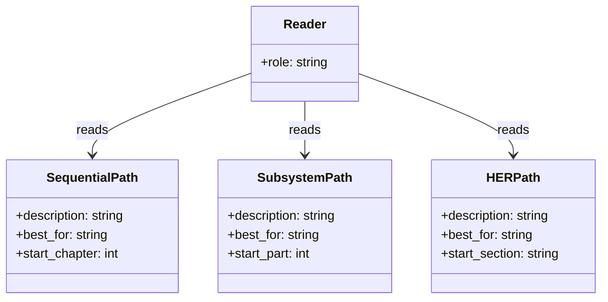

# Book Architecture, Reading Paths, and Citation Conventions

## Overview

This book contains 57 chapters organized across 10 parts. It is designed to be read both linearly and non-linearly, depending on the reader's goals. A developer building a harness from scratch will benefit from a sequential read. A developer debugging a specific failure mode can jump directly to the relevant chapter and follow cross-references. This chapter explains the book's architecture, the citation format used throughout, the diagram conventions, and the cross-reference table that maps patterns, failure modes, and best practices from the Harness Engineering Report (HER) to specific chapters.

This is a meta-chapter. Unlike the technical chapters that follow, it does not cite source files from the cc codebase. Its purpose is to orient the reader before the deep dives begin. The five meta-chapters in this book (this one, plus Chapters 53, 54, 55, 56, and 57) serve a structural role: they map between the theoretical framework of the HER and the concrete implementation details in the remaining 52 technical chapters. The meta-chapters are the connective tissue that turns a collection of deep dives into a coherent argument. Reading this chapter first ensures that the terminology, cross-reference conventions, and structural expectations are clear before the technical content begins.

## Data structures and contracts

The book is organized into ten parts, each addressing a coherent subsystem of the cc harness:

| Part | Title | Chapters | Focus |
|------|-------|----------|-------|
| 1 | Foundations and Framing | 1-4 | Why the book exists, how to read it, repository tour, runtime stack |
| 2 | Entry, Bootstrap, and the Runtime Spine | 5-10 | Startup, command routing, query loop, API layer, prompts, token budgets |
| 3 | The Tool System | 11-17 | Tool contract, dispatch pipeline, file tools, bash tool, search/LSP, web tools, meta tools |
| 4 | Subagents, Tasks, and Multi-Agent Dispatch | 18-24 | Agent tool, execution modes, agent definitions, coordinator, tasks, teammates, dream tasks |
| 5 | Context, Memory, and State | 25-31 | Messages, memdir, session memory, compaction, session persistence, app state, settings cascade |
| 6 | Safety, Permissions, and Hooks | 32-37 | Permission modes, bash classifier, filesystem permissions, canUseTool hook, hook schema, hook execution |
| 7 | Interaction Surfaces | 38-44 | Skills, slash commands, MCP, MCP tools, Ink renderer, REPL, bridges |
| 8 | Long-Running Work | 45-49 | Plan mode, worktrees, cron/schedule/loop, remote agents, KAIROS/buddy |
| 9 | Observability, Cost, and Security | 50-52 | Analytics, debug/diagnostics, threat model |
| 10 | Synthesis and Future Development | 53-57 | HER patterns mapped to cc, failure modes mapped to cc, reference architecture, roadmap, closing |

The citation format used throughout this book is:

- File citations: `src/path/to/file.ts:Lnnn` for a single line, `src/path/to/file.ts:Lnnn-Lmmm` for a range. These citations are precise: they reference the exact lines in the codebase where the cited behavior is implemented. If the codebase is updated, the citations may drift, and the claims should be re-verified against the current source.
- HER cross-references: `HER section N` or `HER section N.K` for specific subsections. These reference the Harness Engineering Report from which the theoretical framework is drawn.
- All citations appear inline in backticks.

Every technical chapter must contain at least 6 unique file citations, at least 2 mermaid diagrams, and at least 4 quoted code snippets from the listed source files. The quoted code snippets use a strict format: the first line inside the fence must be a comment with the exact source path and line range plus a short caption. This format enables automated verification that the snippets match the source.

The diagram conventions are strict. Only five mermaid diagram types are used:

- `flowchart` for decision trees and data flow
- `sequenceDiagram` for temporal interactions between components
- `stateDiagram-v2` for state machines and lifecycle transitions
- `classDiagram` for type hierarchies and interface contracts
- `erDiagram` for storage schemas and entity relationships

This restriction ensures that diagrams render consistently across tools and that readers can predict the information density of each diagram type. No other diagram types are used, and any chapter that includes a non-conforming diagram will be flagged by the Polish Auditor and corrected by the Reviser before passing audit.

The section structure within each technical chapter is also fixed. Every technical chapter must include these sections in this exact order:

1. **Overview** -- a narrative introduction that states the chapter's thesis
2. **Data structures and contracts** -- types, interfaces, schemas, with at least one quoted code snippet
3. **Control flow** -- how the subsystem operates, with at least one mermaid diagram and at least one quoted code snippet showing a key function body
4. **Edge cases and failure modes** -- what goes wrong and how cc handles it
5. **Where cc diverges from the published pattern** -- gaps and differences from the HER framework
6. **Developer takeaways for building a long-running agent** -- actionable lessons

This structure is not merely organizational; it enforces a specific analytical method. Every subsystem is examined from its contracts (what it promises), its control flow (how it delivers), its failure modes (where it breaks), its divergences (where theory and practice part), and its takeaways (what to build differently). This method is designed to produce chapters that are useful to practitioners, not merely descriptive.

## Control flow

The book supports three primary reading paths:

**Sequential path**: Read Parts 1 through 10 in order. This path builds understanding from foundations upward. Part 1 establishes why harness engineering matters and how to read the book. Part 2 walks through the cc startup sequence from `bun run` to the running query loop. Parts 3-7 each address a major subsystem: tools, subagents, context and memory, safety, and interaction surfaces. Part 8 covers long-running work patterns (plan mode, worktrees, cron, remote agents). Part 9 addresses observability and security. Part 10 synthesizes the entire analysis into a reference architecture and roadmap. This path is recommended for anyone building a harness from scratch.

**Subsystem path**: Jump to the part that addresses the subsystem you are working on. Each chapter is self-contained enough to be read in isolation, with cross-references to prerequisite chapters noted at the start. If you are debugging a permission issue, go directly to Part 6. If you are implementing a multi-agent coordinator, go directly to Part 4. The subsystem path trades narrative coherence for immediate relevance.

**HER path**: Follow the cross-reference table below to see how each HER pattern, failure mode, or best practice maps to specific cc chapters and source files. This path is for researchers who want to compare theory to practice, or for practitioners who have encountered a specific failure mode and want to see how cc addresses it. The HER path is the most targeted but also the most fragmented; it assumes that the reader can fill in context from the theoretical framework without the narrative scaffolding.

The cross-reference from HER patterns to chapters is:

```mermaid
flowchart TD
    subgraph "HER Patterns (Section 5)"
        P1[Pattern 1: Persistent Instruction File]
        P2[Pattern 2: Scoped Context Assembly]
        P3[Pattern 3: Tiered Memory]
        P4[Pattern 4: Dream Consolidation]
        P5[Pattern 5: Progressive Context Compaction]
        P6[Pattern 6: Explore-Plan-Act Loop]
        P7[Pattern 7: Context-Isolated Subagents]
        P8[Pattern 8: Fork-Join Parallelism]
        P9[Pattern 9: Progressive Tool Expansion]
        P10[Pattern 10: Command Risk Classification]
        P11[Pattern 11: Single-Purpose Tool Design]
        P12[Pattern 12: Deterministic Lifecycle Hooks]
    end

    P1 --> C31[Ch 31: CLAUDE.md and Settings]
    P2 --> C09[Ch 9: System Prompts]
    P3 --> C26[Ch 26: Memdir]
    P4 --> C24[Ch 24: Dream Tasks]
    P5 --> C28[Ch 28: Compaction]
    P6 --> C45[Ch 45: Plan Mode V2]
    P7 --> C18[Ch 18: Agent Tool]
    P8 --> C46[Ch 46: Worktrees]
    P9 --> C15[Ch 15: Search and LSP Tools]
    P10 --> C33[Ch 33: Bash Classifier]
    P11 --> C11[Ch 11: Anatomy of a Tool]
    P12 --> C36[Ch 36: Hook Schema]
```

## Edge cases and failure modes

The cross-reference table for HER failure modes (Section 6) maps each of the 17 failure modes to the cc chapter(s) that address how cc defends against (or fails to defend against) that mode:

| Failure Mode | HER Section | Primary Chapter(s) |
|-------------|-------------|---------------------|
| Context Rot | 6.1 | Ch 28 (Compaction), Ch 7 (Query Loop) |
| Premature Completion | 6.2 | Ch 45 (Plan Mode) |
| Self-Evaluation Bias | 6.3 | Ch 27 (Session Memory) |
| Placeholder Implementations | 6.4 | Ch 13 (File System Tools) |
| Context Anxiety | 6.5 | Ch 19 (Execution Modes) |
| Silent Failures | 6.6 | Ch 12 (Tool Dispatch Pipeline), Ch 51 (Diagnostics) |
| Infinite Loops | 6.7 | Ch 7 (Query Loop), Ch 10 (Token Budgets) |
| Tool Explosion | 6.8 | Ch 15 (Search and LSP Tools) |
| Compounding Bugs Across Sessions | 6.9 | Ch 29 (Session Persistence) |
| Yak Shaving / Scope Creep | 6.10 | Ch 22 (Tasks) |
| Cost Explosion | 6.11 | Ch 10 (Token Budgets), Ch 50 (Analytics) |
| Hallucinated Tool Calls | 6.12 | Ch 16 (Web Tools), Ch 12 (Tool Dispatch) |
| Prompt Injection | 6.13 | Ch 52 (Threat Model) |
| Model Regression | 6.14 | Ch 8 (Streaming API) |
| Data Leakage Between Contexts | 6.15 | Ch 19 (Execution Modes), Ch 26 (Memdir) |
| Checkpoint-Restore Side Effects | 6.16 | Ch 29 (Session Persistence), Ch 52 (Threat Model) |
| Goal Misinterpretation | 6.17 | Ch 45 (Plan Mode), Ch 17 (TodoWrite/AskUser) |

Some failure modes map to multiple chapters because cc's defense is distributed across subsystems. Context Rot (6.1), for example, is addressed by the compaction hierarchy (Chapter 28) but also by the query loop's token budget checks (Chapter 7) and the auto-compact trigger (Chapter 28). The cross-reference table points to the primary chapter, but the full defense often spans multiple subsystems.

Some failure modes are not fully addressed by cc. Model Regression (6.14), for instance, is partially addressed by cc's model routing and fallback system (Chapter 8), but cc does not maintain a regression test suite against model behavior changes. Data Leakage Between Contexts (6.15) is partially addressed by subagent context isolation (Chapter 19), but cc's file-based communication (recommended in HER section 9.3) inherently persists data to disk, creating leakage risk. These gaps are documented in the relevant chapters and are addressed in the synthesis (Chapter 56).

The cross-reference for HER best practices (Section 20) maps the 12 core principles to chapters:

| Best Practice | HER Section | Primary Chapter(s) |
|--------------|-------------|---------------------|
| Context windows are the constraint | 20.1 | Ch 28 (Compaction), Ch 10 (Token Budgets) |
| Separate generation from evaluation | 20.2 | Ch 21 (Coordinator), Ch 27 (Session Memory) |
| One task per session | 20.3 | Ch 22 (Tasks) |
| Verify before building | 20.4 | Ch 45 (Plan Mode) |
| Wire in fast feedback loops | 20.5 | Ch 15 (LSP Tools), Ch 12 (Tool Dispatch) |
| Repository is single source of truth | 20.6 | Ch 29 (Session Persistence), Ch 13 (File Tools) |
| Humans steer, agents execute | 20.7 | Ch 32 (Permissions), Ch 17 (AskUser) |
| Expect eventual consistency | 20.8 | Ch 28 (Compaction), Ch 7 (Query Loop) |
| Simplify relentlessly | 20.9 | Ch 4 (Runtime Stack), Ch 1 (Overview) |
| Control costs actively | 20.10 | Ch 10 (Token Budgets), Ch 50 (Analytics) |
| Observe everything | 20.11 | Ch 50 (Analytics), Ch 51 (Diagnostics) |
| Secure by default | 20.12 | Ch 52 (Threat Model), Ch 32 (Permissions) |

## Where cc diverges from the published pattern

The published HER literature treats patterns as discrete, composable units. cc's implementation reveals that patterns interact in ways the literature does not address. For example, Pattern 5 (Progressive Context Compaction) and Pattern 3 (Tiered Memory) are deeply intertwined in cc's codebase: compaction triggers memory extraction, and memory retrieval populates the context that compaction must manage. Treating them as independent patterns would miss the critical coupling point where context is both consumed and produced.

Similarly, the 12 best practices from HER section 20 are presented as independent principles. In cc's implementation, Principle 1 ("context windows are the constraint; structured artifacts are the solution") and Principle 6 ("repository is single source of truth") are in tension: structured artifacts must be persisted to the repository, but the repository is itself a source of context that can overflow the window. The harness must manage this tension explicitly, and cc does so through its compaction hierarchy and memdir system.

The HER also presents the session protocol as a linear sequence: ORIENT, SETUP, VERIFY, SELECT, IMPLEMENT, TEST, UPDATE, EXIT. cc's implementation is closer to a state machine than a linear pipeline: the query loop can cycle through IMPLEMENT and TEST multiple times, compaction can interrupt at any point, and human-in-the-loop approvals can divert the flow at any stage. The linear protocol is a useful mental model but does not capture the actual control flow of a production harness.

A fourth divergence concerns the relationship between the failure mode index and the best practice index. The HER presents these as separate taxonomies, but in cc they form a single defensive surface: every failure mode has a corresponding best practice that mitigates it, and every best practice exists because a failure mode was observed. The cross-reference tables in this chapter make this bidirectional relationship explicit. Context Rot (6.1) is mitigated by the compaction best practice (20.1); Silent Failures (6.6) are mitigated by the observation best practice (20.11). A harness builder who treats the two taxonomies as independent will miss the feedback loop between observing failures and refining practices that characterizes mature harness engineering.

A fifth divergence lies in the scope of the 12 HER patterns themselves. The patterns were derived from reverse-engineering a single product (cc), and other platforms make fundamentally different tradeoffs: Cursor embeds the harness in an IDE with rich UI affordances, Devin runs fully autonomously, and OpenAI Codex uses sandboxed cloud environments. The patterns are useful as concrete examples, but they should not be treated as universal harness principles. Chapter 53 examines each pattern in detail and notes where cc-specific assumptions limit generalizability.

## Developer takeaways for building a long-running agent

1. **Use the reading path that matches your goal.** Sequential for the whole system, subsystem for debugging, HER for theory-to-practice comparison.

2. **Cross-references are bidirectional.** Every technical chapter references HER patterns and other chapters. Following references in either direction yields insight.

3. **The failure mode table is a debugging index.** When a production agent exhibits a failure mode, the table points directly to the relevant chapter -- or where cc itself is vulnerable.

4. **Pattern interactions matter more than individual patterns.** cc demonstrates that patterns are interacting subsystems. The most important architectural decisions are at the coupling points.

5. **Citation conventions enable verification.** Every factual claim is cited with a file path and line number. If a citation drifts, the claim should be re-verified.

6. **Unaddressed failure modes are as informative as the coverage.** The gaps in cc's defenses indicate where the next generation of harnesses must improve.
