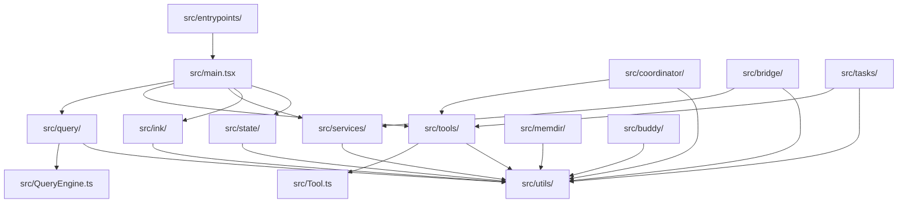
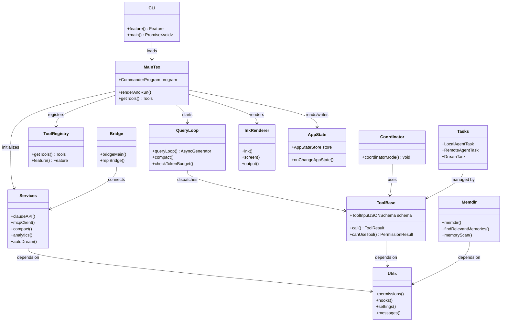
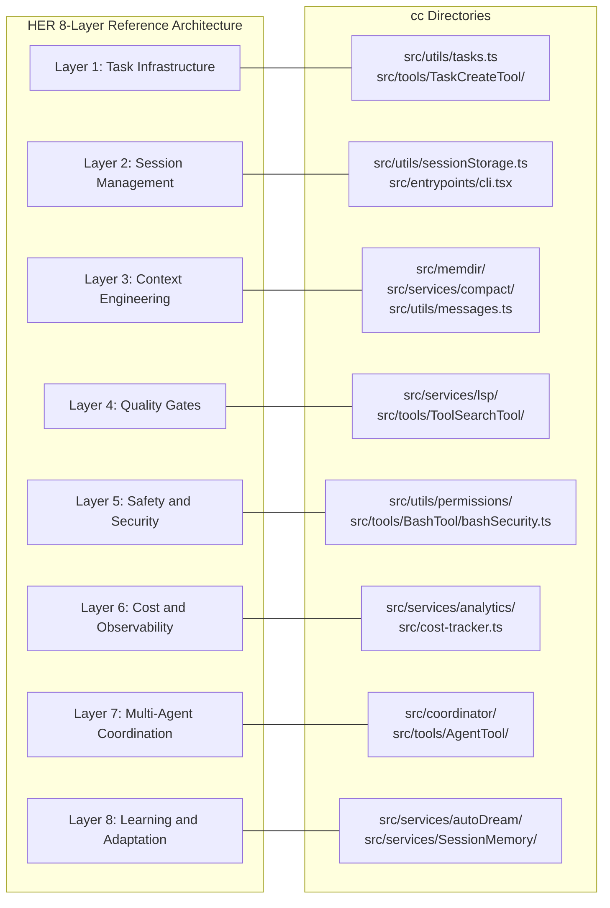

# A Guided Tour of the Repository

## Overview

The cc codebase is organized into 35 top-level directories under `src/`. Each directory serves a distinct role in the harness, and understanding the directory structure is the first step to understanding the architecture. This chapter maps every major folder, answers what lives there and why, identifies connections to neighboring directories, and maps the HER 8-layer reference architecture onto the cc folder layout. The goal is to provide the reader's orientation map before the deep dives in subsequent chapters.

The codebase was made public through an npm sourcemap leak in March 2026. The `README.md` in the repository documents the leak and provides a high-level overview, noting that cc is "not a simple CLI" but rather "a massive 785KB `main.tsx` entry point featuring a custom React terminal renderer (Ink), 40+ tools, and complex multi-agent orchestration." This chapter goes deeper than the README, examining each directory as a subsystem within the harness.

For the reader approaching cc for the first time, the directory tree can feel overwhelming. Thirty-five directories under `src/` alone, plus a sprawling `src/utils/` that absorbs cross-cutting concerns from every layer. The key to navigation is understanding that the codebase is organized as three distinct, concentric rings: the outer ring of entry points and UI (`src/entrypoints/`, `src/screens/`, `src/ink/`, `src/hooks/`), the middle ring of domain logic (`src/tools/`, `src/services/`, `src/coordinator/`, `src/memdir/`, `src/tasks/`), and the inner ring of shared infrastructure (`src/utils/`, `src/state/`, `src/bootstrap/`). Dependencies flow inward: the outer ring depends on the middle ring, the middle ring depends on the inner ring, and the inner ring depends on nothing except external packages. There are exceptions to this rule -- `src/utils/` sometimes imports from domain modules via lazy `require()` -- but the general pattern holds.

## Data structures and contracts

The top-level directory tree is the most important structural document in the codebase. The following table maps each directory to its role and the largest file it contains (from `loc-hints/files.json`):

| Directory | Largest File (LOC) | Role in Harness |
|-----------|-------------------|-----------------|
| `src/entrypoints/` | cli.tsx (302) | Bootstrap entry, fast-path routing |
| `src/main.tsx` | (4,683) | Command router, CLI definition, session setup |
| `src/query/` | query.ts (1,729) | The query loop -- heartbeat of the agent |
| `src/QueryEngine.ts` | (1,295) | Core LLM logic |
| `src/Tool.ts` | (792) | Base tool definitions and buildTool helper |
| `src/tools.ts` | (389) | Tool registry and getTools() |
| `src/tools/` | varies | 40+ agent tools, each with own subdirectory |
| `src/services/` | claude.ts (3,419) | Backend services (API, MCP, analytics, compact, dreams) |
| `src/coordinator/` | coordinatorMode.ts (369) | Multi-agent orchestration (Swarm) |
| `src/bridge/` | bridgeMain.ts (2,999) | IDE integration layer (VS Code, JetBrains) |
| `src/buddy/` | sprites.ts (514) | Tamagotchi companion system |
| `src/ink/` | ink.tsx (1,722) | Custom React terminal renderer |
| `src/memdir/` | memdir.ts (507) | Tiered memory on disk |
| `src/state/` | AppStateStore.ts (569) | Redux-like store |
| `src/utils/` | hooks.ts (5,022) | Shared utilities, permissions, hooks, settings |
| `src/hooks/` | useTypeahead.tsx (1,384) | React hooks (typeahead, voice, keybindings, canUseTool) |
| `src/screens/` | REPL.tsx (5,005) | Terminal screens (REPL, doctor) |
| `src/components/` | PromptInput.tsx (2,338) | Reusable UI components |
| `src/constants/` | prompts.ts (914) | System prompt assembly |
| `src/schemas/` | hooks.ts (222) | Zod schemas for hook configuration |
| `src/types/` | message.ts | TypeScript type definitions |
| `src/tasks/` | RemoteAgentTask.tsx (855) | Task types (Local, Remote, Dream) |
| `src/skills/` | loadSkillsDir.ts (1,086) | Skill discovery and loading |
| `src/commands.ts` | (754) | Slash command registry |
| `src/plugins/` | varies | Plugin system |
| `src/migrations/` | varies | Settings migration scripts |
| `src/assistant/` | sessionHistory.ts (87) | KAIROS proactive assistant |
| `src/bootstrap/` | state.ts (1,758) | Session bootstrap state |
| `src/voice/` | varies | Voice input integration |
| `src/vim/` | varies | Vim keybinding emulation |

The `src/Tool.ts` file defines the base contract that every tool implements. The key types establish the tool's input schema, execution method, and concurrency model:

```typescript
// src/Tool.ts:L15-L21
export type ToolInputJSONSchema = {
  [x: string]: unknown
  type: 'object'
  properties?: {
    [x: string]: unknown
  }
}
```

Every tool must provide a Zod-validated input schema conforming to this shape, a `call()` method, and optional concurrency flags. The `src/tools.ts` file registers all tools via `getTools()`, using the `feature()` gate from `bun:bundle` to conditionally include internal-only tools:

```typescript
// src/tools.ts:L16-L19
const REPLTool =
  process.env.USER_TYPE === 'ant'
    ? require('./tools/REPLTool/REPLTool.js').REPLTool
    : null
```

The `src/tools/` directory is the deepest subtree. It contains over 40 subdirectories, one per tool, and each tool subdirectory follows a consistent contract. The directory contract includes:

- A main implementation file (e.g., `BashTool.tsx` at 1,143 LOC)
- A `prompt.ts` defining the tool's description for the model
- Optionally a `UI.tsx` for rendering tool output in the terminal
- Supporting modules for security, permissions, and validation

The Bash tool has the richest supporting cast: `bashSecurity.ts` (2,592 LOC), `bashPermissions.ts` (2,621 LOC), `pathValidation.ts` (1,303 LOC), `readOnlyValidation.ts` (1,990 LOC), `commandSemantics.ts` (140 LOC), `destructiveCommandWarning.ts` (102 LOC), `modeValidation.ts` (115 LOC), and `shouldUseSandbox.ts` (153 LOC). This depth reflects the risk profile of shell command execution -- the single most dangerous operation the harness permits, and therefore the most heavily guarded.

Other tools are simpler. The `GlobTool/` directory has only `GlobTool.ts` (198 LOC), `prompt.ts` (7 LOC), and `UI.tsx` (62 LOC). The variation in depth reflects the variation in risk: a tool that reads files and searches for patterns carries less risk than a tool that executes arbitrary shell commands, and the directory structure reflects this proportionality.

## Control flow

The dependency graph between directories flows inward from entry points toward shared utilities:



The `src/entrypoints/cli.tsx` file is the outermost layer. It performs fast-path routing before loading `src/main.tsx`. The entry point's first import establishes the feature flag system that governs which code paths exist in any given build:

```typescript
// src/entrypoints/cli.tsx:L1
import { feature } from 'bun:bundle';
```

After the fast-path checks (version, dump-system-prompt, daemon worker, bridge mode), cli.tsx falls through to `init.ts` and then `main.tsx`. The main file is 4,683 lines long and serves as the central dispatch point that wires together the entire harness:

```typescript
// src/main.tsx:L9-L20
// These side-effects must run before all other imports:
// 1. profileCheckpoint marks entry before heavy module evaluation begins
// 2. startMdmRawRead fires MDM subprocesses (plutil/reg query) so they run in
//    parallel with the remaining ~135ms of imports below
// 3. startKeychainPrefetch fires both macOS keychain reads (OAuth + legacy API
//    key) in parallel — isRemoteManagedSettingsEligible() otherwise reads them
//    sequentially via sync spawn inside applySafeConfigEnvironmentVariables()
//    (~65ms on every macOS startup)
import { profileCheckpoint, profileReport } from './utils/startupProfiler.js';
```

The import list in `src/main.tsx` is the most revealing map of the codebase's structure. Every top-level directory appears in these imports. The side-effect imports at the top of the file fire MDM reads and keychain prefetches in parallel with the remaining module evaluation, shaving approximately 65ms off every macOS startup.

The following classDiagram shows the top-level modules and their relationships, making the architecture visible at a glance:



The `src/services/` directory is the backend layer. It contains the Anthropic API wrapper (`src/services/api/claude.ts` at 3,419 LOC), the MCP client (`src/services/mcp/client.ts` at 3,348 LOC), the compaction system (`src/services/compact/`), the auto-dream service (`src/services/autoDream/`), the session memory service (`src/services/SessionMemory/`), analytics (`src/services/analytics/`), and the LSP server manager (`src/services/lsp/`). These services are consumed by the query loop and the tool system, and they depend on the shared utilities in `src/utils/`.

The `src/services/` directory is organized by capability rather than by HER layer. This means that a single service directory can span multiple HER layers. For example, `src/services/compact/` implements Layer 3 (Context Engineering) through its compaction hierarchy, but it also touches Layer 6 (Cost and Observability) through its token-budget-aware triggers. The `src/services/api/` directory implements the Anthropic API wrapper (Layer 2, Session Management) but also includes cost tracking (Layer 6) through `usage.ts` (63 LOC) and error handling (Layer 5, Safety) through `errors.ts` (1,207 LOC). This cross-layer organization is pragmatic -- the code is organized by deployment unit rather than by architectural layer -- but it means that the HER mapping requires reading across directories.

The `src/hooks/` directory contains React hooks that are consumed by UI components. `useTypeahead.tsx` (1,384 LOC) implements the typeahead suggestion system that provides auto-completion for commands, file paths, and tool names. `useVoice.ts` (1,144 LOC) implements voice input integration. `useGlobalKeybindings.tsx` (248 LOC) manages keyboard shortcuts. `useCanUseTool.tsx` (203 LOC) is the permission decision hook that evaluates whether a tool call should be allowed, denied, or deferred to the user. These hooks are the interface layer between the UI and the harness's defensive infrastructure.

The `src/screens/` directory contains the terminal screen definitions. `REPL.tsx` (5,005 LOC) is the largest screen and the primary user interface. It manages the prompt input, message display, tool output rendering, and the overall terminal layout. The REPL screen is the user's primary touchpoint with the harness, and its complexity reflects the breadth of interaction patterns it must support: typing, scrolling, searching, selecting, interrupting, and resuming.

The `src/utils/` directory is the widest dependency in the graph. Nearly every other directory imports from it. It contains the permission system (`src/utils/permissions/`), the hook system (`src/utils/hooks/`), settings management (`src/utils/settings/`), message utilities (`src/utils/messages.ts` at 5,512 LOC -- the largest single file in the codebase), and dozens of shared utilities. The `src/utils/permissions/` subdirectory alone contains 10 files, including `permissions.ts` (1,486 LOC), `filesystem.ts` (1,777 LOC), `yoloClassifier.ts` (1,495 LOC), and `bashClassifier.ts` (61 LOC).

The `src/state/` directory contains the Redux-like store that underpins the entire application. `AppStateStore.ts` (569 LOC) defines the application state shape, `AppState.tsx` (199 LOC) provides the React context, and `onChangeAppState.ts` (171 LOC) handles state change propagation. The store is initialized during bootstrap and accessed throughout the harness via React hooks and direct imports.



The mapping between HER's 8-layer reference architecture and cc's directories is instructive. The reference architecture (HER section 21) defines eight aspirational layers. No public implementation covers all eight, and cc is no exception. The mapping reveals both coverage and gaps:

**Layer 1 (Task Infrastructure)** maps to `src/utils/tasks.ts` (862 LOC) and the task tool family (`TaskCreateTool`, `TaskListTool`, `TaskGetTool`, `TaskUpdateTool`, `TaskStopTool`). cc implements append-only task records with status transitions, dependency tracking, and filesystem locking. The `DEFAULT_TASKS_MODE_TASK_LIST_ID` and `TASK_STATUSES` constants are imported at the top of `src/main.tsx`, indicating how central tasks are to the harness.

```typescript
// src/main.tsx:L134
import { DEFAULT_TASKS_MODE_TASK_LIST_ID, TASK_STATUSES } from './utils/tasks.js';
```

**Layer 2 (Session Management)** maps to `src/utils/sessionStorage.ts` (5,105 LOC) and `src/entrypoints/cli.tsx`. cc implements a startup protocol, clean exit protocol, and session-to-session handoff via JSONL files. The session storage module is the second-largest file in the codebase, reflecting the complexity of session persistence and resume.

**Layer 3 (Context Engineering)** maps to `src/memdir/`, `src/services/compact/`, and `src/utils/messages.ts`. This is cc's deepest layer -- five-stage compaction, tiered memory, and observation masking are all implemented. The `src/services/compact/` directory alone contains eight files, from `compact.ts` (1,705 LOC) to `compactWarningHook.ts` (16 LOC).

**Layer 4 (Quality Gates)** maps to `src/services/lsp/` and `src/tools/ToolSearchTool/`. cc has LSP integration for real-time type checking, but the back-pressure stack (linter, tests, type checker) is primarily external -- the harness wires in the feedback loops rather than providing them.

**Layer 5 (Safety and Security)** maps to `src/utils/permissions/` and `src/tools/BashTool/bashSecurity.ts`. cc implements permission tiers, destructive operation confirmation, loop detection, and input sanitization.

**Layer 6 (Cost and Observability)** maps to `src/services/analytics/` and `src/cost-tracker.ts`. cc has per-session cost tracking and real-time token metering.

**Layer 7 (Multi-Agent Coordination)** maps to `src/coordinator/` and `src/tools/AgentTool/`. cc implements generator-evaluator patterns, model routing, and file-based inter-agent communication.

**Layer 8 (Learning and Adaptation)** maps to `src/services/autoDream/` and `src/services/SessionMemory/`. cc implements dream consolidation and memory extraction, but does not yet have harness configuration versioning or A/B testing.

The `src/commands.ts` file (754 LOC) at the top level is worth noting separately. It contains the slash command registry, which maps user-invocable commands (like `/help`, `/compact`, `/clear`) to either prompt templates or callback functions. The slash command system is cc's primary user-facing control surface, and the registry pattern (a flat list of command definitions, each with a name, description, and handler) is straightforward to replicate in a new harness.

The `src/constants/prompts.ts` (914 LOC) file is another top-level file of note. It assembles the system prompt from multiple fragments: base instructions, environment context, tool descriptions, skill instructions, memory context, hook definitions, and effort/plan mode modifiers. This file is the single most important artifact for understanding what the model "knows" when it begins a query, and it is the subject of Chapter 9's deep dive.

## Edge cases and failure modes

The directory structure reveals architectural tensions and several edge cases that a harness builder should be aware of:

**The `src/utils/` monolith.** At 5,022 lines for `src/utils/hooks.ts` alone, plus thousands more across `src/utils/permissions/`, `src/utils/settings/`, and `src/utils/messages.ts`, the utils directory has become a catch-all. This is a common pattern in growing codebases, but it makes the dependency graph difficult to reason about. Any directory can import from `utils/`, and `utils/` imports from nearly everywhere else, creating potential circular dependency risks that cc manages through lazy `require()` calls. The `src/main.tsx:L69-L71` shows an explicit comment about this:

```typescript
// src/main.tsx:L69-L71
// Lazy require to avoid circular dependency: teammate.ts -> AppState.tsx -> ... -> main.tsx
/* eslint-disable @typescript-eslint/no-require-imports */
const getTeammateUtils = () => require('./utils/teammate.js') as typeof import('./utils/teammate.js');
```

The circular dependency problem is real and pervasive. The `teammate.js` module imports from `AppState.tsx`, which imports from modules that ultimately import from `main.tsx`. The lazy `require()` pattern breaks this cycle, but it does so at the cost of type safety: the `as typeof import(...)` cast assumes the module exists and has the expected shape, which is only verified at runtime.

**The `src/main.tsx` size.** At 4,683 LOC, this file is the largest single module in the codebase. It handles CLI definition, command routing, session setup, resume logic, tool loading, permission initialization, and dozens of other responsibilities. This concentration of logic makes the file difficult to navigate but ensures that the startup sequence is linear and auditable. The `src/main.tsx:L120-L121` imports show the permission initialization chain:

```typescript
// src/main.tsx:L120-L121
import { PERMISSION_MODES } from './utils/permissions/PermissionMode.js';
import { checkAndDisableBypassPermissions, getAutoModeEnabledStateIfCached, initializeToolPermissionContext, initialPermissionModeFromCLI, isDefaultPermissionModeAuto, parseToolListFromCLI, removeDangerousPermissions, stripDangerousPermissionsForAutoMode, verifyAutoModeGateAccess } from './utils/permissions/permissionSetup.js';
```

A single import from `permissionSetup.js` brings in nine functions. This density of imports is typical of `main.tsx` and reflects its role as the central wiring point. Every subsystem registers itself here.

**Feature-gated directories.** Several directories exist behind feature flags: `src/coordinator/` (COORDINATOR_MODE), `src/assistant/` (KAIROS), and various sub-features. The feature flags are checked via `feature('FLAG_NAME')` from `bun:bundle`, which enables dead-code elimination at build time. This means the external build may not include these directories at all. The `src/main.tsx:L74-L76` shows the pattern for the coordinator:

```typescript
// src/main.tsx:L74-L76
// Dead code elimination: conditional import for COORDINATOR_MODE
/* eslint-disable @typescript-eslint/no-require-imports */
const coordinatorModeModule = feature('COORDINATOR_MODE') ? require('./coordinator/coordinatorMode.js') as typeof import('./coordinator/coordinatorMode.js') : null;
```

This pattern is repeated for KAIROS, the daemon system, bridge mode, and other internal-only features. Each `feature()` check is a compile-time gate: if the feature is not enabled, the `require()` call and the entire module it loads are eliminated from the output.

**The `src/buddy/` directory.** The Tamagotchi companion system (buddy) sits in its own directory with sprites (514 LOC) and companion (133 LOC) files. This is a UX warmth feature that does not interact with the core harness subsystems. Its isolation is both a strength (no risk of contaminating the core) and a weakness (it is disconnected from the harness's defensive mechanisms).

**The PowerShell mirror.** `src/tools/PowerShellTool/` mirrors much of `src/tools/BashTool/` with Windows-specific implementations: `powershellSecurity.ts` (1,090 LOC), `powershellPermissions.ts` (1,648 LOC), `pathValidation.ts` (2,049 LOC), `readOnlyValidation.ts` (1,823 LOC). This duplication is a maintenance burden but reflects the legitimate differences between Unix and Windows command security models.

**The `src/services/mcp/` depth.** The MCP (Model Context Protocol) subsystem spans multiple files: `client.ts` (3,348 LOC), `config.ts` (1,578 LOC), `auth.ts` (2,465 LOC), `types.ts` (258 LOC), and `MCPConnectionManager.tsx` (72 LOC). Together these represent over 7,700 lines of code for external tool integration. This depth reflects the complexity of the MCP protocol: server lifecycle management, reconnection strategy, OAuth authentication, and elicitation handling all require dedicated implementation. The `src/entrypoints/mcp.ts` (196 LOC) provides the MCP server entry point, making cc itself an MCP server when run in that mode.

**The `src/hooks/` vs `src/utils/hooks/` naming collision.** Two directories share the word "hooks" but serve entirely different purposes. `src/hooks/` contains React hooks for UI state (typeahead, voice, keybindings, the permission decision hook `useCanUseTool`). `src/utils/hooks/` contains harness lifecycle hooks (PreToolUse, PostToolUse, Notification) and their execution pipelines. This collision is a source of confusion for new developers and a naming lesson for builders of new harnesses.

**The `src/state/` directory as the nervous system.** The three files in `src/state/` -- `AppState.tsx` (199 LOC), `AppStateStore.ts` (569 LOC), and `onChangeAppState.ts` (171 LOC) -- form the central nervous system of the harness. Every UI component, every tool dispatch, every permission check reads from or writes to the app state. The store is initialized during bootstrap (`src/bootstrap/state.ts` at 1,758 LOC) and accessed throughout the harness via React hooks and direct imports. The `src/main.tsx:L168` import shows how deeply the store is integrated:

```typescript
// src/main.tsx:L168
import { type ChannelEntry, getInitialMainLoopModel, getIsNonInteractiveSession, getSdkBetas, getSessionId, getUserMsgOptIn, setAllowedChannels, setAllowedSettingSources, setChromeFlagOverride, setClientType, setCwdState, setDirectConnectServerUrl, setFlagSettingsPath, setInitialMainLoopModel, setInlinePlugins, setIsInteractive, setKairosActive, setOriginalCwd, setQuestionPreviewFormat, setSdkBetas, setSessionBypassPermissionsMode, setSessionPersistenceDisabled, setSessionSource, setUserMsgOptIn, switchSession } from './bootstrap/state.js';
```

A single import from `bootstrap/state.js` brings in 23 functions. This density is a symptom of the bootstrap state's role as a global mutable registry, and it creates coupling between every subsystem that reads or writes to it.

## Where cc diverges from the published pattern

The HER reference architecture (section 21) describes Layer 4 (Quality Gates) as including pre-commit type-check, lint, and format checks, plus post-commit unit tests and integration tests. cc's implementation diverges significantly: it provides the *wiring* for quality gates (LSP integration, tool dispatch hooks) but does not provide the gates themselves. The harness assumes that the host repository already has its own test infrastructure, and cc wires into it via the Bash tool and hook system rather than providing built-in quality gates.

This divergence is deliberate. cc is a CLI-first, repository-agnostic harness. It cannot assume a specific test framework, linter, or build system. Instead, it provides the mechanisms (hooks, tool dispatch, LSP) through which quality gates can be wired in, and delegates the gate definitions to the host repository's CLAUDE.md and settings configuration.

The LSP integration in `src/services/lsp/` illustrates this approach. The `LSPServerManager.ts` (420 LOC) manages LSP server instances, `LSPServerInstance.ts` (511 LOC) handles individual server lifecycles, and `LSPClient.ts` (447 LOC) provides the client interface. But cc does not define what the LSP servers check -- it merely provides the infrastructure for connecting to them. The actual diagnostics (type errors, lint warnings) come from the language servers that the host repository configures.

The `src/services/lsp/passiveFeedback.ts` (328 LOC) is particularly interesting. It implements a passive feedback mechanism that feeds LSP diagnostics back into the model's context without requiring explicit tool calls. This is a sensor in Fowler's taxonomy (HER section 4.2) -- a feedback control that observes agent outputs after generation and enables self-correction. The "passive" qualifier means the diagnostics are injected into the context silently, without the model having to request them. This is a subtle but powerful design: the model receives quality feedback automatically, without having to remember to check for it.

The HER also notes that Layer 8 (Learning and Adaptation) should include "harness configuration versioning and A/B testing (Meta-Harness approach)." cc's `src/services/autoDream/` and `src/services/SessionMemory/` implement memory consolidation and extraction, but cc does not have a Meta-Harness that A/B tests harness configurations. The GrowthBook integration (`src/services/analytics/growthbook.ts` at 1,155 LOC) provides feature flag A/B testing for *features*, not for *harness configurations*. This is a gap that the roadmap (Chapter 56) addresses.

The `src/memdir/` directory provides another perspective on cc's divergence from the published pattern. The HER describes Layer 3 (Context Engineering) as including "tiered memory (always-loaded index + on-demand topic files)." cc's memdir implements this exactly: `src/memdir/memdir.ts` (507 LOC) manages the memory directory, `src/memdir/memoryTypes.ts` (271 LOC) defines the memory types (user, feedback, project, reference), `src/memdir/paths.ts` (278 LOC) manages storage paths, and `src/memdir/findRelevantMemories.ts` (141 LOC) implements relevance retrieval. But cc diverges in one important way: the HER specifies a "compact index (200 lines max) always in context," while cc's implementation uses a `MEMORY.md` index file with a less strict size limit. This divergence reflects a practical tradeoff: a strict 200-line limit would require more aggressive pruning, which could lose important context.

The `src/services/compact/` directory is the most substantial implementation of HER Layer 3. With eight files totaling over 3,400 lines, it implements the five-stage compaction hierarchy that is cc's primary defense against context rot (HER section 6.1). The `compact.ts` (1,705 LOC) file is the largest, implementing the full compaction pipeline. The `autoCompact.ts` (351 LOC) handles the automatic compaction trigger. The `microCompact.ts` (530 LOC) implements the lightweight first stage. The `apiMicrocompact.ts` (153 LOC) and `sessionMemoryCompact.ts` (630 LOC) handle specialized compaction cases. This depth of implementation reflects the critical importance of context management in a long-running agent: without compaction, the agent would quickly exhaust its context window and become unreliable.

## Developer takeaways for building a long-running agent

1. **The entry point is the map.** Reading the imports at the top of `src/main.tsx` and `src/entrypoints/cli.tsx` reveals every major subsystem and its startup order. This is the fastest way to understand the codebase's structure.

2. **The HER 8-layer mapping is aspirational, not prescriptive.** cc covers most layers partially but none completely. The gaps are as informative as the coverage -- they reveal where the discipline has not yet produced production-grade patterns.

3. **Feature flags are architectural boundaries.** The `feature()` gates in cc are not toggles; they are compile-time boundaries that determine which code exists in the external build. Understanding which features are gated is essential for understanding what the published harness actually contains.

4. **The utils/ directory is a warning sign.** When utils becomes a monolith, the codebase has outgrown its directory structure. For builders of new harnesses, investing in clear module boundaries early (separating permissions, hooks, and settings into first-class directories) prevents this accumulation.

5. **The tool directory contract is reusable.** Each tool follows the same subdirectory pattern (implementation, prompt, UI). This contract is straightforward to replicate in a new harness and provides a consistent developer experience for adding new tools.

6. **The `src/main.tsx` concentration is a tradeoff, not a mistake.** The file's size makes it difficult to navigate, but it ensures that the entire startup sequence is linear and auditable. For a harness where startup correctness is critical, this tradeoff is defensible.

7. **Platform-specific duplication is a tax, not a bug.** The Bash/PowerShell mirror reflects the legitimate differences between Unix and Windows security models. Accepting this duplication is more honest than pretending a single abstraction can cover both.

8. **The buddy directory is a reminder that UX warmth matters.** The Tamagotchi system does not serve a functional purpose in the harness, but it serves an emotional purpose for the user. Long-running agents that feel cold and mechanical will be replaced by agents that feel warm and responsive, even if the warmth is decorative.

9. **The `src/hooks/` vs `src/utils/hooks/` naming collision is a warning.** Two directories share the word "hooks" but serve entirely different purposes: React hooks for UI state versus harness hooks for lifecycle events. For a new harness, consider naming conventions that disambiguate these concepts from the start.

10. **The `src/bridge/` directory is not multi-agent coordination.** It is human-to-agent coordination through an IDE intermediary. The distinction matters because the bridge must handle different security and trust assumptions than agent-to-agent communication: the IDE is a trusted endpoint, but the network between the IDE and the cc session is not.
