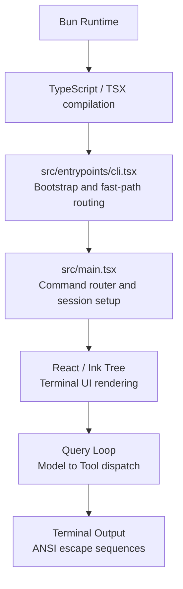

# TypeScript, Bun, React, Ink: The Unusual Runtime Stack

## Overview

cc runs on an unusual technology stack: TypeScript compiled by Bun, rendered via React using Ink (a custom React renderer for the terminal). This combination was not chosen for novelty. Each component solves a specific problem in the harness design space, and the tradeoffs are instructive for anyone building a long-running agent. This chapter examines why cc chose this stack, what each component contributes, where the tradeoffs lie, and how the stack connects to the HER thesis that harnesses are language- and runtime-specific.

The stack is visible from the first line of the codebase. `src/entrypoints/cli.tsx` opens with `import { feature } from 'bun:bundle'`, establishing a dependency on Bun's build-time feature flag system before any other module is loaded. `src/main.tsx` imports React and the Ink renderer to construct the terminal UI. `src/ink/ink.tsx` implements a custom React reconciler that renders to a terminal screen buffer instead of a DOM. Every subsequent chapter in this book depends on understanding this stack, because the stack shapes what the harness can do and what it cannot.

The choice of this stack is not arbitrary. It reflects three deliberate architectural decisions. First, cc must be a CLI tool that runs in a terminal, which requires a terminal rendering engine. Second, cc must support compile-time feature elimination for security and performance, which requires a build system that supports dead-code elimination. Third, cc must support component-based UI composition for complex tool output, permission dialogs, and typeahead suggestions, which benefits from a component model like React. Each of these decisions constrains the runtime choice, and Bun is the only runtime that satisfies all three simultaneously.

## Data structures and contracts

The stack is visible in the first lines of the entry point:

```typescript
// src/entrypoints/cli.tsx:L1-L5
import { feature } from 'bun:bundle';

// Bugfix for corepack auto-pinning, which adds yarnpkg to peoples' package.jsons
// eslint-disable-next-line custom-rules/no-top-level-side-effects
process.env.COREPACK_ENABLE_AUTO_PIN = '0';
```

The `bun:bundle` import is the first architectural commitment: cc depends on Bun's build-time feature flag system for dead-code elimination. This is not a casual dependency; it is structural. The `feature()` function is used throughout the codebase to gate entire modules at compile time:

```typescript
// src/entrypoints/cli.tsx:L16-L26
// Harness-science L0 ablation baseline. Inlined here (not init.ts) because
// BashTool/AgentTool/PowerShellTool capture DISABLE_BACKGROUND_TASKS into
// module-level consts at import time — init() runs too late. feature() gate
// DCEs this entire block from external builds.
// eslint-disable-next-line custom-rules/no-top-level-side-effects, custom-rules/no-process-env-top-level
if (feature('ABLATION_BASELINE') && process.env.CLAUDE_CODE_ABLATION_BASELINE) {
  for (const k of ['CLAUDE_CODE_SIMPLE', 'CLAUDE_CODE_DISABLE_THINKING', 'DISABLE_INTERLEAVED_THINKING', 'DISABLE_COMPACT', 'DISABLE_AUTO_COMPACT', 'CLAUDE_CODE_DISABLE_AUTO_MEMORY', 'CLAUDE_CODE_DISABLE_BACKGROUND_TASKS']) {
    // eslint-disable-next-line custom-rules/no-top-level-side-effects, custom-rules/no-process-env-top-level
    process.env[k] ??= '1';
  }
}
```

The `feature()` gates are not runtime toggles. They are compile-time directives that Bun uses to eliminate entire code paths from the published build. This is critical for security (removing internal-only features from the external build) and for performance (reducing the module graph that must be loaded at startup). The ablation baseline block above is a concrete example: it exists only in internal builds where `feature('ABLATION_BASELINE')` is true. In the published npm package, this entire block is eliminated during compilation, and no trace of it exists in the output.

The bundled mode detection shows another Bun-specific dependency:

```typescript
// src/utils/bundledMode.ts:L7-L22
export function isRunningWithBun(): boolean {
  // https://bun.com/guides/util/detect-bun
  return process.versions.bun !== undefined
}

/**
 * Detects if running as a Bun-compiled standalone executable.
 * This checks for embedded files which are present in compiled binaries.
 */
export function isInBundledMode(): boolean {
  return (
    typeof Bun !== 'undefined' &&
    Array.isArray(Bun.embeddedFiles) &&
    Bun.embeddedFiles.length > 0
  )
}
```

cc can detect whether it is running as a Bun-compiled standalone executable by checking for embedded files. This distinction matters because the bundled mode changes behavior: it affects how settings are loaded, how updates are handled, and how the harness detects its own installation context. The `isRunningWithBun()` function provides the first-level check, and `isInBundledMode()` provides the second-level check that distinguishes between running from source and running from a compiled binary.

The React/Ink integration defines the terminal rendering contract:

```typescript
// src/ink/ink.tsx:L67-L80
export type Options = {
  stdout: NodeJS.WriteStream;
  stdin: NodeJS.ReadStream;
  stderr: NodeJS.WriteStream;
  exitOnCtrlC: boolean;
  patchConsole: boolean;
  waitUntilExit?: () => Promise<void>;
  onFrame?: (event: FrameEvent) => void;
};
export default class Ink {
  private readonly log: LogUpdate;
  private readonly terminal: Terminal;
  private scheduleRender: (() => void) & {
    cancel?: () => void;
```

The `Ink` class is a custom React reconciler. It does not render to a DOM; it renders to a terminal screen buffer. The `Options` type shows the terminal-specific contracts: `stdout`, `stdin`, `stderr` streams, a `patchConsole` option, and an `exitOnCtrlC` flag. These are terminal concepts, not browser concepts, but the component model is pure React: components, props, state, effects, and reconciliation.

## Control flow

The runtime stack flows from the bottom up:



Bun provides three things that Node.js does not: (1) native TypeScript/TSX compilation without a separate build step, (2) `Bun.fork()` for spawning subagents as child processes with IPC, and (3) `bun:bundle` feature flags for compile-time dead-code elimination. The first eliminates the build toolchain from the developer experience. The second enables cc's fork-based subagent model (Chapter 19). The third is structural to the security model, allowing internal-only features to be stripped from the published build.

The feature flag system shapes which code paths exist at runtime. In `src/main.tsx`, the coordinator module is conditionally loaded:

```typescript
// src/main.tsx:L74-L77
// Dead code elimination: conditional import for COORDINATOR_MODE
/* eslint-disable @typescript-eslint/no-require-imports */
const coordinatorModeModule = feature('COORDINATOR_MODE')
  ? require('./coordinator/coordinatorMode.js') as typeof import('./coordinator/coordinatorMode.js')
  : null;
/* eslint-enable @typescript-eslint/no-require-imports */
// Dead code elimination: conditional import for KAIROS (assistant mode)
/* eslint-disable @typescript-eslint/no-require-imports */
const assistantModule = feature('KAIROS')
  ? require('./assistant/index.js') as typeof import('./assistant/index.js')
  : null;
const kairosGate = feature('KAIROS')
  ? require('./assistant/gate.js') as typeof import('./assistant/gate.js')
  : null;
```

This pattern repeats for KAIROS, the daemon system, background sessions, and other internal-only features. Each `feature()` check is a compile-time gate: if the feature is not enabled, the `require()` call and the entire module it loads are eliminated from the output. This is not lazy loading; it is dead-code elimination. The module does not exist in the published build at all.

React, via the Ink terminal renderer, provides the component model for the terminal UI. The Ink renderer at `src/ink/ink.tsx` (1,722 LOC) implements a custom React reconciler from scratch. The reconciler follows the standard React reconciliation algorithm but with terminal-specific adaptations. On each render cycle, the reconciler walks the component tree, calls `render()` on each component to produce React elements, and computes a fiber tree. It then diffs the new fiber tree against the previous one to produce a minimal set of mutations. Unlike the DOM reconciler, which produces DOM mutations (createElement, setAttribute, appendChild), the Ink reconciler produces terminal buffer mutations: write a character at a row/column position, apply a style code, or clear a region. The diff is not a virtual DOM diff in the browser sense; it is a character-by-character comparison of the terminal grid, optimized through the `CharPool` interning system so that most comparisons are integer equality checks rather than string comparisons.

Layout computation uses Yoga, a Flexbox layout engine compiled to native code via Bun's native binding support. Yoga takes the React component tree and computes the x/y position and width/height of each node according to the CSS Flexbox specification. In a browser, the browser's layout engine performs this step implicitly. In the terminal, cc must compute layout explicitly because there is no browser layout engine. The computed layout determines which characters land at which terminal coordinates. This is why the Ink renderer must manage the entire rendering pipeline: component tree to fiber diff to layout computation to terminal buffer write. Each step is explicit and each has performance implications. The Yoga layout pass is synchronous and must complete within the frame budget (controlled by `FRAME_INTERVAL_MS` in `src/ink/constants.ts`). For complex component trees with many nested Flexbox containers, the layout pass can become a bottleneck, which is why cc's component tree is kept relatively flat compared to a typical web application.

The screen module at `src/ink/screen.ts` (1,486 LOC) manages the terminal screen buffer with interning pools for character strings and style codes, optimizing for the high-frequency render cycles that the query loop demands.

The screen buffer uses a `CharPool` class for character interning:

```typescript
// src/ink/screen.ts:L21-L53
// Character string pool shared across all screens.
// With a shared pool, interned char IDs are valid across screens,
// so blitRegion can copy IDs directly (no re-interning) and
// diffEach can compare IDs as integers (no string lookup).
export class CharPool {
  private strings: string[] = [' ', ''] // Index 0 = space, 1 = empty (spacer)
  private stringMap = new Map<string, number>([
    [' ', 0],
    ['', 1],
  ])
  private ascii: Int32Array = initCharAscii() // charCode → index, -1 = not interned

  intern(char: string): number {
    // ASCII fast-path: direct array lookup instead of Map.get
    if (char.length === 1) {
      const code = char.charCodeAt(0)
      if (code < 128) {
        const cached = this.ascii[code]!
        if (cached !== -1) return cached
        const index = this.strings.length
        this.strings.push(char)
        this.ascii[code] = index
        return index
      }
    }
    const existing = this.stringMap.get(char)
    if (existing !== undefined) return existing
    const index = this.strings.length
    this.strings.push(char)
    this.stringMap.set(char, index)
    return index
  }
```

The `CharPool` is an optimization that reflects the performance demands of terminal rendering. Every keystroke, every streaming token, every tool output update triggers a render cycle. The pool interns characters so that diff operations can compare integer IDs instead of strings, and the ASCII fast-path avoids Map lookups for the common case. This is the kind of low-level optimization that a DOM renderer handles automatically but that a terminal renderer must implement explicitly.

```mermaid
stateDiagram-v2
    [*] --> RunningFromSource: Bun.embeddedFiles.length === 0
    [*] --> BundledMode: Bun.embeddedFiles.length > 0
    RunningFromSource --> StandardSettings: user config via ~/.claude/settings.json
    RunningFromSource --> ManagedSettings: --managed-config flag
    BundledMode --> ManagedSettings: enterprise MDM via org policy
    BundledMode --> StandardSettings: no managed config
    ManagedSettings --> FeatureRestricted: managed feature gates active
    StandardSettings --> FeatureFull: all features available
    FeatureRestricted --> UpdateCheck: built-in update mechanism
    FeatureFull --> UpdateCheck: built-in update mechanism
    UpdateCheck --> [*]: exit
```



## Edge cases and failure modes

**Startup time.** The `src/main.tsx` import list is massive -- over 60 modules are imported before the first render. The codebase mitigates this through three strategies: (1) dynamic imports in `cli.tsx` for fast-path routes, (2) MDM and keychain prefetches that run in parallel with module evaluation, and (3) lazy `require()` calls for circular-dependency-breaking modules. Despite these optimizations, the startup time remains a tradeoff: the harness pays the cost of loading the full module graph even when the user only needs `--version`. The startup profiler (`src/utils/startupProfiler.ts`) is the diagnostic tool for measuring this cost, with `profileCheckpoint()` calls scattered throughout the entry points.

**Distributability.** The Bun runtime is not as widely available as Node.js. cc addresses this through bundled mode (`isInBundledMode()`), which compiles the entire application into a standalone executable using `Bun.embeddedFiles`. This eliminates the runtime dependency but increases the binary size and complicates the update mechanism.

**React for the terminal.** Using React for a terminal UI is unusual and has tradeoffs. The component model provides excellent composability for complex layouts (tool output panels, permission dialogs, typeahead suggestions), but the reconciliation overhead adds latency to every render cycle. cc mitigates this with its custom screen buffer, character interning pools, and diff-based terminal output, but the fundamental tradeoff remains: React's abstraction is designed for DOM rendering, and bending it to the terminal requires significant custom infrastructure (1,722 LOC for the Ink class alone, plus 1,486 LOC for the screen module).

**Feature flag coupling.** The `feature()` gates create a tight coupling between the codebase and Bun's build system. Code that uses `feature('FLAG_NAME')` cannot be tested or run outside the Bun compilation pipeline. This means that internal features (KAIROS, COORDINATOR_MODE, DAEMON, BRIDGE_MODE) cannot be developed or tested in isolation from the build system. The `isRunningWithBun()` check in `bundledMode.ts` provides a runtime escape hatch for code that needs to behave differently on Node.js versus Bun.

**Memory pressure from the terminal buffer.** The screen buffer's character and style interning pools grow monotonically during a session. For long-running sessions (hours), this can accumulate significant memory. The `CharPool` and `HyperlinkPool` classes do not implement eviction, so every unique character and hyperlink encountered during a session remains in memory until the process exits.

**The TSX compilation requirement.** cc's use of `.tsx` files for the entry point (`cli.tsx`) and the main module (`main.tsx`) means that the runtime must support JSX compilation. Bun provides this natively, but it creates a hard dependency on a runtime that can compile TSX. Node.js cannot run these files without a separate build step (Babel, esbuild, or tsc), which adds startup latency and build complexity. This is a conscious tradeoff: cc chose developer experience (writing TSX directly) over runtime portability (writing plain TypeScript that Node.js can run).

**The Ink reconciler's frame rate.** The Ink renderer targets a specific frame interval (defined in `src/ink/constants.ts` as `FRAME_INTERVAL_MS`). This interval determines how frequently the terminal UI updates during streaming. If the interval is too short, the terminal flickers and the CPU spins. If the interval is too long, the user sees delayed output. The throttle mechanism in `src/ink/ink.tsx` manages this tradeoff, but it is tuned for the common case (streaming text output) and may not be optimal for all tool output patterns.

**The `src/ink/screen.ts` character interning optimization.** The `CharPool` class in `src/ink/screen.ts:L21-L53` implements an ASCII fast-path that uses an `Int32Array` for direct array lookup instead of `Map.get` for ASCII characters (code points below 128). This optimization is critical for terminal rendering performance, because the vast majority of characters in source code are ASCII. The fast-path reduces the overhead of character interning from a hash map lookup to a direct array access, which is an order of magnitude faster. This is the kind of optimization that is invisible in a DOM renderer but essential in a terminal renderer that must update on every streaming token.

## Where cc diverges from the published pattern

The HER thesis (section 4) presents Fowler's taxonomy of guides and sensors, and notes that "harnessability" varies by language and framework: strongly typed languages, clear module boundaries, and conventional frameworks improve harnessability. cc's stack choice aligns with this principle: TypeScript provides strong typing, React provides a component model with clear boundaries, and Bun provides a conventional build system.

However, cc diverges from the published pattern in an important way. Fowler's taxonomy focuses on the harness as a *consumer* of language and runtime features. cc demonstrates that the harness is also a *producer* of runtime-specific features. The `feature()` gate system, the `Bun.fork()` subagent model, and the Ink terminal renderer are not just consumers of the runtime -- they are extensions of it. The harness and the runtime are co-designed, not loosely coupled.

This co-design has a cost: portability. cc cannot be ported to Node.js without replacing the `feature()` system, the `Bun.fork()` subagent model, and the Bun-specific bundled mode detection. It cannot be ported to a browser runtime without replacing the entire Ink rendering layer. The HER thesis that harnesses are language- and runtime-specific is not just a theoretical observation -- it is an architectural constraint that cc embodies fully.

The HER section 12 (supply chain) raises another concern. cc's dependency on Bun means that the supply chain includes the Bun runtime itself. A vulnerability in Bun would affect every cc installation. Similarly, the React dependency means that any vulnerability in React or Ink would propagate to the harness. The HER recommends vetting all supply chain dependencies, and cc's tight coupling to its runtime stack makes this vetting more critical, not less.

The HER section 4 taxonomy of guides and sensors provides a useful lens for evaluating the stack choice. TypeScript's type system is a computational guide (Fowler's term for deterministic, fast controls that prevent unwanted behavior before it occurs). The type checker catches incorrect tool input shapes, invalid state transitions, and mismatched API calls at compile time, before the harness ever runs. This is a structural advantage that dynamically typed languages cannot provide. The React component model is a scaffold for both guides (prop types, context contracts) and sensors (render effects, state subscriptions). The Ink renderer extends this scaffold to the terminal, providing the same component model but with terminal-specific rendering constraints.

Fowler's concept of "harnessability" (HER section 4.5) is directly relevant to the stack choice. He identifies factors that improve harnessability: strongly typed languages, clear module boundaries, and conventional frameworks. cc's stack scores well on all three: TypeScript provides strong typing, the tool subdirectory contract provides clear module boundaries, and React/Ink provides a conventional component model. But Fowler's caveat is important: "Legacy systems with technical debt face particular challenges: harnesses are most necessary where hardest to build." As cc accumulates technical debt (the 4,683-line `main.tsx`, the 5,512-line `src/utils/messages.ts`), its harnessability may degrade, making the harness harder to maintain even as it becomes more necessary.

## Developer takeaways for building a long-running agent

The runtime is part of the harness, not just a platform for it. cc's use of Bun-specific features (feature flags, fork, embedded files) means the runtime is deeply integrated into the harness design, and when choosing a runtime, consider not just what it runs but what it enables at the architectural level. Feature flags in particular are a security boundary, not a toggle: cc uses compile-time feature elimination to strip internal-only code from the published build, a structural security measure that cannot be replicated with runtime toggles. React for the terminal is viable but expensive; the component model provides excellent composability, but the custom reconciler, screen buffer, and diff engine represent significant implementation investment, and for simpler terminal UIs a direct rendering approach may suffice. Startup time is a first-class concern for any CLI tool, and cc invests heavily in parallel prefetching, dynamic imports, and lazy loading to minimize latency. The bundled mode detection pattern (checking `Bun.embeddedFiles`) is portable to any runtime supporting compiled distributions. Co-design with the runtime creates portability constraints that should be acknowledged explicitly when the runtime provides architecturally necessary features. Terminal rendering optimization (character interning, diff-based output) is not premature but necessary for a UI that updates on every streaming token. Supply chain risk scales with runtime coupling, so vet the runtime's security posture accordingly. The TSX choice locks in the runtime, trading portability for developer experience. Frame rate tuning for terminal renderers must be budgeted early, as the update interval must be tuned for the specific workload and may need to be adaptive rather than fixed.
