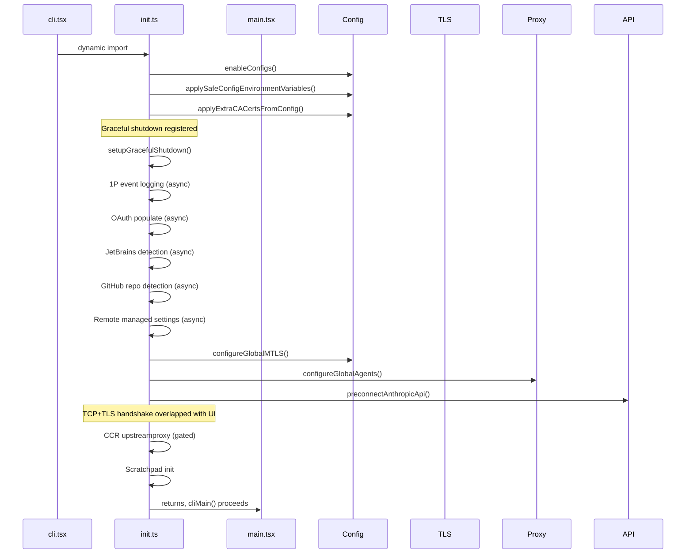
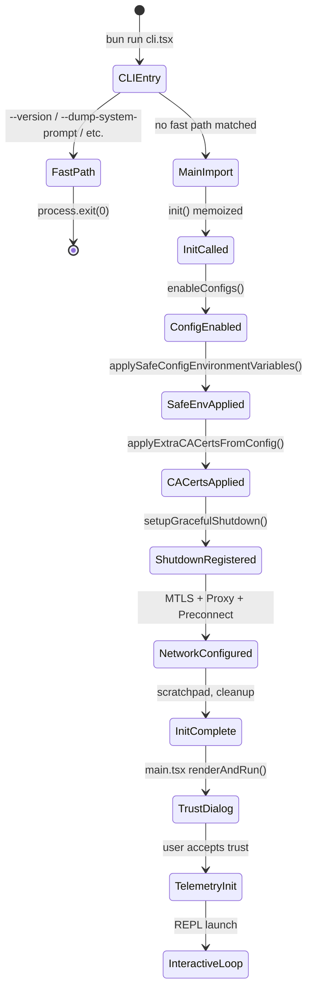

# Bootstrap: From `bun run` to Running Loop

## Overview

Every invocation of cc begins the same way: the user types `claude` at a terminal, and a cascade of side effects fires before the agent ever sees its first prompt. This chapter traces that cascade from the entry point in `src/entrypoints/cli.tsx` through the initialization sequence in `src/entrypoints/init.ts`, the global state bootstrap in `src/bootstrap/state.ts`, and the settings cascade in `src/utils/settings/settings.ts`. The bootstrap path is performance-sensitive: every millisecond of startup latency is felt by the user waiting at the prompt, so the code is carefully ordered to overlap I/O, defer heavy modules, and short-circuit fast paths. HER's Session Protocol (section 10) describes an idealized ORIENT/SETUP/VERIFY sequence; cc's bootstrap is its concrete realization, with defense-in-depth security (section 12) baked into the earliest layers.

The startup path has been heavily profiled and optimized. As of the current codebase, the time from `bun run cli.tsx` to the REPL prompt appearing is approximately 300-500ms on a warm machine, with the majority of that time spent on module evaluation (~135ms for the `main.tsx` import graph) and network preconnection (~100-200ms for TCP+TLS). Every function in the init path is instrumented with `profileCheckpoint()` calls that feed into a startup profiler, enabling continuous regression monitoring. The profiler data is aggregated at shutdown and can be inspected via the `--debug` flag, giving developers a timeline of every phase from entry to first render.

## Data structures and contracts

### The global State singleton

`src/bootstrap/state.ts` defines a single `State` type and a module-scope `STATE` constant initialized by `getInitialState()`. Every field has a getter/setter pair, and no field is exported directly. This pattern gives cc a Redux-like global store without the overhead of a formal reducer dispatch. The module comment at line 31 warns: "DO NOT ADD MORE STATE HERE - BE JUDICIOUS WITH GLOBAL STATE" -- a reminder that the singleton's size directly impacts startup time (every field must be initialized) and test reset complexity.

```typescript
// src/bootstrap/state.ts:L45-L257
type State = {
  originalCwd: string
  // Stable project root - set once at startup (including by --worktree flag),
  // never updated by mid-session EnterWorktreeTool.
  // Use for project identity (history, skills, sessions) not file operations.
  projectRoot: string
  totalCostUSD: number
  totalAPIDuration: number
  totalAPIDurationWithoutRetries: number
  totalToolDuration: number
  turnHookDurationMs: number
  turnToolDurationMs: number
  turnClassifierDurationMs: number
  turnToolCount: number
  turnHookCount: number
  turnClassifierCount: number
  startTime: number
  lastInteractionTime: number
  totalLinesAdded: number
  totalLinesRemoved: number
  hasUnknownModelCost: boolean
  cwd: string
  modelUsage: { [modelName: string]: ModelUsage }
  mainLoopModelOverride: ModelSetting | undefined
  initialMainLoopModel: ModelSetting
  modelStrings: ModelStrings | null
  isInteractive: boolean
  // ... 50+ more fields
  sessionId: SessionId
  parentSessionId: SessionId | undefined
  allowedSettingSources: SettingSource[]
  sessionIngressToken: string | null | undefined
  oauthTokenFromFd: string | null | undefined
  apiKeyFromFd: string | null | undefined
  // Telemetry counters
  meter: Meter | null
  sessionCounter: AttributedCounter | null
  locCounter: AttributedCounter | null
  prCounter: AttributedCounter | null
  commitCounter: AttributedCounter | null
  costCounter: AttributedCounter | null
  tokenCounter: AttributedCounter | null
  codeEditToolDecisionCounter: AttributedCounter | null
  activeTimeCounter: AttributedCounter | null
}
```

The `sessionId` is generated at module load time via `randomUUID()` (`src/bootstrap/state.ts:L331`), ensuring that even if `init()` fails, the session already has a unique identity for error reporting. The `originalCwd` field is resolved through `realpathSync()` to eliminate symlink ambiguity (`src/bootstrap/state.ts:L264-L276`), and normalized to NFC form for cross-platform consistency. This normalization is critical on macOS, where the file system may return decomposed Unicode (NFD) while most tools expect precomposed (NFC) forms; failing to normalize can cause path mismatches in tool execution and session storage.

The `projectRoot` field is distinct from `originalCwd`: it is set once at startup (including by the `--worktree` flag) and never updated by mid-session `EnterWorktreeTool`. This stability is important for project identity -- skills, history, and sessions are anchored to `projectRoot`, not to the transient working directory. When a user enters a worktree mid-session, `cwd` updates to the worktree path for file operations, but `projectRoot` remains at the original project root so that session history and skills are not split across worktree-specific directories.

The `allowedSettingSources` array defaults to all five sources (`src/bootstrap/state.ts:L313-L319`): `userSettings`, `projectSettings`, `localSettings`, `flagSettings`, `policySettings`. The `--setting-sources` CLI flag can selectively disable sources, which is useful for testing and for environments where certain configuration layers should be ignored.

### Settings cascade and merge contract

The settings system in `src/utils/settings/settings.ts` merges configuration from multiple sources in priority order. The `loadSettingsFromDisk()` function (`src/utils/settings/settings.ts:L645-L796`) iterates over `getEnabledSettingSources()` and deep-merges using lodash `mergeWith` with a custom array-concatenation strategy:

```typescript
// src/utils/settings/settings.ts:L538-L547
export function settingsMergeCustomizer(
  objValue: unknown,
  srcValue: unknown,
): unknown {
  if (Array.isArray(objValue) && Array.isArray(srcValue)) {
    return mergeArrays(objValue, srcValue)
  }
  // Return undefined to let lodash handle default merge behavior
  return undefined
}
```

Arrays are concatenated and deduplicated; all other values use default deep merge. This means that if user settings define `permissions.allow: ["Bash(npm test)"]` and project settings define `permissions.allow: ["Bash(git push)"]`, the effective setting is `["Bash(npm test)", "Bash(git push)"]`. This concat-and-dedup behavior is deliberate: permission lists from different sources are additive, and deduplication prevents the same rule from appearing twice when a user and project both specify the same allow rule.

For policy settings specifically, the system uses a "first source wins" strategy rather than merge: remote managed settings take precedence over MDM/plist, which takes precedence over file-based managed settings, which takes precedence over HKCU (`src/utils/settings/settings.ts:L323-L345`). This is a security decision: policy settings are meant to be authoritative and non-overrideable, so merging would allow lower-priority sources to dilute the policy. If a remote managed setting disables a tool, a local HKCU entry must not re-enable it.

### Managed settings drop-in convention

The `loadManagedFileSettings()` function (`src/utils/settings/settings.ts:L74-L121`) implements a systemd/sudoers drop-in convention for managed settings. The base file `managed-settings.json` is loaded first, then all `*.json` files in the `managed-settings.d/` directory are loaded in alphabetical order and merged on top. This allows separate teams to ship independent policy fragments (e.g., `10-otel.json`, `20-security.json`) without coordinating edits to a single admin-owned file.

```typescript
// src/utils/settings/settings.ts:L93-L112
    const entries = getFsImplementation()
      .readdirSync(dropInDir)
      .filter(
        d =>
          (d.isFile() || d.isSymbolicLink()) &&
          d.name.endsWith('.json') &&
          !d.name.startsWith('.'),
      )
      .map(d => d.name)
      .sort()
    for (const name of entries) {
      const { settings, errors: fileErrors } = parseSettingsFile(
        join(dropInDir, name),
      )
      errors.push(...fileErrors)
      if (settings && Object.keys(settings).length > 0) {
        merged = mergeWith(merged, settings, settingsMergeCustomizer)
        found = true
      }
    }
```

The alphabetical sort ensures deterministic merge order. The `!d.name.startsWith('.')` filter excludes dotfiles (which are typically editor swap files or macOS `.DS_Store` artifacts), preventing them from being parsed as JSON. Symlinks are included because some deployment systems install policy fragments as symlinks into a shared configuration repository.

## Control flow

### cli.tsx: the fast-path dispatcher

The entry point `src/entrypoints/cli.tsx` does almost no work itself. Its `main()` function (`src/entrypoints/cli.tsx:L33-L299`) is a chain of `if` checks that short-circuit into specialized handlers. The design principle is: avoid loading modules until you know you need them. This is not premature optimization -- it is a fundamental architectural decision that keeps the `--version` path under 10ms.

```typescript
// src/entrypoints/cli.tsx:L33-L42
async function main(): Promise<void> {
  const args = process.argv.slice(2);

  // Fast-path for --version/-v: zero module loading needed
  if (args.length === 1 && (args[0] === '--version' || args[0] === '-v' || args[0] === '-V')) {
    // MACRO.VERSION is inlined at build time
    // biome-ignore lint/suspicious/noConsole:: intentional console output
    console.log(`${MACRO.VERSION} (Claude Code)`);
    return;
  }
```

The `MACRO.VERSION` constant is inlined at build time by Bun's bundler, so the `--version` path loads zero modules. After the version check, the function loads the startup profiler and then checks for over a dozen specialized modes: `--dump-system-prompt`, `--claude-in-chrome-mcp`, `--daemon-worker`, `remote-control`, `daemon`, background sessions (`ps`/`logs`/`attach`/`kill`), template jobs, environment runners, self-hosted runners, and worktree+tmux fast paths.

Each check uses `feature()` gates from `bun:bundle` for build-time dead code elimination, ensuring that external builds never contain code for internal-only features like `DUMP_SYSTEM_PROMPT` or `DAEMON`. The `feature()` call must stay inline (not extracted to a helper) so the bundler can evaluate it statically and strip unreachable branches from the output bundle. When `feature('DUMP_SYSTEM_PROMPT')` returns false at build time, the entire `if` block and its dynamic imports are eliminated, reducing the external bundle size by the sum of all gated modules.

If no fast path matches, the function loads `startCapturingEarlyInput()` to buffer terminal input while the main module loads, then dynamically imports `src/main.tsx` (`src/entrypoints/cli.tsx:L289-L298`). The early input buffer ensures that if the user starts typing before the REPL is fully loaded, their keystrokes are not lost. The buffer is flushed into the REPL's input handler once the Ink rendering pipeline is ready, providing a seamless typing experience even on slow machines.

### init.ts: the initialization waterfall

The `init()` function in `src/entrypoints/init.ts` is memoized (`src/entrypoints/init.ts:L57`), ensuring it runs exactly once even if called from multiple entry points. The top of the function immediately instruments the profiler and begins the configuration cascade:

```typescript
// src/entrypoints/init.ts:L57-L79
export const init = memoize(async (): Promise<void> => {
  const initStartTime = Date.now()
  logForDiagnosticsNoPII('info', 'init_started')
  profileCheckpoint('init_function_start')

  try {
    const configsStart = Date.now()
    enableConfigs()
    logForDiagnosticsNoPII('info', 'init_configs_enabled', {
      duration_ms: Date.now() - configsStart,
    })
    profileCheckpoint('init_configs_enabled')

    // Apply only safe environment variables before trust dialog
    // Full environment variables are applied after trust is established
    const envVarsStart = Date.now()
    applySafeConfigEnvironmentVariables()

    // Apply NODE_EXTRA_CA_CERTS from settings.json to process.env early,
    // before any TLS connections. Bun caches the TLS cert store at boot
    // via BoringSSL, so this must happen before the first TLS handshake.
    applyExtraCACertsFromConfig()
```

After configuration, `init()` proceeds through these phases:



A critical ordering constraint: `applyExtraCACertsFromConfig()` must run before `configureGlobalMTLS()` and `configureGlobalAgents()`, because Bun caches the TLS certificate store via BoringSSL at the first TLS handshake (`src/entrypoints/init.ts:L78-L79`). If you apply CA certificates after the first connection, they are silently ignored -- a platform-specific pitfall that can cause confusing TLS errors in enterprise environments with custom certificate authorities. This was discovered in production when users with corporate proxy certificates reported intermittent TLS failures that only occurred when the first API request happened before the CA certificate was applied.

Similarly, `preconnectAnthropicApi()` must come after proxy configuration so the warmed connection uses the correct transport (`src/entrypoints/init.ts:L153-L159`). The preconnect fires a TCP+TLS handshake to the Anthropic API endpoint, overlapping the ~100-200ms network round-trip with the ~100ms of action-handler work that occurs before the first API request. After the warmed connection is established, the Anthropic SDK's HTTP dispatcher reuses it from the global connection pool.

The asynchronous operations (OAuth, JetBrains detection, GitHub detection, remote settings) are fired as `void` promises -- they run in the background and their results are consumed lazily when needed later in the session. This is a deliberate tradeoff: the init path does not block on network I/O that may not be needed. The `initializeRemoteManagedSettingsLoadingPromise()` call (`src/entrypoints/init.ts:L123-L128`) creates a loading promise with a timeout to prevent deadlocks if `loadRemoteManagedSettings()` is never called (e.g., in Agent SDK tests).

### Telemetry initialization after trust

The `initializeTelemetryAfterTrust()` function (`src/entrypoints/init.ts:L247-L286`) handles a subtle ordering problem: telemetry requires auth headers (for GrowthBook feature flags), but auth headers are not available until the trust dialog is accepted. The function branches:

1. For users eligible for remote managed settings, it waits for settings to load, then re-applies environment variables (to include remote settings) before initializing telemetry.
2. For non-eligible users, it initializes telemetry immediately.
3. For SDK/headless mode with beta tracing, it initializes eagerly first to ensure the tracer is ready before the first query runs.

The double-initialization guard (`telemetryInitialized` flag at `src/entrypoints/init.ts:L55`) prevents the eager path and the async path from both calling `doInitializeTelemetry()`. Without this guard, the eager path (fired for headless mode with beta tracing) and the async path (fired after remote settings load) could both attempt to initialize the OpenTelemetry SDK, creating duplicate metric exporters and trace providers.

### Boot state machine

The bootstrap sequence can be modeled as a state machine that progresses through distinct phases:



### Settings validation and error handling

The `parseSettingsFile()` function (`src/utils/settings/settings.ts:L178-L199`) wraps file reading, JSON parsing, permission rule validation, and Zod schema validation into a single operation. The function is LRU-cached by file path, and the cached result is deep-cloned before being returned to the caller. This cloning is necessary because `mergeWith` (used by `loadSettingsFromDisk`) mutates its target argument, and mutating a cached object would poison the cache for subsequent callers requesting the same file. The `filterInvalidPermissionRules()` function runs before Zod validation to prevent one bad permission rule from causing the entire settings file to be rejected; invalid rules are logged as warnings and the remaining rules are preserved.

The `SettingsWithErrors` return type bundles the parsed settings with an array of `ValidationError` objects. This allows the caller to display validation errors to the user while still using the valid portions of the settings. The error array is deduplicated by file path, field path, and message to avoid reporting the same error twice when multiple settings sources have the same validation problem.

### Settings cascade precedence

The settings system implements a five-layer cascade, consistent with HER's Configuration Surfaces (section 7). The merge order in `loadSettingsFromDisk()` is:

1. **Plugin settings** (lowest priority, base layer)
2. **User settings** (`~/.claude/settings.json`)
3. **Project settings** (`.claude/settings.json`)
4. **Local settings** (`.claude/settings.local.json`)
5. **Flag settings** (CLI `--settings` or SDK inline)
6. **Policy settings** (highest priority, "first source wins")

For policy settings specifically, the precedence within the policy layer is: remote managed > MDM/plist > file-based (`managed-settings.json` + drop-ins) > HKCU. This mirrors the systemd/sudoers drop-in convention (`src/utils/settings/settings.ts:L66-L70`).

An important security property: certain settings (like `skipDangerousModePermissionPrompt` and `skipAutoPermissionPrompt`) are read only from trusted sources (user, local, flag, policy) and explicitly excluded from `projectSettings` (`src/utils/settings/settings.ts:L882-L889`). This prevents a malicious project from auto-bypassing the dangerous mode dialog via its `.claude/settings.json` file, which would be a remote code execution vulnerability. The `hasSkipDangerousModePermissionPrompt()` function (`src/utils/settings/settings.ts:L882-L889`) checks each trusted source independently and returns true if any source has the flag set, but never reads from `projectSettings`.

## Edge cases and failure modes

### Ablation baseline injection

Before `main()` even runs, module-level code in `cli.tsx` checks for the `ABLATION_BASELINE` feature flag. If enabled, it sets a battery of environment variables that disable thinking, compaction, auto-memory, and background tasks (`src/entrypoints/cli.tsx:L20-L26`). This code lives in `cli.tsx` rather than `init.ts` because tools like `BashTool` capture `DISABLE_BACKGROUND_TASKS` into module-level constants at import time, and `init()` runs too late to affect those captures. The `feature()` gate ensures this entire block is dead-code-eliminated from external builds.

```typescript
// src/entrypoints/cli.tsx:L21-L26
if (feature('ABLATION_BASELINE') && process.env.CLAUDE_CODE_ABLATION_BASELINE) {
  for (const k of ['CLAUDE_CODE_SIMPLE', 'CLAUDE_CODE_DISABLE_THINKING', 'DISABLE_INTERLEAVED_THINKING', 'DISABLE_COMPACT', 'DISABLE_AUTO_COMPACT', 'CLAUDE_CODE_DISABLE_AUTO_MEMORY', 'CLAUDE_CODE_DISABLE_BACKGROUND_TASKS']) {
    // eslint-disable-next-line custom-rules/no-top-level-side-effects, custom-rules/no-process-env-top-level
    process.env[k] ??= '1';
  }
}
```

The `??=` operator (nullish coalescing assignment) ensures that if the user has already set one of these environment variables, the ablation baseline does not override it. This allows researchers to selectively re-enable features during ablation testing by pre-setting the environment variable.

### ConfigParseError handling

If `enableConfigs()` throws a `ConfigParseError`, `init()` catches it and branches: in non-interactive sessions, it writes to stderr and exits immediately (`src/entrypoints/init.ts:L220-L226`). In interactive sessions, it dynamically imports `InvalidConfigDialog` and renders a React-based dialog (`src/entrypoints/init.ts:L229-L231`). The dialog itself handles `process.exit`, so `init()` does not need additional cleanup after showing it. The skip in non-interactive mode is necessary because the dialog breaks JSON consumers (e.g., desktop marketplace plugin manager running `plugin marketplace list --json` in a VM sandbox). The dynamic import of `InvalidConfigDialog` avoids loading React at init time for the common case where no config error exists.

### CCR upstream proxy fail-open

The upstream proxy initialization is gated on `CLAUDE_CODE_REMOTE` and wrapped in a try/catch that logs and continues on failure (`src/entrypoints/init.ts:L167-L183`). This fail-open design ensures that a proxy misconfiguration does not prevent the agent from starting; it merely operates without the proxy. The `getUpstreamProxyEnv` function is registered with `subprocessEnv.ts` so that subprocess spawning can inject proxy vars without a static import of the upstreamproxy module. The lazy import pattern means that non-CCR startups (the majority of users) never pay the module load cost of the upstream proxy code.

The upstream proxy serves a specific purpose in CCR (Claude Code Remote) environments: it provides a local CONNECT relay that injects organization-configured upstream proxy credentials into subprocess network requests. Without the relay, subprocesses spawned by cc (like Bash commands that make HTTP requests) would not inherit the corporate proxy configuration, causing them to fail in environments that require a proxy for outbound internet access. The fail-open design is important because the proxy is only needed in corporate environments; failing closed would break cc for users who do not need a proxy.

### Scroll drain suspension

`src/bootstrap/state.ts` implements a scroll-draining mechanism (`src/bootstrap/state.ts:L792-L824`) that suspends background intervals during active terminal scrolling. This prevents scroll jank when the user is reviewing output. The debounce timer is set to 150ms and unref'd so it does not keep the event loop alive. The `waitForScrollIdle()` async function (`src/bootstrap/state.ts:L818-L824`) is used by expensive one-shot work (network, subprocess) that could coincide with scroll; it resolves immediately if not scrolling, otherwise polls at the idle interval.

### Session ID regeneration and switching

The `regenerateSessionId()` function (`src/bootstrap/state.ts:L436-L450`) supports context clearing within a session: it saves the current session ID as `parentSessionId`, generates a new session ID, and cleans up the plan-slug cache for the outgoing session. The `switchSession()` function (`src/bootstrap/state.ts:L468-L479`) atomically switches both `sessionId` and `sessionProjectDir` together -- there is no separate setter for either, preventing them from drifting out of sync. This atomicity is critical for session resume (chapter 29) and worktree operations (chapter 46), where a stale `sessionProjectDir` could cause the transcript to be written to the wrong project directory.

### Settings update and cache invalidation

The `updateSettingsForSource()` function (`src/utils/settings/settings.ts:L416-L524`) handles writes to settings files. When updating, it reads the existing settings from disk (bypassing the session cache to avoid mutating cached objects), merges the new settings using `mergeWith`, and writes the result back. After writing, it calls `resetSettingsCache()` to invalidate all cached settings so subsequent reads reflect the new state.

An important detail: arrays in `updateSettingsForSource` are replaced, not concatenated. This differs from the read-path merge behavior (where arrays are concatenated and deduplicated). The write-path uses replacement semantics because the caller is expected to compute the desired final state of the array, not append to it. If a user removes a permission rule via the REPL, the update function receives the complete new array without the removed rule, and replacement semantics ensure the removal takes effect.

The `markInternalWrite()` call before the file write registers the file path with the change detector, preventing the detector from firing a spurious reload event for the file that cc itself just wrote. Without this guard, every settings update would trigger the change detector, which would re-read the file and reset the cache, creating a write-detect-read cycle on every update.

### Interaction time batching

The `updateLastInteractionTime()` function (`src/bootstrap/state.ts:L667-L673`) does not call `Date.now()` directly. Instead, it sets a dirty flag (`interactionTimeDirty`) that is flushed by Ink before the next render cycle via `flushInteractionTime()`. This batching avoids calling `Date.now()` on every keypress, which would cause measurable overhead in the Ink render loop. The `immediate` parameter bypasses batching for React `useEffect` callbacks that run after the render cycle has already flushed, ensuring that permission dialogs and other time-sensitive UI updates get a fresh timestamp.

## Where cc diverges from the published pattern

HER's Session Protocol (section 10.3) prescribes an ORIENT/SETUP/VERIFY sequence at the start of every session. cc's bootstrap partially aligns:

- **ORIENT** corresponds to `init()` reading workspace state (cwd, git repo, settings) and `main.tsx`'s deferred prefetches (user info, git context, file counts).
- **SETUP** corresponds to `enableConfigs()`, `configureGlobalMTLS()`, and the network stack.
- **VERIFY** (running baseline tests/checks) is not part of the bootstrap. cc defers verification to the query loop and tool dispatch.

This divergence is intentional: cc is a general-purpose agent, not a task-specific harness. Running tests at startup would add latency for users who are not working on test-driven projects. The VERIFY step is available through stop hooks (chapter 36), which can be configured to run tests after specific tool calls.

HER section 12.1 describes a five-layer defense-in-depth. cc implements all five layers, but the bootstrap primarily engages layers 4 (tool-level validation) and 5 (lifecycle hooks). The prompt-level and schema-level guardrails are assembled later in the query loop (chapter 7), and the runtime approval system is managed by the permission model (chapter 32).

HER section 10.1's "One-Task-Per-Session" rule is not enforced at the bootstrap level. cc allows a single session to handle multiple tasks, though the TodoWrite tool (chapter 17) provides a task list mechanism that users can use to enforce task discipline. The session protocol is advisory, not mandatory.

## Developer takeaways for building a long-running agent

1. **Fast-path dispatch is essential for CLI tools.** Users will type `claude --version` and expect sub-100ms response. The zero-import fast path in `cli.tsx` demonstrates that even a single dynamic import adds measurable latency. Profile your startup path and aggressively short-circuit common invocations.

2. **Overlap I/O with computation.** The `preconnectAnthropicApi()` call fires after proxy configuration but before the trust dialog, overlapping the TCP+TLS handshake (~100-200ms) with UI rendering. Similarly, keychain reads and MDM subprocess calls are started at module import time in `main.tsx` so they complete in parallel with the ~135ms of remaining imports. Any network I/O that can be started early should be.

3. **Memoize initialization.** The `memoize` wrapper on `init()` prevents double-initialization when multiple code paths (CLI, SDK, tests) call it independently. This is especially important for long-running agents where the init function may be called from both the main thread and subagent processes.

4. **Fail-open for non-critical subsystems.** The upstream proxy, JetBrains detection, and GitHub detection are all best-effort. A failure in any of these should not prevent the agent from starting. Wrap non-critical subsystems in try/catch blocks and log the error without propagating it.

5. **Guard certificate configuration with ordering.** Bun's BoringSSL caches the certificate store at the first TLS handshake. If you apply CA certificates after the first connection, they are silently ignored. This is a platform-specific pitfall that applies to any Bun-based agent. Always apply certificates before any network call.

6. **Use a global state singleton with accessor functions.** The `STATE` pattern in `bootstrap/state.ts` gives you a single source of truth without the overhead of a formal Redux store. The accessor functions make it easy to add validation, logging, or change notification later. The `resetStateForTests()` function (`src/bootstrap/state.ts:L919-L930`) provides a clean test-reset mechanism that re-initializes all fields from `getInitialState()`.

7. **Exclude security-sensitive settings from untrusted sources.** The `projectSettings` source is explicitly excluded from `skipDangerousModePermissionPrompt` and `skipAutoPermissionPrompt` reads. A malicious project could commit a `.claude/settings.json` that auto-bypasses security dialogs; the exclusion prevents this remote code execution vector.

8. **Instrument the startup path with profile checkpoints.** Every phase of the bootstrap is instrumented with `profileCheckpoint()` calls that feed into a startup profiler. This makes it easy to identify regressions: if a new import adds 20ms to the startup path, the profiler will show exactly where the time is being spent. The profiler data is also useful for comparing startup performance across different platforms and configurations, and for detecting performance regressions in automated CI pipelines before they reach users.
