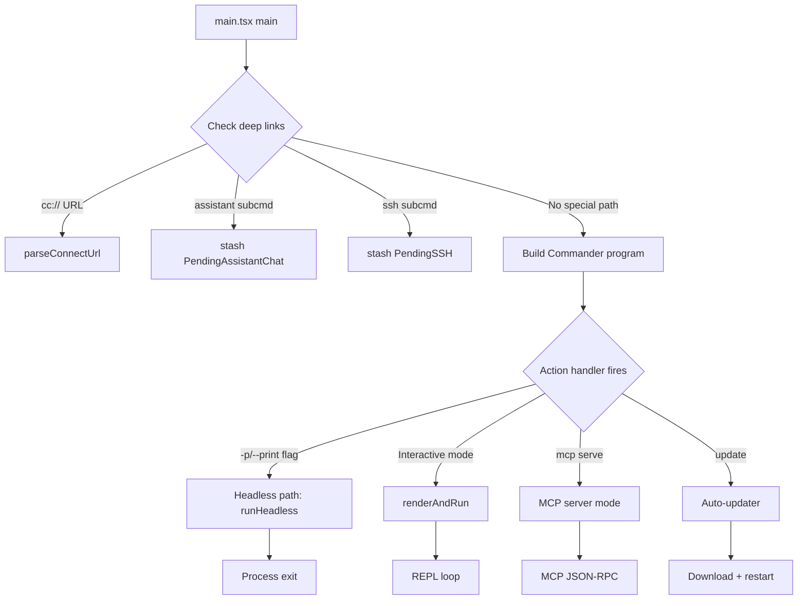
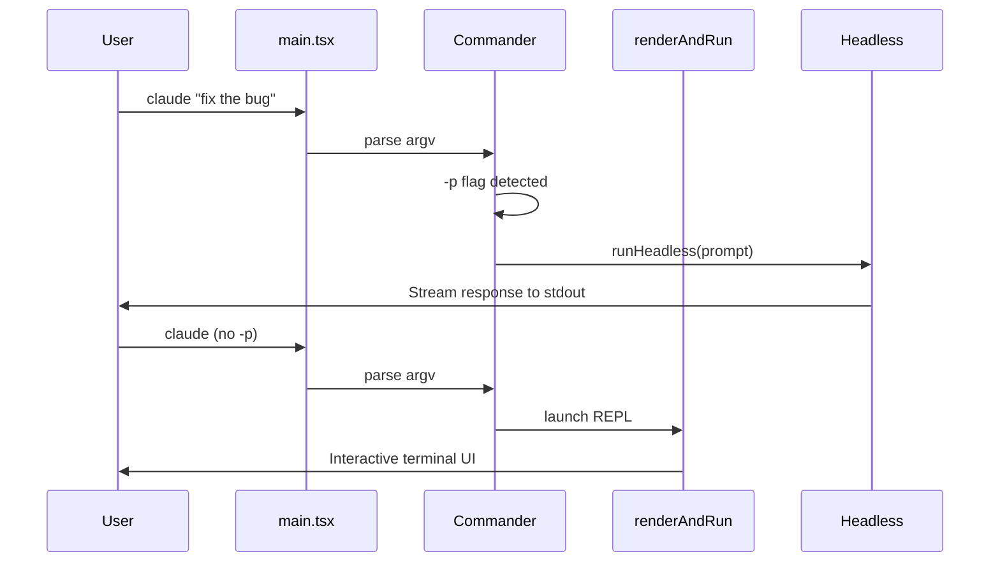

# `main.tsx` and the Command Router

## Overview

`src/main.tsx` is the largest single file in the cc codebase at approximately 4,700 lines of code. It serves as the command router, CLI parser, and orchestrator that bridges the initialization phase (chapter 5) with the interactive REPL (chapter 43). Despite its size, the file is not a monolith: it is structured as a Commander.js CLI definition, a `main()` function that handles early routing, and a collection of helper functions that prepare state for the interactive loop. This chapter examines the command routing decisions, the bifurcation between headless and interactive modes, and how `renderAndRun` launches the Ink-based terminal UI. HER's Configuration Surfaces (section 7) describe entry flags as a surface; `main.tsx` is where those flags are parsed, validated, and propagated into the global state.

The file begins with a critical performance optimization: before any imports are evaluated, three side-effect imports fire at the top of the file. `profileCheckpoint('main_tsx_entry')` marks the entry timestamp. `startMdmRawRead()` fires MDM subprocess calls (plutil/reg query) so they run in parallel with the remaining ~135ms of imports. `startKeychainPrefetch()` fires both macOS keychain reads (OAuth + legacy API key) in parallel, avoiding the ~65ms sequential cost that `isRemoteManagedSettingsEligible()` would otherwise incur inside `applySafeConfigEnvironmentVariables()`. These side effects at import time are intentional: they exploit the module evaluation phase to hide I/O latency.

## Data structures and contracts

### The `main()` function and Commander program

The `main()` function in `src/main.tsx` (`src/main.tsx:L585`) is the second entry point after `cli.tsx` has decided to load the full CLI. It begins with security hardening (preventing Windows PATH hijacking by setting `NoDefaultCurrentDirectoryInExePath`), signal handler registration, and deep-link URI parsing.

```typescript
// src/main.tsx:L585-L608
export async function main() {
  profileCheckpoint('main_function_start');

  // SECURITY: Prevent Windows from executing commands from current directory
  // This must be set before ANY command execution to prevent PATH hijacking attacks
  // See: https://docs.microsoft.com/en-us/windows/win32/api/processenv/nf-processenv-searchpathw
  process.env.NoDefaultCurrentDirectoryInExePath = '1';

  // Initialize warning handler early to catch warnings
  initializeWarningHandler();
  process.on('exit', () => {
    resetCursor();
  });
  process.on('SIGINT', () => {
    // In print mode, print.ts registers its own SIGINT handler that aborts
    // the in-flight query and calls gracefulShutdown; skip here to avoid
    // preempting it with a synchronous process.exit().
    if (process.argv.includes('-p') || process.argv.includes('--print')) {
      return;
    }
    process.exit(0);
  });
  profileCheckpoint('main_warning_handler_initialized');
```

The Commander.js program is defined inline with chained `.command()` and `.option()` calls. The program's action handler is the final dispatch point: it receives the parsed options and decides whether to run in headless mode or launch the interactive REPL. The Commander program also handles global options like `--model`, `--permission-mode`, `--settings`, and `--dangerously-skip-permissions`, which are parsed and applied before the action handler fires. One subtle aspect of the Commander integration is that some flags are consumed before the program is constructed: `eagerLoadSettings()` and the argv-stripping logic for deep links both mutate `process.argv` in place, so by the time Commander receives the arguments, certain flags have already been removed. This two-phase parsing means that Commander's help output does not list all the flags that `main()` actually processes -- a deliberate tradeoff between help-text clarity and the need for early flag handling.

### Pending state for feature-gated paths

Several feature-gated modes use a "pending state" pattern: a module-scope variable is set during argv parsing, then consumed later in the action handler. This avoids importing heavy modules (like the coordinator or KAIROS assistant) until they are needed.

```typescript
// src/main.tsx:L543-L552
type PendingConnect = {
  url: string | undefined;
  authToken: string | undefined;
  dangerouslySkipPermissions: boolean;
};
const _pendingConnect: PendingConnect | undefined = feature('DIRECT_CONNECT') ? {
  url: undefined,
  authToken: undefined,
  dangerouslySkipPermissions: false
} : undefined;
```

Similar patterns exist for `PendingAssistantChat` (`src/main.tsx:L555-L562`), `PendingSSH` (`src/main.tsx:L567-L584`), and others. The `feature()` gate at the variable declaration ensures that external builds never allocate the memory or include the type. When `feature('DIRECT_CONNECT')` returns false at build time, `_pendingConnect` is `undefined` and the entire DIRECT_CONNECT code path is dead-code-eliminated. This pattern is stronger than a runtime check: the code does not exist in the bundle at all. The choice to use module-scope variables rather than, say, a shared state object or a Map keyed by feature name is intentional: each pending type has a distinct shape, and co-locating the type definition with its feature gate makes it easy to audit which feature flags control which state. A Map-based approach would require casting and lose the type narrowing that TypeScript provides when the variable is `undefined`.

The `PendingSSH` type (`src/main.tsx:L566-L584`) is more complex than the others because SSH sessions need to propagate several CLI flags (`--resume`, `-c`) to the remote CLI. The `extraCliArgs` field stores these flags for forwarding, and the `local` field supports an end-to-end test mode that spawns the child CLI directly without SSH.

### Client type determination

After detecting interactive vs. non-interactive mode, `main()` determines the client type by checking a cascade of environment variables and entrypoint markers (`src/main.tsx:L818-L843`). The client type identifies how the user is accessing cc: via the CLI, the TypeScript SDK, the Python SDK, VS Code, GitHub Actions, Claude Desktop, or a remote session. The client type affects behavior like question preview format, telemetry attribution, and feature flag evaluation. For example, SDK sessions default to HTML preview format while CLI sessions default to Markdown, and GitHub Action sessions use a different telemetry pipeline than interactive sessions.

The `setQuestionPreviewFormat()` function (`src/main.tsx:L835-L843`) sets the format for the prompt preview that appears above the input field in the REPL. Desktop and CCR clients pass the preview format via `toolConfig`; when the feature is gated off they pass `undefined`, and the code must not override that with the Markdown default. This is an example of the careful feature-gating that permeates `main.tsx`: every default must respect the caller's explicit choice, even when the caller is another internal subsystem.

### Entrypoint tracking

The `initializeEntrypoint()` function (`src/main.tsx:L517-L540`) sets the `CLAUDE_CODE_ENTRYPOINT` environment variable based on how cc was invoked. This variable is used by analytics to distinguish between CLI sessions, SDK sessions, MCP server sessions, and GitHub Action sessions. The function checks for `mcp serve`, `CLAUDE_CODE_ACTION`, and interactive vs. non-interactive modes, and sets the entrypoint accordingly. This classification is important for understanding usage patterns: MCP server sessions are typically long-lived and automated, while CLI sessions are interactive and human-driven.

## Control flow

### Command routing decisions

After the `main()` function handles early security and deep-link parsing, it constructs a Commander.js program and defines subcommands. The routing logic follows a consistent pattern: parse flags, validate inputs, set bootstrap state, and dispatch to either a headless path or the interactive REPL.



The deep-link handling at the top of `main()` deserves attention. When the user clicks a `cc://` or `cc+unix://` URL, the OS protocol handler launches cc with the URL as an argument. The `main()` function detects this, parses the URL to extract the server address and auth token, stashes them in `_pendingConnect`, and strips the URL from `process.argv` so the Commander program does not see it (`src/main.tsx:L612-L642`). In headless mode (`-p`), the URL is rewritten to an internal `open` subcommand instead. The stripping is necessary because Commander would treat the URL as an unknown positional argument and print a usage error. The `parseConnectUrl()` helper extracts the protocol, host, and token from the URL string, and validates that the protocol is one of the expected schemes before populating the pending state. If the URL is malformed or the token is missing, the function throws an error that is caught by the top-level error handler in `cli.tsx`, which prints a user-friendly message and exits.

### Interactive mode setup and trust dialog

When the action handler determines that the user wants an interactive session, `showSetupScreens()` presents the trust dialog if the user has not previously accepted it for the current project directory. The trust dialog is a security measure (implementing HER section 12.1's runtime approval system) that asks the user to confirm they trust the project directory before cc runs any commands or accesses any files. The trust decision is persisted to the global config keyed by the project directory's path, so the user only needs to accept once per project.

After trust is established, `initializeTelemetryAfterTrust()` fires (chapter 5), followed by GrowthBook feature flag initialization. The feature flags determine which capabilities are active for the current session: fast mode, auto mode, cache editing, 1-hour prompt caching, and others. The flags are fetched from the GrowthBook API using the user's auth token, and the results are cached to disk for subsequent sessions. The `refreshGrowthBookAfterAuthChange()` function (`src/services/analytics/growthbook.ts`) re-evaluates flags when the user's auth state changes (e.g., after logging in via the `claude login` command).

### Headless vs interactive launch

The bifurcation between headless and interactive modes is the most consequential routing decision in `main.tsx`. When the `-p` or `--print` flag is set, the `action` handler calls `runHeadless()` which processes a single prompt, streams the response to stdout, and exits. When no headless flag is present, `renderAndRun()` launches the Ink-based terminal UI.



In headless mode, the query loop runs without Ink rendering, and the output is streamed directly to stdout as Markdown. The `--output-format json` flag changes the output to a structured JSON format suitable for programmatic consumption. The headless path also registers its own SIGINT handler that aborts the in-flight query and calls `gracefulShutdown()`, which is why the top-level SIGINT handler skips print mode (`src/main.tsx:L602-L604`). Without this skip, the top-level `process.exit(0)` would preempt the graceful shutdown, potentially leaving stale session files on disk and failing to emit the final telemetry events.

### Migration system

Before the Commander program parses argv, `main.tsx` runs a migration system (`src/main.tsx:L326-L352`) that updates user configuration to match the current version. The migration version is stored in the global config, and migrations are idempotent: running them twice is a no-op because the version check short-circuits.

```typescript
// src/main.tsx:L326-L352
const CURRENT_MIGRATION_VERSION = 11;
function runMigrations(): void {
  if (getGlobalConfig().migrationVersion !== CURRENT_MIGRATION_VERSION) {
    migrateAutoUpdatesToSettings();
    migrateBypassPermissionsAcceptedToSettings();
    migrateEnableAllProjectMcpServersToSettings();
    resetProToOpusDefault();
    migrateSonnet1mToSonnet45();
    migrateLegacyOpusToCurrent();
    migrateSonnet45ToSonnet46();
    migrateOpusToOpus1m();
    migrateReplBridgeEnabledToRemoteControlAtStartup();
    if (feature('TRANSCRIPT_CLASSIFIER')) {
      resetAutoModeOptInForDefaultOffer();
    }
    if ("external" === 'ant') {
      migrateFennecToOpus();
    }
    saveGlobalConfig(prev => prev.migrationVersion === CURRENT_MIGRATION_VERSION ? prev : {
      ...prev,
      migrationVersion: CURRENT_MIGRATION_VERSION
    });
  }
  // Async migration - fire and forget since it's non-blocking
  migrateChangelogFromConfig().catch(() => {
    // Silently ignore migration errors - will retry on next startup
  });
}
```

The comment `// @[MODEL LAUNCH]` at `src/main.tsx:L323` is a marker for developers: when a new model string is introduced, a migration must be added to update any user configs that reference the old string. Each migration is a simple function that reads the global config, checks for the old value, and writes the new value if found. The `saveGlobalConfig` call at the end of the migration block uses a conditional lambda that checks the version again, preventing a race condition where two concurrent cc processes both run the migrations and overwrite each other's changes. The conditional save is a form of optimistic concurrency control: the first process to complete the migration writes the new version number, and the second process's lambda sees that the version is already current and returns the unchanged config, making the second write a no-op.

The migration system also includes an async migration path. The `migrateChangelogFromConfig()` function (`src/main.tsx:L349-L351`) is fired as a void promise, so it does not block the startup path. Async migrations are used for operations that involve network I/O or heavy computation that would add unacceptable latency to the synchronous migration block. If an async migration fails, it is silently ignored and will be retried on the next startup.

### Model selection and configuration

The `getDefaultMainLoopModel()` function (`src/utils/model/model.ts`) determines the default model for the current session based on the user's subscription level, feature flags, and explicit configuration. The function checks for a user-specified model override (via `--model` flag or `model` setting), then falls back to the subscription-based default: Pro subscribers get Opus, while Free subscribers get Sonnet.

The `parseUserSpecifiedModel()` function (`src/utils/model/model.ts`) normalizes user-provided model strings. Users can specify models by short names (like "opus" or "sonnet"), which are mapped to the full API model identifiers (like "claude-opus-4-20250514" or "claude-sonnet-4-20250514"). The normalization also validates that the specified model is a valid API model identifier, rejecting typos and unsupported model names with a clear error message.

The `getModelDeprecationWarning()` function (`src/utils/model/deprecation.ts`) checks whether the user's configured model has been deprecated and returns a warning message if so. Deprecated models are still accepted by the API, but they may be removed in a future version. The warning is displayed in the REPL header to encourage users to migrate to the current model version.

### MCP server initialization

The `mcp serve` subcommand launches cc as an MCP (Model Context Protocol) server, allowing other applications (like Claude Desktop or VS Code) to use cc's tools. The MCP server mode is handled as a fast path in both `cli.tsx` and `main.tsx`: in `cli.tsx`, the `mcp serve` command is detected and dispatched before the full CLI loads; in `main.tsx`, the Commander program defines an `mcp` subcommand with a `serve` action that starts the JSON-RPC server.

The MCP server initialization includes loading all MCP server configurations from the settings system. The `getClaudeCodeMcpConfigs()` function (`src/services/mcp/config.js`) reads MCP server definitions from user settings, project settings, and the Claude AI API (for subscribers). Each server definition includes the command to start the server, the arguments, the environment variables, and the tool capabilities. The servers are started lazily when their tools are first needed, and their lifecycle is managed by the `McpClientManager` (`src/services/mcp/client.ts`).

### Plugin and skill initialization

After the REPL launches, `startDeferredPrefetches()` also triggers plugin and skill initialization. The `initializeVersionedPlugins()` function (`src/utils/plugins/installedPluginsManager.ts`) loads installed plugins from the `~/.claude/plugins/` directory and registers their tools and resources with the MCP system. The `initBundledSkills()` function (`src/skills/bundled/index.ts`) registers the built-in skills that ship with cc.

Plugins and skills are subject to the same security model as MCP servers: they are treated as untrusted code (HER section 12.4, "Supply Chain Attacks via MCP Servers/Skills"). The permission system (chapter 32) gates access to plugin-provided tools, and the sandbox system (chapter 33) restricts what plugin processes can do on the host system. The `getManagedPluginNames()` function (`src/utils/plugins/managedPlugins.ts`) returns the list of plugins that are managed by the organization's IT department, which are exempt from certain permission checks because they have been vetted by the organization.

### Deferred prefetches

`startDeferredPrefetches()` (`src/main.tsx:L388-L431`) runs after the REPL's first render, launching background I/O that does not need to complete before the user sees the prompt. This includes user info, git context, AWS/GCP credentials, file counts, analytics gates, and change detectors. The `--bare` flag and `CLAUDE_CODE_EXIT_AFTER_FIRST_RENDER` env var both skip these prefetches, since they would add overhead to scripted invocations.

The `prefetchSystemContextIfSafe()` function (`src/main.tsx:L360-L380`) is a security-conscious wrapper: it only runs git commands (which can execute arbitrary code via hooks and config) after the trust dialog has been accepted or in non-interactive mode where trust is implicit. This implements HER section 12's guidance on supply chain attacks via configuration. The function checks `checkHasTrustDialogAccepted()` before calling `getSystemContext()`, which in turn runs `git status`, `git log`, and other git commands that may invoke `core.fsmonitor` or `diff.external` hooks. In non-interactive mode, trust is implicit because the user has explicitly invoked the command.

The deferred prefetches also include `initializeAnalyticsGates()`, which fires GrowthBook feature flag evaluations for the current user. These evaluations determine which features are active (like fast mode, auto mode, and cache editing) and must complete before the first API call. However, the GrowthBook SDK caches results to disk, so the first call after a cache hit is nearly instant; only the first-ever call for a new user requires a network round-trip.

### Eager settings loading

The `eagerLoadSettings()` function (`src/main.tsx:L502-L516`) parses the `--settings` and `--setting-sources` flags before `init()` is called. This is necessary because settings affect which configuration sources are loaded during initialization. If `--setting-sources` disables `policySettings`, for example, `init()` must know this before it attempts to load managed settings. The function uses `eagerParseCliFlag()` to extract the flag value from `process.argv` without loading the full Commander program, which would be too expensive at this early stage.

### Stdin handling for headless mode

The `getInputPrompt()` function (`src/main.tsx:L857-L883`) handles piped stdin for headless mode. When stdin is not a TTY and the command is not `mcp`, the function reads stdin data and appends it to the prompt. This allows users to pipe content into cc: `cat file.txt | claude -p "summarize this"`. The function includes a 3-second timeout (`peekForStdinData`) that detects when stdin is an inherited pipe from a parent process that is not writing data. The timeout prevents cc from hanging indefinitely when launched as a subprocess without explicit stdin handling. When the timeout fires, a warning is printed to stderr explaining the situation and suggesting either `< /dev/null` to skip stdin or waiting longer for slow producers.

### The `run()` function and Commander program

The `run()` function (`src/main.tsx:L884-L900`) constructs the Commander.js program with a sorted help configuration. The `createSortedHelpConfig()` helper sorts options by their long flag name, making the `--help` output more navigable. The Commander program defines the main action handler and all subcommands (mcp, update, etc.). The action handler is the final dispatch point that receives parsed options and decides whether to run in headless mode or launch the interactive REPL.

The Commander program also handles global options that must be parsed before the action handler fires. These include `--model` (which sets `mainLoopModelOverride`), `--permission-mode` (which sets the initial permission mode), and `--dangerously-skip-permissions` (which enables unrestricted mode). Each of these options has a validation function that checks the value before applying it. The `--model` option, for example, calls `parseUserSpecifiedModel()` to normalize the model string and `normalizeModelStringForAPI()` to ensure it is a valid API model identifier.

```typescript
// src/main.tsx:L818-L834 (client type determination)
const clientType = (() => {
  if (isEnvTruthy(process.env.GITHUB_ACTIONS)) return 'github-action';
  if (process.env.CLAUDE_CODE_ENTRYPOINT === 'sdk-ts') return 'sdk-typescript';
  if (process.env.CLAUDE_CODE_ENTRYPOINT === 'sdk-py') return 'sdk-python';
  if (process.env.CLAUDE_CODE_ENTRYPOINT === 'sdk-cli') return 'sdk-cli';
  if (process.env.CLAUDE_CODE_ENTRYPOINT === 'claude-vscode') return 'claude-vscode';
  if (process.env.CLAUDE_CODE_ENTRYPOINT === 'local-agent') return 'local-agent';
  if (process.env.CLAUDE_CODE_ENTRYPOINT === 'claude-desktop') return 'claude-desktop';
  const hasSessionIngressToken = process.env.CLAUDE_CODE_SESSION_ACCESS_TOKEN || process.env.CLAUDE_CODE_WEBSOCKET_AUTH_FILE_DESCRIPTOR;
  if (process.env.CLAUDE_CODE_ENTRYPOINT === 'remote' || hasSessionIngressToken) {
    return 'remote';
  }
  return 'cli';
})();
```

## Edge cases and failure modes

### Debug detection and process exit

`main.tsx` includes a top-level check (`src/main.tsx:L266-L271`) that detects if the process is being debugged via `--inspect` flags or the Node.js inspector. In external builds, this triggers an immediate `process.exit(1)`. This is a security measure to prevent live debugging of production binaries, which could expose internal implementation details and API keys.

### Settings flag and prompt cache interaction

The `loadSettingsFromFlag()` function (`src/main.tsx:L432-L483`) creates a content-hash-based temp file path for inline JSON settings, rather than a random UUID. This is critical for prompt cache efficiency: the settings path ends up in the Bash tool's sandbox deny list, which is part of the tool description sent to the API. A random UUID per subprocess would change the tool description on every query, invalidating the cache prefix and causing a 12x input token cost penalty (`src/main.tsx:L447-L456`). The content hash ensures identical settings produce the same path across process boundaries. The hash is computed from the entire JSON string, so any change to the settings produces a different path, but identical settings across multiple `query()` calls in the same SDK session share the same path and thus the same cache prefix.

### SIGINT handling in print mode

In headless/print mode, the SIGINT handler is skipped (`src/main.tsx:L602-L604`) because `print.ts` registers its own handler that aborts the in-flight query and calls `gracefulShutdown`. Without this skip, the top-level `process.exit(0)` would preempt the graceful shutdown, potentially leaving stale session files on disk. The print mode handler also sends a cancellation event to the API so that the streaming response is properly terminated rather than left in a half-finished state.

### KAIROS and SSH pending state

The `PendingAssistantChat` and `PendingSSH` types use a pattern where `feature()` gates control whether the module-scope variable is even allocated. When `feature('KAIROS')` returns false, `_pendingAssistantChat` is `undefined` and all code that references it is dead-code-eliminated. This is stronger than a runtime check: the code does not exist in the bundle at all. The KAIROS pending state is parsed from argv in `main()` by checking if the first positional argument is `assistant`. Position-0 checking is deliberate: using `indexOf` would false-positive on `claude -p "explain assistant"`, where "assistant" is part of the prompt, not a subcommand.

### macOS URL scheme handling

When macOS LaunchServices launches the cc `.app` bundle via a URL scheme, the URL arrives via Apple Event rather than `process.argv`. The detection relies on `process.env.__CFBundleIdentifier === 'com.anthropic.claude-code-url-handler'` (`src/main.tsx:L666-L676`), which macOS sets to the launching bundle's ID. This is cheaper than importing and guessing with heuristics, and more reliable than checking for URL-related arguments in `process.argv` (which may not be present for Apple Event launches).

### SSH flag forwarding

The `PendingSSH` type and its argv parsing logic (`src/main.tsx:L700-L795) implement a sophisticated flag-forwarding mechanism for SSH sessions. When the user runs `claude ssh host /dir`, the SSH flags (`--permission-mode`, `--dangerously-skip-permissions`, `--local`) are extracted from `process.argv` and stashed in `_pendingSSH`, then stripped from `argv` so the Commander program does not see them. Session-resume flags (`--continue`, `-c`, `--resume`) and `--model` are forwarded to the remote CLI's initial spawn via `extraCliArgs`. This ensures that the remote CLI starts with the same configuration as the local invocation, maintaining consistency across the SSH boundary.

The `extractFlag` helper function (`src/main.tsx:L739-L759`) handles both `--flag value` and `--flag=value` syntax, normalizing them into a consistent format for the remote CLI. The function also handles the `-c` short flag by rewriting it to `--continue` (the remote CLI's long form), ensuring that short flags typed by the user are properly translated.

Headless mode (`-p`/`--print`) is explicitly rejected for SSH sessions (`src/main.tsx:L786-L789`) because SSH sessions need the local REPL to drive them (interrupt handling, permission dialogs). Without this guard, a user running `claude ssh host -p "prompt"` would get local execution instead of the intended remote execution, potentially running the prompt against the wrong filesystem.

## Where cc diverges from the published pattern

HER section 7 describes entry flags as one of six configuration surfaces. cc implements this faithfully, but adds a layer of sophistication not described in the pattern: the `--setting-sources` flag (`src/main.tsx:L484-L496`) allows users to selectively disable setting sources, which is useful for testing and for environments where certain configuration layers should be ignored. This is a cc-specific extension not found in the general pattern.

The migration system in `main.tsx` is also cc-specific. HER does not describe how to handle configuration format changes across versions. cc's approach -- a versioned, idempotent migration system -- is a pragmatic solution for a tool that is updated frequently and whose configuration format evolves with each model release.

HER section 7.1 notes the ETH Zurich finding that "context files tend to reduce task success rates compared to providing no repository context, while also increasing inference cost by over 20%." cc's deferred prefetch system partially addresses this by only loading context (git status, user info, file counts) after the first render, so it does not add to the startup latency that the user perceives. However, cc does not implement the "minimal requirements" recommendation from the ETH Zurich study; its CLAUDE.md files can be arbitrarily long.

HER section 7.5 describes hooks as lifecycle events. cc implements hooks through the `processSessionStartHooks()` and `processSetupHooks()` functions called in `main.tsx`, which run user-defined shell commands at the `SessionStart` and `Setup` lifecycle points. These are the earliest lifecycle hooks available, running before the first API call, and they can be used for environment setup tasks like activating virtual environments or setting environment variables.

## Developer takeaways for building a long-running agent

1. **Separate the entry router from the command handlers.** `cli.tsx` handles fast-path dispatch with zero imports; `main.tsx` handles the full Commander program. This two-tier routing ensures that `--version` is instant while the full CLI loads only when needed.

2. **Use content hashes for temp file paths that appear in prompts.** Random UUIDs in tool descriptions or system prompts will bust the API provider's prompt cache, causing significant cost increases. Content hashes produce the same path for the same content, preserving cache hits across process boundaries.

3. **Run migrations before the CLI parser.** Configuration format changes must be applied before the Commander program reads flags, because some flags (like `--model`) reference model strings that may have been renamed.

4. **Defer prefetches until after first render.** Background I/O (user info, git context, credential prefetching) should not block the initial paint. The user is still typing their first prompt, so this work can hide behind their think-and-type latency.

5. **Use the "pending state" pattern for feature-gated paths.** Module-scope variables with `feature()` guards let you parse argv early without importing the heavy modules that implement the feature. This keeps the import DAG clean and the startup path fast.

6. **Gate dangerous subprocesses behind trust.** Git commands can execute arbitrary code via hooks and config. Only run them after the user has accepted the trust dialog, or in non-interactive mode where trust is implicit.

7. **Handle SIGINT differently per mode.** Headless mode needs a graceful shutdown that cancels the in-flight query and emits final telemetry. Interactive mode can afford a simpler `process.exit(0)`. The top-level handler must know which mode is active to avoid preempting mode-specific cleanup.
