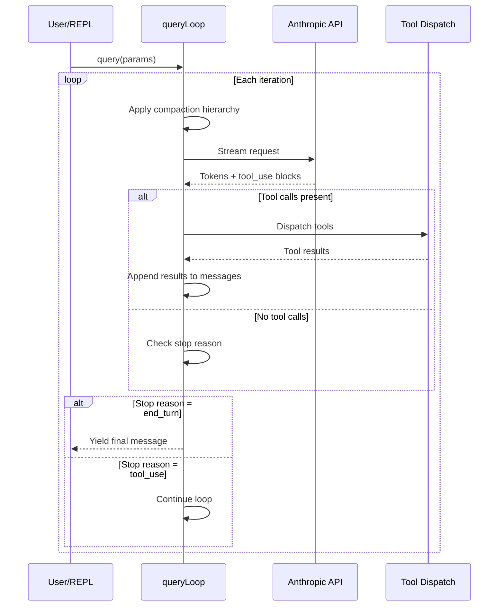
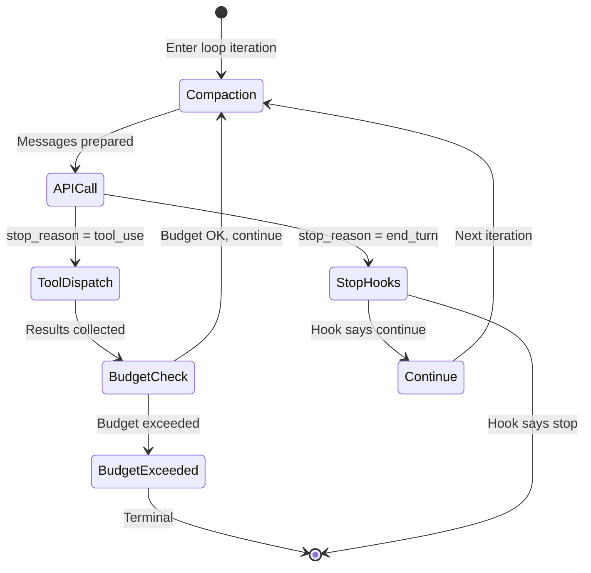
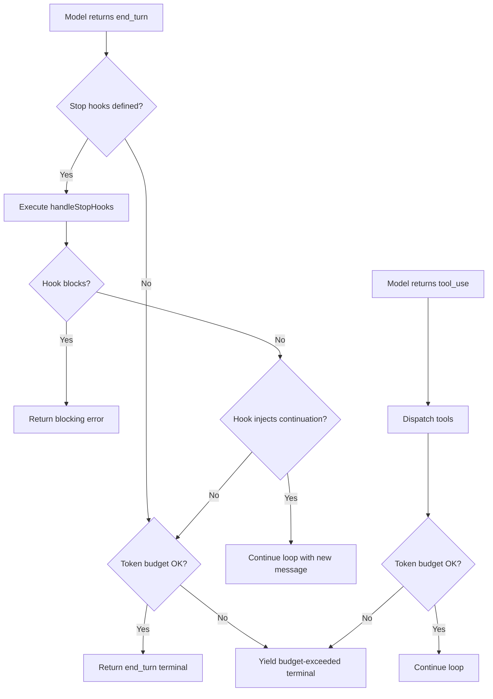

# The Query Loop: Heartbeat of the Agent

## Overview

The query loop is the core execution engine of cc. Implemented as an async generator function `queryLoop()` in `src/query.ts`, it orchestrates the cycle of sending a prompt to the Anthropic API, receiving streamed tokens, dispatching tool calls, collecting tool results, and repeating until the model produces a terminal stop reason. This chapter walks through the loop's structure, its interaction with the compaction hierarchy, token budgets, stop hooks, and the state machine that governs transitions between iterations. HER's Pattern 6 (Explore-Plan-Act Loop) describes the three-phase model; cc's query loop is its concrete realization, with compaction and budget management woven into every iteration.

The query loop is the most performance-critical and complexity-dense module in the codebase. At approximately 1,700 lines, it must handle streaming token production, concurrent tool dispatch, multi-level compaction, budget enforcement, and error recovery -- all while maintaining strict invariants about message ordering, thinking block preservation, and prompt cache consistency. Every design decision in the loop has been shaped by production incidents: context rot from unbounded conversation growth, infinite retry loops from unrecoverable errors, premature completion from over-eager model stops, and cache busting from compaction-induced message reordering.

## Data structures and contracts

### QueryParams: the loop's input contract

The `query()` function accepts a `QueryParams` object that encapsulates everything the loop needs to run one user turn:

```typescript
// src/query.ts:L181-L199
export type QueryParams = {
  messages: Message[]
  systemPrompt: SystemPrompt
  userContext: { [k: string]: string }
  systemContext: { [k: string]: string }
  canUseTool: CanUseToolFn
  toolUseContext: ToolUseContext
  fallbackModel?: string
  querySource: QuerySource
  maxOutputTokensOverride?: number
  maxTurns?: number
  skipCacheWrite?: boolean
  // API task_budget (output_config.task_budget, beta task-budgets-2026-03-13).
  // Distinct from the tokenBudget +500k auto-continue feature. `total` is the
  // budget for the whole agentic turn; `remaining` is computed per iteration
  // from cumulative API usage.
  taskBudget?: { total: number }
  deps?: QueryDeps
}
```

The `deps` field enables dependency injection for testing. When absent, `productionDeps()` provides the real implementations of microcompact, autocompact, API streaming, and tool execution. The `taskBudget` field is distinct from the token budget system: it represents an API-level budget for the whole agentic turn, with `remaining` computed per iteration from cumulative API usage. This allows the Anthropic API to enforce its own budget independently of cc's internal token counting.

The `querySource` field identifies the origin of the query (REPL main thread, agent subagent, resume, etc.) and affects behavior like content replacement persistence and memory prefetch routing. When `querySource` is `'agent'`, content replacement records are persisted so they can be read back on resume; when it is a one-shot agent call, records are ephemeral because the caller will never read them.

### State: mutable cross-iteration state

The loop maintains a `State` type that is destructured at the top of each iteration and reassigned at each `continue` site:

```typescript
// src/query.ts:L204-L217
type State = {
  messages: Message[]
  toolUseContext: ToolUseContext
  autoCompactTracking: AutoCompactTrackingState | undefined
  maxOutputTokensRecoveryCount: number
  hasAttemptedReactiveCompact: boolean
  maxOutputTokensOverride: number | undefined
  pendingToolUseSummary: Promise<ToolUseSummaryMessage | null> | undefined
  stopHookActive: boolean | undefined
  turnCount: number
  // Why the previous iteration continued. Undefined on first iteration.
  // Lets tests assert recovery paths fired without inspecting message contents.
  transition: Continue | undefined
}
```

The `transition` field records why the previous iteration continued, letting tests assert recovery paths without inspecting message contents. The `maxOutputTokensRecoveryCount` tracks how many times the loop has recovered from a `max_output_tokens` truncation, capping at `MAX_OUTPUT_TOKENS_RECOVERY_LIMIT = 3` (`src/query.ts:L164`). The `pendingToolUseSummary` is a promise that resolves to a human-readable summary of tool calls, produced by the tool use summary generator while the next API call streams. This overlap hides the latency of summary generation behind the API round-trip.

### The async generator protocol

The `query()` function is an `async function*` generator that yields events to the caller and returns a `Terminal` result:

```typescript
// src/query.ts:L219-L239
export async function* query(
  params: QueryParams,
): AsyncGenerator<
  | StreamEvent
  | RequestStartEvent
  | Message
  | TombstoneMessage
  | ToolUseSummaryMessage,
  Terminal
> {
  const consumedCommandUuids: string[] = []
  const terminal = yield* queryLoop(params, consumedCommandUuids)
  // Only reached if queryLoop returned normally. Skipped on throw (error
  // propagates through yield*) and on .return() (Return completion closes
  // both generators).
  for (const uuid of consumedCommandUuids) {
    notifyCommandLifecycle(uuid, 'completed')
  }
  return terminal
}
```

The `yield*` delegation to `queryLoop()` means that events yielded by the inner generator are transparently passed through to the outer consumer. The `consumedCommandUuids` array tracks slash commands that were started during the turn, and notifies them as completed only if `queryLoop` returns normally (not on throw or early return). This ensures that slash commands that were interrupted by an error do not receive a spurious completion notification.

The `Terminal` return type encodes the reason the loop stopped: `end_turn` (the model declared completion), `tool_use` (the model requested a tool call, which will be handled by the next iteration), `max_tokens` (the model ran out of output tokens), `budget_exceeded` (the token budget was exhausted), or `error` (an unrecoverable error occurred). The REPL uses the `Terminal` value to decide what to do next: for `end_turn`, it waits for the next user input; for `budget_exceeded`, it displays a warning; for `error`, it shows the error message.

The yielded event types serve different consumers. `StreamEvent` events carry streaming tokens and tool_use blocks that are rendered in real-time by the Ink UI. `RequestStartEvent` events mark the beginning of each API call, allowing the REPL to display a loading indicator. `Message` events carry completed messages (assistant responses, user messages, tool results) that are appended to the conversation history. `TombstoneMessage` events mark messages that have been removed by compaction, allowing the REPL to update its state without re-reading the full message array. `ToolUseSummaryMessage` events carry the human-readable tool use summary generated by the tool use summary generator.

## Control flow

### The main loop structure

The `queryLoop()` function's outer structure is an infinite `while(true)` loop. Each iteration follows this sequence:

1. **Destructure state** -- read all fields from the `state` object
2. **Start prefetches** -- skill discovery and memory prefetch in parallel
3. **Yield request start** -- emit `{ type: 'stream_request_start' }`
4. **Apply content budget** -- trim oversized tool results via `applyToolResultBudget()`
5. **Apply snip compact** -- remove `<history_snip>` blocks
6. **Apply microcompact** -- cached compaction pass for tool results
7. **Apply context collapse** -- project collapsed context view
8. **Apply autocompact** -- full compaction if token threshold exceeded
9. **Stream API response** -- call the Anthropic API with prepared messages
10. **Process tool calls** -- dispatch tools and collect results
11. **Check stop hooks** -- evaluate `handleStopHooks()`
12. **Check token budget** -- enforce `checkTokenBudget()`
13. **Continue or return** -- update `state` and loop

The destructure-and-reassign pattern for `State` is worth examining in detail. At the top of each iteration, all fields are read from the `state` object into local variables. At each `continue` site, a new `state` object is constructed from the current values of those local variables (with modifications). This pattern makes the state transitions explicit: every `continue` site must enumerate the fields it changes, and the unchanged fields are carried forward by reference. The `transition` field records which recovery path fired, enabling tests to assert that specific code paths were taken without inspecting message contents.



### Compaction hierarchy within the loop

The query loop applies four layers of compaction in a specific order before each API call. This order matters: each layer operates on the output of the previous one, and the layers are designed to compose cleanly. The compaction hierarchy is cc's primary defense against context rot (HER failure mode 6.1), where the model's performance degrades as key information falls into mid-window positions and the agent begins re-solving problems it has already addressed.

1. **Snip compact** (`src/query.ts:L401-L409`): Removes `<history_snip>` blocks from older messages. Runs before microcompact because snip operates on raw message content, not tool_use_id. The `snipTokensFreed` value is plumbed to autocompact so its threshold check reflects what snip removed; `tokenCountWithEstimation` alone cannot see the freed tokens because it reads usage from the protected-tail assistant, which survives snip unchanged. Snip compact is the cheapest layer: it requires no API call and operates by stripping marked blocks from the message array. The `<history_snip>` blocks are inserted by the history system when it truncates long tool outputs, and snip compact removes them to free up the tokens they occupy.

2. **Microcompact** (`src/query.ts:L413-L425`): Cached compaction that trims tool results and applies content replacement. Operates by tool_use_id, so it is invisible to snip. For cached microcompact (cache editing), the boundary message is deferred until after the API response so actual `cache_deleted_input_tokens` can be used. Microcompact is the second-cheapest layer: it may require an API call for the initial compaction of each tool result, but subsequent iterations reuse the cached result. The microcompact system is described in detail in chapter 28.

3. **Context collapse** (`src/query.ts:L440-L447`): Projects a collapsed view of the conversation, replacing granular messages with summaries. Runs before autocompact so that if collapse gets the context under the autocompact threshold, the more expensive autocompact is a no-op. Nothing is yielded -- the collapsed view is a read-time projection over the REPL's full history. Context collapse is the third-cheapest layer: it requires no API call and operates by transforming the message array into a different view. The collapse system groups consecutive messages by type (e.g., multiple Bash tool calls in a row) and replaces them with a single summary message.

4. **Autocompact** (`src/query.ts:L453-L467`): Full model-based compaction that summarizes the conversation when the token count exceeds the context window threshold. This is the most expensive compaction layer because it requires an API call to generate the summary. The compaction result includes pre-compact and post-compact token counts, which are logged to analytics via `tengu_auto_compact_succeeded`. Autocompact is the last resort: if the previous three layers could not get the context under the threshold, autocompact summarizes the entire conversation into a compact summary that replaces all but the most recent messages.

The `calculateTokenWarningState()` function (`src/services/compact/autoCompact.ts`) computes the current token usage as a percentage of the context window and determines whether autocompact should be triggered. The function considers the total token count (input + output from the last API response), the context window size for the current model, and a configurable threshold (typically 80%). When the threshold is exceeded, the function returns a warning state that triggers autocompact on the next iteration. The threshold is not 100% because the model needs room for the response; triggering autocompact at 100% would leave no space for the model to generate output.

### Query loop state machine

The transitions between loop iterations are governed by the model's stop reason and the results of stop hooks and token budget checks:



### Stop hooks and token budget evaluation

The stop-hook and token-budget checks form the loop's terminal evaluation phase. After the model produces a response with `stop_reason = end_turn`, the loop does not immediately return. Instead it runs a two-stage evaluation: first the stop hooks, then the token budget. This ordering matters because stop hooks may inject continuation messages that trigger additional API calls, and those calls may themselves consume enough tokens to exhaust the budget. The flowchart below shows the decision logic:



The stop-hook evaluation path also handles teammate-specific hooks. When the query is running inside a teammate context (a subagent participating in a multi-agent team), `handleStopHooks()` additionally runs `TaskCompleted` hooks for any in-progress tasks owned by that teammate, followed by `TeammateIdle` hooks. These hooks allow the team coordinator to detect when a teammate has finished its work and can be reassigned, or when a teammate has been idle too long and may need prompting.

### Stop hook evaluation

The `handleStopHooks()` function (`src/query/stopHooks.ts`) evaluates user-defined hooks that fire when the model declares it is done. This implements HER's Deterministic Lifecycle Hooks (Pattern 12) at the `Stop` event. If a stop hook returns a "continue" signal, the loop re-enters the compaction phase and makes another API call, effectively preventing premature completion (HER failure mode 6.2).

Stop hooks are a critical defense against the model declaring "I'm done" when the task is not actually complete. A common pattern is a `Stop` hook that checks whether all items in a todo list have been marked as completed, and if not, injects a continuation message telling the model to keep working. This is a cc-specific implementation of HER's recommendation to use "a comprehensive JSON feature list with all items initially marked 'failing'." The stop hook pattern is more flexible than a fixed JSON feature list because it can evaluate arbitrary conditions, including checking the file system for expected output files or running tests to verify completion.

The `handleStopHooks()` function is itself an async generator, yielding progress messages and attachment messages as hooks execute. This design allows the REPL to display real-time feedback while hooks are running:

```typescript
// src/query/stopHooks.ts:L65-L81
export async function* handleStopHooks(
  messagesForQuery: Message[],
  assistantMessages: AssistantMessage[],
  systemPrompt: SystemPrompt,
  userContext: { [k: string]: string },
  systemContext: { [k: string]: string },
  toolUseContext: ToolUseContext,
  querySource: QuerySource,
  stopHookActive?: boolean,
): AsyncGenerator<
  | StreamEvent
  | RequestStartEvent
  | Message
  | TombstoneMessage
  | ToolUseSummaryMessage,
  StopHookResult
>
```

The function returns a `StopHookResult` containing `blockingErrors` (messages from hooks that blocked the turn) and `preventContinuation` (whether the hook explicitly stopped the loop from continuing). If `preventContinuation` is true, the loop terminates regardless of other conditions; if `blockingErrors` is non-empty but `preventContinuation` is false, the loop appends the error messages and continues so the model can respond to them.

The `stopHookActive` field in the `State` type tracks whether a stop hook is currently being evaluated. This prevents re-entrant hook evaluation: if a stop hook triggers a new API call that also ends with `end_turn`, the loop does not evaluate stop hooks again for the same turn. This prevents infinite loops where a poorly written stop hook keeps injecting continuation messages indefinitely.

### The tool use summary generator

The `generateToolUseSummary()` function (`src/services/toolUseSummary/toolUseSummaryGenerator.ts`) produces a human-readable summary of tool calls while the next API call is streaming. The summary is generated asynchronously and stored in the `pendingToolUseSummary` field of `State`. When the next API response arrives, the summary is yielded to the REPL for display. This overlap hides the latency of summary generation behind the API round-trip, providing a smoother user experience.

The tool use summary is important for the REPL's UX: it gives the user a concise overview of what the agent did in the previous iteration, even when the actual tool results are complex and verbose. The summary includes the tool names, the key parameters, and a brief description of the result. For example, a Bash tool call that ran `npm test` would be summarized as "Ran npm test: 12 tests passed, 2 failed" rather than including the full test output.

### Message normalization and API preparation

Before sending messages to the API, the query loop applies several normalization steps. The `normalizeMessagesForAPI()` function (`src/utils/messages.ts`) ensures that messages conform to the API's expected format: assistant messages must not contain tool_result blocks, user messages must not contain tool_use blocks, and the message ordering must be strictly alternating (user, assistant, user, assistant). The normalization also strips internal metadata fields that are not part of the API contract (like `uuid` and `timestamp`), reducing the request size and avoiding potential API errors from unrecognized fields.

The `stripSignatureBlocks()` function removes signature blocks from assistant messages. Signature blocks are internal markers used by cc to track which parts of the response were generated by the model and which were injected by the system. They are not part of the API contract and would cause validation errors if included in the request.

The `stripAdvisorBlocks()` function removes advisor blocks from assistant messages. Advisor blocks are generated by the advisor system (which runs a separate model in parallel to provide suggestions). These blocks are used internally by cc but must be stripped before the messages are sent to the API, because the API would treat them as regular content and potentially become confused by the interleaved advisor and primary model outputs.

### Token budget checks

The `checkTokenBudget()` function (`src/query/tokenBudget.ts`) enforces per-turn and per-session token limits. When a budget is exceeded, the loop terminates gracefully, yielding a budget-exceeded message. The `createBudgetTracker()` function (`src/query/tokenBudget.ts`) maintains running totals that are checked after each API response.

The token budget system implements HER's back-pressure mechanisms (section 7.6). When the budget is approaching its limit, the loop can take corrective actions: increasing the model's `max_tokens` to let it finish faster, or triggering compaction to reduce the input token count. The `snapshotOutputTokensForTurn()` function (`src/bootstrap/state.ts:L733-L737`) captures the output token count at the start of each turn and computes the per-turn budget. The `budgetContinuationCount` counter tracks how many times the budget has been exceeded and continued, capping at a configurable limit to prevent indefinite budget extensions.

### Content replacement and tool result budget

Before compaction runs, `applyToolResultBudget()` (`src/query.ts:L379-L394`) enforces per-message limits on aggregate tool result size. This is the implementation of observation masking (HER section 13.3), which JetBrains Research verified provides a 52% cost reduction by hiding irrelevant tool outputs. The function operates on the content replacement state, which tracks which tool results have been trimmed and what content was removed. The replacement records are persisted only for query sources that read records back on resume (agent routes and REPL main thread), not for ephemeral forked agent calls.

The observation masking pattern is crucial for long-running agents. A single `git diff` command can produce tens of thousands of lines of output, most of which is irrelevant to the current task. Without observation masking, this output would be sent to the API on every subsequent request, consuming input tokens and potentially confusing the model with stale information. The tool result budget enforces a per-message limit, replacing oversized results with a summary that preserves the essential information while discarding the noise.

### Tool dispatch and streaming tool execution

After the API response is received, the query loop processes any tool_use blocks in the assistant message. The `runTools()` function (`src/services/tools/toolOrchestration.ts`) dispatches tool calls, potentially in parallel for tools that support concurrent execution. The `StreamingToolExecutor` class (`src/services/tools/StreamingToolExecutor.ts`) handles tools that produce output incrementally (like the Bash tool running a long-running command), yielding partial results to the query loop as they become available.

The tool dispatch phase maintains several invariants. First, every tool_use block must have a corresponding tool_result block in the next user message. The `ensureToolResultPairing()` function (`src/utils/messages.ts`) verifies this invariant and creates synthetic error results for any orphaned tool_use blocks. Second, tool results must be appended to the message array in the same order as the tool_use blocks that triggered them. Third, if a tool call is interrupted (e.g., by a user pressing Escape), the interrupted tool must still produce a tool_result block with an error message, so the API does not receive an orphaned tool_use.

### Post-sampling hooks

The `executePostSamplingHooks()` function (`src/utils/hooks/postSamplingHooks.ts`) runs after the model produces its response but before tool dispatch. These hooks can inspect the model's output and modify it before it is processed further. A common use case is a `PostToolUse` hook that reformats code after an edit, or a `PreToolUse` hook that validates tool parameters before execution. The post-sampling hooks are distinct from stop hooks: they run on every iteration, not just when the model declares completion.

### Task budget across compaction boundaries

The `taskBudgetRemaining` variable (`src/query.ts:L291`) tracks the remaining API task budget across compaction boundaries. After a compaction, the server sees only the summary and would under-count spending; `taskBudgetRemaining` tells the server the pre-compact context that was summarized away. This variable is loop-local (not on `State`) to avoid touching the seven `continue` sites, and is cumulative across multiple compacts: each subtracts the final context at that compact's trigger point. The task budget is distinct from the token budget because it represents a server-side constraint (the Anthropic API's own budget enforcement) rather than a client-side constraint.

### QueryEngine: the integration layer

The `QueryEngine` class (`src/QueryEngine.ts`) wraps the raw `query()` generator and provides the integration layer that the SDK, headless mode, and the REPL use to invoke the query loop. One `QueryEngine` instance is created per conversation; each `submitMessage()` call starts a new turn within the same conversation. State (messages, file cache, usage) persists across turns within the engine's lifetime.

The `QueryEngine` performs several responsibilities that sit above the raw query loop:

1. **System prompt assembly**: `submitMessage()` calls `fetchSystemPromptParts()` to build the system prompt from tools, model selection, and MCP clients. If a custom system prompt is provided, it replaces the default prompt; an appended system prompt layers on top. A memory-mechanics prompt is injected when `CLAUDE_COWORK_MEMORY_PATH_OVERRIDE` is set, teaching the model how to use the memory directory.

2. **User input processing**: The `processUserInput()` function handles slash commands, model switches, and other user-facing transformations before the query loop runs. Slash commands that mutate the message array (like `/force-snip`) write back through `setMessages()`, which in headless mode writes to the engine's `mutableMessages` array.

3. **Session persistence**: The engine ensures that the user's message is written to the transcript before entering the query loop. This is critical for `--resume`: if the process is killed before the API responds, the transcript still contains the user's message, making the session resumable. In `--bare` mode, the transcript write is fire-and-forget to avoid blocking the critical path.

4. **SDK message normalization**: The raw query loop yields `Message` objects with cc-internal fields (UUIDs, timestamps, tool-use-context references). The `QueryEngine` normalizes these into `SDKMessage` objects that strip internal fields, add session IDs, and handle ANSI stripping for headless consumers.

5. **Budget and cost tracking**: The engine checks `maxBudgetUsd` after each message from the query loop, yielding an `error_max_budget_usd` result if the cost exceeds the limit. It also tracks `totalUsage` by accumulating per-message usage from `message_start` and `message_delta` stream events.

6. **Snip replay**: When the `HISTORY_SNIP` feature is enabled, the engine receives a `snipReplay` callback that replays snip boundary messages on the internal `mutableMessages` store. This prevents stale snip markers from persisting across turns and causing the message array to grow without bound in long SDK sessions.

The `ask()` function at the bottom of `src/QueryEngine.ts` is a convenience wrapper that creates a one-shot `QueryEngine` instance, delegates to `submitMessage()`, and wires the `snipReplay` callback when the feature flag is active. Both the headless `print.ts` path and the SDK entry point use `ask()` rather than constructing a `QueryEngine` directly.

```typescript
// src/QueryEngine.ts:L184-L207
export class QueryEngine {
  private config: QueryEngineConfig
  private mutableMessages: Message[]
  private abortController: AbortController
  private permissionDenials: SDKPermissionDenial[]
  private totalUsage: NonNullableUsage
  private hasHandledOrphanedPermission = false
  private readFileState: FileStateCache
  private discoveredSkillNames = new Set<string>()
  private loadedNestedMemoryPaths = new Set<string>()

  constructor(config: QueryEngineConfig) {
    this.config = config
    this.mutableMessages = config.initialMessages ?? []
    this.abortController = config.abortController ?? createAbortController()
    this.permissionDenials = []
    this.readFileState = config.readFileCache
    this.totalUsage = EMPTY_USAGE
  }
}
```

The `QueryEngine` class is the boundary between the raw query loop (which knows about messages, streaming, and tool dispatch) and the consumer layer (which knows about sessions, SDK wire formats, and cost accounting). Understanding this boundary is essential for anyone extending cc's SDK surface: new capabilities should be added to the query loop if they affect the model-tool interaction cycle, or to the `QueryEngine` if they affect how the loop's output is consumed.

## Edge cases and failure modes

### Max output tokens recovery

When the API returns a `max_output_tokens` stop reason, the loop attempts recovery by increasing `maxOutputTokensOverride` and re-sending the request. The recovery count is capped at 3 (`src/query.ts:L164`) to prevent infinite retry loops. The error message is withheld from SDK callers until the recovery loop determines whether it can continue (`src/query.ts:L175-L179`), preventing premature session termination by callers that treat any `error` field as fatal.

```typescript
// src/query.ts:L123-L149
function* yieldMissingToolResultBlocks(
  assistantMessages: AssistantMessage[],
  errorMessage: string,
) {
  for (const assistantMessage of assistantMessages) {
    const toolUseBlocks = assistantMessage.message.content.filter(
      content => content.type === 'tool_use',
    ) as ToolUseBlock[]

    for (const toolUse of toolUseBlocks) {
      yield createUserMessage({
        content: [
          {
            type: 'tool_result',
            content: errorMessage,
            is_error: true,
            tool_use_id: toolUse.id,
          },
        ],
        toolUseResult: errorMessage,
        sourceToolAssistantUUID: assistantMessage.uuid,
      })
    }
  }
}
```

The `yieldMissingToolResultBlocks()` generator function creates synthetic error tool results for any tool_use blocks that were in progress when the `max_output_tokens` truncation occurred. This ensures that the tool result pairing invariant is maintained: every tool_use block must have a corresponding tool_result block in the next message. Without these synthetic results, the API would reject the next request because it contains orphaned tool_use blocks without matching tool_result blocks.

### The rules of thinking

The query loop must obey strict rules for thinking block preservation (`src/query.ts:L152-L163`):

1. A message containing a thinking or redacted_thinking block must be part of a query whose `max_thinking_length > 0`
2. A thinking block may not be the last message in a block
3. Thinking blocks must be preserved for the duration of an assistant trajectory (a single turn, or if that turn includes a tool_use block, then also its subsequent tool_result and the following assistant message)

Violating these rules causes API errors, and the comment at `src/query.ts:L152-L163` warns that debugging them costs "an entire day of debugging and hair pulling." The thinking block rules are a consequence of the Anthropic API's requirement that thinking blocks be part of a consistent chain: they cannot be orphaned or appear out of order. The third rule is particularly subtle: if an assistant message contains both thinking and tool_use blocks, the thinking must be preserved through the tool_result and into the next assistant message. The API expects the thinking-to-tool_use-to-tool_result chain to be complete; breaking the chain produces a validation error.

### Context rot and infinite loops

HER failure modes 6.1 (Context Rot) and 6.7 (Infinite Loops) are directly addressed by the compaction hierarchy and the token budget system. When context degrades, autocompact summarizes and reduces the window. When the model enters a retry loop without progress, the token budget eventually forces termination. The `maxTurns` parameter in `QueryParams` provides an additional circuit breaker: if set, the loop will not exceed the specified number of iterations, regardless of the model's stop reason. The `turnCount` field in `State` tracks the current iteration count and is checked at the top of each iteration.

### Memory prefetch lifecycle

The `using pendingMemoryPrefetch = startRelevantMemoryPrefetch(...)` declaration at `src/query.ts:L301-L304` uses the explicit resource management proposal (TC39 stage 3) to ensure the prefetch is properly disposed when the generator exits. The `using` keyword guarantees that the prefetch's dispose method is called on all generator exit paths -- normal return, throw, and early `.return()`. This prevents memory leaks and ensures telemetry is emitted even if the query fails. The memory prefetch fires before the API call and resolves asynchronously; by the time the API response arrives, relevant memory entries have been loaded and can be injected into the user's message as attachments.

### Skill prefetch and memory prefetch

At the top of each iteration, the query loop starts two prefetches in parallel: skill discovery and memory prefetch. The skill prefetch (`src/services/skillSearch/prefetch.ts`, gated by `feature('EXPERIMENTAL_SKILL_SEARCH')`) searches for skills that match the current context, so they are available for the model to invoke without a loading delay. The memory prefetch (`startRelevantMemoryPrefetch()`) loads relevant memory entries from the memory system (chapter 16), so they can be injected into the user's message as attachments.

Both prefetches are fire-and-forget: they run asynchronously and their results are consumed lazily. If the prefetch completes before the API response arrives, the prefetched data is available for injection; if it does not complete in time, the query proceeds without the prefetched data and the data is available for the next iteration. This design ensures that prefetch latency does not block the query loop.

The `using` keyword for `pendingMemoryPrefetch` ensures that the prefetch's dispose method is called on all generator exit paths. This is particularly important for the throw path: if the query loop throws an error, the prefetch's telemetry must still be emitted so that the analytics pipeline can track prefetch success rates and latencies.

### Reactive compact for prompt-too-long errors

The `hasAttemptedReactiveCompact` field in `State` tracks whether the loop has already attempted a reactive compaction in response to a prompt-too-long error from the API. A reactive compact is an emergency compaction triggered when the API rejects a request because the input exceeds the context window. Without this flag, the loop could attempt reactive compaction multiple times in quick succession, each time failing because the compaction did not reduce the context enough. The flag ensures that reactive compaction is attempted at most once per iteration, after which the loop falls through to the normal error handling path.

The reactive compact path is distinct from the regular autocompact path. Regular autocompact is triggered proactively when the token count exceeds a threshold (typically 80% of the context window), giving the compaction system time to summarize before the context window is full. Reactive compact is triggered reactively when the API has already rejected the request, meaning the context is already too large. Reactive compact uses a more aggressive compaction strategy that summarizes more of the conversation, trading detail for space. The `buildPostCompactMessages()` function (`src/services/compact/compact.ts`) constructs the post-compaction message array, preserving the most recent assistant message and its associated tool results while replacing older messages with a summary.

### User interruption handling

When the user presses Escape or Ctrl+C during an API call, the query loop must handle the interruption gracefully. The `createUserInterruptionMessage()` function (`src/utils/messages.ts`) creates a synthetic user message that signals the interruption to the model on the next iteration. This message is not a real user input; it is a system-generated placeholder that tells the model "the user interrupted the previous response" so the model can adjust its behavior accordingly.

The interruption handling also cancels any in-flight tool calls. The `StreamingToolExecutor` supports cancellation via an `AbortSignal`, which is triggered when the user presses Escape. The cancellation ensures that long-running tool processes (like a `npm install` that takes 30 seconds) are terminated promptly, rather than continuing to run in the background after the user has already moved on.

### Concurrent session tracking

The `countConcurrentSessions()` function (`src/utils/concurrentSessions.ts`) tracks how many cc instances are running simultaneously for the same user. This count is used for two purposes: displaying a warning in the REPL when the user has multiple sessions running (which can lead to conflicting file modifications), and for telemetry to understand how users interact with multiple concurrent sessions. The session tracking is implemented via PID files in the `~/.claude/sessions/` directory, which are created when a session starts and removed when it ends (including on graceful shutdown). Stale PID files from crashed sessions are detected by checking whether the process ID in the file is still running; if not, the file is removed.

### Message queue and slash command handling

The query loop integrates with the message queue manager (`src/utils/messageQueueManager.ts`) to process slash commands and other queued messages between iterations. The `getCommandsByMaxPriority()` function returns the highest-priority queued command, which is injected into the message array before the next API call. Slash commands like `/compact`, `/clear`, and `/model` are handled by this mechanism: they are queued by the REPL, and the query loop processes them at the start of the next iteration.

The `notifyCommandLifecycle()` function (`src/utils/commandLifecycle.ts`) tracks the lifecycle of slash commands from creation to completion. Each command is assigned a UUID, and its state transitions (created, started, completed, failed) are logged to analytics. This tracking is important for understanding how users interact with slash commands: which commands are most frequently used, how long they take to execute, and whether they succeed or fail.

### Attachment messages and memory injection

The `createAttachmentMessage()` function (`src/utils/attachments.ts`) creates messages that carry memory entries and other contextual information. These messages are injected into the conversation at the start of each turn, providing the model with relevant memories from previous sessions. The `filterDuplicateMemoryAttachments()` function ensures that the same memory entry is not injected twice in the same turn, which could happen if multiple memory sources produce overlapping results.

## Where cc diverges from the published pattern

HER Pattern 6 describes a three-phase Explore-Plan-Act loop with escalating permissions (read-only, discussion, full access). cc's query loop is not explicitly three-phase; instead, it operates in a uniform loop where the model decides at each step whether to use read-only tools, write tools, or declare completion. The permission escalation is handled externally by the permission model (chapter 32) and plan mode (chapter 45), not by the query loop itself.

HER failure mode 6.2 (Premature Completion) is mitigated by stop hooks, which are a cc-specific implementation not described in the general pattern. The pattern suggests using a comprehensive JSON feature list with all items initially marked "failing"; cc's approach is more flexible, relying on user-defined hooks to catch premature stops. This allows users to customize the premature-completion detection logic for their specific use case.

HER failure mode 6.1 (Context Rot) is addressed by the four-layer compaction hierarchy, which is more sophisticated than the "active context management" described in the pattern. cc's compaction is automatic and multi-level, with each layer optimized for different degradation patterns: snip for history pruning, microcompact for tool result trimming, context collapse for semantic summarization, and autocompact for full conversation summarization. The pattern's "progress file" approach is also implemented in cc through the TodoWrite tool (chapter 17), which maintains a persistent task list that survives compaction.

HER section 7.6 describes back-pressure mechanisms: "swallow the output and only surface errors." cc implements this through the content replacement system, which trims tool results before sending them to the API. The `applyToolResultBudget()` function is the primary mechanism: it enforces per-message size limits and replaces oversized results with summaries. This is consistent with the HER principle that "success is silent; only failures produce verbose output."

## Developer takeaways for building a long-running agent

1. **Implement the query loop as an async generator.** The `async function*` pattern allows the caller (the REPL) to consume events incrementally, update the UI in real-time, and interrupt the loop at any point. A traditional async function would require polling or callbacks.

2. **Apply compaction in a fixed order.** Each compaction layer operates on different principles (content trimming, tool result caching, semantic summarization). Running them in the wrong order can cause double-summarization or missed optimization opportunities.

3. **Track mutable state in a single object.** The `State` type with destructuring at the top of each iteration and reassignment at each continue site is cleaner than scattered variable mutations. It makes the state transitions explicit and testable.

4. **Cap recovery attempts.** The `MAX_OUTPUT_TOKENS_RECOVERY_LIMIT` prevents the loop from retrying indefinitely on truncation errors. Every recovery mechanism should have a hard cap.

5. **Withhold intermediate errors from SDK callers.** If the loop can recover from an error (like max_output_tokens), do not yield the error message until recovery has definitively failed. SDK callers may terminate the session on any error field.

6. **Use dependency injection for testability.** The `deps` parameter in `QueryParams` allows tests to substitute mock implementations of compaction, API calls, and tool dispatch without touching global state.

7. **Use `using` for resource lifecycle management.** The explicit resource management proposal ensures that prefetches and other resources are properly disposed on all exit paths, including error paths and early returns.

8. **Implement observation masking with per-message budgets.** Tool results can be orders of magnitude larger than necessary for the current task. A per-message budget that replaces oversized results with summaries provides significant cost savings (52% per JetBrains Research) without reducing task success rates.
