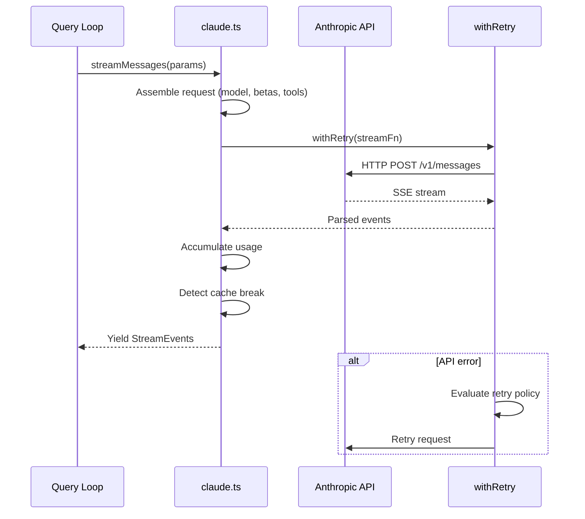
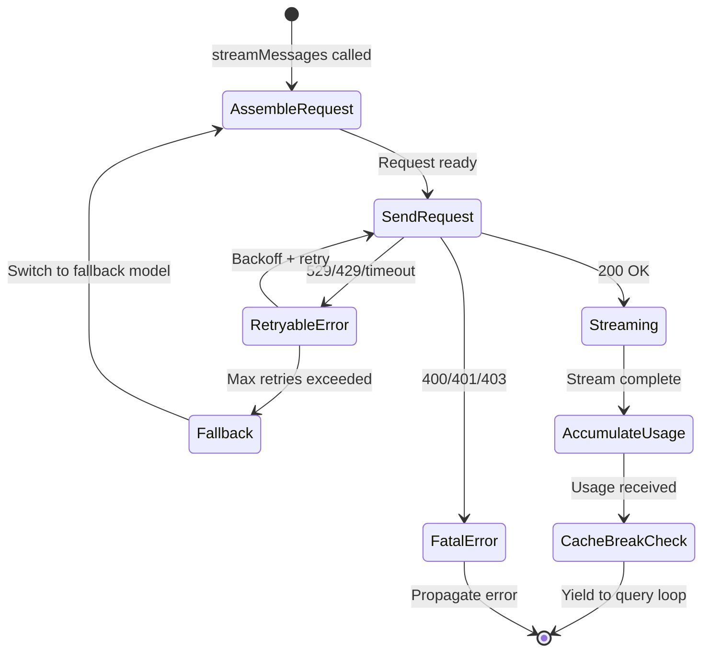

# Talking to Anthropic: `services/api/claude.ts` and Streaming

## Overview

Every query the agent makes to the Anthropic API flows through `src/services/api/claude.ts`, a ~3,400 LOC module that handles request assembly, streaming response parsing, retry logic, fallback model selection, token metering, prompt cache break detection, and rate limit handling. This chapter examines the streaming pipeline, the retry and fallback mechanisms, the usage accumulation system, and the cost management hooks that tie into HER's cost management section (section 13). We also cover how cc defends against model regression from provider updates (HER failure mode 6.14).

The Anthropic API communication layer is one of the most operationally critical subsystems in cc. Every minute of agent runtime involves dozens of API calls, each of which must be assembled correctly (beta headers, tool definitions, thinking parameters), streamed efficiently (SSE parsing with back-pressure), and metered accurately (token counts, cost tracking, cache hit rates). The module has been shaped by production incidents: rate limit storms, cache busting from beta header toggles, model regression from provider updates, and cost overruns from infinite retry loops.

## Data structures and contracts

### API request assembly

The `streamMessages` function in `src/services/api/claude.ts` is the primary entry point. It assembles the full API request from the system prompt, messages, tool definitions, model parameters, and beta headers. The module uses the Anthropic SDK's `beta.messages` endpoint, which provides access to features like extended thinking, prompt caching, and structured outputs.

The beta headers are assembled dynamically based on feature flags and model capabilities:

```typescript
// src/services/api/claude.ts:L133-L143
import {
  AFK_MODE_BETA_HEADER,
  CONTEXT_1M_BETA_HEADER,
  CONTEXT_MANAGEMENT_BETA_HEADER,
  EFFORT_BETA_HEADER,
  FAST_MODE_BETA_HEADER,
  PROMPT_CACHING_SCOPE_BETA_HEADER,
  REDACT_THINKING_BETA_HEADER,
  STRUCTURED_OUTPUTS_BETA_HEADER,
  TASK_BUDGETS_BETA_HEADER,
} from 'src/constants/betas.js'
```

Each beta header enables a specific API feature. The headers are included or excluded based on model capabilities (not all models support all features), GrowthBook feature flags (some features are in limited rollout), and session state (some headers are latched once activated to prevent cache busting). The `getMergedBetas()` function (`src/utils/betas.ts`) orchestrates this assembly, taking the model identifier, the user's GrowthBook feature flags, and the latched header state as inputs.

The tool definitions are converted from cc's internal `Tool` type to the Anthropic API's `BetaToolUnion` schema via `toolToAPISchema()` (`src/utils/api.ts`). This conversion strips internal fields that are not part of the API contract (like `canUseTool` and `toolPermissionContext`) and formats the input schema according to the API's expectations. The tool list is sent with every request because the API does not support tool registration; this means that adding or removing tools changes the request fingerprint and can bust the prompt cache.

The `splitSysPromptPrefix()` and `logAPIPrefix()` functions (`src/utils/api.ts`) handle the system prompt assembly. The system prompt is split into a prefix (which is always included) and a suffix (which varies based on the current context). The prefix contains the core instructions that define the agent's behavior, while the suffix contains dynamic content like the current working directory, git status, and user context. The split is designed so that the prefix can be cached by the API's prompt caching mechanism, while the suffix is not cached because it changes on every request.

The request also includes a `cache_control` field that specifies which parts of the request should be cached. The `CacheScope` type (`src/utils/api.ts`) defines the scope of caching: `cache_creation_input_tokens` indicates that a cache entry was created, and `cache_read_input_tokens` indicates that a cache entry was read. The `shouldUseGlobalCacheScope()` function (`src/utils/betas.ts`) determines whether the global cache scope should be used, which enables prompt caching for all parts of the request rather than just the system prompt.

### Usage accumulation and cost tracking

Every API response includes a `usage` block with input tokens, output tokens, cache read tokens, and cache creation tokens. The `addToTotalSessionCost()` function (imported from `src/cost-tracker.ts` into `claude.ts` at L146) converts these to USD using `calculateUSDCost()` (`src/utils/modelCost.ts`). The cost is accumulated in `bootstrap/state.ts`'s `totalCostUSD` field, which is exposed to the REPL for display. The `addToTotalCostState()` function (`src/bootstrap/state.ts:L557-L564`) also tracks per-model usage via the `modelUsage` field, which maps model names to `ModelUsage` objects containing input/output token counts, cache read/creation counts, and cumulative cost.

The usage is also logged to analytics via `logAPISuccessAndDuration()` (`src/services/api/logging.ts`), which records per-query metrics including model, latency, token counts, and cache hit rates. The `NonNullableUsage` type (originally defined in `src/entrypoints/sdk/sdkUtilityTypes.js` and re-exported from `src/services/api/logging.ts`) ensures that usage fields are always present in telemetry events, even when the API response is incomplete.

```typescript
// src/entrypoints/sdk/sdkUtilityTypes.js (re-exported from logging.ts)
type NonNullableUsage = {
  input_tokens: number
  output_tokens: number
  cache_creation_input_tokens: number
  cache_read_input_tokens: number
  server_tool_use: number | null
}
```

The `server_tool_use` field tracks server-side tool invocations (like web search), which have a separate billing model from regular token usage. This field is nullable because not all API responses include it; the `NonNullableUsage` type uses `number | null` rather than `number` to distinguish between "zero server tool uses" and "server tool use count not available."

### Usage tracking and utilization queries

The `src/services/api/usage.ts` module provides the `fetchUtilization()` function, which queries the Anthropic API's `/api/oauth/usage` endpoint to retrieve the user's current rate-limit utilization. The function is gated on OAuth authentication: if the user is not a Claude AI subscriber or the OAuth token is expired, it returns early with an empty object or null. The response has a 5-second timeout to prevent the REPL from stalling on slow API responses.

The `Utilization` type returned by `fetchUtilization()` contains rate-limit windows keyed by scope: `five_hour`, `seven_day`, `seven_day_oauth_apps`, `seven_day_opus`, and `seven_day_sonnet`. Each window is a `RateLimit` object with a `utilization` percentage (0-100) and a `resets_at` ISO 8601 timestamp. The `extra_usage` field indicates whether the user has exceeded their standard allocation and is drawing on overage capacity, with its own monthly limit and utilization tracking. This multi-window design reflects the Anthropic API's tiered rate-limit system, where different model families and time windows have independent quotas.

```mermaid
flowchart
    A[API Response] --> B[usage block]
    B --> C[addToTotalSessionCost]
    C --> D[calculateUSDCost]
    D --> E[totalCostUSD in bootstrap/state.ts]
    E --> F[REPL display]

    B --> G[logAPISuccessAndDuration]
    G --> H[tengu_api_success event]
    H --> I[Analytics sinks]

    B --> J[extractQuotaStatusFromHeaders]
    J --> K[Quota status in REPL header]

    L[429 Error Response] --> M[extractQuotaStatusFromError]
    M --> K

    N[fetchUtilization] --> O[/api/oauth/usage]
    O --> P[Utilization object]
    P --> Q[five_hour / seven_day / seven_day_opus]
    Q --> R[Rate limit bars in REPL]
```

### Error classification and surfacing

The `src/services/api/errors.ts` module centralizes the translation of raw API errors into user-facing messages and analytics tags. The `getAssistantMessageFromError()` function is the primary entry point: it pattern-matches against error types (429 rate limits, 400 prompt-too-long, 529 overloaded, 401/403 authentication failures, image and PDF size errors) and produces an `AssistantMessage` with an appropriate `error` category tag (`rate_limit`, `invalid_request`, `authentication_failed`, `billing_error`, or `unknown`). The `classifyAPIError()` function provides a parallel classification path for analytics, mapping the same error patterns to Datadog tag strings (`rate_limit`, `prompt_too_long`, `server_overload`, `auth_error`, and so on).

The dual classification is necessary because the user-facing message and the analytics tag serve different purposes. The user-facing message includes actionable recovery instructions ("run /login", "double press esc to go back", "run /compact"), while the analytics tag is a stable enum for aggregation. The `errorDetails` field on `AssistantMessage` stores the raw API error string for diagnostic use (e.g., reactive compact parsing the prompt-too-long gap from `errorDetails`), but is never shown to the user directly.

### Extra body parameters from environment

The `getExtraBodyParams()` function (`src/services/api/claude.ts:L272-L299`) parses the `CLAUDE_CODE_EXTRA_BODY` environment variable and merges it into the API request body. This is a power-user escape hatch for passing custom parameters to the Anthropic API. The function uses a shallow clone of `safeParseJSON` output because the parser is LRU-cached and returns the same object reference for the same string; mutating the result would poison the cache.

```typescript
// src/services/api/claude.ts:L272-L299
export function getExtraBodyParams(betaHeaders?: string[]): JsonObject {
  const extraBodyStr = process.env.CLAUDE_CODE_EXTRA_BODY
  let result: JsonObject = {}

  if (extraBodyStr) {
    try {
      const parsed = safeParseJSON(extraBodyStr)
      if (parsed && typeof parsed === 'object' && !Array.isArray(parsed)) {
        // Shallow clone -- safeParseJSON is LRU-cached and returns the same
        // object reference for the same string. Mutating `result` below
        // would poison the cache, causing stale values to persist.
        result = { ...(parsed as JsonObject) }
      }
    } catch (error) {
      logForDebugging(
        `Error parsing CLAUDE_CODE_EXTRA_BODY: ${errorMessage(error)}`,
        { level: 'error' },
      )
    }
  }
```

The shallow clone is essential because the LRU cache in `safeParseJSON` returns the same object reference for identical inputs. If the caller mutates the returned object (e.g., by adding or removing fields), the mutation affects all subsequent callers that parse the same string. The shallow clone creates a new object with the same top-level properties, so mutations to the clone do not affect the cached original. Note that this is a shallow clone, not a deep clone: nested objects are still shared references. This is acceptable because `getExtraBodyParams` only adds top-level fields to the result.

## Control flow

### Streaming request lifecycle

The streaming pipeline follows a clear sequence: assemble request, send to API, parse SSE events, yield to the query loop, and handle completion or error.



The streaming is implemented using the Anthropic SDK's `stream()` method, which returns a `Stream` object that emits `BetaRawMessageStreamEvent` events. The events are parsed into cc's internal `StreamEvent` type and yielded to the query loop for processing. The query loop maintains a buffer of partial events that are flushed at specific boundaries (end of message, end of tool_use block, end of thinking block). This buffering ensures that the query loop processes complete events rather than partial fragments, which simplifies the downstream event handling logic.

The SSE parsing includes back-pressure handling: if the query loop's event consumer is slower than the API's event producer (e.g., because the user is scrolling through output and the Ink renderer is busy), the SDK's stream implementation buffers events in memory until the consumer catches up. This back-pressure is transparent to cc's code because the SDK handles it internally, but it means that a very long API response (e.g., a multi-thousand-token code generation) can consume significant memory if the consumer is slow.

### Retry and fallback model selection

The `withRetry()` wrapper (`src/services/api/withRetry.ts`) implements exponential backoff with jitter for transient errors (529, 429, network timeouts). The retry policy distinguishes between retriable and non-retriable errors:

- **Retriable**: 529 (overloaded), 429 (rate limited), network timeouts, `APIConnectionTimeoutError`
- **Non-retriable**: 400 (bad request), 401 (unauthorized), 403 (forbidden), `CannotRetryError`

When the primary model fails repeatedly, `FallbackTriggeredError` is thrown, and the query loop falls back to an alternate model. This implements a simple form of model routing: if Opus is unavailable, the system falls back to Sonnet. The `FallbackTriggeredError` includes the original error and the fallback model name, allowing the query loop to log the fallback event and adjust its behavior accordingly.

The jitter in the exponential backoff is critical for preventing thundering herd effects. When multiple cc instances experience the same transient error (e.g., a 529 from a shared API endpoint), they would all retry at the same time if using pure exponential backoff. The jitter randomizes the retry delay within the backoff window, spreading the retries across time and reducing the load on the API. The `withRetry()` implementation uses a full jitter strategy: the delay is uniformly distributed between 0 and the current backoff interval.

The retry logic also handles quota status extraction from error responses. The `extractQuotaStatusFromError()` function (imported from `src/services/claudeAiLimits.ts` at L99) parses the API error response for quota-related headers and body fields, updating the quota status that is displayed in the REPL. This implements HER section 13's recommendation for per-session cost caps by providing visibility into the user's remaining quota.

### Prompt cache break detection

The `checkResponseForCacheBreak()` function (`src/services/api/promptCacheBreakDetection.ts`) detects when the API's prompt cache has been invalidated by comparing the current request's `cache_creation_input_tokens` against the previous request's. A cache break means the full input must be re-processed, which is significantly more expensive. The detection logic records the prompt state (messages, system prompt, tools) and compares fingerprints across requests.

```typescript
// src/services/api/claude.ts:L246-L257
import {
  CACHE_TTL_1HOUR_MS,
  checkResponseForCacheBreak,
  recordPromptState,
} from './promptCacheBreakDetection.js'
```

The cache TTL is approximately 5 minutes on the server side. The `CACHE_TTL_1HOUR_MS` constant reflects the extended 1-hour cache available to eligible users via a GrowthBook feature flag. The `promptCache1hEligible` field in `bootstrap/state.ts` is latched on first evaluation so mid-session overage flips do not change the `cache_control` TTL, which would bust the server-side prompt cache. The latching is implemented via the getter/setter pair in `bootstrap/state.ts`: the getter returns the cached value if it is not null, and the setter only updates the value if it is currently null (first-time evaluation).

Cache break detection is logged to analytics via the `is_cache_break` and `cache_deleted_input_tokens` fields in the `tengu_api_success` event. These fields allow monitoring cache efficiency and diagnosing regressions. A sudden increase in cache breaks often indicates a bug in the beta header latching or compaction logic that is changing the request fingerprint on every iteration.

### Request lifecycle with fallback

The complete request lifecycle, including fallback, can be modeled as a state machine:



The fallback transition is particularly important for long-running agents. If the primary model (e.g., Opus) experiences an extended outage, the agent can continue operating with the fallback model (Sonnet), albeit with potentially reduced capability. The query loop logs the fallback event and adjusts its `maxOutputTokensOverride` to account for the fallback model's different context window size.

### Beta header assembly

The `getMergedBetas()` function (`src/utils/betas.ts`) assembles the complete list of beta headers for the API request. The assembly considers:

1. **Model capabilities**: Not all models support all betas. For example, the `interleaved-thinking-2025-05-14` beta is only supported by models that have extended thinking enabled. The `modelSupportsThinking()` and `modelSupportsAdaptiveThinking()` functions (`src/utils/thinking.ts`) determine whether the model supports extended thinking and adaptive thinking budgets, respectively. These checks gate the inclusion of thinking-related betas and parameters.

2. **Feature flags**: GrowthBook feature flags control which betas are active for a given user. The `shouldIncludeFirstPartyOnlyBetas()` function checks whether the user is on the first-party Anthropic API (as opposed to Bedrock or Vertex), which determines whether certain betas are available. Bedrock and Vertex have different beta requirements than first-party Anthropic, and including unsupported betas causes API errors.

3. **Session state**: Latched headers (AFK mode, fast mode, cache editing) stay on once activated. The latching mechanism prevents cache busting from feature toggles during a session.

4. **Provider context**: Bedrock and Vertex have different beta requirements than first-party Anthropic. The `getBedrockExtraBodyParamsBetas()` function (`src/utils/betas.ts`) adds Bedrock-specific parameters that are passed via the `extra_body` field rather than as beta headers.

### First-token latency tracking

The `setLastApiCompletionTimestamp()` and `getLastApiCompletionTimestamp()` functions in `src/bootstrap/state.ts` record the time of the most recent API completion. This timestamp serves two purposes: it drives the thinking-clear latch (the 1-hour idle threshold described later in this chapter), and it provides first-token latency data for performance monitoring. The `tengu_api_success` analytics event includes the time from request start to first streamed token, which is the metric most directly experienced by the user.

First-token latency is particularly important for the interactive REPL experience. A long delay between the user pressing enter and the first character appearing on screen creates the perception of a frozen application, even if the total response time is reasonable. cc mitigates this through the Ink renderer's "thinking" indicator, which displays a spinner during the time-to-first-token window. The `logAPISuccessAndDuration()` function records both the first-token latency and the total request duration, allowing the team to monitor for regressions in response times.

The `addToTotalDurationState()` function in `src/bootstrap/state.ts` accumulates total API wait time across the session. This is displayed in the REPL header alongside the cost, giving users a sense of how much wall-clock time has been spent waiting for the API versus doing productive work. The ratio of API wait time to session duration is a key metric for evaluating whether the agent is compute-bound (waiting for the model) or IO-bound (waiting for tools like Bash or FileRead).

### Rate limit handling

Rate limit handling is a dedicated subsystem that spans `errors.ts`, `claudeAiLimits.ts`, and `withRetry.ts`. When the API returns a 429 status, the error handler extracts rate-limit headers (`anthropic-ratelimit-unified-representative-claim`, `anthropic-ratelimit-unified-overage-status`, `anthropic-ratelimit-unified-reset`, `anthropic-ratelimit-unified-overage-reset`) to determine the type and severity of the limit.

The rate limit system distinguishes three tiers:

1. **Standard limits** (five-hour and seven-day windows): These are the primary rate limits for all users. The `fetchUtilization()` function from `src/services/api/usage.ts` provides utilization percentages and reset times for each window, which are displayed as progress bars in the REPL header.

2. **Overage**: Claude Max and Team users can exceed their standard limits by drawing on overage capacity. The `overage_status` header indicates whether overage is `allowed`, `allowed_warning`, or `rejected`. The `overage_disabled_reason` header explains why overage was denied (e.g., the user's plan does not include overage, or the overage pool is exhausted).

3. **Model-specific limits** (`seven_day_opus`, `seven_day_sonnet`): These apply to specific model families, allowing the API to enforce tighter limits on expensive models like Opus. The `getRateLimitErrorMessage()` function in `src/services/claudeAiLimits.ts` generates contextual error messages based on the limit type, the reset time, and the overage status.

The `shouldProcessRateLimits()` function in `src/services/rateLimitMocking.ts` gates rate-limit processing for the `/mock-limits` development command, which allows internal testing of rate-limit UI without actually hitting limits. This is a testing-only escape hatch that is not active in production builds.

## Edge cases and failure modes

### Beta header latching

Several beta headers use a "latch" pattern to prevent prompt cache busting. Once a beta feature (like AFK mode, fast mode, or cache editing) is activated, its header stays on for the rest of the session, even if the feature is later deactivated. Without latching, toggling a feature on and off would change the beta headers on every request, invalidating the cache prefix.

```typescript
// src/services/api/claude.ts:L117-L132
import {
  getAfkModeHeaderLatched,
  getCacheEditingHeaderLatched,
  getFastModeHeaderLatched,
  // ...
  setAfkModeHeaderLatched,
  setCacheEditingHeaderLatched,
  setFastModeHeaderLatched,
  // ...
} from 'src/bootstrap/state.js'
```

The latching mechanism is implemented in `bootstrap/state.ts` with nullable boolean fields (`boolean | null`). A `null` value means the header has not yet been activated; a `true` value means it has been activated and must remain on. The `clearBetaHeaderLatches()` function (`src/bootstrap/state.ts:L1744-L1749`) resets all latches on `/clear` and `/compact`, allowing a fresh conversation to get fresh header evaluation. This reset is necessary because a new conversation after `/clear` has a fresh prompt cache that can be warmed with a different set of headers; the old latched headers would force the new conversation to carry unnecessary betas.

### Thinking clear latch for idle sessions

When more than 1 hour has passed since the last API call, the `thinkingClearLatched` flag (`src/bootstrap/state.ts:L240-L243`) triggers clearing of thinking blocks from the context. This is a confirmed cache miss (the server-side cache TTL has expired), so there is no cache-hit benefit to keeping thinking blocks. Once latched, the flag stays on so the newly-warmed thinking-cleared cache is not busted by flipping back to `keep:'all'`. This implements a practical form of context rotation (HER section 12.3, "Context Rotation" universal safety pattern).

The thinking clear latch interacts with the compaction hierarchy in a subtle way. When thinking blocks are cleared, the resulting messages are shorter, which reduces the input token count for the next API call. However, the clearing also changes the message fingerprint, which can cause a cache break if the server-side cache has not yet expired. The latch is only set when `timeSinceLastApiCallMs` exceeds the 1-hour threshold, which is a strong signal that the cache has expired (the server-side TTL is 5 minutes, so 1 hour is well beyond the expiration window).

### Model regression from provider updates

HER failure mode 6.14 warns that when a provider updates a model, harness behavior can break silently because the harness was tuned for specific model behaviors. cc mitigates this through:

1. **Explicit model versioning**: Model strings like `claude-sonnet-4-20250514` include the date, allowing pinning to specific model versions. The `--model` flag accepts these versioned strings, and the `getMainLoopModel()` function returns the current default model string, which includes the version date.

2. **Beta header gating**: New model capabilities are gated behind beta headers, so they are not activated until the harness explicitly opts in. This prevents a provider update from silently changing the behavior of an existing feature. For example, the `interleaved-thinking-2025-05-14` beta header must be explicitly included in the request for the model to use interleaved thinking; without the header, the model uses the legacy non-interleaved thinking behavior.

3. **Migration system**: The migration system in `main.tsx` (chapter 6) updates model strings when new versions are released. The `migrateSonnet1mToSonnet45()` and `migrateSonnet45ToSonnet46()` functions (`src/main.tsx:L326-L352`) update user configs that reference the old model string, ensuring that users are automatically upgraded to the latest stable version.

4. **Fallback model selection**: If the primary model fails, the system falls back to a known-stable alternate model. The fallback model is typically the previous generation of the same model family, which has been tested and validated against cc's tool suite.

5. **Prompt cache break detection**: If a provider update changes the model's behavior in a way that affects caching (e.g., different tokenization), the cache break detection system will catch the anomaly. A sudden increase in cache breaks across all sessions is a strong signal that a model update has changed the request processing behavior.

### 529 error handling

The `is529Error()` function (`src/services/api/withRetry.ts`) identifies overloaded errors from the Anthropic API. These are treated as retriable with exponential backoff, but with a lower maximum retry count than other transient errors. This prevents the agent from spending excessive time waiting for an overloaded API to recover. The 529 error is common during peak usage hours, and a long-running agent that retries indefinitely on 529 errors can accumulate significant costs in wasted API calls.

The retry policy for 529 errors also includes a "circuit breaker" pattern: if the agent has experienced multiple 529 errors in quick succession, it reduces the retry count for subsequent requests. This prevents the agent from hammering an already-overloaded API with retry attempts. The circuit breaker is implemented via a simple counter that tracks the number of 529 errors in the current session and adjusts the retry parameters accordingly.

### API fingerprint computation

The `computeFingerprintFromMessages()` function (`src/utils/fingerprint.ts`) computes a content-based fingerprint of the messages sent to the API. This fingerprint is used for two purposes: cache break detection (comparing fingerprints across requests to detect when the prompt state has changed) and debugging (logging the fingerprint alongside API requests so that support engineers can correlate reports from different users experiencing the same issue). The fingerprint is a hash of the message content, not the raw bytes, so it is stable across minor formatting changes (like whitespace normalization) but sensitive to substantive changes (like adding or removing a message).

### Thinking configuration

The `ThinkingConfig` type (`src/utils/thinking.ts`) determines how thinking is configured for each API request. The configuration depends on the model, the user's settings, and the session state. The `modelSupportsThinking()` function checks whether the current model supports extended thinking, and `modelSupportsAdaptiveThinking()` checks whether it supports adaptive thinking budgets. When thinking is enabled, the request includes a `thinking` parameter with the `type` set to `enabled` and the `budget_tokens` set to the maximum thinking tokens for the model. The `getMaxThinkingTokensForModel()` function (`src/utils/context.ts`) returns the maximum thinking budget based on the model's context window and the current token usage.

The thinking configuration also interacts with the effort system. The `resolveAppliedEffort()` function (`src/utils/effort.ts`) maps the user's effort setting (low, medium, high) to a thinking budget and a sampling temperature. Higher effort settings result in larger thinking budgets and lower temperatures, encouraging the model to spend more time reasoning before producing a response. Lower effort settings result in smaller thinking budgets and higher temperatures, allowing the model to produce faster but less thoroughly reasoned responses.

### Structured outputs and JSON schema

The `STRUCTURED_OUTPUTS_BETA_HEADER` enables the structured outputs feature, which allows the API to produce responses that conform to a JSON schema. The `initJsonSchema` field in `bootstrap/state.ts` stores the JSON schema for structured output, which is set by the SDK when the user requests a structured response. When a JSON schema is present, the API is instructed to produce a response that conforms to the schema, and the response is validated against the schema before being returned to the caller.

The `modelSupportsStructuredOutputs()` function (`src/utils/betas.ts`) checks whether the current model supports structured outputs. Not all models support this feature; attempting to use structured outputs with an unsupported model causes an API error. The function is called during request assembly to gate the inclusion of the structured outputs beta header and the JSON output format parameter.

### Fast mode and the speed parameter

The fast mode system (`src/utils/fastMode.ts`) provides a way to reduce the model's thinking budget for faster responses. When fast mode is enabled, the `speed` body parameter is set to a value that instructs the API to use a smaller thinking budget, producing responses more quickly at the cost of reduced reasoning depth. The fast mode header is latched once activated (`fastModeHeaderLatched` in `bootstrap/state.ts`) to prevent cache busting when the user toggles fast mode on and off.

The `isFastModeAvailable()` function checks whether fast mode is available for the current user (gated by GrowthBook feature flags and the user's subscription level). The `isFastModeEnabled()` function checks whether fast mode is currently active. The `isFastModeCooldown()` function checks whether fast mode is in a cooldown period after being deactivated, preventing the user from rapidly toggling fast mode on and off (which would cause cache busting on every toggle).

### Quota status extraction

The `extractQuotaStatusFromError()` function (imported from `src/services/claudeAiLimits.ts` at L99) and `extractQuotaStatusFromHeaders()` function parse API error responses and successful responses, respectively, for quota-related information. This information is used to update the quota status displayed in the REPL header, giving users real-time visibility into their remaining API quota. The quota status includes the total quota, the remaining quota, and the reset time (when the quota will be replenished). This is particularly important for users on the Claude Pro and Max plans, which have monthly token limits.

The `currentLimits()` function (`src/services/claudeAiLimits.ts`) returns the user's current API limits based on their subscription level. The limits are fetched from the Anthropic API on each request and cached for the duration of the session. The function returns an object with fields like `maxTokensPerRequest`, `maxRequestsPerMinute`, and `maxTokensPerDay`, which are used by the query loop to enforce rate limits and display usage information.

### Advisor system and model routing

The advisor system (`src/utils/advisor.ts`) runs a separate, smaller model in parallel with the primary model to provide suggestions and corrections. The `isAdvisorEnabled()` function checks whether the advisor is active for the current user and model. The `modelSupportsAdvisor()` function checks whether the current model supports the advisor feature. The `ADVISOR_BETA_HEADER` enables the advisor on the API side, and the `getExperimentAdvisorModels()` function returns the list of models that can be used as advisors.

The advisor system is an early implementation of semantic routing (HER section 13.3): it uses a cheaper model to provide lightweight feedback on the primary model's output, catching obvious errors and suggesting improvements without consuming the expensive primary model's context window. The advisor runs asynchronously and its output is injected into the response stream as advisor blocks, which are stripped before the messages are sent back to the API on the next iteration.

## Where cc diverges from the published pattern

HER section 13 describes a cost control architecture with per-task cost caps, per-session cost caps, per-hour spend rate alerts, and a dead-letter queue. cc implements a subset of this:

- **Per-session cost tracking**: `totalCostUSD` in `bootstrap/state.ts` tracks cumulative session cost.
- **Token budget enforcement**: The token budget system (chapter 10) caps output tokens per turn and per session.
- **No per-task cost cap**: cc does not have a hard cost cap per task. Sessions can run indefinitely as long as the user's API quota is not exhausted.
- **No dead-letter queue**: Exceeded budgets terminate the session rather than queuing for human review.
- **No per-hour spend rate alert**: cc does not implement anomaly detection on spend velocity, though the analytics system logs cost events that could be used for alerting.

HER section 13.3 describes observation masking (52% cost reduction by hiding irrelevant tool outputs, verified by JetBrains Research). cc implements this through the microcompact and content replacement systems (chapter 28), which trim tool results before sending them to the API. The `applyToolResultBudget()` function in the query loop enforces per-message size limits, replacing oversized results with summaries.

HER section 13.5 provides budget reality checks: "$297 for a $50k contract (best case)", "$200 for 6 hours of harness work", "$3,200-$13,000/month per agent (enterprise)", "40-60% TCO underestimation". cc's cost tracking provides the raw data for these calculations, but does not implement the per-outcome tracking recommended in section 13.4. The `totalCostUSD` field tracks cost per session, not cost per completed task.

## Developer takeaways for building a long-running agent

1. **Latch beta headers once activated.** Toggling beta features on and off invalidates the prompt cache. Latching keeps the header on for the rest of the session, preventing cache busting.

2. **Detect cache breaks explicitly.** A cache break is expensive (full input re-processing). Log cache breaks separately from hits to monitor efficiency and diagnose regressions.

3. **Implement retry with full jitter.** Raw exponential backoff causes thundering herds when multiple agents retry simultaneously. Full jitter (uniform delay between 0 and the backoff interval) spreads retries across time.

4. **Track cumulative usage per model.** Different models have different costs. Per-model tracking in `bootstrap/state.ts` enables cost-per-outcome analysis (HER section 13.4) and informs model routing.

5. **Clear thinking blocks on confirmed cache misses.** After a long idle period, the server-side cache has expired. Keeping thinking blocks adds token cost without benefit; clearing them warms a cheaper cache.

6. **Shallow-clone cached parse results.** LRU-cached parsers return the same object reference for the same input. Mutating it poisons the cache for subsequent callers.

7. **Gate new model capabilities behind beta headers.** Do not auto-enable new capabilities. Gate them behind explicit beta headers so the harness opts in at its own pace after validation.
