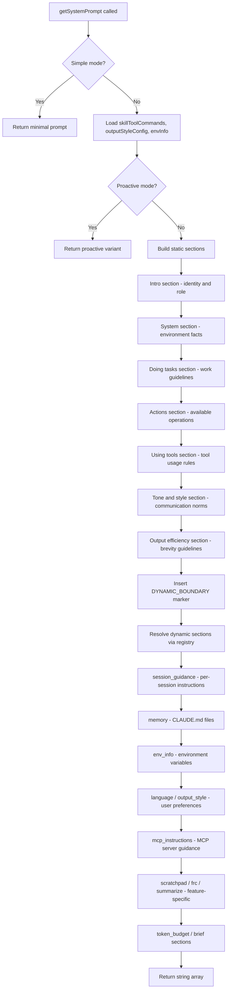
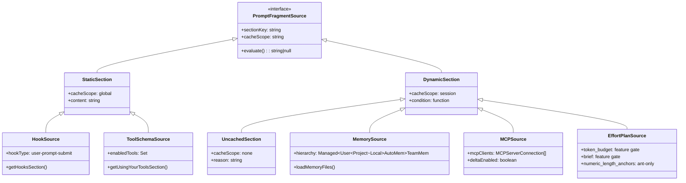
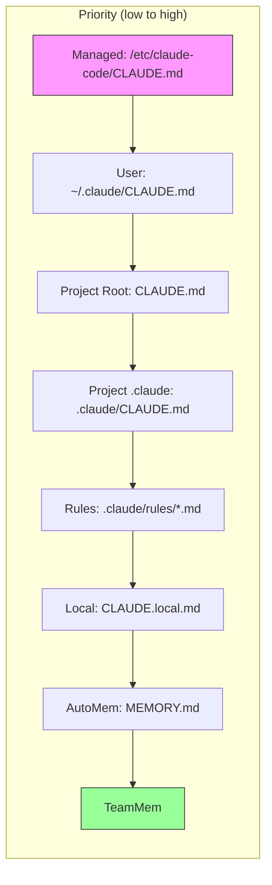

# System Prompts and Prompt Assembly

## Overview

Every query cycle in cc begins with the same question: what does the model see before it generates its first token? The answer is the system prompt -- a multi-layered assembly of instructions, environment facts, memory files, tool descriptions, and session-specific guidance that shapes every response the model produces. The system prompt is not a static blob of text. It is a dynamically composed artifact built fresh (or cache-resumed) on each API call, and its architecture directly determines the agent's behavior, cost profile, and cache hit rate.

This chapter traces the full prompt assembly pipeline from `src/constants/prompts.ts` through the CLAUDE.md loading machinery in `src/utils/claudemd.ts`, the context-analysis layer in `src/utils/analyzeContext.ts`, and the context-window configuration in `src/utils/context.ts`. We examine how cc balances three competing pressures: providing enough instruction for high-quality output, keeping token costs manageable, and preserving prompt-cache hits across turns. The system prompt is the single most expensive token investment cc makes on every API call, and its design reflects hard-won lessons about what the model needs to see and what it does not.

## Data structures and contracts

### The system prompt as a string array

The system prompt is not a single string. `getSystemPrompt()` in `src/constants/prompts.ts` returns `Promise<string[]>` -- an ordered array of sections, each a self-contained markdown block. This design enables two critical features that a monolithic string cannot support:

1. **Cache boundary management**: A special boundary marker `SYSTEM_PROMPT_DYNAMIC_BOUNDARY` separates static (cacheable) content from dynamic (per-session) content. Everything before this marker can use `scope: 'global'` for cross-user prompt caching on the Anthropic API. This means the first several hundred tokens of the system prompt are served from cache on almost every call, dramatically reducing both latency and cost.

2. **Section-level resolution**: Each dynamic section is wrapped in `systemPromptSection()` or `DANGEROUS_uncachedSystemPromptSection()`, which registers it with the section resolver for conditional evaluation and caching. This allows sections to be included or excluded based on runtime conditions (feature gates, environment variables, user settings) without rebuilding the entire prompt.

```typescript
// src/constants/prompts.ts:L114-L117
export const SYSTEM_PROMPT_DYNAMIC_BOUNDARY =
  '__SYSTEM_PROMPT_DYNAMIC_BOUNDARY__'
```

The boundary marker itself is never seen by the model. It is a control token that the API-side caching layer in `src/services/api/claude.ts` uses to split the system prompt array into two cache scopes. Sections before the boundary are marked `scope: 'global'`; sections after are marked `scope: 'session'` or left unscoped.

### The MemoryFileInfo type

CLAUDE.md files are parsed into `MemoryFileInfo` objects, which carry the file path, memory type, processed content, optional glob patterns, and metadata about whether the content differs from what is on disk. This type is the fundamental data structure of the instruction-loading subsystem:

```typescript
// src/utils/claudemd.ts:L229-L243
export type MemoryFileInfo = {
  path: string
  type: MemoryType
  content: string
  parent?: string // Path of the file that included this one
  globs?: string[] // Glob patterns for file paths this rule applies to
  // True when auto-injection transformed `content` (stripped HTML comments,
  // stripped frontmatter, truncated MEMORY.md) such that it no longer matches
  // the bytes on disk. When set, `rawContent` holds the unmodified disk bytes
  // so callers can cache a `isPartialView` readFileState entry — presence in
  // cache provides dedup + change detection, but Edit/Write still require an
  // explicit Read before proceeding.
  contentDiffersFromDisk?: boolean
  rawContent?: string
}
```

The `content` field holds the processed content after HTML comment stripping, frontmatter extraction, and optional truncation. The `rawContent` field preserves the original file content for accurate change detection. The `contentDiffersFromDisk` flag is set when the processed content differs from the raw on-disk content, enabling the system to detect when a CLAUDE.md has been modified without re-reading the file. The `globs` field, extracted from YAML frontmatter, scopes the instruction to specific file patterns, so a rule about TypeScript files does not pollute the prompt when the agent is working on a Markdown document. The `parent` field tracks the `@include` chain, enabling circular reference detection.

### Context-window configuration

The context window size is not a constant. It varies by model, feature gates, and environment overrides. The resolution chain in `src/utils/context.ts` handles this through a priority-ordered cascade:

```typescript
// src/utils/context.ts:L51-L98
export function getContextWindowForModel(
  model: string,
  betas?: string[],
): number {
  // Allow override via environment variable (ant-only)
  if (
    process.env.USER_TYPE === 'ant' &&
    process.env.CLAUDE_CODE_MAX_CONTEXT_TOKENS
  ) {
    const override = parseInt(process.env.CLAUDE_CODE_MAX_CONTEXT_TOKENS, 10)
    if (!isNaN(override) && override > 0) {
      return override
    }
  }

  // [1m] suffix — explicit client-side opt-in
  if (has1mContext(model)) {
    return 1_000_000
  }

  const cap = getModelCapability(model)
  if (cap?.max_input_tokens && cap.max_input_tokens >= 100_000) {
    if (
      cap.max_input_tokens > MODEL_CONTEXT_WINDOW_DEFAULT &&
      is1mContextDisabled()
    ) {
      return MODEL_CONTEXT_WINDOW_DEFAULT
    }
    return cap.max_input_tokens
  }

  if (betas?.includes(CONTEXT_1M_BETA_HEADER) && modelSupports1M(model)) {
    return 1_000_000
  }
  if (getSonnet1mExpTreatmentEnabled(model)) {
    return 1_000_000
  }
  if (process.env.USER_TYPE === 'ant') {
    const antModel = resolveAntModel(model)
    if (antModel?.contextWindow) {
      return antModel.contextWindow
    }
  }
  return MODEL_CONTEXT_WINDOW_DEFAULT
}
```

The default context window is 200k tokens, defined as `MODEL_CONTEXT_WINDOW_DEFAULT` at `src/utils/context.ts:L9`. Models with the `[1m]` suffix or certain beta flags can expand to 1M tokens. Internal Anthropic users can also set `CLAUDE_CODE_MAX_CONTEXT_TOKENS` to cap the effective window for local decisions like auto-compact while still using a 1M-capable endpoint. This override is useful for testing and for constraining costs during long sessions. The function `getModelMaxOutputTokens()` resolves the maximum output tokens per model tier, because the output token limit affects how the query loop decides when to request a continuation versus stopping.

## Control flow

### Prompt assembly layers

The system prompt is assembled in a strict layer order, where each layer adds a distinct category of instruction. The ordering is not arbitrary: it maximizes prompt-cache hits by placing stable content first and volatile content last. The following diagram shows how `getSystemPrompt()` in `src/constants/prompts.ts` builds the prompt array:



The static sections (H through N) are the same for every user in every session, which makes them ideal candidates for cross-user prompt caching. The dynamic sections (Q through W) vary by user, project, and session state, so they must be re-evaluated on each call. The boundary marker at step O is the dividing line: the API-side caching layer splits the array here, assigning `scope: 'global'` to the static prefix and `scope: 'session'` or no scope to the dynamic suffix.

### Prompt fragment sources

The system prompt is composed from a diverse set of fragment sources, each contributing a distinct category of instruction. The following class diagram shows the taxonomy of these sources and how they feed into the assembly pipeline:



Static sections like the hooks section and the tool schema section are embedded in the cacheable prefix because their content is stable within a session. Memory and MCP sources are dynamic because they vary per turn. The effort/plan source group is conditional: `token_budget` and `brief` sections are only included when the corresponding feature gate is enabled, and `numeric_length_anchors` is restricted to internal Anthropic users.

### Tool schema injection into the system prompt

Tool definitions are not injected into the system prompt as text. Instead, they are provided to the Anthropic API as structured `tools` parameters alongside the `system` parameter in each API call. However, the system prompt contains a section called "Using your tools" (produced by `getUsingYourToolsSection()` at `src/constants/prompts.ts:L569`) that provides behavioral instructions for how the model should use the available tools. This section receives the set of enabled tool names and adjusts its guidance accordingly.

The "Using your tools" section is static and sits before the dynamic boundary marker, making it cacheable across sessions. This is a deliberate design choice: the behavioral rules for tool usage (e.g., "prefer running multiple independent tool calls in the same block") are the same regardless of which specific tools are enabled. The tool names themselves are passed in the `tools` API parameter, not in the system prompt, so changes to the tool set do not invalidate the prompt cache.

The `enabledTools` set is constructed from the `tools` parameter passed to `getSystemPrompt()` at line 444, which contains only the tools that are currently available in the session (excluding deferred tools that have not yet been loaded via ToolSearch). This means the "Using your tools" section can conditionally include or exclude tool-specific behavioral guidance based on which tools are present, without rebuilding the entire prompt.

### Hooks as a prompt source

The system prompt includes a hooks section produced by `getHooksSection()` at `src/constants/prompts.ts:L127-L129`, which informs the model that users may configure shell commands (hooks) that execute in response to lifecycle events. This section is static and resides before the dynamic boundary marker, making it globally cacheable.

The hooks section instructs the model to treat feedback from hooks -- including the `<user-prompt-submit-hook>` tag -- as coming from the user. This is a critical behavioral directive: when a PreToolUse hook blocks a tool call, the model sees the hook's feedback message and must adjust its actions accordingly rather than re-attempting the same call. The section also advises the model to ask the user to check their hooks configuration if it is blocked and cannot determine an alternative approach.

Although hooks are defined in settings and execute at runtime (see Chapter 36 for the full hook schema and Chapter 37 for execution pipelines), the system prompt's hooks section is the mechanism by which the model learns about the hooks subsystem. Without this section, the model would not know how to interpret hook feedback messages that appear in tool results, leading to confusing behavior where the model might retry a blocked operation or ignore hook-provided guidance.

### Effort and plan mode modifications to the system prompt

The system prompt is not identical across all sessions. Several dynamic sections are gated by feature flags or runtime conditions that change the prompt based on the current operational mode:

**Token budget section**: When the `TOKEN_BUDGET` feature gate is enabled (checked via `feature('TOKEN_BUDGET')` at line 538), a `token_budget` section is injected that instructs the model to keep working until it approaches a user-specified token target. This section is cached unconditionally -- the phrasing "When the user specifies..." makes it a no-op when no budget is active. This design avoids cache busts: previously, this section was `DANGEROUS_uncached` because it toggled on `getCurrentTurnTokenBudget()`, which invalidated approximately 20K tokens of cached prompt per budget flip. The current design pays the token cost of a few inert sentences in exchange for preserving the cache across budget activations.

**Brief section**: When the `KAIROS` or `KAIROS_BRIEF` feature gate is enabled (line 552), a `brief` section is included that provides instructions for the brief generation subsystem. Like the token budget section, this is a conditional dynamic section that is only evaluated when the feature is active.

**Numeric length anchors**: For internal Anthropic users (`process.env.USER_TYPE === 'ant'`), a `numeric_length_anchors` section is injected at line 529 that provides explicit word-count targets for tool-call summaries (25 words) and final responses (100 words). Research shows this produces approximately a 1.2% output token reduction compared to qualitative instructions like "be concise", and the ant-only scope allows measurement of quality impact before a broader rollout.

**Plan mode**: When plan mode is active, the system prompt is not modified directly. Instead, plan mode operates through the permission system (see Chapter 32), which restricts the agent to read-only tool access. The model learns about plan mode through the permission-denial feedback loop rather than through explicit system prompt instructions, which means plan mode does not consume additional prompt tokens and does not invalidate the cache.

### CLAUDE.md loading hierarchy

The `getMemoryFiles()` function in `src/utils/claudemd.ts` loads instruction files in a strict priority order, from lowest to highest:

1. **Managed** (`/etc/claude-code/CLAUDE.md`) -- enterprise policy, always loaded, cannot be overridden
2. **User** (`~/.claude/CLAUDE.md`) -- private global instructions, applies to all projects
3. **Project** (`CLAUDE.md`, `.claude/CLAUDE.md`, `.claude/rules/*.md`) -- checked-in project instructions, discovered by traversing from CWD up to root
4. **Local** (`CLAUDE.local.md`) -- private project instructions, gitignored, not shared with team
5. **AutoMem** (MEMORY.md index) -- auto-memory entrypoint, if feature enabled
6. **TeamMem** -- shared team memory, if feature enabled

Files are loaded in reverse order of priority, meaning the model pays more attention to the latest-loaded (highest-priority) files. The discovery traversal walks from the current directory upward to root, so files closer to CWD are loaded later and take precedence. This is a deliberate design choice that reflects the intuition that directory-local instructions (e.g., a `.claude/CLAUDE.md` in `src/utils/`) should override project-root instructions when the agent is working in that directory.



```typescript
// src/utils/claudemd.ts:L89-L91
const MEMORY_INSTRUCTION_PROMPT =
  'Codebase and user instructions are shown below. Be sure to adhere to these instructions. IMPORTANT: These instructions OVERRIDE any default behavior and you MUST follow them exactly as written.'
```

This instruction preamble, combined with the late-loading priority, means that project-level CLAUDE.md files override user-level files, and directory-local rules override project-root rules. The `MEMORY_INSTRUCTION_PROMPT` string is inserted before the first memory file, signaling to the model that these instructions have elevated priority.

The loading order has a practical implication for team workflows. Consider a team where the user has a global `~/.claude/CLAUDE.md` that says "always use TypeScript strict mode", but the project's `CLAUDE.md` says "use JavaScript with CommonJS modules". Because the project file is loaded after the user file, the model will follow the project's instruction, not the user's global preference. This is the correct behavior: the project's coding standard takes precedence over an individual developer's preference. But it can be surprising if the developer does not realize that their global instructions are being overridden.

The discovery traversal walks from the current directory upward to root, so if the user is working in `/home/user/project/src/utils/`, the traversal will check for CLAUDE.md files in `src/utils/`, then `src/`, then the project root. This means a CLAUDE.md file in `src/utils/` will override a CLAUDE.md file in the project root when the agent is working in that directory. This is particularly useful for monorepo structures where different subdirectories have different coding standards or architectural patterns.

### The @include directive system

Memory files support an `@include` directive that allows one CLAUDE.md to pull in content from other files. This enables a team to maintain shared instruction fragments (e.g., coding standards, architecture guidelines) in separate files and reference them from project-level CLAUDE.md files without duplication. The system uses the marked lexer to parse markdown tokens and extract `@path` references from text nodes, skipping code blocks and HTML comments to avoid false matches (`src/utils/claudemd.ts:L451-L535`). Skipping code blocks is important because file paths inside code examples should not be interpreted as include directives -- they are part of the documentation, not references to real files.

Circular references are prevented by tracking processed paths in a set that is passed through the recursive `processMemoryFile()` calls. The recursion depth is capped at 5 (`src/utils/claudemd.ts:L537`), preventing an @include chain from consuming unbounded stack space. If the depth limit is exceeded, the include is silently skipped, and the containing file is loaded without the included content. The depth cap of 5 was chosen as a practical limit: most real-world include chains are 1-2 levels deep (a project CLAUDE.md includes a shared coding-standards file), and chains deeper than 5 almost always indicate a circular reference or an accidental include.

### The HTML comment stripping process

Before a CLAUDE.md file's content is included in the system prompt, the system strips HTML comments. This is a significant token savings for files that contain extensive authorial annotations (e.g., explanations of why a rule exists, or notes about when to update it). The stripping is done by the `processMemoryFile()` function, which uses a regex-based approach to remove `<!-- ... -->` blocks while preserving the surrounding content (`src/utils/claudemd.ts:L292-L334`).

The stripping process is careful not to remove comments that contain `@include` directives, because those directives must be processed even if they appear inside comments. This is a subtle edge case: a user might comment out an `@include` directive temporarily, and the system should respect that by not processing the included file. However, if the comment contains an `@include` that was intentionally placed there (e.g., as part of a template), the system should still process it. The current implementation errs on the side of stripping: comments are removed, and any `@include` directives within them are not processed. This means that commenting out an `@include` is an effective way to disable it.

### The cache boundary and prompt-cache optimization

The `SYSTEM_PROMPT_DYNAMIC_BOUNDARY` marker is the linchpin of cc's prompt-cache strategy. Sections before the boundary are static across sessions for the same user/organization and can be cached globally on the Anthropic API side. Sections after the boundary contain per-session data (memory files, MCP instructions, environment info) that changes between turns and must be re-evaluated.

When `shouldUseGlobalCacheScope()` returns true, the boundary marker is inserted into the prompt array. The API-side caching layer in `src/services/api/claude.ts` splits the system prompt at this boundary, assigning `scope: 'global'` to the static prefix and `scope: 'session'` or no scope to the dynamic suffix. The cost savings from this split are substantial: on a typical 200k-token context window, the static system prompt might be 5,000-10,000 tokens, and caching these across turns and users eliminates the input token cost for the cached portion. On a 1M-token context window, the savings are even more significant.

The cache boundary also affects how the system prompt is sent to the API. The `claude.ts` file joins the string array into a single string for the API call, inserting newlines between sections. When the boundary marker is present, the system splits the string at the marker and sends the static prefix as a separate cache-scoped block. This means the static content is cached independently of the dynamic content, and changes to the dynamic sections (e.g., loading a new CLAUDE.md file) do not invalidate the cache for the static sections. The cache lifetime on the Anthropic API is typically 5 minutes, so a user who makes multiple queries within 5 minutes will benefit from cached static content on every query.

### The simple mode variant

When the `CLAUDE_CODE_SIMPLE` environment variable is set, `getSystemPrompt()` returns a minimal prompt that contains only the most essential instructions. This variant is used for lightweight interactions where the full prompt assembly would be overkill, such as quick file edits or simple bash commands. The simple mode prompt skips all dynamic sections (memory files, MCP instructions, environment info) and includes only the core behavioral instructions. This reduces the token cost of the system prompt by approximately 80%, at the expense of losing the CLAUDE.md instruction system and MCP tool support.

The simple mode variant is also used as the prompt for subagents spawned via `AgentTool` when the `--agent` flag is used with a simple agent type. By reducing the system prompt size, the subagent has more context window available for the actual task, which can improve performance on focused tasks that do not need the full instruction set.

### The context-analysis layer

The `analyzeContextUsage()` function in `src/utils/analyzeContext.ts` provides visibility into how the context window is being used. It counts tokens across seven categories: system prompt, CLAUDE.md files, built-in tools, MCP tools, deferred tools, agents and skills, and messages. The results are displayed as a visual grid in the REPL's status line, giving the user a real-time view of where their context budget is being spent.

The token counting uses `countTokensWithFallback()`, which first tries the API-based `countMessagesTokensWithAPI()` and falls back to `countTokensViaHaikuFallback()` if the API is unavailable. This two-tier approach ensures that the context analysis is accurate when possible but always available, even in environments where the API is not reachable.

The `analyzeContextUsage()` function also builds a visual grid that shows the percentage of context consumed by each category. This grid is rendered in the REPL's status line when the user invokes the `/context` command, providing a breakdown like "System: 8% | CLAUDE.md: 12% | Tools: 15% | Messages: 65%". This information is valuable for debugging context-related issues: if the user sees that CLAUDE.md files are consuming 30% of the context window, they know to reduce the size of their instruction files. If tools are consuming 40%, they might want to enable tool search to defer some tool schemas.

### The section resolver and conditional evaluation

Dynamic sections of the system prompt are registered with a section resolver that determines which sections to include based on runtime conditions. The `systemPromptSection()` function wraps a section with a cache key and evaluation function, while `DANGEROUS_uncachedSystemPromptSection()` bypasses the cache entirely. The resolver evaluates each section's condition (e.g., "include the MCP instructions section only when MCP servers are connected") and produces the final ordered array of prompt sections.

This conditional evaluation is important for keeping the prompt lean. If no MCP servers are connected, the MCP instructions section is omitted entirely, saving hundreds of tokens. If the user has not set a custom language or output style, those sections are skipped. If fast mode is enabled, the token budget section includes a directive to be more aggressive about stopping early. Each section makes an independent decision about whether to include itself, and the resolver collects the results into a single array.

## Edge cases and failure modes

### ETH Zurich finding: more instructions can hurt performance

The HER cites a study from ETH Zurich (arXiv:2602.11988) that found context files tend to reduce task success rates while increasing inference cost by over 20%. This has a direct and counterintuitive implication for cc's CLAUDE.md system: verbose instruction files and detailed directory trees hurt rather than help. The more instructions you load, the more the model has to process before it can act, and the higher the chance that conflicting instructions confuse its behavior.

cc mitigates this through several mechanisms:

- A recommended maximum of 40,000 characters per memory file (`src/utils/claudemd.ts:L92`). Files exceeding this limit are not rejected, but the system logs a warning and the content is included in full, consuming a large portion of the dynamic prompt budget.
- MEMORY.md index truncation via `truncateEntrypointContent()` for AutoMem and TeamMem types (`src/utils/claudemd.ts:L383-L385`). This function caps the entrypoint content to keep it within budget, because the MEMORY.md index can grow unbounded as the agent accumulates memories.
- HTML comment stripping to remove authorial notes from the instruction payload (`src/utils/claudemd.ts:L292-L334`). Comments are useful for the file's author but waste tokens when served to the model.
- Frontmatter parsing that extracts glob patterns for conditional rules, so instructions only load when relevant (`src/utils/claudemd.ts:L254-L279`). A rule scoped to `*.tsx` files is not loaded when the agent is editing a Python file.

### The exclude-pattern system

CLAUDE.md files can also be excluded from loading via an exclude pattern system. The `isClaudeMdExcluded()` function checks whether a given CLAUDE.md path matches any of the exclude patterns configured in the project settings (`src/utils/claudemd.ts`). This is useful when a project has a CLAUDE.md file in a directory that should not be loaded (e.g., a vendored dependency that contains its own CLAUDE.md). Without the exclude system, the upward directory walk would discover and load these files, injecting instructions that are not relevant to the current project and potentially conflicting with the project's own instructions.

The exclude patterns follow the same glob syntax as the `.claude/rules/` paths globs, using the `ignore` npm package for matching. This consistency means users who are familiar with the conditional rule system already know how to use the exclude system.

### The frontmatter parsing and glob extraction

Files in `.claude/rules/` can include YAML frontmatter that specifies `paths:` globs. The frontmatter is parsed by `parseFrontmatter()` in `src/utils/frontmatterParser.ts` (370 lines), which extracts the YAML content between `---` delimiters and parses it into a structured object. The `globs` field from the frontmatter is then stored on the `MemoryFileInfo` object and used by `processConditionedMdRules()` to filter the rules at query time.

The frontmatter parser is deliberately simple: it does not support the full YAML specification, only the subset needed for the `paths:` field. This keeps the parser fast and reliable, avoiding the complexity and attack surface of a full YAML parser. The parser also handles edge cases like missing closing delimiters, empty frontmatter, and non-YAML content that looks like frontmatter.

### Nested worktree double-loading

When cc runs from a git worktree nested inside a main repo, the upward directory walk can pass through both the worktree root and the main repo root, causing the same CLAUDE.md to be loaded twice. The code detects this by comparing the git root with the canonical root and skips Project-type files from directories above the worktree but within the main repo (`src/utils/claudemd.ts:L868-L884`). This is a subtle edge case that only manifests when the user has entered a worktree via `EnterWorktreeTool`, but it would cause confusing duplicate instructions if not handled.

### External @include security

Files included via `@include` that live outside the original CWD require explicit user approval. The `includeExternal` flag is only set to true when the project config has `hasClaudeMdExternalIncludesApproved` set or when the caller forces it. A warning is shown when external includes are detected without approval (`src/utils/claudemd.ts:L1416-L1430`). This is a security surface: a malicious CLAUDE.md could include files from anywhere on the filesystem, potentially exfiltrating sensitive data through the model's context. The approval gate ensures that the user is aware of and consents to external includes.

### Conditional rules with glob patterns

Files in `.claude/rules/` can have frontmatter with `paths:` globs that scope them to specific files. These conditional rules are not loaded eagerly; instead, `processConditionedMdRules()` filters them at query time against the target path being operated on, using the `ignore` npm package for glob matching (`src/utils/claudemd.ts:L1354-L1397`). This means a rule file with `paths: ["src/**/*.ts"]` is only injected into the system prompt when the agent is reading or editing a TypeScript file in the `src/` directory. This keeps the prompt lean by only injecting relevant instructions.

### The memoization of getMemoryFiles

The `getMemoryFiles()` function is memoized to avoid re-reading the filesystem on every API call. The memoization key includes the CWD, the git root, and the feature gates that affect which files are loaded. When any of these change (e.g., the user changes directory with `cd`), the memoization cache is invalidated and the files are re-discovered. This is an important performance optimization because `getMemoryFiles()` involves multiple filesystem reads and markdown parsing, which would be prohibitively expensive to repeat on every turn.

However, the memoization also introduces a subtle consistency issue. If a CLAUDE.md file is modified while the agent is running (e.g., the user edits `CLAUDE.md` in another terminal), the memoized result will be stale until the cache is invalidated. cc handles this by checking the file modification time when it detects a change notification, but there is a window between the file modification and the cache invalidation where the agent operates with outdated instructions. In practice, this window is short (typically less than one turn), and the impact is minimal because the model's behavior is influenced by the full conversation history, not just the current CLAUDE.md content.

## Where cc diverges from the published pattern

HER Pattern 2 (Scoped Context Assembly) describes multi-level instruction loading as a general best practice. cc's implementation goes further in several ways:

1. **Cache-aware section ordering**: cc explicitly orders sections to maximize prompt-cache hits, placing static content before the boundary marker and dynamic content after. The HER pattern does not address API-level caching, which is a significant omission given that prompt caching can reduce input token costs by 90% or more on repeated queries.

2. **Conditional rule scoping**: The `.claude/rules/*.md` system with frontmatter `paths:` globs is more granular than the HER's description of scoped assembly. Rules can target specific file patterns, not directory levels. This means a project can have dozens of rule files, each scoped to a different file type or directory, without any single rule file consuming the entire prompt budget.

3. **Memory entrypoint truncation**: cc actively truncates MEMORY.md and team memory indexes to keep them within budget, a mechanism not described in the HER pattern. Without truncation, an agent that accumulates hundreds of memories over a long session would eventually overflow the dynamic prompt budget, pushing out other critical sections like MCP instructions.

4. **The ETH Zurich counter-evidence**: cc's implementation implicitly acknowledges that more context is not always better through its truncation and stripping mechanisms, even though the system still loads all discovered files by default. The HER pattern assumes that more instructions are better, but the empirical evidence suggests otherwise. cc's mitigation is partial -- it strips comments and truncates indexes, but it does not yet implement a relevance filter that would exclude entire files based on their applicability to the current task.

## Developer takeaways for building a long-running agent

1. **Make your prompt assembly a string array, not a string.** This enables section-level caching, conditional inclusion, and boundary management. A single monolithic string forces full re-evaluation on every API call, which wastes tokens on unchanged content and makes it impossible to cache static portions across users.

2. **Insert a cache boundary marker between static and dynamic content.** The cost savings from cross-turn and cross-user prompt caching are substantial. cc's boundary marker allows the API to cache the first N sections globally and only recompute the dynamic tail. Without this, every API call would pay full input token cost for the entire system prompt.

3. **Load instructions in reverse priority order.** Models attend more to later content in the prompt. If project-specific instructions should override global ones, load them last. cc's loading order (managed, user, project, local, auto-mem) ensures that the most specific and highest-priority instructions are the freshest in the model's context.

4. **Support conditional scoping for instruction files.** Not every rule applies to every file. Glob-scoped rules keep the prompt lean by only injecting relevant instructions. cc's `.claude/rules/*.md` system with frontmatter `paths:` globs is a model for how to implement this without a custom configuration file format.

5. **Truncate aggressively, but preserve the raw content on disk.** cc's `contentDiffersFromDisk` flag on `MemoryFileInfo` allows the system to strip HTML comments, remove frontmatter, and truncate indexes without losing the original file. This enables accurate change detection while keeping the prompt payload small. The model sees the processed content; the filesystem stores the raw content.

6. **Guard against instruction bloat with empirical evidence.** The ETH Zurich study demonstrates that verbose context files reduce success rates. Measure the impact of your instruction files, and default to minimal, targeted context rather than comprehensive documentation dumps. A 40,000-character CLAUDE.md file might feel thorough, but it is more likely to confuse the model than to help it.

7. **Handle nested worktree and external include edge cases explicitly.** Double-loading the same instructions wastes tokens and can confuse the model with apparent contradictions. External includes are a security surface that requires user approval. cc handles both cases explicitly, and any implementation that skips these guards will eventually encounter them in production use.
