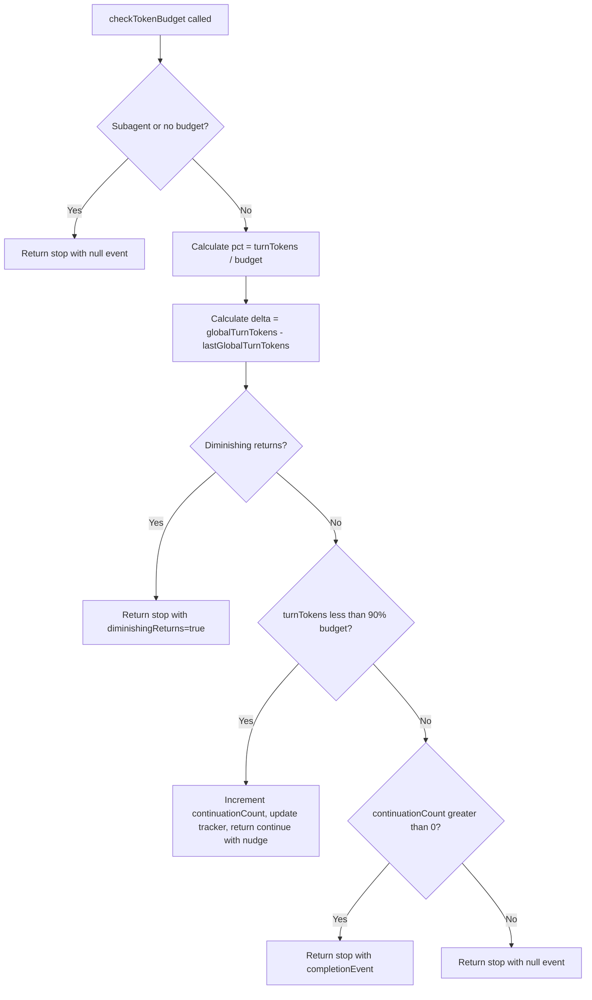
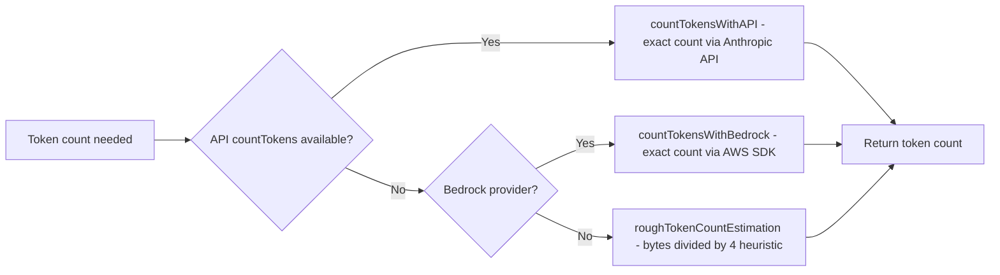
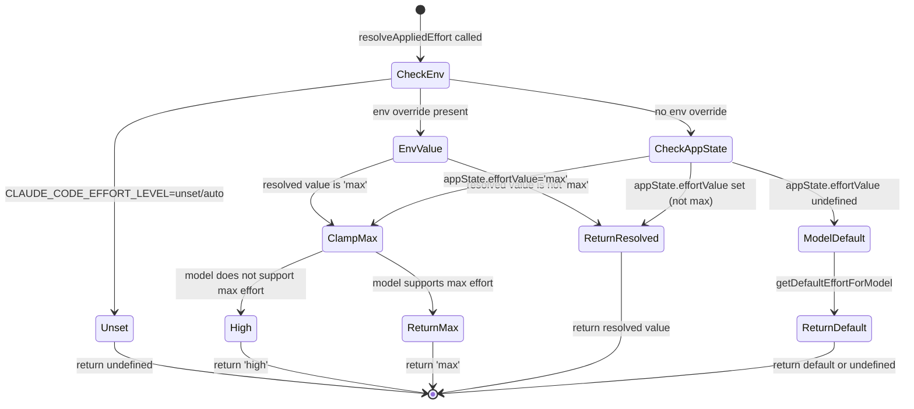

# Token Budgets, Effort, and Fast Mode

## Overview

Every agentic loop faces the same fundamental tension: let the model run long enough to finish the task, but not so long that it burns tokens in circles without making progress. cc addresses this with three interlocking mechanisms: a token budget tracker that detects diminishing returns and terminates stalled loops, a multi-tier token estimation pipeline that balances accuracy against latency and API cost, and an effort/fast-mode configuration layer that trades thoroughness for speed. Together, these form the cost-control backbone of the query loop, and they implement in practice many of the cost-control strategies described in the HER's §13 (Cost and Budgeting).

This chapter traces the token budget lifecycle from `BudgetTracker` in `src/query/tokenBudget.ts` through the estimation strategies in `src/services/tokenEstimation.ts` to the effort and fast-mode settings surfaced through `src/state/AppStateStore.ts`. We examine how cc detects when an agent loop has stopped making meaningful progress, how it counts tokens when the API's own counting endpoint is unavailable, and how the user-facing effort controls shape the model's behavior without changing the underlying budget thresholds.

## Data structures and contracts

### The BudgetTracker type

The `BudgetTracker` type carries the minimal state needed to detect whether an agent loop should continue or stop. It tracks continuation count, the delta in tokens since the last check, the total global turn tokens, and a start timestamp:

```typescript
// src/query/tokenBudget.ts:L6-L11
export type BudgetTracker = {
  continuationCount: number
  lastDeltaTokens: number
  lastGlobalTurnTokens: number
  startedAt: number
}
```

The tracker is created by `createBudgetTracker()` with all counters zeroed and `startedAt` set to `Date.now()`. It is a mutable accumulator: each call to `checkTokenBudget()` updates `continuationCount`, `lastDeltaTokens`, and `lastGlobalTurnTokens` in place. This mutability is intentional and important for performance: creating a new tracker object on every iteration of the query loop would generate unnecessary garbage collection pressure. The tracker's state is owned by the query loop and reset at the start of each user prompt.

The four fields serve distinct roles in the diminishing-returns detector. The `continuationCount` tracks how many times the loop has continued past a budget check. The `lastDeltaTokens` records the token delta from the most recent check, enabling comparison with the current delta to detect when progress is slowing. The `lastGlobalTurnTokens` stores the cumulative token count at the last check, from which the current delta is computed. The `startedAt` timestamp enables the `StopDecision` to report total duration in milliseconds, which is useful for telemetry and debugging.

### The TokenBudgetDecision union

The budget check returns a discriminated union with two variants. A `ContinueDecision` means the loop should continue, and it carries a nudge message encouraging the model to wrap up:

```typescript
// src/query/tokenBudget.ts:L22-L29
type ContinueDecision = {
  action: 'continue'
  nudgeMessage: string
  continuationCount: number
  pct: number
  turnTokens: number
  budget: number
}
```

The `nudgeMessage` is generated by `getBudgetContinuationMessage()` (imported from `src/utils/tokenBudget.js`), which tells the model what percentage of the budget has been consumed and encourages it to produce a final summary. This is a soft signal: the model can choose to ignore it and continue working, but in practice the nudge is effective at getting the model to transition from exploration to synthesis.

A `StopDecision` means the loop should terminate, and it includes an optional completion event with detailed diagnostics:

```typescript
// src/query/tokenBudget.ts:L31-L43
type StopDecision = {
  action: 'stop'
  completionEvent: {
    continuationCount: number
    pct: number
    turnTokens: number
    budget: number
    diminishingReturns: boolean
    durationMs: number
  } | null
}

export type TokenBudgetDecision = ContinueDecision | StopDecision
```

The `completionEvent` is nullable because some stop decisions carry no diagnostic data (e.g., when the function is called for a subagent). When present, the event records whether the stop was due to budget exhaustion, diminishing returns, or a subagent context, along with timing data. The `durationMs` field is computed as `Date.now() - tracker.startedAt`, giving the total wall-clock time from the first budget check to the stop decision.

### The effort and fast-mode fields on AppState

Two fields on `AppState` control how aggressively the agent pursues its task:

```typescript
// src/state/AppStateStore.ts:L423-L427
fastMode?: boolean
effortValue?: EffortValue
```

`fastMode` is a boolean toggle that, when set, instructs the model to prioritize speed over thoroughness. When fast mode is active, the system prompt assembly in `src/constants/prompts.ts` injects a directive telling the model to make shorter responses, skip unnecessary explorations, and prioritize the most direct path to the answer. This does not change the budget thresholds or token counting logic; it shapes the model's behavior so it tends to consume fewer tokens per turn and reaches completion faster.

`effortValue` is imported from `src/utils/effort.ts` and provides a finer-grained control over the agent's diligence level. It maps to different levels of thoroughness in the model's behavior, allowing users to trade off between depth of analysis and speed of execution. Both fields are initialized to `undefined` and `false` respectively in `getDefaultAppState()` (`src/state/AppStateStore.ts:L565-L567`), meaning the default behavior is full effort at normal speed.

The `AppState` type itself is large, with over 50 fields covering everything from bridge connection state to team context to plugin installation status. But for the token budget system, the relevant fields are `fastMode`, `effortValue`, and the `toolPermissionContext` which determines the permission mode (and thus whether the agent can proceed without user interaction, which affects how quickly it consumes tokens).

## Control flow

### The checkTokenBudget decision loop

The `checkTokenBudget()` function is called on each iteration of the query loop. It receives the tracker, an optional agent ID, a nullable budget, and the current global turn token count. Its logic follows a strict decision tree that prioritizes early exit for subagents and budgetless contexts:



The two key thresholds are constants at the top of the file, chosen to balance between giving the model enough runway to complete its task and preventing runaway token consumption:

```typescript
// src/query/tokenBudget.ts:L1-L11
import { getBudgetContinuationMessage } from '../utils/tokenBudget.js'

const COMPLETION_THRESHOLD = 0.9
const DIMINISHING_THRESHOLD = 500

export type BudgetTracker = {
  continuationCount: number
  lastDeltaTokens: number
  lastGlobalTurnTokens: number
  startedAt: number
}
```

The `COMPLETION_THRESHOLD` of 0.9 means the model receives continuation nudges when it has consumed less than 90% of its budget. Once it crosses 90%, the next budget check will return a stop decision (assuming the continuation count is greater than zero, meaning the model has had at least one chance to wrap up). The remaining 10% of the budget is typically enough for a final summary or handoff message, but not enough for a full additional tool-use iteration.

The `DIMINISHING_THRESHOLD` of 500 tokens is the minimum progress threshold. If the model has been running for at least 3 continuations and the token delta in each of the last two checks was below 500 tokens, the system concludes that the model is making progress so slowly that continued iteration is unlikely to produce value. This is a heuristic, but it is effective in practice: a model that is only producing 200 tokens of new content per turn is typically re-reading existing context or repeating earlier analysis rather than making forward progress.

### The token estimation pipeline

Token counting is not a single operation. cc uses a tiered pipeline that trades accuracy for latency, ensuring that the system always has a token count available even when the API is unreachable:



The pipeline has three tiers, each with different accuracy, latency, and availability characteristics:

1. **API-based counting** (`countTokensWithAPI()` at `src/services/tokenEstimation.ts:L124-L201`): Sends a `countTokens` request to the Anthropic API. This is the most accurate method because it uses the same tokenizer as the model, but it requires a network round-trip and consumes a small number of API tokens. It handles Bedrock, Vertex, and direct Anthropic API calls, with beta filtering for Vertex compatibility. When the API provider is Bedrock, the function delegates to `countTokensWithBedrock()` because the Bedrock SDK does not support the `countTokens` endpoint directly.

2. **Haiku fallback counting** (`countTokensViaHaikuFallback()` at `src/services/tokenEstimation.ts:L251-L325`): When the primary `countTokens` endpoint is unavailable (e.g., on Bedrock), cc sends a `messages.create` request to a small fast model (Haiku by default, Sonnet for Vertex global or when thinking blocks are present). The response's `usage.input_tokens + cache_creation_input_tokens + cache_read_input_tokens` yields an exact token count. This is more expensive than the `countTokens` endpoint but more accurate than the heuristic. The code strips tool search-specific fields from messages before sending, because these fields are only valid with the tool search beta header and would cause errors otherwise.

3. **Rough estimation** (`roughTokenCountEstimation()` at `src/services/tokenEstimation.ts:L203-L208`): Divides byte length by a configurable bytes-per-token ratio (default 4). For JSON files, the ratio drops to 2 because dense JSON has many single-character tokens (`{`, `}`, `:`, `,`, `"`) that inflate the character count relative to the token count. Images and documents are estimated at 2000 tokens regardless of actual size, matching the API's worst-case cost for a maximally-sized 2000x2000 image (5333 tokens by the width*height/750 formula).

### The bytes-per-token ratio by file type

The `bytesPerTokenForFileType()` function provides file-type-aware estimation:

```typescript
// src/services/tokenEstimation.ts:L215-L224
export function bytesPerTokenForFileType(fileExtension: string): number {
  switch (fileExtension) {
    case 'json':
    case 'jsonl':
    case 'jsonc':
      return 2
    default:
      return 4
  }
}
```

This distinction matters because the rough estimation is used as a fallback when the API is unavailable. For a 100KB JSON file, using the default 4 bytes/token ratio would estimate 25,000 tokens, while the actual count is closer to 50,000 tokens (2 bytes/token). Underestimating JSON tokens is dangerous because it can let an oversized tool result slip into the conversation, potentially overflowing the context window.

### Fast mode and effort in the query loop

When `fastMode` is true on `AppState`, its effects extend well beyond a system-prompt directive. Fast mode operates at three levels of the query loop simultaneously:

1. **System prompt injection**: The prompt assembly in `src/constants/prompts.ts` injects a directive telling the model to make shorter responses, skip unnecessary explorations, and prioritize the most direct path. This is the behavioral layer -- the model receives explicit instructions to work faster.

2. **API-level routing via beta header**: When fast mode is active and latched, `src/services/api/claude.ts` attaches the `FAST_MODE_BETA_HEADER` to every subsequent streaming request. The header is latched on first use (via `setFastModeHeaderLatched()`) so that once a request goes out in fast mode, all follow-up requests within the session carry the header even if the user toggles fast mode off mid-turn. The API uses this header to route the request to faster-responding infrastructure. Crucially, fast mode does not switch the model: it uses the same Opus 4.6 model with accelerated output delivery. The `getFastModeModel()` function in `src/utils/fastMode.ts` returns `'opus'` (with an optional `[1m]` suffix for the 1M-context merge), confirming that the model identity is unchanged.

3. **Cooldown and fallback**: Fast mode can be temporarily downgraded when the API signals rate limits or overloaded conditions. The `triggerFastModeCooldown()` function in `src/utils/fastMode.ts` transitions the runtime state from `active` to `cooldown`, recording a reset timestamp and reason (`rate_limit` or `overloaded`). During cooldown, requests are sent without the fast-mode header, falling back to standard-speed infrastructure. When the cooldown expires, the runtime state automatically reverts to `active` and the fast-mode header is re-attached on the next request. This fallback mechanism ensures that fast mode does not cause request failures; it gracefully degrades rather than hard-failing.

The `effortValue` field provides a finer-grained control over the agent's diligence level, mapping to different levels of thoroughness in the model's behavior. Where fast mode is a binary toggle with API-level routing effects, effort is a graduated parameter that controls how deeply the model reasons.

### Effort-to-model mapping

The `EffortValue` type in `src/utils/effort.ts` is defined as `EffortLevel | number`, where `EffortLevel` is one of four string levels: `low`, `medium`, `high`, or `max`. The numeric form is an internal-only (ant-only) override that maps to the string levels via `convertEffortValueToLevel()`: values up to 50 map to `low`, up to 85 map to `medium`, up to 100 map to `high`, and above 100 map to `max`.

The resolution chain follows a strict precedence, implemented in `resolveAppliedEffort()`:



The key mapping logic is:

1. **Environment override first**: If `CLAUDE_CODE_EFFORT_LEVEL` is set, it takes precedence over everything. Setting it to `unset` or `auto` disables effort entirely (returns `undefined`), which means the API uses its server-side default (effectively `high`).

2. **AppState value second**: The user's current selection (from the `/effort` command or the `EffortCallout` UI component) is stored in `appState.effortValue` and used when no environment override exists.

3. **Model default last**: Each model has a default effort level determined by `getDefaultEffortForModel()`. For Opus 4.6, the default is `medium` for Pro subscribers and for Max/Team subscribers when the `tengu_grey_step2` GrowthBook feature flag is enabled. For all other models, the default is `undefined`, which resolves to the API's server-side default of `high`.

4. **Max effort clamping**: The `max` level is only supported by Opus 4.6 (checked via `modelSupportsMaxEffort()`). If `max` is selected on any other model, it is automatically downgraded to `high` before being sent to the API. This prevents API validation errors and ensures that the effort parameter is always within the model's supported range.

5. **API dispatch**: The resolved effort value is injected into the API request via `configureEffortParams()` in `src/services/api/claude.ts`. String effort levels (`low`, `medium`, `high`, `max`) are placed in `outputConfig.effort` alongside the `EFFORT_BETA_HEADER`. Numeric overrides (ant-only) go into `extraBodyParams.anthropic_internal.effort_override`. If the model does not support effort (checked via `modelSupportsEffort()`), the parameter is silently skipped.

The effort level does not change which model is used -- the query loop always sends requests to the configured `mainLoopModel`. Instead, it adjusts how much compute the model spends on each request, trading reasoning depth for speed. A `low` effort request on Opus 4.6 produces faster but shallower responses; a `max` effort request on the same model produces the deepest reasoning the model is capable of, at higher latency and cost.

These settings flow from the `AppState` store through the query loop context and into the API request. They do not change the budget thresholds or token counting logic directly; instead, they shape the model's behavior so it tends to consume fewer tokens per turn. This is a softer form of cost control than the budget tracker: rather than hard-stopping the loop, it encourages the model to be more efficient from the start. The combination of effort controls (which reduce per-turn token consumption) and budget tracking (which stops runaway loops) provides defense in depth against cost overruns.

## Edge cases and failure modes

### Subagent budget isolation

When `checkTokenBudget()` receives a non-null `agentId`, it immediately returns `{ action: 'stop', completionEvent: null }`. This means subagents never receive continuation nudges from the budget tracker. The rationale is that subagents have their own budget caps set by the spawning context, and the parent's budget tracker should not interfere with the child's execution. A subagent that receives a 'stop' decision with a null event will end its turn without a completion message, allowing the parent to resume control.

This design prevents a subtle bug: if the parent's budget tracker sent continuation nudges to a subagent, the subagent would continue running beyond its allocated budget, consuming tokens that the parent did not account for. The null event signals to the query loop that this was a structural stop (not a budget exhaustion), and the loop should not emit a completion message to the model.

### The Bedrock countTokens gap

The `@anthropic-sdk/bedrock-sdk` does not support the `countTokens` endpoint. When the API provider is Bedrock, `countTokensWithAPI()` delegates to `countTokensWithBedrock()`, which uses the AWS SDK's `CountTokensCommand` instead (`src/services/tokenEstimation.ts:L437-L495`). This requires resolving inference profiles to backing model IDs via `getInferenceProfileBackingModel()`, because Bedrock's `CountTokensCommand` requires a model ID (not an inference profile ARN). If the resolution fails (e.g., the inference profile does not have a backing model), the function returns `null` and the system falls back to rough estimation.

### Image token overestimation

The rough estimation uses a fixed 2000 tokens for all images and documents (`src/services/tokenEstimation.ts:L400-L413`). This matches the API's worst-case cost for a maximally-sized 2000x2000 image (5333 tokens by the width*height/750 formula) but is intentionally conservative. For small images (e.g., a 100x100 icon), this overestimates significantly, but the error is in the safe direction: it triggers auto-compact earlier rather than later, preventing context overflow. The comment in the code explains the reasoning:

```typescript
// src/services/tokenEstimation.ts:L400-L412
if (block.type === 'image' || block.type === 'document') {
  // https://platform.claude.com/docs/en/build-with-claude/vision#calculate-image-costs
  // tokens = (width px * height px)/750
  // Images are resized to max 2000x2000 (5333 tokens). Use a conservative
  // estimate that matches microCompact's IMAGE_MAX_TOKEN_SIZE to avoid
  // underestimating and triggering auto-compact too late.
  //
  // document: base64 PDF in source.data.  Must NOT reach the
  // jsonStringify catch-all — a 1MB PDF is ~1.33M base64 chars →
  // ~325k estimated tokens, vs the ~2000 the API actually charges.
  // Same constant as microCompact's calculateToolResultTokens.
  return 2000
}
```

The alignment with microCompact's `IMAGE_MAX_TOKEN_SIZE` constant ensures that the token estimation and the compaction threshold use the same image token budget, preventing a mismatch where the estimation thinks there is room but the compaction system disagrees.

### Thinking blocks and model selection

When messages contain thinking or redacted_thinking blocks, the Haiku fallback must use Sonnet instead, because Haiku 3.5 does not support thinking. The code checks for thinking blocks via `hasThinkingBlocks()` and adjusts the model selection accordingly (`src/services/tokenEstimation.ts:L256-L277`). The `TOKEN_COUNT_THINKING_BUDGET` is set to 1024 and `TOKEN_COUNT_MAX_TOKENS` to 2048, the minimum values that satisfy the API constraint that `max_tokens` must be greater than `thinking.budget_tokens`. This is a niche case that only affects sessions where extended thinking is enabled, but getting it wrong would cause the token counting request to fail with a validation error.

### Tool search field stripping

The `stripToolSearchFieldsFromMessages()` function removes `caller` from `tool_use` blocks and `tool_reference` from `tool_result` content before sending messages for token counting (`src/services/tokenEstimation.ts:L66-L122`). These fields are only valid with the tool search beta header, and sending them without the header would cause API errors. If all content blocks are stripped from a `tool_result`, a placeholder `[tool references]` text is inserted to avoid an empty content array, which the API would reject.

## Where cc diverges from the published pattern

HER §13 (Cost and Budgeting) describes a five-layer cost control architecture: per-task cost caps, per-session cost caps, per-hour spend rate alerts, dead-letter queues, and budget allocation across generator/evaluator/sub-agents. cc's implementation maps to these layers with notable differences:

1. **Diminishing-returns detection replaces per-hour alerts**: cc does not implement spend-rate alerting based on cost per hour. Instead, it detects when the agent is making progress below a 500-token-per-check threshold. This is a more direct signal than spend velocity because it correlates with task completion, not cost accumulation. A model that is spending $10/hour but making steady progress should continue; a model that is spending $2/hour but going in circles should stop.

2. **No dead-letter queue**: When a task exceeds its budget, cc stops the loop and reports the completion event. There is no mechanism to queue over-budget tasks for human review. The HER pattern assumes an enterprise pipeline with manual intervention; cc assumes a single-user session where the user can just re-prompt. This is a fundamental difference between an enterprise agent platform and a developer tool.

3. **Observation masking is implemented elsewhere**: The HER's observation masking (52% cost reduction per JetBrains Research) is implemented in cc's compaction pipeline (ch08), not in the token budget system. The budget tracker measures tokens after compaction has already applied, so the cost reduction from masking is reflected in lower `turnTokens` values. The budget system and the compaction system are complementary: compaction reduces the per-turn token cost, and the budget tracker catches the cases where even reduced costs are not producing value.

4. **Semantic routing is model-tier based, not task-type based**: The HER recommends routing simple sub-tasks to cheap models (Haiku for summarization, Sonnet for implementation, Opus for planning). cc's `countTokensViaHaikuFallback()` uses model-tier routing for token counting, but the main query loop always uses the configured `mainLoopModel`. Effort-based routing is not implemented at the dispatch level. The user can manually switch models, but cc does not automatically route queries to cheaper models based on task complexity.

5. **Cost-per-outcome tracking is not implemented**: The HER recommends tracking cost-per-completed-task and cost-per-quality-unit, not cost-per-token. cc tracks token counts and reports them in telemetry events, but it does not correlate cost with task outcomes. This is a gap that would be valuable to fill for enterprise users who need to justify the cost of agent-assisted development.

## Developer takeaways for building a long-running agent

1. **Track token deltas, not just totals.** The diminishing-returns detector in `checkTokenBudget()` works because it compares the delta since the last check, not just the cumulative total. A model that has consumed 50k tokens but is still making 2k-token progress per turn should continue; one that has consumed 10k tokens but is only gaining 200 tokens per turn should stop. The delta captures the velocity of progress, which is the relevant signal for continuation decisions.

2. **Use a 90% completion threshold for continuation nudges.** The `COMPLETION_THRESHOLD` constant at 0.9 means the model receives nudges to wrap up when it has used 90% of its budget. This gives it a 10% runway to produce a final response, which is typically enough for a summary or handoff without allowing a full additional iteration. The 10% margin is a pragmatic balance: too much runway wastes tokens, too little cuts off the model mid-sentence.

3. **Provide a nudge message, not a hard stop, at the threshold.** The `ContinueDecision` includes a `nudgeMessage` that tells the model how much budget remains. This is more effective than a hard cutoff because the model can adjust its output length and completeness to fit within the remaining budget. A hard stop at 90% would leave the model with no opportunity to summarize its findings, potentially losing valuable work.

4. **Layer your estimation strategies by accuracy and cost.** API-based counting is exact but slow; heuristic estimation is fast but imprecise. cc's three-tier pipeline (API, Haiku fallback, rough estimation) ensures that the system always has a token count available, even when the API is unreachable, while preferring accuracy when possible. Each tier serves as a fallback for the tier above it, creating a resilient counting system.

5. **Tune the bytes-per-token ratio by file type.** JSON files have a ratio of 2 bytes/token because of their dense token structure, while most text files use 4 bytes/token. Using a single ratio would overestimate JSON tokens (triggering premature compaction) or underestimate text tokens (risking context overflow). The `bytesPerTokenForFileType()` function makes this adjustment automatically.

6. **Isolate subagent budgets from the parent tracker.** Subagents spawned via AgentTool have their own budget caps. The parent's `checkTokenBudget()` returns an immediate stop when it detects a subagent context, preventing the parent's nudge messages from leaking into the child's conversation. This isolation ensures that each agent in a multi-agent hierarchy operates within its own budget constraints.

7. **Estimate images and documents conservatively.** A fixed 2000-token estimate for all images is conservative but safe. Underestimating image token cost risks context overflow, which is far more disruptive than triggering compaction a few turns early. Aligning the image token estimate with the compaction system's threshold prevents mismatches between the estimation and the compaction logic.
