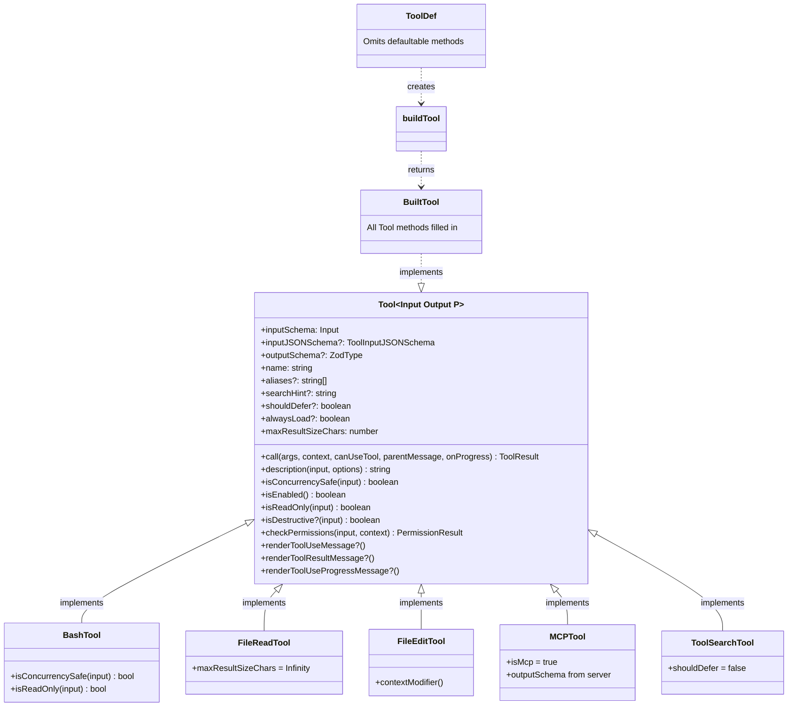
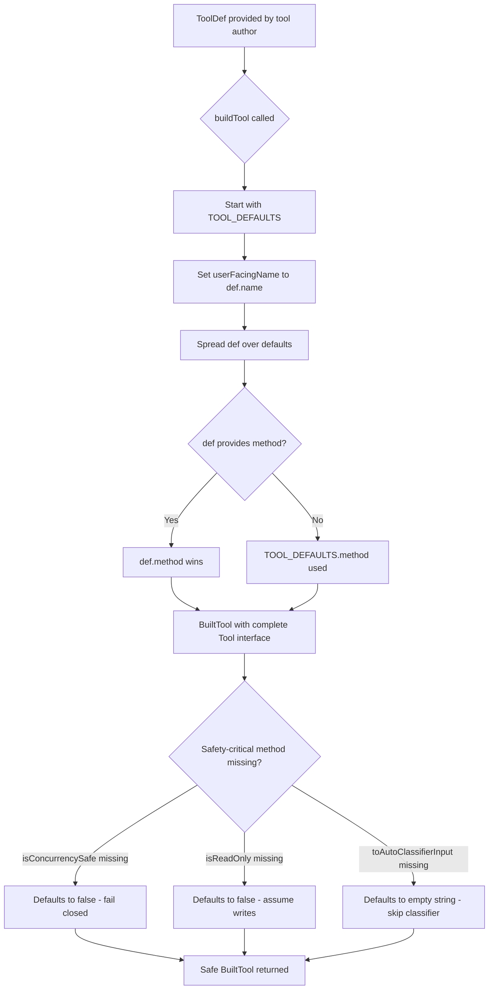
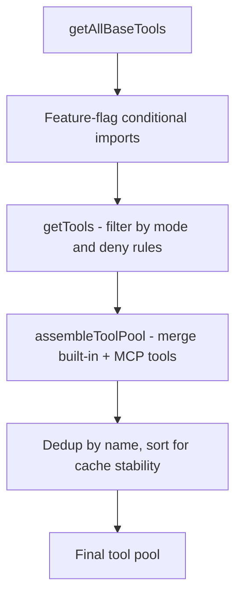
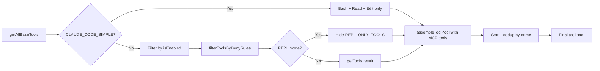

# Anatomy of a Tool

## Overview

Every operation cc performs on the user's behalf -- reading a file, editing code, running a shell command, searching the web -- flows through a single abstraction: the `Tool` type. This type is the contract between the model's intent and the harness's execution. It defines how inputs are validated, how permissions are checked, how results are serialized, and how the UI renders the interaction. Understanding the `Tool` type is essential for understanding every subsequent chapter in this book, because the tool dispatch pipeline (ch12), the permission system, the hook system, and the streaming executor all operate on `Tool` instances.

This chapter examines the `Tool<Input, Output, P>` type in `src/Tool.ts` (792 lines), the `buildTool()` helper that provides safe defaults, the `Tools` collection type, the tool registry in `src/tools.ts` (389 lines), and how these pieces connect to Fowler's computational-vs-inferential taxonomy from the HER and the Single-Purpose Tool Design pattern. We trace the full lifecycle from tool registration through input validation to result serialization, identifying the design decisions that make cc's tool system robust and extensible.

## Data structures and contracts

### The Tool type parameterized triple

The `Tool` type is parameterized over three type variables that capture the full lifecycle of a tool invocation:

```typescript
// src/Tool.ts:L362-L365
export type Tool<
  Input extends AnyObject = AnyObject,
  Output = unknown,
  P extends ToolProgressData = ToolProgressData,
> = {
```

- **Input**: A Zod schema type (`AnyObject` = `z.ZodType<{ [key: string]: unknown }>`) that validates the model's tool_use parameters at runtime. Every tool call is first parsed through `inputSchema.safeParse()`, and malformed inputs are rejected before the tool's `call()` method is invoked. This is a computational control in Fowler's taxonomy: deterministic, fast, and reliable.

- **Output**: The return type of the tool's `call()` method. This is the data that gets serialized into a `tool_result` block and sent back to the model. Most tools define a concrete output type (e.g., `BashTool` returns `{ stdout: string; stderr: string; exitCode: number }`), while MCP tools return `unknown` because their output schema is defined by the MCP server.

- **P**: The progress data type, extending `ToolProgressData`. Tools that stream incremental results (bash output, web search results, agent task output) use this to emit progress events before the final result. Progress events are rendered in the UI immediately, giving the user real-time feedback while the tool executes.

The three parameters are not just type-level abstractions. They drive concrete behavior at every stage of the tool lifecycle: the Input type drives Zod validation, the Output type drives `mapToolResultToToolResultBlockParam()` serialization, and the Progress type drives the `onProgress` callback signature.



This class diagram shows the `Tool` interface at the center, its key fields and methods, and how concrete implementations like `BashTool`, `FileReadTool`, `FileEditTool`, `MCPTool`, and `ToolSearchTool` specialize the interface. The `ToolDef` type feeds into `buildTool()` which produces a `BuiltTool` that satisfies the full `Tool` contract.

### The required methods

Every tool must implement a core set of methods that define its behavior, its permission contract, and its identity within the system:

```typescript
// src/Tool.ts:L379-L404
call(
  args: z.infer<Input>,
  context: ToolUseContext,
  canUseTool: CanUseToolFn,
  parentMessage: AssistantMessage,
  onProgress?: ToolCallProgress<P>,
): Promise<ToolResult<Output>>

description(
  input: z.infer<Input>,
  options: {
    isNonInteractiveSession: boolean
    toolPermissionContext: ToolPermissionContext
    tools: Tools
  },
): Promise<string>

readonly inputSchema: Input
// Type for MCP tools that can specify their input schema directly in JSON Schema format
// rather than converting from Zod schema
readonly inputJSONSchema?: ToolInputJSONSchema
// Optional because TungstenTool doesn't define this. A future refactor will make it required.
// When we do that, we can also go through and make this a bit more type-safe.
outputSchema?: z.ZodType<unknown>
inputsEquivalent?(a: z.infer<Input>, b: z.infer<Input>): boolean
isConcurrencySafe(input: z.infer<Input>): boolean
isEnabled(): boolean
isReadOnly(input: z.infer<Input>): boolean
/** Defaults to false. Only set when the tool performs irreversible operations (delete, overwrite, send). */
isDestructive?(input: z.infer<Input>): boolean
interruptBehavior?(): 'cancel' | 'block'
isSearchOrReadCommand?(input: z.infer<Input>): {
  isSearch: boolean
  isRead: boolean
  isList?: boolean
}
isOpenWorld?(input: z.infer<Input>): boolean
requiresUserInteraction?(): boolean
isMcp?: boolean
isLsp?: boolean

checkPermissions(
  input: z.infer<Input>,
  context: ToolUseContext,
): Promise<PermissionResult>
```

The `call()` method executes the tool's operation and returns a `ToolResult<Output>` containing the data, optional new messages, an optional context modifier, and optional MCP metadata. The `ToolUseContext` parameter provides access to the abort controller, the app state, the tool pool, and the message history. The `canUseTool` parameter is the permission decision function, which the tool can call to request interactive permission for sub-operations (e.g., a bash command spawned by `AgentTool`). The `parentMessage` parameter provides the assistant message that contains the tool_use block, which is needed for correlating results with their source.

The `description()` method produces a human-readable summary of the tool invocation for the permission dialog. This is what the user sees when cc asks "Allow Bash to run `git status`?" -- the description string, not the raw input JSON. Generating the description is async because some tools need to resolve file paths or fetch additional context before producing a readable summary.

`isConcurrencySafe()` determines whether the tool can run in parallel with other tools. This method takes the tool's input as an argument, meaning the same tool can be concurrency-safe for some inputs and not for others. For example, `BashTool` is concurrency-safe for read-only commands (`ls`, `cat`) but not for write commands (`rm`, `mkdir`). `isReadOnly()` signals that the tool does not modify filesystem or process state. `checkPermissions()` performs tool-specific permission logic beyond the general permission system.

### The ToolResult type

The `call()` method returns a `ToolResult<Output>` that carries the tool's data and optional side effects:

```typescript
// src/Tool.ts:L321-L336
export type ToolResult<T> = {
  data: T
  newMessages?: (
    | UserMessage
    | AssistantMessage
    | AttachmentMessage
    | SystemMessage
  )[]
  contextModifier?: (context: ToolUseContext) => ToolUseContext
  mcpMeta?: {
    _meta?: Record<string, unknown>
    structuredContent?: Record<string, unknown>
  }
}
```

The `data` field holds the tool's output. The `newMessages` field allows the tool to inject additional messages into the conversation (e.g., a system reminder or an attachment). The `contextModifier` field allows the tool to modify the `ToolUseContext` for subsequent tool calls in the same turn -- for example, `FileEditTool` updates the file history state after a successful edit. The `mcpMeta` field carries MCP protocol metadata that is passed through to SDK consumers.

### The optional methods and rendering contract

Beyond the required methods, `Tool` defines a rich optional rendering contract that decouples the tool's data model from its visual presentation. A tool can implement any of the following methods, and the REPL's rendering layer will use them to display the tool interaction:

- `renderToolUseMessage()` -- renders the tool invocation in the transcript
- `renderToolResultMessage()` -- renders the tool's output in the transcript
- `renderToolUseProgressMessage()` -- renders progress events while the tool runs
- `renderToolUseRejectedMessage()` -- renders a custom rejection UI
- `renderToolUseErrorMessage()` -- renders a custom error UI
- `renderGroupedToolUse()` -- renders multiple parallel instances as a group
- `extractSearchText()` -- provides searchable text for the transcript index
- `getActivityDescription()` -- returns a present-tense description for the spinner
- `getToolUseSummary()` -- returns a compact summary for condensed views
- `isSearchOrReadCommand()` -- classifies the operation for UI collapsing

This rendering contract is what makes cc's tool output feel native rather than generic. `GlobTool` shows compact "Found 3 files in 12ms" results; `BashTool` streams live terminal output with syntax highlighting; `FileEditTool` shows a diff preview with accept/reject affordances. Each tool controls its own visual presentation without the rendering layer needing to know the specifics of each tool's data format.

### The ToolDef and buildTool helper

Not every tool needs to implement every method. The `ToolDef` type omits the "defaultable" methods, and `buildTool()` fills them in with safe defaults:

```typescript
// src/Tool.ts:L757-L769
const TOOL_DEFAULTS = {
  isEnabled: () => true,
  isConcurrencySafe: (_input?: unknown) => false,
  isReadOnly: (_input?: unknown) => false,
  isDestructive: (_input?: unknown) => false,
  checkPermissions: (
    input: { [key: string]: unknown },
    _ctx?: ToolUseContext,
  ): Promise<PermissionResult> =>
    Promise.resolve({ behavior: 'allow', updatedInput: input }),
  toAutoClassifierInput: (_input?: unknown) => '',
  userFacingName: (_input?: unknown) => '',
}
```

These defaults are fail-closed where it matters: `isConcurrencySafe` defaults to `false` (assume not safe), `isReadOnly` defaults to `false` (assume writes), and `toAutoClassifierInput` defaults to `''` (skip the classifier). Tools that perform security-relevant operations must explicitly override these defaults. A tool author who forgets to implement `isConcurrencySafe()` will default to `false`, preventing unsafe concurrent execution. This is the opposite of a fail-open default, which would allow unsafe behavior by accident.

The `buildTool()` function spreads `TOOL_DEFAULTS` under the tool-specific definition, so explicit overrides always win:

```typescript
// src/Tool.ts:L783-L792
export function buildTool<D extends AnyToolDef>(def: D): BuiltTool<D> {
  return {
    ...TOOL_DEFAULTS,
    userFacingName: () => def.name,
    ...def,
  } as BuiltTool<D>
}
```

The `BuiltTool<D>` type at the type level mirrors this runtime spread: for each defaultable key, if the tool definition provides it, the definition's type wins; if it omits it, the default's type fills in. This ensures that callers always see a complete `Tool` type without needing `?.() ?? default` chains.



This flowchart shows how `buildTool()` constructs a complete `Tool` from a partial `ToolDef`. The tool author's explicit overrides always take precedence over the defaults, but any omitted safety-critical method falls back to the most restrictive default, ensuring that omission cannot lead to unsafe execution.

### The Tools collection type

```typescript
// src/Tool.ts:L701
export type Tools = readonly Tool[]
```

`Tools` is a type alias for `readonly Tool[]`. It exists not for runtime behavior but for documentation: it marks every location where a tool set is assembled, passed, or filtered across the codebase, making it easy to trace the flow of tool collections through the system. The `readonly` modifier prevents accidental mutation of tool arrays, which is important because the tool pool is shared across concurrent operations.

### The ToolPermissionContext

The `ToolPermissionContext` type carries all permission-related state for a given session. It is a deeply immutable type that is passed through the tool dispatch pipeline and consulted by both `checkPermissions()` and the general permission system:

```typescript
// src/Tool.ts:L123-L138
export type ToolPermissionContext = DeepImmutable<{
  mode: PermissionMode
  additionalWorkingDirectories: Map<string, AdditionalWorkingDirectory>
  alwaysAllowRules: ToolPermissionRulesBySource
  alwaysDenyRules: ToolPermissionRulesBySource
  alwaysAskRules: ToolPermissionRulesBySource
  isBypassPermissionsModeAvailable: boolean
  isAutoModeAvailable?: boolean
  strippedDangerousRules?: ToolPermissionRulesBySource
  shouldAvoidPermissionPrompts?: boolean
  awaitAutomatedChecksBeforeDialog?: boolean
  prePlanMode?: PermissionMode
}>
```

The `mode` field determines the overall permission strategy (default, plan, auto, bypass). The rule sets provide fine-grained allow/deny/ask decisions for specific tools and patterns, organized by source (session, local settings, user settings, CLI args). The `shouldAvoidPermissionPrompts` flag is set for background agents that cannot show a UI, causing all permission checks to auto-deny. The `awaitAutomatedChecksBeforeDialog` flag is set for coordinator workers, ensuring that automated checks (hooks, classifiers) complete before showing an interactive permission dialog.

## Control flow

### Tool registration and assembly

The tool pool is assembled in `src/tools.ts` through a layered process that balances completeness (all available tools) with relevance (only tools the user has permission to use) and cache stability (deterministic ordering):



`getAllBaseTools()` returns the full list of available tools, conditional on feature flags and `USER_TYPE`. Tools like `REPLTool`, `SuggestBackgroundPRTool`, and various internal-only tools are only included for Anthropic-internal builds (`process.env.USER_TYPE === 'ant'`). Feature-flagged tools like `SleepTool`, `MonitorTool`, and cron tools are conditionally imported at module level using `require()` for dead code elimination -- Bun's bundler will tree-shake these imports when the feature flag is `false`.

`getTools()` filters the base list by mode and deny rules. In simple mode (`CLAUDE_CODE_SIMPLE`), it returns only `BashTool`, `FileReadTool`, and `FileEditTool` (or `REPLTool` in REPL mode). When coordinator mode is also active in simple mode, it includes `AgentTool` and `TaskStopTool` so the coordinator can spawn workers. It also calls `filterToolsByDenyRules()` to remove tools that have blanket deny rules in the permission context.



`assembleToolPool()` combines built-in tools with MCP tools, sorts each partition alphabetically by name, and deduplicates by name with built-in tools taking precedence. The sort order is critical for prompt-cache stability:

```typescript
// src/tools.ts:L362-L367
const byName = (a: Tool, b: Tool) => a.name.localeCompare(b.name)
return uniqBy(
  [...builtInTools].sort(byName).concat(allowedMcpTools.sort(byName)),
  'name',
)
```

Built-in tools are kept as a contiguous prefix because the server's `claude_code_system_cache_policy` places a global cache breakpoint after the last prefix-matched built-in tool. Interleaving MCP tools into the built-in sort order would invalidate downstream cache keys whenever an MCP tool sorts between existing built-ins. The `uniqBy('name')` call ensures that if an MCP tool has the same name as a built-in tool, the built-in tool wins (because it appears first in the concatenated array).

### The tool_use input validation pipeline

When the model emits a `tool_use` block, `runToolUse()` in `src/services/tools/toolExecution.ts` validates it through a multi-step pipeline that separates fast computational checks from slower inferential checks:

```typescript
// src/services/tools/toolExecution.ts:L614-L631
const parsedInput = tool.inputSchema.safeParse(input)
if (!parsedInput.success) {
  let errorContent = formatZodValidationError(tool.name, parsedInput.error)

  const schemaHint = buildSchemaNotSentHint(
    tool,
    toolUseContext.messages,
    toolUseContext.options.tools,
  )
  if (schemaHint) {
    logEvent('tengu_deferred_tool_schema_not_sent', {
      toolName: sanitizeToolNameForAnalytics(tool.name),
      isMcp: tool.isMcp ?? false,
    })
    errorContent += schemaHint
  }
}
```

After schema validation succeeds, the optional `validateInput()` method catches semantic errors:

```typescript
// src/services/tools/toolExecution.ts (validateInput call)
const isValidCall = await tool.validateInput?.(parsedInput.data, toolUseContext)
if (isValidCall?.result === false) {
  // Return tool-specific validation error
}
```

Schema validation (`safeParse`) catches type errors: the model sending a string where the schema expects an array, or omitting a required field. This is a computational control in Fowler's taxonomy -- deterministic, fast (microseconds), and reliable. The optional `validateInput()` method catches semantic errors: a file path that does not exist, or a command that would exceed a size limit. These are inferential controls -- they may involve filesystem checks or other I/O, are slower (milliseconds to seconds), and may fail non-deterministically (e.g., a file exists at validation time but is deleted before the tool executes).

### The tool-use alias system

Tools can define `aliases` for backwards compatibility when renamed:

```typescript
// src/Tool.ts:L371
aliases?: string[]

// src/Tool.ts:L345-L354
export function toolMatchesName(
  tool: { name: string; aliases?: string[] },
  name: string,
): boolean {
  return tool.name === name || (tool.aliases?.includes(name) ?? false)
}
```

When a tool is renamed (e.g., `KillShell` became `TaskStop`), the old name is added to `aliases` so that transcripts from older sessions still resolve correctly. The `runToolUse()` function in `toolExecution.ts` falls back to alias lookup if the tool is not found by primary name. This fallback only applies when the tool was found via alias (not the primary name), preventing a tool from being called by another tool's alias.

### The shouldDefer and alwaysLoad flags

The `shouldDefer` and `alwaysLoad` flags control whether a tool's schema appears in the initial prompt or must be loaded via `ToolSearch`:

```typescript
// src/Tool.ts:L442
readonly shouldDefer?: boolean
// src/Tool.ts:L449
readonly alwaysLoad?: boolean
```

A tool marked `shouldDefer` is not included in the initial tool pool sent to the API; the model must call `ToolSearch` to load it. A tool marked `alwaysLoad` is never deferred, even when `ToolSearch` is active. For MCP tools, `alwaysLoad` can be set via `_meta['anthropic/alwaysLoad']`. This mechanism addresses the HER's "Tool Explosion" failure mode (§6.8) by reducing the number of tool schemas in the initial prompt, which degrades the model's ability to select the correct tool.

The `searchHint` field provides a short keyword phrase that `ToolSearch` uses for keyword matching when the tool is deferred:

```typescript
// src/Tool.ts:L378
searchHint?: string
```

This is a 3-10 word description that helps the model find the tool via keyword search. The hint should prefer terms not already in the tool name (e.g., "jupyter" for `NotebookEdit`).

### The maxResultSizeChars field

The `maxResultSizeChars` field controls when tool results are persisted to disk instead of being included inline in the conversation:

```typescript
// src/Tool.ts:L456-L466
maxResultSizeChars: number
```

When a tool result exceeds this size, the result is saved to a file and the model receives a preview with the file path instead of the full content. This prevents large tool outputs (e.g., a 100KB file read) from consuming the entire context window. Tools like `FileReadTool` set this to `Infinity` because persisting would create a circular Read-file-Read loop and the tool already self-bounds via its own limits.

## Edge cases and failure modes

### The deferred tool schema mismatch

When tool search is enabled, some tools are deferred -- their schemas are not sent in the initial prompt. If the model calls a deferred tool without first loading it via `ToolSearch`, the Zod schema validation will fail because the model is guessing at parameter types (e.g., emitting a string where the schema expects an array). The `buildSchemaNotSentHint()` function in `toolExecution.ts` detects this case and appends a hint telling the model to load the tool first:

```typescript
// src/services/tools/toolExecution.ts:L578-L597
export function buildSchemaNotSentHint(
  tool: Tool,
  messages: Message[],
  tools: readonly { name: string }[],
): string | null {
  if (!isToolSearchEnabledOptimistic()) return null
  if (!isToolSearchToolAvailable(tools)) return null
  if (!isDeferredTool(tool)) return null
  const discovered = extractDiscoveredToolNames(messages)
  if (discovered.has(tool.name)) return null
  return (
    `\n\nThis tool's schema was not sent to the API — it was not in the discovered-tool set...` +
    `Load the tool first: call ${TOOL_SEARCH_TOOL_NAME} with query "select:${tool.name}", then retry this call.`
  )
}
```

This is a graceful degradation: rather than returning a generic Zod error ("expected array, got string") that does not explain the root cause, the system returns a targeted hint that tells the model exactly how to fix the problem. The hint is only appended when the tool is deferred and has not been discovered in the message history, avoiding false positives for tools that were loaded correctly.

### The backfillObservableInput guard

Some tools need to inject derived fields into their input for hooks and permission checks (e.g., expanding a relative file path to an absolute one). But these derived fields must not reach `tool.call()`, because tool results embed the original input verbatim and changing it would alter the serialized transcript and VCR fixture hashes. The `backfillObservableInput()` method runs on a shallow clone, and the `callInput` variable is carefully managed to preserve the model's original field values:

```typescript
// src/services/tools/toolExecution.ts:L783-L805
let callInput = processedInput
const backfilledClone =
  tool.backfillObservableInput &&
  typeof processedInput === 'object' &&
  processedInput !== null
    ? ({ ...processedInput } as typeof processedInput)
    : null
if (backfilledClone) {
  tool.backfillObservableInput!(backfilledClone as Record<string, unknown>)
  processedInput = backfilledClone
}
```

The backfilled clone is used for hooks and permission checks, which need the expanded file path. The original `callInput` is preserved for `tool.call()`, which needs the model's original input to produce correct result strings. If a hook or permission later returns a fresh `updatedInput`, the `callInput` converges on it -- that replacement is intentional and should reach `call()`.

### The isEnabled feature flag gate

The `isEnabled()` method is called during tool pool assembly to filter out tools that are not available in the current environment. This is more than a feature flag check: some tools are conditionally available based on the current state. For example, `ToolSearchTool` is only enabled when tool search is active, and `LSPTool` requires the `ENABLE_LSP_TOOL` environment variable. The `getTools()` function maps each tool's `isEnabled()` result and filters out disabled tools before returning the pool:

```typescript
// src/tools.ts:L325-L327
const isEnabled = allowedTools.map(_ => _.isEnabled())
return allowedTools.filter((_, i) => isEnabled[i])
```

This pattern ensures that the model never sees a tool it cannot call, preventing the "Silent Failures" failure mode described in HER §6.6, where the agent proceeds after a tool error as if it succeeded.

## Where cc diverges from the published pattern

HER Pattern 11 (Single-Purpose Tool Design) describes FileReadTool, FileEditTool, and GrepTool as examples of tools with individual permission rules. cc's implementation matches this pattern closely but extends it in several important ways:

1. **The rendering contract is richer than permission rules alone**: Each tool defines a full rendering pipeline (tool use, result, progress, error, grouped), not permission rules. The HER pattern focuses on permission gating; cc's tools are self-contained UI components that happen to also carry permission logic. This makes cc's tools more composable and testable, because the rendering logic is co-located with the business logic.

2. **The `buildTool()` helper enforces fail-closed defaults**: The HER pattern does not address what happens when a tool omits a safety-critical method. cc's `TOOL_DEFAULTS` ensure that `isConcurrencySafe`, `isReadOnly`, and `toAutoClassifierInput` always have safe default values, even if the tool author forgets to implement them. This is a structural guarantee that the HER pattern leaves to convention.

3. **The `shouldDefer`/`alwaysLoad` system addresses Tool Explosion directly**: The HER's Tool Explosion failure mode warns that too many tools degrade selection accuracy. cc's deferred tool system is a concrete implementation of the HER's "progressive tool expansion" recommendation, with `alwaysLoad` as an escape hatch for tools the model must see on turn 1. The `searchHint` field further helps the model find deferred tools by keyword.

4. **Fowler's computational-vs-inferential taxonomy applies at the method level**: The `validateInput()` method is a computational control (deterministic, fast), while `checkPermissions()` may invoke classifiers or human judgment (inferential control). cc explicitly separates these in the tool interface, whereas Fowler's taxonomy treats them as architectural categories that apply at the system level. By making the distinction at the method level, cc ensures that computational checks run first (cheap) and inferential checks run only when needed (expensive).

5. **The `maxResultSizeChars` field implements observation masking**: The HER's observation masking strategy (52% cost reduction per JetBrains Research) is partially implemented through `maxResultSizeChars`, which persists large tool results to disk and provides the model with a preview instead. This is a form of selective redaction that reduces token cost while preserving decision-relevant information.

## Developer takeaways for building a long-running agent

1. **Parameterize your tool type over Input, Output, and Progress.** A single `Tool` type with three type parameters captures the full lifecycle of a tool invocation. The Input type drives validation, the Output type drives serialization, and the Progress type drives streaming. Conflating these into a single `any` loses type safety and makes the rendering contract impossible to implement correctly.

2. **Provide fail-closed defaults via a helper function.** The `buildTool()` pattern ensures that every tool has sensible defaults for safety-critical methods. Without this, a tool author who forgets to implement `isConcurrencySafe()` would default to `true`, allowing unsafe concurrent execution. Fail-closed defaults are the correct choice for any method that affects security or correctness.

3. **Separate schema validation from semantic validation.** Zod's `safeParse()` is fast and deterministic -- a computational control. The optional `validateInput()` method may involve I/O or complex logic -- an inferential control. Keeping these separate allows the system to reject malformed inputs cheaply before investing in expensive semantic checks. It also makes the validation pipeline testable at two different levels of granularity.

4. **Sort your tool pool for cache stability.** The `assembleToolPool()` function sorts built-in and MCP tools alphabetically and keeps built-ins as a contiguous prefix. This ordering ensures that adding or removing an MCP tool does not invalidate the prompt cache for the built-in tool schemas. Cache stability is a production concern that is easy to overlook during development but has significant cost implications at scale.

5. **Support tool aliases for backwards compatibility.** When you rename a tool, add the old name to `aliases` so that existing transcripts and saved sessions continue to resolve. The `toolMatchesName()` function checks both primary name and aliases, and the `runToolUse()` fallback path looks up aliases when the primary name is not found. Without aliases, renaming a tool breaks all historical transcripts.

6. **Guard against the deferred-tool schema mismatch.** When tools are loaded on demand, the model may call them without having seen their schemas. Detect this case in the input validation pipeline and return a hint telling the model how to load the tool, rather than a generic Zod error that does not explain the root cause. The `buildSchemaNotSentHint()` function is a model for how to implement this gracefully.

7. **Separate observable input from call input.** Derived fields injected for hooks and permission checks (e.g., expanded file paths) must not reach the tool's `call()` method, because tool results embed the original input verbatim. Use a shallow clone for backfilling and carefully track which version of the input is passed where. The `backfillObservableInput()` / `callInput` pattern ensures that the model sees its own field names in the results while hooks see expanded versions.
