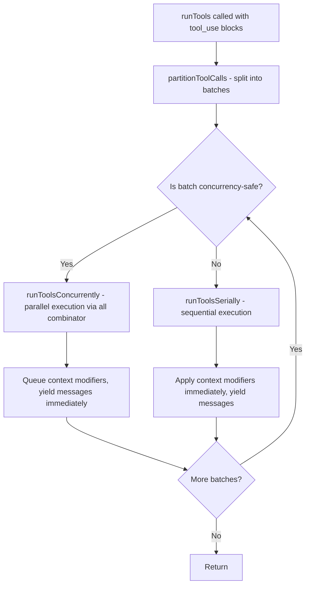
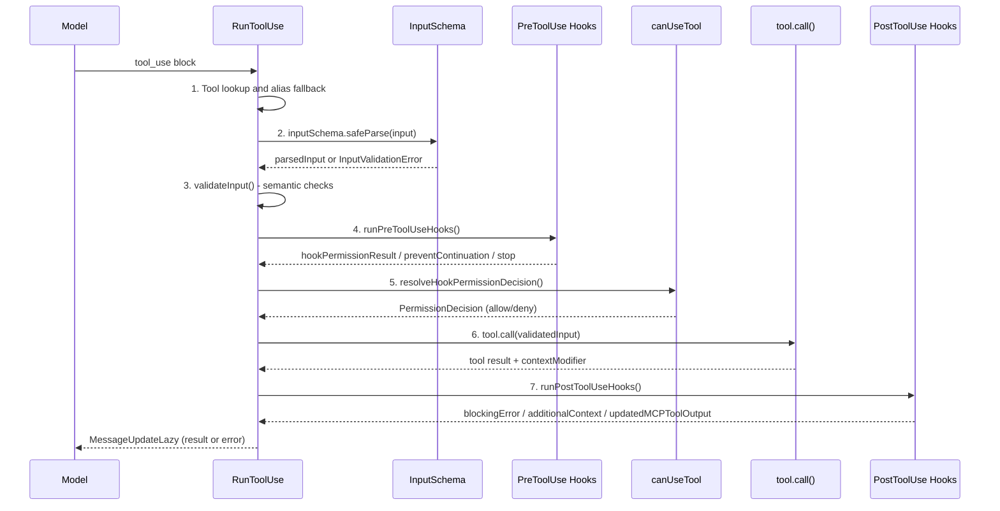
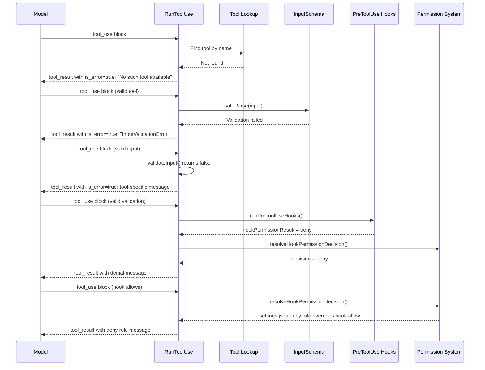
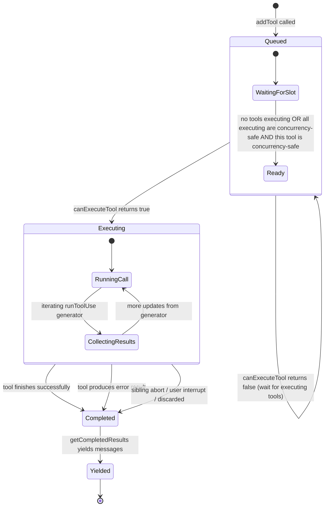

# Tool Dispatch Pipeline

## Overview

When the model emits a batch of `tool_use` blocks, cc must execute them safely, efficiently, and with full observability. The dispatch pipeline orchestrates this: it partitions tool calls into concurrent-safe and serial batches, streams results back to the query loop as they complete, enforces permission checks and hook lifecycle events at every stage, and handles error propagation across parallel tool executions. This pipeline is the critical path between the model's intent and the harness's execution, and its correctness directly determines whether the agent can be trusted to operate on the user's behalf.

This chapter traces the full dispatch flow from `runTools()` in `src/services/tools/toolOrchestration.ts` (189 lines) through `runToolUse()` in `src/services/tools/toolExecution.ts` (1745 lines), the hook lifecycle in `src/services/tools/toolHooks.ts` (650 lines), the streaming executor in `src/services/tools/StreamingToolExecutor.ts` (531 lines), and the permission decision hook in `src/hooks/useCanUseTool.tsx` (203 lines). We examine how cc implements the HER's Deterministic Lifecycle Hooks pattern (Pattern 12) and where it addresses the Silent Failures (6.6) and Tool Explosion (6.8) failure modes. The dispatch pipeline is the largest and most complex subsystem in cc's tool architecture, and understanding it is essential for understanding how the agent interacts with the world.

## Data structures and contracts

### The MessageUpdate type

The dispatch pipeline communicates results upward through the `MessageUpdate` type, which carries either a message or a context modification:

```typescript
// src/services/tools/toolOrchestration.ts:L14-L17
export type MessageUpdate = {
  message?: Message
  newContext: ToolUseContext
}
```

The `newContext` field is always present because tool execution can modify the context (e.g., a `FileEditTool` call updates the file history state, a `SendMessageTool` call registers an agent name). The `message` field is optional because some yields carry only context updates. This design ensures that the query loop always has the latest context state, even when no messages are produced.

The lower-level `MessageUpdateLazy` type used inside `toolExecution.ts` carries context modifiers separately, allowing the orchestration layer to decide when to apply them:

```typescript
// src/services/tools/toolExecution.ts:L264-L270
export type MessageUpdateLazy<M extends Message = Message> = {
  message: M
  contextModifier?: {
    toolUseID: string
    modifyContext: (context: ToolUseContext) => ToolUseContext
  }
}
```

The `contextModifier` field is optional because not every tool execution modifies context. When present, it captures both the tool use ID and a function that transforms the current context into the updated context. This lazy design allows the orchestration layer to queue context modifiers for concurrent batches and apply them atomically after the batch completes, preventing race conditions.

### The TrackedTool internal type

The `StreamingToolExecutor` tracks each tool invocation internally with a `TrackedTool` type that captures the full lifecycle of a single tool execution:

```typescript
// src/services/tools/StreamingToolExecutor.ts:L21-L32
type TrackedTool = {
  id: string
  block: ToolUseBlock
  assistantMessage: AssistantMessage
  status: ToolStatus
  isConcurrencySafe: boolean
  promise?: Promise<void>
  results?: Message[]
  // Progress messages are stored separately and yielded immediately
  pendingProgress: Message[]
  contextModifiers?: Array<(context: ToolUseContext) => ToolUseContext>
}
```

The `status` field progresses through four states defined by `ToolStatus`:

```typescript
// src/services/tools/StreamingToolExecutor.ts:L19
type ToolStatus = 'queued' | 'executing' | 'completed' | 'yielded'
```

The `pendingProgress` array holds progress messages that are yielded immediately to the query loop, while `results` holds the final messages that are yielded in order once the tool completes. This separation ensures that the user sees progress in real time while maintaining correct ordering for final results.

### The Batch partition type

The orchestration layer partitions tool calls into batches based on their concurrency safety:

```typescript
// src/services/tools/toolOrchestration.ts:L84
type Batch = { isConcurrencySafe: boolean; blocks: ToolUseBlock[] }
```

Each batch is either a single non-concurrency-safe tool (which must run alone with exclusive access to the context) or a group of consecutive concurrency-safe tools (which can run in parallel without interfering with each other). The partition is computed by `partitionToolCalls()`, which walks the tool_use list and groups adjacent concurrency-safe tools into the same batch:

```typescript
// src/services/tools/toolOrchestration.ts:L91-L116
function partitionToolCalls(
  toolUseMessages: ToolUseBlock[],
  toolUseContext: ToolUseContext,
): Batch[] {
  return toolUseMessages.reduce((acc: Batch[], toolUse) => {
    const tool = findToolByName(toolUseContext.options.tools, toolUse.name)
    const parsedInput = tool?.inputSchema.safeParse(toolUse.input)
    const isConcurrencySafe = parsedInput?.success
      ? (() => {
          try {
            return Boolean(tool?.isConcurrencySafe(parsedInput.data))
          } catch {
            // If isConcurrencySafe throws (e.g., due to shell-quote parse failure),
            // treat as not concurrency-safe to be conservative
            return false
          }
        })()
      : false
    if (isConcurrencySafe && acc[acc.length - 1]?.isConcurrencySafe) {
      acc[acc.length - 1]!.blocks.push(toolUse)
    } else {
      acc.push({ isConcurrencySafe, blocks: [toolUse] })
    }
    return acc
  }, [])
}
```

If `isConcurrencySafe` throws (e.g., due to shell-quote parse failure), the tool is treated as not concurrency-safe. This is a conservative default: it is safer to serialize a tool that could have run in parallel than to parallelize a tool that should have been serialized. The same tool can be concurrency-safe for some inputs and not for others; for example, `BashTool` with `ls` is concurrency-safe, but `BashTool` with `rm` is not.

### The PostToolUseHooksResult type

Post-tool-use hooks yield a discriminated union of result types that allows hooks to either inject messages into the conversation or modify the tool's output:

```typescript
// src/services/tools/toolHooks.ts:L35-L37
export type PostToolUseHooksResult<Output> =
  | MessageUpdateLazy<AttachmentMessage | ProgressMessage<HookProgress>>
  | { updatedMCPToolOutput: Output }
```

The `updatedMCPToolOutput` variant is used by hooks that post-process the output of MCP tools. For example, a hook might redact sensitive information from an MCP tool's response before it reaches the model. This is only available for MCP tools because built-in tools control their own output format.

## Control flow

### The orchestration partition-and-execute loop

The top-level dispatch entry point is `runTools()` in `toolOrchestration.ts`. It receives the model's tool_use blocks, partitions them into batches, and executes each batch according to its concurrency safety:



The key design decision is that context modifiers from concurrent batches are queued and applied only after the entire batch completes. This prevents a race condition where one tool's context modification affects another tool's execution mid-batch. For serial batches, context modifiers are applied immediately after each tool completes, because there is no concurrency concern and the next tool in the series should see the updated context.

The `runToolsConcurrently()` function uses the `all()` combinator from `src/utils/generators.ts` to interleave the output of multiple concurrent tool executions into a single async generator. The concurrency is capped by `getMaxToolUseConcurrency()`, which reads from the `CLAUDE_CODE_MAX_TOOL_USE_CONCURRENCY` environment variable with a default of 10.

An important subtlety of the concurrent path is how context modifiers are handled. Each concurrent tool may produce a context modifier (e.g., `FileEditTool` updates the file history state). These modifiers are queued in `queuedContextModifiers` during the batch and applied after the entire batch completes. This prevents a race condition where tool A's context modification affects tool B's execution mid-batch:

```typescript
// src/services/tools/toolOrchestration.ts:L30-L63
if (isConcurrencySafe) {
  const queuedContextModifiers: Record<
    string,
    ((context: ToolUseContext) => ToolUseContext)[]
  > = {}
  // Run read-only batch concurrently
  for await (const update of runToolsConcurrently(
    blocks,
    assistantMessages,
    canUseTool,
    currentContext,
  )) {
    if (update.contextModifier) {
      const { toolUseID, modifyContext } = update.contextModifier
      if (!queuedContextModifiers[toolUseID]) {
        queuedContextModifiers[toolUseID] = []
      }
      queuedContextModifiers[toolUseID].push(modifyContext)
    }
    yield {
      message: update.message,
      newContext: currentContext,
    }
  }
  for (const block of blocks) {
    const modifiers = queuedContextModifiers[block.id]
    if (!modifiers) {
      continue
    }
    for (const modifier of modifiers) {
      currentContext = modifier(currentContext)
    }
  }
  yield { newContext: currentContext }
}
```

The final `yield { newContext: currentContext }` after the loop ensures that the query loop sees the updated context even if no messages were produced by the batch. This is important because the query loop uses the context to determine whether to continue iterating.

### A successful tool dispatch: the seven-stage pipeline

The `runToolUse()` function in `toolExecution.ts` is the single point of entry for executing a tool invocation. Its pipeline has seven stages that form the complete lifecycle of a tool call:



Each stage serves a distinct purpose:

1. **Tool lookup and alias fallback**: Find the tool by name in the current tool pool. If not found, check `getAllBaseTools()` for aliases so that deprecated tool names still resolve in saved sessions (`src/services/tools/toolExecution.ts:L345-L356`).

2. **Input validation**: Parse the model's input through `inputSchema.safeParse()`. If validation fails, return an `InputValidationError` with an optional schema-not-sent hint for deferred tools (`src/services/tools/toolExecution.ts:L615-L680`). The `buildSchemaNotSentHint()` function detects when a deferred tool's schema was not sent to the API, explaining why the model's typed parameters were emitted as strings and instructing the model to load the tool first via `ToolSearch`.

3. **Semantic validation**: Call the tool's optional `validateInput()` method for deeper checks (file existence, size limits, path permissions). If validation fails, return the tool-specific error message with the error code (`src/services/tools/toolExecution.ts:L683-L733`).

4. **Pre-tool-use hooks**: Run `runPreToolUseHooks()`, which executes all registered PreToolUse hooks for this tool. Hooks can deny the invocation, allow it with modifications, inject additional context, or request that continuation be prevented after the tool completes.

5. **Permission resolution**: Call `resolveHookPermissionDecision()`, which merges the hook's permission result with the general permission system's rules. If the hook allows but a deny rule exists, the deny rule wins.

6. **Tool execution**: Call `tool.call()` with the validated, permission-approved input. Capture the result, including any new messages, context modifiers, and MCP metadata.

7. **Post-tool-use hooks**: Run `runPostToolUseHooks()`, which executes all registered PostToolUse hooks. Hooks can inject additional messages, modify MCP tool output, block continuation, or report errors.

### A denied tool dispatch: early exits and error paths

The pipeline has multiple exit points that prevent the tool from executing when conditions are not met. Understanding these denial paths is critical for building trustworthy agents:



The first denial path is the tool-not-found case. When the tool name does not match any tool in the current pool and is not a deprecated alias, the pipeline returns a synthetic error immediately:

```typescript
// src/services/tools/toolExecution.ts:L396-L411
yield {
  message: createUserMessage({
    content: [
      {
        type: 'tool_result',
        content: `<tool_use_error>Error: No such tool available: ${toolName}</tool_use_error>`,
        is_error: true,
        tool_use_id: toolUse.id,
      },
    ],
    toolUseResult: `Error: No such tool available: ${toolName}`,
    sourceToolAssistantUUID: assistantMessage.uuid,
  }),
}
return
```

The second denial path is input validation failure. When the model generates invalid input (e.g., passing a string where an array is expected), the Zod schema parser catches the error and returns detailed validation information so the model can correct its input on retry. For deferred tools whose schema was not sent to the API, an additional hint instructs the model to load the tool first.

The third denial path is the PreToolUse hook deny. When a PreToolUse hook returns a `blockingError`, the pipeline converts it into a `hookPermissionResult` with `behavior: 'deny'`, and the tool is never executed. The model receives the hook's denial message as a `tool_result` with `is_error: true`.

The fourth and most important denial path is the permission system override. Even when a PreToolUse hook approves a tool use, the `resolveHookPermissionDecision()` function checks deny/ask rules from settings.json. A deny rule from settings.json always overrides a hook's approval. This is a defense-in-depth invariant that prevents a misconfigured hook from silently bypassing security restrictions.

### The StreamingToolExecutor lifecycle and concurrency scheduling

When the query loop uses the streaming path (the common case for interactive sessions), it creates a `StreamingToolExecutor` and feeds tool_use blocks to it as they stream in from the API. The executor manages concurrency, error propagation, and result ordering. The core scheduling logic is a state machine that determines when each queued tool can start executing:



The `canExecuteTool()` method enforces the concurrency rule: a tool can execute if no tools are currently executing, or if the tool is concurrency-safe and all currently executing tools are also concurrency-safe:

```typescript
// src/services/tools/StreamingToolExecutor.ts:L129-L135
private canExecuteTool(isConcurrencySafe: boolean): boolean {
  const executingTools = this.tools.filter(t => t.status === 'executing')
  return (
    executingTools.length === 0 ||
    (isConcurrencySafe && executingTools.every(t => t.isConcurrencySafe))
  )
}
```

This means a non-concurrency-safe tool must wait for all executing tools to complete before it can start. A concurrency-safe tool can start if all currently executing tools are also concurrency-safe. This ensures that write operations (non-concurrency-safe) never run in parallel with each other or with read operations that might see inconsistent state.

The `processQueue()` method iterates through the tools array and starts each eligible tool. When it encounters a non-concurrency-safe tool that cannot yet execute, it stops processing the queue because tools must maintain their original ordering:

```typescript
// src/services/tools/StreamingToolExecutor.ts:L140-L151
private async processQueue(): Promise<void> {
  for (const tool of this.tools) {
    if (tool.status !== 'queued') continue

    if (this.canExecuteTool(tool.isConcurrencySafe)) {
      await this.executeTool(tool)
    } else {
      // Can't execute this tool yet, and since we need to maintain order for non-concurrent tools, stop here
      if (!tool.isConcurrencySafe) break
    }
  }
}
```

Concurrency-safe tools that cannot start yet (because a non-concurrency-safe tool is executing) are skipped in the loop; they will be revisited when the executing tool completes and `processQueue` is called again from the promise's `finally` handler.

### The PreToolUse hook decision flow

Pre-tool-use hooks yield a stream of typed results that the dispatch pipeline processes in sequence. Each result type represents a distinct effect that the pipeline must handle:

```typescript
// src/services/tools/toolHooks.ts:L435-L461
export async function* runPreToolUseHooks(
  // ...
): AsyncGenerator<
  | { type: 'message'; message: MessageUpdateLazy<...> }
  | { type: 'hookPermissionResult'; hookPermissionResult: PermissionResult }
  | { type: 'hookUpdatedInput'; updatedInput: Record<string, unknown> }
  | { type: 'preventContinuation'; shouldPreventContinuation: boolean }
  | { type: 'stopReason'; stopReason: string }
  | { type: 'additionalContext'; message: MessageUpdateLazy<AttachmentMessage> }
  | { type: 'stop' }
>
```

The `'stop'` type is the most drastic: it immediately ends the tool execution without running the tool's `call()` method. This is used when a hook detects an abort signal during execution, meaning the user has interrupted the agent. The `'preventContinuation'` type is softer: it allows the current tool to complete but requests that the agent stop after processing the tool result. This is used by hooks that detect a condition requiring user intervention (e.g., a security policy violation).

When a hook produces a `blockingError`, the pipeline converts it into a deny decision rather than allowing the tool to proceed:

```typescript
// src/services/tools/toolHooks.ts:L481-L498
if (result.blockingError) {
  const denialMessage = getPreToolHookBlockingMessage(
    `PreToolUse:${tool.name}`,
    result.blockingError,
  )
  yield {
    type: 'hookPermissionResult',
    hookPermissionResult: {
      behavior: 'deny',
      message: denialMessage,
      decisionReason: {
        type: 'hook',
        hookName: `PreToolUse:${tool.name}`,
        reason: denialMessage,
      },
    },
  }
}
```

This conversion ensures that every blocking error from a hook is represented as a deny decision, which the permission resolution system can then process consistently alongside other deny sources.

### The PostToolUse hook result flow and result normalization

Post-tool-use hooks can produce several effects that are processed after the tool's `call()` method returns. The hook results are yielded as a discriminated union that the dispatch pipeline processes in sequence:

- **`hook_cancelled`**: The hook was cancelled (abort signal). Yields a cancellation attachment that is visible in the transcript.
- **`hook_blocking_error`**: The hook detected an error and blocks the result. Yields a blocking error attachment that tells the model why the result was blocked.
- **`hook_stopped_continuation`**: The hook requests that the agent stop after this tool result. Yields a stop message and returns immediately from the hook generator.
- **`hook_additional_context`**: The hook injects additional context into the conversation. Yields an attachment with the context that the model will see in subsequent turns.
- **`updatedMCPToolOutput`**: The hook modifies the tool's output (MCP tools only). Replaces the tool output with the modified version before it is serialized into a `tool_result` block.

The `hook_blocking_error` type is particularly important for addressing the HER's Silent Failures (6.6) failure mode. When a PostToolUse hook detects that the tool's output is invalid or dangerous, it can block the result from reaching the model and inject an error message instead. This prevents the model from proceeding as if the tool succeeded when the output is actually incorrect.

Result normalization is the final step in the dispatch pipeline. After post-tool-use hooks have processed the result, the `streamedCheckPermissionsAndCallTool()` function collects all messages into a `Stream<MessageUpdateLazy>`. This stream combines progress events (yielded immediately as the tool runs) with final results (enqueued when the tool completes). The stream abstraction allows the query loop to consume results as an async iterable without distinguishing between progress and completion events. If the tool throws an unhandled exception, the error is captured and enqueued as a `tool_result` with `is_error: true`, ensuring the model always receives a result for every `tool_use` block it emits.

### The permission decision resolution

The `resolveHookPermissionDecision()` function in `toolHooks.ts` encapsulates the invariant that hook 'allow' does not bypass settings.json deny/ask rules. This is a critical security property that prevents a misconfigured hook from silently bypassing security restrictions:

```typescript
// src/services/tools/toolHooks.ts:L332-L433
export async function resolveHookPermissionDecision(
  hookPermissionResult: PermissionResult | undefined,
  tool: Tool,
  input: Record<string, unknown>,
  toolUseContext: ToolUseContext,
  canUseTool: CanUseToolFn,
  assistantMessage: AssistantMessage,
  toolUseID: string,
): Promise<{
  decision: PermissionDecision
  input: Record<string, unknown>
}>
```

The resolution follows a strict priority chain:

1. If the hook says 'allow', check if the tool requires user interaction or `canUseTool` is forced. If so, still call `canUseTool()`. Otherwise, check deny/ask rules -- hook allow does not bypass settings.json deny rules.
2. If the hook says 'deny', the tool is denied immediately with the hook's denial message.
3. If the hook says 'ask' or there is no hook result, fall through to the normal `canUseTool()` flow, optionally with a `forceDecision` from the hook's ask message that pre-populates the permission dialog.

This priority chain ensures that user-authored deny rules always take precedence over hook approvals. A hook that approves a tool use is expressing confidence that the tool is safe, but it cannot override the user's explicit decision to deny that tool.

### The useCanUseTool React hook

The `useCanUseTool()` hook in `src/hooks/useCanUseTool.tsx` is the interactive permission decision point. It is a React hook that returns a `CanUseToolFn` callback. When called, it creates a permission context and resolves the decision through a multi-step process:

1. **Check rule-based permissions**: `hasPermissionsToUseTool()` checks allow/deny/ask rules from settings.json and other sources.
2. **If 'allow'**: Return the allow decision with the decision reason (config, classifier, or hook).
3. **If 'deny'**: Return the deny decision, possibly recording an auto-mode denial and showing a notification.
4. **If 'ask'**: Check for coordinator or swarm worker permission handlers first (which may resolve without showing a dialog). Then check for speculative bash classifier approval (with a 2-second timeout). Finally, fall through to `handleInteractivePermission()`, which shows the permission dialog to the user.

The speculative classifier check races a bash classifier response against a 2-second timeout. If the classifier approves within the grace period, the permission dialog is skipped. This 2-second grace period is a pragmatic tradeoff: it reduces permission friction for common commands (like `git status` or `npm test`) that the classifier can quickly approve, while still showing the dialog for commands that the classifier cannot classify quickly or with high confidence.

In addition to the local interactive permission dialog, cc supports remote permission callbacks via the bridge mode (for `claude assistant` sessions viewed on claude.ai) and channel permissions (for Telegram/iMessage integrations). These callbacks race against each other and against the local interactive dialog, and the first resolution wins.

## Edge cases and failure modes

### Bash error sibling cancellation

When a Bash tool invocation errors during concurrent execution, the `StreamingToolExecutor` cancels all sibling tools via `siblingAbortController`. Only Bash errors trigger this cascade, because bash commands often have implicit dependency chains (e.g., `mkdir` fails, making subsequent `cd` pointless). Read/WebFetch failures are independent and do not cancel siblings:

```typescript
// src/services/tools/StreamingToolExecutor.ts:L354-L363
if (isErrorResult) {
  thisToolErrored = true
  // Only Bash errors cancel siblings. Bash commands often have implicit
  // dependency chains (e.g. mkdir fails → subsequent commands pointless).
  // Read/WebFetch/etc are independent — one failure shouldn't nuke the rest.
  if (tool.block.name === BASH_TOOL_NAME) {
    this.hasErrored = true
    this.erroredToolDescription = this.getToolDescription(tool)
    this.siblingAbortController.abort('sibling_error')
  }
}
```

The `siblingAbortController` is a child of the main `toolUseContext.abortController`. Aborting siblings does not abort the parent query -- the query loop continues to the next turn. This is important because a bash error in a multi-tool turn should not kill the entire query; it should only cancel the tools that might depend on the failed bash command.

When a sibling is cancelled, it receives a synthetic error message explaining what happened:

```typescript
// src/services/tools/StreamingToolExecutor.ts:L189-L193
const desc = this.erroredToolDescription
const msg = desc
  ? `Cancelled: parallel tool call ${desc} errored`
  : 'Cancelled: parallel tool call errored'
```

This message is returned to the model as a `tool_result` with `is_error: true`, so the model knows that the tool was cancelled because of a sibling error and can adjust its next response accordingly.

### Streaming fallback discard

When streaming fallback occurs (the model's streaming response is interrupted and the system falls back to a non-streaming retry), the `StreamingToolExecutor` is discarded via `discard()`. This prevents results from the failed streaming attempt from leaking into the retry:

```typescript
// src/services/tools/StreamingToolExecutor.ts:L69-L71
discard(): void {
  this.discarded = true
}
```

After `discard()` is called, `getCompletedResults()` and `getRemainingResults()` return immediately without yielding any messages. In-progress tools receive synthetic streaming-fallback error messages, and queued tools are never started. This is a clean break that ensures the retry starts from a consistent state.

### Hook allow does not bypass deny rules

The `resolveHookPermissionDecision()` function enforces the invariant that a PreToolUse hook's 'allow' decision does not override settings.json deny or ask rules. This prevents a misconfigured hook from silently bypassing security restrictions:

```typescript
// src/services/tools/toolHooks.ts:L347-L405
if (hookPermissionResult?.behavior === 'allow') {
  const hookInput = hookPermissionResult.updatedInput ?? input

  const interactionSatisfied =
    requiresInteraction && hookPermissionResult.updatedInput !== undefined

  if ((requiresInteraction && !interactionSatisfied) || requireCanUseTool) {
    return {
      decision: await canUseTool(tool, hookInput, toolUseContext, assistantMessage, toolUseID),
      input: hookInput,
    }
  }

  // Hook allow skips the interactive prompt, but deny/ask rules still apply.
  const ruleCheck = await checkRuleBasedPermissions(tool, hookInput, toolUseContext)
  if (ruleCheck === null) {
    return { decision: hookPermissionResult, input: hookInput }
  }
  if (ruleCheck.behavior === 'deny') {
    return { decision: ruleCheck, input: hookInput }
  }
  // ask rule — dialog required despite hook approval
  return {
    decision: await canUseTool(tool, hookInput, toolUseContext, assistantMessage, toolUseID),
    input: hookInput,
  }
}
```

This invariant is a defense-in-depth measure. Without it, a hook that approves all tool uses (perhaps a logging hook that was intended only to observe, not to authorize) would effectively disable the entire permission system. The `checkRuleBasedPermissions()` call ensures that the user's explicit deny and ask rules are always respected, regardless of what hooks say.

### The requiresUserInteraction guard

Some tools (e.g., `AskUserQuestionTool`) require user interaction by their nature. When a hook approves such a tool via 'allow', the system still calls `canUseTool()` unless the hook also provided `updatedInput` (meaning the hook satisfied the interaction requirement itself):

```typescript
// src/services/tools/toolHooks.ts:L344-L356
const requiresInteraction = tool.requiresUserInteraction?.()
const interactionSatisfied =
  requiresInteraction && hookPermissionResult.updatedInput !== undefined

if ((requiresInteraction && !interactionSatisfied) || requireCanUseTool) {
  return {
    decision: await canUseTool(tool, hookInput, toolUseContext, assistantMessage, toolUseID),
    input: hookInput,
  }
}
```

This guard handles the case where a headless wrapper hook collects the answers to `AskUserQuestionTool` and provides them via `updatedInput`. Without this guard, the tool would always show the interactive permission dialog even when the hook has already provided the answers.

### The per-tool child abort controller

Each tool execution gets its own child abort controller, created as a child of the `siblingAbortController`:

```typescript
// src/services/tools/StreamingToolExecutor.ts:L301-L303
const toolAbortController = createChildAbortController(
  this.siblingAbortController,
)
```

This layered abort architecture has three levels: the main `toolUseContext.abortController` (aborted when the user types a new message), the `siblingAbortController` (aborted when a Bash error cancels siblings), and the per-tool `toolAbortController` (aborted when the user rejects a specific tool's permission request). Aborting a per-tool controller propagates up to the main controller, ending the entire turn. This ensures that a permission rejection does not leave orphaned tool executions running in the background.

The propagation is implemented via an abort event listener on the per-tool controller:

```typescript
// src/services/tools/StreamingToolExecutor.ts:L304-L318
toolAbortController.signal.addEventListener(
  'abort',
  () => {
    if (
      toolAbortController.signal.reason !== 'sibling_error' &&
      !this.toolUseContext.abortController.signal.aborted &&
      !this.discarded
    ) {
      this.toolUseContext.abortController.abort(
        toolAbortController.signal.reason,
      )
    }
  },
  { once: true },
)
```

This ensures that when a permission dialog is rejected (which aborts the per-tool controller), the abort signal reaches the main query controller, which then ends the turn. Without this propagation, the query loop would continue as if the tool had never been requested, potentially leading to inconsistent state where the model believes it has permission to use a tool that was actually rejected.

### The progress-available signal

The `StreamingToolExecutor` uses a promise-based signaling mechanism to avoid busy-waiting when tools are executing but no results have completed yet. The `progressAvailableResolve` field holds a resolver function that is called when a tool produces progress output:

```typescript
// src/services/tools/StreamingToolExecutor.ts:L367-L374
if (update.message.type === 'progress') {
  tool.pendingProgress.push(update.message)
  // Signal that progress is available
  if (this.progressAvailableResolve) {
    this.progressAvailableResolve()
    this.progressAvailableResolve = undefined
  }
}
```

The `getRemainingResults()` method waits on this signal along with the executing tool promises, using `Promise.race()` to wake up as soon as either a tool completes or progress becomes available. This avoids the latency of polling and ensures that progress messages are yielded to the UI as quickly as possible.

### The interrupt behavior per tool

Tools can define `interruptBehavior()` to control what happens when the user submits a new message while the tool is running. The method returns either `'cancel'` (stop the tool and discard its result) or `'block'` (keep running; the new message waits). The default is `'block'`, which means that by default, submitting a new message while a tool is running will wait for the tool to complete.

The `updateInterruptibleState()` method tracks whether all currently executing tools are interruptible (i.e., their `interruptBehavior()` returns `'cancel'`). When all executing tools are interruptible, the `setHasInterruptibleToolInProgress` callback is called with `true`, enabling the UI to show an appropriate affordance (e.g., a "press Escape to interrupt" hint).

### Max tool use concurrency

The concurrent execution path is capped by an environment variable:

```typescript
// src/services/tools/toolOrchestration.ts:L8-L12
function getMaxToolUseConcurrency(): number {
  return (
    parseInt(process.env.CLAUDE_CODE_MAX_TOOL_USE_CONCURRENCY || '', 10) || 10
  )
}
```

The default is 10 concurrent tool executions. This cap prevents the model from spawning an unbounded number of parallel operations, which would overwhelm system resources and potentially mask errors in the output. In practice, the model rarely emits more than 5 concurrent tool uses in a single turn, so the cap is a safety net rather than a frequent bottleneck.

## Where cc diverges from the published pattern

HER Pattern 12 (Deterministic Lifecycle Hooks) describes shell commands at 25+ lifecycle points. cc's implementation matches this pattern closely but adds several capabilities not described in the HER:

1. **Hook permission decisions integrate with the general permission system**: The HER describes hooks as standalone scripts that can approve or deny tool use independently. cc's `resolveHookPermissionDecision()` integrates hook decisions with settings.json deny/ask rules, ensuring that a hook's 'allow' cannot bypass a deny rule. This is a safety layer not described in the HER pattern, which assumes that hooks are either trusted or untrusted but does not address the case where a trusted hook contradicts a user-authored deny rule.

2. **The streaming executor adds cross-tool error propagation**: The HER's lifecycle hooks are described as fire-and-forget scripts that observe and possibly modify tool inputs and outputs. cc's `StreamingToolExecutor` propagates Bash errors to sibling tools via abort controllers, implementing the "early termination" strategy from HER 13.3. The HER does not describe cross-tool error propagation, which is a significant gap in the context of parallel tool execution.

3. **The Silent Failures failure mode is addressed structurally**: HER 6.6 warns that agents may proceed after tool errors as if successful. cc addresses this through structured output validation: every tool call yields either a `tool_result` with `is_error: true` or a normal result. The model always sees whether the tool succeeded or failed. The `StreamingToolExecutor` also cancels siblings on Bash errors, preventing the model from acting on the assumption that a failed command succeeded. The PostToolUse hook's `hook_blocking_error` type provides an additional layer of protection by allowing hooks to block invalid or dangerous tool results.

4. **The Tool Explosion failure mode is addressed by the deferred tool system**: HER 6.8 warns that too many tools degrade selection accuracy. cc's `shouldDefer` and `alwaysLoad` flags (discussed in ch11) implement progressive tool expansion. The dispatch pipeline handles deferred tools gracefully: if the model calls a deferred tool, the input validation returns a hint telling the model to load it first, rather than failing silently.

5. **Concurrency safety is per-invocation, not per-tool**: The `isConcurrencySafe()` method takes the tool's input as an argument, meaning the same tool can be concurrency-safe for some inputs and not for others. For example, `BashTool` with `ls` is concurrency-safe, but `BashTool` with `rm` is not. The HER pattern does not discuss input-dependent concurrency, which is an important distinction for tools like `BashTool` that can perform both read and write operations.

6. **The partition-then-execute pattern preserves ordering**: The `partitionToolCalls()` function groups adjacent concurrency-safe tools into parallel batches, but it preserves the original ordering of non-concurrency-safe tools. This means that if the model emits `[Read, Read, Write, Read]`, the dispatch pipeline will run the two Read tools in parallel, then run the Write tool alone, then run the final Read tool alone. This ordering guarantee is important for correctness: the model expects its tool calls to be executed in the order it specified, and reordering them could produce incorrect results.

## Developer takeaways for building a long-running agent

1. **Partition tool calls into concurrent-safe and serial batches.** Not all tools can run in parallel. The `partitionToolCalls()` function groups adjacent concurrency-safe tools into parallel batches and serializes everything else. This maximizes throughput without sacrificing safety. The partition preserves the original ordering, so the model's intent is always respected.

2. **Propagate Bash errors to sibling tools.** When a Bash command fails during concurrent execution, cancel the remaining siblings via an abort controller. This prevents the model from making decisions based on the assumption that a failed command succeeded. The cancellation is specific to Bash because bash commands have implicit dependency chains; read operations are independent.

3. **Queue context modifiers for concurrent batches, apply them for serial batches.** Concurrent tools must not modify shared context mid-batch. Queue the modifiers and apply them after the batch completes. Serial tools can modify context immediately because there is no concurrency concern. This prevents race conditions where one tool's context modification affects another tool's execution.

4. **Enforce the invariant that hook 'allow' does not bypass deny rules.** A PreToolUse hook that approves a tool use should not override a settings.json deny rule. This is a defense-in-depth measure that prevents misconfigured hooks from silently bypassing security restrictions. The `resolveHookPermissionDecision()` function implements this invariant by checking deny rules even when the hook approves.

5. **Race speculative classifier checks against a timeout.** When the permission system would show a dialog for a bash command, race a classifier check against a short timeout (2 seconds in cc). If the classifier approves within the grace period, skip the dialog. If it times out, show the dialog anyway. This reduces permission friction for common commands without sacrificing safety.

6. **Discard streaming executors on fallback.** When the streaming path fails and the system falls back to a non-streaming retry, discard the streaming executor immediately. This prevents stale results from the failed attempt from leaking into the retry. The `discard()` method sets a flag that causes all subsequent result-yielding methods to return immediately.

7. **Cap concurrent tool execution.** Set a maximum concurrency limit (10 in cc) to prevent the model from spawning unbounded parallel operations. This protects system resources and ensures that errors are observable rather than lost in a flood of concurrent output. The cap is configurable via an environment variable for users who need to adjust it.

8. **Make concurrency safety input-dependent.** The same tool can be concurrency-safe for some inputs and not for others. A read-only bash command is safe to parallelize; a write command is not. Passing the input to `isConcurrencySafe()` enables this distinction, which is essential for tools like `BashTool` that can perform both read and write operations depending on the command.
