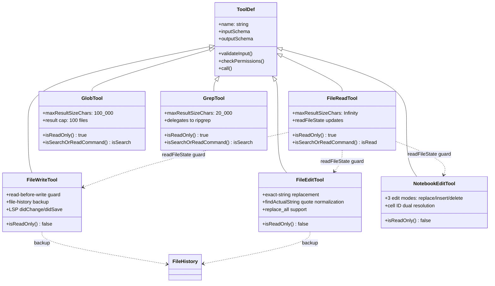
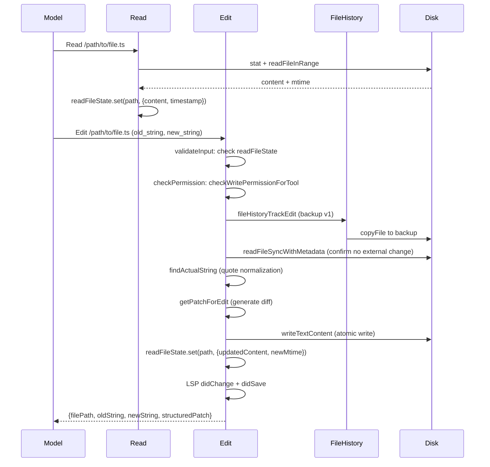
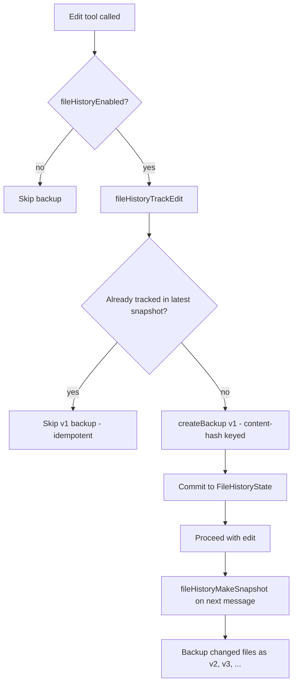

# File System Tools: Read, Write, Edit, Glob, Grep, Notebook

## Overview

The file system tool family forms the largest single cluster in cc's tool catalog: six tools that give the model read and write access to the repository and beyond. They are the primary interface through which an agent interacts with source code, configuration, and data. Each tool is a single-purpose unit (HER Pattern 11) with its own Zod schema, permission checks, and prompt template. This chapter traces the common architecture they share -- the read-before-write contract, the file-history checkpoint system, the permission pipeline -- and then dives into the distinct semantics of each tool: how `Read` deduplicates repeated reads and handles binary formats, how `Write` enforces stale-view rejection, how `Edit` performs exact string replacement, how `Glob` and `Grep` delegate to ripgrep, and how `NotebookEdit` manages `.ipynb` cell mutations. The chapter concludes with a discussion of the data-leakage risk HER identifies when file-based communication persists between contexts.

## Data structures and contracts

All six tools are constructed via `buildTool()`, inheriting the shared `ToolDef` interface. Each declares an input schema (Zod `strictObject`), an output schema, and a set of lifecycle hooks (`validateInput`, `checkPermissions`, `call`, `mapToolResultToToolResultBlockParam`).

### Read tool input schema

The `Read` tool's input schema is the richest, reflecting its multi-format support:

```typescript
// src/tools/FileReadTool/FileReadTool.ts:L227-L243
const inputSchema = lazySchema(() =>
  z.strictObject({
    file_path: z.string().describe('The absolute path to the file to read'),
    offset: semanticNumber(z.number().int().nonnegative().optional()).describe(
      'The line number to start reading from. Only provide if the file is too large to read at once',
    ),
    limit: semanticNumber(z.number().int().positive().optional()).describe(
      'The number of lines to read. Only provide if the file is too large to read at once.',
    ),
    pages: z
      .string()
      .optional()
      .describe(
        `Page range for PDF files (e.g., "1-5", "3", "10-20"). Only applicable to PDF files. Maximum ${PDF_MAX_PAGES_PER_READ} pages per request.`,
      ),
  }),
)
```

The `offset` and `limit` fields use `semanticNumber`, a wrapper that prevents the model from passing string representations of numbers where numeric types are expected. This wrapper is critical because LLMs frequently emit JSON with string-typed numeric fields, and without it the Zod `strictObject` parser would reject those inputs outright.

### Read tool output schema

The output schema uses a discriminated union with six variants, one for each content type the tool can return:

```typescript
// src/tools/FileReadTool/FileReadTool.ts:L248-L331
const outputSchema = lazySchema(() => {
  // Define the media types supported for images
  const imageMediaTypes = z.enum([
    'image/jpeg',
    'image/png',
    'image/gif',
    'image/webp',
  ])

  return z.discriminatedUnion('type', [
    z.object({
      type: z.literal('text'),
      file: z.object({
        filePath: z.string().describe('The path to the file that was read'),
        content: z.string().describe('The content of the file'),
        numLines: z
          .number()
          .describe('Number of lines in the returned content'),
        startLine: z.number().describe('The starting line number'),
        totalLines: z.number().describe('Total number of lines in the file'),
      }),
    }),
    z.object({
      type: z.literal('image'),
      file: z.object({
        base64: z.string().describe('Base64-encoded image data'),
        type: imageMediaTypes.describe('The MIME type of the image'),
        originalSize: z.number().describe('Original file size in bytes'),
        dimensions: z
          .object({
            originalWidth: z
              .number()
              .optional()
              .describe('Original image width in pixels'),
            originalHeight: z
              .number()
              .optional()
              .describe('Original image height in pixels'),
            displayWidth: z
              .number()
              .optional()
              .describe('Displayed image width in pixels (after resizing)'),
            displayHeight: z
              .number()
              .optional()
              .describe('Displayed image height in pixels (after resizing)'),
          })
          .optional()
          .describe('Image dimension info for coordinate mapping'),
      }),
    }),
    z.object({
      type: z.literal('notebook'),
      file: z.object({
        filePath: z.string().describe('The path to the notebook file'),
        cells: z.array(z.any()).describe('Array of notebook cells'),
      }),
    }),
    z.object({
      type: z.literal('pdf'),
      file: z.object({
        filePath: z.string().describe('The path to the PDF file'),
        base64: z.string().describe('Base64-encoded PDF data'),
        originalSize: z.number().describe('Original file size in bytes'),
      }),
    }),
    z.object({
      type: z.literal('parts'),
      file: z.object({
        filePath: z.string().describe('The path to the PDF file'),
        originalSize: z.number().describe('Original file size in bytes'),
        count: z.number().describe('Number of pages extracted'),
        outputDir: z
          .string()
          .describe('Directory containing extracted page images'),
      }),
    }),
    z.object({
      type: z.literal('file_unchanged'),
      file: z.object({
        filePath: z.string().describe('The path to the file'),
      }),
    }),
  ])
})
```

The discriminated union pattern allows downstream code to switch on the `type` field for type-safe pattern matching. The `file_unchanged` variant is the deduplication stub described later in this chapter.

### Edit tool schema

The `Edit` tool's schema captures the exact-replacement contract:

```typescript
// src/tools/FileEditTool/types.ts (referenced in FileEditTool)
const inputSchema = lazySchema(() =>
  z.strictObject({
    file_path: z.string().describe('The absolute path to the file to modify'),
    old_string: z.string().describe('The text to replace'),
    new_string: z
      .string()
      .describe(
        'The text to replace it with (must be different from old_string)',
      ),
    replace_all: semanticBoolean(
      z.boolean().default(false).optional(),
    ).describe('Replace all occurrences of old_string (default false)'),
  }),
)
```

The key constraint is that `old_string` must be unique in the file unless `replace_all` is set. This is not enforced by the schema itself but by the `validateInput` hook, which counts matches and rejects ambiguous edits.

### Write tool schema

The `Write` tool is the simplest of the three write-side tools: path and content only.

```typescript
// src/tools/FileWriteTool/FileWriteTool.ts:L56-L65
const inputSchema = lazySchema(() =>
  z.strictObject({
    file_path: z
      .string()
      .describe(
        'The absolute path to the file to write (must be absolute, not relative)',
      ),
    content: z.string().describe('The content to write to the file'),
  }),
)
```

The Write tool's output schema includes a `type` discriminator (`'create'` or `'update'`), the structured diff patch, and the original file content for diff rendering:

```typescript
// src/tools/FileWriteTool/FileWriteTool.ts:L68-L88
const outputSchema = lazySchema(() =>
  z.object({
    type: z
      .enum(['create', 'update'])
      .describe(
        'Whether a new file was created or an existing file was updated',
      ),
    filePath: z.string().describe('The path to the file that was written'),
    content: z.string().describe('The content that was written to the file'),
    structuredPatch: z
      .array(hunkSchema())
      .describe('Diff patch showing the changes'),
    originalFile: z
      .string()
      .nullable()
      .describe(
        'The original file content before the write (null for new files)',
      ),
    gitDiff: gitDiffSchema().optional(),
  }),
)
```

### NotebookEdit tool schema

The `NotebookEdit` tool manages `.ipynb` cell mutations with three edit modes:

```typescript
// src/tools/NotebookEditTool/NotebookEditTool.ts:L30-L57
export const inputSchema = lazySchema(() =>
  z.strictObject({
    notebook_path: z.string().describe(
      'The absolute path to the Jupyter notebook file to edit (must be absolute, not relative)',
    ),
    cell_id: z.string().optional().describe(
      'The ID of the cell to edit. When inserting a new cell, the new cell will be inserted after the cell with this ID, or at the beginning if not specified.',
    ),
    new_source: z.string().describe('The new source for the cell'),
    cell_type: z
      .enum(['code', 'markdown'])
      .optional()
      .describe(
        'The type of the cell (code or markdown). If not specified, it defaults to the current cell type. If using edit_mode=insert, this is required.',
      ),
    edit_mode: z.enum(['replace', 'insert', 'delete']).optional().describe(
      'The type of edit to make (replace, insert, delete). Defaults to replace.',
    ),
  }),
)
```

### readFileState: the shared write-guard map

A critical shared data structure is `readFileState` -- a `Map<string, ReadFileEntry>` maintained in `ToolUseContext` that records every file the model has read, along with the content, modification timestamp, offset, and limit. Both `Write` and `Edit` consult this map to enforce the read-before-write contract. The map is populated by the `Read` tool's `call` method and updated by the `Edit` and `Write` tools after they modify files, ensuring that subsequent reads see the updated timestamp.

### File-history state types

The file-history system has its own state type:

```typescript
// src/utils/fileHistory.ts:L31-L52
type BackupFileName = string | null // The null value means the file does not exist in this version

export type FileHistoryBackup = {
  backupFileName: BackupFileName
  version: number
  backupTime: Date
}

export type FileHistorySnapshot = {
  messageId: UUID // The associated message ID for this snapshot
  trackedFileBackups: Record<string, FileHistoryBackup> // Map of file paths to backup versions
  timestamp: Date
}

export type FileHistoryState = {
  snapshots: FileHistorySnapshot[]
  trackedFiles: Set<string>
  // Monotonically-increasing counter incremented on every snapshot, even when
  // old snapshots are evicted.  Used by useGitDiffStats as an activity signal
  // (snapshots.length plateaus once the cap is reached).
  snapshotSequence: number
}
```

Backups are stored at `~/.claude/file-history/{sessionId}/{sha256-hash}@v{N}` and keyed by content hash, making the v1 backup idempotent. The `snapshotSequence` counter is monotonically increasing even when old snapshots are evicted, serving as an activity signal for UI components that track edit frequency.

### The file-tool family

All six tools share the `buildTool()` contract but diverge in their permission hooks, concurrency semantics, and read/write classification:



## Control flow

### Read-before-write pipeline

All three write-side tools (`Write`, `Edit`, `NotebookEdit`) enforce the same invariant: the model must have read the file before modifying it. This prevents the model from blindly overwriting content it has never seen, which would lead to silent data loss. The check lives in `validateInput`:

```typescript
// src/tools/FileWriteTool/FileWriteTool.ts:L198-L206
const readTimestamp = toolUseContext.readFileState.get(fullFilePath)
if (!readTimestamp || readTimestamp.isPartialView) {
  return {
    result: false,
    message:
      'File has not been read yet. Read it first before writing to it.',
    errorCode: 2,
  }
}
```

If the file was modified externally after the read (e.g., by a linter or another process), the stale-view check fires:

```typescript
// src/tools/FileWriteTool/FileWriteTool.ts:L211-L219
const lastWriteTime = Math.floor(fileMtimeMs)
if (lastWriteTime > readTimestamp.timestamp) {
  return {
    result: false,
    message:
      'File has been modified since read, either by the user or by a linter. Read it again before attempting to write it.',
    errorCode: 3,
  }
}
```

The `Edit` tool adds a Windows-specific fallback: if the mtime changed but the content is identical (common with cloud sync or antivirus), it allows the edit through. This is necessary because Windows file-system watchers can trigger mtime updates without actual content changes, causing false-positive stale-view rejections.

The complete write-side control flow proceeds as:



The Edit tool's `call` method performs a precise string replacement. The key step is `findActualString`, which normalizes curly quotes and other Unicode variants so that the model's `old_string` matches even if the file uses different quote characters:

```typescript
// src/tools/FileEditTool/FileEditTool.ts:L471-L488
const actualOldString =
  findActualString(originalFileContents, old_string) || old_string

// Preserve curly quotes in new_string when the file uses them
const actualNewString = preserveQuoteStyle(
  old_string,
  actualOldString,
  new_string,
)

// Generate patch
const { patch, updatedFile } = getPatchForEdit({
  filePath: absoluteFilePath,
  fileContents: originalFileContents,
  oldString: actualOldString,
  newString: actualNewString,
  replaceAll: replace_all,
})
```

The `replace_all` flag enables bulk renaming. When `replace_all` is false and there are multiple matches, validation rejects the edit with a helpful message asking for more context.

### Read tool deduplication

The `Read` tool implements a deduplication mechanism to avoid sending the same content twice into context. If the model reads the same file with the same offset and limit, and the mtime has not changed, it returns a stub instead of the full content:

```typescript
// src/tools/FileReadTool/FileReadTool.ts:L547-L572
if (
  existingState &&
  !existingState.isPartialView &&
  existingState.offset !== undefined
) {
  const rangeMatch =
    existingState.offset === offset && existingState.limit === limit
  if (rangeMatch) {
    try {
      const mtimeMs = await getFileModificationTimeAsync(fullFilePath)
      if (mtimeMs === existingState.timestamp) {
        logEvent('tengu_file_read_dedup', {
          ...(analyticsExt !== undefined && { ext: analyticsExt }),
        })
        return {
          data: {
            type: 'file_unchanged' as const,
            file: { filePath: file_path },
          },
        }
      }
    }
```

The stub is a constant that tells the model the earlier content is still valid:

```typescript
// src/tools/FileReadTool/prompt.ts:L7-L8
export const FILE_UNCHANGED_STUB =
  'File unchanged since last read. The content from the earlier Read tool_result in this conversation is still current — refer to that instead of re-reading.'
```

This saves approximately 18% of Read calls from re-sending full content, reducing cache-creation tokens significantly. The dedup only applies to entries that came from a prior `Read` call (where `offset` is always set). `Edit` and `Write` store `offset: undefined`, so their `readFileState` entries are excluded from dedup -- a necessary distinction because the post-edit mtime would match even though the content has changed.

A GrowthBook killswitch (`tengu_read_dedup_killswitch`) can disable dedup if the stub message confuses the model in external deployments.

### Read tool multi-format handling

The `Read` tool dispatches to different code paths based on file extension. After the dedup check, it determines the format from the extension and routes accordingly:

- **Notebook (.ipynb)**: Reads the JSON, extracts cells, validates size and token limits, then stores the serialized cells in `readFileState`. If the notebook exceeds the byte limit, it suggests using `jq` via the Bash tool for targeted reads.

- **Image (.png, .jpg, .jpeg, .gif, .webp)**: Reads the file once into a buffer, applies standard resize, then checks against the token budget. If the standard resize still exceeds the budget, applies aggressive compression from the same buffer. The image dimensions (original and display) are included in the output for coordinate mapping.

The image processing pipeline is implemented in `src/tools/FileReadTool/imageProcessor.ts`. This module abstracts over two backends: a native N-API module (`image-processor-napi`) used in bundled mode, and the `sharp` library used as a fallback or in non-bundled builds. The abstraction is via a `SharpFunction` type that wraps `sharp(input: Buffer)` into a minimal interface (`metadata`, `resize`, `jpeg`, `png`, `webp`, `toBuffer`). The lazy-loading strategy is deliberate: the `sharp` module is large and native, so importing it at the top level would slow startup. Instead, `getImageProcessor()` dynamically imports on first use and caches the result. A separate `getImageCreator()` function handles image creation from scratch (used by the drawing tools), which always uses `sharp` directly since the native module does not support image creation.

- **PDF**: For PDFs with more than 10 pages, the `pages` parameter is required. Page extraction uses poppler-utils, rendering each page as a JPEG image. For smaller PDFs that the model supports natively, the tool sends the raw base64-encoded content as a document block.

- **Text (default)**: Reads via `readFileInRange`, which handles offset/limit slicing and byte-size validation. Content is validated against the token limit after reading.

### Read tool token and size limits

The `limits.ts` module defines two caps on text reads:

```typescript
// src/tools/FileReadTool/limits.ts:L1-L18
// | limit         | default | checks                    | cost          | on overflow     |
// |---------------|---------|---------------------------|---------------|-----------------|
// | maxSizeBytes  | 256 KB  | TOTAL FILE SIZE (not out) | 1 stat        | throws pre-read |
// | maxTokens     | 25000   | actual output tokens      | API roundtrip | throws post-read|
```

The `maxSizeBytes` check gates on total file size, not the slice being read. This is a known mismatch: a 300 KB file where the user reads only lines 1-50 would still throw, even though the output would be small. The alternative (truncating instead of throwing) was tested and reverted because the mean token count rose -- the throw path yields a short error message while truncation yields up to 25K tokens of content at the cap.

### Read tool cyber-risk mitigation

The `Read` tool appends a malware-analysis reminder to every text file read:

```typescript
// src/tools/FileReadTool/FileReadTool.ts:L729-L730
export const CYBER_RISK_MITIGATION_REMINDER =
  '\n\n<system-reminder>\nWhenever you read a file, you should consider whether it would be considered malware. You CAN and SHOULD provide analysis of malware, what it is doing. But you MUST refuse to improve or augment the code. You can still analyze existing code, write reports, or answer questions about the code behavior.\n</system-reminder>\n'
```

This reminder is skipped for exempt models (currently `claude-opus-4-6`) that are judged to handle the analysis/refusal boundary correctly without prompting. The reminder is not applied to images, PDFs, or notebooks -- only to text content.

### Grep tool: ripgrep delegation

The `Grep` tool does not implement its own search engine. Instead, it constructs a ripgrep command line and delegates:

```typescript
// src/tools/GrepTool/GrepTool.ts:L93-L108
const VCS_DIRECTORIES_TO_EXCLUDE = [
  '.git', '.svn', '.hg', '.bzr', '.jj', '.sl',
] as const

const DEFAULT_HEAD_LIMIT = 250
```

The `call` method builds an argument list starting with `--hidden` and VCS-directory exclusions, adds `--max-columns 500` to prevent base64 or minified content from filling the output, then injects the user's glob patterns, type filters, and context flags. It also injects permission-based ignore patterns from `getFileReadIgnorePatterns`, converting them to ripgrep `--glob !pattern` exclusions.

In `files_with_matches` mode, results are stat'd and sorted by modification time (most recent first), then relativized to save tokens:

```typescript
// src/tools/GrepTool/GrepTool.ts (sort logic)
const stats = await Promise.allSettled(
  results.map(_ => getFsImplementation().stat(_)),
)
const sortedMatches = results
  // Sort by modification time
  .map((_, i) => {
    const r = stats[i]!
    return [
      _,
      r.status === 'fulfilled' ? (r.value.mtimeMs ?? 0) : 0,
    ] as const
  })
  .sort((a, b) => {
    if (process.env.NODE_ENV === 'test') {
      // In tests, we always want to sort by filename, so that results are deterministic
      return a[0].localeCompare(b[0])
    }
    const timeComparison = b[1] - a[1]
    if (timeComparison === 0) {
      // Sort by filename as a tiebreaker
      return a[0].localeCompare(b[0])
    }
    return timeComparison
  })
  .map(_ => _[0])
```

A default `head_limit` of 250 prevents unbounded context bloat from broad searches. The model can override with `head_limit: 0` for unlimited results. When results are truncated, the output includes `[Showing results with pagination = limit: N]` so the model knows there may be more results and can paginate with `offset`.

### Glob tool: file-pattern matching

The `Glob` tool delegates to a custom `glob` utility that wraps ripgrep's file-search mode. It accepts a pattern and an optional path, returning matched filenames sorted by modification time:

```typescript
// src/tools/GlobTool/GlobTool.ts:L57-L65
export const GlobTool = buildTool({
  name: GLOB_TOOL_NAME,
  searchHint: 'find files by name pattern or wildcard',
  maxResultSizeChars: 100_000,
  async description() {
    return DESCRIPTION
  },
  userFacingName,
  getToolUseSummary,
  isConcurrencySafe() { return true },
  isReadOnly() { return true },
  isSearchOrReadCommand() { return { isSearch: true, isRead: false } },
})
```

Results are capped at 100 files (configurable via `globLimits`). When results are truncated, the output includes a message suggesting a more specific path or pattern. Paths are relativized under the current working directory to save tokens, matching the Grep tool's approach.

### File-history backup system

The file-history system provides checkpoint-restore semantics for all file edits. When a file is about to be edited, `fileHistoryTrackEdit` creates a v1 backup keyed by the content hash:

```typescript
// src/utils/fileHistory.ts:L86-L155
export async function fileHistoryTrackEdit(
  updateFileHistoryState: (
    updater: (prev: FileHistoryState) => FileHistoryState,
  ) => void,
  filePath: string,
  messageId: UUID,
): Promise<void> {
  if (!fileHistoryEnabled()) {
    return
  }

  const trackingPath = maybeShortenFilePath(filePath)

  // Phase 1: check if backup is needed. Speculative writes would overwrite
  // the deterministic {hash}@v1 backup on every repeat call — a second
  // trackEdit after an edit would corrupt v1 with post-edit content.
  let captured: FileHistoryState | undefined
  updateFileHistoryState(state => {
    captured = state
    return state
  })
  if (!captured) return
  const mostRecent = captured.snapshots.at(-1)
  if (!mostRecent) {
    logError(new Error('FileHistory: Missing most recent snapshot'))
    logEvent('tengu_file_history_track_edit_failed', {})
    return
  }
  if (mostRecent.trackedFileBackups[trackingPath]) {
    // Already tracked in the most recent snapshot; next makeSnapshot will
    // re-check mtime and re-backup if changed. Do not touch v1 backup.
    return
  }

  // Phase 2: async backup.
  let backup: FileHistoryBackup
  try {
    backup = await createBackup(filePath, 1)
  } catch (error) {
    logError(error)
    logEvent('tengu_file_history_track_edit_failed', {})
    return
  }

  // Phase 3: commit. Re-check tracked (another trackEdit may have raced).
  updateFileHistoryState((state: FileHistoryState) => {
    try {
      const mostRecentSnapshot = state.snapshots.at(-1)
      if (
        !mostRecentSnapshot ||
        mostRecentSnapshot.trackedFileBackups[trackingPath]
      ) {
        return state
      }

      const updatedTrackedFiles = state.trackedFiles.has(trackingPath)
        ? state.trackedFiles
        : new Set(state.trackedFiles).add(trackingPath)

      const updatedMostRecentSnapshot = {
        ...mostRecentSnapshot,
        trackedFileBackups: {
          ...mostRecentSnapshot.trackedFileBackups,
          [trackingPath]: backup,
        },
      }

      return {
        ...state,
        trackedFiles: updatedTrackedFiles,
        snapshots: [
          ...state.snapshots.slice(0, -1),
          updatedMostRecentSnapshot,
        ],
      }
    } catch {
      return state
    }
  })
}
```

The three-phase structure (capture, async backup, commit) is necessary because the `updateFileHistoryState` function is synchronous -- the actual file copy must happen outside the updater to avoid async operations inside a React state setter. The idempotent v1 backup means that calling `fileHistoryTrackEdit` twice before an edit does not overwrite the v1 backup with post-edit content.

The snapshot system creates a new `FileHistorySnapshot` on every message turn, backing up any tracked files that have changed since the last snapshot. Snapshots are capped at 100 (`MAX_SNAPSHOTS`), with oldest entries evicted when the cap is reached. The `snapshotSequence` counter continues incrementing even after eviction, providing a monotonically increasing activity signal.



The rewind operation (`fileHistoryRewind`) restores all tracked files to their state at a target snapshot, deleting files that did not exist at that point and restoring backup content for files that have changed.

## Edge cases and failure modes

**Device-file blocking.** The `Read` tool blocks reads of device files that would hang or produce infinite output (`/dev/zero`, `/dev/random`, `/dev/stdin`, `/proc/self/fd/0-2`): `src/tools/FileReadTool/FileReadTool.ts:L96-L128`. This prevents the agent from accidentally hanging on special files. The check is path-based only (no I/O), and safe devices like `/dev/null` are intentionally omitted from the block list.

**macOS screenshot paths.** macOS uses a thin non-breaking space (U+202F) before AM/PM in screenshot filenames on some versions. The `Read` tool tries the alternate character if the file is not found at the given path: `src/tools/FileReadTool/FileReadTool.ts:L147-L159`. Without this fallback, reading macOS screenshots would fail on certain locale configurations.

**Binary file rejection.** The `Read` tool's `validateInput` checks `hasBinaryExtension` and rejects binary files, with exceptions for PDFs, images, and SVGs: `src/tools/FileReadTool/FileReadTool.ts:L470-L482`. The `Edit` tool blocks edits to `.ipynb` files and redirects to `NotebookEdit`: `src/tools/FileEditTool/FileEditTool.ts:L266-L273`. This prevents the model from corrupting structured JSON files with string-based edits.

**Token overflow.** The `Read` tool validates token counts after reading, throwing `MaxFileReadTokenExceededError` if the content exceeds the configured limit (default 25,000 tokens): `src/tools/FileReadTool/FileReadTool.ts:L175-L185`. This is a post-read check because token counting requires the actual content. The error message suggests using offset and limit parameters instead.

**UNC path security.** All three write-side tools skip filesystem operations for UNC paths (`\\server\share`) to prevent NTLM credential leaks on Windows: `src/tools/FileWriteTool/FileWriteTool.ts:L179-L184`, `src/tools/FileEditTool/FileEditTool.ts:L179-L181`. The check is performed early in `validateInput` before any I/O, ensuring that no SMB authentication is triggered.

**Notebook cell ID resolution.** `NotebookEdit` first tries to find cells by their actual ID field. If not found, it falls back to parsing the `cell-N` numeric index format: `src/tools/NotebookEditTool/NotebookEditTool.ts:L353-L367`. This dual-resolution strategy handles notebooks that use different cell-ID conventions.

**File-history idempotency.** The v1 backup is content-hash-keyed, so calling `fileHistoryTrackEdit` twice before an edit does not overwrite the v1 backup with post-edit content: `src/utils/fileHistory.ts:L99-L118`. The phase-1 check in `fileHistoryTrackEdit` explicitly checks whether the file is already tracked in the most recent snapshot before creating a new backup.

**Edit tool replace-mode edge case.** When `edit_mode` is `replace` and `cellIndex` equals `notebook.cells.length`, `NotebookEdit` converts the operation to `insert` automatically: `src/tools/NotebookEditTool/NotebookEditTool.ts:L371-L377`. This handles the case where the model tries to replace a cell one past the end, which is semantically an insertion.

**Read tool memory-file freshness.** When reading auto-memory files, the `Read` tool attaches a freshness note via `memoryFileMtimes`, a `WeakMap` keyed by the data object identity: `src/tools/FileReadTool/FileReadTool.ts:L746-L753`. The `WeakMap` auto-garbage-collects when the data object becomes unreachable after rendering, preventing memory leaks.

## Where cc diverges from the published pattern

HER Pattern 11 (Single-Purpose Tool Design) recommends that each tool have individual permission rules. cc implements this faithfully: `Read` and `Glob`/`Grep` use `checkReadPermissionForTool`, while `Write` and `Edit` use `checkWritePermissionForTool`. However, cc diverges in one notable way: the `Edit` tool does more than edit -- it also triggers skill discovery (`discoverSkillDirsForPaths`), LSP notifications (`didChange`/`didSave`), VS Code bridge updates, and file-history tracking. In a strict single-purpose reading, these are cross-cutting concerns that could be handled by the hook system (Pattern 12) rather than baked into the tool's `call` method. The practical reason is performance: inline calls avoid the IPC overhead of spawning a hook process for every file edit.

HER failure mode 6.4 (Placeholder Implementations) warns that agents default to stubs. cc's `Edit` tool combats this with its strict uniqueness requirement: if `old_string` is not unique in the file, the edit is rejected unless `replace_all` is set. This forces the model to be precise about what it is changing, reducing the risk of partial or placeholder edits.

HER failure mode 6.15 (Data Leakage Between Contexts) warns that file-based communication inherently persists data to disk. cc's file-history system exacerbates this: backups are stored under `~/.claude/file-history/` and persist across sessions. The `copyFileHistoryForResume` function even migrates backups between sessions via hard links (`src/utils/fileHistory.ts`). A sensitive file edited in one session could have its pre-edit content preserved in the backup directory of a later session.

The `Read` tool's `CYBER_RISK_MITIGATION_REMINDER` is an example of a prompt-level safety boundary rather than a structural one. It relies on the model following the instruction to refuse malware augmentation. HER failure mode 6.13 (Prompt Injection) warns that such instructions can be overridden by malicious content in the file being read. cc mitigates this by making the reminder a `system-reminder` block, which has higher instruction priority than user or tool-result content.

## Developer takeaways for building a long-running agent

1. **Enforce read-before-write at the tool level, not the prompt level.** cc's `readFileState` mechanism is a deterministic guard: even if the model never mentions reading a file, the tool rejects the write. Prompt-level instructions ("always read before writing") are unreliable because models sometimes skip steps under context pressure.

2. **Deduplicate reads to control context bloat.** The `file_unchanged` stub saves tokens on repeated reads of the same file. In a long-running agent session, the model may re-read files many times (e.g., after each edit). Without deduplication, each re-read duplicates thousands of tokens in context.

3. **Use content-hash-keyed backups for file history.** cc's `{sha256-prefix}@v{N}` naming scheme ensures that the v1 backup is idempotent even if `trackEdit` is called speculatively. This is critical for agents that may retry operations or call trackEdit before confirming the edit will proceed.

4. **Delegate to purpose-built search tools.** cc's `Grep` and `Glob` tools are thin wrappers around ripgrep. Building a custom search engine would be a maintenance burden with no advantage. The same principle applies to image processing (sharp) and PDF rendering (poppler).

5. **Normalize Unicode in edit operations.** The `findActualString` / `preserveQuoteStyle` pipeline handles the mismatch between the model's output (which may use ASCII quotes) and the file's actual encoding (which may use curly quotes). Without this, edits to documentation files would frequently fail with "string not found."

6. **Guard against data leakage in persistent backup systems.** File-history backups contain the pre-edit content of every tracked file, stored indefinitely under the session directory. For agents handling sensitive data (credentials, secrets), the backup directory becomes a secondary attack surface. Consider implementing per-file opt-out or encryption for backup files.

7. **Sort search results by recency.** The `GrepTool`'s `files_with_matches` mode sorts results by file modification time (most recent first). This is a practical heuristic: the files the developer has been editing recently are more likely to be relevant than files that have not been touched in months. The same principle applies to any search tool in a codebase context.

8. **Provide explicit truncation signals.** When grep results are truncated by `head_limit`, the output includes `[Showing results with pagination = limit: N]` so the model knows there may be more results and can paginate with `offset`. Without this signal, the model might incorrectly conclude that the returned results are exhaustive.

9. **Handle the read-before-write race window.** cc's Edit and Write tools have a critical section between the staleness check and the disk write where no async operations should occur. The comment in `FileEditTool.ts` is explicit: "Please avoid async operations between here and writing to disk to preserve atomicity." A yield in this window (e.g., an `await` between the mtime check and `writeTextContent`) would allow concurrent edits to interleave, potentially causing data loss. For any read-modify-write cycle, ensure the check and write are in the same synchronous block.

10. **Skip dedup for write-tool entries in readFileState.** The `Read` tool's dedup mechanism checks `existingState.offset !== undefined` to exclude entries that came from `Edit` or `Write` (which store `offset: undefined`). Without this exclusion, a `Read` followed by an `Edit` followed by another `Read` in the same millisecond would return the `file_unchanged` stub against stale in-context content, because the post-edit mtime would match the entry that `Edit` recently wrote. The `offset` field doubles as a provenance marker: it distinguishes "I read this file" from "I wrote this file."

11. **Use `maxResultSizeChars` to control tool-result persistence.** The `GrepTool` sets `maxResultSizeChars: 20_000`, which is the tool-result persistence threshold. Grep results that exceed this threshold are not persisted across turns, reducing context bloat for large search results. The `Read` tool sets `maxResultSizeChars: Infinity` because its output should never be persisted -- the model will re-read the file if it needs the content again, and the dedup mechanism handles this efficiently. Choose the persistence threshold based on whether the tool output is likely to be needed verbatim in subsequent turns.

### Deep dive: the Write tool's atomic write and LSP notification sequence

The `Write` tool's `call` method follows a strict sequence to ensure data integrity. After the `validateInput` checks pass and the file-history backup is created, the tool enters a critical section where it reads the current file content, confirms no external modifications have occurred, and writes the new content. The comment in the source is explicit about the atomicity requirement: "Please avoid async operations between here and writing to disk to preserve atomicity."

After the write completes, the tool sends two LSP notifications: `didChange` (content has been modified) and `didSave` (file has been saved to disk). The `didSave` notification is particularly important for the TypeScript language server because it triggers diagnostics. Both notifications are fire-and-forget -- the tool does not await their completion before returning the result. This prevents the tool's response time from being affected by LSP server latency.

The tool also notifies the VS Code bridge via `notifyVscodeFileUpdated`, which updates the diff view in the VS Code extension. This notification includes both the original and new content, allowing the extension to render the diff without re-reading the file. The notification is also fire-and-forget.

Finally, the tool updates `readFileState` with the new content and mtime. This update is critical: without it, a subsequent `Edit` or `Write` call would fail the stale-view check because the `readFileState` entry would still contain the pre-write mtime. The update uses `offset: undefined` and `limit: undefined`, which marks the entry as a full read and excludes it from the `Read` tool's dedup mechanism.

### Deep dive: the NotebookEdit tool's cell mutation semantics

The `NotebookEdit` tool handles three distinct mutation types, each with different validation requirements:

**Replace mode.** The tool replaces the source of the target cell. For code cells, it also resets `execution_count` to `null` and clears `outputs`, since the cell has been modified and any previous execution results are stale. The `cell_type` field can be changed during replacement, allowing a markdown cell to be converted to a code cell or vice versa.

**Insert mode.** The tool creates a new cell and inserts it after the cell specified by `cell_id`, or at the beginning if no `cell_id` is provided. The `cell_type` parameter is required for insert operations because the tool cannot infer the type from a non-existent cell. For notebooks with `nbformat >= 4.5`, the tool generates a random cell ID using `Math.random().toString(36).substring(2, 15)`.

**Delete mode.** The tool removes the target cell from the `cells` array using `splice`. No other fields are modified. Deleted cells cannot be recovered through the tool itself; the file-history system provides the undo mechanism.

The tool writes the modified notebook back to disk using `jsonStringify` with an indent of 1 (matching the Jupyter notebook convention). The encoding and line endings are preserved from the original file. The `readFileState` is updated with the post-write mtime and `offset: undefined`, matching the `Edit` and `Write` tools' behavior.
