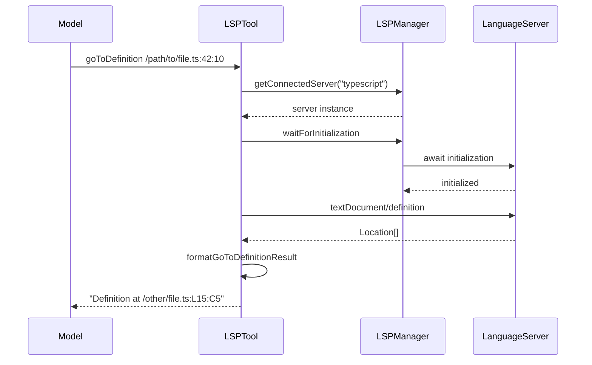
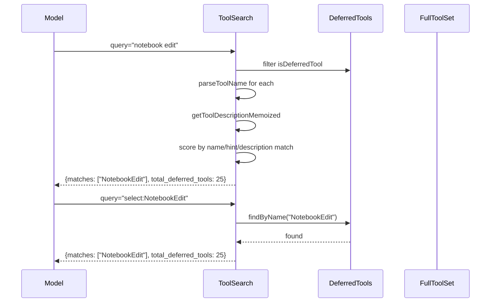
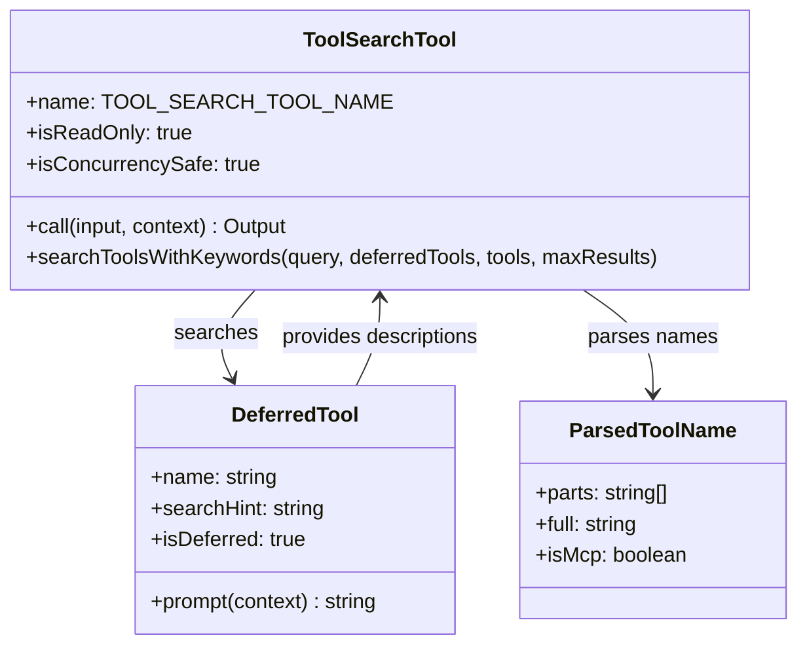
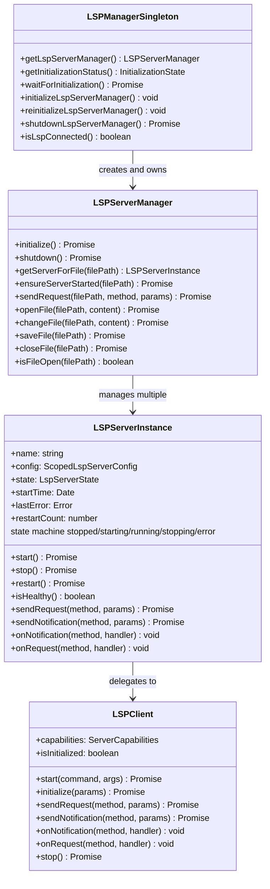

# Search, LSP, and Code Analysis Tools

## Overview

The tools in this chapter serve a different purpose than the file-system tools of Chapter 13: instead of reading and writing files, they search, analyze, and navigate code. `GrepTool` performs content search via ripgrep, `LSPTool` provides language-server-protocol operations (go-to-definition, find-references, hover, document symbols), and `ToolSearchTool` implements progressive tool expansion -- the mechanism by which cc exposes its full tool catalog to the model without flooding the initial prompt. Together, these tools implement HER Pattern 9 (Progressive Tool Expansion) and address HER failure mode 6.8 (Tool Explosion). This chapter covers the architecture of each tool, the LSP client lifecycle, the keyword-based search algorithm that powers `ToolSearchTool`, and the tradeoffs inherent in lazy tool loading.

## Data structures and contracts

### GrepTool schema

The `GrepTool` input schema mirrors ripgrep's command-line interface with semantic type wrappers:

```typescript
// src/tools/GrepTool/GrepTool.ts:L33-L89
const inputSchema = lazySchema(() =>
  z.strictObject({
    pattern: z.string().describe(
      'The regular expression pattern to search for in file contents',
    ),
    path: z.string().optional().describe(
      'File or directory to search in (rg PATH). Defaults to current working directory.',
    ),
    glob: z.string().optional().describe(
      'Glob pattern to filter files (e.g. "*.js", "*.{ts,tsx}") - maps to rg --glob',
    ),
    output_mode: z.enum(['content', 'files_with_matches', 'count']).optional(),
    '-B': semanticNumber(z.number().optional()),
    '-A': semanticNumber(z.number().optional()),
    '-C': semanticNumber(z.number().optional()),
    context: semanticNumber(z.number().optional()),
    '-n': semanticBoolean(z.boolean().optional()),
    '-i': semanticBoolean(z.boolean().optional()),
    type: z.string().optional(),
    head_limit: semanticNumber(z.number().optional()),
    offset: semanticNumber(z.number().optional()),
    multiline: semanticBoolean(z.boolean().optional()),
  }),
)
```

The `semanticNumber` and `semanticBoolean` wrappers solve a practical problem: LLMs frequently emit JSON with string-typed numeric fields (e.g., `"head_limit": "10"` instead of `"head_limit": 10`). Without these wrappers, Zod's `strictObject` parser would reject the input outright, causing a tool-call failure that the model must then retry. The `semanticNumber` wrapper coerces string representations of numbers into their numeric equivalents, reducing tool-call failures.

The output schema varies by mode. In `files_with_matches` mode, it returns sorted file paths; in `content` mode, it returns matched lines with line numbers; in `count` mode, it returns match counts per file. The output schema captures the applied limit and offset for pagination signaling:

```typescript
// src/tools/GrepTool/GrepTool.ts:L144-L156
const outputSchema = lazySchema(() =>
  z.object({
    mode: z.enum(['content', 'files_with_matches', 'count']).optional(),
    numFiles: z.number(),
    filenames: z.array(z.string()),
    content: z.string().optional(),
    numLines: z.number().optional(),
    numMatches: z.number().optional(),
    appliedLimit: z.number().optional(),
    appliedOffset: z.number().optional(),
  }),
)
```

### LSPTool schema

The `LSPTool` supports nine operations, each targeting a specific position in a source file:

```typescript
// src/tools/LSPTool/LSPTool.ts:L59-L86
const inputSchema = lazySchema(() =>
  z.strictObject({
    operation: z
      .enum([
        'goToDefinition',
        'findReferences',
        'hover',
        'documentSymbol',
        'workspaceSymbol',
        'goToImplementation',
        'prepareCallHierarchy',
        'incomingCalls',
        'outgoingCalls',
      ])
      .describe('The LSP operation to perform'),
    filePath: z.string().describe('The absolute or relative path to the file'),
    line: z.number().int().positive()
      .describe('The line number (1-based, as shown in editors)'),
    character: z.number().int().positive()
      .describe('The character offset (1-based, as shown in editors)'),
  }),
)
```

All nine operations require a file path and a position (line, character). This position-based interface mirrors the LSP protocol itself, where most requests are anchored to a specific text document position. The operations divide into three categories:

- **Navigation**: `goToDefinition`, `goToImplementation`, `findReferences`
- **Inspection**: `hover`, `documentSymbol`, `workspaceSymbol`
- **Call graph**: `prepareCallHierarchy`, `incomingCalls`, `outgoingCalls`

### ToolSearchTool schema

The `ToolSearchTool` input is intentionally minimal:

```typescript
// src/tools/ToolSearchTool/ToolSearchTool.ts:L21-L35
export const inputSchema = lazySchema(() =>
  z.object({
    query: z.string().describe(
      'Query to find deferred tools. Use "select:<tool_name>" for direct selection, or keywords to search.',
    ),
    max_results: z.number().optional().default(5)
      .describe('Maximum number of results to return (default: 5)'),
  }),
)
```

The output returns matching tool names, the total deferred count, and pending MCP server information:

```typescript
// src/tools/ToolSearchTool/ToolSearchTool.ts:L37-L45
export const outputSchema = lazySchema(() =>
  z.object({
    matches: z.array(z.string()),
    query: z.string(),
    total_deferred_tools: z.number(),
    pending_mcp_servers: z.array(z.string()).optional(),
  }),
)
```

The `pending_mcp_servers` field is critical for the model's planning: when it searches for a tool and finds zero matches, the presence of pending servers tells it that more tools will become available shortly, preventing it from concluding that a capability is missing.

## Control flow

### GrepTool: ripgrep delegation with permission filtering

The `GrepTool.call` method constructs a ripgrep command line from the input parameters and delegates to the `ripGrep` utility. The key steps are:

1. Build the argument list starting with `--hidden` and VCS-directory exclusions (`.git`, `.svn`, `.hg`, `.bzr`, `.jj`, `.sl`).

2. Apply `--max-columns 500` to prevent base64 or minified content from filling the output.

3. Add the user's glob patterns, type filters, and context flags.

4. Inject permission-based ignore patterns from `getFileReadIgnorePatterns`, converting them to ripgrep `--glob !pattern` exclusions.

5. Inject orphaned-plugin-cache exclusions.

6. Execute ripgrep and process results by output mode.

In `files_with_matches` mode, results are stat'd and sorted by modification time (most recent first), then relativized to save tokens:

```typescript
// src/tools/GrepTool/GrepTool.ts:L529-L556 (sort logic)
const stats = await Promise.allSettled(
  results.map(_ => getFsImplementation().stat(_)),
)
const sortedMatches = results
  .map((_, i) => {
    const r = stats[i]!
    return [_, r.status === 'fulfilled' ? (r.value.mtimeMs ?? 0) : 0] as const
  })
  .sort((a, b) => {
    const timeComparison = b[1] - a[1]
    if (timeComparison === 0) {
      return a[0].localeCompare(b[0])
    }
    return timeComparison
  })
  .map(_ => _[0])
```

The `Promise.allSettled` approach is defensive: if a stat fails (e.g., file was deleted between the ripgrep scan and the stat call), the file is assigned a timestamp of 0, placing it at the end of the sorted results rather than causing an error.

A default `head_limit` of 250 prevents unbounded context bloat from broad searches. The model can override with `head_limit: 0` for unlimited results. The `applyHeadLimit` function handles both limit and offset:

```typescript
// src/tools/GrepTool/GrepTool.ts:L110-L128
function applyHeadLimit<T>(
  items: T[],
  limit: number | undefined,
  offset: number = 0,
): { items: T[]; appliedLimit: number | undefined } {
  // Explicit 0 = unlimited escape hatch
  if (limit === 0) {
    return { items: items.slice(offset), appliedLimit: undefined }
  }
  const effectiveLimit = limit ?? DEFAULT_HEAD_LIMIT
  const sliced = items.slice(offset, offset + effectiveLimit)
  const wasTruncated = items.length - offset > effectiveLimit
  return {
    items: sliced,
    appliedLimit: wasTruncated ? effectiveLimit : undefined,
  }
}
```

When results are truncated, the output includes `[Showing results with pagination = limit: N]` so the model knows there may be more results and can paginate with `offset`. The `appliedLimit` is only reported when truncation actually occurred, preventing the model from incorrectly concluding that untruncated results are exhaustive.

### LSPTool: language-server integration

The `LSPTool` provides structured code navigation through the Language Server Protocol. It connects to the LSP server manager, which maintains running language server instances (e.g., TypeScript, Python). The tool validates that the file is not too large (10 MB cap) and that the LSP server is connected and initialized before dispatching the operation.

The eight operations map directly to LSP requests:

- `goToDefinition` / `goToImplementation`: resolve symbol locations across the workspace
- `findReferences`: find all usages across the workspace, including imports and indirect references
- `hover`: get type information, documentation, and inferred types at a position
- `documentSymbol` / `workspaceSymbol`: list symbols in a file or workspace (functions, classes, variables)
- `prepareCallHierarchy` / `incomingCalls` / `outgoingCalls`: trace call graphs to understand data flow and dependency chains

Results are formatted by dedicated formatters (e.g., `formatGoToDefinitionResult`, `formatFindReferencesResult`) that convert LSP response structures into human-readable text suitable for the model's context. The formatters are critical because raw LSP responses contain nested structures, URIs, and range objects that would waste tokens if sent verbatim.



### ToolSearchTool: progressive tool expansion

The `ToolSearchTool` is the linchpin of cc's progressive tool expansion strategy. Instead of including all 60+ tools in the initial prompt (which would consume thousands of tokens and degrade selection accuracy), cc includes a small set of core tools and defers the rest. When the model needs a deferred tool, it queries `ToolSearchTool`, which returns matching tool names. The model then uses a `select:ToolName` query to activate the tool.

The search algorithm has two paths:

1. **Direct selection** (`select:ToolName`): If the query starts with `select:`, the tool checks whether the named tool exists in the deferred set (or the full tool set as a fallback). This handles the common case where the model knows the tool name from a previous search result.

2. **Keyword search**: The algorithm parses the query into terms, partitions them into required (`+`-prefixed) and optional terms, and scores each deferred tool by matching against its name parts, search hint, and description.



The keyword scoring weights reflect the signal quality of each match source:

- Exact name-part match: 10 points (12 for MCP tools, reflecting the higher specificity of server names)
- Partial name-part match: 5 points (6 for MCP)
- Search hint match (word boundary): 4 points
- Description match (word boundary): 2 points

MCP tool names are parsed differently from regular tools. The `mcp__server__action` format is split on `__` and `_` to extract searchable parts like "server" and "action". This is necessary because MCP tool names are auto-generated from the server and action names, and the raw format is not a natural search target.

The description cache is memoized by tool name and invalidated when the set of deferred tools changes (detected via a cache key that is the sorted, comma-joined list of deferred tool names):

```typescript
// src/tools/ToolSearchTool/ToolSearchTool.ts (memoization and cache invalidation)
// maybeInvalidateCache detects stale cache by comparing current cache key
// (sorted deferred tool names) against the cached key. When they differ,
// the entire memoization cache is cleared.
```

The `searchHint` field on tool definitions provides a curated, high-signal capability phrase that scores higher than the full description in keyword matching. For example, `NotebookEdit` has `searchHint: 'edit Jupyter notebook cells (.ipynb)'`, which matches queries like "notebook" or "jupyter" with higher confidence than the generic description text.



## Edge cases and failure modes

**Ripgrep timeout.** On WSL, file reads are 3-5x slower than native Linux. The `GrepTool` relies on ripgrep's built-in timeout rather than using the `AbortController` to avoid interrupting the agent loop. If ripgrep times out, it throws a `RipgrepTimeoutError`, which propagates up so the model knows the search did not complete (rather than incorrectly inferring zero matches).

**Empty grep results.** When `output_mode` is `files_with_matches` and no files are found, the tool returns "No files found" instead of an empty list, giving the model a clear signal that the search came up empty rather than encountering an error. The same approach is used by the `Glob` tool: zero matches returns "No files found" rather than an empty array, which the model might interpret as an error condition.

**Head-limit truncation.** When results are truncated by `head_limit`, the output includes `[Showing results with pagination = limit: N]` so the model knows there may be more results and can paginate with `offset`. Without this signal, the model might incorrectly conclude that the returned results are exhaustive. The `appliedLimit` field is only set when truncation actually occurred, preventing false signals when all results fit within the limit.

**LSP server not ready.** The `LSPTool` checks `getInitializationStatus` and `waitForInitialization` before dispatching operations. If the LSP server is still initializing, the tool waits (up to a timeout) rather than failing immediately. This prevents errors during the early phase of a session when the language server is still indexing the workspace. The timeout behavior is important: waiting too long would stall the agent loop, while failing too early would cause unnecessary retry churn.

**MCP servers still connecting.** When `ToolSearchTool` returns zero matches, it checks for MCP servers that are still connecting and includes their names in the output. This informs the model that more tools will become available shortly, preventing it from concluding that a capability is missing. The `pending_mcp_servers` field is the mechanism that bridges the gap between MCP server startup latency and the model's need to plan its tool usage.

**Tool already loaded.** If the model uses `select:ToolName` for a tool that is already in the active (non-deferred) set, the search returns the tool name anyway. This is a harmless no-op that lets the model proceed without retry churn. The alternative -- returning an error -- would cause the model to waste turns searching for a tool it has already activated.

**Cache invalidation.** The `getToolDescriptionMemoized` cache can become stale when MCP servers connect or disconnect, changing the set of deferred tools. The `maybeInvalidateCache` function detects this by comparing the current cache key (sorted deferred tool names) against the cached key. When they differ, the entire memoization cache is cleared. The sorted, comma-joined cache key is simple but effective: any change in the deferred tool set produces a different key, triggering a full cache flush.

**Grep result persistence.** The `GrepTool` sets `maxResultSizeChars: 20_000`, which is the tool-result persistence threshold. Grep results that exceed this threshold are not persisted across turns, reducing context bloat for large search results. This is a tradeoff: the model loses access to the full search results in subsequent turns, but the context savings are significant for searches that return thousands of matches.

## Where cc diverges from the published pattern

HER Pattern 9 (Progressive Tool Expansion) recommends starting with fewer than 20 tools and activating more on demand. cc implements this with the `shouldDefer` flag on tool definitions. Tools like `NotebookEditTool` and `MCPTool` set `shouldDefer: true`, which excludes them from the initial prompt and makes them discoverable only through `ToolSearchTool`. Notably, `ToolSearchTool` itself is never deferred -- the `isDeferredTool()` function explicitly excludes it (`if (tool.name === TOOL_SEARCH_TOOL_NAME) return false`) because it is the search mechanism that makes deferred tools discoverable. Deferring the search tool would create a chicken-and-egg problem.

However, cc diverges from the published pattern in several ways:

1. **No tool-eviction mechanism.** The published pattern implies that tools can be deactivated when no longer needed. cc does not implement tool eviction -- once a tool is loaded via `ToolSearchTool`, it remains in the active set for the rest of the session. For long-running sessions with many tool activations, this gradually increases prompt size and degrades selection accuracy, the very problem that progressive expansion was designed to solve. A reference-counting scheme that deactivates tools after N turns of disuse would address this.

2. **Description fetching is lazy and expensive.** When `ToolSearchTool` performs keyword search, it fetches each deferred tool's description via `tool.prompt()`. This is an async operation that generates the full prompt text, which can be expensive for tools with dynamic prompts. The memoization cache mitigates this, but the first search for a large deferred set can be slow. A pre-computed index of tool descriptions would eliminate this latency at the cost of freshness.

3. **Search is keyword-based, not semantic.** The published pattern does not specify the search algorithm. cc uses a simple keyword-matching approach with weighted scoring. This works well for known tool names and common terms but can miss tools when the model uses unexpected vocabulary (e.g., searching for "database" might not find a tool described as "query engine"). An embedding-based semantic search would improve recall but add complexity and latency.

HER failure mode 6.8 (Tool Explosion) warns that too many tools degrade selection accuracy. cc addresses this through deferral, but the lack of eviction means that the active tool set grows monotonically. In a session that activates many deferred tools, the selection accuracy degradation that progressive expansion was designed to prevent can re-emerge. The `ToolSearchTool` itself is a partial mitigation: even when the active set is large, the model can use `select:ToolName` to directly specify the tool it wants, bypassing the selection problem entirely.

## Developer takeaways for building a long-running agent

1. **Defer tools aggressively.** Including every tool in the initial prompt wastes tokens and confuses the model. The `shouldDefer` flag combined with `ToolSearchTool` provides a clean mechanism for lazy loading. The initial tool set should be the smallest possible set that covers common operations. Any tool that is used in fewer than 10% of sessions is a candidate for deferral.

2. **Implement tool eviction.** For agents that run for many hours, the lack of tool eviction is a real problem. Consider implementing a reference-counting scheme: when a tool has not been used for N turns, remove it from the active set and return it to the deferred pool. This keeps the prompt lean without losing access to rarely-used capabilities.

3. **Provide search hints.** The `searchHint` field on tool definitions provides a curated, high-signal capability phrase that scores higher than the full description in keyword matching. This is a small investment (one line per tool) that significantly improves search accuracy. Without search hints, tools with generic descriptions are hard to find via keyword search.

4. **Handle MCP server latency gracefully.** When MCP servers are still connecting, `ToolSearchTool` includes pending server names in the output. This is a better user experience than returning "no matches found" when tools are not yet available. For any progressive tool expansion system, you must account for asynchronous tool discovery.

5. **Sort search results by recency.** The `GrepTool`'s `files_with_matches` mode sorts results by file modification time (most recent first). This is a practical heuristic: the files the developer has been editing recently are more likely to be relevant than files that have not been touched in months. The same principle applies to any search tool in a codebase context.

6. **Use ripgrep rather than building a search engine.** cc's `GrepTool` is a thin wrapper around ripgrep. Building a custom search engine would be a maintenance burden with no advantage over the purpose-built tool that ripgrep provides. The same principle applies to other infrastructure-quality services (LSP for code analysis, tree-sitter for parsing).

7. **Provide explicit truncation signals in paginated results.** The `[Showing results with pagination = limit: N]` suffix tells the model that there are more results available. Without this signal, the model cannot distinguish between "these are all the results" and "these are the first N results." The `appliedLimit` field in the output schema is the programmatic equivalent of this signal.

8. **Invalidate description caches when the tool set changes.** The `maybeInvalidateCache` function detects stale caches by comparing cache keys. For any system where tools can be added or removed at runtime (MCP servers connecting and disconnecting), the description cache must be invalidated when the tool set changes. A stale cache would return descriptions for tools that no longer exist or miss descriptions for newly added tools.

### Deep dive: the GrepTool output modes

The `GrepTool` supports three output modes, each with different token-cost profiles and use cases:

**`files_with_matches` mode.** This is the default and lowest-cost mode. It returns only file paths, sorted by modification time. This mode is ideal for initial exploration: the model can identify which files contain a pattern and then use the `Read` tool to examine specific matches. The token cost is proportional to the number of matching files, not the number of matches.

**`content` mode.** This mode returns matched lines with line numbers and optional context lines (`-A`, `-B`, `-C`). It is the highest-cost mode because it includes the actual content of each match. The `--max-columns 500` limit prevents individual lines from consuming excessive tokens, and the default `head_limit` of 250 caps the total number of returned lines.

**`count` mode.** This mode returns the number of matches per file, useful for assessing the prevalence of a pattern across the codebase. It has a moderate token cost because it includes file paths and counts but not content.

The mode selection is left to the model, which must balance between comprehensiveness and token cost. The `files_with_matches` mode is the safest default because it provides the most information per token. The model can then use `content` mode with targeted paths to examine specific matches.

### Deep dive: the LSPTool server lifecycle

The `LSPTool` depends on the LSP server manager, which maintains running language server instances. The server lifecycle has three phases:

1. **Startup.** When the agent session begins, the LSP server manager starts language servers for the detected project type (TypeScript, Python, etc.). The startup phase can take several seconds for large projects because the server must index the workspace.

2. **Initialization.** After startup, the server enters an initialization phase where it builds its internal index of symbols, types, and references. The `waitForInitialization` function blocks until the server is ready, with a timeout to prevent indefinite waiting.

3. **Steady state.** Once initialized, the server responds to LSP requests in milliseconds. The `didChange` and `didSave` notifications from the `Edit` and `Write` tools keep the server's index up to date as the model modifies files.

The `LSPTool` checks `getInitializationStatus` before dispatching operations. If the server is still initializing, the tool waits (up to a timeout) rather than failing immediately. This prevents errors during the early phase of a session when the language server is still indexing the workspace. The timeout behavior is important: waiting too long would stall the agent loop, while failing too early would cause unnecessary retry churn.

The 10 MB file-size cap prevents the `LSPTool` from sending excessively large documents to the language server, which could cause memory issues or timeouts. Files above this cap should be analyzed using the `Grep` or `Read` tools instead.

### LSP server manager architecture

The LSP server infrastructure is organized in three layers, each implemented as a factory function with closures for private state:

The **global singleton** (`src/services/lsp/manager.ts`) manages initialization lifecycle with four states: `not-started`, `pending`, `success`, and `failed`. The `initializeLspServerManager()` function creates the manager instance synchronously and starts async initialization without blocking the startup process. A generation counter prevents stale initialization promises from updating state -- when `reinitializeLspServerManager()` is called (e.g., after a plugin refresh), the counter increments and any in-flight promise from a previous generation is silently discarded. The singleton also gates initialization on `isBareMode()`, since headless `-p` script invocations have no use for LSP features.

The **server manager** (`src/services/lsp/LSPServerManager.ts`) routes requests to the correct language server instance based on file extension. It builds an `extensionMap` from each server's `extensionToLanguage` config during initialization, mapping file extensions (`.ts`, `.py`) to server names. The `sendRequest` method automatically calls `ensureServerStarted`, which starts a stopped server on demand -- servers are lazily started, not eagerly at session launch. The manager also tracks which files have been opened via `didOpen` notifications (using a `Map<URI, serverName>`), so `changeFile` can skip redundant `didOpen` calls and fall back to opening the file if it has not been previously synced.

The **server instance** (`src/services/lsp/LSPServerInstance.ts`) wraps an individual language server process with a five-state machine: `stopped`, `starting`, `running`, `stopping`, and `error`. The `LSPServerInstance` delegates to `LSPClient` for stdio-based JSON-RPC communication. It implements crash recovery with a configurable `maxRestarts` cap (default 3) to prevent a persistently crashing server from spawning unbounded child processes. Transient "content modified" errors (LSP error code -32801, commonly seen when rust-analyzer is still indexing) are automatically retried with exponential backoff (500ms, 1000ms, 2000ms) up to three times before failing.



Server configurations are loaded exclusively from plugins via `src/services/lsp/config.ts`. The `getAllLspServers()` function loads all enabled plugins in parallel, calls `getPluginLspServers` on each, and merges the results. This design means that user-level or project-level LSP server configuration is not supported -- LSP servers are only available through the plugin system. The `reinitializeLspServerManager()` function exists precisely because of this architecture: `loadAllPlugins()` is memoized and can be called very early in startup before marketplaces are reconciled, caching an empty plugin list. Re-initialization forces a fresh config load after plugins are updated.

### LSP diagnostic registry and passive feedback

The LSP infrastructure includes a passive feedback channel that surfaces type errors, warnings, and other diagnostics from language servers directly into the model's context without the model having to explicitly request them. This is implemented in two parts:

The **diagnostic registry** (`src/services/lsp/LSPDiagnosticRegistry.ts`) stores LSP diagnostics received asynchronously via `textDocument/publishDiagnostics` notifications. It follows a five-step pattern: (1) the LSP server sends a `publishDiagnostics` notification; (2) `registerPendingLSPDiagnostic` stores it with a UUID key; (3) `checkForLSPDiagnostics` retrieves pending diagnostics; (4) `getLSPDiagnosticAttachments` converts them to attachments; (5) `getAttachments` delivers them to the conversation automatically. The registry applies volume limiting (10 diagnostics per file, 30 total) and cross-turn deduplication using an LRU cache of delivered diagnostic keys (capped at 500 files). Diagnostics are sorted by severity (Error before Warning before Info before Hint) before truncation, ensuring the most critical issues survive the limit. When a file is edited, `clearDeliveredDiagnosticsForFile` resets the deduplication state for that file so that updated diagnostics are not suppressed.

The **passive feedback handler** (`src/services/lsp/passiveFeedback.ts`) registers `textDocument/publishDiagnostics` handlers on all configured LSP servers via the server manager's `getAllServers()` API. It converts raw LSP diagnostic parameters into Claude's internal `DiagnosticFile` format using `formatDiagnosticsForAttachment`, which maps LSP severity numbers to string labels and normalizes file URIs. The handler is error-isolated: if one server's handler fails, it does not break other servers. Consecutive failures are tracked per server, with a warning logged after three or more consecutive failures -- a signal that the LSP server itself may be malfunctioning.

The passive feedback channel is registered automatically during initialization: after `initializeLspServerManager()` successfully initializes the manager, it calls `registerLSPNotificationHandlers(lspManagerInstance)` to wire up the diagnostic handlers. This means the model receives type errors and warnings from the language server as background context, even though it never explicitly requested them. This is a form of ambient observability that improves the model's ability to detect and fix issues in the code it writes.
