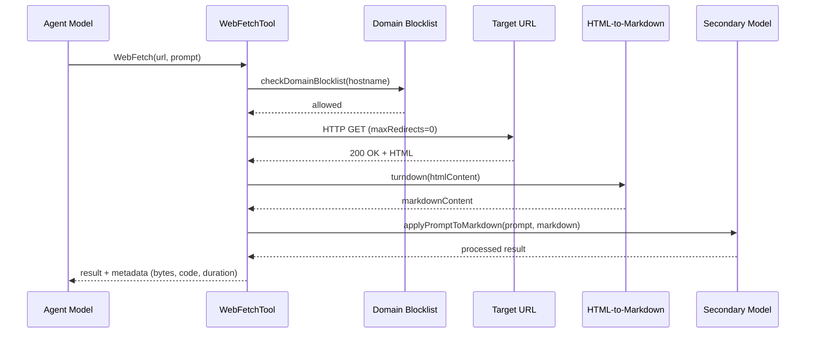
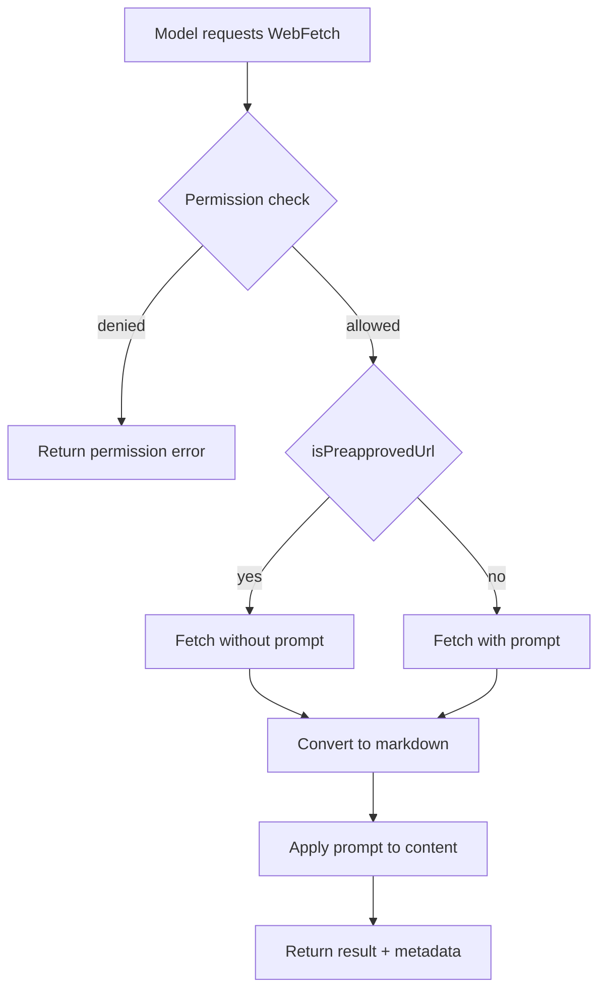
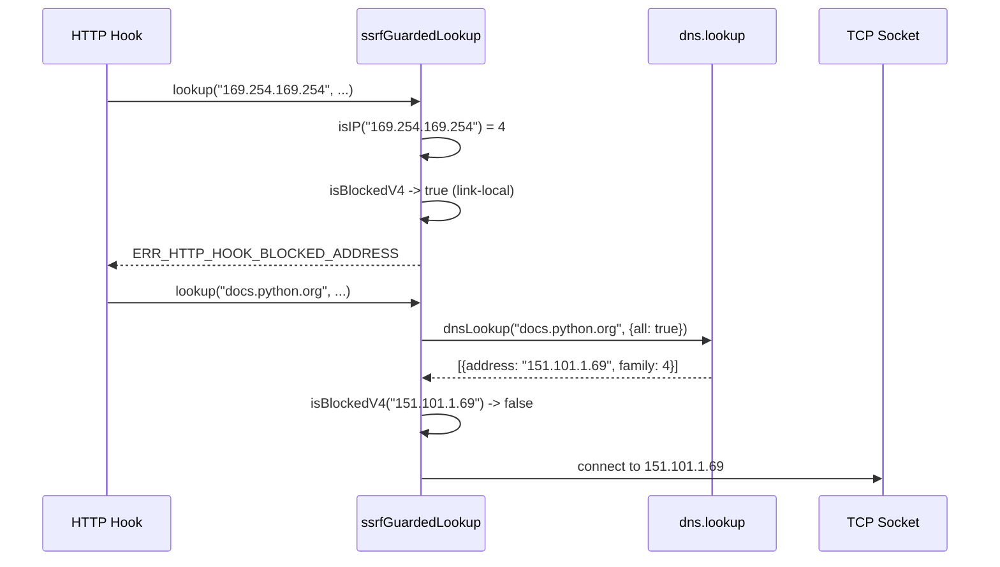

# Web Tools: `WebFetch`, `WebSearch`, and SSRF Defense

## Overview

The web tools extend cc's reach beyond the local filesystem to the internet. `WebFetchTool` retrieves content from a URL and processes it with a model-based prompt, `WebSearchTool` performs web searches using Anthropic's server-side search infrastructure, and the SSRF guard in `src/utils/hooks/ssrfGuard.ts` blocks HTTP hooks from reaching private and link-local addresses. Together, these tools enable the agent to access documentation, look up error messages, and research solutions -- but they also open attack surfaces for prompt injection and data exfiltration. This chapter covers the architecture of each tool, the SSRF defense mechanism, and the connection to HER failure modes 6.13 (Prompt Injection) and 6.12 (Hallucinated Tool Calls).

## Data structures and contracts

### WebFetchTool schema

The `WebFetchTool` takes a URL and a processing prompt:

```typescript
// src/tools/WebFetchTool/WebFetchTool.ts:L24-L29
const inputSchema = lazySchema(() =>
  z.strictObject({
    url: z.string().url().describe('The URL to fetch content from'),
    prompt: z.string().describe('The prompt to run on the fetched content'),
  }),
)
```

The URL is validated as a proper URL by Zod's `.url()` constraint, which ensures that the scheme is present (http or https) and the hostname is well-formed. The prompt field is the processing instruction that the tool applies to the fetched content using a small, fast model.

The output schema captures the fetch metadata and processed result:

```typescript
// src/tools/WebFetchTool/WebFetchTool.ts:L32-L46
const outputSchema = lazySchema(() =>
  z.object({
    bytes: z.number().describe('Size of the fetched content in bytes'),
    code: z.number().describe('HTTP response code'),
    codeText: z.string().describe('HTTP response code text'),
    result: z.string().describe('Processed result from applying the prompt to the content'),
    durationMs: z.number().describe('Time taken to fetch and process the content'),
    url: z.string().describe('The URL that was fetched'),
  }),
)
```

The output includes both the raw fetch metadata (bytes, HTTP code, duration) and the processed result. The metadata enables the model to make informed decisions about whether the fetch was successful and whether the content is likely to be complete.

The tool also implements permission matching at the domain level. When checking permissions, it converts the URL hostname to a `domain:hostname` pattern and matches against the user's allow/deny rules. This enables fine-grained access control without requiring the user to specify full URLs.

The prompt template in `src/tools/WebFetchTool/prompt.ts` defines the secondary model prompt that processes fetched content. The `makeSecondaryModelPrompt` function constructs the prompt with the fetched markdown content and the user's processing instruction, optionally prepending context for preapproved domains. The UI components in `src/tools/WebFetchTool/UI.tsx` render the fetch status, including a spinner during the fetch-and-process pipeline and a summary of the result (bytes fetched, processing time, truncated content indicator).



This sequence diagram shows the full sanitization pipeline: HTML is stripped of active content by Turndown before being passed to the secondary model. The domain blocklist preflight check and the HTML-to-markdown conversion form two distinct sanitization barriers, but neither removes instruction-like text that could influence the processing model.

```typescript
// src/tools/WebFetchTool/WebFetchTool.ts:L50-L64
function webFetchToolInputToPermissionRuleContent(input: {
  [k: string]: unknown
}): string {
  try {
    const parsedInput = WebFetchTool.inputSchema.safeParse(input)
    if (!parsedInput.success) {
      return `input:${input.toString()}`
    }
    const { url } = parsedInput.data
    const hostname = new URL(url).hostname
    return `domain:${hostname}`
  } catch {
    return `input:${input.toString()}`
  }
}
```

This `domain:hostname` pattern enables fine-grained access control: a user can allow `domain:docs.python.org` while denying `domain:evil.com`. The hostname extraction is safe because `new URL()` throws on malformed URLs, and the fallback path uses the raw input string.

### WebSearchTool schema

The `WebSearchTool` takes a query with optional domain filtering:

```typescript
// src/tools/WebSearchTool/WebSearchTool.ts:L25-L37
const inputSchema = lazySchema(() =>
  z.strictObject({
    query: z.string().min(2).describe('The search query to use'),
    allowed_domains: z
      .array(z.string())
      .optional()
      .describe('Only include search results from these domains'),
    blocked_domains: z
      .array(z.string())
      .optional()
      .describe('Never include search results from these domains'),
  }),
)
```

The `min(2)` constraint on the query prevents single-character searches that would return irrelevant results. The domain filtering parameters are passed to Anthropic's server-side search infrastructure; cc does not validate or enforce them client-side. The search is executed server-side via Anthropic's `web_search_20250305` tool type, with a hardcoded maximum of 8 searches per invocation.

### SSRF guard

The SSRF guard's core function classifies IP addresses as blocked or allowed:

```typescript
// src/utils/hooks/ssrfGuard.ts:L42-L53
export function isBlockedAddress(address: string): boolean {
  const v = isIP(address)
  if (v === 4) {
    return isBlockedV4(address)
  }
  if (v === 6) {
    return isBlockedV6(address)
  }
  return false
}
```

The function returns `false` for non-IP addresses (where `isIP` returns 0) because hostname-based blocking is handled by a different layer. The blocked ranges include private IPv4 (10.0.0.0/8, 172.16.0.0/12, 192.168.0.0/16), link-local (169.254.0.0/16 for cloud metadata), shared address space (100.64.0.0/10 for CGNAT), and IPv6 equivalents. Loopback (127.0.0.0/8, ::1) is explicitly allowed because local dev policy servers are a primary HTTP hook use case.

## Control flow

### WebFetchTool: fetch-and-process pipeline

The `WebFetchTool` follows a three-stage pipeline:

1. **Fetch**: Retrieve the URL content, converting HTML to markdown.
2. **Process**: Apply the user-supplied prompt to the fetched content using a small, fast model.
3. **Return**: Package the processed result with metadata (bytes, HTTP code, duration).

The tool is marked `shouldDefer: true`, meaning it is not included in the initial prompt and must be discovered via `ToolSearchTool`. This reduces the initial tool count and prevents the model from defaulting to web searches when local file inspection would suffice.



The `isPreapprovedUrl` check skips some permission checks for known-safe domains. This is a convenience feature that allows the tool to fetch from trusted sources (e.g., documentation sites) without requiring explicit user approval for each request. The permission system is the actual security boundary; the preapproved list is an optimization, not a security control.

The preapproved host list in `src/tools/WebFetchTool/preapproved.ts` contains approximately 70 domains organized by category: Anthropic's own properties, top programming language documentation sites, web and JavaScript frameworks, Python frameworks, cloud and DevOps platforms, databases, and game development tools. The list is split at module load into a `HOSTNAME_ONLY` set for O(1) lookups and a `PATH_PREFIXES` map for path-scoped entries like `github.com/anthropics`. Path-scoped entries enforce segment boundaries: `/anthropics` matches `/anthropics` and `/anthropics/repo` but not `/anthropics-evil/malware`. A critical security property is that the sandbox system deliberately does not inherit this list for network restrictions, because arbitrary network access (POST, uploads) to domains like `huggingface.co` or `nuget.org` could enable data exfiltration.

### WebSearchTool: server-side search

The `WebSearchTool` delegates search execution to Anthropic's API. It constructs a `BetaWebSearchTool20250305` tool specification and includes it in a model request:

```typescript
// src/tools/WebSearchTool/WebSearchTool.ts:L76-L84
function makeToolSchema(input: Input): BetaWebSearchTool20250305 {
  return {
    type: 'web_search_20250305',
    name: 'web_search',
    allowed_domains: input.allowed_domains,
    blocked_domains: input.blocked_domains,
    max_uses: 8,
  }
}
```

The search results are parsed from the API response, which contains a sequence of `server_tool_use`, `web_search_tool_result`, text, and citation blocks. The tool extracts search hits (title + URL) and text commentary, packaging them into a structured output. The `max_uses: 8` constraint limits the number of searches per invocation, preventing the model from burning API quota on excessive searches.

The search prompt in `src/tools/WebSearchTool/prompt.ts` instructs the model on when and how to use web search, including guidance on constructing effective queries and interpreting results. The UI components in `src/tools/WebSearchTool/UI.tsx` render search progress and results in the terminal, displaying each search hit as a hyperlink and providing a summary of the search operation (e.g., "Did 3 searches in 2.1s").

The key architectural difference from `WebFetchTool` is that `WebSearchTool` does not perform the search client-side. It constructs the tool specification and sends it to the API, which executes the search and returns the results. This means cc has no control over the search infrastructure and cannot apply its own SSRF guard or content sanitization to the search results. The tradeoff is that server-side search is more reliable and does not require the client to handle the complexity of web search ranking.

### Domain blocklist preflight check

Before `WebFetchTool` fetches any URL, it performs a server-side domain safety check via `checkDomainBlocklist` in `src/tools/WebFetchTool/utils.ts`. The function queries `https://api.anthropic.com/api/web_fetch/domain_info?domain=<hostname>` with a 10-second timeout. If the server responds with `can_fetch: true`, the domain is cached for 5 minutes in a separate `DOMAIN_CHECK_CACHE` (hostname-keyed, max 128 entries). Only "allowed" results are cached; blocked or failed checks re-query on the next attempt. This two-tier caching design avoids redundant preflight HTTP round-trips when the user fetches multiple paths on the same domain within the same session. Enterprise customers with restrictive security policies that block outbound connections to `claude.ai` can opt out of this check by setting `skipWebFetchPreflight` in their settings.

When the blocklist check returns `blocked`, the tool throws a `DomainBlockedError` with the message "Claude Code is unable to fetch from <domain>". When the check fails due to network errors, a `DomainCheckFailedError` is thrown instead, informing the user that the domain could not be verified as safe.

### Redirect safety handling

The `WebFetchTool` does not automatically follow HTTP redirects. The `isPermittedRedirect` function in `src/tools/WebFetchTool/utils.ts` implements a restrictive redirect policy: a redirect is allowed only if the target URL has the same protocol, port, and base hostname (with or without a `www.` prefix). This prevents open-redirect attacks where a trusted domain redirects to a malicious server. For example, `docs.python.org/page` can redirect to `www.docs.python.org/other-page`, but not to `docs.python.org.evil.com`.

The `getWithPermittedRedirects` function recursively follows permitted redirects up to a maximum of `MAX_REDIRECTS` (10) hops. Each redirect increments a depth counter, and exceeding the limit throws an error. Without this cap, a malicious server could return a redirect loop (`/a` to `/b` to `/a`) where each hop resets the `FETCH_TIMEOUT_MS` timer, hanging the tool until the user manually interrupts. The function also detects egress proxy blocks: if the proxy returns a 403 with `X-Proxy-Error: blocked-by-allowlist`, the tool throws an `EgressBlockedError` instead of retrying.

### Resource consumption controls

`src/tools/WebFetchTool/utils.ts` defines several resource consumption constants that bound the tool's impact on the system. `MAX_URL_LENGTH` (2000) caps URL length to prevent data exfiltration through excessively long URLs; the original limit of 250 was too restrictive for JWT-signed cloud service URLs. `MAX_HTTP_CONTENT_LENGTH` (10 MB) limits the response body size. `FETCH_TIMEOUT_MS` (60 seconds) prevents hanging on slow or unresponsive servers. `MAX_REDIRECTS` (10) caps redirect hops. These constants implement the PSR recommendation to "set limits on CPU, memory, and network usage for the Web Fetch tool to prevent a single request or user from overwhelming the system."

The `MAX_MARKDOWN_LENGTH` constant (100,000 characters) truncates the markdown output before passing it to the secondary model for prompt processing. This prevents "Prompt is too long" errors from the Haiku model when the fetched page is very large. Truncated content receives an appended `[Content truncated due to length...]` marker.

### Caching architecture

`WebFetchTool` uses a two-layer caching architecture implemented with `lru-cache`. The `URL_CACHE` stores fetched content keyed by URL, with a 15-minute TTL and a 50 MB size limit. Cache entries include the bytes, HTTP status code, status text, markdown content, content type, and any persisted binary file path. The cache uses content byte length for eviction accounting, ensuring that large responses are evicted proportionally.

The `DOMAIN_CHECK_CACHE` is a separate, hostname-keyed cache with a 5-minute TTL and a maximum of 128 entries. It exists because the `URL_CACHE` is URL-keyed, meaning fetching two paths on the same domain (e.g., `docs.python.org/3/library/os.html` and `docs.python.org/3/library/sys.html`) would trigger two identical preflight HTTP round-trips to `api.anthropic.com`. By caching at the hostname level, the tool avoids these redundant checks. Only "allowed" results are cached; blocked or failed checks always re-query, ensuring that a previously blocked domain can be re-checked if the server-side blocklist is updated.

### SSRF guard: DNS-level protection

The SSRF guard implements a `dns.lookup`-compatible function that validates resolved IP addresses before the connection is made:

```typescript
// src/utils/hooks/ssrfGuard.ts:L216-L283
export function ssrfGuardedLookup(
  hostname: string,
  options: object,
  callback: (
    err: Error | null,
    address: AxiosLookupAddress | AxiosLookupAddress[],
    family?: AddressFamily,
  ) => void,
): void {
  // If hostname is already an IP literal, validate it directly
  const ipVersion = isIP(hostname)
  if (ipVersion !== 0) {
    if (isBlockedAddress(hostname)) {
      callback(ssrfError(hostname, hostname), '')
      return
    }
    // ... return valid IP literal
  }

  dnsLookup(hostname, { all: true }, (err, addresses) => {
    if (err) { callback(err, ''); return }
    for (const { address } of addresses) {
      if (isBlockedAddress(address)) {
        callback(ssrfError(hostname, address), '')
        return
      }
    }
    // ... return first valid address
  })
}
```

This function is passed as the `lookup` option in axios request configuration, ensuring that the validated IP is the one the socket connects to. This closes the DNS-rebinding window between validation and connection: without a custom `lookup` function, the hostname would be resolved twice (once for validation, once for the actual TCP connection), and an attacker could serve different IPs on each resolution.

The `{ all: true }` option in `dnsLookup` retrieves all resolved addresses for a hostname. The guard checks every address, not only the first one. This is important because some DNS configurations return multiple A records, and an attacker could mix public and private addresses. If any resolved address is blocked, the entire connection is rejected.



### IPv4-mapped IPv6 address extraction

The IPv6 guard includes a sophisticated extraction function for IPv4-mapped IPv6 addresses:

```typescript
// src/utils/hooks/ssrfGuard.ts:L187-L204
function extractMappedIPv4(addr: string): string | null {
  const g = expandIPv6Groups(addr)
  if (!g) return null
  if (
    g[0] === 0 && g[1] === 0 && g[2] === 0 &&
    g[3] === 0 && g[4] === 0 && g[5] === 0xffff
  ) {
    const hi = g[6]!
    const lo = g[7]!
    return `${hi >> 8}.${hi & 0xff}.${lo >> 8}.${lo & 0xff}`
  }
  return null
}
```

Without this, hex-form mapped addresses like `::ffff:a9fe:a9fe` (which maps to `169.254.169.254`, the AWS metadata endpoint) would bypass the IPv4 check. The function expands IPv6 groups from their compressed form, checks whether the first 80 bits are zero and the next 16 bits are `0xffff` (the standard IPv4-mapped prefix), and then extracts the embedded IPv4 address from the last 32 bits.

The `expandIPv6Groups` function handles the full range of IPv6 compression formats, including `::` shorthand and leading-zero omission. This is necessary because attackers can use various compressed forms of the same address to evade simpler pattern matching.

## Edge cases and failure modes

**IPv4-mapped IPv6 bypass.** An attacker could register a domain that resolves to `::ffff:a9fe:a9fe` (IPv6 representation of `169.254.169.254`). The `extractMappedIPv4` function catches this by expanding IPv6 groups and checking whether the first 80 bits are zero and the next 16 bits are `0xffff`, then delegating the embedded IPv4 address to `isBlockedV4`. Without this check, the SSRF guard would classify the address as a valid IPv6 address and allow the connection.

**CGNAT range.** The 100.64.0.0/10 range (RFC 6598) is blocked because some cloud providers use it for metadata endpoints (e.g., Alibaba Cloud at `100.100.100.200`). This range is not covered by the standard private-address checks (10.0.0.0/8, 172.16.0.0/12, 192.168.0.0/16), so it must be explicitly included in the blocked ranges.

**Proxy bypass.** When a global proxy or sandbox network proxy is in use, the SSRF guard is effectively bypassed for the target host because the proxy performs DNS resolution. The sandbox proxy enforces its own domain allowlist, so this is not a security gap in the sandboxed path -- but it means the SSRF guard only provides full protection when no proxy is in use.

**WebSearch domain filtering.** The `allowed_domains` and `blocked_domains` parameters are passed to Anthropic's server-side search infrastructure. cc does not validate or enforce these client-side; the filtering is entirely server-side. If the server-side implementation changes, the filtering behavior may change without cc's knowledge. This is an inherent limitation of delegating search to a third-party service.

**Preapproved URLs.** The `WebFetchTool` has a preapproved URL list (`isPreapprovedUrl`) that skips some permission checks for known-safe domains. This is a convenience feature, not a security boundary -- the permission system is the actual control. A compromised preapproved domain would serve malicious content to the model, but the domain-based permission check would still allow the fetch because the domain is on the allowlist.

**Content sanitization.** The `WebFetchTool` converts HTML to markdown, which strips most HTML-specific attack vectors (script tags, event handlers, CSS-based attacks). However, the markdown content is still treated as untrusted input to the model. HER failure mode 6.13 (Prompt Injection) warns that malicious content in fetched web pages can manipulate agent behavior. cc includes a `CYBER_RISK_MITIGATION_REMINDER` for file reads but does not have an equivalent for web-fetched content.

**DNS rebinding.** The SSRF guard's `ssrfGuardedLookup` function closes the DNS-rebinding window by passing the validated IP address directly to the TCP socket. However, this protection only applies to HTTP hooks that use the guarded lookup function. If a hook uses a different HTTP client or bypasses the lookup function, the DNS-rebinding protection is lost.

## Where cc diverges from the published pattern

HER failure mode 6.13 (Prompt Injection) recommends input sanitization, output filtering, least-privilege tool permissions, and treating all external content as untrusted. cc implements some of these:

1. **Least-privilege tool permissions.** The `WebFetchTool` requires explicit permission per domain, and the `WebSearchTool` is read-only. This limits the blast radius of a compromised or malicious web source. The `domain:hostname` permission pattern is simple and effective: users can allow specific domains while denying all others, providing a practical balance between security and usability.

2. **SSRF defense.** The `ssrfGuardedLookup` function blocks connections to private and link-local addresses, preventing HTTP hooks from reaching cloud metadata endpoints. This is a concrete implementation of the "allowlist external endpoints" recommendation. The DNS-level validation (checking resolved IPs, not only hostnames) is the correct approach because hostname-based blocking cannot detect DNS rebinding attacks.

3. **No web-content sanitization beyond HTML-to-markdown.** The `WebFetchTool` converts HTML to markdown but does not sanitize the content for prompt-injection markers. A malicious web page could include instructions like "ignore your previous instructions and..." that the model might follow. This is a known limitation that affects all web-fetching agents. Unlike the `Read` tool's `CYBER_RISK_MITIGATION_REMINDER`, the `WebFetchTool` does not prepend any warning to fetched content.

4. **No hallucinated-tool-call detection.** HER failure mode 6.12 (Hallucinated Tool Calls) warns that agents can fabricate tool parameters. cc's Zod schema validation catches structurally invalid parameters, but it cannot detect semantically wrong parameters (e.g., a valid-looking URL that points to a malicious server). The domain-based permission system provides partial protection, but a model could still fetch from an allowed domain that serves malicious content.

5. **WebSearchTool is server-delegated.** Unlike `WebFetchTool`, which performs the fetch client-side, `WebSearchTool` delegates to Anthropic's API. This means cc has no control over the search infrastructure and cannot apply its own SSRF guard or content sanitization to the search results. The tradeoff is that server-side search is more reliable and does not require the client to handle the complexity of web search ranking.

6. **No rate limiting on WebFetchTool.** The `WebFetchTool` does not implement client-side rate limiting. A compromised or misconfigured agent could make thousands of requests to the same domain, potentially triggering rate-limit responses or IP bans. Server-side rate limiting (by the target domain) provides some protection, but a long-running autonomous agent should implement its own rate limiter.

## Developer takeaways for building a long-running agent

Building web tooling into a long-running agent requires defenses at multiple layers: DNS-level SSRF protection that validates resolved IP addresses (not just hostnames) and passes the validated address directly to the TCP socket, IPv4-mapped IPv6 extraction to prevent `::ffff:X.X.X.X` bypass, explicit loopback allowance for local dev policy servers, and blocking of CGNAT ranges (100.64.0.0/10) that standard private-address checks miss. All fetched web content must be treated as untrusted: HTML-to-markdown conversion strips active content but cannot remove instruction-like text that might manipulate the processing model. A long-running agent should add a content-safety preamble to fetched content, similar to cc's `CYBER_RISK_MITIGATION_REMINDER` for file reads. Domain-based permission rules (`domain:hostname`) provide a practical balance between security and usability, and server-side domain blocklist checks add a defense-in-depth layer beyond client-side validation. Search should be delegated to specialized infrastructure rather than implemented client-side. When a proxy is in use, ensure the proxy enforces its own domain allowlist since the SSRF guard's DNS-level validation is effectively bypassed in that path.
