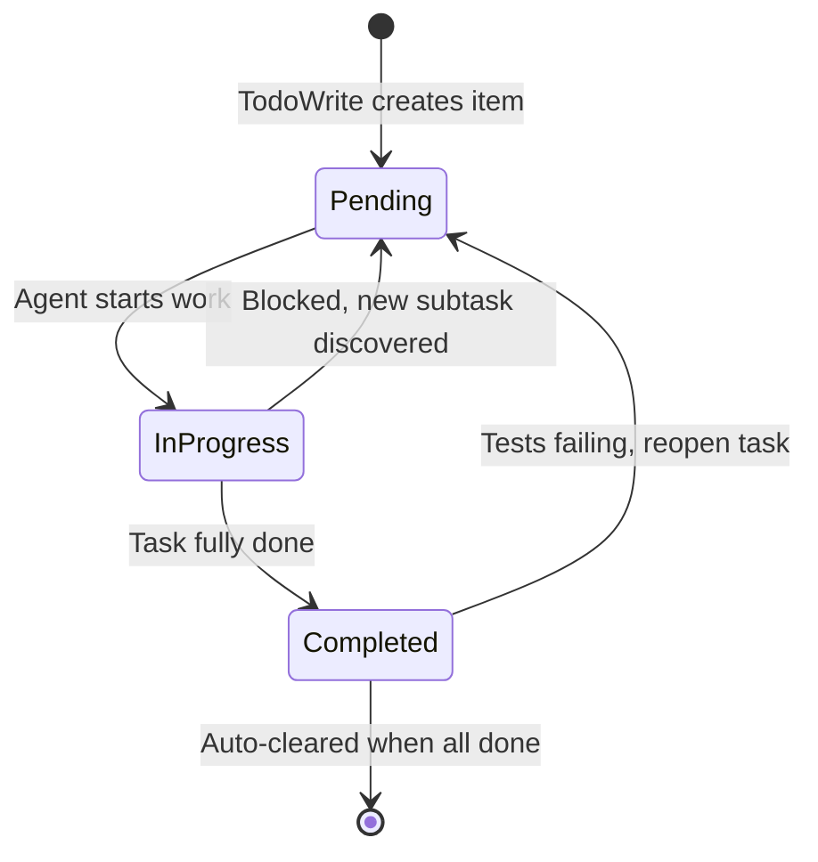
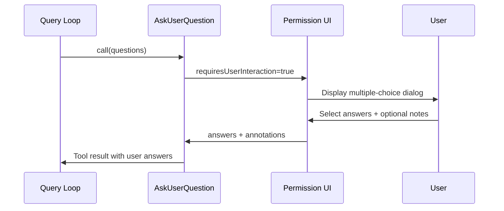

# TodoWrite, AskUserQuestion, Brief, Config, SendMessage

## Overview

The five "meta" tools in this chapter are not about transforming files or querying the world. They are about structuring the session itself: planning, asking, reporting, configuring, and communicating. Taken together, they form the agent's interface to human-in-the-loop (HITL) workflows and self-management. Each tool addresses a distinct surface of the harness-to-user contract:

- **TodoWrite** gives the agent a scratchpad for task decomposition and progress tracking, persisting state across compaction events.
- **AskUserQuestion** provides a structured, multiple-choice HITL gate that interrupts the query loop and enforces explicit user consent.
- **Brief** (SendUserMessage) is the agent's primary output channel to the user, replacing raw assistant text with a structured, attachable message system.
- **Config** lets the agent inspect and mutate runtime settings without restarting, including model selection, permission modes, and feature toggles.
- **SendMessage** enables inter-agent communication within swarm teams, supporting both plain-text and structured lifecycle messages.

These tools map directly to HER's HITL design patterns (Section 11): confidence-based routing, tiered escalation, async approval, context-rich escalation, and handoff protocols. They also connect to Pattern 5 (Progressive Context Compaction) through the way TodoWrite collapses state and Brief proactively surfaces information that would otherwise be buried in tool output.

The meta tools occupy a unique position in the tool architecture. Unlike file tools or bash tools that act on the external world, these tools act on the session's internal state and the communication channels between agent, user, and teammates. They are the control surfaces of the harness, and their design determines how effectively a long-running agent can maintain alignment with human intent over hours of autonomous operation. A harness that lacks these tools degrades in predictable ways: without TodoWrite the agent loses track of its own plan across compaction events; without AskUserQuestion it cannot escalate uncertain decisions; without Brief it floods the user with unstructured output; without Config it cannot adapt to changing conditions mid-session; without SendMessage it cannot coordinate with parallel teammates. Each tool addresses a distinct failure mode of long-running autonomy.

## Data structures and contracts

### TodoWrite schemas

TodoWrite accepts a flat array of todo items, each with a status, a content description, and an optional activeForm. The key schema lives in `src/utils/todo/types.ts` and is referenced via `TodoListSchema`. The tool name constant (exported from `src/tools/TodoWriteTool/constants.ts`) is used throughout the dispatch pipeline. The tool is gated behind `isTodoV2Enabled()` -- when the v2 task system is active, TodoWrite is disabled in favor of the TaskCreate/TaskUpdate tool family:

```typescript
// src/tools/TodoWriteTool/TodoWriteTool.ts:L13-L17
const inputSchema = lazySchema(() =>
  z.strictObject({
    todos: TodoListSchema().describe('The updated todo list'),
  }),
)
```

The output schema records both old and new todo lists, plus a structural nudge flag that fires when the model completes tasks without verification:

```typescript
// src/tools/TodoWriteTool/TodoWriteTool.ts:L20-L26
const outputSchema = lazySchema(() =>
  z.object({
    oldTodos: TodoListSchema().describe('The todo list before the update'),
    newTodos: TodoListSchema().describe('The todo list after the update'),
    verificationNudgeNeeded: z.boolean().optional(),
  }),
)
```

The tool's prompt (`src/tools/TodoWriteTool/prompt.ts:L3-L184`) is unusually detailed at 184 lines, containing explicit guidance on when to use and when not to use the tool, worked examples with reasoning annotations, and strict rules about task states. The prompt mandates exactly one `in_progress` item at any time, requiring the model to serially complete tasks rather than marking multiple as in-progress simultaneously.

### AskUserQuestion schemas

AskUserQuestion models a multiple-choice dialog with 1-4 questions, each containing 2-4 options with label, description, and optional preview content. The schema enforces uniqueness constraints: question texts must be unique across the batch, and option labels must be unique within each question:

```typescript
// src/tools/AskUserQuestionTool/AskUserQuestionTool.tsx:L14-L24
const questionOptionSchema = lazySchema(() => z.object({
  label: z.string().describe('The display text for this option that the user will see and select. Should be concise (1-5 words) and clearly describe the choice.'),
  description: z.string().describe('Explanation of what this option means or what will happen if chosen. Useful for providing context about trade-offs or implications.'),
  preview: z.string().optional().describe('Optional preview content rendered when this option is focused. Use for mockups, code snippets, or visual comparisons that help users compare options. See the tool description for the expected content format.')
}));
const questionSchema = lazySchema(() => z.object({
  question: z.string().describe('The complete question to ask the user. Should be clear, specific, and end with a question mark. Example: "Which library should we use for date formatting?" If multiSelect is true, phrase it accordingly, e.g. "Which features do you want to enable?"'),
  header: z.string().describe(`Very short label displayed as a chip/tag (max ${ASK_USER_QUESTION_TOOL_CHIP_WIDTH} chars). Examples: "Auth method", "Library", "Approach".`),
  options: z.array(questionOptionSchema()).min(2).max(4).describe(`The available choices for this question. Must have 2-4 options. Each option should be a distinct, mutually exclusive choice (unless multiSelect is enabled). There should be no 'Other' option, that will be provided automatically.`),
  multiSelect: z.boolean().default(false).describe('Set to true to allow the user to select multiple options instead of just one. Use when choices are not mutually exclusive.')
}));
```

The annotations schema supports per-question metadata from the user, including selected preview content and free-text notes. The `metadata.source` field enables analytics tracking of where a question originated (e.g., the `/remember` command). The preview feature supports two formats: markdown (for terminal rendering) and HTML (for bridge/desktop viewers), validated by the `validateHtmlPreview()` function which rejects full documents, script/style tags, and non-HTML content.

### Brief (SendUserMessage) schema

Brief takes a markdown message, optional file attachments, and a status label distinguishing proactive from normal communication. The attachments field accepts file paths (absolute or cwd-relative) for images, diffs, logs, or any file the user should see alongside the message:

```typescript
// src/tools/BriefTool/BriefTool.ts:L20-L37
const inputSchema = lazySchema(() =>
  z.strictObject({
    message: z
      .string()
      .describe('The message for the user. Supports markdown formatting.'),
    attachments: z
      .array(z.string())
      .optional()
      .describe(
        'Optional file paths (absolute or relative to cwd) to attach. Use for photos, screenshots, diffs, logs, or any file the user should see alongside your message.',
      ),
    status: z
      .enum(['normal', 'proactive'])
      .describe(
        "Use 'proactive' when you're surfacing something the user hasn't asked for and needs to see now — task completion while they're away, a blocker you hit, an unsolicited status update. Use 'normal' when replying to something the user just said.",
      ),
  }),
)
```

The attachment resolution pipeline (`src/tools/BriefTool/attachments.ts:L63-L110`) validates paths exist and are regular files, then optionally uploads them to the bridge API for web viewers. The `ResolvedAttachment` type carries `path`, `size`, `isImage`, and an optional `file_uuid` for bridge-mediated preview. The upload is best-effort: failures silently degrade to local-only rendering.

### Config schema

Config takes a setting key and an optional new value. Omitting the value triggers a read operation. The output includes success/failure status, the operation type, and for writes the previous and new values:

```typescript
// src/tools/ConfigTool/ConfigTool.ts:L36-L62
const inputSchema = lazySchema(() =>
  z.strictObject({
    setting: z
      .string()
      .describe(
        'The setting key (e.g., "theme", "model", "permissions.defaultMode")',
      ),
    value: z
      .union([z.string(), z.boolean(), z.number()])
      .optional()
      .describe('The new value. Omit to get current value.'),
  }),
)
const outputSchema = lazySchema(() =>
  z.object({
    success: z.boolean(),
    operation: z.enum(['get', 'set']).optional(),
    setting: z.string().optional(),
    value: z.unknown().optional(),
    previousValue: z.unknown().optional(),
    newValue: z.unknown().optional(),
    error: z.string().optional(),
  }),
)
```

The supported settings registry in `src/tools/ConfigTool/supportedSettings.ts:L29-L186` defines 20+ settings split between global (`~/.claude.json`) and project (`settings.json`) sources. Each setting has a `SettingConfig` with type, description, options, validation, and an optional `appStateKey` for immediate UI sync.

### SendMessage schema

SendMessage routes messages to teammates by name, broadcasts with `*`, or targets cross-session peers via UDS sockets or bridge sessions. The tool name constant `SEND_MESSAGE_TOOL_NAME` is defined in `src/tools/SendMessageTool/constants.ts` and referenced by the dispatch pipeline for permission evaluation. The structured message protocol supports shutdown_request, shutdown_response, and plan_approval_response for lifecycle management:

```typescript
// src/tools/SendMessageTool/SendMessageTool.ts:L46-L65
const StructuredMessage = lazySchema(() =>
  z.discriminatedUnion('type', [
    z.object({ type: z.literal('shutdown_request'), reason: z.string().optional() }),
    z.object({ type: z.literal('shutdown_response'), request_id: z.string(),
      approve: semanticBoolean(), reason: z.string().optional() }),
    z.object({ type: z.literal('plan_approval_response'), request_id: z.string(),
      approve: semanticBoolean(), feedback: z.string().optional() }),
  ]),
)
```

The `to` field supports four address types: teammate name (direct), `*` (broadcast), `uds:<socket-path>` (local peer), and `bridge:<session-id>` (cross-machine peer). The `summary` field is required for plain-text messages to provide a 5-10 word preview in the UI, but is optional for UDS and structured messages. The routing logic determines which path to use based on prefix matching: `uds:` and `bridge:` prefixes trigger their respective handlers, `*` triggers broadcast, and anything else is treated as a teammate name lookup.

## Control flow

### TodoWrite lifecycle

TodoWrite stores todos per agent in `appState.todos`, keyed by `agentId` or `sessionId`. When all items complete, the list auto-clears. A verification nudge fires when the main-thread agent closes out 3+ items without any verification step, emitting a reminder to spawn the verification subagent before writing the final summary:

```typescript
// src/tools/TodoWriteTool/TodoWriteTool.ts:L65-L103
async call({ todos }, context) {
  const appState = context.getAppState()
  const todoKey = context.agentId ?? getSessionId()
  const oldTodos = appState.todos[todoKey] ?? []
  const allDone = todos.every(_ => _.status === 'completed')
  const newTodos = allDone ? [] : todos

  let verificationNudgeNeeded = false
  if (
    feature('VERIFICATION_AGENT') &&
    getFeatureValue_CACHED_MAY_BE_STALE('tengu_hive_evidence', false) &&
    !context.agentId &&
    allDone &&
    todos.length >= 3 &&
    !todos.some(t => /verif/i.test(t.content))
  ) {
    verificationNudgeNeeded = true
  }

  context.setAppState(prev => ({
    ...prev,
    todos: { ...prev.todos, [todoKey]: newTodos },
  }))

  return { data: { oldTodos, newTodos: todos, verificationNudgeNeeded } }
},
```

The nudge is appended to the tool result via `mapToolResultToToolResultBlockParam` (`src/tools/TodoWriteTool/TodoWriteTool.ts:L104-L114`), which adds a NOTE block reminding the model that only the verification agent can issue a PARTIAL verdict. This design targets the exact loop-exit moment where quality shortcuts happen: the model completes its task list and exits without verifying its work.



### AskUserQuestion interrupt flow

AskUserQuestion marks itself as `requiresUserInteraction: true`, which causes the tool dispatch pipeline to pause the query loop and surface a multiple-choice UI. The permission check always returns `behavior: 'ask'`, ensuring the user must explicitly approve or decline:

```typescript
// src/tools/AskUserQuestionTool/AskUserQuestionTool.tsx:L182-L188
async checkPermissions(input) {
  return {
    behavior: 'ask' as const,
    message: 'Answer questions?',
    updatedInput: input
  }
},
```

When KAIROS channels are active (Telegram/Discord), AskUserQuestion is disabled entirely since nobody is at the keyboard to answer a multiple-choice dialog. This is a deliberate design choice: the channel permission relay already skips `requiresUserInteraction()` tools, so there is no alternate approval path:

```typescript
// src/tools/AskUserQuestionTool/AskUserQuestionTool.tsx:L135-L145
isEnabled() {
  if (
    (feature('KAIROS') || feature('KAIROS_CHANNELS')) &&
    getAllowedChannels().length > 0
  ) {
    return false
  }
  return true
},
```

The tool also declares `isConcurrencySafe: true` and `isReadOnly: true`, meaning it can be called in parallel with other read-only tools and does not modify filesystem state. The `shouldDefer: true` flag means the tool is not included in the initial prompt but is loaded on demand via ToolSearch.



### Brief activation gate

Brief is gated by a two-layer entitlement system. `isBriefEntitled()` (`src/tools/BriefTool/BriefTool.ts:L88-L100`) checks build-time feature flags and GrowthBook kill-switches. `isBriefEnabled()` additionally requires explicit opt-in (CLI flag, settings, or slash command). Assistant mode (Kairos) bypasses opt-in since its system prompt hard-codes Brief usage:

```typescript
// src/tools/BriefTool/BriefTool.ts:L126-L134
export function isBriefEnabled(): boolean {
  return feature('KAIROS') || feature('KAIROS_BRIEF')
    ? (getKairosActive() || getUserMsgOptIn()) && isBriefEntitled()
    : false
}
```

The top-level `feature()` guard is load-bearing for dead code elimination (DCE): Bun can constant-fold the ternary to `false` in external builds, eliminating the entire BriefTool object from the binary. The `KAIROS_BRIEF_REFRESH_MS` constant (`src/tools/BriefTool/BriefTool.ts:L67`) sets a 5-minute refresh cycle on the GrowthBook kill-switch, meaning a disabled tool is at most 5 minutes stale.

Brief's prompt (`src/tools/BriefTool/prompt.ts:L1-L23`) enforces a communication discipline: every reply the user should read goes through Brief, not raw assistant text. The `status: 'proactive'` field routes messages differently in the UI, triggering push notifications and surfacing in the chat view without a preceding user message.

### Config read/write flow

ConfigTool supports both get and set operations. Read operations are auto-allowed; writes require explicit permission approval. The tool handles type coercion for boolean settings (accepting string "true"/"false"), option validation for enum settings, and async validation for settings like model that need API checks:

```typescript
// src/tools/ConfigTool/ConfigTool.ts:L98-L107
async checkPermissions(input: Input) {
  if (input.value === undefined) {
    return { behavior: 'allow' as const, updatedInput: input }
  }
  return {
    behavior: 'ask' as const,
    message: `Set ${input.setting} to ${jsonStringify(input.value)}`,
  }
},
```

The `call()` method (`src/tools/ConfigTool/ConfigTool.ts:L111-L411`) is the most complex of the five meta tools, spanning 300 lines. It handles seven distinct code paths: unknown setting rejection, GET operation, default value handling (for `remoteControlAtStartup`), boolean coercion, option validation, async validation (model API check), and voice preflight checks. The boolean coercion path is noteworthy: settings like `verbose` accept string "true"/"false" from the CLI and must be converted to native booleans before writing. The option validation path uses `getOptionsForSetting()` to retrieve the allowed enum values and rejects any value not in the set. The async validation path for the `model` setting calls the Anthropic API to verify the model identifier exists, preventing the model from switching to a nonexistent model and then failing on every subsequent request. After writing to storage, it syncs to AppState via the `config.appStateKey` mechanism, which causes immediate UI updates without requiring a restart.

### SendMessage routing

SendMessage supports four routing paths with distinct validation rules. Direct teammate messages require a `summary` field. Broadcasts cannot carry structured messages. UDS and bridge targets have special validation for address format and connection state. The `handleMessage()` function (`src/tools/SendMessageTool/SendMessageTool.ts:L149-L189`) writes to the teammate's mailbox, while `handleBroadcast()` (`src/tools/SendMessageTool/SendMessageTool.ts:L191-L266`) iterates over the team file to deliver to all members except the sender.

The shutdown lifecycle is the most complex path. A `shutdown_request` from the team lead writes a structured message to the target's mailbox. The target responds with a `shutdown_response` that either approves (triggering `handleShutdownApproval()` which aborts the agent's controller) or rejects (sending a reason back to the lead). The plan approval protocol follows a similar request/response pattern, but only the team lead can approve or reject plans. Broadcast messages iterate over the team file (a JSON document listing all active teammates and their status) and deliver to each member except the sender. The broadcast path does not support structured messages -- a deliberate restriction that prevents a single broadcast from triggering N shutdown requests, which could cascade unpredictably through the team.

## Edge cases and failure modes

- **TodoWrite verification nudge bypass**: If the model marks all tasks completed without any verification step, the nudge reminds it to spawn a verification subagent. However, the nudge is advisory; the model can ignore it and exit the loop anyway. The nudge fires at the exact moment where quality shortcuts are most likely: the model has completed its work and is about to write its summary.
- **AskUserQuestion channel disable**: When KAIROS channels are active, AskUserQuestion is disabled because the user is likely on Telegram/Discord, not watching the TUI. Channel permission relay already skips `requiresUserInteraction()` tools, so there is no alternate approval path. This means agents running in channel mode cannot ask clarifying questions and must proceed with their best judgment.
- **Brief entitlement vs. activation gap**: A user can be entitled (enrolled in the GrowthBook experiment) but not activated (hasn't opted in). The tool is invisible until the user takes an activation action (`--brief` flag, `defaultView: 'chat'` setting, or `/brief` slash command). The `CLAUDE_CODE_BRIEF` environment variable force-grants both entitlement and activation for dev/testing.
- **Brief attachment upload failure**: Upload to the bridge API (`src/tools/BriefTool/upload.ts:L92-L174`) is best-effort. If the OAuth token is missing, the bridge is off, or the network errors, the attachment still carries `{path, size, isImage}` for local renderers. The file_uuid is left undefined. The upload is gated behind `feature('BRIDGE_MODE')` for DCE, and a dynamic import of the upload module ensures axios and crypto are not bundled in non-bridge builds.
- **Config voice preflight**: Setting `voiceEnabled: true` triggers a multi-step preflight check (`src/tools/ConfigTool/ConfigTool.ts:L232-L308`): recording availability, voice stream availability, dependency check, and microphone permission request. Any failure returns a specific error message guiding the user to fix the issue (e.g., "Settings > Privacy > Microphone" on macOS).
- **SendMessage cross-machine safety**: Bridge-targeted messages require explicit user consent and are immune to bypassPermissions and auto-mode classifiers. The `decisionReason: { type: 'safetyCheck', classifierApprovable: false }` in `src/tools/SendMessageTool/SendMessageTool.ts:L586-L601` ensures cross-machine prompt injection vectors cannot auto-approve, even when the user has set `bypassPermissions: true`.
- **SendMessage auto-resume**: When a message targets a stopped agent, SendMessage attempts `resumeAgentBackground()` (`src/tools/SendMessageTool/SendMessageTool.ts:L823-L845`) to restart it. If the agent has no transcript to resume, the send fails with a specific error explaining the agent was registered but has no transcript to resume.
- **Config stale cache on resume**: Resumed sessions replay pre-attachment Brief outputs verbatim. A required `attachments` field would crash the UI renderer on resume, so attachments remain optional in the output schema.

## Where cc diverges from the published pattern

**HER Section 11 describes confidence-based routing** where the agent self-assesses confidence and routes decisions to humans when below threshold. cc's AskUserQuestion implements a simpler model: the model decides to call the tool (an implicit confidence assessment) rather than having a deterministic routing layer. There is no numeric confidence threshold; the model uses its own judgment about when to escalate. This is a deliberate tradeoff: deterministic routing requires a calibrated confidence signal from the model, which is unreliable for current-generation LLMs.

**HER Section 11.3 describes async approval** where the agent parks a blocked action and continues with other work. cc's implementation does not support this pattern for AskUserQuestion. When the tool fires, the query loop blocks until the user responds. True async approval exists only in the SendMessage shutdown_request/response protocol, where a teammate can reject a shutdown and continue working. For a CLI agent, blocking on user input is acceptable because the user is typically watching the terminal. For a headless agent, AskUserQuestion is disabled entirely.

**HER Section 11.4 prescribes context-rich escalation** with structured handoff documents containing what was tried, why it failed, and what options exist. Brief's `status: 'proactive'` field partially addresses this by distinguishing proactive from reactive messages, but there is no structured handoff document format. The model generates free-form markdown. The prompt does guide the model toward context-rich communication (ack, work, result, with checkpoints at decision boundaries), but this is advisory, not enforced by the tool schema.

**HER Section 11.5 describes handoff protocols** with full context transfer, incremental review, and checkpoint reviews at 25% and 75% completion. cc has no formal handoff protocol. TodoWrite provides a structured task list that could serve as a handoff document, but the model is not required to produce one at session boundaries. The todo list is not automatically included in the next session's context.

**HER Pattern 5 (Progressive Context Compaction)** suggests TodoWrite-style planning as a compaction mechanism. cc implements this: the todo list lives in AppState (not in the conversation), so it survives compaction events. However, cc does not automatically compact the todo list itself; stale items persist until the model explicitly updates them. A more aggressive implementation would auto-archive completed items and summarize stale in-progress items after a timeout.

## Developer takeaways for building a long-running agent

1. **Separate the output channel from raw model text.** Brief replaces unconstrained assistant text with a structured tool that enforces markdown formatting, attachment handling, and proactive/reactive labeling. The UI layer hides raw assistant text when a Brief message is present, making enforcement structural rather than prompt-based.

2. **Make HITL gates explicit in the tool contract.** AskUserQuestion's `requiresUserInteraction: true` and `checkPermissions: { behavior: 'ask' }` ensure the query loop cannot bypass the user. Every tool involving human judgment should declare this requirement in its type definition.

3. **Use feature flags and kill-switches for incremental rollout.** Brief's two-layer gate (entitlement + activation) with a GrowthBook kill-switch and 5-minute refresh cycle demonstrates safe incremental shipping. The `feature()` guard enables DCE, removing the entire tool from the binary when off.

4. **Design inter-agent messaging with structured lifecycle protocols.** SendMessage's discriminated union of shutdown_request/response and plan_approval_response provides typed, validated schemas with request IDs for correlation. The `semanticBoolean()` type prevents ambiguous approval values.

5. **Auto-clear completed state to prevent context bloat.** TodoWrite clears the list when all items complete, and the verification nudge injects a corrective signal at the moment quality shortcuts are most likely. Every piece of persistent state should have a natural expiration mechanism.

6. **Gate cross-machine communication behind safety checks.** Bridge-targeted messages use `decisionReason: { type: 'safetyCheck', classifierApprovable: false }`, making them immune to auto-approval even when `bypassPermissions` is set.
