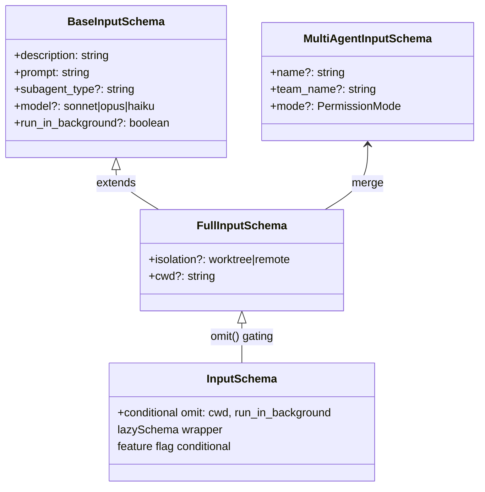
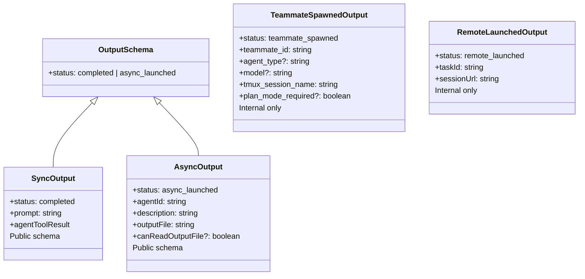
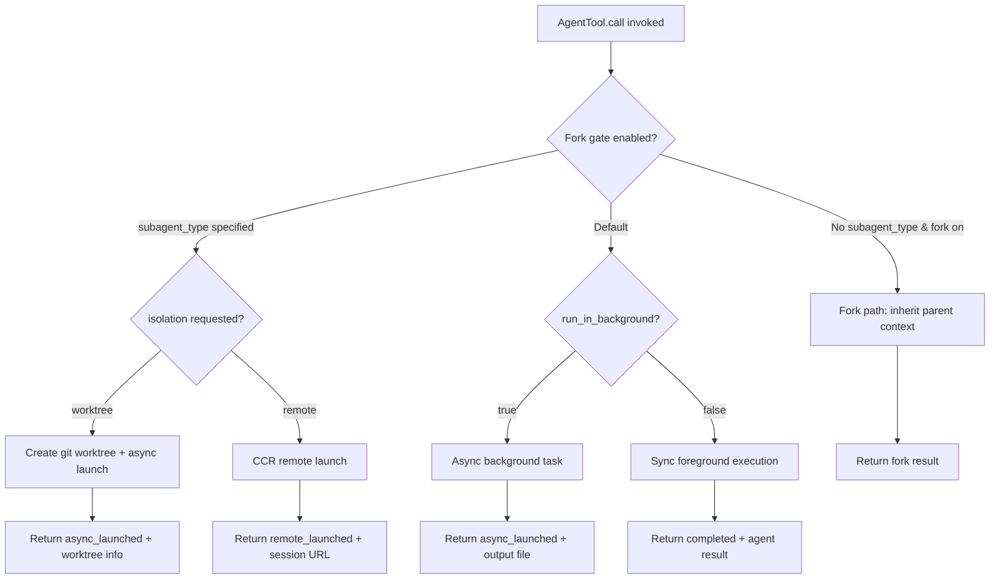

# The Agent Tool: Entry, Inputs, and Lifecycle

## Overview

The AgentTool is the single entry point for spawning subagents within cc. It is the mechanism by which the parent agent delegates work to isolated context windows, whether in-process (sync), forked, or remote. The tool accepts a rich input schema that controls the subagent's identity, capabilities, execution mode, and isolation level. Understanding its input validation, dispatch selection, and output handling is essential for anyone building multi-agent orchestrations on top of cc.

This chapter examines the AgentTool's surface: its Zod-defined input schema, how each field shapes the subagent's behavior, the validation logic that gates execution, and the output formats that report results back to the parent. Chapters 19 and 20 cover the three execution modes and agent discovery, respectively.

The AgentTool maps to HER Section 7.4 (Sub-Agents as a Configuration Surface), which describes subagents as "context firewalls" that use expensive models for orchestration and cheaper models for subtasks. It also connects to Pattern 7 (Context-Isolated Subagents) and Pattern 8 (Fork-Join Parallelism).

## Data structures and contracts

### Input schema

The AgentTool input schema is assembled from a base schema and a multi-agent extension, conditionally omitting fields based on feature gates. The base schema captures the four fields every agent invocation needs:

```typescript
// src/tools/AgentTool/AgentTool.tsx:L82-L88
const baseInputSchema = lazySchema(() => z.object({
  description: z.string().describe('A short (3-5 word) description of the task'),
  prompt: z.string().describe('The task for the agent to perform'),
  subagent_type: z.string().optional().describe('The type of specialized agent to use for this task'),
  model: z.enum(['sonnet', 'opus', 'haiku']).optional().describe("Optional model override for this agent. Takes precedence over the agent definition's model frontmatter. If omitted, uses the agent definition's model, or inherits from the parent."),
  run_in_background: z.boolean().optional().describe('Set to true to run this agent in the background. You will be notified when it completes.')
}));
```

The `description` field is surfaced to the user as a task label in the terminal UI and persisted in the `LocalAgentTaskState` record. The `prompt` is the full task directive passed as the initial user message. The `subagent_type` selects from the catalog of agent definitions (Chapter 20). When omitted and the fork experiment is active, the tool routes to the implicit fork path instead of the general-purpose agent.

The full schema adds multi-agent and isolation parameters that enable in-process teammate spawning and worktree isolation:

```typescript
// src/tools/AgentTool/AgentTool.tsx:L91-L102
const fullInputSchema = lazySchema(() => {
  // Multi-agent parameters
  const multiAgentInputSchema = z.object({
    name: z.string().optional().describe('Name for the spawned agent. Makes it addressable via SendMessage({to: name}) while running.'),
    team_name: z.string().optional().describe('Team name for spawning. Uses current team context if omitted.'),
    mode: permissionModeSchema().optional().describe('Permission mode for spawned teammate (e.g., "plan" to require plan approval).')
  });
  return baseInputSchema().merge(multiAgentInputSchema).extend({
    isolation: ("external" === 'ant' ? z.enum(['worktree', 'remote']) : z.enum(['worktree'])).optional().describe("external" === 'ant' ? 'Isolation mode. "worktree" creates a temporary git worktree so the agent works on an isolated copy of the repo. "remote" launches the agent in a remote CCR environment (always runs in background).' : 'Isolation mode. "worktree" creates a temporary git worktree so the agent works on an isolated copy of the repo.'),
    cwd: z.string().optional().describe('Absolute path to run the agent in. Overrides the working directory for all filesystem and shell operations within this agent. Mutually exclusive with isolation: "worktree".')
  });
});
```

The `name` field makes the spawned agent addressable via the SendMessage tool (Chapter 17), enabling bidirectional communication between the parent and a running subagent. The `team_name` associates the agent with a coordination group managed by the swarm coordinator (Chapter 21). The `mode` parameter sets the permission mode for the spawned teammate independently of the parent's mode, allowing a parent in `bypassPermissions` to spawn a child in `plan` mode for safety-critical review tasks. The `isolation` field creates a temporary git worktree so the subagent operates on an isolated copy of the repository. The `cwd` field overrides the working directory for all filesystem and shell operations.

The schema is conditionally trimmed at module load time based on feature flags. This approach ensures the model never sees parameters it cannot use, preventing hallucinated tool calls with ignored parameters:

```typescript
// src/tools/AgentTool/AgentTool.tsx:L110-L125
export const inputSchema = lazySchema(() => {
  const schema = feature('KAIROS') ? fullInputSchema() : fullInputSchema().omit({
    cwd: true
  });

  // GrowthBook-in-lazySchema is acceptable here (unlike subagent_type, which
  // was removed in 906da6c723): the divergence window is one-session-per-
  // gate-flip via _CACHED_MAY_BE_STALE disk read, and worst case is either
  // "schema shows a no-op param" (gate flips on mid-session: param ignored
  // by forceAsync) or "schema hides a param that would've worked" (gate
  // flips off mid-session: everything still runs async via memoized
  // forceAsync). No Zod rejection, no crash — unlike required→optional.
  return isBackgroundTasksDisabled || isForkSubagentEnabled() ? schema.omit({
    run_in_background: true
  }) : schema;
});
```

The `lazySchema` wrapper defers evaluation until the first tool call, ensuring that GrowthBook flags are populated before schema construction. This is important because the `isForkSubagentEnabled()` check inside the schema depends on runtime feature flags that are not available at module load time. The divergence window is limited to one session per gate flip (via `_CACHED_MAY_BE_STALE` disk read), and the worst case is either "schema shows a no-op param" (gate flips on mid-session, param ignored by forceAsync) or "schema hides a param that would have worked" (gate flips off mid-session, everything still runs async via memoized forceAsync). No Zod rejection or crash results from a mid-session gate flip.

The explicit `AgentToolInput` type widens the Zod schema inference to always include all optional fields, even when `.omit()` strips them for gating. This prevents TypeScript from narrowing the type in `call()` based on whether a field was present in the schema at the time of inference:

```typescript
// src/tools/AgentTool/AgentTool.tsx:L132-L138
type AgentToolInput = z.infer<ReturnType<typeof baseInputSchema>> & {
  name?: string;
  team_name?: string;
  mode?: z.infer<ReturnType<typeof permissionModeSchema>>;
  isolation?: 'worktree' | 'remote';
  cwd?: string;
};
```



### Output schema

The output is a discriminated union: either the subagent completed synchronously, or it was launched asynchronously. This pattern allows callers to handle each case with type-safe pattern matching rather than checking nullable fields:

```typescript
// src/tools/AgentTool/AgentTool.tsx:L141-L155
export const outputSchema = lazySchema(() => {
  const syncOutputSchema = agentToolResultSchema().extend({
    status: z.literal('completed'),
    prompt: z.string()
  });
  const asyncOutputSchema = z.object({
    status: z.literal('async_launched'),
    agentId: z.string().describe('The ID of the async agent'),
    description: z.string().describe('The description of the task'),
    prompt: z.string().describe('The prompt for the agent'),
    outputFile: z.string().describe('Path to the output file for checking agent progress'),
    canReadOutputFile: z.boolean().optional().describe('Whether the calling agent has Read/Bash tools to check progress')
  });
  return z.union([syncOutputSchema, asyncOutputSchema]);
});
```

Internal (non-schema) output types include `teammate_spawned` and `remote_launched` for multi-agent and CCR dispatch paths. These are excluded from the Zod schema for dead code elimination: the model never sees them, so they do not appear in the tool's output type definition sent to the API:

```typescript
// src/tools/AgentTool/AgentTool.tsx:L161-L190
type TeammateSpawnedOutput = {
  status: 'teammate_spawned';
  prompt: string;
  teammate_id: string;
  agent_id: string;
  agent_type?: string;
  model?: string;
  name: string;
  color?: string;
  tmux_session_name: string;
  tmux_window_name: string;
  tmux_pane_id: string;
  team_name?: string;
  is_splitpane?: boolean;
  plan_mode_required?: boolean;
};

export type RemoteLaunchedOutput = {
  status: 'remote_launched';
  taskId: string;
  sessionUrl: string;
  description: string;
  prompt: string;
  outputFile: string;
};
```

The separation between public schema types and internal types is a deliberate design choice. The public schema (what the model sees) is minimal and stable. The internal types carry rich metadata (tmux session names, pane IDs, plan mode flags) that the UI needs but the model does not. This reduces the token cost of the tool definition in every API request.



### AgentDefinition type

The `AgentDefinition` type is a union of built-in, custom, and plugin variants. The full type analysis is in Chapter 20; here we focus on the fields that directly affect the AgentTool's dispatch logic. The `BaseAgentDefinition` carries 22 fields spanning the entire subagent lifecycle from spawning to cleanup:

```typescript
// src/tools/AgentTool/loadAgentsDir.ts:L106-L133
export type BaseAgentDefinition = {
  agentType: string
  whenToUse: string
  tools?: string[]
  disallowedTools?: string[]
  skills?: string[] // Skill names to preload (parsed from comma-separated frontmatter)
  mcpServers?: AgentMcpServerSpec[] // MCP servers specific to this agent
  hooks?: HooksSettings // Session-scoped hooks registered when agent starts
  color?: AgentColorName
  model?: string
  effort?: EffortValue
  permissionMode?: PermissionMode
  maxTurns?: number // Maximum number of agentic turns before stopping
  filename?: string // Original filename without .md extension (for user/project/managed agents)
  baseDir?: string
  criticalSystemReminder_EXPERIMENTAL?: string // Short message re-injected at every user turn
  requiredMcpServers?: string[] // MCP server name patterns that must be configured for agent to be available
  background?: boolean // Always run as background task when spawned
  initialPrompt?: string // Prepended to the first user turn (slash commands work)
  memory?: AgentMemoryScope // Persistent memory scope
  isolation?: 'worktree' | 'remote' // Run in an isolated git worktree, or remotely in CCR (ant-only)
  pendingSnapshotUpdate?: { snapshotTimestamp: string }
  /** Omit CLAUDE.md hierarchy from the agent's userContext. Read-only agents
   * (Explore, Plan) don't need commit/PR/lint guidelines — the main agent has
   * full CLAUDE.md and interprets their output. Saves ~5-15 Gtok/week across
   * 34M+ Explore spawns. Kill-switch: tengu_slim_subagent_claudemd. */
  omitClaudeMd?: boolean
}
```

The `tools` and `disallowedTools` fields control the subagent's tool pool by whitelisting and blacklisting tool names. The `permissionMode` overrides the parent's mode for the subagent's session. The `background` flag forces the agent to run asynchronously regardless of the `run_in_background` input. The `maxTurns` caps the number of API round-trips. The `isolation` field mirrors the input field and can be set at the agent definition level rather than per-invocation. The `omitClaudeMd` flag is a production optimization for read-only agents (Explore, Plan) that do not need the full CLAUDE.md hierarchy, saving 5-15 Gtok/week across 34M+ Explore spawns.

## Control flow

### Dispatch selection

The AgentTool's `call()` method routes the request through a decision tree based on multiple conditions: whether the fork experiment is active, whether the agent should run in background, whether isolation is requested, and whether remote eligibility checks pass. The dispatch logic is the most complex part of the AgentTool because it must handle five distinct execution paths with different state isolation, communication, and cleanup semantics:



The fork path is triggered when `isForkSubagentEnabled()` returns true and no `subagent_type` is specified. This path inherits the parent's full conversation context and system prompt for cache sharing. The subagent_type path resolves the agent definition from the catalog and checks the `isolation` field. The default path checks `run_in_background` and either runs synchronously or asynchronously.

### Fork recursion guard

Fork children keep the Agent tool in their tool pool for cache-identical tool definitions. A recursive fork would create infinite children, each spawning its own children in an uncontrolled chain. The guard `isInForkChild()` checks for the `FORK_BOILERPLATE_TAG` in conversation history to prevent this:

```typescript
// src/tools/AgentTool/forkSubagent.ts:L78-L89
export function isInForkChild(messages: MessageType[]): boolean {
  return messages.some(m => {
    if (m.type !== 'user') return false
    const content = m.message.content
    if (!Array.isArray(content)) return false
    return content.some(
      block =>
        block.type === 'text' &&
        block.text.includes(`<${FORK_BOILERPLATE_TAG}>`),
    )
  })
}
```

This guard is supplemented by a `querySource` check on `toolUseContext.options.querySource`. The `querySource` approach survives autocompact, which replaces message content and would defeat the message-scan fallback. The dual-guard design ensures that recursive forking is prevented even when one guard's signal is lost during context compaction.

### Auto-background timing

When auto-background agents are enabled (via environment variable or GrowthBook gate), agents that run longer than 120 seconds are automatically backgrounded. This transforms a synchronous, blocking agent into an asynchronous one mid-execution, allowing the parent to continue other work:

```typescript
// src/tools/AgentTool/AgentTool.tsx:L72-L77
function getAutoBackgroundMs(): number {
  if (isEnvTruthy(process.env.CLAUDE_AUTO_BACKGROUND_TASKS) ||
      getFeatureValue_CACHED_MAY_BE_STALE('tengu_auto_background_agents', false)) {
    return 120_000;
  }
  return 0;
}
```

The auto-background mechanism creates a `LocalAgentTaskState` for the running agent, registers it in the task system, and returns an `async_launched` result to the parent. The parent receives a `<task-notification>` when the agent completes. If the agent finishes before the 120-second threshold, it returns synchronously and the auto-background mechanism is never triggered.

### Worktree isolation

When `isolation: 'worktree'` is specified, the AgentTool creates a temporary git worktree so the subagent operates on an isolated copy of the repository. The worktree is created via `createAgentWorktree()` and cleaned up after the agent completes. The worktree path is persisted to the agent's metadata so that a resumed agent can restore the correct working directory.

Worktree isolation is opt-in because it has a cost: disk space for the worktree copy, setup time for the `git worktree add` operation, and cleanup complexity when the agent modifies files. The `hasWorktreeChanges()` check logs a warning before removing a worktree with uncommitted changes, preventing silent data loss. The `buildWorktreeNotice()` function injects a notice into the fork child's context, telling it to translate paths from the inherited context to the worktree's root.

### MCP server initialization

Agents can define their own MCP servers in their frontmatter. These are additive to the parent's MCP clients and are connected when the agent starts. The `initializeAgentMcpServers` function handles both named references (shared from parent) and inline definitions (created and destroyed per-agent):

```typescript
// src/tools/AgentTool/runAgent.ts:L95-L110
async function initializeAgentMcpServers(
  agentDefinition: AgentDefinition,
  parentClients: MCPServerConnection[],
): Promise<{
  clients: MCPServerConnection[]
  tools: Tools
  cleanup: () => Promise<void>
}> {
  // If no agent-specific servers defined, return parent clients as-is
  if (!agentDefinition.mcpServers?.length) {
    return {
      clients: parentClients,
      tools: [],
      cleanup: async () => {},
    }
  }
```

The cleanup function distinguishes between shared clients (referenced by string name) and newly created clients (inline definitions). Only newly created clients are cleaned up when the agent finishes; shared clients remain connected for the parent's use. Under the `strictPluginOnlyCustomization` policy, user-controlled agents cannot define MCP servers in their frontmatter. Only admin-trusted agents (built-in, plugin, policySettings) can specify MCP servers, preventing supply-chain attacks through user-defined agent definitions.

### omitClaudeMd and systemContext optimizations

Two production optimizations reduce the context cost of spawning read-only agents. The `omitClaudeMd` flag drops the full CLAUDE.md hierarchy from the subagent's `userContext`, saving 5-15 Gtok/week across 34M+ Explore spawns. Read-only agents (Explore, Plan) do not act on commit/PR/lint rules from CLAUDE.md because the main agent has full context and interprets their output. The flag is controlled by the `tengu_slim_subagent_claudemd` GrowthBook feature flag, with a kill-switch that defaults to true (omitting CLAUDE.md). Explicit `override.userContext` from callers is preserved untouched:

```typescript
// src/tools/AgentTool/runAgent.ts:L390-L398
const shouldOmitClaudeMd =
  agentDefinition.omitClaudeMd &&
  !override?.userContext &&
  getFeatureValue_CACHED_MAY_BE_STALE('tengu_slim_subagent_claudemd', true)
const { claudeMd: _omittedClaudeMd, ...userContextNoClaudeMd } =
  baseUserContext
const resolvedUserContext = shouldOmitClaudeMd
  ? userContextNoClaudeMd
  : baseUserContext
```

Similarly, the `gitStatus` field (up to 40KB, explicitly labeled stale) is dropped from the `systemContext` of Explore and Plan agents. These agents run `git status` themselves when they need fresh data, making the stale parent-session gitStatus dead weight that costs 1-3 Gtok/week fleet-wide.

### SubagentStart hooks and skill preloading

Before the subagent's query loop starts, the `runAgent` function executes two initialization steps. First, it runs `SubagentStart` hooks and collects any `additionalContexts` they produce. These contexts are injected as attachment messages into the subagent's initial messages, consistent with the `SessionStart` and `UserPromptSubmit` hook patterns:

```typescript
// src/tools/AgentTool/runAgent.ts:L531-L543
const additionalContexts: string[] = []
for await (const hookResult of executeSubagentStartHooks(
  agentId,
  agentDefinition.agentType,
  agentAbortController.signal,
)) {
  if (
    hookResult.additionalContexts &&
    hookResult.additionalContexts.length > 0
  ) {
    additionalContexts.push(...hookResult.additionalContexts)
  }
}
```

Second, it preloads skills specified in the agent's `skills` frontmatter field. The skill resolution logic tries three strategies: exact match, prefix with the agent's plugin name, and suffix match. This handles the common case where plugin agents reference skills with bare names that are registered with namespaced names:

```typescript
// src/tools/AgentTool/runAgent.ts:L945-L973
function resolveSkillName(
  skillName: string,
  allSkills: Command[],
  agentDefinition: AgentDefinition,
): string | null {
  // 1. Direct match
  if (hasCommand(skillName, allSkills)) {
    return skillName
  }

  // 2. Try prefixing with the agent's plugin name
  const pluginPrefix = agentDefinition.agentType.split(':')[0]
  if (pluginPrefix) {
    const qualifiedName = `${pluginPrefix}:${skillName}`
    if (hasCommand(qualifiedName, allSkills)) {
      return qualifiedName
    }
  }

  // 3. Suffix match — find a skill whose name ends with ":skillName"
  const suffix = `:${skillName}`
  const match = allSkills.find(cmd => cmd.name.endsWith(suffix))
  if (match) {
    return match.name
  }

  return null
}
```

After skill resolution, the valid skills are loaded concurrently via `Promise.all`, and their content is injected into the subagent's initial messages as meta-messages with `isMeta: true`. The `formatSkillLoadingMetadata` function adds command-message metadata so the UI shows which skill is loading. This concurrent loading pattern avoids serializing skill resolution when an agent specifies multiple skills, reducing the startup latency for skill-heavy agent definitions.

### Permission mode scoping

The subagent's permission context is scoped independently from the parent. The `agentGetAppState` function in `runAgent.ts` constructs a closure that applies the agent definition's `permissionMode` override while preserving critical parent-level constraints. The override logic prevents escalation: `bypassPermissions` and `acceptEdits` at the parent level always take precedence over the agent definition's `permissionMode`. Async agents that cannot show UI have `shouldAvoidPermissionPrompts` set to true, causing permission checks to auto-deny rather than blocking on a dialog that will never appear. The `bubble` mode (used by fork children) always shows permission prompts to the parent terminal, even though the child is technically async. Background agents that can show prompts also set `awaitAutomatedChecksBeforeDialog: true`, ensuring the user is only interrupted when automated checks cannot resolve the permission.

### Agent cleanup lifecycle

The `runAgent` function's `finally` block performs cleanup steps in sequence, ensuring that no resources leak when the agent finishes (whether by completion, abort, or error):

```typescript
// src/tools/AgentTool/runAgent.ts:L816-L858
  } finally {
    // Clean up agent-specific MCP servers (runs on normal completion, abort, or error)
    await mcpCleanup()
    // Clean up agent's session hooks
    if (agentDefinition.hooks) {
      clearSessionHooks(rootSetAppState, agentId)
    }
    // Clean up prompt cache tracking state for this agent
    if (feature('PROMPT_CACHE_BREAK_DETECTION')) {
      cleanupAgentTracking(agentId)
    }
    // Release cloned file state cache memory
    agentToolUseContext.readFileState.clear()
    // Release the cloned fork context messages
    initialMessages.length = 0
    // Release perfetto agent registry entry
    unregisterPerfettoAgent(agentId)
    // Release transcript subdir mapping
    clearAgentTranscriptSubdir(agentId)
    // Release this agent's todos entry. Without this, every subagent that
    // called TodoWrite leaves a key in AppState.todos forever (even after all
    // items complete, the value is [] but the key stays). Whale sessions
    // spawn hundreds of agents; each orphaned key is a small leak that adds up.
    rootSetAppState(prev => {
      if (!(agentId in prev.todos)) return prev
      const { [agentId]: _removed, ...todos } = prev.todos
      return { ...prev, todos }
    })
    // Kill any background bash tasks this agent spawned. Without this, a
    // `run_in_background` shell loop (e.g. test fixture fake-logs.sh) outlives
    // the agent as a PPID=1 zombie once the main session eventually exits.
    killShellTasksForAgent(agentId, toolUseContext.getAppState, rootSetAppState)
```

The todo-cleanup step is particularly important for long-running sessions that spawn hundreds of subagents. Without this cleanup, every subagent that called TodoWrite would leave a key in `AppState.todos` forever, even after all items complete. The `killShellTasksForAgent` step prevents zombie processes: a `run_in_background` shell loop started by a subagent would otherwise outlive the agent as a PPID=1 orphan.

The cleanup order matters. MCP servers must be disconnected before the agent's hooks are cleared, because a `SubagentStop` hook might attempt to call an MCP tool. File state cache and initial messages are cleared last because they are large objects that hold references to the agent's conversation history. The transcript subdir mapping is cleared to prevent the mapping from growing unboundedly across thousands of agent spawns in a single session.

## Edge cases and failure modes

- **Fork recursion guard**: Fork children keep the Agent tool in their pool for cache-identical tool definitions. A recursive fork would create infinite children. The guard `isInForkChild()` checks for the `FORK_BOILERPLATE_TAG` in conversation history to prevent this. A secondary guard checks `querySource` on `toolUseContext.options`, which survives autocompact (which can destroy the boilerplate message).
- **Agent deny rules**: The permission system can deny specific agent types via `filterDeniedAgents()`. This prevents users or administrators from blocking expensive or dangerous subagent types while keeping the Agent tool itself available. The deny check happens before the dispatch decision, so denied agents never reach the execution path.
- **MCP server not found**: When an agent references an MCP server by name that does not exist in the user's configuration, the server is silently skipped with a debug log. The agent still launches without the missing server's tools. This is a soft failure: the agent may lack capabilities it expects, but the system does not crash.
- **Remote eligibility preconditions**: Remote agent launch requires multiple preconditions: logged in with Claude.ai account, cloud environment available, git repo with GitHub remote, and the Claude GitHub app installed. Any missing precondition returns a specific error message, and the dispatch falls back to local execution.
- **Auto-background race condition**: If auto-background is enabled and the agent completes before the 120-second threshold, it returns synchronously. The timing check happens on a per-agent basis, so there is no global race. However, the transition from sync to async mid-execution requires careful state management: the `LocalAgentTaskState` must be created with the agent's accumulated messages and usage metrics.
- **Worktree cleanup failure**: If the agent modifies files in the worktree and the cleanup fails, orphaned worktrees can accumulate. The `hasWorktreeChanges()` check logs a warning before removal but does not block cleanup. Orphaned worktrees consume disk space and can confuse `git worktree list` output.
- **Permission mode escalation prevention**: A subagent's `permissionMode` override cannot escalate beyond the parent's trust level. If the parent is in `bypassPermissions` or `acceptEdits`, the override is silently ignored. This prevents a malicious agent definition from gaining more permissions than the parent intended.
- **Skill resolution failure**: When an agent's `skills` frontmatter references a skill that does not exist, the skill is silently skipped with a warning. The agent still launches without the skill's content in its initial context. This graceful degradation prevents a typo in a skill name from breaking the agent definition.

## Where cc diverges from the published pattern

**HER Section 7.4 prescribes using expensive models for orchestration and cheaper models for subtasks.** cc implements this partially through the `model` input parameter and agent definitions that can specify model overrides. However, the default behavior is to inherit the parent's model unless explicitly overridden. The model routing described in HER (Opus for parent, Sonnet/Haiku for children) is not automatic; it requires explicit configuration in the agent definition or tool call. The `model` field on `BaseAgentDefinition` and the `model` input parameter both support the `sonnet`, `opus`, and `haiku` aliases, but neither defaults to a cheaper model for subtasks.

**HER Pattern 7 (Context-Isolated Subagents)** states that research agents cannot edit. cc implements this through the permission mode system: agents spawned in `plan` mode are restricted to read-only tools, but this is a permission-level constraint, not a hard type-system separation. An agent definition could theoretically grant edit tools to a research agent by setting `tools: ['*']` and `permissionMode: 'bypassPermissions'`. The isolation is enforced by policy, not by architecture.

**HER Pattern 8 (Fork-Join Parallelism)** describes "cached parent context reuse" as a key optimization. cc implements this through the `CacheSafeParams` type in `forkedAgent.ts`, which ensures fork children share byte-identical API request prefixes with the parent for prompt cache hits. However, the join operation is not a formal barrier sync; results are delivered via `<task-notification>` messages that arrive asynchronously. The parent does not wait for all fork children to complete before proceeding; it processes each notification independently as it arrives.

**The `omitClaudeMd` flag** is a cc-specific optimization not described in HER. Read-only agents (Explore, Plan) do not need the full CLAUDE.md hierarchy with commit/PR/lint guidelines. Omitting it from the subagent's userContext saves 5-15 Gtok/week across 34M+ Explore spawns. Similarly, the `systemContext` optimization that drops `gitStatus` (up to 40KB) from Explore and Plan agents saves an additional 1-3 Gtok/week fleet-wide. These are production optimizations that demonstrate the cost sensitivity of long-running agent systems at scale.

## Developer takeaways for building a long-running agent

1. **Design the subagent input schema for progressive disclosure.** Start with a minimal base schema (description, prompt) and add complexity through optional fields. The `lazySchema` wrapper defers evaluation until first call, ensuring feature flags are populated before schema construction.

2. **Use discriminated union outputs, not polymorphic objects.** The `status` field in the output schema (completed, async_launched, remote_launched, teammate_spawned) lets callers handle each case with type-safe pattern matching.

3. **Guard recursive spawning explicitly.** Any system that lets agents spawn agents must prevent infinite recursion. cc's dual-guard approach (message-scan plus querySource check) provides defense in depth across autocompact boundaries.

4. **Separate internal output types from the public schema.** cc uses separate `TeammateSpawnedOutput` and `RemoteLaunchedOutput` types excluded from the Zod output schema for dead code elimination, keeping the model-facing schema minimal while preserving type safety internally.

5. **Prevent permission escalation through subagent definitions.** A subagent's `permissionMode` override should never escalate beyond the parent's trust level. cc enforces this by checking the parent's mode before applying the override.

6. **Clean up subagent state aggressively.** The nine-step cleanup in `runAgent`'s `finally` block ensures no resources leak. Pay particular attention to MCP server connections, session hooks, todo state, and background shell processes.

7. **Cache-safe parameter threading for fork children.** When forking a subagent that shares the parent's prompt cache, thread the exact rendered system prompt bytes rather than re-rendering to prevent cache invalidation from flag changes between render and fork.
