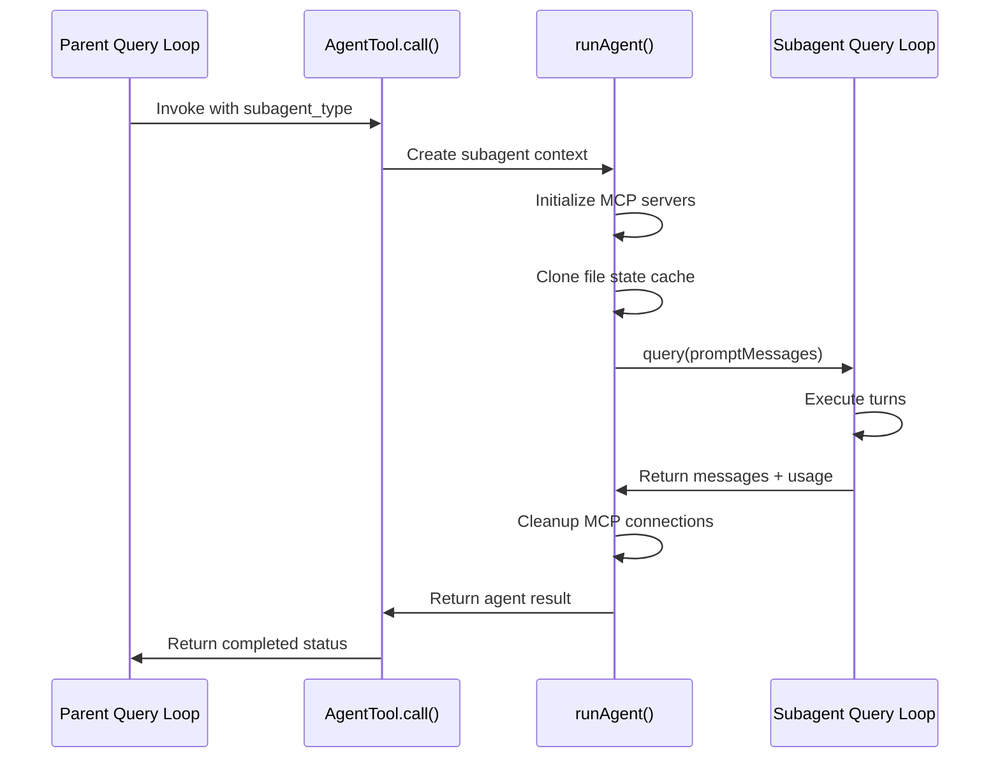
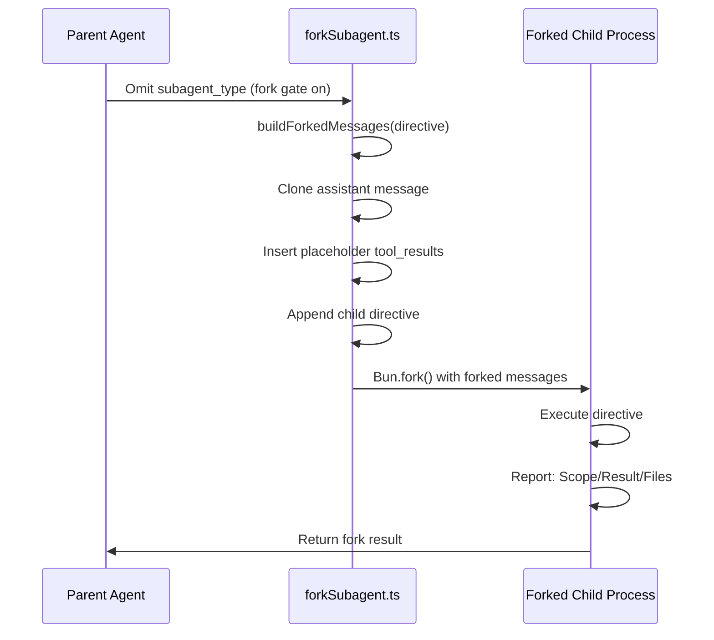
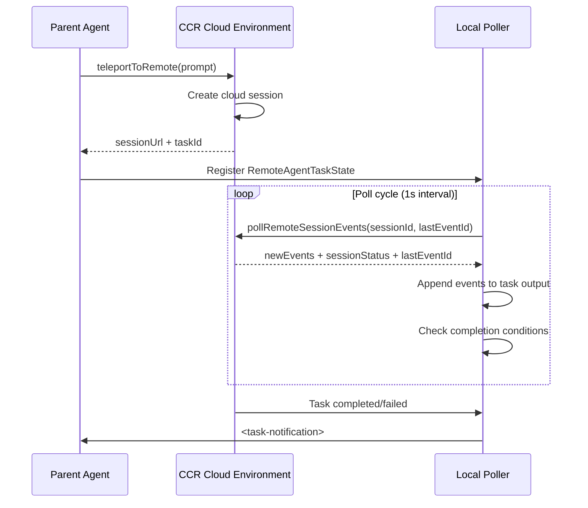

# Sync vs Fork vs Remote: The Execution Modes

## Overview

cc's AgentTool supports three fundamentally different execution modes for subagents, each with distinct tradeoffs in context sharing, state isolation, communication latency, and resource consumption. Understanding when to use each mode is critical for building reliable multi-agent orchestrations.

- **Sync mode**: The subagent runs in the same process, in the same event loop, blocking the parent's query loop until completion. The subagent gets its own context window but shares the process's memory and AppState.

- **Fork mode**: The subagent runs as a child process via `Bun.fork()`, with its own memory space and event loop. The child inherits the parent's conversation context for prompt cache sharing, then diverges as it processes its directive.

- **Remote mode**: The subagent runs in a cloud CCR (Claude Code Remote) environment, on a different machine entirely. Communication happens via HTTP polling and webhook notifications.

These three tiers map directly to HER Section 9.1's three tiers of multi-agent orchestration: in-process subagents, local orchestrators, and cloud async. This chapter examines each mode's implementation, tradeoffs, and failure handling.

## Data structures and contracts

### Fork agent definition

The fork path uses a synthetic agent definition that inherits the parent's full tool pool and model. This definition is not registered in the `builtInAgents` catalog; it is used only when `subagent_type` is omitted and the fork experiment is active:

```typescript
// src/tools/AgentTool/forkSubagent.ts:L60-L71
export const FORK_AGENT = {
  agentType: FORK_SUBAGENT_TYPE,
  whenToUse:
    'Implicit fork — inherits full conversation context. Not selectable via subagent_type; triggered by omitting subagent_type when the fork experiment is active.',
  tools: ['*'],
  maxTurns: 200,
  model: 'inherit',
  permissionMode: 'bubble',
  source: 'built-in',
  baseDir: 'built-in',
  getSystemPrompt: () => '',
} satisfies BuiltInAgentDefinition
```

The `tools: ['*']` with `useExactTools` means the fork child receives the parent's exact tool pool, producing cache-identical API request prefixes. The `permissionMode: 'bubble'` means permission prompts surface to the parent terminal, since the child process has no terminal of its own. The `model: 'inherit'` keeps the parent's model for context length parity and cache sharing. The `getSystemPrompt` function returns an empty string because the fork path passes `override.systemPrompt` with the parent's already-rendered system prompt bytes, threaded via `toolUseContext.renderedSystemPrompt`. Reconstructing the prompt by re-calling `getSystemPrompt()` can diverge (GrowthBook cold-to-warm flag changes) and bust the prompt cache; threading the rendered bytes is byte-exact.

### CacheSafeParams

The fork path must share byte-identical API request prefixes with the parent for prompt cache hits. The Anthropic API cache key is composed of system prompt, tools, model, messages prefix, and thinking config. The `CacheSafeParams` type carries the first five parameters:

```typescript
// src/utils/forkedAgent.ts:L57-L68
export type CacheSafeParams = {
  /** System prompt - must match parent for cache hits */
  systemPrompt: SystemPrompt
  /** User context - prepended to messages, affects cache */
  userContext: { [k: string]: string }
  /** System context - appended to system prompt, affects cache */
  systemContext: { [k: string]: string }
  /** Tool use context containing tools, model, and other options */
  toolUseContext: ToolUseContext
  /** Parent context messages for prompt cache sharing */
  forkContextMessages: Message[]
}
```

The `CacheSafeParams` are captured immediately after the subagent's system prompt and context are assembled, via the `onCacheSafeParams` callback in `runAgent`. This timing is critical: if any GrowthBook flag changes between prompt assembly and capture, the cached params will not match the rendered prompt, and the fork child will miss the cache. The `saveCacheSafeParams` and `getLastCacheSafeParams` functions store the most recent params globally, allowing post-turn forks (prompt suggestion, post-turn summary, `/btw`) to share the main loop's prompt cache without each caller threading params through separately.

### ForkedAgentParams

The full parameter set for running a forked agent includes cache-safe params, prompt messages, and optional overrides. Each field has specific implications for cache sharing and resource management:

```typescript
// src/utils/forkedAgent.ts:L83-L113
export type ForkedAgentParams = {
  /** Messages to start the forked query loop with */
  promptMessages: Message[]
  /** Cache-safe parameters that must match the parent query */
  cacheSafeParams: CacheSafeParams
  /** Permission check function for the forked agent */
  canUseTool: CanUseToolFn
  /** Source identifier for tracking */
  querySource: QuerySource
  /** Label for analytics (e.g., 'session_memory', 'supervisor') */
  forkLabel: string
  /** Optional overrides for the subagent context (e.g., readFileState from setup phase) */
  overrides?: SubagentContextOverrides
  /**
   * Optional cap on output tokens. CAUTION: setting this changes both max_tokens
   * AND budget_tokens (via clamping in claude.ts). If the fork uses cacheSafeParams
   * to share the parent's prompt cache, a different budget_tokens will invalidate
   * the cache — thinking config is part of the cache key. Only set this when cache
   * sharing is not a goal (e.g., compact summaries).
   */
  maxOutputTokens?: number
  /** Optional cap on number of turns (API round-trips) */
  maxTurns?: number
  /** Optional callback invoked for each message as it arrives (for streaming UI) */
  onMessage?: (message: Message) => void
  /** Skip sidechain transcript recording (e.g., for ephemeral work like speculation) */
  skipTranscript?: boolean
  /** Skip writing new prompt cache entries on the last message. For
   *  fire-and-forget forks where no future request will read from this prefix. */
  skipCacheWrite?: boolean
}
```

The `maxOutputTokens` field comes with a critical caveat: setting it changes both `max_tokens` and `budget_tokens` (via clamping in `claude.ts`). If the fork uses `cacheSafeParams` to share the parent's prompt cache, a different `budget_tokens` will invalidate the cache, because thinking config is part of the cache key. This field should only be set when cache sharing is not a goal (e.g., compact summaries that intentionally use a different context window size).

The `skipTranscript` flag disables sidechain transcript recording for ephemeral work like speculation. The `skipCacheWrite` flag skips writing new prompt cache entries on the last message, which is appropriate for fire-and-forget forks where no future request will read from this prefix.

### Remote agent task state

Remote agents are tracked via a task state with polling metadata. The state captures the CCR session identifier, command, progress, and review-specific metadata:

```typescript
// src/tasks/RemoteAgentTask/RemoteAgentTask.tsx:L22-L59
export type RemoteAgentTaskState = TaskStateBase & {
  type: 'remote_agent';
  remoteTaskType: RemoteTaskType;
  /** Task-specific metadata (PR number, repo, etc.). */
  remoteTaskMetadata?: RemoteAgentMetadata;
  sessionId: string; // Original session ID for API calls
  command: string;
  title: string;
  todoList: TodoList;
  log: SDKMessage[];
  /**
   * Long-running agent that will not be marked as complete after the first `result`.
   */
  isLongRunning?: boolean;
  /**
   * When the local poller started watching this task (at spawn or on restore).
   * Review timeout clocks from here so a restore doesn't immediately time out
   * a task spawned >30min ago.
   */
  pollStartedAt: number;
  /** True when this task was created by a teleported /ultrareview command. */
  isRemoteReview?: boolean;
  /** Parsed from the orchestrator's <remote-review-progress> heartbeat echoes. */
  reviewProgress?: {
    stage?: 'finding' | 'verifying' | 'synthesizing';
    bugsFound: number;
    bugsVerified: number;
    bugsRefuted: number;
  };
  isUltraplan?: boolean;
  /**
   * Scanner-derived pill state. Undefined = running. `needs_input` when the
   * remote asked a clarifying question and is idle; `plan_ready` when
   * ExitPlanMode is awaiting browser approval. Surfaced in the pill badge
   * and detail dialog status line.
   */
  ultraplanPhase?: Exclude<UltraplanPhase, 'running'>;
};
```

The `pollStartedAt` timestamp is critical for timeout handling: if the CCR session drops during a remote agent's execution, the local poller continues polling until a timeout. The timestamp ensures that restored sessions do not immediately time out based on the original spawn time, which could be hours before the session was restored. The `reviewProgress` field tracks structured progress for remote review tasks, providing machine-readable metrics (bugs found, verified, refuted) that can be surfaced to users in the terminal UI. The `isLongRunning` flag prevents the poller from treating a single `result` event as terminal, which is necessary for monitors that emit periodic results.

### Local agent task state

Local (sync and background) agents are tracked with a richer state including progress tracking and message queuing. This state is used by the task system to manage the agent's lifecycle, display progress, and handle inter-agent communication:

```typescript
// src/tasks/LocalAgentTask/LocalAgentTask.tsx:L116-L148
export type LocalAgentTaskState = TaskStateBase & {
  type: 'local_agent';
  agentId: string;
  prompt: string;
  selectedAgent?: AgentDefinition;
  agentType: string;
  model?: string;
  abortController?: AbortController;
  unregisterCleanup?: () => void;
  error?: string;
  result?: AgentToolResult;
  progress?: AgentProgress;
  retrieved: boolean;
  messages?: Message[];
  // Track what we last reported for computing deltas
  lastReportedToolCount: number;
  lastReportedTokenCount: number;
  // Whether the task has been backgrounded (false = foreground running, true = backgrounded)
  isBackgrounded: boolean;
  // Messages queued mid-turn via SendMessage, drained at tool-round boundaries
  pendingMessages: string[];
  // UI is holding this task: blocks eviction, enables stream-append, triggers
  // disk bootstrap. Set by enterTeammateView. Separate from viewingAgentTaskId
  // (which is "what am I LOOKING at") — retain is "what am I HOLDING."
  retain: boolean;
  // Bootstrap has read the sidechain JSONL and UUID-merged into messages.
  // One-shot per retain cycle; stream appends from there.
  diskLoaded: boolean;
  // Panel visibility deadline. undefined = no deadline (running or retained);
  // timestamp = hide + GC-eligible after this time. Set at terminal transition
  // and on unselect; cleared on retain.
  evictAfter?: number;
};
```

The `unregisterCleanup` field stores a cleanup function registered via the `registerCleanup` utility, which fires on agent kill to release resources like background bash processes. The `pendingMessages` array queues `SendMessage` messages for the agent, drained at the next tool-round boundary. The `retain` flag prevents the task from being garbage-collected when the parent session is compacted. The `diskLoaded` flag indicates whether the task's messages were loaded from disk (on session resume) rather than accumulated in memory. The `evictAfter` timestamp enables time-based eviction of completed tasks to manage memory in long-running sessions.

### ProgressTracker

Local agents track tool use count, token consumption, and recent activities for progress reporting. This provides machine-readable progress that can be surfaced to users and used for adaptive decisions:

```typescript
// src/tasks/LocalAgentTask/LocalAgentTask.tsx:L41-L49
export type ProgressTracker = {
  toolUseCount: number;
  // Track input and output separately to avoid double-counting.
  // input_tokens in Claude API is cumulative per turn (includes all previous context),
  // so we keep the latest value. output_tokens is per-turn, so we sum those.
  latestInputTokens: number;
  cumulativeOutputTokens: number;
  recentActivities: ToolActivity[];
};
```

The `recentActivities` array captures the last N tool invocations (capped at `MAX_RECENT_ACTIVITIES = 5`) with their names, inputs, and pre-computed activity descriptions. Input tokens and output tokens are tracked separately because the Claude API reports `input_tokens` as cumulative per turn (already includes all previous context), while `output_tokens` is per-turn, requiring summation. The `createProgressTracker` function initializes a fresh tracker, and `updateProgressFromMessage` increments counters and appends activities as each assistant message arrives.

## Control flow

### Sync mode execution

In sync mode, the parent's query loop calls `runAgent()` directly, which creates a subagent context, initializes MCP servers, and runs a nested `query()` call. The parent blocks until the subagent finishes. The subagent shares the parent's AppState but has its own conversation history and permission context:



The sync path is the simplest execution mode but has important implications for the parent's event loop. Because the parent blocks on the subagent's `query()` generator, it cannot process user input, handle interrupt signals, or respond to other subagent notifications during the subagent's execution. This is acceptable for short-lived agents (Explore, Plan) but problematic for long-running agents that may take minutes to complete.

The sync path's key data flow inside `runAgent` is:

1. `AgentTool.call()` resolves the agent definition from the `subagent_type` parameter and assembles the tool pool via `assembleToolPool` and `resolveAgentTools`.

2. `runAgent()` constructs the agent's system prompt, either from the definition's `getSystemPrompt()` or by threading the parent's rendered system prompt bytes via `override.systemPrompt` (the fork path).

3. It resolves the user context and system context. For read-only agents (Explore, Plan), the `omitClaudeMd` optimization drops CLAUDE.md content, and the `systemContext` drops the stale `gitStatus` field, saving 5-15 Gtok/week across the fleet.

4. It initializes agent-specific MCP servers via `initializeAgentMcpServers`, which merges parent clients with any frontmatter-defined servers and returns a cleanup function.

5. It creates the subagent context via `createSubagentContext`, which clones the file state cache, sets up an isolated or shared `AbortController`, and configures the permission mode.

6. The core loop iterates over `query()` as an async generator, yielding messages back to the caller. For each message:
   - `stream_event` messages with `message_start` type are forwarded to the parent's metrics display via `pushApiMetricsEntry`, then skipped (not recorded in the transcript).
   - `attachment` messages (including `max_turns_reached`) are yielded without recording.
   - `isRecordableMessage` messages (assistant, user, progress, compact_boundary) are appended to the sidechain transcript with parent-chain UUIDs and yielded.

7. The `finally` block performs a seven-step cleanup: MCP server disconnects, session hook removal, prompt cache tracking cleanup, file state cache release, fork context messages release, perfetto agent unregistration, and orphaned todo key removal.

The sync path shares the `setAppState` callback with the parent for sync agents but creates an isolated `AbortController` for async agents. This means sync agents contribute to the parent's UI state updates (permission prompts, tool progress), while async agents run in isolation and report results asynchronously. The `shareSetResponseLength: true` setting applies to both sync and async agents, ensuring that both contribute to the parent's response length metrics for accurate token budget tracking.

### Fork mode execution

The fork path is triggered when `isForkSubagentEnabled()` returns true and no `subagent_type` is specified. This path is designed for parallel work that shares the parent's prompt cache, reducing cost by 50-90% for the shared prefix. The parent's current assistant message (containing all tool_use blocks) is cloned, and identical placeholder tool_results are inserted for cache sharing. Then a per-child directive is appended:

```typescript
// src/tools/AgentTool/forkSubagent.ts:L107-L169
export function buildForkedMessages(
  directive: string,
  assistantMessage: AssistantMessage,
): MessageType[] {
  // Clone the assistant message to avoid mutating the original, keeping all
  // content blocks (thinking, text, and every tool_use)
  const fullAssistantMessage: AssistantMessage = {
    ...assistantMessage,
    uuid: randomUUID(),
    message: {
      ...assistantMessage.message,
      content: [...assistantMessage.message.content],
    },
  }

  // Collect all tool_use blocks from the assistant message
  const toolUseBlocks = assistantMessage.message.content.filter(
    (block): block is BetaToolUseBlock => block.type === 'tool_use',
  )

  if (toolUseBlocks.length === 0) {
    logForDebugging(
      `No tool_use blocks found in assistant message for fork directive: ${directive.slice(0, 50)}...`,
      { level: 'error' },
    )
    return [
      createUserMessage({
        content: [
          { type: 'text' as const, text: buildChildMessage(directive) },
        ],
      }),
    ]
  }

  // Build tool_result blocks for every tool_use, all with identical placeholder text
  const toolResultBlocks = toolUseBlocks.map(block => ({
    type: 'tool_result' as const,
    tool_use_id: block.id,
    content: [
      {
        type: 'text' as const,
        text: FORK_PLACEHOLDER_RESULT,
      },
    ],
  }))

  // Build a single user message: all placeholder tool_results + the per-child directive
  const toolResultMessage = createUserMessage({
    content: [
      ...toolResultBlocks,
      {
        type: 'text' as const,
        text: buildChildMessage(directive),
      },
    ],
  })

  return [fullAssistantMessage, toolResultMessage]
}
```

The critical insight is that all fork children must produce byte-identical API request prefixes. The cloned assistant message and the placeholder tool_results are identical across all children. Only the final text block (the child directive) differs per child. This means N fork children share the same prompt cache entry for the shared prefix, with only the last few hundred tokens differing per child.

When the parent's assistant message has no tool_use blocks (e.g., a pure text response), `buildForkedMessages` falls back to a simple user message containing only the directive. This path does not benefit from prompt cache sharing because there is no shared prefix to cache. The fallback is logged as an error because it indicates an unexpected call pattern.

The `FORK_PLACEHOLDER_RESULT` constant enforces identical placeholder text across all children:

```typescript
// src/tools/AgentTool/forkSubagent.ts:L93
const FORK_PLACEHOLDER_RESULT = 'Fork started — processing in background'
```

If any child produces different placeholder text, the prompt cache is invalidated for all children. This is a subtle bug that can be introduced by modifying the constant or by building tool_results differently per child.

The fork child receives a strict boilerplate that prevents it from spawning further subagents. The boilerplate is wrapped in an XML tag that the `isInForkChild()` guard scans for:

```typescript
// src/tools/AgentTool/forkSubagent.ts:L171-L198
export function buildChildMessage(directive: string): string {
  return `<${FORK_BOILERPLATE_TAG}>
STOP. READ THIS FIRST.

You are a forked worker process. You are NOT the main agent.

RULES (non-negotiable):
1. Your system prompt says "default to forking." IGNORE IT \u2014 that's for the parent. You ARE the fork. Do NOT spawn sub-agents; execute directly.
2. Do NOT converse, ask questions, or suggest next steps
3. Do NOT editorialize or add meta-commentary
4. USE your tools directly: Bash, Read, Write, etc.
5. If you modify files, commit your changes before reporting. Include the commit hash in your report.
6. Do NOT emit text between tool calls. Use tools silently, then report once at the end.
7. Stay strictly within your directive's scope. If you discover related systems outside your scope, mention them in one sentence at most \u2014 other workers cover those areas.
8. Keep your report under 500 words unless the directive specifies otherwise. Be factual and concise.
9. Your response MUST begin with "Scope:". No preamble, no thinking-out-loud.
10. REPORT structured facts, then stop

Output format (plain text labels, not markdown headers):
  Scope: <echo back your assigned scope in one sentence>
  Result: <the answer or key findings, limited to the scope above>
  Key files: <relevant file paths \u2014 include for research tasks>
  Files changed: <list with commit hash \u2014 include only if you modified files>
  Issues: <list \u2014 include only if there are issues to flag>
</${FORK_BOILERPLATE_TAG}>

${FORK_DIRECTIVE_PREFIX}${directive}`
}
```

The output format (Scope, Result, Key files, Files changed, Issues) is designed for machine-parseable results. The parent can extract structured data from the child's report without parsing free-form prose. This is important for aggregation when multiple fork children report back to the parent.



### Fork feature gate

The fork path is gated by the `isForkSubagentEnabled()` function, which checks three conditions: the `FORK_SUBAGENT` feature flag is on, the session is not in coordinator mode, and the session is interactive (not non-interactive):

```typescript
// src/tools/AgentTool/forkSubagent.ts:L32-L39
export function isForkSubagentEnabled(): boolean {
  if (feature('FORK_SUBAGENT')) {
    if (isCoordinatorMode()) return false
    if (getIsNonInteractiveSession()) return false
    return true
  }
  return false
}
```

The coordinator mode exclusion is necessary because the coordinator already owns the orchestration role and has its own delegation model. Allowing fork subagents in coordinator mode would create conflicting delegation paths. The non-interactive session exclusion prevents fork children from spawning in headless API sessions where there is no terminal to bubble permission prompts to.

### Worktree notice for isolated fork children

Fork children running in isolated worktrees inherit context that references the parent's working directory. The `buildWorktreeNotice()` function injects a warning to translate paths, but there is no automatic path remapping:

```typescript
// src/tools/AgentTool/forkSubagent.ts:L205-L210
export function buildWorktreeNotice(
  parentCwd: string,
  worktreeCwd: string,
): string {
  return `You've inherited the conversation context above from a parent agent working in ${parentCwd}. You are operating in an isolated git worktree at ${worktreeCwd} — same repository, same relative file structure, separate working copy. Paths in the inherited context refer to the parent's working directory; translate them to your worktree root. Re-read files before editing if the parent may have modified them since they appear in the context. Your changes stay in this worktree and will not affect the parent's files.`
}
```

This notice is a hint to the model, not an enforcement mechanism. The model must interpret the notice and adjust its file operations accordingly. If the model ignores the notice and uses parent paths, its writes will go to the parent's working directory instead of the worktree, violating the isolation guarantee. This is a known limitation that could be addressed with automatic path translation in a future version.

A further complication arises when the parent modifies files after the worktree is created. The worktree is a git-level snapshot, so any parent modifications after the fork point are not visible to the child. The notice instructs the child to re-read files before editing if the parent may have modified them, but this is advisory. In practice, the race window is small because fork children are typically spawned for parallel research or exploration tasks that do not overlap with the parent's file modifications.

### Remote mode execution

Remote agents are launched in CCR environments via the `teleportToRemote()` function. The local process registers a `RemoteAgentTaskState` and polls for events. The remote path is the most complex execution mode because it involves network communication, session management, and error recovery across machine boundaries:



Remote agent eligibility requires several preconditions, each with a specific error message. The `checkRemoteAgentEligibility()` function validates authentication, git repo state, GitHub remote configuration, and the Claude GitHub app installation:

```typescript
// src/tasks/RemoteAgentTask/RemoteAgentTask.tsx:L124-L141
export async function checkRemoteAgentEligibility({
  skipBundle = false
}: {
  skipBundle?: boolean;
} = {}): Promise<RemoteAgentPreconditionResult> {
  const errors = await checkBackgroundRemoteSessionEligibility({
    skipBundle
  });
  if (errors.length > 0) {
    return {
      eligible: false,
      errors
    };
  }
  return {
    eligible: true
  };
}
```

The `skipBundle` parameter controls whether the eligibility check skips the bundle validation step, which is useful when the calling context has already verified bundle compatibility. The function delegates to `checkBackgroundRemoteSessionEligibility`, which returns an array of `BackgroundRemoteSessionPrecondition` errors. Each failing check returns a specific, actionable error message. When any check fails, the dispatch falls back to local execution rather than failing the entire task.

The `formatPreconditionError` function converts the raw error list into a user-friendly message that explains what is missing and how to fix it. For example, if the GitHub app is not installed, the message includes a link to install it. If the git repo has no GitHub remote, the message suggests adding one with `git remote add origin`. This user-facing error design is critical for remote agent adoption: users who encounter a wall of technical errors are likely to abandon the feature entirely.

### Remote agent polling loop

The local poller for remote agents runs in a 1-second interval loop managed by `startRemoteSessionPolling`. On each tick, it calls `pollRemoteSessionEvents` with the last event ID to fetch only the delta, appends new events to the accumulated log, and writes text output to the task's disk file. The poller must handle several completion signals:

1. **Session archived**: The CCR session has completed. The poller marks the task as completed and enqueues a notification.

2. **Completion checker**: For special remote task types (autofix-pr, ultraplan), a registered `RemoteTaskCompletionChecker` is invoked on each tick. If it returns a non-null string, the task is completed with that string as the notification text.

3. **Result event**: For non-long-running tasks, a `result` event in the accumulated log signals completion. Long-running monitors and ultraplan tasks skip this check because they emit periodic results.

4. **Remote review completion**: For bughunter-mode reviews, completion is signaled by the `<remote-review>` tag in hook progress stdout. For prompt-mode reviews, stable idle (5 consecutive polls with no log growth) plus the presence of assistant events signals completion. A 30-minute timeout from `pollStartedAt` provides a safety cap.

A critical subtlety is the stable-idle debounce. Remote sessions briefly flip to `idle` between every tool turn, so a single idle observation is meaningless. The poller requires `STABLE_IDLE_POLLS = 5` consecutive idle polls with no log growth before treating idle as a completion signal. Without this debounce, the poller would prematurely terminate remote agents that are between turns.

The poller also handles race conditions with `TaskStopTool`. If a task is killed while `pollRemoteSessionEvents` is in-flight, the poller's state update guard detects the terminal status and bails without overwriting the killed state or sending a duplicate notification.

### Progress tracking for local agents

Local agents track tool use count, token consumption, and recent activities for progress reporting. The `createProgressTracker` function initializes a tracker, and `updateProgressFromMessage` updates it as the agent processes messages. The `getProgressUpdate` function extracts the current progress as an `AgentProgress` object for display and adaptive decisions.

The progress tracker provides three key metrics: how many tools the agent has used (activity level), how many tokens it has consumed (cost), and what it has been doing recently (direction). These metrics enable adaptive decisions like auto-backgrounding after a timeout or alerting the user when an agent's token consumption exceeds a threshold.

The `lastReportedToolCount` and `lastReportedTokenCount` fields in `LocalAgentTaskState` prevent redundant progress updates. The `createActivityDescriptionResolver` function generates a short human-readable description of the agent's recent activities (e.g., "Reading 3 files, editing src/main.ts"), which is displayed in the task list UI and in `<task-notification>` messages. This description is computed lazily from the `ProgressTracker.recentActivities` array to avoid the overhead of string formatting on every message.

### Auto-background transition

Sync agents can be automatically promoted to async after 120 seconds. This transition is gated by the `getAutoBackgroundMs()` function, which returns `120_000` when either the `CLAUDE_AUTO_BACKGROUND_TASKS` environment variable is set or the `tengu_auto_background_agents` GrowthBook feature flag is enabled:

```typescript
// src/tools/AgentTool/AgentTool.tsx:L72-L77
function getAutoBackgroundMs(): number {
  if (isEnvTruthy(process.env.CLAUDE_AUTO_BACKGROUND_TASKS) || getFeatureValue_CACHED_MAY_BE_STALE('tengu_auto_background_agents', false)) {
    return 120_000;
  }
  return 0;
}
```

When auto-backgrounding is active, `AgentTool.call()` sets a timer via `setTimeout` at the start of the agent's execution. If the agent completes before the timer fires, the timer is cancelled. If the timer fires first, the agent's execution is transitioned to the background task system:

1. A `LocalAgentTaskState` is created for the running agent with `isBackgrounded: true`
2. The task is registered in the local task system via `registerTask`
3. The agent's query loop continues running, but progress is now tracked through the task system
4. `AgentTool.call()` returns `{ status: 'async_launched', agentId }` to the parent instead of blocking
5. When the agent completes, a `<task-notification>` is enqueued to the parent's message queue

The `runAsyncAgentLifecycle` function drives the background agent from spawn to terminal notification. It iterates over the agent's `query()` generator (provided as a `makeStream` callback), appending each message to the task's messages array for the UI, updating the progress tracker, and emitting progress events. On completion, it calls `finalizeAgentTool` to extract the result, `completeAsyncAgent` to transition the task state, and `enqueueAgentNotification` to deliver the result to the parent.

This transition requires careful state management: the agent's accumulated messages, usage metrics, and tool state must be transferred from the sync execution path to the async task system without loss. The `preserveToolUseResults` flag ensures that the agent's transcript is viewable after the transition.

### Forwarding API metrics from subagents

The `runAgent` function forwards subagent API request starts to the parent's metrics display so that TTFT (Time To First Token) and OTPS (Output Tokens Per Second) update during subagent execution. This is critical for the user experience: without forwarding, the parent's metrics display would show zero activity while a subagent is running, leading the user to believe the system is stuck:

```typescript
// src/tools/AgentTool/runAgent.ts:L761-L768
if (
  message.type === 'stream_event' &&
  message.event.type === 'message_start' &&
  message.ttftMs != null
) {
  toolUseContext.pushApiMetricsEntry?.(message.ttftMs)
  continue
}
```

The `pushApiMetricsEntry` callback is threaded from the parent's `ToolUseContext` and is optional (some contexts do not track metrics). The `continue` statement ensures that `stream_event` messages are not recorded in the transcript, since they are ephemeral metrics events rather than conversation turns.

## Edge cases and failure modes

- **Fork child context rot**: Fork children inherit the parent's full conversation context, which can be large. If the inherited context is near the token limit, the child has very little budget for its own work. HER Section 6.5 (Context Anxiety) notes that models prematurely wrap up near perceived context limits. The `maxTurns: 200` on FORK_AGENT provides a safety cap, but does not address the context budget problem. A parent with 180K tokens of context would leave a fork child very little room for its directive and tool results.

- **Fork placeholder cache sharing**: All fork children must use identical placeholder text for tool_results. If any child produces different placeholder text, the prompt cache is invalidated for all children. The constant `FORK_PLACEHOLDER_RESULT` enforces this across all children. A developer modifying this constant without understanding the cache-sharing contract would silently degrade performance for all fork children.

- **Remote session disconnection**: If the CCR session drops during a remote agent's execution, the local poller continues polling until a timeout. The `pollStartedAt` timestamp ensures that restored sessions do not immediately time out based on the original spawn time. However, if the remote session is permanently lost (e.g., the CCR environment is terminated), the poller will continue polling until the timeout expires, wasting resources.

- **Local agent message queuing**: When a SendMessage targets a running local agent, the message is queued in `pendingMessages` and drained at the next tool-round boundary. If the agent finishes before the message is drained, it is lost. This is a known limitation of the tool-round-boundary communication model: there is no interrupt mechanism to deliver a message mid-turn.

- **Worktree path translation**: Fork children running in isolated worktrees inherit context that references the parent's working directory. The `buildWorktreeNotice()` function injects a warning to translate paths, but there is no automatic path remapping. The model must interpret the notice and adjust its file operations. If the model ignores the notice and uses parent paths, its writes will go to the parent's working directory instead of the worktree.

- **Abort propagation**: Local agents use `AbortController` for cancellation. When a parent is killed, child abort controllers are signaled. For remote agents, the cancellation path is different: the local poller stops and the remote session may continue running orphaned. There is no guaranteed cancellation of a remote agent; the CCR session may persist after the local parent has exited.

- **Fork with no tool_use blocks**: If the parent's assistant message has no tool_use blocks (e.g., a pure text response), `buildForkedMessages` falls back to a simple user message with the directive. This path does not benefit from prompt cache sharing because there is no shared prefix to cache. The fallback is logged as an error because it indicates an unexpected call pattern.

- **MaxOutputTokens cache invalidation**: Setting `maxOutputTokens` on a `ForkedAgentParams` changes the thinking budget, which is part of the API cache key. If the fork child uses cache-safe params but also sets `maxOutputTokens`, the cache will be invalidated. This is a subtle footgun that is documented in the type definition but easy to miss in practice.

## Where cc diverges from the published pattern

**HER Section 9.1 describes three tiers** (in-process, local orchestrator, cloud async) as a progressive hierarchy. cc implements all three, but the boundaries are fluid: sync agents can be auto-backgrounded after 120 seconds, effectively promoting them from in-process to "local async." The tier is not a fixed property of the agent type but a runtime decision. A single agent invocation can start as sync, transition to background after 120 seconds, and deliver its result asynchronously. This fluidity is not described in HER, which treats the tiers as distinct architectural choices.

**HER Section 6.5 (Context Anxiety)** recommends context resets with structured handoffs rather than pushing to the limit. cc's fork mode pushes the full parent context into the child, which can exacerbate context anxiety if the parent is near its limit. There is no automatic compaction or summarization of the inherited context before forking. The `omitClaudeMd` and `systemContext` optimizations (dropping gitStatus) mitigate this partially, but the core problem remains: a bloated parent produces a bloated child.

**The fork mode's "bubble" permission model** (where permission prompts surface to the parent terminal) is not described in HER. This is a practical necessity for CLI-based agents: the child process has no terminal of its own, so permission requests must be routed through the parent. HER's description of subagents assumes each agent has its own interface surface. The bubble model also introduces a latency penalty: each permission prompt requires an IPC round-trip between the child and parent, which can slow down the child's execution if it needs many permissions.

**HER Pattern 8 (Fork-Join Parallelism)** describes a formal barrier sync where the parent waits for all children to complete before proceeding. cc does not implement a formal join. Results are delivered via `<task-notification>` messages that arrive asynchronously. The parent processes each notification independently and can start new work before all children have reported. This is a more flexible model but requires the parent to manage partial results and handle the case where some children fail while others succeed.

## Developer takeaways for building a long-running agent

1. **Use fork mode for parallel, cache-friendly work.** The fork path's placeholder tool_results and CacheSafeParams ensure that multiple fork children share the parent's prompt cache, reducing cost by 50-90% for the shared prefix. The key constraint is that all children must produce byte-identical prefixes, which requires careful management of placeholder text and system prompt threading.

2. **Avoid inheriting bloated contexts.** Before forking, consider whether the child actually needs the full parent conversation. For research tasks, a fresh context with a concise directive may be more effective and cheaper. The `omitClaudeMd` flag demonstrates this principle: read-only agents do not need the full CLAUDE.md hierarchy.

3. **Design for graceful degradation when remote is unavailable.** Remote agent launch has many preconditions. The agent should be able to fall back to local execution when remote is unavailable, rather than failing the entire task. cc's dispatch logic tries remote first and falls back to sync if preconditions are not met.

4. **Track progress with structured metrics.** The `ProgressTracker` pattern (tool use count, token count, recent activities) provides machine-readable progress for adaptive decisions (e.g., auto-backgrounding after a timeout). Avoid relying on parsing the model's text output for progress.

5. **Separate task lifecycle from process lifecycle.** cc's `LocalAgentTaskState` and `RemoteAgentTaskState` decouple the task's logical state from the underlying process's state. This enables features like agent resume after eviction, progress restoration on session resume, and orphan cleanup for remote sessions.
