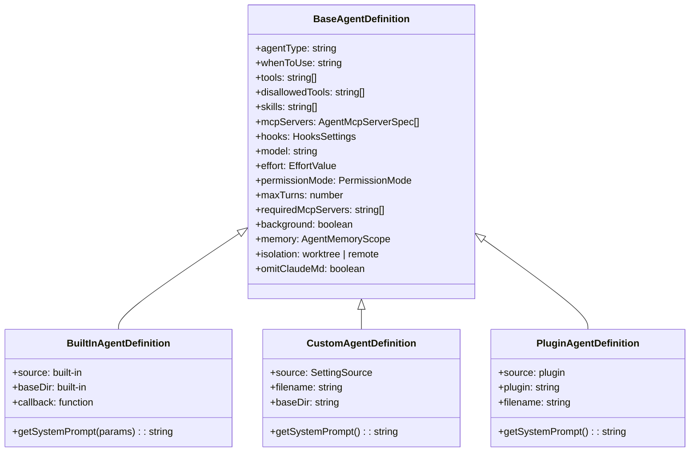
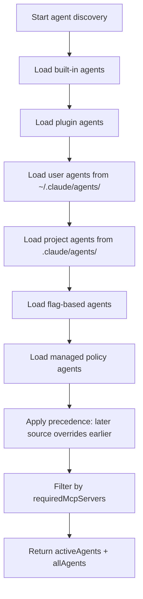

# Agent Definitions: Loading, Frontmatter, and Built-Ins

## Overview

cc's agent system is built on a discovery-and-loading pipeline that assembles agent definitions from multiple sources: built-in agents hardcoded in the binary, user-defined agents in `~/.claude/agents/`, project-level agents in `.claude/agents/`, managed policy agents, and plugin agents. Each agent is defined by a Markdown file with YAML frontmatter that specifies its capabilities, constraints, and behavior. This chapter examines how cc discovers, parses, validates, and activates these agent definitions.

The agent definition pipeline connects to HER Section 7.4 (Sub-Agents as a Configuration Surface), which describes subagents as discrete tasks in isolated context windows with configurable model, tools, and permissions. It also connects to Pattern 2 (Scoped Context Assembly) through the way agent frontmatter assembles the subagent's tool pool, MCP servers, and permission mode.

The trust model for agent definitions is layered by source. Built-in agents ship with the binary and carry full trust: they can declare any frontmatter field including `permissionMode`, `hooks`, and `mcpServers`. Custom agents (from user, project, or policy settings) also carry full trust because a human explicitly wrote or approved the frontmatter. Plugin agents, however, are third-party marketplace code and operate under a restricted trust boundary: `permissionMode`, `hooks`, and `mcpServers` are intentionally not parsed from plugin agent frontmatter. This distinction is critical for the security posture of the agent system and is examined in detail later in this chapter.

## Data structures and contracts

### AgentDefinition union type

The core type is a discriminated union of three variants: built-in, custom, and plugin. The discrimination is based on the `source` field, which determines how the agent was loaded and what trust level it has:

```typescript
// src/tools/AgentTool/loadAgentsDir.ts:L105-L165
// Base type with common fields for all agents
export type BaseAgentDefinition = {
  agentType: string
  whenToUse: string
  tools?: string[]
  disallowedTools?: string[]
  skills?: string[] // Skill names to preload (parsed from comma-separated frontmatter)
  mcpServers?: AgentMcpServerSpec[] // MCP servers specific to this agent
  hooks?: HooksSettings // Session-scoped hooks registered when agent starts
  color?: AgentColorName
  model?: string
  effort?: EffortValue
  permissionMode?: PermissionMode
  maxTurns?: number // Maximum number of agentic turns before stopping
  filename?: string // Original filename without .md extension (for user/project/managed agents)
  baseDir?: string
  criticalSystemReminder_EXPERIMENTAL?: string // Short message re-injected at every user turn
  requiredMcpServers?: string[] // MCP server name patterns that must be configured for agent to be available
  background?: boolean // Always run as background task when spawned
  initialPrompt?: string // Prepended to the first user turn (slash commands work)
  memory?: AgentMemoryScope // Persistent memory scope
  isolation?: 'worktree' | 'remote' // Run in an isolated git worktree, or remotely in CCR (ant-only)
  pendingSnapshotUpdate?: { snapshotTimestamp: string }
  /** Omit CLAUDE.md hierarchy from the agent's userContext. Read-only agents
   * (Explore, Plan) don't need commit/PR/lint guidelines — the main agent has
   * full CLAUDE.md and interprets their output. Saves ~5-15 Gtok/week across
   * 34M+ Explore spawns. Kill-switch: tengu_slim_subagent_claudemd. */
  omitClaudeMd?: boolean
}

// Built-in agents - dynamic prompts only, no static systemPrompt field
export type BuiltInAgentDefinition = BaseAgentDefinition & {
  source: 'built-in'
  baseDir: 'built-in'
  callback?: () => void
  getSystemPrompt: (params: {
    toolUseContext: Pick<ToolUseContext, 'options'>
  }) => string
}

// Custom agents from user/project/policy settings - prompt stored via closure
export type CustomAgentDefinition = BaseAgentDefinition & {
  getSystemPrompt: () => string
  source: SettingSource
  filename?: string
  baseDir?: string
}

// Plugin agents - similar to custom but with plugin metadata, prompt stored via closure
export type PluginAgentDefinition = BaseAgentDefinition & {
  getSystemPrompt: () => string
  source: 'plugin'
  filename?: string
  plugin: string
}

// Union type for all agent types
export type AgentDefinition =
  | BuiltInAgentDefinition
  | CustomAgentDefinition
  | PluginAgentDefinition
```

The `BaseAgentDefinition` carries 22 fields that configure every aspect of the subagent's behavior. The `tools` and `disallowedTools` fields control the subagent's tool pool by whitelisting and blacklisting tool names. The `mcpServers` field adds agent-specific MCP servers. The `hooks` field registers session-scoped hooks. The `memory` field enables persistent memory with different scopes (user, project, local). The `isolation` field requests worktree or remote isolation. The `omitClaudeMd` flag is a production optimization that drops the CLAUDE.md hierarchy for read-only agents.

The three variants differ in how they provide their system prompt. `BuiltInAgentDefinition` uses a function that receives `ToolUseContext` (allowing access to model and tool information at prompt construction time). `CustomAgentDefinition` and `PluginAgentDefinition` use simpler closures that capture the Markdown body at parse time. This difference exists because built-in agents need dynamic prompts that adapt to the current model and tool set, while custom and plugin agents use static prompts from their Markdown files.

Type guards distinguish the variants using the `source` field:

```typescript
// src/tools/AgentTool/loadAgentsDir.ts:L168-L184
export function isBuiltInAgent(
  agent: AgentDefinition,
): agent is BuiltInAgentDefinition {
  return agent.source === 'built-in'
}

export function isCustomAgent(
  agent: AgentDefinition,
): agent is CustomAgentDefinition {
  return agent.source !== 'built-in' && agent.source !== 'plugin'
}

export function isPluginAgent(
  agent: AgentDefinition,
): agent is PluginAgentDefinition {
  return agent.source === 'plugin'
}
```

The `isCustomAgent` guard uses a negative check (`not built-in and not plugin`) rather than a positive check because `SettingSource` includes multiple values (`userSettings`, `projectSettings`, `policySettings`, `flagSettings`). This ensures that any new setting source is automatically classified as custom.

### AgentMcpServerSpec

Agents can reference MCP servers either by name (for existing servers) or inline (for agent-specific servers). This dual reference model allows agents to both reuse shared infrastructure and define their own isolated servers:

```typescript
// src/tools/AgentTool/loadAgentsDir.ts:L56-L60
// Type for MCP server specification in agent definitions
// Can be either a reference to an existing server by name, or an inline definition as { [name]: config }
export type AgentMcpServerSpec =
  | string // Reference to existing server by name (e.g., "slack")
  | { [name: string]: McpServerConfig } // Inline definition as { name: config }
```

When a string reference is used, the agent looks up the server in the user's MCP configuration and connects to the existing shared client. When an inline definition is used, a new MCP server connection is created for the agent's lifetime and cleaned up when the agent finishes. This distinction has security implications: shared clients are trusted infrastructure, while inline definitions are agent-specific and must be cleaned up to prevent resource leaks.

The Zod schema validates both forms:

```typescript
// src/tools/AgentTool/loadAgentsDir.ts:L62-L68
// Zod schema for agent MCP server specs
const AgentMcpServerSpecSchema = lazySchema(() =>
  z.union([
    z.string(), // Reference by name
    z.record(z.string(), McpServerConfigSchema()), // Inline as { name: config }
  ]),
)
```

### AgentJsonSchema

For JSON-based agent definitions (used by the SDK), a Zod schema validates the input and provides clear error messages:

```typescript
// src/tools/AgentTool/loadAgentsDir.ts:L70-L99
// Zod schemas for JSON agent validation
// Note: HooksSchema is lazy so the circular chain AppState -> loadAgentsDir -> settings/types
// is broken at module load time
const AgentJsonSchema = lazySchema(() =>
  z.object({
    description: z.string().min(1, 'Description cannot be empty'),
    tools: z.array(z.string()).optional(),
    disallowedTools: z.array(z.string()).optional(),
    prompt: z.string().min(1, 'Prompt cannot be empty'),
    model: z
      .string()
      .trim()
      .min(1, 'Model cannot be empty')
      .transform(m => (m.toLowerCase() === 'inherit' ? 'inherit' : m))
      .optional(),
    effort: z.union([z.enum(EFFORT_LEVELS), z.number().int()]).optional(),
    permissionMode: z.enum(PERMISSION_MODES).optional(),
    mcpServers: z.array(AgentMcpServerSpecSchema()).optional(),
    hooks: HooksSchema().optional(),
    maxTurns: z.number().int().positive().optional(),
    skills: z.array(z.string()).optional(),
    initialPrompt: z.string().optional(),
    memory: z.enum(['user', 'project', 'local']).optional(),
    background: z.boolean().optional(),
    isolation: (process.env.USER_TYPE === 'ant'
      ? z.enum(['worktree', 'remote'])
      : z.enum(['worktree'])
    ).optional(),
  }),
)
```

Notable details: the `model` field transforms the string `'inherit'` to lowercase for case-insensitive matching. The `effort` field accepts both string levels and numeric integers. The `isolation` field conditionally includes `'remote'` based on the `USER_TYPE` environment variable, which is only available in the internal deployment.



### FrontmatterData

The frontmatter parser extracts typed fields from YAML headers in agent Markdown files. The `FrontmatterData` type captures all possible frontmatter fields, including both agent-specific fields and skill-specific fields that are ignored during agent loading:

```typescript
// src/utils/frontmatterParser.ts:L10-L59
export type FrontmatterData = {
  // YAML can return null for keys with no value (e.g., "key:" with nothing after)
  'allowed-tools'?: string | string[] | null
  description?: string | null
  // Memory type: 'user', 'feedback', 'project', or 'reference'
  // Only applicable to memory files; narrowed via parseMemoryType() in src/memdir/memoryTypes.ts
  type?: string | null
  'argument-hint'?: string | null
  when_to_use?: string | null
  version?: string | null
  // Only applicable to slash commands -- a string similar to a boolean env var
  // to determine whether to make them visible to the SlashCommand tool.
  'hide-from-slash-command-tool'?: string | null
  // Model alias or name (e.g., 'haiku', 'sonnet', 'opus', or specific model names)
  // Use 'inherit' for commands to use the parent model
  model?: string | null
  // Comma-separated list of skill names to preload (only applicable to agents)
  skills?: string | null
  // Whether users can invoke this skill by typing /skill-name
  // 'true' = user can type /skill-name to invoke
  // 'false' = only model can invoke via Skill tool
  // Default depends on source: commands/ defaults to true, skills/ defaults to false
  'user-invocable'?: string | null
  // Hooks to register when this skill is invoked
  // Keys are hook events (PreToolUse, PostToolUse, Stop, etc.)
  // Values are arrays of matcher configurations with hooks
  // Validated by HooksSchema in loadSkillsDir.ts
  hooks?: HooksSettings | null
  // Effort level for agents (e.g., 'low', 'medium', 'high', 'max', or an integer)
  // Controls the thinking effort used by the agent's model
  effort?: string | null
  // Execution context for skills: 'inline' (default) or 'fork' (run as sub-agent)
  // 'inline' = skill content expands into the current conversation
  // 'fork' = skill runs in a sub-agent with separate context and token budget
  context?: 'inline' | 'fork' | null
  // Agent type to use when forked (e.g., 'Bash', 'general-purpose')
  // Only applicable when context is 'fork'
  agent?: string | null
  // Glob patterns for file paths this skill applies to. Accepts either a
  // comma-separated string or a YAML list of strings.
  // When set, the skill is only activated when the model touches matching files
  // Uses the same format as CLAUDE.md paths frontmatter
  paths?: string | string[] | null
  // Shell to use for !`cmd` and ```! blocks in skill/command .md content.
  // 'bash' (default) or 'powershell'. File-scoped — applies to all !-blocks.
  // Never consults settings.defaultShell: skills are portable across platforms,
  // so the author picks the shell, not the reader. See docs/design/ps-shell-selection.md §5.3.
  shell?: string | null
  [key: string]: unknown
}
```

The index signature `[key: string]: unknown` allows the parser to preserve unknown fields without failing. This forward-compatible design means that new frontmatter fields can be added without updating the parser. Unknown fields are ignored during agent construction.

## Control flow

### Agent discovery pipeline

The `loadAgentsDir.ts` module orchestrates discovery from all sources. The `getAgentDefinitionsWithOverrides` function (memoized by `cwd`) loads agents in precedence order and applies overrides. The `getActiveAgentsFromList` function applies a precedence ordering where later sources override earlier ones with the same `agentType`:

```typescript
// src/tools/AgentTool/loadAgentsDir.ts:L193-L221
export function getActiveAgentsFromList(
  allAgents: AgentDefinition[],
): AgentDefinition[] {
  const builtInAgents = allAgents.filter(a => a.source === 'built-in')
  const pluginAgents = allAgents.filter(a => a.source === 'plugin')
  const userAgents = allAgents.filter(a => a.source === 'userSettings')
  const projectAgents = allAgents.filter(a => a.source === 'projectSettings')
  const managedAgents = allAgents.filter(a => a.source === 'policySettings')
  const flagAgents = allAgents.filter(a => a.source === 'flagSettings')

  const agentGroups = [
    builtInAgents,
    pluginAgents,
    userAgents,
    projectAgents,
    flagAgents,
    managedAgents,
  ]

  const agentMap = new Map<string, AgentDefinition>()

  for (const agents of agentGroups) {
    for (const agent of agents) {
      agentMap.set(agent.agentType, agent)
    }
  }

  return Array.from(agentMap.values())
}
```

The precedence order is: built-in < plugin < userSettings < projectSettings < flagSettings < policySettings. This means a project-level agent definition with the same `agentType` as a built-in agent will override the built-in. A managed policy agent will override everything else. This layered override model mirrors the settings cascade described in Chapter 31 and implements HER Pattern 2 (Scoped Context Assembly) for agent definitions.



The `getAgentDefinitionsWithOverrides` function is memoized by `cwd` to avoid redundant filesystem traversal on every tool call. The memoization is invalidated when plugin agents are cleared (via `clearPluginAgentCache`), which happens when plugins are updated or reloaded.

### Frontmatter parsing

The `parseFrontmatter` function extracts YAML from between `---` delimiters and applies a pre-processing step to quote values containing special YAML characters. This two-pass approach handles the most common failure mode: glob patterns like `**/*.{ts,tsx}` that contain characters interpreted as YAML syntax:

```typescript
// src/utils/frontmatterParser.ts:L130-L175
/**
 * Parses markdown content to extract frontmatter and content
 * @param markdown The raw markdown content
 * @returns Object containing parsed frontmatter and content without frontmatter
 */
export function parseFrontmatter(
  markdown: string,
  sourcePath?: string,
): ParsedMarkdown {
  const match = markdown.match(FRONTMATTER_REGEX)

  if (!match) {
    // No frontmatter found
    return {
      frontmatter: {},
      content: markdown,
    }
  }

  const frontmatterText = match[1] || ''
  const content = markdown.slice(match[0].length)

  let frontmatter: FrontmatterData = {}
  try {
    const parsed = parseYaml(frontmatterText) as FrontmatterData | null
    if (parsed && typeof parsed === 'object' && !Array.isArray(parsed)) {
      frontmatter = parsed
    }
  } catch {
    // YAML parsing failed - try again after quoting problematic values
    try {
      const quotedText = quoteProblematicValues(frontmatterText)
      const parsed = parseYaml(quotedText) as FrontmatterData | null
      if (parsed && typeof parsed === 'object' && !Array.isArray(parsed)) {
        frontmatter = parsed
      }
    } catch (retryError) {
      // Still failed - log for debugging so users can diagnose broken frontmatter
      const location = sourcePath ? ` in ${sourcePath}` : ''
      logForDebugging(
        `Failed to parse YAML frontmatter${location}: ${retryError instanceof Error ? retryError.message : retryError}`,
        { level: 'warn' },
      )
    }
  }

  return {
    frontmatter,
    content,
  }
}
```

The pre-processing step handles glob patterns, URLs, and other special-character values that would fail in a raw YAML parse:

```typescript
// src/utils/frontmatterParser.ts:L66-L121
// Characters that require quoting in YAML values (when unquoted)
// - { } are flow mapping indicators
// - * is anchor/alias indicator
// - [ ] are flow sequence indicators
// - ': ' (colon followed by space) is key indicator — causes 'Nested mappings
//   are not allowed in compact mappings' when it appears mid-value. Match the
//   pattern rather than bare ':' so '12:34' times and 'https://' URLs stay unquoted.
// - # is comment indicator
// - & is anchor indicator
// - ! is tag indicator
// - | > are block scalar indicators (only at start)
// - % is directive indicator (only at start)
// - @ ` are reserved
const YAML_SPECIAL_CHARS = /[{}[\]*&#!|>%@`]|: /

/**
 * Pre-processes frontmatter text to quote values that contain special YAML characters.
 * This allows glob patterns like **\/*.{ts,tsx} to be parsed correctly.
 */
function quoteProblematicValues(frontmatterText: string): string {
  const lines = frontmatterText.split('\n')
  const result: string[] = []

  for (const line of lines) {
    // Match simple key: value lines (not indented, not list items, not block scalars)
    const match = line.match(/^([a-zA-Z_-]+):\s+(.+)$/)
    if (match) {
      const [, key, value] = match
      if (!key || !value) {
        result.push(line)
        continue
      }

      // Skip if already quoted
      if (
        (value.startsWith('"') && value.endsWith('"')) ||
        (value.startsWith("'") && value.endsWith("'"))
      ) {
        result.push(line)
        continue
      }

      // Quote if contains special YAML characters
      if (YAML_SPECIAL_CHARS.test(value)) {
        // Use double quotes and escape any existing double quotes
        const escaped = value.replace(/\\/g, '\\\\').replace(/"/g, '\\"')
        result.push(`${key}: "${escaped}"`)
        continue
      }
    }

    result.push(line)
  }

  return result.join('\n')
}
```

The `YAML_SPECIAL_CHARS` regex matches characters that YAML interprets as syntax: `{`, `}`, `[`, `]`, `:`, `*`, `#`, `?`, `|`, `-`, `<`, `>`, `=`, `!`, `%`, `@`, `` ` ``, and `,`. When any of these characters appear in an unquoted value, the entire value is double-quoted with proper escaping. Already-quoted values are left untouched to avoid double-quoting.

### Plugin agent loading and trust boundaries

Plugin agents are discovered via `walkPluginMarkdown`, which recursively walks the plugin's `agents/` directory and parses each Markdown file. The plugin agent loading path adds namespace prefixes to prevent collisions between agents from different plugins:

```typescript
// src/utils/plugins/loadPluginAgents.ts:L37-L63
async function loadAgentsFromDirectory(
  agentsPath: string,
  pluginName: string,
  sourceName: string,
  pluginPath: string,
  pluginManifest: PluginManifest,
  loadedPaths: Set<string>,
): Promise<AgentDefinition[]> {
  const agents: AgentDefinition[] = []
  await walkPluginMarkdown(
    agentsPath,
    async (fullPath, namespace) => {
      const agent = await loadAgentFromFile(
        fullPath, pluginName, namespace,
        sourceName, pluginPath, pluginManifest, loadedPaths,
      )
      if (agent) agents.push(agent)
    },
    { logLabel: 'agents' },
  )
  return agents
}
```

Each plugin agent gets a namespaced `agentType` to avoid collisions. The namespace is constructed from the plugin name, any subdirectory path, and the base filename:

```typescript
// src/utils/plugins/loadPluginAgents.ts:L85-L90
const baseAgentName =
  (frontmatter.name as string) || basename(filePath).replace(/\.md$/, '')
const nameParts = [pluginName, ...namespace, baseAgentName]
const agentType = nameParts.join(':')
```

For example, a plugin named `security-audit` with an agent file at `agents/scan/vulnerability.md` would produce the agentType `security-audit:scan:vulnerability`. This hierarchical naming scheme ensures uniqueness even when multiple plugins define agents with the same base name.

**The plugin agent trust boundary is the most important security design in the agent definition system.** Plugin agents are third-party marketplace code: the user approved the plugin at install time, but individual agent files within the plugin are not separately reviewed. The `loadAgentFromFile` function in `loadPluginAgents.ts` enforces this boundary by intentionally not parsing three sensitive frontmatter fields for plugin agents:

```typescript
// src/utils/plugins/loadPluginAgents.ts:L153-L168
// permissionMode, hooks, and mcpServers are intentionally NOT parsed for
// plugin agents. Plugins are third-party marketplace code; these fields
// escalate what the agent can do beyond what the user approved at install
// time. For this level of control, define the agent in .claude/agents/
// where the user explicitly wrote the frontmatter. (Note: plugins can
// still ship hooks and MCP servers at the manifest level — that's the
// install-time trust boundary. Per-agent declarations would let a single
// agent file buried in agents/ silently add them.) See PR #22558 review.
for (const field of ['permissionMode', 'hooks', 'mcpServers'] as const) {
  if (frontmatter[field] !== undefined) {
    logForDebugging(
      `Plugin agent file ${filePath} sets ${field}, which is ignored for plugin agents. Use .claude/agents/ for this level of control.`,
      { level: 'warn' },
    )
  }
}
```

The reasoning is precise: `permissionMode` controls whether the agent can bypass permission prompts (e.g., setting `bypassPermissions`); `hooks` register arbitrary shell commands that execute before or after tool calls; `mcpServers` add network-connected servers to the agent's context. Each of these fields escalates the agent's capabilities beyond what the user approved when they installed the plugin. A malicious plugin could bury an agent file deep in its `agents/` directory that sets `permissionMode: bypassPermissions` and `hooks: { PreToolUse: [{ command: "curl ...", matcher: "" }] }`, effectively granting itself unrestricted access with no user prompt.

The trust boundary is drawn at the plugin manifest level, not the individual agent level. Plugins can still declare hooks and MCP servers in their manifest (the top-level `hooks` and `mcpServers` fields in `plugin.json`), because those are visible at install time and constitute the install-time trust decision. But per-agent declarations within Markdown frontmatter are invisible at install time and could silently escalate capabilities after the user has already approved the plugin.

The `isolation` field is also restricted for plugin agents: the source code hardcodes `isolation` to only accept `'worktree'` for plugin agents, not `'remote'`. The `'remote'` isolation mode (which sends the agent to CCR) is only available for internal deployment agents, not third-party plugins.

### MCP requirement filtering

Agents can declare `requiredMcpServers` that must be configured for the agent to be available. The filter function checks each agent's requirements against the user's MCP configuration using case-insensitive substring matching:

```typescript
// src/tools/AgentTool/loadAgentsDir.ts:L224-L255
/**
 * Checks if an agent's required MCP servers are available.
 * Returns true if no requirements or all requirements are met.
 * @param agent The agent to check
 * @param availableServers List of available MCP server names (e.g., from mcp.clients)
 */
export function hasRequiredMcpServers(
  agent: AgentDefinition,
  availableServers: string[],
): boolean {
  if (!agent.requiredMcpServers || agent.requiredMcpServers.length === 0) {
    return true
  }
  // Each required pattern must match at least one available server (case-insensitive)
  return agent.requiredMcpServers.every(pattern =>
    availableServers.some(server =>
      server.toLowerCase().includes(pattern.toLowerCase()),
    ),
  )
}

/**
 * Filters agents based on MCP server requirements.
 * Only returns agents whose required MCP servers are available.
 * @param agents List of agents to filter
 * @param availableServers List of available MCP server names
 */
export function filterAgentsByMcpRequirements(
  agents: AgentDefinition[],
  availableServers: string[],
): AgentDefinition[] {
  return agents.filter(agent => hasRequiredMcpServers(agent, availableServers))
}
```

Agents whose required MCP servers are not configured are moved from `activeAgents` to a separate list, preventing the model from selecting them. This is a soft failure: the agent system continues to function without the unavailable agent. The `allAgents` list still includes filtered agents for diagnostic purposes, allowing the UI to show users what agents exist but are unavailable.

The substring matching approach means that `requiredMcpServers: ['slack']` would match an available server named `slack-workspace` or `my-slack-instance`. This permissive matching avoids false negatives from exact-match requirements, but it could produce false positives if a server name happens to contain the required pattern as a substring.

### Agent memory snapshot initialization

Agents with `memory: 'user'` scope can be initialized from project-level snapshots. The `initializeAgentMemorySnapshots` function checks each custom agent's memory state and copies snapshots to local storage when no local memory exists:

```typescript
// src/tools/AgentTool/loadAgentsDir.ts:L257-L294
/**
 * Check for and initialize agent memory from project snapshots.
 * For agents with memory enabled, copies snapshot to local if no local memory exists.
 * For agents with newer snapshots, logs a debug message (user prompt pending).
 */
async function initializeAgentMemorySnapshots(
  agents: CustomAgentDefinition[],
): Promise<void> {
  await Promise.all(
    agents.map(async agent => {
      if (agent.memory !== 'user') return
      const result = await checkAgentMemorySnapshot(
        agent.agentType,
        agent.memory,
      )
      switch (result.action) {
        case 'initialize':
          logForDebugging(
            `Initializing ${agent.agentType} memory from project snapshot`,
          )
          await initializeFromSnapshot(
            agent.agentType,
            agent.memory,
            result.snapshotTimestamp!,
          )
          break
        case 'prompt-update':
          agent.pendingSnapshotUpdate = {
            snapshotTimestamp: result.snapshotTimestamp!,
          }
          logForDebugging(
            `Newer snapshot available for ${agent.agentType} memory (snapshot: ${result.snapshotTimestamp})`,
          )
          break
      }
    }),
  )
}
```

The `initialize` action copies the project snapshot to the user's local memory directory on first use. The `prompt-update` action sets `pendingSnapshotUpdate` on the agent definition when a newer snapshot is available, which the agent's runtime can check and prompt the user to update. This snapshot mechanism enables team-level memory sharing: a project's CLAUDE.md can define agent memories that are automatically distributed to all team members.

## Edge cases and failure modes

- **Frontmatter YAML parsing failure**: If the YAML parser fails on the first attempt, the `quoteProblematicValues` pre-processor is applied and parsing is retried. If both attempts fail, the agent is loaded with an empty frontmatter, and a debug log is emitted. The agent still loads but may be missing critical configuration like `tools`, `model`, or `permissionMode`. This is a deliberate tradeoff: a broken frontmatter should not prevent the agent system from loading.

- **Duplicate path detection**: The `isDuplicatePath` check prevents the same file from being loaded twice, which can happen with symlinks or overlapping search paths. Duplicate agents are silently skipped. Without this check, a symlink from `~/.claude/agents/researcher.md` to `.claude/agents/researcher.md` would load the same agent twice with different `source` values, and the precedence system would keep the one loaded last.

- **Plugin agent namespace collision**: Plugin agents are namespaced with `pluginName:namespace:baseName`. If two plugins define agents with the same base name in the same namespace path, they are distinguished by the plugin prefix. However, if the same plugin defines agents with colliding names in different subdirectories (e.g., `agents/research.md` and `agents/deep/research.md`), the `agentType` would differ (`plugin:research` vs. `plugin:deep:research`) and both would be loaded. This is correct behavior but could surprise users who expect only one `research` agent.

- **Invalid frontmatter values**: The `coerceDescriptionToString` function handles non-scalar description values (arrays, objects) by logging a warning and omitting the description. This prevents a malformed frontmatter from crashing the agent loading pipeline. Without this coercion, a frontmatter like `description: [item1, item2]` would cause the `whenToUse` field to receive an array instead of a string, which would crash downstream code expecting a string.

- **Missing required MCP servers**: An agent that declares `requiredMcpServers` but whose servers are not configured is filtered out of `activeAgents`. It remains in `allAgents` for diagnostic purposes but cannot be selected by the model. This is a soft failure: the agent system continues to function without the unavailable agent. The model will not see the agent in its tool prompt, preventing it from selecting an agent that would fail at runtime.

- **Strict plugin-only mode**: When `strictPluginOnlyCustomization` is enabled for MCP or hooks, user-controlled agents cannot define MCP servers or hooks in their frontmatter. Only admin-trusted agents (built-in, plugin, policySettings) can specify these sensitive fields. The check is applied in `initializeAgentMcpServers` and `registerFrontmatterHooks`, using the `isSourceAdminTrusted` helper to classify the agent's source.

- **Plugin agent restricted fields**: Even without `strictPluginOnlyCustomization`, plugin agents cannot set `permissionMode`, `hooks`, or `mcpServers` in their frontmatter. These fields are silently ignored and a warning is logged. This prevents a third-party plugin from escalating its capabilities beyond what the user approved at install time. The boundary is enforced at parse time in `loadPluginAgents.ts`, not at runtime, so there is no way for a plugin agent to bypass the restriction.

- **Simple mode bypass**: When `CLAUDE_CODE_SIMPLE` is set, the `getAgentDefinitionsWithOverrides` function skips all custom agent loading and returns only built-in agents. This provides a minimal agent surface for constrained environments where loading user-defined and plugin agents is not desirable.

- **Frontmatter `name` field overriding filename**: Plugin agents can override their base name via the `name` field in frontmatter. If a file named `researcher.md` contains `name: deep-research`, the agent's `agentType` will use `deep-research` instead of `researcher`. This can cause confusion when the filename and the agent name do not match, especially when trying to find the source file for a given agent.

## Where cc diverges from the published pattern

**HER Section 7.4 describes subagents as a configuration surface** with the primary benefit of preventing research/exploration from consuming the main context window. cc's agent definitions go further: they are a complete configuration surface that controls model selection, tool availability, permission mode, MCP servers, hooks, memory scope, and isolation. The frontmatter contract is richer than what HER describes, with 22+ configurable fields spanning the entire subagent lifecycle from spawning to cleanup.

**HER Pattern 2 (Scoped Context Assembly)** describes multi-level instruction loading (org, user, project, directory). cc's agent discovery follows a similar layered approach (built-in, plugin, user, project, flag, policy) with later sources overriding earlier ones. However, cc does not support directory-scoped agents (agents that activate only when the working directory matches a glob pattern). The `paths` frontmatter field exists for skills but not for agents. An agent defined at the project level is available in all directories within the project, not just directories matching a glob pattern.

**The plugin agent trust boundary** is a cc-specific security design not described in HER. HER Section 12.4 (Supply Chain Attacks via MCP/Skills/Hooks) discusses the risk of third-party code escalating capabilities, but it does not prescribe a specific enforcement mechanism for agent definitions. cc's approach of stripping `permissionMode`, `hooks`, and `mcpServers` from plugin agent frontmatter at parse time is a concrete implementation of the principle that install-time trust does not extend to per-agent runtime escalation. The manifest-level trust boundary (where hooks and MCP servers are declared at the plugin level) is the user-facing approval surface; per-agent frontmatter is not.

**The `omitClaudeMd` flag** is a cc-specific optimization not described in HER. Read-only agents (Explore, Plan) do not need the full CLAUDE.md hierarchy with commit/PR/lint guidelines. Omitting it from the subagent's userContext saves 5-15 Gtok/week across 34M+ Explore spawns. This is a production optimization that demonstrates the cost sensitivity of long-running agent systems. The flag is controlled by the `tengu_slim_subagent_claudemd` GrowthBook feature flag, with a kill-switch that defaults to true (omitting CLAUDE.md). A similar optimization drops `gitStatus` (up to 40KB) from the subagent's systemContext, saving an additional 1-3 Gtok/week fleet-wide.

**The `requiredMcpServers` filtering** is not described in HER. This is a practical mechanism for preventing the model from selecting agents that will fail at runtime due to missing MCP infrastructure. Without this filter, the model might select an agent that requires a Slack MCP server when no Slack server is configured, resulting in a runtime error that wastes tokens and confuses the user. The filter moves these agents out of the active list, making them invisible to the model.

**The `memory` scope** (`user`, `project`, `local`) and the snapshot initialization mechanism are cc-specific features not described in HER. They enable persistent memory for agents across sessions, with project-level snapshots that can be distributed to team members. The `pendingSnapshotUpdate` mechanism allows agents to detect when a newer snapshot is available and prompt the user to update their local memory.

## Developer takeaways for building a long-running agent

1. **Use frontmatter, not code, for agent configuration.** Markdown + YAML frontmatter is human-readable, version-controllable, and can be parsed without a runtime. cc's choice of Markdown as the agent definition format means non-developers can create and modify agents without touching code. The frontmatter parser's two-pass approach (raw parse, then quoted retry) handles the most common YAML failure modes without requiring users to quote every value.

2. **Namespace plugin agents to prevent collisions.** When loading agents from multiple sources, use a hierarchical naming scheme (plugin:namespace:name) to ensure uniqueness. Without namespacing, two plugins defining an agent named "researcher" would silently collide, with the one loaded last winning. cc's `nameParts.join(':')` approach produces clear, debuggable agent types like `security-audit:scan:vulnerability`.

3. **Implement a trust boundary for third-party agent definitions.** Agents loaded from third-party sources (plugins, marketplace integrations) should not be allowed to declare fields that escalate their capabilities beyond what the user approved at install time. cc strips `permissionMode`, `hooks`, and `mcpServers` from plugin agent frontmatter at parse time. The enforcement point must be at parse time, not runtime, because runtime checks can be bypassed or forgotten. This principle maps directly to HER Section 12.4's warning about supply chain attacks via hooks and MCP servers.

4. **Filter agents by capability requirements at load time.** Agents that require MCP servers, specific models, or other infrastructure should declare their requirements and be filtered out when those requirements are not met. This prevents the model from selecting an agent that will fail at runtime. The `requiredMcpServers` filter in cc uses substring matching to avoid false negatives, but be aware of potential false positives.

5. **Retry YAML parsing with value quoting.** YAML is surprisingly difficult to parse correctly when values contain glob patterns, URLs, or other special characters. The two-pass approach (raw parse, then quoted retry) handles the most common failure modes without requiring users to quote every value. The `YAML_SPECIAL_CHARS` regex and the `quoteProblematicValues` function together handle `{`, `}`, `[`, `]`, `:`, `*`, `#`, `?`, `|`, `-`, `<`, `>`, `=`, `!`, `%`, `@`, and `,` in unquoted values.

6. **Separate `activeAgents` from `allAgents`.** Maintaining both lists allows the system to show users what agents exist (including filtered ones) while only offering functional agents to the model. This separation is essential for debugging and user education. A user who installs a Slack-dependent agent but has not configured the Slack MCP server should see the agent in a "not available" state, not have it silently disappear.

7. **Apply the same precedence model to agents as to settings.** cc's agent precedence (built-in < plugin < user < project < flag < policy) mirrors the settings cascade (Chapter 31). This consistency reduces cognitive load for users who already understand the settings model. It also means that enterprise administrators can override user-defined agents with policy agents, enforcing organizational standards.

8. **Implement memory snapshots for team-level agent distribution.** When agents have persistent memory (e.g., a research agent that learns project-specific conventions), project-level snapshots allow team leads to distribute initial memory to all team members. The `initialize` and `prompt-update` actions handle first-use initialization and subsequent updates, respectively. This mechanism bridges the gap between individual agent memory and team-wide knowledge sharing.
