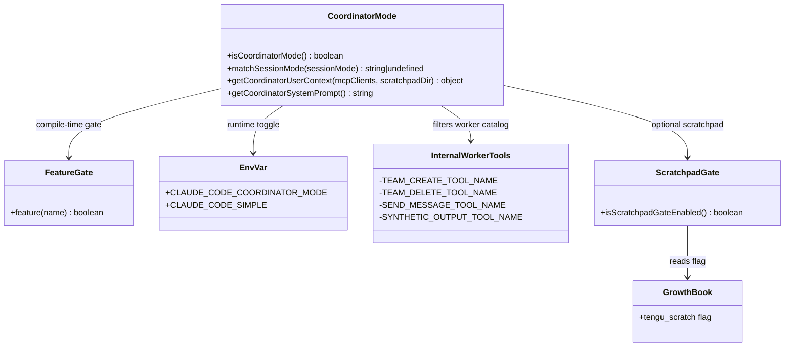
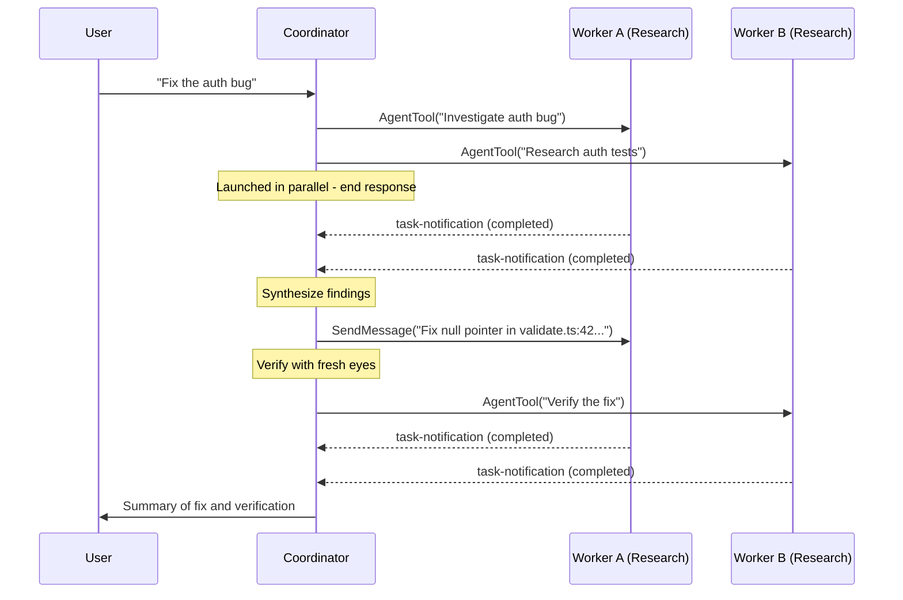
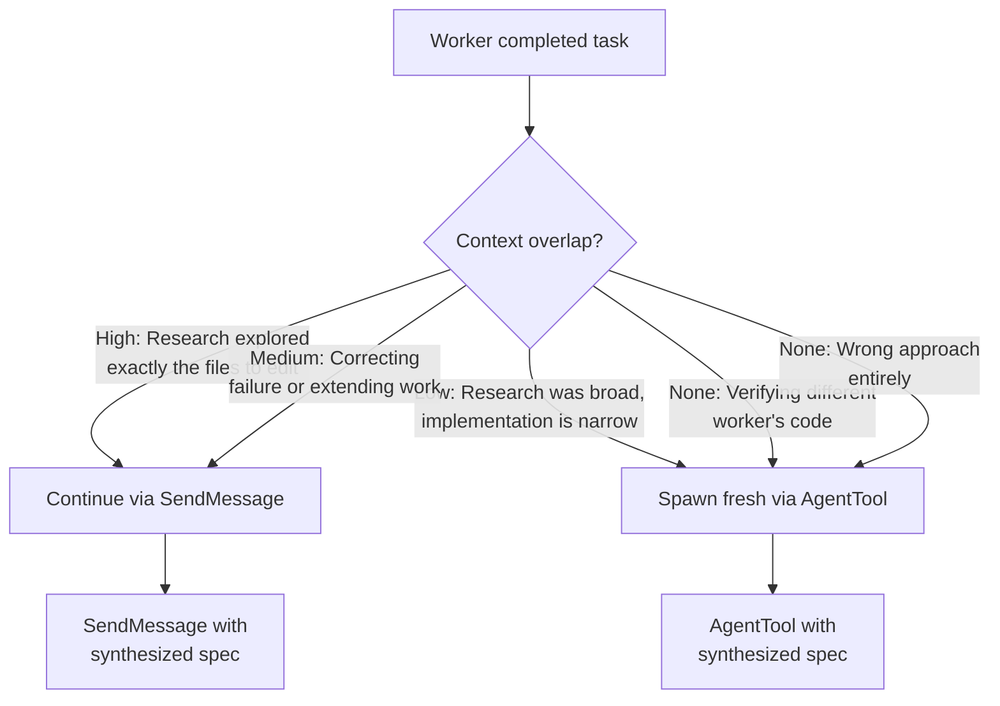
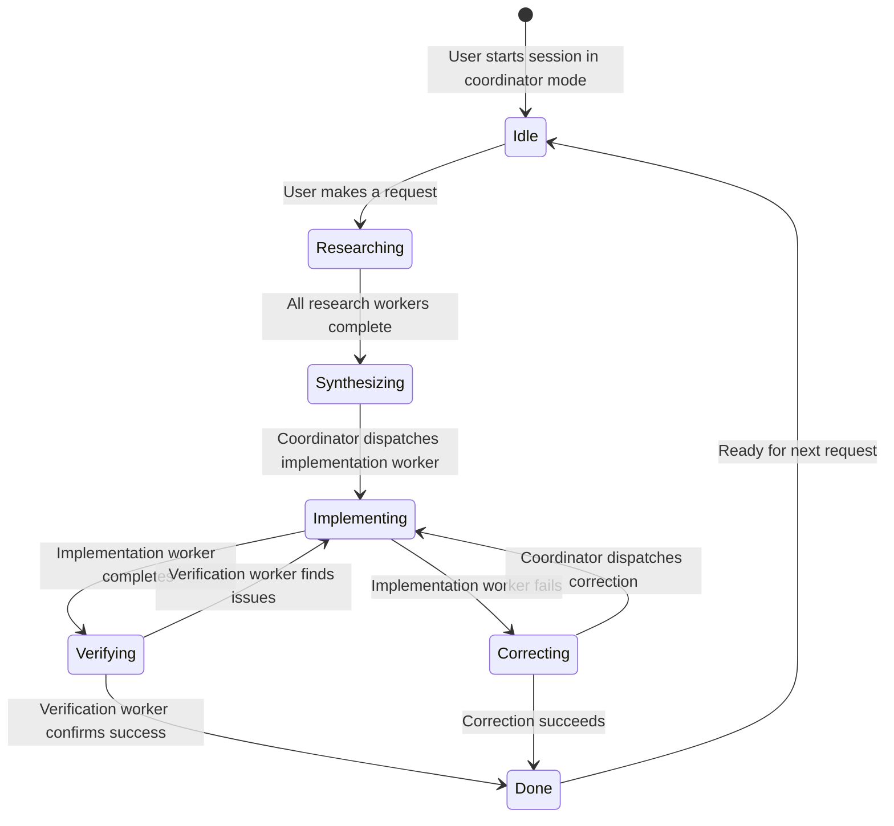

# Multi-Agent Coordinator: The Swarm Layer

## Overview

The coordinator is the brain of cc's multi-agent swarm mode. When `CLAUDE_CODE_COORDINATOR_MODE` is set, the parent agent stops doing implementation work itself and instead orchestrates a fleet of worker subagents. The entire coordinator lives in a single file -- `src/coordinator/coordinatorMode.ts` (369 LOC) -- yet it governs how teams of agents research, implement, and verify code changes in parallel. This chapter dissects the coordinator's feature gate, system prompt, tool routing, and the generator-evaluator pattern it implements.

The coordinator sits atop the AgentTool and SendMessageTool primitives explored in Chapters 18-20. It does not introduce new runtime machinery; instead, it reconfigures the existing agent dispatch system with a strict role separation: the coordinator plans and synthesizes, while workers execute. This architectural choice directly addresses HER's Ouroboros problem (the risk that an LLM evaluator hallucinates approval), because the coordinator delegates verification to a fresh-context worker rather than self-evaluating.

The coordinator mode is significant because it represents a fundamentally different execution model from the single-agent loop. In normal mode, the agent reads, plans, and acts within a single context window. In coordinator mode, the agent becomes an orchestrator that dispatches work to isolated context windows and synthesizes their results. This separation of concerns -- planning in one context, executing in another -- is the core insight behind HER's Pattern 7 (Context-Isolated Subagents) and Pattern 8 (Fork-Join Parallelism), both of which the coordinator implements simultaneously.

## Data structures and contracts

### Feature gate and mode detection

The coordinator is gated behind two conditions: a compile-time feature gate and a runtime environment variable. The `isCoordinatorMode()` function in `src/coordinator/coordinatorMode.ts:L36-L41` checks both:

```typescript
// src/coordinator/coordinatorMode.ts:L36-L41 — Two-layer feature gate for coordinator mode
export function isCoordinatorMode(): boolean {
  if (feature('COORDINATOR_MODE')) {
    return isEnvTruthy(process.env.CLAUDE_CODE_COORDINATOR_MODE)
  }
  return false
}
```

This two-layer gate means the coordinator code can ship in production builds without being active. The compile-time `feature('COORDINATOR_MODE')` call ensures the code is tree-shaken from builds where coordinator mode is not included, while the runtime environment variable allows operators to enable coordinator mode without rebuilding. This pattern -- compile-time feature gate plus runtime toggle -- is repeated throughout cc's feature-gated subsystems and provides a safe rollout mechanism for new orchestration modes.

The `matchSessionMode()` function at `src/coordinator/coordinatorMode.ts:L49-L78` handles session resume: if a stored session was in coordinator mode, the function flips the environment variable to match, preventing mode mismatches after `--resume`. When a session is resumed, the session's stored mode (`coordinator` or `normal`) is compared against the current environment. If they differ, the environment variable is updated to match the stored mode, and a `tengu_coordinator_mode_switched` analytics event is logged. The function returns a warning message if the mode was switched, which the resume flow injects into the conversation so the user is aware of the mode change.

### Internal worker tools set

The coordinator defines an `INTERNAL_WORKER_TOOLS` set at `src/coordinator/coordinatorMode.ts:L29-L34` that lists tools workers should not see in their tool-catalog summary:

```typescript
// src/coordinator/coordinatorMode.ts:L29-L34 — Tools hidden from worker tool-catalog display
const INTERNAL_WORKER_TOOLS = new Set([
  TEAM_CREATE_TOOL_NAME,
  TEAM_DELETE_TOOL_NAME,
  SEND_MESSAGE_TOOL_NAME,
  SYNTHETIC_OUTPUT_TOOL_NAME,
])
```

These tools are internal coordination primitives. Workers use them implicitly through the coordinator's orchestration, but listing them in the tool catalog would clutter the context injected into worker prompts. The `SEND_MESSAGE_TOOL_NAME` is particularly interesting: workers should not directly message other workers, because all inter-worker communication should flow through the coordinator. This architectural constraint prevents workers from forming ad-hoc communication channels that the coordinator cannot observe or mediate.

### User context and system prompt injection

Two functions inject coordinator-specific context into the agent's prompt assembly. `getCoordinatorUserContext()` at `src/coordinator/coordinatorMode.ts:L80-L109` builds a key-value map that gets merged into the user-facing context. It lists the available worker tools, MCP servers, and optionally a scratchpad directory for cross-worker knowledge sharing:

```typescript
// src/coordinator/coordinatorMode.ts:L80-L109 — Coordinator context injected into user-facing prompt
export function getCoordinatorUserContext(
  mcpClients: ReadonlyArray<{ name: string }>,
  scratchpadDir?: string,
): { [k: string]: string } {
  if (!isCoordinatorMode()) {
    return {}
  }
  const workerTools = isEnvTruthy(process.env.CLAUDE_CODE_SIMPLE)
    ? [BASH_TOOL_NAME, FILE_READ_TOOL_NAME, FILE_EDIT_TOOL_NAME]
        .sort()
        .join(', ')
    : Array.from(ASYNC_AGENT_ALLOWED_TOOLS)
        .filter(name => !INTERNAL_WORKER_TOOLS.has(name))
        .sort()
        .join(', ')
  let content = `Workers spawned via the ${AGENT_TOOL_NAME} tool have access to these tools: ${workerTools}`
  if (mcpClients.length > 0) {
    const serverNames = mcpClients.map(c => c.name).join(', ')
    content += `\n\nWorkers also have access to MCP tools from connected MCP servers: ${serverNames}`
  }
  if (scratchpadDir && isScratchpadGateEnabled()) {
    content += `\n\nScratchpad directory: ${scratchpadDir}\nWorkers can read and write here without permission prompts. Use this for durable cross-worker knowledge — structure files however fits the work.`
  }
  return { workerToolsContext: content }
}
```

The `CLAUDE_CODE_SIMPLE` environment variable reduces workers to a minimal toolset (Bash, Read, Edit), which constrains their capability surface for security-sensitive deployments. When `SIMPLE` mode is active, workers cannot use GrepTool, GlobTool, LSPTool, or any other tool beyond the three basics. This restriction reduces the attack surface if a worker goes off-track, because the worker's ability to explore and modify the codebase is limited.

The scratchpad directory is the coordinator's implementation of HER's file-based communication recommendation (Section 9.3). Workers can read and write to a shared directory without permission prompts, creating a durable knowledge store that persists across worker lifetimes. The scratchpad is feature-gated behind `isScratchpadGateEnabled()`, which checks the GrowthBook `tengu_scratch` flag.

### Coordinator structural model

The coordinator's architecture can be expressed as a small set of interacting structures. The `classDiagram` below captures the key types and their relationships:



The diagram makes the dependency structure explicit: the coordinator depends on the compile-time feature gate for existence, the environment variable for activation, the internal tools set for context filtering, and the scratchpad gate (itself backed by GrowthBook) for cross-worker knowledge sharing. The scratchpad gate is duplicated from `utils/permissions/filesystem.ts` to avoid a circular dependency, as discussed in the Edge Cases section below.

### Coordinator system prompt structure

The `getCoordinatorSystemPrompt()` function at `src/coordinator/coordinatorMode.ts:L111-L369` returns a comprehensive system prompt organized into six sections. The prompt begins by establishing the coordinator's identity and role constraints:

1. **Your Role** -- The coordinator is explicitly told it is an orchestrator, not an implementer. It should answer questions directly when possible but delegate all coding work to workers. Every message it sends is to the user, not to workers. Worker results are internal signals, not conversation partners.

2. **Your Tools** -- The coordinator has access to AgentTool (spawn workers), SendMessage (continue workers), TaskStopTool (stop workers), and optionally PR subscription tools. The prompt explicitly warns against using one worker to check on another, because this wastes parallel capacity.

3. **Workers** -- Workers are defined as autonomous agents with `subagent_type: worker`. The prompt distinguishes between two capability levels: full mode (standard tools, MCP tools, skills) and simple mode (Bash, Read, Edit only).

4. **Task Workflow** -- The four-phase workflow (Research, Synthesis, Implementation, Verification) with concurrency rules.

5. **Writing Worker Prompts** -- The most important section, covering synthesis rules, purpose statements, and the continue-vs-spawn decision.

6. **Example Session** -- A complete walkthrough showing how a coordinator should handle a user request from investigation through implementation to verification.

## Control flow

### Four-phase workflow

The system prompt defines a four-phase workflow for most tasks:

| Phase | Who | Purpose |
|-------|-----|---------|
| Research | Workers (parallel) | Investigate codebase, find files, understand problem |
| Synthesis | Coordinator | Read findings, understand the problem, craft implementation specs |
| Implementation | Workers | Make targeted changes per spec |
| Verification | Workers (fresh context) | Test changes work independently |

This maps directly to HER's generator-evaluator pattern (Section 9.2). The coordinator is the generator, workers are the evaluators, and verification workers always spawn fresh -- never carrying implementation context that would bias evaluation. The system prompt includes a stern warning about what real verification looks like at `src/coordinator/coordinatorMode.ts:L221-L228`: "Verification means proving the code works, not confirming it exists. A verifier that rubber-stamps weak work undermines everything." The prompt instructs verifiers to run tests with the feature enabled, investigate typecheck errors rather than dismissing them, and test independently rather than rubber-stamping.

### Coordinator message routing



The sequence diagram shows the core pattern: the coordinator launches research workers in parallel, waits for their notifications, synthesizes the findings into a specific implementation spec, then dispatches implementation and verification workers. Critically, the verification worker is spawned fresh (via AgentTool, not SendMessage), ensuring it has no prior context about the implementation that might bias its evaluation.

### Continue vs spawn decision

The coordinator's system prompt includes a detailed decision table for when to continue an existing worker versus spawning a new one:



The key insight is that continuation is not the default. The coordinator must explicitly evaluate context overlap. A fresh context is preferred when the worker's existing context would pollute the new task (verification), anchor on a failed approach (correction), or add irrelevant noise (narrow implementation after broad research). The system prompt at `src/coordinator/coordinatorMode.ts:L283-L293` provides a complete decision table:

| Situation | Mechanism | Why |
|-----------|-----------|-----|
| Research explored exactly the files that need editing | Continue (SendMessage) | Worker has files in context AND now gets a clear plan |
| Research was broad but implementation is narrow | Spawn fresh (AgentTool) | Avoid exploration noise; focused context is cleaner |
| Correcting a failure or extending recent work | Continue | Worker has the error context and knows what it tried |
| Verifying code a different worker wrote | Spawn fresh | Verifier should see code with fresh eyes |
| First attempt used the wrong approach | Spawn fresh | Wrong-approach context pollutes the retry |
| Completely unrelated task | Spawn fresh | No useful context to reuse |

### Prompt synthesis rules

The coordinator system prompt enforces strict rules about how to write worker prompts. The most important rule is that the coordinator must synthesize findings before delegating -- never pass through vague references. The prompt at `src/coordinator/coordinatorMode.ts:L253-L258` states: "Never write 'based on your findings' or 'based on the research.' These phrases delegate understanding to the worker instead of doing it yourself. You never hand off understanding to another worker."

The system prompt illustrates anti-patterns versus good examples at `src/coordinator/coordinatorMode.ts:L261-L268`. The prompt uses the `${AGENT_TOOL_NAME}` template variable (which resolves to `"Agent"` at runtime) in these examples:

```typescript
// src/coordinator/coordinatorMode.ts:L261-L268 — Anti-patterns vs good examples for worker prompts
// Anti-pattern — lazy delegation (bad whether continuing or spawning)
// ${AGENT_TOOL_NAME}({ prompt: "Based on your findings, fix the auth bug", ... })
// ${AGENT_TOOL_NAME}({ prompt: "The worker found an issue in the auth module. Please fix it.", ... })

// Good — synthesized spec (works with either continue or spawn)
// ${AGENT_TOOL_NAME}({ prompt: "Fix the null pointer in src/auth/validate.ts:42. The user field on
//   Session (src/auth/types.ts:15) is undefined when sessions expire but the token remains
//   cached. Add a null check before user.id access — if null, return 401 with 'Session expired'.
//   Commit and report the hash.", ... })
```

This rule prevents the Ouroboros problem: if the coordinator delegates understanding rather than doing it, errors amplify through the feedback loop instead of being corrected. The synthesized spec includes file paths, line numbers, type references, and a clear definition of "done." The coordinator must prove it understood the findings by including specific details that could only come from reading the research results.

### Task notification format

Workers report completion via `<task-notification>` XML blocks that arrive as user-role messages. The coordinator must distinguish these from actual user messages by checking for the `<task-notification>` opening tag. The system prompt at `src/coordinator/coordinatorMode.ts:L146-L164` defines the notification format as a template literal within the prompt string:

```typescript
// src/coordinator/coordinatorMode.ts:L146-L164 — XML notification format from worker to coordinator
// The system prompt uses a fenced xml block inside a template literal:
// <task-notification>
// <task-id>{agentId}</task-id>
// <status>completed|failed|killed</status>
// <summary>{human-readable status summary}</summary>
// <result>{agent's final text response}</result>
// <usage>
//   <total_tokens>N</total_tokens>
//   <tool_uses>N</tool_uses>
//   <duration_ms>N</duration_ms>
// </usage>
// </task-notification>
```

The `<result>` and `<usage>` sections are optional. The coordinator uses `<task-id>` as the address for `SendMessage` continuations. This XML-based notification format is a deliberate design choice: it allows the coordinator to parse notifications programmatically (by matching opening tags) while keeping the format human-readable for debugging.

### Stopping workers

The system prompt at `src/coordinator/coordinatorMode.ts:L237-L249` describes the `TaskStopTool` as a mechanism for stopping workers that are heading in the wrong direction. The prompt gives a concrete example: if the user clarifies mid-flight that they want a different approach, the coordinator should stop the current worker, then continue it with corrected instructions via `SendMessage`. This stop-and-correct pattern prevents wasted computation and ensures the user's intent is reflected promptly.

### Worker prompt tips

The system prompt provides specific guidance for different types of worker prompts at `src/coordinator/coordinatorMode.ts:L311-L335`:

For implementation: "Run relevant tests and typecheck, then commit your changes and report the hash" -- workers self-verify before reporting done. This is the first layer of QA; a separate verification worker is the second layer.

For research: "Report findings -- do not modify files" -- this constraint prevents research workers from accidentally making changes during investigation.

For verification: "Try edge cases and error paths -- don't just re-run what the implementation worker ran" and "Investigate failures -- don't dismiss as unrelated without evidence." These instructions push verifiers toward adversarial testing rather than confirmation bias.

### Coordinator system prompt detailed walkthrough

The `getCoordinatorSystemPrompt()` function generates a prompt that is approximately 250 lines of instructional text. This prompt is the single most important artifact in the coordinator system because it defines the behavioral contract that the LLM must follow. Understanding its structure reveals how cc uses prompt engineering to enforce architectural constraints that would otherwise require code-level enforcement.

The prompt opens with a role definition at `src/coordinator/coordinatorMode.ts:L116-L126`: "You are a coordinator. Your job is to: Help the user achieve their goal; Direct workers to research, implement and verify code changes; Synthesize results and communicate with the user; Answer questions directly when possible -- don't delegate work that you can handle without tools." This last point is critical: the coordinator should not over-delegate. Simple questions that the coordinator can answer from its own knowledge should be answered directly, saving the latency and cost of spawning a worker.

The prompt then establishes communication boundaries at `src/coordinator/coordinatorMode.ts:L126-L127`: "Every message you send is to the user. Worker results and system notifications are internal signals, not conversation partners -- never thank or acknowledge them. Summarize new information for the user as it arrives." This rule prevents a common failure mode where the LLM treats worker notifications as conversational turns, leading to awkward exchanges where the coordinator thanks a worker or asks it questions through the user-facing channel.

The concurrency guidance at `src/coordinator/coordinatorMode.ts:L213-L218` is particularly detailed: "Parallelism is your superpower. Workers are async. Launch independent workers concurrently whenever possible -- don't serialize work that can run simultaneously and look for opportunities to fan out." This instruction explicitly tells the LLM to use parallel tool calls, which is a non-obvious capability that many LLMs do not exercise by default. Without this instruction, the coordinator would tend to launch workers sequentially, negating the primary benefit of the multi-agent architecture.

### The team lifecycle



The team lifecycle shows the primary state machine for a coordinator session. The most common loop is Researching -> Synthesizing -> Implementing -> Verifying -> Done, but failures at any stage can cause the flow to loop back. The Correcting state is entered when an implementation worker reports failure, and the coordinator continues the same worker with corrective instructions. The Verifying -> Implementing transition occurs when the verification worker finds issues, requiring a fresh implementation attempt.

## Edge cases and failure modes

### Scratchpad circular dependency

The `isScratchpadGateEnabled()` function at `src/coordinator/coordinatorMode.ts:L25-L27` is deliberately duplicated from `utils/permissions/filesystem.ts` to avoid a circular dependency. Importing `filesystem.ts` would pull in `permissions.ts`, which transitively imports `coordinatorMode.ts`. The comment at `src/coordinator/coordinatorMode.ts:L19-L24` explains the reasoning:

```typescript
// src/coordinator/coordinatorMode.ts:L19-L24 — Circular dependency avoidance via duplication
// Checks the same gate as isScratchpadEnabled() in
// utils/permissions/filesystem.ts. Duplicated here because importing
// filesystem.ts creates a circular dependency (filesystem -> permissions
// -> ... -> coordinatorMode). The actual scratchpad path is passed in via
// getCoordinatorUserContext's scratchpadDir parameter (dependency injection
// from QueryEngine.ts, which lives higher in the dep graph).
```

The actual scratchpad path is injected from `QueryEngine.ts` rather than read directly, breaking the dependency cycle. This pattern -- duplicating a small function to break a circular dependency and injecting the needed value from a higher-level module -- is a pragmatic solution that avoids the complexity of dependency injection frameworks or module restructuring.

### Session mode mismatch on resume

When a session is resumed with `--resume`, the stored session mode may differ from the current environment variable. The `matchSessionMode()` function at `src/coordinator/coordinatorMode.ts:L49-L78` handles this by flipping the environment variable. If the session was in coordinator mode but the current process is not, the function sets `CLAUDE_CODE_COORDINATOR_MODE=1`. The function logs a `tengu_coordinator_mode_switched` analytics event so the team can track how often mode mismatches occur in production. The function returns a warning message that gets injected into the resumed conversation, informing the user that the mode was switched.

### Worker failure handling

The coordinator's system prompt specifies that when a worker reports failure, the coordinator should continue the same worker with `SendMessage` (it has the full error context). If a correction attempt fails, the coordinator should try a different approach or report to the user. It should never silently retry the same approach through a fresh worker, because that loses the error context that could inform a different strategy. The prompt at `src/coordinator/coordinatorMode.ts:L229-L233` explicitly states: "When a worker reports failure... Continue the same worker with SendMessage -- it has the full error context. If a correction attempt fails, try a different approach or report to the user."

### Concurrent write conflicts

The system prompt warns that write-heavy tasks should run one at a time per set of files. Read-only tasks (research) can run in parallel freely, but parallel workers writing to the same files will conflict. The coordinator must serialize implementation work by file area, only overlapping when workers operate on disjoint file sets. This constraint is a fundamental limitation of the shared-filesystem model: without a transactional file system or merge protocol, concurrent writes will overwrite each other.

### Coordinator must not fabricate results

The system prompt at `src/coordinator/coordinatorMode.ts:L139-L141` includes a critical rule: "After launching agents, briefly tell the user what you launched and end your response. Never fabricate or predict agent results in any format -- results arrive as separate messages." This rule prevents the common failure mode where an LLM predicts what a worker will find before the worker has actually run, creating false expectations that are hard to correct when the real results arrive.

## Where cc diverges from the published pattern

### Generator-evaluator without Ouroboros mitigation

HER Section 9.2 describes the Ouroboros Problem: when both generator and evaluator are LLMs, who validates the validator? The coordinator addresses this by requiring verification workers to have fresh context (no knowledge of the generation process). However, cc does not implement HER's recommended deterministic sensors as a primary quality gate. The coordinator relies on workers running tests and typechecks, but there is no hardcoded requirement that verification must include deterministic checks before the coordinator reports success. A verification worker that only inspects code without running tests would pass the coordinator's protocol.

HER's mitigation is to "ground evaluator output in observable artifacts" -- the evaluator must cite specific test results, specific lines of code, or specific browser screenshots. The coordinator's system prompt encourages this ("Investigate failures -- don't dismiss as unrelated without evidence") but does not enforce it structurally. A verification worker that merely says "looks good" without running tests would not be caught by the coordinator.

### File-based communication partial adoption

HER Section 9.3 recommends file-based inter-agent communication with git providing an audit trail. The coordinator's scratchpad directory is a step in this direction -- workers can read and write to a shared directory without permission prompts. However, the primary communication path between coordinator and workers is the `SendMessage` tool, which routes through in-memory queues rather than persisted files. The scratchpad is optional and feature-gated, not the default communication mechanism. HER's security caution about file-based communication -- that persisted data can leak between sessions without cleanup protocols -- is partially addressed by the scratchpad's per-team isolation, but there is no explicit cleanup mechanism.

### No explicit session protocol

HER Section 10.3 prescribes an eight-phase session protocol (ORIENT, SETUP, VERIFY, SELECT, IMPLEMENT, TEST, UPDATE, EXIT). The coordinator's system prompt implicitly covers some of these phases (research maps to ORIENT, implementation maps to IMPLEMENT) but does not enforce the full protocol. A worker could skip the VERIFY phase (baseline testing before new work) without the coordinator detecting the omission. The lack of a mandatory VERIFY phase is a significant gap: without baseline testing, a worker might break existing functionality without realizing it, because it never confirmed that the tests were passing before starting work.

### No model routing for cost optimization

HER Section 9.1 and Section 13 describe model routing as a cost optimization: expensive models for planning, cheap models for execution. The coordinator's system prompt at `src/coordinator/coordinatorMode.ts:L138` explicitly says "Do not set the model parameter. Workers need the default model for the substantive tasks you delegate." This means all workers use the same model as the coordinator, regardless of task complexity. For a production system, this is a significant cost inefficiency: research and verification tasks could use cheaper models while implementation tasks benefit from more capable ones.

The rationale for this constraint is pragmatic: when the coordinator selects a model for a worker, it is making a judgment about the task's difficulty that may be wrong. A research task that the coordinator expects to be simple might uncover a complex architectural issue requiring a more capable model. By forcing all workers to use the default model, the system avoids the failure mode where a cheap model is assigned to a task that exceeds its capability, producing poor results that waste more tokens in retries than the initial savings.

However, this all-same-model approach has a significant cost implication. In a typical coordinator session, research workers may consume 50,000-100,000 tokens each exploring the codebase, while the coordinator itself uses far fewer tokens for synthesis. If research workers could use a cheaper model (e.g., Haiku instead of Sonnet), the cost savings would be substantial. The tradeoff is between cost efficiency and the risk of under-capable workers producing low-quality research that leads to incorrect implementation specs.

### No deterministic verification requirement

The coordinator's verification protocol relies on the LLM's willingness to run tests and investigate failures, but it does not require deterministic verification as a prerequisite for reporting success. A worker could report "verification passed" without running any tests, and the coordinator would accept this verdict at face value. HER Section 9.2 recommends using deterministic sensors (tests, linters, type checkers) as the primary quality gate, with LLM evaluators only for semantic judgments. cc's coordinator inverts this: LLM evaluation is the primary gate, and deterministic checks are recommended but not enforced.

This gap is particularly significant because of the Ouroboros problem. When both the implementation worker and the verification worker are LLMs, there is a risk that the verification worker will rubber-stamp the implementation without thorough testing. The coordinator's system prompt warns against this ("A verifier that rubber-stamps weak work undermines everything") but the warning is instructional, not structural. A production system should enforce that verification workers run at least one deterministic check (e.g., typecheck, lint, or test suite) before reporting success.

### No explicit token budget for workers

The coordinator's system prompt does not mention token budgets for workers. A research worker that goes down a rabbit hole can consume hundreds of thousands of tokens exploring irrelevant code before reporting back. The coordinator has no mechanism to set a per-worker token limit or to abort a worker that is consuming too many tokens without producing results. The `TaskStopTool` can be used to manually stop a worker, but the coordinator must notice the problem and decide to stop the worker, which requires monitoring worker progress.

### Missing coordination primitives

HER Section 9.1 describes three tiers of multi-agent orchestration: in-process subagents, local orchestrators, and cloud async. The coordinator implements the in-process tier well but does not provide coordination primitives for the other tiers. There is no built-in mechanism for a coordinator to dispatch work to a remote agent and receive results asynchronously, or for multiple coordinators to collaborate on a shared task list. The `RemoteTriggerTool` provides some remote dispatch capability, but it is not integrated with the coordinator's workflow system.

## Developer takeaways for building a long-running agent

1. **Separate planning from execution.** The coordinator pattern works because the coordinator does not execute -- it synthesizes. When the planner is also the implementer, context rot degrades both roles. A coordinator that only reads and delegates maintains a clean context for planning, ensuring that the orchestration layer does not suffer from the same context exhaustion that degrades long-running single agents.

2. **Always synthesize before delegating.** "Based on your findings" is an anti-pattern. The coordinator must understand the findings well enough to write a specific spec with file paths, line numbers, and expected outcomes. This understanding step is the quality gate that prevents the Ouroboros problem. Without synthesis, the coordinator is just a message router, and errors amplify through the feedback loop instead of being corrected.

3. **Fresh context for verification.** A verification worker must never carry implementation context. The coordinator should always spawn a fresh worker for verification, because shared context creates anchoring bias -- the verifier will be less likely to notice problems in code it "knows" the reasoning behind. HER's NLAH ablation data is cautionary: adding a verifier produced -0.8% on SWE-bench when the verifier's acceptance criteria diverged from the actual benchmark. More structure does not automatically improve performance.

4. **Gate coordinator mode at two levels.** The compile-time feature gate plus runtime environment variable pattern allows shipping coordinator code without activating it. This is useful for canary deployments and A/B testing of multi-agent orchestration. The `matchSessionMode()` function ensures that resumed sessions maintain their original mode, preventing confusing mode switches during long-running tasks.

5. **Break circular dependencies with dependency injection.** The scratchpad gate check duplication in `coordinatorMode.ts` shows a common pattern in large codebases: when a module cannot import another due to circular dependencies, extract the needed function and inject the result from a higher-level module. The scratchpad directory path is injected from `QueryEngine.ts`, which sits above both modules in the dependency graph.

6. **Structure worker prompts with purpose statements.** The coordinator system prompt requires including a brief purpose statement in every worker prompt so the worker can calibrate depth and emphasis. This small addition significantly improves output quality because the worker knows whether it is researching for a PR description or investigating for an implementation plan. Without a purpose statement, workers tend to produce either too much or too little detail for the task at hand.

7. **Never fabricate worker results.** The coordinator must end its response after launching workers and wait for their notifications. Predicting what a worker will find before it finishes creates false expectations that are hard to correct when the real results arrive. This rule is so important that it is stated explicitly in the system prompt: "Never fabricate or predict agent results in any format -- results arrive as separate messages."

8. **Use XML for machine-parseable notifications.** The `<task-notification>` format allows the coordinator to distinguish worker results from user messages by checking for the opening tag. This simple parsing heuristic -- look for a specific XML tag rather than trying to classify message content -- is reliable and cheap. For a system that processes hundreds of messages per session, this kind of structured format prevents classification errors that would cause the coordinator to misinterpret worker results as user input.

9. **Serialize write-heavy work, parallelize read-heavy work.** The concurrency rules are asymmetric: research workers can run in parallel freely because they only read files, but implementation workers must be serialized per file area because concurrent writes will conflict. This asymmetry is fundamental to any shared-filesystem multi-agent system and must be communicated clearly to the coordinating LLM through its system prompt. Without this guidance, the coordinator would tend to launch implementation workers in parallel, causing file conflicts that waste tokens and require manual resolution.

10. **Treat the system prompt as the primary enforcement mechanism.** The coordinator's behavioral constraints -- synthesize before delegating, use fresh context for verification, never fabricate results -- are all enforced through the system prompt, not through code-level guards. This means the constraints can be violated by a sufficiently confused or misaligned LLM. For critical production systems, consider adding code-level enforcement for the most important constraints (e.g., a code-level check that verification workers are spawned fresh rather than continued).
