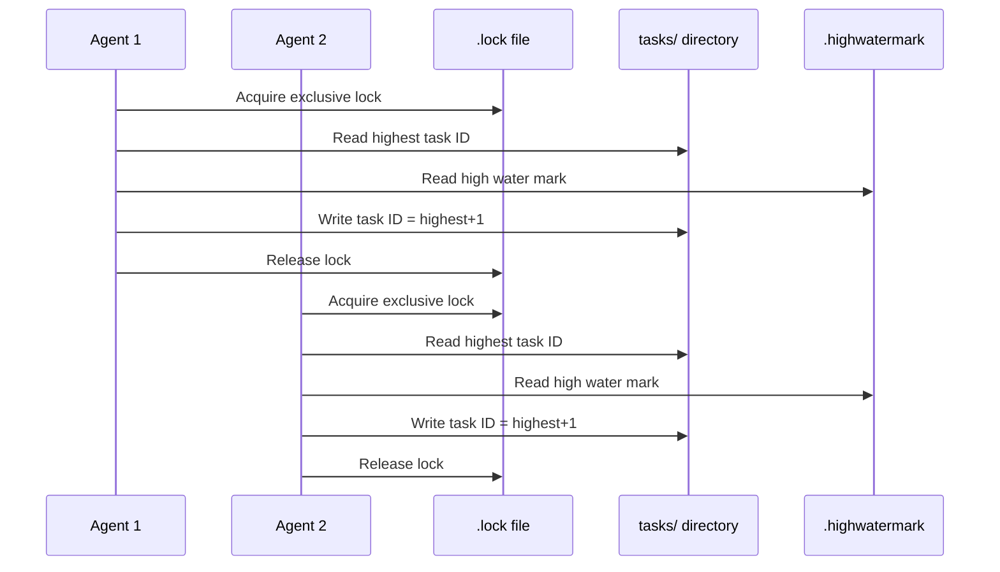
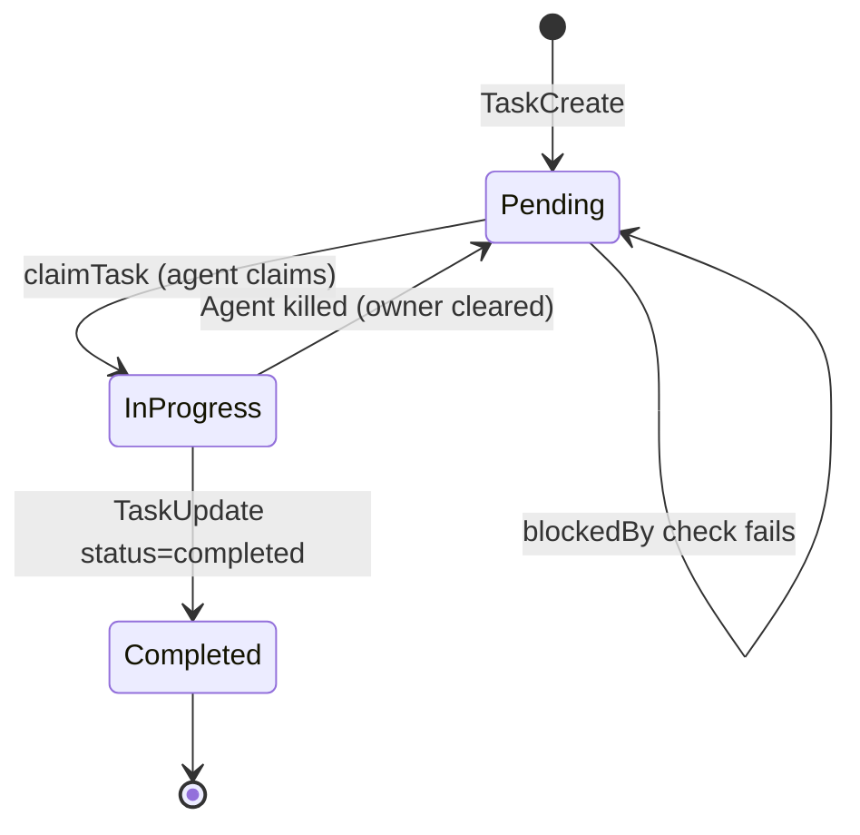
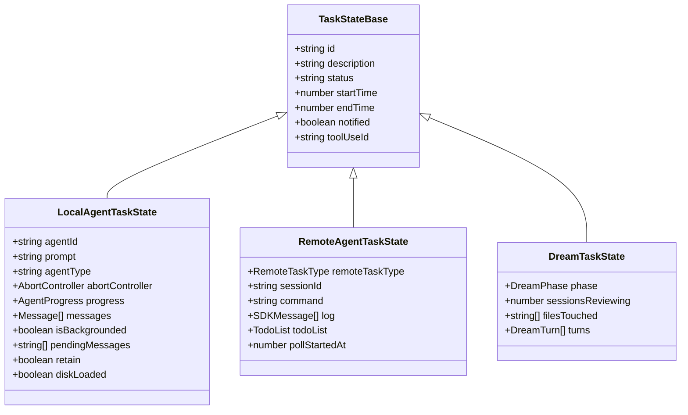

# Tasks: A Durable Unit of Work

## Overview

Tasks are cc's mechanism for tracking units of work across agent sessions. They persist to disk as JSON files, support filesystem locking for concurrent access, and provide the coordination layer that enables multi-agent swarms to divide work without stepping on each other. The task system spans two layers: the low-level persistence and locking primitives in `src/utils/tasks.ts` (862 LOC), and the seven task-type implementations that register themselves in the in-memory `AppState` task registry.

This chapter examines the task contract, the filesystem-based persistence model, the locking and high-water-mark mechanisms, the tool surface (TaskCreate, TaskUpdate, TaskList, TaskGet, TaskStop, TaskOutput), and the seven task types that bring this infrastructure to life.

The task system embodies HER's three-file state pattern (Section 8.2) in a particularly interesting way. Where HER prescribes `tasks.json`, `progress.txt`, and `AGENTS.md`, cc implements only the structured task list component. The human-readable progress notes and discovered-patterns files are handled by other subsystems (session persistence and CLAUDE.md respectively). This separation reflects a deliberate design choice: the task system focuses exclusively on work tracking, while other subsystems handle knowledge persistence.

## Data structures and contracts

### Task schema

The core `Task` type is defined in `src/utils/tasks.ts:L76-L89` using Zod for runtime validation:

```typescript
// src/utils/tasks.ts:L76-L89 — Core task schema with Zod validation
export const TaskSchema = lazySchema(() =>
  z.object({
    id: z.string(),
    subject: z.string(),
    description: z.string(),
    activeForm: z.string().optional(), // present continuous form for spinner (e.g., "Running tests")
    owner: z.string().optional(), // agent ID
    status: TaskStatusSchema(),
    blocks: z.array(z.string()), // task IDs this task blocks
    blockedBy: z.array(z.string()), // task IDs that block this task
    metadata: z.record(z.string(), z.unknown()).optional(), // arbitrary metadata
  }),
)
export type Task = z.infer<ReturnType<typeof TaskSchema>>
```

The `lazySchema()` wrapper defers schema construction until first use, preventing circular dependency issues during module initialization. Each field serves a specific purpose in the multi-agent coordination model:

- **id**: Monotonically increasing integer, assigned atomically during creation under a file lock.
- **subject**: Brief imperative-form title (e.g., "Fix authentication bug in login flow").
- **description**: Detailed explanation of what needs to be done, including enough context for another agent to pick up the task.
- **activeForm**: Present continuous form for UI spinners (e.g., "Fixing authentication bug").
- **owner**: Agent ID of the agent currently working on the task. Unset when the task is unassigned.
- **status**: One of three states: `pending`, `in_progress`, or `completed`.
- **blocks**: Array of task IDs that this task blocks from starting.
- **blockedBy**: Array of task IDs that must complete before this task can start.
- **metadata**: Arbitrary key-value store for task-specific data (e.g., PR numbers, commit hashes).

The three allowed statuses are defined at `src/utils/tasks.ts:L69-L74`:

```typescript
// src/utils/tasks.ts:L69-L74 — Tri-state status model
export const TASK_STATUSES = ['pending', 'in_progress', 'completed'] as const
export const TaskStatusSchema = lazySchema(() =>
  z.enum(['pending', 'in_progress', 'completed']),
)
export type TaskStatus = z.infer<ReturnType<typeof TaskStatusSchema>>
```

This tri-state model matches HER's recommendation that task status should be boolean pass/fail to prevent ambiguous partial states (Section 8.2). The `in_progress` state serves as the "claimed but not yet resolved" indicator. Notably, there is no `failed` status -- if a task fails, it remains `in_progress` and the owner can retry. This design avoids the ambiguity of whether a `failed` task should be retried or abandoned.

### Task list identity

The `getTaskListId()` function at `src/utils/tasks.ts:L199-L210` determines which task list an agent operates on, using a priority chain:

```typescript
// src/utils/tasks.ts:L199-L210 — Priority chain for task list identity
export function getTaskListId(): string {
  if (process.env.CLAUDE_CODE_TASK_LIST_ID) {
    return process.env.CLAUDE_CODE_TASK_LIST_ID
  }
  // In-process teammates use the leader's team name so they share the same
  // task list that tmux/iTerm2 teammates also resolve to.
  const teammateCtx = getTeammateContext()
  if (teammateCtx) {
    return teammateCtx.teamName
  }
  return getTeamName() || leaderTeamName || getSessionId()
}
```

This priority chain ensures that in-process teammates share the leader's task list, while standalone sessions fall back to their own session ID. The `leaderTeamName` variable at `src/utils/tasks.ts:L24-L26` is set by `TeamCreateTool` when a team is created. When the leader's team name changes, `notifyTasksUpdated()` fires so that UI subscribers refresh their views.

The `DEFAULT_TASKS_MODE_TASK_LIST_ID` constant at `src/utils/tasks.ts:L862` provides a fallback task list ID (`tasklist`) for sessions that use the Tasks feature without being part of a team. This ensures that even standalone sessions have a consistent task list namespace.

### Storage layout

Tasks are stored as individual JSON files under `~/.claude/tasks/<taskListId>/`. Each file is named `<taskId>.json`, where the task ID is a monotonically increasing integer. The `getTasksDir()` and `getTaskPath()` functions at `src/utils/tasks.ts:L221-L231` compute these paths:

```typescript
// src/utils/tasks.ts:L221-L231 — Filesystem paths for task persistence
export function getTasksDir(taskListId: string): string {
  return join(
    getClaudeConfigHomeDir(),
    'tasks',
    sanitizePathComponent(taskListId),
  )
}
export function getTaskPath(taskListId: string, taskId: string): string {
  return join(getTasksDir(taskListId), `${sanitizePathComponent(taskId)}.json`)
}
```

The `sanitizePathComponent()` function at `src/utils/tasks.ts:L217-L219` strips path traversal characters, allowing only alphanumeric characters, hyphens, and underscores. This prevents directory traversal attacks where a malicious task list ID could escape the tasks directory.

### ClaimTaskResult type

The `claimTask()` function returns a structured result at `src/utils/tasks.ts:L488-L499`:

```typescript
// src/utils/tasks.ts:L488-L499 — Structured result for task claiming
export type ClaimTaskResult = {
  success: boolean
  reason?:
    | 'task_not_found'
    | 'already_claimed'
    | 'already_resolved'
    | 'blocked'
    | 'agent_busy'
  task?: Task
  busyWithTasks?: string[] // task IDs the agent is busy with (when reason is 'agent_busy')
  blockedByTasks?: string[] // task IDs blocking this task (when reason is 'blocked')
}
```

The `agent_busy` reason is returned when the claiming agent already owns other unresolved tasks, enforcing HER's one-task-per-session rule (Section 10.1). The `blockedByTasks` array lists the specific task IDs that prevent claiming, enabling the agent to report this to the user or the coordinator.

### Signal-based update notifications

The `tasksUpdated` signal at `src/utils/tasks.ts:L18` provides an in-process notification mechanism for task list changes. The `createSignal()` utility creates a lightweight pub/sub system that listeners can subscribe to via `onTasksUpdated`:

```typescript
// src/utils/tasks.ts:L18 — Signal for task list update notifications
const tasksUpdated = createSignal()
export const onTasksUpdated = tasksUpdated.subscribe
```

The `notifyTasksUpdated()` function at `src/utils/tasks.ts:L61-L67` wraps the signal emit in a try/catch so that listener failures never propagate to callers:

```typescript
// src/utils/tasks.ts:L61-L67 — Safe notification emission
export function notifyTasksUpdated(): void {
  try {
    tasksUpdated.emit()
  } catch {
    // Ignore listener errors — task mutations must not fail due to notification issues
  }
}
```

This pattern ensures that task mutations (create, update, delete) are never blocked by notification failures. If a UI component throws during a notification, the task mutation has already succeeded and the error is silently ignored.

## Control flow

### Task creation with locking

The `createTask()` function at `src/utils/tasks.ts:L284-L308` uses file locking to prevent race conditions when multiple processes create tasks concurrently:

```typescript
// src/utils/tasks.ts:L284-L308 — Atomic task creation with file locking
export async function createTask(
  taskListId: string,
  taskData: Omit<Task, 'id'>,
): Promise<string> {
  const lockPath = await ensureTaskListLockFile(taskListId)

  let release: (() => Promise<void>) | undefined
  try {
    // Acquire exclusive lock on the task list
    release = await lockfile.lock(lockPath, LOCK_OPTIONS)

    // Read highest ID from disk while holding the lock
    const highestId = await findHighestTaskId(taskListId)
    const id = String(highestId + 1)
    const task: Task = { id, ...taskData }
    const path = getTaskPath(taskListId, id)
    await writeFile(path, jsonStringify(task, null, 2))
    notifyTasksUpdated()
    return id
  } finally {
    if (release) {
      await release()
    }
  }
}
```

The critical section reads the highest task ID from disk while holding the lock, increments it, writes the new task file, and releases the lock. The `finally` block ensures the lock is always released, even if an exception occurs during file writing.

The lock options at `src/utils/tasks.ts:L98-L108` are configured for high concurrency:

```typescript
// src/utils/tasks.ts:L98-L108 — Retry configuration for file locks
const LOCK_OPTIONS = {
  retries: {
    retries: 30,
    minTimeout: 5,
    maxTimeout: 100,
  },
}
```

These settings budget for approximately 10 concurrent swarm agents: each critical section takes 50-100ms, so the last caller in a 10-way race needs about 900ms, and 30 retries gives approximately 2.6 seconds of total wait time. The exponential backoff (5ms to 100ms) prevents lock contention from becoming a thundering herd.



### High water mark for ID stability

The high-water-mark mechanism at `src/utils/tasks.ts:L91-L131` prevents task ID reuse after deletion or reset. The `.highwatermark` file stores the maximum task ID ever assigned:

```typescript
// src/utils/tasks.ts:L110-L131 — High water mark read and write
function getHighWaterMarkPath(taskListId: string): string {
  return join(getTasksDir(taskListId), HIGH_WATER_MARK_FILE)
}
async function readHighWaterMark(taskListId: string): Promise<number> {
  const path = getHighWaterMarkPath(taskListId)
  try {
    const content = (await readFile(path, 'utf-8')).trim()
    const value = parseInt(content, 10)
    return isNaN(value) ? 0 : value
  } catch {
    return 0
  }
}
```

The `findHighestTaskId()` function at `src/utils/tasks.ts:L271-L277` takes the maximum of both on-disk task files and the high-water mark. This dual-source approach handles the case where all task files have been deleted (e.g., after a `resetTaskList()` call) but the high-water mark preserves the highest ID ever assigned. Without the high-water mark, a reset task list would start reusing IDs from 1, potentially creating confusion if old task references (in blockedBy arrays or coordinator messages) now point to different tasks.

### Claim with busy check

The `claimTaskWithBusyCheck()` function at `src/utils/tasks.ts:L618-L692` performs an atomic claim that also verifies the agent is not already busy with other tasks. It uses a task-list-level lock (not a per-task lock) to prevent TOCTOU race conditions. The lock serializes both the busy check and the claim within a single critical section:



The claim function first checks if the task exists, then if it is already claimed by another agent, then if it is already resolved, then if it has unresolved blockers. Only after all checks pass does it set the `owner` field. The busy-check variant adds one more check: it scans all tasks in the list to see if the claiming agent already owns other unresolved tasks. This check is performed atomically with the claim by holding the task-list-level lock throughout.

### Task status transitions

Tasks follow a strict lifecycle: they start as `pending`, transition to `in_progress` when claimed, and reach `completed` when done. The `deleteTask()` function at `src/utils/tasks.ts:L393-L441` handles cleanup by removing the file and updating the high water mark, then sweeping all other tasks to remove references to the deleted task from their `blocks` and `blockedBy` arrays.

The `resetTaskList()` function at `src/utils/tasks.ts:L147-L188` is called when a new swarm is created. It deletes all task files and writes a high-water mark file with the current highest ID. This ensures that task numbering starts at 1 for the new swarm while preserving the ID stability guarantee for any references to the old task list.

### The seven task types

The task registry in `AppState` supports seven distinct task types, each with its own state shape and lifecycle:

1. **local_agent** -- In-process subagent tasks (`LocalAgentTaskState` in `src/tasks/LocalAgentTask/LocalAgentTask.tsx`). These are the most common task type, representing workers spawned by the coordinator. They track the agent's progress through `AgentProgress` objects, queue pending messages from `SendMessage`, and support backgrounding/foregrounding.

2. **remote_agent** -- Cloud-based remote agent tasks (`RemoteAgentTaskState` in `src/tasks/RemoteAgentTask/RemoteAgentTask.tsx`). These represent tasks running on cc's cloud infrastructure, polled for status updates. They include remote-task-type-specific completion checkers.

3. **dream** -- Background memory consolidation (`DreamTaskState` in `src/tasks/DreamTask/DreamTask.ts`). These track the dream agent's progress, including which files were touched and which sessions are being reviewed.

4. **local_bash** -- Background shell command execution. These track running Bash commands that have been backgrounded.

5. **local_shell** -- Shell task variant with additional state for managing shell processes.

6. **main_session** -- Backgrounded main session queries (`LocalMainSessionTaskState` in `src/tasks/LocalMainSessionTask.ts`). When a user presses Ctrl+B twice, the current query is backgrounded and a fresh prompt appears. The backgrounded query continues running as a main-session task.

7. **In-process teammate** -- Teammate running in the same process as the lead agent, sharing the same `AppState`.



### The in-memory task registry and its relationship to filesystem persistence

The seven task types above live in an in-memory registry stored in `AppState.tasks`, a `Record<string, TaskState>` map keyed by task ID. This in-memory registry is distinct from the filesystem-based persistence layer in `src/utils/tasks.ts`. The filesystem layer manages durable task records (the `Task` type with `id`, `subject`, `description`, `status`, `blocks`, `blockedBy`, `metadata`), while the in-memory registry manages live task state (the `TaskState` type with `status`, `startTime`, `endTime`, `notified`, `toolUseId`, plus type-specific fields like `AbortController` for agent tasks).

The two layers are synchronized but not identical. When `TaskCreateTool` creates a task, it writes a `Task` record to disk via `createTask()`, and the task also appears in `AppState.tasks` when the UI renders the task list. When `TaskUpdateTool` marks a task as completed, the filesystem record is updated via `updateTask()`, and the in-memory `TaskState` is updated via `updateTaskState()`. However, the in-memory registry contains ephemeral state (abort controllers, message queues, progress objects) that is never persisted to disk. If the process restarts, the filesystem records survive but the in-memory state is lost, which is why `TaskOutputTool` falls back to reading output from disk.

### The ensureTaskListLockFile pattern

The `ensureTaskListLockFile()` function at `src/utils/tasks.ts:L511-L523` creates a `.lock` file in the tasks directory for list-level locking. The function uses the `wx` (write-exclusive) flag to prevent two callers from both creating the file:

```typescript
// src/utils/tasks.ts:L511-L523 — Create lock file with exclusive-write flag
async function ensureTaskListLockFile(taskListId: string): Promise<string> {
  await ensureTasksDir(taskListId)
  const lockPath = getTaskListLockPath(taskListId)
  // proper-lockfile requires the target file to exist. Create it with the
  // 'wx' flag (write-exclusive) so concurrent callers don't both create it,
  // and the first one to create wins silently.
  try {
    await writeFile(lockPath, '', { flag: 'wx' })
  } catch {
    // EEXIST or other — file already exists, which is fine.
  }
  return lockPath
}
```

The `wx` flag causes `writeFile` to fail if the file already exists, which is exactly the desired behavior for a lock file. The first caller to create the lock file wins, and subsequent callers silently ignore the `EEXIST` error because the file's existence is sufficient for the `proper-lockfile` library to acquire a lock on it.

### Task creation and hook validation flow

When a task is created via `TaskCreateTool`, the flow proceeds through several stages:

1. The tool calls `createTask()` which acquires the task-list lock, assigns the next available ID, writes the JSON file, and releases the lock.
2. The tool calls `executeTaskCreatedHooks()` which runs any lifecycle hooks registered for the `TaskCreated` event.
3. If any hook returns a blocking error, the tool calls `deleteTask()` to remove the newly created task and throws an error.
4. If all hooks pass, the tool auto-expands the task list in the UI and returns the task ID.

This two-phase create-then-validate pattern is important because hooks are executed outside the task-list lock. If hooks were executed inside the lock, a slow hook would block all task operations for the entire list. The tradeoff is that a hook failure leaves a brief window where the task exists on disk but will be deleted. This window is acceptable because the task is in `pending` status and no agent has claimed it yet.

### TaskUpdateTool

The `TaskCreateTool` at `src/tools/TaskCreateTool/TaskCreateTool.ts:L48-L138` creates a new task and auto-expands the task list in the UI. Its tool name is defined at `src/tools/TaskCreateTool/constants.ts` as `TaskCreate`. The prompt at `src/tools/TaskCreateTool/prompt.ts` generates context-sensitive guidance: when `isAgentSwarmsEnabled()` is active, it adds tips about assigning tasks to teammates and including enough detail for another agent to understand the work. After creating the task, the tool runs `executeTaskCreatedHooks()` which allows lifecycle hooks to block the creation:

```typescript
// src/tools/TaskCreateTool/TaskCreateTool.ts:L80-L119 — Task creation with hook validation
async call({ subject, description, activeForm, metadata }, context) {
  const taskId = await createTask(getTaskListId(), {
    subject,
    description,
    activeForm,
    status: 'pending',
    owner: undefined,
    blocks: [],
    blockedBy: [],
    metadata,
  })

  const blockingErrors: string[] = []
  const generator = executeTaskCreatedHooks(
    taskId,
    subject,
    description,
    getAgentName(),
    getTeamName(),
    undefined,
    context?.abortController?.signal,
    undefined,
    context,
  )
  for await (const result of generator) {
    if (result.blockingError) {
      blockingErrors.push(getTaskCreatedHookMessage(result.blockingError))
    }
  }

  if (blockingErrors.length > 0) {
    await deleteTask(getTaskListId(), taskId)
    throw new Error(blockingErrors.join('\n'))
  }

  // Auto-expand task list when creating tasks
  context.setAppState(prev => {
    if (prev.expandedView === 'tasks') return prev
    return { ...prev, expandedView: 'tasks' as const }
  })

  return {
    data: {
      task: {
        id: taskId,
        subject,
      },
    },
  }
}
```

If any hook returns a blocking error, the newly created task is immediately deleted and an error is thrown. This two-phase create-then-validate pattern ensures that hooks can prevent tasks from being created without blocking the file lock.

### TaskUpdateTool and verification nudge

The `TaskUpdateTool` at `src/tools/TaskUpdateTool/TaskUpdateTool.ts:L88-L406` is the most complex task tool, supporting updates to any field on a task. Its tool name is defined at `src/tools/TaskUpdateTool/constants.ts` as `TaskUpdate`, and its prompt at `src/tools/TaskUpdateTool/prompt.ts` documents the status workflow (`pending` to `in_progress` to `completed`), the `deleted` action for permanent removal, and guidance on when to update versus when to leave a task as-is. The tool's input schema at `src/tools/TaskUpdateTool/TaskUpdateTool.ts:L33-L66` includes a special `deleted` status value in addition to the standard three statuses:

```typescript
// src/tools/TaskUpdateTool/TaskUpdateTool.ts:L33-L66 — Extended status schema for task updates
const TaskUpdateStatusSchema = TaskStatusSchema().or(z.literal('deleted'))

return z.strictObject({
  taskId: z.string().describe('The ID of the task to update'),
  subject: z.string().optional().describe('New subject for the task'),
  description: z.string().optional().describe('New description for the task'),
  activeForm: z
    .string()
    .optional()
    .describe(
      'Present continuous form shown in spinner when in_progress (e.g., "Running tests")',
    ),
  status: TaskUpdateStatusSchema.optional().describe(
    'New status for the task',
  ),
  addBlocks: z
    .array(z.string())
    .optional()
    .describe('Task IDs that this task blocks'),
  addBlockedBy: z
    .array(z.string())
    .optional()
    .describe('Task IDs that block this task'),
  owner: z.string().optional().describe('New owner for the task'),
  metadata: z
    .record(z.string(), z.unknown())
    .optional()
    .describe(
      'Metadata keys to merge into the task. Set a key to null to delete it.',
    ),
})
```

The `deleted` status is not a real task state -- it triggers the `deleteTask()` function and removes the task file from disk. This approach allows agents to delete tasks through the same tool they use for updates, rather than requiring a separate delete tool.

When a task is marked as `completed`, the `TaskUpdateTool` runs `executeTaskCompletedHooks()` at `src/tools/TaskUpdateTool/TaskUpdateTool.ts:L232-L265`. If any hook returns a blocking error, the status update is rejected and the task remains `in_progress`. This mechanism allows lifecycle hooks to enforce quality gates: for example, a hook could check that the task's associated tests are passing before allowing the task to be marked as completed.

The structural verification nudge at lines 333-349 checks whether the agent recently closed out a list of three or more tasks without including a verification step. If the nudge fires, the tool appends a reminder to spawn the verification agent with `subagent_type="verification"`. This nudge is gated behind the `VERIFICATION_AGENT` feature flag and the `tengu_hive_evidence` GrowthBook experiment, and only fires for the main-thread agent (not subagents).

The `TaskUpdateTool` at `src/tools/TaskUpdateTool/TaskUpdateTool.ts:L88-L406` supports updating any field on a task, including status transitions, ownership changes, and dependency management. It includes a structural verification nudge at lines 333-349: when the main-thread agent closes out a list of three or more tasks and none was a verification step, the tool appends a reminder to spawn a verification agent. This nudge addresses the common failure mode where agents skip verification after completing implementation tasks.

### Task ownership and teammate assignment

When `isAgentSwarmsEnabled()` is active, the `TaskUpdateTool` at `src/tools/TaskUpdateTool/TaskUpdateTool.ts:L188-L199` auto-sets the owner when a teammate marks a task as `in_progress` without explicitly providing an owner:

```typescript
// src/tools/TaskUpdateTool/TaskUpdateTool.ts:L188-L199 — Auto-assign owner on status transition
if (
  isAgentSwarmsEnabled() &&
  status === 'in_progress' &&
  owner === undefined &&
  !existingTask.owner
) {
  const agentName = getAgentName()
  if (agentName) {
    updates.owner = agentName
    updatedFields.push('owner')
  }
}
```

This implicit ownership assignment is a critical feature for multi-agent coordination. Without it, tasks claimed by teammates would have no owner, making it impossible for the coordinator to determine which tasks are being worked on and which are available for assignment.

When ownership changes, the tool sends a `task_assignment` notification via the teammate mailbox at `src/tools/TaskUpdateTool/TaskUpdateTool.ts:L277-L298`. The notification is a JSON message with type `task_assignment`, the task ID, subject, description, and the assigning agent's name. This notification ensures the teammate learns about new work without polling the task list, reducing latency in multi-agent coordination.

### The TaskStopTool

The `TaskStopTool` at `src/tools/TaskStopTool/TaskStopTool.ts:L39-L131` stops a running background task by task ID. It supports both `task_id` and a deprecated `shell_id` parameter for backward compatibility with the old `KillShell` tool. The tool's input schema in `src/tools/TaskStopTool/TaskStopTool.ts:L10-L19` accepts `task_id` as the primary parameter and `shell_id` as an optional fallback. The `shell_id` parameter exists because the tool was originally named `KillShell` and used shell IDs rather than task IDs. The old name is preserved as an alias at `src/tools/TaskStopTool/TaskStopTool.ts:L44` (`aliases: ['KillShell']`), ensuring that existing transcripts and SDK users that reference the `KillShell` tool name continue to work. The `validateInput()` method at `src/tools/TaskStopTool/TaskStopTool.ts:L60-L91` resolves the task ID from either parameter, then checks that the task exists and is currently running before allowing the stop. If the task is not found or is already in a terminal state, the validation fails with an appropriate error message.

The tool's prompt at `src/tools/TaskStopTool/prompt.ts` describes it as a tool that "stops a running background task by its ID," and its UI component at `src/tools/TaskStopTool/UI.tsx` renders a truncated command display with a "stopped" suffix in the terminal. The rendering logic limits command output to two lines and 160 characters in non-verbose mode, preventing a long-running command from flooding the conversation view.

### The TaskOutputTool

The `TaskOutputTool` at `src/tools/TaskOutputTool/TaskOutputTool.tsx:L30-L34` retrieves the output of a task, optionally blocking until completion. Its input schema accepts three parameters: `task_id` (required), `block` (boolean, default `true`), and `timeout` (number, default 30000ms, max 600000ms). The `block` parameter controls whether the tool waits for the task to finish before returning. When `block=true`, the `waitForTaskCompletion()` function at `src/tools/TaskOutputTool/TaskOutputTool.tsx:L118-L143` polls the task state every 100ms until the task reaches a terminal status or the timeout expires. If the timeout elapses, the function returns the current task state with a `retrieval_status` of `'timeout'`, rather than throwing an error. This non-throwing timeout design allows the caller to distinguish between "task not done yet" and "task failed."

The tool also maintains backward compatibility aliases: `AgentOutputTool` and `BashOutputTool` at `src/tools/TaskOutputTool/TaskOutputTool.tsx:L150`, reflecting its evolution from separate output tools for different task types into a unified interface. The `getTaskOutputData()` function at `src/tools/TaskOutputTool/TaskOutputTool.tsx:L60-L115` returns a unified output type that covers all task types, including exit codes for bash tasks, clean final answers for agent tasks (preferring the in-memory result over raw disk transcript), and command descriptions for remote agent tasks. The tool's name constant is defined at `src/tools/TaskOutputTool/constants.ts` as `TaskOutput`.

### The TaskGetTool and TaskListTool

The `TaskGetTool` at `src/tools/TaskGetTool/TaskGetTool.ts:L38-L128` retrieves a single task by ID, returning the full task object including blocks and blockedBy arrays. Its tool name is defined at `src/tools/TaskGetTool/constants.ts` as `TaskGet`, and its prompt at `src/tools/TaskGetTool/prompt.ts` advises agents to verify the `blockedBy` list is empty before beginning work on a task. The `TaskListTool` at `src/tools/TaskListTool/TaskListTool.ts:L33-L116` lists all tasks in the current task list, filtering out internal tasks (those with `metadata._internal` set). Its tool name is defined at `src/tools/TaskListTool/constants.ts` as `TaskList`, and its prompt at `src/tools/TaskListTool/prompt.ts` provides context-sensitive guidance including a teammate workflow section when swarms are enabled. Both tools are read-only and concurrency-safe, meaning they can be called by multiple agents simultaneously without conflicts.

The `TaskListTool` at `src/tools/TaskListTool/TaskListTool.ts:L72-L83` filters `blockedBy` references to exclude completed task IDs, because completed tasks no longer block anything:

```typescript
// src/tools/TaskListTool/TaskListTool.ts:L72-L83 — Filter blockedBy references to active tasks only
const resolvedTaskIds = new Set(
  allTasks.filter(t => t.status === 'completed').map(t => t.id),
)
const tasks = allTasks.map(task => ({
  id: task.id,
  subject: task.subject,
  status: task.status,
  owner: task.owner,
  blockedBy: task.blockedBy.filter(id => !resolvedTaskIds.has(id)),
}))
```

This filtering ensures that the agent sees only active blockers, not completed tasks that are no longer blocking. Without this filter, a task that was blocked by task #3 (now completed) would still show task #3 in its `blockedBy` list, misleading the agent into thinking the task cannot be started.

### Task list reset and the swarm lifecycle

The `resetTaskList()` function at `src/utils/tasks.ts:L147-L188` is called when a new swarm is created. It performs a complete teardown of the existing task list: deleting all task files in the directory, then writing a new `.highwatermark` file with the current highest task ID. This ensures that the next swarm starts with fresh task numbering while preserving the global ID stability guarantee.

The reset operation is destructive and irreversible. All task files are permanently deleted, and any references to those task IDs in agent messages or coordinator state become stale. This is acceptable because a swarm reset typically happens at the beginning of a new work session, before any tasks have been created. The high-water mark preservation means that if old task references do persist (e.g., in a coordinator's message history), they will not collide with new task IDs.

The `listTasks()` function at `src/utils/tasks.ts:L352-L391` reads all task files in the directory and validates each one against the Zod schema. Invalid tasks are silently excluded from the result and logged for debugging. This graceful degradation ensures that a single corrupted task file does not prevent the agent from seeing the rest of the task list.

### Task deletion and reference sweeping

The `deleteTask()` function at `src/utils/tasks.ts:L393-L441` removes a task file from disk and then sweeps all other tasks in the list to remove references to the deleted task from their `blocks` and `blockedBy` arrays. This sweeping is essential for maintaining referential integrity: without it, a task blocked by a deleted task would remain permanently blocked because the deleted task could never be completed.

The sweeping operation reads every task file, removes references to the deleted task ID, and writes the updated files back to disk. This is an O(N) operation where N is the number of tasks in the list, but it is performed without a task-list-level lock. This means that concurrent task operations could read stale `blocks`/`blockedBy` references during the sweep. The tradeoff is acceptable because stale references are self-correcting: the next task update will re-evaluate the `blockedBy` status, and the `TaskListTool` already filters out completed task IDs from `blockedBy` arrays.

### The relationship between task status and agent lifecycle

Task status transitions are closely tied to the agent lifecycle. When an agent claims a task (transitions to `in_progress`), the task's `owner` field is set to the agent's name. When the agent completes the task (transitions to `completed`), the `owner` field remains set, providing an audit trail of who completed the task. When an agent is killed or shuts down, the `unassignTeammateTasks()` function at `src/utils/tasks.ts:L818-L860` resets all of its open tasks to `pending` and clears the `owner` field, making the tasks available for reassignment.

This lifecycle coupling means that the task system must be aware of agent status changes. The `getAgentStatuses()` function at `src/utils/tasks.ts:L763-L798` determines agent idle/busy status by scanning the task list for tasks owned by each agent. An agent with no open tasks is "idle" and available for new work. An agent with at least one open task is "busy" and should not be assigned new work unless the one-task-per-session rule is relaxed.

The `DEFAULT_TASKS_MODE_TASK_LIST_ID` constant at `src/utils/tasks.ts:L862` provides a fallback task list ID for sessions that use the Tasks feature without being part of a team. This ensures that even standalone sessions have a consistent task list namespace, preventing task ID collisions between unrelated sessions.

## Edge cases and failure modes

### TOCTOU in task claiming

The original `claimTask()` function used per-task file locking, which created a TOCTOU race between checking agent busy status and claiming the task. The `claimTaskWithBusyCheck()` function at `src/utils/tasks.ts:L618-L692` fixes this by using a task-list-level lock that serializes both the busy check and the claim atomically. The per-task lock variant is still available for callers that do not need the busy check, because the task-list-level lock is more expensive (it blocks all task operations for the list, not just operations on a single task).

### Schema validation for corrupted files

The `getTask()` function at `src/utils/tasks.ts:L310-L350` validates each task file against the Zod schema on read. If validation fails, it logs the error via `logForDebugging()` and returns `null` rather than throwing. This graceful degradation ensures that a corrupted task file does not crash the entire task system. The caller (typically a tool like `TaskGetTool`) handles the `null` return by reporting "Task not found" to the agent.

### Legacy status migration

The `getTask()` function includes a temporary migration path at `src/utils/tasks.ts:L319-L332` for sessions from an older schema that used different status names (`open`, `resolved`, `planning`, `implementing`, `reviewing`, `verifying`). This migration is scoped to `USER_TYPE === 'ant'` and maps old statuses to the current tri-state model. The migration is performed in-place on the read data before Zod validation, so the on-disk file is not modified.

### Agent status based on task ownership

The `getAgentStatuses()` function at `src/utils/tasks.ts:L763-L798` determines agent idle/busy status based on task ownership. An agent is "idle" if it owns no open tasks and "busy" if it owns at least one. This status is used by the team lead to assign work to available agents. The function checks both agent name and agent ID for backwards compatibility, because older sessions may have used one or the other as the owner field.

### Unassigning tasks on teammate exit

When a teammate is killed or shuts down, the `unassignTeammateTasks()` function at `src/utils/tasks.ts:L818-L860` unassigns all open tasks and builds a notification message listing the affected tasks. The function resets each task's status to `pending` and clears the owner field, making the tasks available for reassignment. The notification message includes the task IDs and subjects, so the coordinator can quickly identify which tasks need attention.

## Where cc diverges from the published pattern

### JSON vs Markdown for task lists

HER Section 8.2 notes a debate between JSON and Markdown for task persistence. Multiple sources favor JSON with boolean pass/fail and append-only constraints, because JSON is machine-parseable and boolean status prevents ambiguous partial states. cc's implementation aligns with the JSON camp: tasks are Zod-validated JSON files with a strict tri-state status model. However, cc does not enforce the append-only constraint that HER recommends. The `TaskUpdateTool` allows updating any field on a task, including `subject` and `description`. An agent could edit away a failure by changing the task description to match what was actually done.

### No explicit progress file

HER Section 8.2 prescribes three files for state persistence: `tasks.json`, `progress.txt`, and `AGENTS.md`. cc implements only the structured task list. The human-readable progress notes and discovered-patterns files are not part of the task system. The `CLAUDE.md` system partially covers the `AGENTS.md` role, but there is no `progress.txt` equivalent that captures the agent's learnings and reasoning in a human-readable format.

### One-task-per-session not enforced at the harness level

HER Section 10.1 describes the one-task-per-session rule as the single most impactful rule for preventing context exhaustion and scope creep. cc implements this check in `claimTaskWithBusyCheck()`, but only when the `checkAgentBusy` option is explicitly set to `true`. The default `claimTask()` path does not enforce this rule. Agents can claim multiple tasks simultaneously unless the caller opts into the busy check.

### Task file format and Zod validation

Each task is persisted as a pretty-printed JSON file at `~/.claude/tasks/<taskListId>/<taskId>.json`. The `jsonStringify(task, null, 2)` call at `src/utils/tasks.ts:L305` produces human-readable output that can be inspected with standard Unix tools (`cat`, `jq`). This is a deliberate design choice: task files are part of the agent's observable state, and making them easy to inspect helps with debugging and auditing.

The Zod schema validation in `getTask()` at `src/utils/tasks.ts:L310-L350` serves as a corruption detection layer. If a task file is manually edited and the edit introduces an invalid field value (e.g., a status of `"in_review"` instead of `"in_progress"`), the validation will catch the error and return `null`. The `logForDebugging()` call records the validation failure for post-mortem analysis, but the caller sees "Task not found," preventing the corruption from propagating into the agent's reasoning.

The `sanitizePathComponent()` function at `src/utils/tasks.ts:L217-L219` strips path traversal characters from the task list ID before constructing filesystem paths. This prevents a malicious or malformed task list ID from escaping the tasks directory (e.g., a task list ID of `../../etc` would be sanitized to an empty string, preventing directory traversal). This is a defense-in-depth measure: the task list ID is typically derived from the team name or session ID, which are already validated upstream, but the sanitization ensures that even if upstream validation fails, the filesystem is not compromised.

The `notifyTasksUpdated()` function at `src/utils/tasks.ts:L61-L67` fires after every mutation operation (create, update, delete, reset). The signal-based notification system uses `createSignal()` to implement a lightweight pub/sub pattern where UI components subscribe to task list changes. The try/catch wrapper around `tasksUpdated.emit()` ensures that listener failures never propagate to callers -- if a UI component throws during a notification, the mutation has already succeeded and the error is silently ignored. This separation of mutation and notification is essential for maintaining system reliability when the UI is in an inconsistent state (e.g., during rapid scrolling or component unmounting).

## Developer takeaways for building a long-running agent

1. **Use filesystem locking for multi-process coordination.** The task system's lock-then-read-then-write pattern is essential when multiple agent processes share the same task directory. Without locking, concurrent `createTask` calls would assign duplicate IDs. The retry configuration (30 retries with exponential backoff) provides enough headroom for 10 concurrent agents.

2. **Prevent ID reuse with a high water mark.** Even after tasks are deleted, their IDs must never be reused. A separate `.highwatermark` file tracks the maximum ID ever assigned, ensuring that references to old task IDs are never confused with new tasks. This is particularly important in multi-agent systems where task IDs are communicated between agents.

3. **Enforce one-task-per-session at the harness level.** The busy check in `claimTaskWithBusyCheck()` is opt-in rather than mandatory. For a production system, this check should be the default, because agents that claim multiple tasks tend to context-exhaust before completing any of them.

4. **Graceful degradation for corrupted state.** The task system validates on read and returns `null` for corrupted files rather than throwing. This pattern is critical for long-running agents: a single corrupted file should not bring down the entire coordination system.

5. **Auto-assign ownership on status transitions.** The `TaskUpdateTool` automatically sets the owner when a teammate marks a task as `in_progress`. This implicit ownership tracking reduces the cognitive load on agents and ensures the task list accurately reflects who is working on what.

6. **Notify on ownership changes.** When a task is assigned to a teammate, the system sends a `task_assignment` message via the mailbox. This notification ensures the teammate learns about new work without polling the task list, reducing latency in multi-agent coordination.
