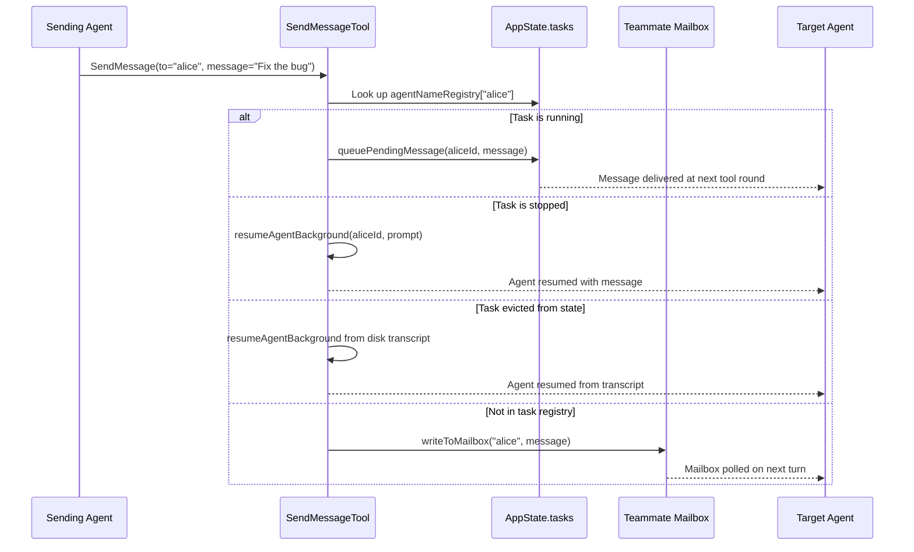
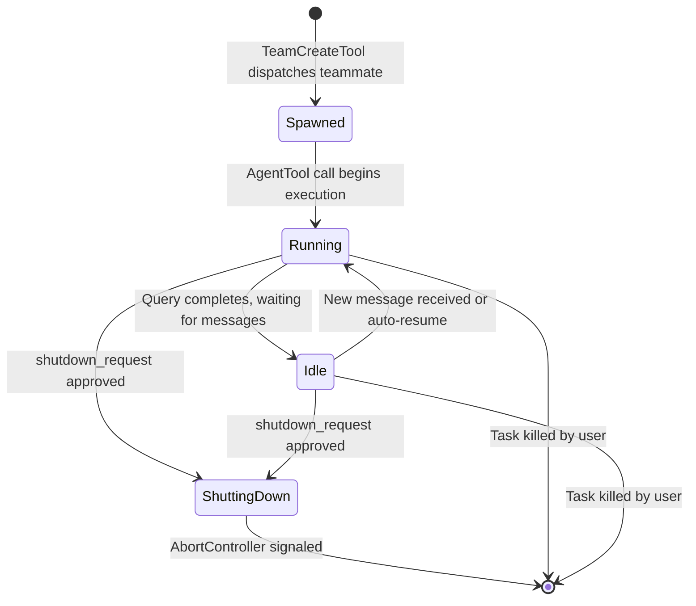

# Teammates and In-Process Collaboration

## Overview

Teammates are cc's mechanism for running multiple agents within the same process, coordinated through a mailbox-based messaging system. Unlike the forked subagents of Chapter 19 (which run in separate processes with isolated memory), in-process teammates share the same `AppState` and communicate through the `SendMessageTool` (917 LOC) and the session hooks system (`src/utils/hooks/sessionHooks.ts`, 447 LOC). This chapter examines the teammate communication protocol, the mailbox routing system, the structured message types (including shutdown requests and plan approvals), and the session hook infrastructure that enables in-process collaboration.

The in-process tier is the first of HER's three tiers of multi-agent orchestration (Section 9.1): same process, isolated context windows. It is the cheapest tier in terms of resource overhead because no new processes are spawned, but it requires careful coordination to prevent context leakage between teammates. The key architectural insight is that in-process teammates are managed through `AppState` -- they are tasks in the task registry, with their own `AbortController`, message queue, and progress tracker. This means the same infrastructure that supports background agents also supports teammates, reducing code duplication and ensuring consistent behavior.

## Data structures and contracts

### SendMessageTool input schema

The `SendMessageTool` input schema at `src/tools/SendMessageTool/SendMessageTool.ts:L67-L88` supports two modes: plain text messages and structured protocol messages:

```typescript
// src/tools/SendMessageTool/SendMessageTool.ts:L67-L87 — Input schema with multi-mode addressing
const inputSchema = lazySchema(() =>
  z.object({
    to: z
      .string()
      .describe(
        feature('UDS_INBOX')
          ? 'Recipient: teammate name, "*" for broadcast, "uds:<socket-path>" for a local peer, or "bridge:<session-id>" for a Remote Control peer (use ListPeers to discover)'
          : 'Recipient: teammate name, or "*" for broadcast to all teammates',
      ),
    summary: z
      .string()
      .optional()
      .describe(
        'A 5-10 word summary shown as a preview in the UI (required when message is a string)',
      ),
    message: z.union([
      z.string().describe('Plain text message content'),
      StructuredMessage(),
    ]),
  }),
)
```

The `to` field supports four addressing schemes: teammate name, wildcard broadcast (`*`), Unix domain socket (`uds:`), and cross-session bridge (`bridge:`). The UDS and bridge schemes are gated behind the `UDS_INBOX` feature flag. The `summary` field is required for plain text messages and displayed in the UI as a preview, allowing users to scan message traffic without opening each one.

### Structured message types

The `StructuredMessage` discriminated union at `src/tools/SendMessageTool/SendMessageTool.ts:L46-L65` defines three protocol-level message types:

```typescript
// src/tools/SendMessageTool/SendMessageTool.ts:L46-L65 — Protocol-level structured messages
const StructuredMessage = lazySchema(() =>
  z.discriminatedUnion('type', [
    z.object({
      type: z.literal('shutdown_request'),
      reason: z.string().optional(),
    }),
    z.object({
      type: z.literal('shutdown_response'),
      request_id: z.string(),
      approve: semanticBoolean(),
      reason: z.string().optional(),
    }),
    z.object({
      type: z.literal('plan_approval_response'),
      request_id: z.string(),
      approve: semanticBoolean(),
      feedback: z.string().optional(),
    }),
  ]),
)
```

These structured messages implement HER's handoff protocol (Section 11.5). The shutdown protocol enables graceful team-member termination with an explicit request-response handshake. The plan-approval protocol implements the checkpoint-review pattern where the team lead must approve a teammate's implementation plan before execution proceeds. Both protocols are request-response: the sender includes a `request_id` that the receiver echoes back, enabling the sender to correlate responses with requests.

### Message routing output types

The output types at `src/tools/SendMessageTool/SendMessageTool.ts:L92-L125` distinguish between four result shapes based on the type of message sent. The `MessageRouting` type at `src/tools/SendMessageTool/SendMessageTool.ts:L92-L99` carries sender/target names, colors, and summary for UI rendering:

```typescript
// src/tools/SendMessageTool/SendMessageTool.ts:L92-L99 — Routing metadata for UI rendering
export type MessageRouting = {
  sender: string
  senderColor?: string
  target: string
  targetColor?: string
  summary?: string
  content?: string
}
```

The `senderColor` and `targetColor` fields are used by the terminal UI to visually distinguish messages from different teammates. Each teammate is assigned a color when it joins the team, and this color is propagated through the routing metadata so the UI can render messages with consistent visual identity.

### Session hook types

The session hooks system at `src/utils/hooks/sessionHooks.ts:L14-L46` defines two hook categories for in-process communication. Function hooks execute TypeScript callbacks in-memory for validation, while command hooks run external processes. Both are session-scoped and cleared when the session ends:

```typescript
// src/utils/hooks/sessionHooks.ts:L9-L46 — Hook types and session store
type OnHookSuccess = (
  hook: HookCommand | FunctionHook,
  result: AggregatedHookResult,
) => void

export type FunctionHookCallback = (
  messages: Message[],
  signal?: AbortSignal,
) => boolean | Promise<boolean>

export type FunctionHook = {
  type: 'function'
  id?: string
  timeout?: number
  callback: FunctionHookCallback
  errorMessage: string
  statusMessage?: string
}

type SessionHookMatcher = {
  matcher: string
  skillRoot?: string
  hooks: Array<{
    hook: HookCommand | FunctionHook
    onHookSuccess?: OnHookSuccess
  }>
}

export type SessionStore = {
  hooks: {
    [event in HookEvent]?: SessionHookMatcher[]
  }
}
```

Function hooks are particularly useful for in-process collaboration because they execute synchronously in the same event loop as the agent, providing immediate validation without the latency of spawning an external process. The `timeout` field (default 5000ms) prevents a misbehaving hook from blocking the agent indefinitely.

### SessionHooksState with Map optimization

The `SessionHooksState` type at `src/utils/hooks/sessionHooks.ts:L48-L62` uses a `Map` rather than a `Record` for a performance-critical reason. The JSDoc comment on the type explains the full rationale:

```typescript
// src/utils/hooks/sessionHooks.ts:L48-L62 — Map-based state for O(1) mutation
/**
 * Map (not Record) so .set/.delete don't change the container's identity.
 * Mutator functions mutate the Map and return prev unchanged, letting
 * store.ts's Object.is(next, prev) check short-circuit and skip listener
 * notification. Session hooks are ephemeral per-agent runtime callbacks,
 * never reactively read (only getAppState() snapshots in the query loop).
 * Same pattern as agentControllers on LocalWorkflowTaskState.
 *
 * This matters under high-concurrency workflows: parallel() with N
 * schema-mode agents fires N addFunctionHook calls in one synchronous
 * tick. With a Record + spread, each call cost O(N) to copy the growing
 * map (O(N^2) total) plus fired all ~30 store listeners. With Map: .set()
 * is O(1), return prev means zero listener fires.
 */
export type SessionHooksState = Map<string, SessionStore>
```

The comment explains: with a `Record` and spread, each `addFunctionHook` call costs O(N) to copy the growing map (O(N^2) total for N parallel agents). With `Map`, `.set()` is O(1) and returning `prev` unchanged means zero listener notifications. This matters under high-concurrency workflows where parallel schema-mode agents fire N hook additions in one synchronous tick. The `Map` identity is preserved across mutations, so `Object.is(next, prev)` checks in the state store short-circuit and skip listener notification entirely.

## Control flow

### Message routing to in-process agents

When a plain-text message is sent to a specific teammate, the `SendMessageTool.call()` method at `src/tools/SendMessageTool/SendMessageTool.ts:L802-L873` routes it through the in-process task registry before falling through to mailbox-based delivery. The routing follows a priority chain:

1. Check `agentNameRegistry` for the target name.
2. If the target has a running task, queue the message.
3. If the target has a stopped task, auto-resume it.
4. If the target has no task in state, attempt to resume from disk transcript.
5. If all else fails, fall through to mailbox delivery.



This priority chain ensures that messages to in-process teammates are delivered as quickly as possible. The in-process queue is faster than mailbox delivery because it bypasses the filesystem entirely. However, mailbox delivery serves as a reliable fallback when the teammate's task is not in the current process's state.

### Running agent: queue pending message

When the target agent is running, `queuePendingMessage()` at `src/tasks/LocalAgentTask/LocalAgentTask.tsx:L162-L167` adds the message to the task's `pendingMessages` array, which is drained at tool-round boundaries:

```typescript
// src/tasks/LocalAgentTask/LocalAgentTask.tsx:L162-L167 — Queue message for delivery at tool-round boundary
export function queuePendingMessage(
  taskId: string,
  msg: string,
  setAppState: (f: (prev: AppState) => AppState) => void,
): void {
  updateTaskState<LocalAgentTaskState>(taskId, setAppState, task => ({
    ...task,
    pendingMessages: [...task.pendingMessages, msg],
  }))
}
```

This queue-and-drain pattern ensures that messages are not injected mid-tool-execution, which could cause race conditions in the query loop. The `drainPendingMessages()` function at `src/tasks/LocalAgentTask/LocalAgentTask.tsx:L181-L192` is called between tool rounds to flush the queue:

```typescript
// src/tasks/LocalAgentTask/LocalAgentTask.tsx:L181-L192 — Drain pending messages between tool rounds
export function drainPendingMessages(taskId: string, getAppState: () => AppState, setAppState: (f: (prev: AppState) => AppState) => void): string[] {
  const task = getAppState().tasks[taskId];
  if (!isLocalAgentTask(task) || task.pendingMessages.length === 0) {
    return [];
  }
  const drained = task.pendingMessages;
  updateTaskState<LocalAgentTaskState>(taskId, setAppState, t => ({
    ...t,
    pendingMessages: []
  }));
  return drained;
}
```

### Stopped agent: auto-resume

When the target agent exists in `AppState` but has a terminal status, the `SendMessageTool` at `src/tools/SendMessageTool/SendMessageTool.ts:L823-L845` automatically resumes the agent in the background with the incoming message as its new prompt. This auto-resume mechanism is a key differentiator from the mailbox-only approach: it allows the coordinator to continue workers that have completed their initial task without manually re-dispatching them through the `AgentTool`. The response message explicitly tells the sender that the agent was stopped and has been resumed, including the output file path for monitoring.

### Broadcast message flow

The `handleBroadcast()` function at `src/tools/SendMessageTool/SendMessageTool.ts:L195-L266` sends a message to all team members except the sender. Broadcasts always use the mailbox system, not the in-process queue, because they target all team members including potentially remote ones. The function reads the team file to enumerate members, filters out the sender, and writes to each recipient's mailbox in sequence.

### Shutdown protocol

The shutdown protocol implements a request-response handshake between the team lead and a teammate. When a teammate approves shutdown at `src/tools/SendMessageTool/SendMessageTool.ts:L305-L399`, the function sends a confirmation to the team lead's mailbox and then either aborts the in-process task or calls `gracefulShutdown()` for process-based teammates. For in-process teammates, the `AbortController` is signaled, causing the teammate's query loop to exit gracefully on its next iteration. For process-based teammates, `gracefulShutdown()` is called via `setImmediate()` to allow the current tool call to complete before the process exits.

### Plan approval protocol

The plan-approval protocol allows teammates in plan mode to request the team lead's approval before proceeding to implementation. The `handlePlanApproval()` function at `src/tools/SendMessageTool/SendMessageTool.ts:L434-L476` sends an approval response via mailbox that includes the leader's permission mode, so the teammate inherits the correct permission level for implementation. If the leader is in plan mode, the teammate inherits `default` mode instead, because plan mode restricts write operations and would prevent the teammate from implementing the approved plan.

### Cross-machine bridge messages

When the `UDS_INBOX` feature flag is enabled, the `SendMessageTool` supports sending messages to Remote Control peers via the `bridge:` addressing scheme. The `checkPermissions()` method at `src/tools/SendMessageTool/SendMessageTool.ts:L585-L601` requires explicit user consent for cross-machine messages because they arrive as user prompts on the receiving Claude, which could be a prompt-injection vector. The `classifierApprovable: false` flag means that even in auto-approval mode, cross-machine messages always require human confirmation.

### Team creation and tmux-based execution

Teams are created through the `TeamCreateTool` at `src/tools/TeamCreateTool/TeamCreateTool.ts`, which accepts a `team_name` and optional `description` and `agent_type`. The tool writes a `TeamFile` to disk at `.claude/teams/{team_name}/team.json`, registers the creating agent as the team lead, and sets up the directory structure for mailbox delivery. The team file is the single source of truth for team membership, and all subsequent teammate operations (spawning, messaging, shutdown) reference it.

When teammates are spawned within a team, cc selects an execution backend based on the runtime environment. The `TmuxBackend` at `src/utils/swarm/backends/TmuxBackend.ts` spawns each teammate as a separate tmux pane within a dedicated swarm window. This gives each teammate its own terminal I/O, allowing the user to observe and interact with individual teammates while the `SendMessageTool` handles inter-teammate communication through the mailbox. The `TmuxBackend` implements a pane-creation lock (a serialized promise chain) to prevent race conditions when multiple teammates are spawned in parallel, and it assigns each pane a distinct border color matching the teammate's assigned color. The `InProcessBackend` at `src/utils/swarm/backends/InProcessBackend.ts` is an alternative that runs teammates within the same process using `LocalAgentTask`, which is the mode described in this chapter. The backend is selected at team creation time and cannot be changed afterward.

The tool name constant is defined in `src/tools/SendMessageTool/constants.ts` as `SEND_MESSAGE_TOOL_NAME = 'SendMessage'`, and the user-facing prompt at `src/tools/SendMessageTool/prompt.ts` provides the natural-language documentation for addressing modes, broadcast semantics, and protocol-response formats. The prompt explicitly instructs agents to address teammates by name (never by UUID), to avoid quoting original messages when relaying, and to use `TaskUpdate` for status rather than structured JSON messages.

### Idle hooks and teammate availability

When a teammate finishes its current query and becomes idle, the session hooks system notifies the team lead so it can dispatch new work. The `initializeTeammateHooks()` function at `src/utils/swarm/teammateInit.ts:L28-L129` registers a `Stop` function hook on behalf of the teammate. When the teammate's query loop stops (either because the task completed or the model signaled end-of-turn), the hook fires and performs two actions: it marks the teammate as inactive in the team file via `setMemberActive(teamName, agentName, false)`, and it sends an idle notification to the team lead's mailbox using `createIdleNotification()` at `src/utils/teammateMailbox.ts:L410`.

The idle notification includes the teammate's name, an `idleReason` field (set to `'available'` for normal completion), and a summary extracted from the last direct message the teammate received. This summary helps the team lead understand what the teammate was working on when it became idle, enabling intelligent re-dispatch without querying the teammate's state. The hook returns `true` so it does not block the Stop event -- the notification is fire-and-forget from the hook's perspective, though the `writeToMailbox` call is awaited to ensure the message is persisted before the process potentially shuts down.

The `renderToolUseMessage()` and `renderToolResultMessage()` functions in `src/tools/SendMessageTool/UI.tsx` handle the terminal rendering of SendMessage interactions. Plan-approval responses are rendered as a one-line summary (`approve plan from: alice` or `reject plan from: alice`), while routing metadata and request IDs are suppressed from the main message view to reduce visual noise. Error messages and simple text results are rendered in a dim color to distinguish them from the primary conversation.

## Edge cases and failure modes

### Bridge disconnection during permission prompt

The `SendMessageTool.call()` method re-checks the bridge handle at `src/tools/SendMessageTool/SendMessageTool.ts:L749-L756` because the user may take minutes to approve the permission prompt, during which the bridge could disconnect. Without this re-check, the message would be sent with a stale `from` address ("unknown"), creating confusion on the receiving end.

### Structured messages cannot be broadcast or sent cross-session

The validation logic at `src/tools/SendMessageTool/SendMessageTool.ts:L678-L696` rejects structured messages for broadcast (`to: "*"`) and cross-session delivery. This constraint prevents protocol messages (shutdown requests, plan approvals) from being misrouted to unintended recipients or across process boundaries where they could not be properly handled.

### Summary required for plain text messages

The `validateInput()` method at `src/tools/SendMessageTool/SendMessageTool.ts:L667-L676` requires a summary when the message is a plain string. The summary is displayed in the UI as a preview, so the user can scan message traffic without opening each one. Structured messages do not require a summary because they are rendered differently in the UI.

### In-process shutdown abort

For in-process teammates, the shutdown approval at `src/tools/SendMessageTool/SendMessageTool.ts:L349-L367` aborts the task's `AbortController` rather than calling `gracefulShutdown()`. This is because the teammate shares the same process as the lead -- killing the process would also kill the lead. The abort signal causes the teammate's query loop to exit gracefully on its next iteration, after completing any in-progress tool call.

### Mailbox system for inter-teammate persistence

The mailbox system provides a file-based delivery mechanism for messages between teammates. When a message cannot be delivered through the in-process queue (because the target is not in `AppState`), the `SendMessageTool` falls through to mailbox delivery. The mailbox is implemented as a write-only log: each message is appended to a file named after the recipient, and the recipient polls the file on each turn.

The mailbox serves a different purpose than the in-process queue. The in-process queue is for real-time communication between teammates that share the same process. The mailbox is for durable communication that persists across process restarts. A teammate that is resumed from a disk transcript will find its mailbox messages waiting, even if the sending teammate has already exited.

### Function hooks in the session hooks system

The `addFunctionHook()` function at `src/utils/hooks/sessionHooks.ts:L64-L108` registers an in-memory callback that executes synchronously in the agent's event loop. The function takes the hook event, a callback, an error message, and optional timeout and status message parameters. The callback receives the message array and an optional `AbortSignal`, and returns a boolean indicating whether the hook passed or blocked the operation.

```typescript
// src/utils/hooks/sessionHooks.ts:L93-L114 — Function hook registration
export function addFunctionHook(
  setAppState: (updater: (prev: AppState) => AppState) => void,
  sessionId: string,
  event: HookEvent,
  matcher: string,
  callback: FunctionHookCallback,
  errorMessage: string,
  options?: {
    timeout?: number
    id?: string
  },
): string {
  const id = options?.id || `function-hook-${Date.now()}-${Math.random()}`
  const hook: FunctionHook = {
    type: 'function',
    id,
    timeout: options?.timeout || 5000,
    callback,
    errorMessage,
  }
  addHookToSession(setAppState, sessionId, event, matcher, hook)
  return id
}
```

Function hooks are particularly useful for in-process validation that must complete before the tool executes. For example, a function hook on the `PreToolUse` event can validate tool inputs against business rules without the latency of spawning an external process. The default timeout of 5000ms prevents a misbehaving hook from blocking the agent indefinitely, but callers can override this for hooks that need more time.

### Command hooks and external process execution

Command hooks at `src/utils/hooks/sessionHooks.ts:L48-L58` run external processes rather than in-memory callbacks. They are defined with a command string (which can include template variables like `$TOOL_NAME` and `$FILE_PATH`) and an optional timeout. Command hooks are useful for integration with external linters, formatters, or security scanners that run as separate processes.

The key difference between function hooks and command hooks for in-process collaboration is latency. Function hooks execute synchronously in the same event loop, providing immediate feedback. Command hooks require spawning a child process, which adds at minimum the process startup time. For in-process teammates that need rapid validation, function hooks are the preferred mechanism. For integration with external tools, command hooks are necessary.

### The agent name registry and color assignment

The `agentNameRegistry` at `src/state/AppStateStore.ts:L163` is a `Map<string, AgentId>` property on `AppState` that maps agent names to their task IDs. When a teammate is spawned via the `AgentTool` with a `name` parameter, it registers its name in this registry (latest-wins on collision), allowing `SendMessageTool` to route messages by human-readable name rather than by task ID. The registry is stored in `AppState` so it is accessible to all in-process teammates without cross-module lookups.

Each teammate is assigned a color when it joins the team. The color is propagated through the `MessageRouting` type's `senderColor` and `targetColor` fields, allowing the terminal UI to render messages with consistent visual identity. The color assignment uses a predefined palette that ensures adjacent teammates have visually distinct colors, reducing confusion when scanning message traffic.

### Evicted task handling: resume from disk transcript

When a target agent's task has been evicted from `AppState` (which can happen when the task registry is pruned to conserve memory), the `SendMessageTool` at `src/tools/SendMessageTool/SendMessageTool.ts:L845-L860` attempts to resume the agent from its disk transcript. This is the most expensive fallback in the routing chain because it requires reading the agent's conversation history from disk and reconstructing its state.

The resume-from-transcript mechanism works by reading the JSONL session file for the evicted task, constructing a new `LocalAgentTaskState` with the conversation history, and resuming the agent in the background with the incoming message as its new prompt. This mechanism ensures that messages are not lost even when the in-process state has been pruned, but it is significantly slower than the in-process queue or auto-resume paths.

### Team file and broadcast enumeration

The `handleBroadcast()` function at `src/tools/SendMessageTool/SendMessageTool.ts:L195-L266` reads the team file to enumerate all team members before sending a broadcast message. The team file is a JSON file stored in the project's `.claude/` directory that lists the team name, the leader's session ID, and all teammate names and session IDs. This file is the single source of truth for team membership.

Broadcasts are always delivered via the mailbox system, not the in-process queue, because they must reach all team members including those that may not be in the current process. The function filters out the sender from the recipient list, preventing a teammate from receiving its own broadcast. If any individual mailbox write fails (e.g., the recipient's directory does not exist), the function logs the error but continues with the remaining recipients, ensuring that a single failure does not prevent delivery to other teammates.

## Where cc diverges from the published pattern

### No checkpoint-review protocol

HER Section 11.5 prescribes mandatory human review at 25% and 75% of task completion to catch goal misinterpretation early. cc's plan-approval protocol is optional and only fires when a teammate explicitly requests approval. There is no automatic checkpoint mechanism that pauses work for human review at predefined progress thresholds.

### File-based communication not default

HER Section 9.3 recommends file-based inter-agent communication because it maintains context fidelity better than passing state through code. cc's in-process teammates communicate primarily through the in-memory message queue (`pendingMessages`) and the mailbox system. The mailbox does write to disk, but it is a write-only-log pattern rather than the structured file exchange that HER envisions.

### Missing handoff document

HER Section 11.5 prescribes a structured handoff document that summarizes current state, what is done, what is remaining, and open questions. cc's `SendMessageTool` carries ad-hoc messages but does not enforce a handoff document format. A teammate that shuts down leaves its current state implicit in the task list, not in an explicit handoff artifact.

### Session hook lifecycle and cleanup

Session hooks are scoped to the current session and are automatically cleaned up when the session ends. The `SessionStore` at `src/utils/hooks/sessionHooks.ts:L38-L46` is a simple container with a `hooks` field that maps `HookEvent` values to arrays of `SessionHookMatcher` objects. When the session ends, the entire `SessionStore` is discarded, preventing stale hooks from affecting future sessions.

The `Map`-based `SessionHooksState` at `src/utils/hooks/sessionHooks.ts:L50-L62` uses session IDs as keys and `SessionStore` objects as values. When a session ends, the corresponding entry is removed from the map. This is an O(1) operation with `Map.delete()`, compared to an O(N) operation with the spread-copy pattern that a `Record` would require. The performance difference is negligible for individual session cleanup, but it matters during bulk cleanup (e.g., when multiple sessions are closed simultaneously during a team shutdown).

### The teammate lifecycle diagram

The complete lifecycle of an in-process teammate can be summarized in a state diagram:



A teammate enters the `Spawned` state when the `TeamCreateTool` dispatches it. It transitions to `Running` when the `AgentTool` call begins execution. After the query completes, the teammate transitions to `Idle`, where it waits for incoming messages. When a message arrives (either through the in-process queue or the mailbox), the teammate transitions back to `Running` and processes the message. If the team lead sends a `shutdown_request` and the teammate approves, the teammate transitions to `ShuttingDown`, which signals the `AbortController` and causes the query loop to exit gracefully on its next iteration.

### Cross-machine bridge and UDS addressing

When the `UDS_INBOX` feature flag is enabled, the `SendMessageTool` supports two additional addressing schemes. The `uds:<socket-path>` scheme sends messages to a local peer via a Unix domain socket. The `bridge:<session-id>` scheme sends messages to a Remote Control peer across process boundaries. Both schemes require explicit user consent because they arrive as user prompts on the receiving Claude, which could be a prompt-injection vector.

The `checkPermissions()` method at `src/tools/SendMessageTool/SendMessageTool.ts:L585-L601` sets `classifierApprovable: false` for cross-machine messages, meaning that even in auto-approval mode, these messages always require human confirmation. This is a critical safety measure: auto-approval modes are designed for trusted local operations, and cross-machine messages cross the trust boundary by definition.

## Developer takeaways for building a long-running agent

1. **Queue messages, do not inject them.** The `queuePendingMessage()` / `drainPendingMessages()` pattern ensures that messages are delivered at safe points in the query loop (tool-round boundaries). Injecting messages mid-execution would create race conditions and undefined behavior in the tool dispatch pipeline.

2. **Auto-resume stopped agents on message.** When a coordinator sends a follow-up message to a completed worker, the worker should automatically resume rather than requiring the coordinator to check status and re-dispatch. This reduces the cognitive load on the orchestrator and makes the system feel more like a persistent team.

3. **Require explicit consent for cross-machine messages.** Messages that cross process or machine boundaries are a prompt-injection vector. The `classifierApprovable: false` flag ensures that auto-approval modes cannot bypass this safety check.

4. **Use Map instead of Record for high-frequency mutations.** The `SessionHooksState` Map optimization eliminates O(N^2) copy overhead when multiple agents register hooks simultaneously. This is a general pattern: when a data structure is mutated frequently by concurrent agents, prefer `Map` with identity-preserving mutations over `Record` with spread copies.

5. **Inherit permission mode on plan approval.** When a teammate transitions from plan mode to implementation mode, it must not inherit plan-mode permissions (which restrict write operations). The mode-to-inherit logic (`leaderMode === 'plan' ? 'default' : leaderMode`) prevents this accidental restriction.

6. **Distinguish in-process from process-based shutdown.** In-process teammates cannot be terminated by killing the process, because they share the process with the lead. The shutdown protocol must use `AbortController` for in-process teammates and `gracefulShutdown()` for process-based teammates.
