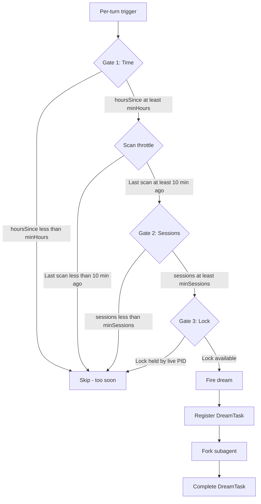
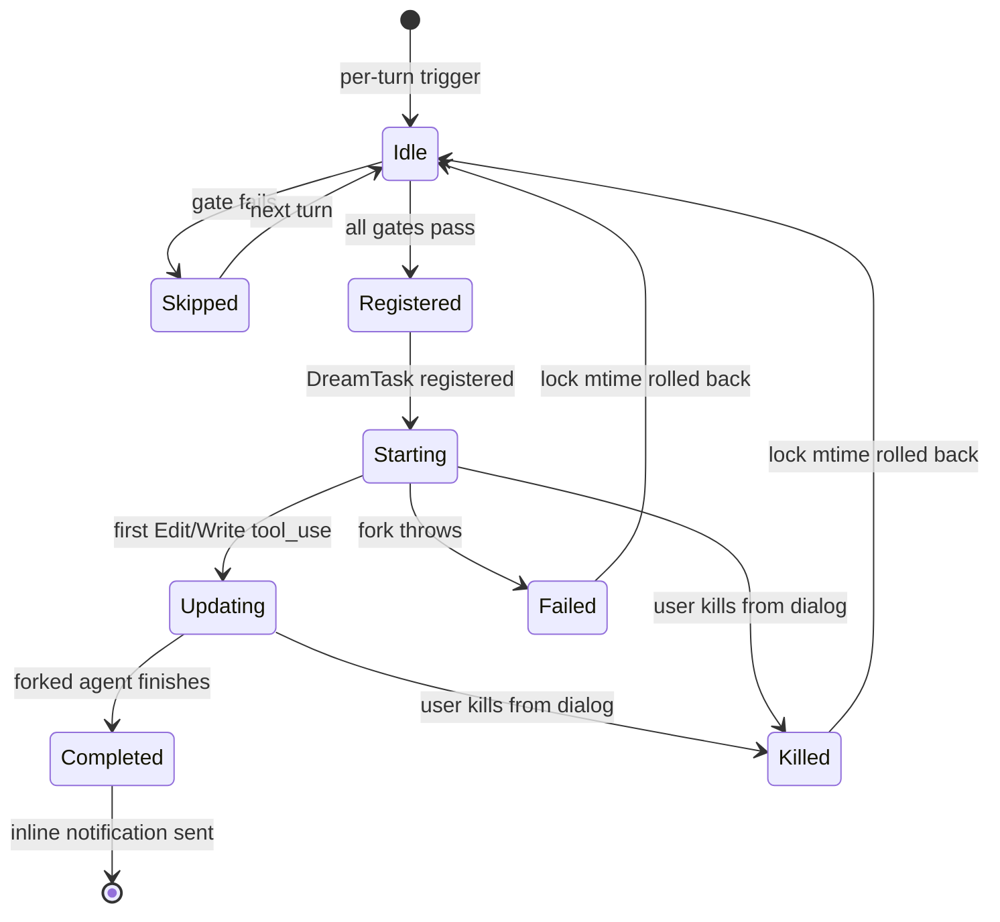
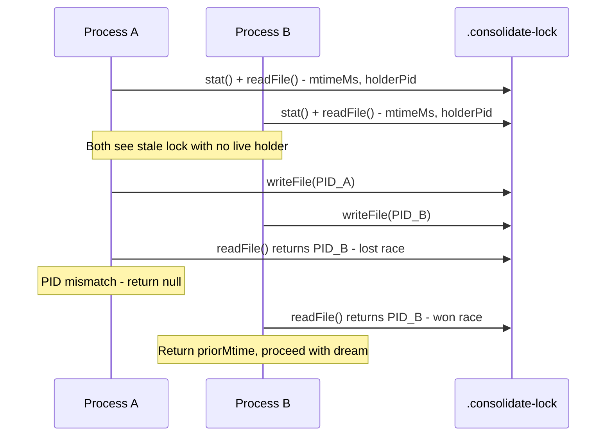

# Dream Tasks: Background Consolidation

## Overview

Dream tasks are cc's implementation of HER Pattern 4: Dream Consolidation. When the agent is idle and enough sessions have accumulated since the last consolidation, a background forked subagent reviews memory files, prunes stale entries, merges new signal into existing topic files, and reindexes the `MEMORY.md` entry point. The dream subsystem spans four files: `src/services/autoDream/autoDream.ts` (324 LOC) for the gating and dispatch logic, `src/services/autoDream/consolidationLock.ts` (140 LOC) for the file-based lock, `src/services/autoDream/consolidationPrompt.ts` (65 LOC) for the dream prompt, and `src/tasks/DreamTask/DreamTask.ts` (157 LOC) for the in-memory task state.

The dream system is cc's most sophisticated example of background processing: it operates entirely outside the main query loop, uses a filesystem-based lock to prevent concurrent consolidation across processes, and implements a three-gate system (time, sessions, lock) that ensures consolidation fires only when there is genuinely new signal to process. This three-gate design is a general pattern for any background task that must be both timely (fire when there is new data) and efficient (skip when there is nothing to consolidate).

The dream system connects to HER's Layer 8 (Learning and Adaptation) in the reference architecture. Layer 8 prescribes that progress notes should persist to files, feedback from evaluators should be recorded for future sessions, stale assumptions should be pruned as models improve, and harness configuration should be versioned and A/B tested. The dream system addresses the first two prescriptions (persisting knowledge and pruning stale assumptions) but does not feed evaluator feedback back into harness configuration.

## Data structures and contracts

### AutoDream configuration

The `isAutoDreamEnabled()` function at `src/services/autoDream/config.ts:L13-L21` determines whether background consolidation should run. It checks the user's `autoDreamEnabled` setting first; if the setting is not explicitly configured, it falls through to the `tengu_onyx_plover` GrowthBook flag. This two-layer check is why `config.ts` is intentionally kept as a leaf module with minimal imports: UI components import `isAutoDreamEnabled()` to toggle the dream indicator, and pulling in the full forked-agent chain from `autoDream.ts` would create unnecessary dependency weight in those render paths.

```typescript
// src/services/autoDream/config.ts:L13-L21 — Enabled gate for auto-dream
export function isAutoDreamEnabled(): boolean {
  const setting = getInitialSettings().autoDreamEnabled
  if (setting !== undefined) return setting
  const gb = getFeatureValue_CACHED_MAY_BE_STALE<{ enabled?: unknown } | null>(
    'tengu_onyx_plover',
    null,
  )
  return gb?.enabled === true
}
```

The `AutoDreamConfig` type at `src/services/autoDream/autoDream.ts:L58-L61` defines the two scheduling knobs:

```typescript
// src/services/autoDream/autoDream.ts:L58-L61 — Scheduling configuration for auto-dream
type AutoDreamConfig = {
  minHours: number
  minSessions: number
}
```

The defaults at `src/services/autoDream/autoDream.ts:L63-L66` require at least 24 hours and 5 sessions since the last consolidation:

```typescript
// src/services/autoDream/autoDream.ts:L63-L66 — Default scheduling thresholds
const DEFAULTS: AutoDreamConfig = {
  minHours: 24,
  minSessions: 5,
}
```

These values are overridden by the GrowthBook feature flag `tengu_onyx_plover`, with defensive per-field validation at `src/services/autoDream/autoDream.ts:L73-L93` to guard against stale cache values returning wrong types. The validation checks each field individually (`typeof raw?.minHours === 'number'` and `Number.isFinite(raw.minHours)`), because GrowthBook cache can return values from a previous experiment configuration where the field had a different type. This defensive validation pattern is used throughout cc's GrowthBook integration and prevents type errors from propagating into scheduling decisions.

### DreamTaskState

The `DreamTaskState` type at `src/tasks/DreamTask/DreamTask.ts:L25-L41` tracks the dream agent's progress in memory:

```typescript
// src/tasks/DreamTask/DreamTask.ts:L25-L41 — In-memory state for a running dream task
export type DreamTaskState = TaskStateBase & {
  type: 'dream'
  phase: DreamPhase
  sessionsReviewing: number
  /**
   * Paths observed in Edit/Write tool_use blocks via onMessage. This is an
   * INCOMPLETE reflection of what the dream agent actually changed — it misses
   * any bash-mediated writes and only captures the tool calls we pattern-match.
   * Treat as "at least these were touched", not "only these were touched".
   */
  filesTouched: string[]
  /** Assistant text responses, tool uses collapsed. Prompt is NOT included. */
  turns: DreamTurn[]
  abortController?: AbortController
  /** Stashed so kill can rewind the lock mtime (same path as fork-failure). */
  priorMtime: number
}
```

The `DreamPhase` at `src/tasks/DreamTask/DreamTask.ts:L23` is a simple two-state indicator:

```typescript
// src/tasks/DreamTask/DreamTask.ts:L23 — Phase indicator for dream progress
export type DreamPhase = 'starting' | 'updating'
```

The phase flips from `starting` to `updating` when the first Edit or Write tool_use lands, as detected by the progress watcher. This phase distinction is used by the UI to show the user whether the dream agent is still orienting or has started modifying memory files.

The `filesTouched` array at `src/tasks/DreamTask/DreamTask.ts:L32-L38` tracks which memory files the dream agent has modified. The comment explicitly acknowledges that `filesTouched` is an incomplete accounting: it only captures Edit and Write tool calls, not bash-mediated file modifications. This is an important design constraint: the dream agent's Bash tool is restricted to read-only commands, but the restriction is enforced through the `canUseTool` callback, not through Bash classifier rules. If the `canUseTool` callback were to fail or be bypassed, the dream agent could modify files via Bash without those modifications being tracked in `filesTouched`.

The `priorMtime` field stores the lock file's mtime before the dream acquired the lock. This value is used by the kill handler to roll back the lock to its pre-acquisition state if the dream is aborted, ensuring that the next consolidation attempt is not blocked by a stale lock mtime.

### DreamTurn type

The `DreamTurn` type at `src/tasks/DreamTask/DreamTask.ts:L15-L18` collapses each assistant turn into a text summary and tool-use count:

```typescript
// src/tasks/DreamTask/DreamTask.ts:L15-L18 — Collapsed representation of a dream agent turn
export type DreamTurn = {
  text: string
  toolUseCount: number
}
```

This representation strips tool inputs and outputs, keeping only the agent's reasoning text and the count of tool invocations. The `MAX_TURNS` constant at `src/tasks/DreamTask/DreamTask.ts:L12` limits the stored turns to the 30 most recent, preventing unbounded memory growth during long consolidation runs. The `addDreamTurn()` function at `src/tasks/DreamTask/DreamTask.ts:L76-L104` skips the update entirely if the turn is empty and no new files were touched, avoiding unnecessary re-renders in the UI.

### Consolidation lock

The lock file at `src/services/autoDream/consolidationLock.ts:L16-L17` uses the file's `mtime` as the `lastConsolidatedAt` timestamp. The lock body contains the holder's PID:

```typescript
// src/services/autoDream/consolidationLock.ts:L16-L19 — Lock file constants
const LOCK_FILE = '.consolidate-lock'

// Stale past this even if the PID is live (PID reuse guard).
const HOLDER_STALE_MS = 60 * 60 * 1000
```

The `HOLDER_STALE_MS` constant at `src/services/autoDream/consolidationLock.ts:L19` defines a one-hour staleness threshold. This threshold guards against PID reuse: even if the lock-holder's PID is still alive (because a different process reused the PID), the lock is considered stale after one hour and can be reclaimed. This is a pragmatic compromise between safety (not interrupting a genuinely running consolidation) and liveness (not blocking consolidation indefinitely if the lock is stuck).

## Control flow

### Three-gate system

The auto-dream system implements a three-gate cascade at `src/services/autoDream/autoDream.ts:L125-L190`, where each gate is progressively more expensive:



Gate 1 (time) costs one `stat` system call -- the cheapest possible check. The `readLastConsolidatedAt()` function at `src/services/autoDream/consolidationLock.ts:L29-L36` reads the lock file's mtime, which serves as both the lock indicator and the timestamp of the last consolidation. If the mtime is too recent (less than `minHours` ago), the gate fails and the dream is skipped for this turn.

Gate 2 (sessions) requires scanning the session directory for transcripts with `mtime` after `lastConsolidatedAt`. The `listSessionsTouchedSince()` function at `src/services/autoDream/consolidationLock.ts:L118-L124` uses `listCandidates()` to find sessions, filtering by mtime and excluding agent sessions. The current session is excluded at `src/services/autoDream/autoDream.ts:L164-L165` because its mtime is always recent and would create a false positive.

Gate 3 (lock) acquires an exclusive lock file. This is the most expensive gate because it involves writing to the filesystem and potentially waiting for another process to release the lock.

### Dream lifecycle

The dream task moves through a defined lifecycle from registration to completion or failure. The following state diagram shows the full progression, including the rollback paths that restore the lock mtime when the dream is killed or fails:



The scan throttle at `src/services/autoDream/autoDream.ts:L56` prevents the session scan from firing on every turn when the time gate passes but the session gate does not:

```typescript
// src/services/autoDream/autoDream.ts:L56 — Throttle for session scanning
const SESSION_SCAN_INTERVAL_MS = 10 * 60 * 1000
```

Without this throttle, every turn after the time gate passes would trigger a session scan, consuming I/O resources without finding enough sessions. The 10-minute throttle ensures that session scanning is bounded regardless of how frequently the agent is invoked.

### Gate openness check

The `isGateOpen()` function at `src/services/autoDream/autoDream.ts:L95-L100` checks three preconditions before any gate evaluation:

```typescript
// src/services/autoDream/autoDream.ts:L95-L100 — Pre-gate checks for auto-dream eligibility
function isGateOpen(): boolean {
  if (getKairosActive()) return false // KAIROS mode uses disk-skill dream
  if (getIsRemoteMode()) return false
  if (!isAutoMemoryEnabled()) return false
  return isAutoDreamEnabled()
}
```

KAIROS mode (a feature-gated assistant mode) uses its own dream implementation, so auto-dream is disabled when KAIROS is active. Remote mode also disables auto-dream because background consolidation should not run on a remote session where the user may not be actively watching. The `isAutoMemoryEnabled()` check ensures that the memdir system is active before attempting consolidation, because the dream agent writes its output to the memdir directory.

### Consolidation lock acquisition

The `tryAcquireConsolidationLock()` function at `src/services/autoDream/consolidationLock.ts:L46-L84` implements a two-phase commit. It reads the lock file, checks if the holder PID is alive and the lock is not stale, then writes its own PID. After writing, it re-reads the file to verify that it won the race: if two processes both wrote their PIDs, the last writer wins and the loser detects the mismatch on verification.



The race-detection mechanism is simple but effective: after writing its PID, each process re-reads the file. If the PID in the file does not match its own, the process knows it lost the race and returns `null`. This approach does not require a separate coordination mechanism -- the lock file itself serves as the coordination primitive.

### Lock rollback on fork failure

When the forked dream agent fails (not aborted by the user), the `autoDream` runner at `src/services/autoDream/autoDream.ts:L268-L270` rolls back the lock mtime so the time gate passes again on the next turn:

```typescript
// src/services/autoDream/autoDream.ts:L268-L270 — Rollback on fork failure
failDreamTask(taskId, setAppState)
// Rewind mtime so time-gate passes again. Scan throttle is the backoff.
await rollbackConsolidationLock(priorMtime)
```

The `rollbackConsolidationLock()` function at `src/services/autoDream/consolidationLock.ts:L91-L108` either unlinks the file (if `priorMtime` was 0, meaning no lock existed before) or rewinds the mtime using `utimes()`. The rollback is critical: without it, a failed consolidation would leave the lock mtime set to the current time, and the time gate would not pass again for another `minHours`. The scan throttle provides backoff, but the mtime rollback ensures the next attempt is not unnecessarily delayed.

### Dream progress watcher

The `makeDreamProgressWatcher()` function at `src/services/autoDream/autoDream.ts:L281-L313` monitors the forked agent's messages and updates the DreamTaskState. The watcher only processes assistant messages, extracts text blocks for display, and counts tool uses. It specifically watches for Edit and Write tool calls to track which memory files were touched. This selective monitoring reduces the overhead of progress tracking: the watcher does not attempt to capture full tool inputs and outputs, which would be expensive in terms of both memory and processing time.

### DreamTask kill and lock rollback

The `DreamTask.kill()` function at `src/tasks/DreamTask/DreamTask.ts:L132-L157` aborts the dream agent and rolls back the consolidation lock. The `priorMtime` is stashed in the `DreamTaskState` when the dream is registered, so the kill handler can rewind the lock to the pre-acquisition state. This is the same rollback path used for fork failures. The kill handler checks that the task is still running before aborting, preventing a double-abort if the task has already completed or been killed.

### Dream completion notification

The dream system sends an inline completion message to the main transcript at `src/services/autoDream/autoDream.ts:L238-L248` when the dream modified files. This notification uses the same surface as the extractMemories "Saved N memories" message, providing a consistent user experience. The verb is changed from "Saved" to "Improved" to distinguish dream consolidation from the per-turn memory extraction that happens during normal agent operation.

### Consolidation prompt phases

The `buildConsolidationPrompt()` function at `src/services/autoDream/consolidationPrompt.ts:L14-L65` generates a four-phase dream prompt:

- **Phase 1 -- Orient**: The agent lists the memory directory, reads the `MEMORY.md` index, and skims existing topic files. This phase ensures the agent understands the current state of the knowledge base before attempting modifications.
- **Phase 2 -- Gather recent signal**: The agent looks for new information worth persisting, starting with daily logs (if present), then existing memories that have drifted from the codebase, then transcript search for specific context. The prompt explicitly warns against exhaustively reading transcripts: "Don't exhaustively read transcripts. Look only for things you already suspect matter."
- **Phase 3 -- Consolidate**: The agent writes or updates memory files, merging new signal into existing topic files rather than creating near-duplicates. The prompt instructs the agent to convert relative dates ("yesterday", "last week") to absolute dates so they remain interpretable after time passes, and to delete contradicted facts at the source rather than appending corrections.
- **Phase 4 -- Prune and index**: The agent updates the `MEMORY.md` index to stay under size limits. Each entry should be one line under approximately 150 characters: a title, a link, and a one-line hook. The prompt warns against writing memory content directly into the index file.

### Bash restrictions in auto-dream

The dream prompt's `extra` section at `src/services/autoDream/autoDream.ts:L216-L221` restricts the forked agent's Bash tool to read-only commands:

```typescript
// src/services/autoDream/autoDream.ts:L216-L221 — Read-only Bash restriction for dream agents
const extra = `

**Tool constraints for this run:** Bash is restricted to read-only commands (\`ls\`, \`find\`, \`grep\`, \`cat\`, \`stat\`, \`wc\`, \`head\`, \`tail\`, and similar). Anything that writes, redirects to a file, or modifies state will be denied. Plan your exploration with this in mind — no need to probe.

Sessions since last consolidation (${sessionIds.length}):
${sessionIds.map(id => `- ${id}`).join('\n')}`
```

This restriction is enforced through the `canUseTool` callback passed to `runForkedAgent()`, not through the Bash classifier. This means the restriction applies only to the dream agent's execution context and does not affect the main session's Bash tool. The prompt also includes the list of sessions since the last consolidation, giving the dream agent a hint about which transcripts to review.

## Edge cases and failure modes

### PID reuse in lock checking

The `HOLDER_STALE_MS` constant (one hour) at `src/services/autoDream/consolidationLock.ts:L19` guards against PID reuse. If a process holding the lock crashes and the PID is reused by an unrelated process, the lock would appear to be held by a live process indefinitely. The staleness threshold ensures that even if the PID is live, the lock is reclaimed after one hour. This is a pragmatic compromise: one hour is long enough that a genuine consolidation (which typically takes 5-15 minutes) will not be interrupted, but short enough that a stuck lock does not block consolidation indefinitely.

### Scan throttle prevents thundering herd

When the time gate passes but the session gate does not, the lock mtime does not advance, so the time gate would pass on every subsequent turn. The `SESSION_SCAN_INTERVAL_MS` throttle at `src/services/autoDream/autoDream.ts:L56` limits session scanning to once every 10 minutes, preventing a thundering herd of stat-and-scan operations. Without this throttle, an agent that is invoked every few seconds (e.g., during an active coding session) would trigger dozens of session scans per hour, each finding the same insufficient number of sessions.

### User kill does not double-rollback

When the user kills a dream from the background-tasks dialog, `DreamTask.kill()` aborts the agent and rolls back the lock. The `autoDream` runner at `src/services/autoDream/autoDream.ts:L260-L264` checks `abortController.signal.aborted` before attempting its own rollback. This prevents a double-rollback that would incorrectly rewind the lock mtime a second time, potentially setting it to a value older than the pre-acquisition state.

### Dream fires only on main session turns

The `executeAutoDream()` function at `src/services/autoDream/autoDream.ts:L319-L324` is called from the stop-hooks subsystem, which fires after each query turn in the main session. This means the dream system is only evaluated on the main session's turns, not on subagent turns. A long-running subagent that never returns control to the main session would not trigger auto-dream, even if the time and session gates are satisfied. This design is intentional: the dream system should not compete with active subagent work for resources.

### Memory directory may not exist yet

The `tryAcquireConsolidationLock()` function at `src/services/autoDream/consolidationLock.ts:L71` creates the memory directory with `mkdir({ recursive: true })` before writing the lock file. This handles the case where the memory directory does not exist yet (e.g., a fresh installation where no memories have been saved). The `recordConsolidation()` function at `src/services/autoDream/consolidationLock.ts:L130-L140` also creates the directory, handling the case where a manual `/dream` command is run before any automatic dream has fired.

### Dream dispatch and the forked agent lifecycle

When all three gates pass, the `executeAutoDream()` function at `src/services/autoDream/autoDream.ts:L191-L250` dispatches a forked subagent to perform consolidation. The dispatch follows a specific sequence:

1. Register a `DreamTask` in `AppState` with `registerDreamTask()`, capturing the `priorMtime` from the lock acquisition.
2. Build the consolidation prompt via `buildConsolidationPrompt()`, including the list of sessions since the last consolidation and the read-only Bash restriction.
3. Call `runForkedAgent()` with the dream-specific tool constraints (`canUseTool` callback).
4. Attach the `makeDreamProgressWatcher()` to monitor the forked agent's output and update `DreamTaskState` in real time.
5. On completion, send an inline notification to the main transcript if files were modified.

The forked agent runs in a separate process with its own context window, which is critical for two reasons. First, the dream agent must not contaminate the main session's context with consolidation-specific reasoning. Second, the dream agent has a different tool surface than the main session: it cannot use Bash for write operations, and its progress is tracked differently in `AppState`.

### Relationship between DreamTask and LocalAgentTask

The `DreamTask` type at `src/tasks/DreamTask/DreamTask.ts:L25-L41` shares the same `TaskStateBase` as `LocalAgentTaskState` but has a distinctly different shape. Where `LocalAgentTaskState` tracks the full message history and supports backgrounding/foregrounding, `DreamTaskState` collapses each turn into a `DreamTurn` (text summary plus tool-use count) and tracks only the files touched. This difference reflects the dream agent's role: it is a background maintenance task whose detailed reasoning is less important than which files it modified and whether it is still running.

The `registerDreamTask()` function at `src/tasks/DreamTask/DreamTask.ts:L52-L74` creates the `DreamTaskState` in `AppState`, including an `AbortController` for cancellation and the `priorMtime` from the lock acquisition. The `kill()` function at `src/tasks/DreamTask/DreamTask.ts:L132-L157` uses this `AbortController` to abort the forked agent and then rolls back the consolidation lock using the stashed `priorMtime`.

The `addDreamTurn()` function at `src/tasks/DreamTask/DreamTask.ts:L76-L104` updates the task state after each assistant turn. It skips the update entirely if the turn produced no text and no new files were touched, avoiding unnecessary re-renders. This optimization is important because dream agents can produce many turns during a consolidation run, and each state update triggers a React re-render in the UI.

### The dream completion path and inline notification

When the forked agent completes, the `autoDream` runner at `src/services/autoDream/autoDream.ts:L238-L248` checks whether the dream modified any files (via `filesTouched`). If files were modified, it sends an inline completion message to the main transcript using the `addInlineMessage()` function. This notification appears as "Improved N memories" in the user's conversation, using the same UI surface as the per-turn memory extraction that happens during normal agent operation.

The verb "Improved" (rather than "Saved") is deliberate: it distinguishes dream consolidation (which updates existing memories) from the per-turn memory extraction (which creates new memories). This distinction helps users understand what happened without inspecting the background task details.

When the dream completes without modifying any files, no notification is sent. This silent-completion behavior is intentional: if the dream agent determined that no consolidation was needed, the user should not be interrupted. The `filesTouched` array serves as the gate for this decision, which means that bash-mediated file modifications (which are not tracked in `filesTouched`) could cause the dream to complete silently even though it made changes. However, since the dream agent's Bash tool is restricted to read-only commands, this scenario should not occur in practice.

## Where cc diverges from the published pattern

### No explicit compaction types

HER Pattern 4 describes dream consolidation with "8 phases, 5 compaction types." cc's implementation uses a four-phase prompt (Orient, Gather, Consolidate, Prune) and does not define explicit compaction types. The dream agent is free to perform any kind of consolidation (merging, deduplication, pruning, reindexing) without categorizing the operation. This is a simpler approach that gives the agent more flexibility but makes it harder to audit what kind of consolidation was performed.

### No multi-process queue

HER Section 21 (Layer 8) describes a learning and adaptation layer where feedback from evaluators is recorded for future sessions and harness configuration is versioned and A/B tested. cc's dream system performs memory consolidation but does not feed evaluator feedback back into the harness configuration. The dream agent only modifies memory files, not the agent's behavior configuration. This means the dream system cannot learn from past mistakes (e.g., "this agent tends to produce incorrect import paths") and encode that knowledge as a behavior adjustment.

### Lock-based instead of queue-based

HER recommends a queue-based approach for background processing where tasks are submitted to a queue and processed in order. cc uses a lock-based approach where the first process to acquire the lock runs the consolidation. This is simpler but does not guarantee FIFO ordering or fair scheduling across processes. In a scenario where two cc instances share the same memory directory, the instance that acquires the lock first runs consolidation, and the other instance skips it entirely. The second instance does not queue a consolidation request for later processing.

### No explicit session-to-memory pipeline

HER Section 10.3 describes a session protocol where the UPDATE phase includes persisting notes and progress observations. cc's dream system does not have an explicit pipeline from session completion to memory extraction. Instead, the dream agent scans transcript files directly, looking for sessions with `mtime` after `lastConsolidatedAt`. This is a polling approach rather than an event-driven pipeline. The polling approach is simpler but has higher latency: the dream agent only discovers new sessions when the three gates align, which could be hours after the sessions complete.

## Developer takeaways for building a long-running agent

1. **Use a three-gate cascade for background tasks.** The time gate (cheapest) prevents unnecessary computation, the session gate (moderate cost) ensures there is new signal to process, and the lock gate (most expensive) prevents concurrent execution. Ordering gates from cheapest to most expensive minimizes wasted work. In cc's case, the time gate eliminates approximately 95% of turns because most turns occur within 24 hours of the last consolidation. The session gate eliminates approximately 80% of the remaining turns because most time-gate-passing turns occur without 5 new sessions. The lock gate handles the rare case of concurrent consolidation attempts.

2. **Store timestamps as file mtimes, not database entries.** The consolidation lock uses the file's `mtime` as the `lastConsolidatedAt` timestamp. This is a zero-cost approach: the filesystem already tracks modification times, and reading a file's `stat` is a single system call. No database, no JSON parsing, no schema validation. This pattern works well for any system that needs to track "the last time X happened" without adding a separate persistence layer.

3. **Roll back locks on failure.** When a background task fails, the lock or timestamp must be rewound so the next trigger can attempt again. Without rollback, a failed consolidation would leave the time gate satisfied for `minHours`, delaying the next attempt unnecessarily. The `priorMtime` field in `DreamTaskState` captures the pre-acquisition state so it can be restored on failure.

4. **Stash pre-acquisition state for rollback.** The `priorMtime` field is captured before the lock is acquired and used by the kill handler for rollback. This pattern -- saving the pre-mutation state so it can be restored on failure -- is essential for any background task that modifies shared state. Without it, the system has no way to determine what the state was before the task started.

5. **Restrict background agents to read-only Bash.** The dream agent's Bash tool is limited to read-only commands because background agents run without user oversight. Any file modification should go through the Edit/Write tools, which are observable and permission-gated. This restriction also ensures that `filesTouched` accurately reflects all modifications made by the dream agent.

6. **Acknowledge incomplete observability.** The `filesTouched` array explicitly documents that it is an incomplete reflection of what the dream agent changed. This honesty is important for debugging: if you treat an incomplete observation as complete, you will make incorrect assumptions about what happened during background processing. The comment in the code serves as a contract with future maintainers that the list should not be relied upon for complete accounting.

7. **Use scan throttles to prevent thundering herds.** When a gate passes but a downstream gate fails, the upstream gate will continue passing on every evaluation. A scan throttle (10-minute minimum between scans) prevents this cascade from consuming I/O resources. This pattern applies to any system with a gate cascade where upstream gates are cheaper than downstream gates.
