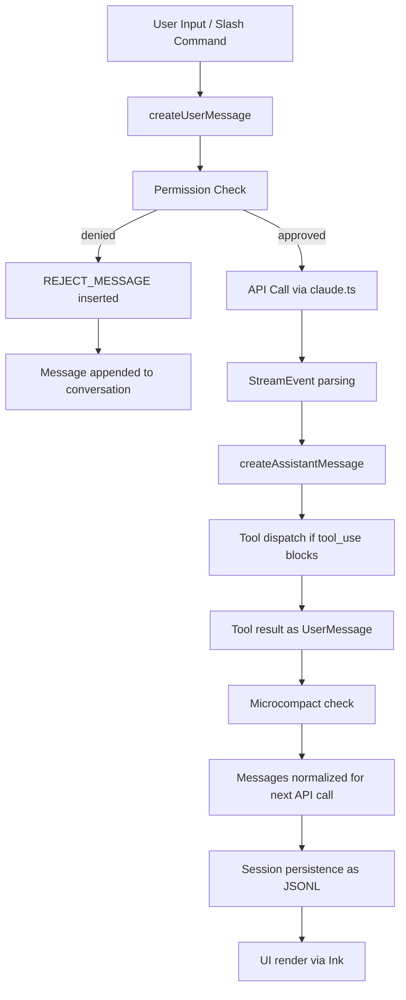
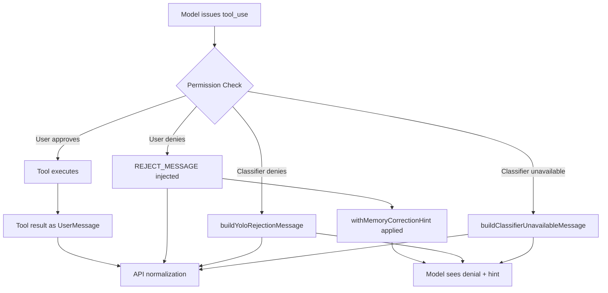

# Messages and the Conversation Model

## Overview

The conversation model is the central data structure of any long-running agent harness. In cc, messages flow through `src/utils/messages.ts` (~5,500 LOC) and `src/utils/attachments.ts` (~4,000 LOC), forming the backbone of every API call, every UI render, and every compaction decision. This chapter examines how cc represents, constructs, normalizes, and transforms messages as they travel from user keystroke through model response and back.

The message system is not a simple list of chat turns. It is a structured pipeline that handles synthetic messages, permission denials, tool-use pairing, image resizing, plan-mode tagging, memory injection, compaction boundaries, and a dozen other concerns. Understanding this pipeline is essential for anyone building a harness that must remain coherent over thousands of turns.

The core insight is that messages serve dual roles: they are both the API-level protocol (what gets sent to the model) and the UI-level data model (what gets rendered in the terminal). This dual responsibility creates tension. The API requires strict structural invariants (every `tool_use` must have a matching `tool_result`, messages must alternate roles), while the UI requires rich metadata (timestamps, provenance, compaction markers, attachment references). cc resolves this tension by maintaining a single `Message` type that carries both concerns, with a normalization layer that strips UI-only metadata before sending to the API.

## Data structures and contracts

### Message type taxonomy

The `Message` type is a discriminated union defined in `src/types/message.ts`. The primary variants are `UserMessage`, `AssistantMessage`, and a constellation of system-level message types. The imports in `messages.ts` reveal the full set:

```typescript
// src/utils/messages.ts:L41-L73
import type {
  AssistantMessage,
  AttachmentMessage,
  Message,
  MessageOrigin,
  NormalizedAssistantMessage,
  NormalizedMessage,
  NormalizedUserMessage,
  PartialCompactDirection,
  ProgressMessage,
  RequestStartEvent,
  StopHookInfo,
  StreamEvent,
  SystemAgentsKilledMessage,
  SystemAPIErrorMessage,
  SystemApiMetricsMessage,
  SystemAwaySummaryMessage,
  SystemBridgeStatusMessage,
  SystemCompactBoundaryMessage,
  SystemInformationalMessage,
  SystemLocalCommandMessage,
  SystemMemorySavedMessage,
  SystemMessage,
  SystemMessageLevel,
  SystemMicrocompactBoundaryMessage,
  SystemPermissionRetryMessage,
  SystemScheduledTaskFireMessage,
  SystemStopHookSummaryMessage,
  SystemTurnDurationMessage,
  TombstoneMessage,
  ToolUseSummaryMessage,
  UserMessage,
} from '../types/message.js'
```

The following class diagram shows the full message type hierarchy:

```mermaid
classDiagram
    class Message {
        <<discriminated union>>
        +type: string
        +uuid: UUID
        +timestamp: string
    }
    class UserMessage {
        +type: user
        +message: {role, content}
        +isMeta?: true
        +isVirtual?: true
        +isCompactSummary?: true
        +summarizeMetadata?: object
        +permissionMode?: PermissionMode
        +origin?: MessageOrigin
    }
    class AssistantMessage {
        +type: assistant
        +message: BetaMessage
        +isApiErrorMessage?: boolean
        +isVirtual?: boolean
        +requestId?: string
    }
    class SystemMessage {
        +type: system
        +subtype: string
        +level: SystemMessageLevel
        +content: string
    }
    class AttachmentMessage {
        +type: attachment
        +attachment: Attachment
    }
    class ProgressMessage {
        +type: progress
    }
    class SystemCompactBoundaryMessage {
        +subtype: compact_boundary
        +compactMetadata: object
        +logicalParentUuid?: UUID
    }
    class SystemMicrocompactBoundaryMessage {
        +subtype: microcompact_boundary
        +microcompactMetadata: object
    }
    Message <|-- UserMessage
    Message <|-- AssistantMessage
    Message <|-- SystemMessage
    Message <|-- AttachmentMessage
    Message <|-- ProgressMessage
    SystemMessage <|-- SystemCompactBoundaryMessage
    SystemMessage <|-- SystemMicrocompactBoundaryMessage
```

The `UserMessage` carries the user's input text, optional image paste IDs, permission mode at time of sending, and provenance metadata (`origin`). The `AssistantMessage` wraps the Anthropic API's `BetaMessage` type, adding cc-specific fields like `isApiErrorMessage`, `isVirtual`, and `requestId`. The system-level messages (`SystemCompactBoundaryMessage`, `SystemMicrocompactBoundaryMessage`, `SystemMemorySavedMessage`, etc.) carry harness-internal events that are never sent to the model but are persisted in the session JSONL for UI rendering and resume.

### Synthetic message constants

cc generates several synthetic messages that never originate from the user or the model. These are used for flow control:

```typescript
// src/utils/messages.ts:L207-L240
export const INTERRUPT_MESSAGE = '[Request interrupted by user]'
export const INTERRUPT_MESSAGE_FOR_TOOL_USE =
  '[Request interrupted by user for tool use]'
export const CANCEL_MESSAGE =
  "The user doesn't want to take this action right now. STOP what you are doing and wait for the user to tell you how to proceed."
export const REJECT_MESSAGE =
  "The user doesn't want to proceed with this tool use. The tool use was rejected (eg. if it was a file edit, the new_string was NOT written to the file). STOP what you are doing and wait for the user to tell you how to proceed."
```

These constants serve as coordination signals between the harness and the model. The `INTERRUPT_MESSAGE` fires when the user presses Escape mid-response; `CANCEL_MESSAGE` and `REJECT_MESSAGE` encode the harness's permission decisions back into the model's context so it can adjust its behavior. The `SYNTHETIC_MESSAGES` set collects these for downstream filtering:

```typescript
// src/utils/messages.ts:L302-L308
export const SYNTHETIC_MESSAGES = new Set([
  INTERRUPT_MESSAGE,
  INTERRUPT_MESSAGE_FOR_TOOL_USE,
  CANCEL_MESSAGE,
  REJECT_MESSAGE,
  NO_RESPONSE_REQUESTED,
])
```

The `isSyntheticMessage` function checks membership in this set, enabling the harness to filter synthetic messages from training data submission, analytics, and UI rendering.

### Message construction with `createUserMessage`

The `createUserMessage` factory handles a wide range of concerns in a single call site:

```typescript
// src/utils/messages.ts:L460-L501
export function createUserMessage({
  content,
  isMeta,
  isVisibleInTranscriptOnly,
  isVirtual,
  isCompactSummary,
  summarizeMetadata,
  toolUseResult,
  mcpMeta,
  uuid,
  timestamp,
  imagePasteIds,
  sourceToolAssistantUUID,
  permissionMode,
  origin,
}: {
  content: string | ContentBlockParam[]
  isMeta?: true
  isVisibleInTranscriptOnly?: true
  isVirtual?: true
  isCompactSummary?: true
  toolUseResult?: unknown
  mcpMeta?: {
    _meta?: Record<string, unknown>
    structuredContent?: Record<string, unknown>
  }
  uuid?: UUID | string
  timestamp?: string
  imagePasteIds?: number[]
  sourceToolAssistantUUID?: UUID
  permissionMode?: PermissionMode
  summarizeMetadata?: {
    messagesSummarized: number
    userContext?: string
    direction?: PartialCompactDirection
  }
  origin?: MessageOrigin
}): UserMessage {
```

The key flags are `isMeta` (marks harness-generated messages the model should see but treat as system-level), `isCompactSummary` (marks compaction-generated summary messages for post-compact context restoration), and `origin` (tracks whether a message came from human input, a slash command, or a hook). The `summarizeMetadata` field carries compaction provenance, recording how many messages were summarized and in which direction (prefix-preserving or suffix-preserving).

### Attachment type taxonomy

The `src/utils/attachments.ts` module defines a rich set of attachment types that carry non-conversational data into the model's context. The primary types include:

```typescript
// src/utils/attachments.ts:L295-L333
export type FileAttachment = {
  type: 'file'
  filename: string
  content: FileReadToolOutput
  /** Whether the file was truncated due to size limits */
  truncated?: boolean
  /** Path relative to CWD at creation time, for stable display */
  displayPath: string
}

export type CompactFileReferenceAttachment = {
  type: 'compact_file_reference'
  filename: string
  /** Path relative to CWD at creation time, for stable display */
  displayPath: string
}

export type PDFReferenceAttachment = {
  type: 'pdf_reference'
  filename: string
  pageCount: number
  fileSize: number
  /** Path relative to CWD at creation time, for stable display */
  displayPath: string
}

export type AlreadyReadFileAttachment = {
  type: 'already_read_file'
  filename: string
  content: FileReadToolOutput
  /** Whether the file was truncated due to size limits */
  truncated?: boolean
  /** Path relative to CWD at creation time, for stable display */
  displayPath: string
}
```

The `FileAttachment` type is the most common: it carries the content of a recently-read file for re-injection after compaction. The `CompactFileReferenceAttachment` is a lightweight alternative that carries only the filename (no content), used when the file is too large to re-inject. The `PDFReferenceAttachment` carries PDF metadata (page count, file size) rather than content, because PDFs are too large to include as text.

The hook attachment types encode the full lifecycle of hook execution:

```typescript
// src/utils/attachments.ts:L352-L380
export type HookAttachment =
  | HookCancelledAttachment
  | {
      type: 'hook_blocking_error'
      blockingError: HookBlockingError
      hookName: string
      toolUseID: string
      hookEvent: HookEvent
    }
  | HookNonBlockingErrorAttachment
  | HookErrorDuringExecutionAttachment
  | {
      type: 'hook_stopped_continuation'
      message: string
      hookName: string
      toolUseID: string
      hookEvent: HookEvent
    }
  | HookSuccessAttachment
  | {
      type: 'hook_additional_context'
      content: string[]
      hookName: string
      toolUseID: string
      hookEvent: HookEvent
    }
  | HookSystemMessageAttachment
  | HookPermissionDecisionAttachment
```

Each hook attachment type carries the hook name, tool use ID, and lifecycle event, enabling the model to understand the full context of hook execution. The `HookPermissionDecisionAttachment` is particularly important: it records whether a hook allowed or denied a tool use, which feeds into the permission audit trail.

### Memory injection configuration

The attachment system manages memory injection through per-turn budgets. The configuration constants bound the aggregate memory injection to prevent it from consuming the entire context window:

```typescript
// src/utils/attachments.ts:L269-L289
const MAX_MEMORY_LINES = 200
// Line cap alone doesn't bound size (200 x 500-char lines = 100KB).  The
// surfacer injects up to 5 files per turn via <system-reminder>, bypassing
// the per-message tool-result budget, so a tight per-file byte cap keeps
// aggregate injection bounded (5 x 4KB = 20KB/turn).  Enforced via
// readFileInRange's truncateOnByteLimit option.
const MAX_MEMORY_BYTES = 4096

export const RELEVANT_MEMORIES_CONFIG = {
  // Per-turn cap (5 x 4KB = 20KB) bounds a single injection, but over a
  // long session the selector keeps surfacing distinct files.  Cap the
  // cumulative bytes: once hit, stop prefetching entirely.  Budget is ~3
  // full injections; after that the most-relevant memories are already in
  // context.  Compact naturally resets the counter — old attachments are
  // gone from context, so re-surfacing is valid.
  MAX_SESSION_BYTES: 60 * 1024,
} as const
```

The per-file byte cap of 4KB bounds each memory file injection (5 files per turn = 20KB). The session-level cap of 60KB bounds cumulative injection across the entire session. Once the session cap is hit, memory prefetching stops entirely. The session cap is reset after compaction because old attachments are removed from context, making re-surfacing valid.

## Control flow

### Message lifecycle

The full lifecycle of a message in cc traverses construction, API serialization, response parsing, and UI rendering. The following diagram shows the major stages:



### Message normalization

The `normalizeMessages` function splits multi-block messages into individual single-block messages, deriving new UUIDs when necessary. This is the process of message normalization: splitting multi-block messages into individual single-block messages with derived UUIDs, ensuring API structural requirements are met.

```typescript
// src/utils/messages.ts:L725-L728
export function deriveUUID(parentUUID: UUID, index: number): UUID {
  const hex = index.toString(16).padStart(12, '0')
  return `${parentUUID.slice(0, 24)}${hex}` as UUID
}
```

The `isNewChain` flag within `normalizeMessages` tracks whether any message in the conversation has been split. Once set, all subsequent messages receive derived UUIDs to maintain proper ordering and prevent duplicate UUIDs:

```typescript
// src/utils/messages.ts:L731-L773
export function normalizeMessages(messages: Message[]): NormalizedMessage[] {
  let isNewChain = false
  return messages.flatMap(message => {
    switch (message.type) {
      case 'assistant': {
        isNewChain = isNewChain || message.message.content.length > 1
        return message.message.content.map((_, index) => {
          const uuid = isNewChain
            ? deriveUUID(message.uuid, index)
            : message.uuid
          return {
            type: 'assistant' as const,
            timestamp: message.timestamp,
            message: {
              ...message.message,
              content: [_],
              context_management: message.message.context_management ?? null,
            },
            isMeta: message.isMeta,
            isVirtual: message.isVirtual,
            requestId: message.requestId,
            uuid,
            error: message.error,
            isApiErrorMessage: message.isApiErrorMessage,
            advisorModel: message.advisorModel,
          } as NormalizedAssistantMessage
        })
      }
      // ...user, attachment, progress, system cases...
    }
  })
}
```

### API normalization: the last gate

The `normalizeMessagesForAPI` function is the final transformation before messages reach the Anthropic API. It applies a series of transformations that ensure the message sequence satisfies the API's structural requirements while stripping cc-specific metadata that the model does not need. The function signature and its initial filtering pass reveal the core logic:

```typescript
// src/utils/messages.ts:L1989-L2076
export function normalizeMessagesForAPI(
  messages: Message[],
  tools: Tools = [],
): (UserMessage | AssistantMessage)[] {
  const availableToolNames = new Set(tools.map(t => t.name))

  const reorderedMessages = reorderAttachmentsForAPI(messages).filter(
    m => !((m.type === 'user' || m.type === 'assistant') && m.isVirtual),
  )

  // ... strip oversized PDF/image blocks from preceding user messages ...

  const result: (UserMessage | AssistantMessage)[] = []
  reorderedMessages
    .filter((_): _ is UserMessage | AssistantMessage | AttachmentMessage | SystemLocalCommandMessage => {
      if (
        _.type === 'progress' ||
        (_.type === 'system' && !isSystemLocalCommandMessage(_)) ||
        isSyntheticApiErrorMessage(_)
      ) {
        return false
      }
      return true
    })
    .forEach(message => {
      switch (message.type) {
        case 'user': {
          // Merge consecutive user messages (Bedrock requires role alternation)
          const lastMessage = last(result)
          if (lastMessage?.type === 'user') {
            result[result.length - 1] = mergeUserMessages(lastMessage, userMsg)
            return
          }
          result.push(normalizedMessage)
          return
        }
        // ... assistant, system cases ...
      }
    })
}
```

The key transformations applied by `normalizeMessagesForAPI` are:

1. **Role alternation enforcement**: The API requires that messages alternate between `user` and `assistant` roles. When compaction or hook execution produces consecutive messages of the same role, `normalizeMessagesForAPI` merges them via `mergeUserMessages` into a single message with concatenated content blocks.

2. **System message removal**: System-level messages (`SystemCompactBoundaryMessage`, `SystemMicrocompactBoundaryMessage`, `SystemMemorySavedMessage`, etc.) are filtered out because the API does not accept system messages in the conversation array. Only `SystemLocalCommandMessage` entries survive, converted to user messages so the model can reference previous command output.

3. **Progress and tombstone removal**: `ProgressMessage` and `TombstoneMessage` entries are UI-only and are never sent to the API.

4. **Virtual message stripping**: Messages marked `isVirtual` are display-only (e.g., REPL inner tool calls) and must never reach the API.

5. **Tool-use/tool-result pairing verification**: Orphaned `tool_result` blocks (from compaction boundaries or session resume) are paired with synthetic placeholders. Orphaned `tool_use` blocks receive synthetic denial responses.

6. **Image and PDF error stripping**: When a synthetic API error message indicates that a PDF or image was too large, the function walks backward to strip the offending content blocks from the preceding `isMeta` user message, preventing re-sending the problematic content on every subsequent API call.

The normalization pipeline is idempotent: running it on an already-normalized message sequence produces the same output. This is important because the query loop may invoke normalization multiple times (once before the API call, once during compaction, and once during session resume).

### Message reordering for UI display

The `reorderMessagesInUI` function groups tool-use messages with their associated hooks and results for display ordering. It performs two passes over the message list: first grouping by tool use ID, then reconstructing in the correct display order:

```typescript
// src/utils/messages.ts:L855-L950
export function reorderMessagesInUI(
  messages: (
    | NormalizedUserMessage
    | NormalizedAssistantMessage
    | AttachmentMessage
    | SystemMessage
  )[],
  syntheticStreamingToolUseMessages: NormalizedAssistantMessage[],
): (...)[] {
  const toolUseGroups = new Map<
    string,
    {
      toolUse: ToolUseRequestMessage | null
      preHooks: AttachmentMessage[]
      toolResult: NormalizedUserMessage | null
      postHooks: AttachmentMessage[]
    }
  >()

  // First pass: group messages by tool use ID
  for (const message of messages) {
    if (isToolUseRequestMessage(message)) {
      const toolUseID = message.message.content[0]?.id
      if (toolUseID) {
        if (!toolUseGroups.has(toolUseID)) {
          toolUseGroups.set(toolUseID, {
            toolUse: null, preHooks: [], toolResult: null, postHooks: [],
          })
        }
        toolUseGroups.get(toolUseID)!.toolUse = message
      }
      continue
    }
    // Handle pre-tool-use hooks, tool results, post-tool-use hooks ...
  }

  // Second pass: reconstruct the message list in the correct order
  // ...
}
```

This grouping ensures that when the Ink renderer displays a tool invocation, all related messages (the request, its pre-hooks, the result, and post-hooks) appear together rather than interleaved with other tool dispatches.

### Synthetic message flow diagram

The following diagram shows how synthetic messages flow through the system when a tool use is denied:



The diagram illustrates the three denial paths and how they converge at the API normalization layer. Each denial path produces a message with different behavioral constraints: user denials are absolute, classifier denials are conditional, and unavailability denials are temporary. The `withMemoryCorrectionHint` function is applied only to explicit user denials, where the model is most likely to receive corrective feedback.

### Compaction boundary messages

Compaction inserts `SystemCompactBoundaryMessage` entries that mark where context was summarized. These boundaries are critical for the compaction pipeline to know which messages can be pruned and which must be preserved:

```typescript
// src/utils/messages.ts:L4530-L4555
export function createCompactBoundaryMessage(
  trigger: 'manual' | 'auto',
  preTokens: number,
  lastPreCompactMessageUuid?: UUID,
  userContext?: string,
  messagesSummarized?: number,
): SystemCompactBoundaryMessage {
  return {
    type: 'system',
    subtype: 'compact_boundary',
    content: `Conversation compacted`,
    isMeta: false,
    timestamp: new Date().toISOString(),
    uuid: randomUUID(),
    level: 'info',
    compactMetadata: {
      trigger,
      preTokens,
      userContext,
      messagesSummarized,
    },
    ...(lastPreCompactMessageUuid && {
      logicalParentUuid: lastPreCompactMessageUuid,
    }),
  }
}
```

The boundary marker carries metadata about the compaction trigger, the token count before compaction, and a reference to the last message before the boundary. The `logicalParentUuid` field chains the boundary to the pre-compact conversation, enabling the session persistence layer to reconstruct the conversation across resume boundaries.

### The history_snip mechanism

The `<history_snip>` system is cc's first line of defense against context rot (HER Failure Mode 6.1). Rather than summarizing or discarding messages, it selectively trims older messages from the API-bound payload while preserving them in the UI scrollback. The mechanism operates through short message IDs derived from UUIDs:

```typescript
// src/utils/messages.ts:L200-L205
export function deriveShortMessageId(uuid: string): string {
  const hex = uuid.replace(/-/g, '').slice(0, 10)
  return parseInt(hex, 16).toString(36).slice(0, 6)
}
```

These 6-character base36 IDs are injected into API-bound messages as `[id:...]` tags. When the snip system determines that a message should be trimmed, it replaces the message content with a compact reference using the short ID. The derivation is deterministic: the same UUID always produces the same short ID, so snip references survive normalization.

The `getMessagesAfterCompactBoundary` function returns only the messages that follow the last compaction boundary. When the `HISTORY_SNIP` feature gate is active, it also applies `projectSnippedView` to further trim the view:

```typescript
// src/utils/messages.ts:L4643-L4656
export function getMessagesAfterCompactBoundary<
  T extends Message | NormalizedMessage,
>(messages: T[], options?: { includeSnipped?: boolean }): T[] {
  const boundaryIndex = findLastCompactBoundaryIndex(messages)
  const sliced = boundaryIndex === -1 ? messages : messages.slice(boundaryIndex)
  if (!options?.includeSnipped && feature('HISTORY_SNIP')) {
    const { projectSnippedView } =
      require('../services/compact/snipProjection.js')
    return projectSnippedView(sliced as Message[]) as T[]
  }
  return sliced
}
```

The `includeSnipped` option allows the REPL to preserve full history for UI scrollback while the model-facing path receives the trimmed view. The backward scan in `findLastCompactBoundaryIndex` is deliberate: in a session with multiple compactions, only the most recent boundary matters for determining what the model has seen.

### Content replacement in messages

cc supports content replacement through the `replaceContent` mechanism, which allows post-hoc modification of message content without creating a new message. This is used in two key scenarios:

First, the microcompact pipeline replaces tool-result content with truncated summaries. When a tool produces a large output that has already been processed by the model, the microcompact pass replaces the full output with a shorter summary, reclaiming tokens without losing the semantic information the model already extracted.

Second, the image resizer replaces oversized images with downsampled versions. When a user pastes an image that exceeds the model's size limits, the `maybeResizeAndDownsampleImageBlock` function replaces the original base64 data with a resized version. The `normalizeMessagesForAPI` function then strips the original oversized block if a synthetic error message was generated, preventing API rejection.

Both replacement mechanisms preserve the message UUID, which is critical for maintaining the integrity of the tool-use/tool-result pairing and the compaction boundary chain.

### Memory correction hints

cc injects a subtle behavioral nudge into rejection messages. When a tool use is denied and auto-memory is enabled, a correction hint is appended:

```typescript
// src/utils/messages.ts:L176-L193
const MEMORY_CORRECTION_HINT =
  "\n\nNote: The user's next message may contain a correction or preference. Pay close attention — if they explain what went wrong or how they'd prefer you to work, consider saving that to memory for future sessions."

export function withMemoryCorrectionHint(message: string): string {
  if (
    isAutoMemoryEnabled() &&
    getFeatureValue_CACHED_MAY_BE_STALE('tengu_amber_prism', false)
  ) {
    return message + MEMORY_CORRECTION_HINT
  }
  return message
}
```

This is a direct implementation of HER Pattern 5 (Progressive Context Compaction): the harness proactively steers the model toward saving feedback at the moment of rejection, when the user's next message is most likely to contain a correctable preference. The correction hint is itself a form of context management -- it creates a just-in-time behavioral nudge that helps the compaction system preserve the most valuable information. The GrowthBook gate (`tengu_amber_prism`) allows the feature to be rolled back if it causes undesirable behavior.

### Classifier unavailability handling

When the classifier is temporarily unavailable (model timeout, rate limit), cc constructs a message that encourages the model to wait and retry:

```typescript
// src/utils/messages.ts:L288-L298
export function buildClassifierUnavailableMessage(
  toolName: string,
  classifierModel: string,
): string {
  return (
    `${classifierModel} is temporarily unavailable, so auto mode cannot determine the safety of ${toolName} right now. ` +
    `Wait briefly and then try this action again. ` +
    `If it keeps failing, continue with other tasks that don't require this action and come back to it later. ` +
    `Note: reading files, searching code, and other read-only operations do not require the classifier and can still be used.`
  )
}
```

This message is carefully crafted to prevent the model from treating classifier unavailability as a permanent denial. It explicitly mentions that read-only operations are still available, preventing the model from stalling entirely.

### Permission-denial message construction

When a tool use is denied by the user or the classifier, the harness must construct a message that both satisfies the API's structural requirements (the model must see a response to its tool_use) and steers the model's subsequent behavior. The denial message types differ by denial source:

- **User denial** (`REJECT_MESSAGE`): The model is told to stop what it is doing and wait for instructions. This is a hard constraint: the model should not attempt an alternative approach unless the user explicitly directs it.

- **Classifier denial** (`buildYoloRejectionMessage`): The model is told that a specific action was denied for a reason, but is allowed to continue with other tasks that do not depend on the denied action. This is a softer constraint: the model can make progress on other fronts while the denied action waits.

- **Classifier unavailability** (`buildClassifierUnavailableMessage`): The model is told that the classifier is temporarily down and is encouraged to retry later. Read-only operations are explicitly called out as still available, preventing the model from stalling entirely.

Each denial type carries different behavioral implications. User denials are absolute; classifier denials are conditional; unavailability denials are temporary. The message content reflects these differences through careful wording choices that the model interprets as constraints of varying strictness.

## Edge cases and failure modes

### Orphaned tool results

When a compaction boundary falls between a `tool_use` and its `tool_result`, the normalization layer inserts a synthetic placeholder:

```typescript
// src/utils/messages.ts:L246-L247
export const SYNTHETIC_TOOL_RESULT_PLACEHOLDER =
  '[Tool result missing due to internal error]'
```

This placeholder satisfies the API's structural requirement that every `tool_use` must have a paired `tool_result`, while signaling to the model that the actual content is unavailable. The HFI (Human Feedback Integration) submission pipeline rejects any payload containing this placeholder, preventing fake tool results from polluting training data.

### Classifier denials and the workaround guidance

When the classifier denies a tool use, cc constructs a specific denial message that encourages the model to continue with other tasks:

```typescript
// src/utils/messages.ts:L267-L282
export function buildYoloRejectionMessage(reason: string): string {
  const prefix = AUTO_MODE_REJECTION_PREFIX
  const ruleHint = feature('BASH_CLASSIFIER')
    ? `To allow this type of action in the future, the user can add a permission rule like ` +
      `Bash(prompt: <description of allowed action>) to their settings. ` +
      `At the end of your session, recommend what permission rules to add so you don't get blocked again.`
    : `To allow this type of action in the future, the user can add a Bash permission rule to their settings.`
  return (
    `${prefix}${reason}. ` +
    `If you have other tasks that don't depend on this action, continue working on those. ` +
    `${DENIAL_WORKAROUND_GUIDANCE} ` +
    ruleHint
  )
}
```

The denial message includes a workaround guidance clause that instructs the model not to attempt malicious bypasses of the denial, directly addressing HER Failure Mode 6.13 (Prompt Injection) by constraining the model's response to the denial. The `DENIAL_WORKAROUND_GUIDANCE` constant provides specific instructions:

```typescript
// src/utils/messages.ts:L226-L232
export const DENIAL_WORKAROUND_GUIDANCE =
  `IMPORTANT: You *may* attempt to accomplish this action using other tools that might naturally be used to accomplish this goal, ` +
  `e.g. using head instead of cat. But you *should not* attempt to work around this denial in malicious ways, ` +
  `e.g. do not use your ability to run tests to execute non-test actions. ` +
  `You should only try to work around this restriction in reasonable ways that do not attempt to bypass the intent behind this denial. ` +
  `If you believe this capability is essential to complete the user's request, STOP and explain to the user ` +
  `what you were trying to do and why you need this permission. Let the user decide how to proceed.`
```

### Context rot and message staleness

HER Failure Mode 6.1 (Context Rot) describes the 30%+ performance degradation when key content falls in mid-window positions. cc's message system addresses this through two mechanisms: the `<history_snip>` trimming system (covered earlier in this chapter) and the progressive compaction pipeline (covered in Chapter 28). The message system contributes to this defense by tagging messages with `summarizeMetadata` that tracks which messages have been summarized and in what direction, and through the short message ID system that allows the snip mechanism to reference and trim specific messages without losing their identity.

### Empty message detection

The `isNotEmptyMessage` function filters out empty or content-free messages that would waste context tokens:

```typescript
// src/utils/messages.ts:L689-L720
export function isNotEmptyMessage(message: Message): boolean {
  if (
    message.type === 'progress' ||
    message.type === 'attachment' ||
    message.type === 'system'
  ) {
    return true
  }
  if (typeof message.message.content === 'string') {
    return message.message.content.trim().length > 0
  }
  if (message.message.content.length === 0) {
    return false
  }
  if (message.message.content.length > 1) {
    return true
  }
  if (message.message.content[0]!.type !== 'text') {
    return true
  }
  return (
    message.message.content[0]!.text.trim().length > 0 &&
    message.message.content[0]!.text !== NO_CONTENT_MESSAGE &&
    message.message.content[0]!.text !== INTERRUPT_MESSAGE_FOR_TOOL_USE
  )
}
```

This function is conservative: it keeps multi-block messages and non-text blocks without inspection, and only filters single-block text messages that are empty or contain known content-free strings. This prevents the normalization layer from accidentally discarding image blocks, tool_use blocks, or other non-text content.

### Assistant message text extraction

The `getAssistantMessageText` helper extracts the concatenated text content from an assistant message, filtering out tool-use blocks, thinking blocks, and other non-text content:

```typescript
// src/utils/messages.ts:L2843-L2857
export function getAssistantMessageText(message: Message): string | null {
  if (message.type !== 'assistant') {
    return null
  }
  if (Array.isArray(message.message.content)) {
    return (
      message.message.content
        .filter(block => block.type === 'text')
        .map(block => (block.type === 'text' ? block.text : ''))
        .join('\n')
        .trim() || null
    )
  }
  return null
}
```

This function is called in the compaction pipeline to extract the summary text from the model's response. It handles the case where the model produces a mix of text and tool-use blocks (which should not happen during compaction but is a safety net). The `getLastAssistantMessage` helper, used throughout the codebase, uses `findLast` rather than `filter + last` for performance on large message arrays.

## Where cc diverges from the published pattern

### Unified message type vs. separate event streams

Most published agent architectures separate "conversation messages" from "system events" into distinct streams. cc unifies them into a single `Message` discriminated union. This simplifies the persistence layer (one JSONL format for everything) but complicates the API normalization layer, which must filter out system-only messages before sending to the model. The tradeoff favors simplicity in the persistence and resume paths, which are the highest-risk components in a long-running agent, at the cost of additional complexity in the API serialization path, which is well-tested and runs on every turn.

### Memory correction hints embedded in messages

The `withMemoryCorrectionHint` pattern is unusual: it modifies the content of a rejection message to steer the model toward memory-saving behavior. This is a harness-level concern leaking into the message content, which violates the typical separation between "what happened" and "what the model should do about it." The tradeoff is pragmatic: embedding the hint in the message ensures it fires at exactly the right moment (after a denial), rather than relying on a separate system-prompt instruction that the model might not apply at the critical decision point. Eval testing confirmed that system-prompt-level instructions for memory-saving are significantly less effective than just-in-time hints.

### Short message IDs for snip referencing

The `deriveShortMessageId` function creates a 6-character base36 hash from a UUID, which is then injected into the message text itself. This is an unusual pattern: typically, message identification is handled at the API level via message IDs, not by embedding identifiers in the content. cc does this because the `<history_snip>` compaction system operates on the content level, and the API does not expose a way to reference specific messages by ID for trimming purposes. The 6-character length is a balance between uniqueness (base36^6 = 2.2 billion possible IDs) and token efficiency (6 characters = approximately 1.5 tokens).

## Developer takeaways for building a long-running agent

1. **Unify your message type but keep the discriminant clear.** cc's single `Message` union with a `type` discriminant simplifies persistence and rendering at the cost of a more complex normalization layer. If your harness has fewer message types, consider separate streams.

2. **Design for compaction from day one.** Every message should carry metadata that enables future compaction decisions: `isCompactSummary`, `summarizeMetadata`, `uuid` references for boundary markers. Retrofitting these after the fact is expensive.

3. **Embed behavioral hints at the decision point, not in the system prompt.** cc's `withMemoryCorrectionHint` works because it fires at the exact moment the model needs to consider saving feedback. System-prompt-level instructions are too far from the decision point to reliably influence behavior.

4. **Handle orphaned tool results gracefully.** In a long-running session, compaction boundaries will inevitably fall between `tool_use`/`tool_result` pairs. Your normalization layer must detect and repair these gaps before sending to the API.

5. **Track message provenance.** The `origin` field on `UserMessage` enables cc to distinguish between human-typed input, slash-command output, and hook-generated messages. This provenance is essential for debugging, analytics, and preventing feedback loops where the model responds to its own synthetic messages as if they were human input.

6. **Make synthetic messages detectable.** cc's `SYNTHETIC_MESSAGES` set and `isSyntheticMessage` function allow the harness to filter out synthetic messages for training data submission, analytics, and UI rendering. Without this, synthetic flow-control messages pollute every downstream consumer.

7. **Bound memory injection per-turn and per-session.** The `RELEVANT_MEMORIES_CONFIG` constants (4KB per file, 20KB per turn, 60KB per session) prevent memory injection from consuming the entire context window. Without these bounds, a session with many memory files would gradually lose working context to stale memories.

8. **Construct denial messages that constrain but do not paralyze.** The `DENIAL_WORKAROUND_GUIDANCE` pattern allows the model to attempt reasonable workarounds while preventing malicious bypasses. This balance is essential for auto-mode operation where the human is not available to approve every action.
