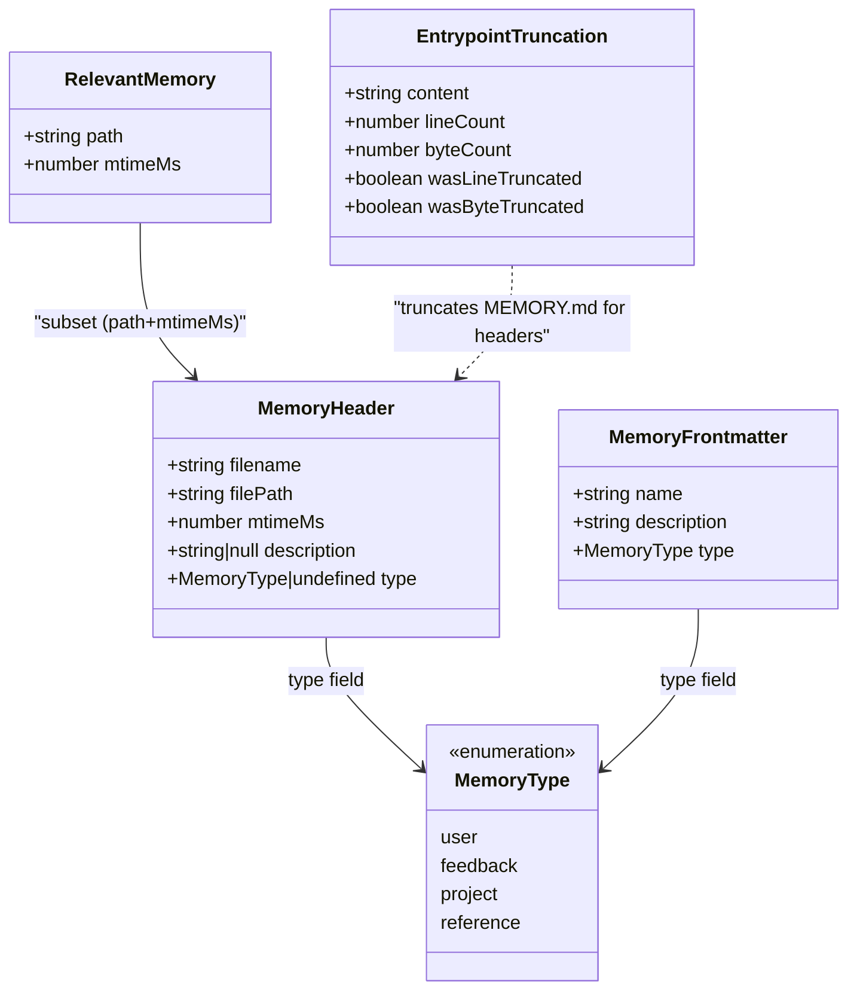
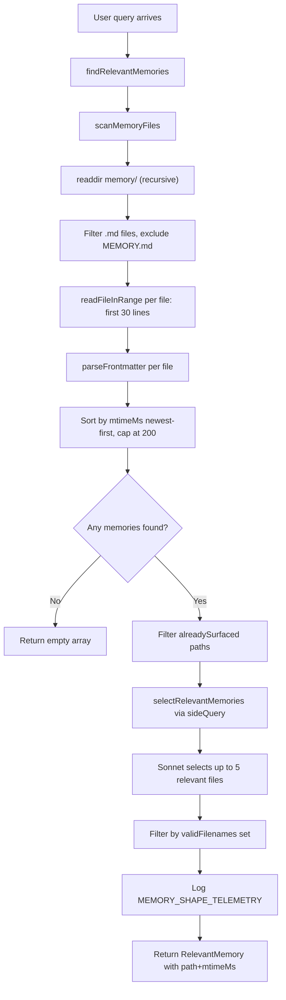

# Memdir: Tiered Memory on Disk

## Overview

The memdir subsystem is cc's implementation of HER Pattern 3 (Tiered Memory): a disk-based, file-structured memory system that persists across sessions, supports semantic retrieval, and enforces a closed type taxonomy. The core implementation lives in `src/memdir/`, with six modules: `memdir.ts` (prompt construction and entrypoint management), `memoryTypes.ts` (type taxonomy and behavioral instructions), `paths.ts` (path resolution and security validation), `findRelevantMemories.ts` (relevance-based retrieval), `memoryScan.ts` (directory scanning primitives), and `memoryAge.ts` (staleness tracking).

The tiered-memory pattern splits persistent context into three layers. At the top sits MEMORY.md, a compact index always loaded into the system prompt, capped at 200 lines and 25 KB (`src/memdir/memdir.ts:L35-L38`). Below the index are individual topic files -- one Markdown document per memory, each with YAML frontmatter declaring its name, description, and type. At the bottom are full session transcripts stored as JSONL, accessible only via grep search as a last resort. This stratification mirrors HER's observation that a compact index always in context plus on-demand detail files yields better recall than loading everything at once.

The subsystem is also an instance of HER section 7.1 (Persistent Instruction File): the MEMORY.md entrypoint functions identically to CLAUDE.md in that it is deterministically injected into the system prompt every session, and the same ETH Zurich finding from HER section 7.1 applies -- verbose memory indexes hurt rather than help, so cc enforces hard size caps to keep the index concise. HER section 7.1 documents the finding that persistent instruction files (such as AGENTS.md and CLAUDE.md) can reduce agent task success rates when they are verbose or unfocused, and cc's MEMORY.md design directly applies this lesson through its 200-line / 25 KB caps and its "what NOT to save" exclusions. The ETH Zurich study (arXiv:2602.11988, "Evaluating AGENTS.md") found that context files tend to reduce task success rates compared to providing no repository context, while also increasing inference cost by over 20%. This finding challenges the common assumption that detailed context files improve agent performance, and cc's design responds to it directly through entrypoint caps and memory-type exclusions.

The interaction between these three tiers is not static. During a query, a side query (a secondary API call using Sonnet) evaluates which topic files are relevant to the current user request, loading up to five into context. This is the key insight of the tiered approach: the entrypoint is always present (constant cost), topic files are loaded on demand (marginal cost only when needed), and full transcripts are searched only as a last resort (high cost, rare use).

```mermaid
%% Diagram (a): erDiagram of memdir storage
erDiagram
    MEMORY_MD ||--o{ TOPIC_FILE : indexes
    TOPIC_FILE {
        string filename
        string description
        string type
        number mtimeMs
    }
    MEMORY_MD {
        int maxLines 200
        int maxBytes 25000
        string content "one-line pointers to topic files"
    }
    SESSION_JSONL {
        string format "JSONL"
        string access "grep only, last resort"
    }
    TOPIC_FILE ||--o| SESSION_JSONL : "searchable via"

    AUTO_MEMORY {
        string basePath "~/.claude/projects/sanitized-git-root/memory/"
    }
    TEAM_MEMORY {
        string basePath "auto-memory/team/"
    }
    AUTO_MEMORY ||--o| TEAM_MEMORY : "may contain"
```

## Data structures and contracts

### MemoryType taxonomy

Memdir constrains memories to a closed four-type taxonomy: `user`, `feedback`, `project`, and `reference`. Content that is derivable from the current project state (code patterns, architecture, git history, file structure) is explicitly excluded from memory -- those sources already exist in the repository and CLAUDE.md. The type definitions are intentionally duplicated as flat constants rather than generated from a shared spec, keeping per-mode edits trivial without reasoning through conditional rendering:

```typescript
// src/memdir/memoryTypes.ts:L14-L21
export const MEMORY_TYPES = [
  'user',
  'feedback',
  'project',
  'reference',
] as const

export type MemoryType = (typeof MEMORY_TYPES)[number]
```

Each type has a defined purpose with detailed behavioral instructions stored in `TYPES_SECTION_COMBINED` and `TYPES_SECTION_INDIVIDUAL` constants at `src/memdir/memoryTypes.ts:L37-L178`. The combined variant (used when both private and team directories are active) includes `<scope>` tags and team/private qualifiers in examples; the individual variant strips these for single-directory mode.

`user` memories capture information about the user's role, goals, responsibilities, and knowledge. They are always private in scope. The behavioral instruction explicitly warns against writing memories that could be viewed as a negative judgment or that are not relevant to the work at hand.

`feedback` memories record guidance the user has given about how to approach work -- both corrections ("stop doing X") and confirmed approaches ("yes, keep doing that"). The type definition emphasizes recording from both failure and success: if only corrections are saved, the model avoids past mistakes but drifts away from validated approaches and may grow overly cautious. The default scope is private, with team scope reserved for project-wide conventions like testing policies or build invariants.

`project` memories store non-derivable project context: who is doing what, why, and by when. The type definition requires converting relative dates to absolute dates when saving (for example, "Thursday" becomes "2026-03-05") so the memory remains interpretable after time passes. The body structure mandates a rule/fact lead, then a "Why:" line and a "How to apply:" line, because project memories decay fast and the reasoning helps future sessions judge whether the memory is still load-bearing.

`reference` memories point to external systems like dashboards or issue trackers. They are usually team-scoped. The type definition explicitly scopes these to pointers to information in external systems, not the information itself.

The `parseMemoryType` function at `src/memdir/memoryTypes.ts:L28-L31` gracefully handles invalid or missing type fields, returning `undefined` for legacy files without a `type:` field:

```typescript
// src/memdir/memoryTypes.ts:L28-L31
export function parseMemoryType(raw: unknown): MemoryType | undefined {
  if (typeof raw !== 'string') return undefined
  return MEMORY_TYPES.find(t => t === raw)
}
```

### What NOT to save

The `WHAT_NOT_TO_SAVE_SECTION` at `src/memdir/memoryTypes.ts:L183-L195` is a critical design element that directly implements the HER section 7.1 finding. It excludes code patterns, conventions, architecture, file paths, project structure, git history, debugging solutions, anything in CLAUDE.md, and ephemeral task details. The section includes an explicit-save gate: these exclusions apply even when the user explicitly asks the model to save something. If the user asks to save a PR list or activity summary, the model is instructed to ask what was surprising or non-obvious about it -- that is the part worth keeping.

### MemoryHeader and scan results

The scan subsystem returns a `MemoryHeader` type for each discovered memory file:

```typescript
// src/memdir/memoryScan.ts:L13-L19
export type MemoryHeader = {
  filename: string
  filePath: string
  mtimeMs: number
  description: string | null
  type: MemoryType | undefined
}
```

This type bridges the scanning and retrieval layers: `scanMemoryFiles` produces `MemoryHeader[]` sorted newest-first, and `findRelevantMemories` consumes it to select the most relevant subset. The `description` field comes from the frontmatter `description:` key, and may be `null` for legacy files without this field. The `type` field may be `undefined` for files with unknown or missing type values, allowing graceful degradation.

### RelevantMemory and retrieval results

The retrieval layer returns a slimmer type that omits the description (already consumed by the selector):

```typescript
// src/memdir/findRelevantMemories.ts:L13-L16
export type RelevantMemory = {
  path: string
  mtimeMs: number
}
```

The `mtimeMs` field is threaded through the entire pipeline so callers can surface freshness information to the main model without a second stat call. This is a deliberate design: the scan already stats the file to obtain `mtimeMs`, and passing it forward avoids redundant I/O in the recall path. The `path` field is the absolute file path, used by the attachment system to load the memory file into the conversation. Callers like `messages.ts` use the `mtimeMs` to construct the `memoryHeader` prefix (discussed in the Memory freshness section below), which tells the main model when the memory was last modified and whether it might be stale.

### EntrypointTruncation

The entrypoint (MEMORY.md) has dual caps -- 200 lines and 25 KB -- enforced by `truncateEntrypointContent` at `src/memdir/memdir.ts:L57-L103`. The truncation result type is:

```typescript
// src/memdir/memdir.ts:L41-L47
export type EntrypointTruncation = {
  content: string
  lineCount: number
  byteCount: number
  wasLineTruncated: boolean
  wasByteTruncated: boolean
}
```

Line-truncation fires first (natural boundary), then byte-truncation cuts at the last newline before the cap to avoid mid-line splits. The warning message appended to truncated content names which cap fired and provides actionable guidance: "Keep index entries to one line under ~200 chars; move detail into topic files."

### Memory frontmatter format

Each memory file uses a standard frontmatter format with the `name`, `description`, and `type` fields, defined in `MEMORY_FRONTMATTER_EXAMPLE` at `src/memdir/memoryTypes.ts:L261-L271`:

```typescript
// src/memdir/memoryTypes.ts:L261-L271
export const MEMORY_FRONTMATTER_EXAMPLE: readonly string[] = [
  '```markdown',
  '---',
  'name: {{memory name}}',
  'description: {{one-line description — used to decide relevance in future conversations, so be specific}}',
  `type: {{${MEMORY_TYPES.join(', ')}}}`,
  '---',
  '',
  '{{memory content — for feedback/project types, structure as: rule/fact, then **Why:** and **How to apply:** lines}}',
  '```',
]
```

The `description` field is critical: it is the primary signal used by the relevance selector to decide whether to load a memory. The frontmatter template explicitly instructs the model to be specific in descriptions, because vague descriptions lead to poor relevance selection.



## Control flow

### Auto-memory enablement

The `isAutoMemoryEnabled` function at `src/memdir/paths.ts:L30-L55` evaluates a priority chain. The first defined value wins:

1. The `CLAUDE_CODE_DISABLE_AUTO_MEMORY` environment variable (1/true means OFF, 0/false means ON).
2. `CLAUDE_CODE_SIMPLE` mode (the `--bare` flag) -- if this is set, memory is disabled because prompts.ts already drops the memory section from the system prompt via its SIMPLE early-return, and this gate stops the other half (extractMemories turn-end fork, autoDream, /remember, /dream, team sync).
3. CCR without persistent storage -- remote agents without `CLAUDE_CODE_REMOTE_MEMORY_DIR` have nowhere to persist.
4. `autoMemoryEnabled` in `settings.json`, which supports project-level opt-out.
5. The default of enabled.

This cascade pattern mirrors the settings cascade described in Chapter 31, where later sources override earlier ones. The `--bare` flag path is worth noting: even though `prompts.ts` already drops the memory section from the system prompt in SIMPLE mode via its early-return, the `isAutoMemoryEnabled` gate stops the other half of memory functionality that operates outside the prompt path -- the extractMemories turn-end fork, the autoDream background consolidation, the `/remember` and `/dream` slash commands, and the team sync mechanism. Without this gate, those subsystems would still attempt to operate even though no memory prompt was injected.

### Extraction mode

The `isExtractModeActive` function at `src/memdir/paths.ts:L69-L77` gates whether the extract-memories background agent will run during a session. It requires the `tengu_passage_quail` GrowthBook feature flag, and either an interactive session or the `tengu_slate_thimble` feature flag for non-interactive sessions. The main agent's prompt always has full save instructions regardless of this gate -- when the main agent writes memories, the background agent skips that range (via `hasMemoryWritesSince` in `extractMemories.ts`); when it does not, the background agent catches anything missed.

### Path resolution

The auto-memory directory path is resolved by `getAutoMemPath` at `src/memdir/paths.ts:L223-L235`, which is memoized via `lodash-es/memoize` to avoid repeated `getSettingsForSource` calls during re-renders. The memoization key is `getProjectRoot()`, so tests that change its mock mid-block recompute correctly. In production, environment variables, settings.json, and CLAUDE_CONFIG_DIR are session-stable and covered by per-test cache clearing.

The resolution order is:

1. `CLAUDE_COWORK_MEMORY_PATH_OVERRIDE` environment variable (full-path override for Cowork).
2. `autoMemoryDirectory` in `settings.json` from trusted sources only: policySettings, flagSettings, localSettings, userSettings -- but not projectSettings.
3. The computed path `<memoryBase>/projects/<sanitized-git-root>/memory/`.

The computed path in option 3 uses `getAutoMemBase` at `src/memdir/paths.ts:L203-L205`, which returns the canonical git repo root if available (so all worktrees of the same repo share one auto-memory directory), otherwise falling back to the stable project root. The canonical root is resolved via `findCanonicalGitRoot` from `src/utils/git.js`, which traverses up from the project root to find the actual `.git` directory -- this is important for worktree scenarios where multiple working directories share the same repository. Without this deduplication, each worktree would create its own memory directory, fragmenting the memory pool. The base directory itself is resolved by `getMemoryBaseDir` at `src/memdir/paths.ts:L85-L90`, which checks `CLAUDE_CODE_REMOTE_MEMORY_DIR` first (explicit override for CCR), then falls back to `~/.claude` via `getClaudeConfigHomeDir`.

### Path validation and security

Path validation in `validateMemoryPath` at `src/memdir/paths.ts:L109-L150` rejects paths that would be dangerous as a read-allowlist root. The function checks for five categories of dangerous paths: relative paths (would be interpreted relative to CWD), root or near-root paths (length < 3), Windows drive roots (C: regex), UNC paths (network paths representing an opaque trust boundary), and null bytes (which survive normalize() and can truncate in syscalls). The function normalizes the candidate path, strips trailing separators, and returns the result with exactly one trailing separator to match the trailing-sep contract of `getAutoMemPath`.

Settings.json paths support `~/` expansion for user convenience, while the environment variable override does not (it is set programmatically by Cowork/SDK, which should always pass absolute paths). Bare `~`, `~/`, `~/.`, `~/..` are not expanded because they would make `isAutoMemPath` match all of `$HOME` or its parent.

The `isAutoMemPath` function at `src/memdir/paths.ts:L274-L278` normalizes the input path to prevent traversal bypasses via `..` segments, then checks whether it starts with `getAutoMemPath()`. When `CLAUDE_COWORK_MEMORY_PATH_OVERRIDE` is set, this matches against the override directory. A true return does not imply write permission in that case -- the `filesystem.ts` write carve-out is gated on `!hasAutoMemPathOverride()`.

The `hasAutoMemPathOverride` function at `src/memdir/paths.ts:L194-L196` serves as a signal that the SDK caller has explicitly opted into the auto-memory mechanics, for instance to decide whether to inject the memory prompt when a custom system prompt replaces the default.

### Memory scanning

When a query arrives, the retrieval pipeline begins with `scanMemoryFiles` at `src/memdir/memoryScan.ts:L35-L77`. This function reads the memory directory recursively, filters for `.md` files (excluding MEMORY.md), reads each file's first 30 lines of frontmatter (`FRONTMATTER_MAX_LINES` at `src/memdir/memoryScan.ts:L22`), and returns a list of `MemoryHeader` objects sorted newest-first, capped at `MAX_MEMORY_FILES` (200 at `src/memdir/memoryScan.ts:L21`).

The scan uses `Promise.allSettled` rather than `Promise.all`, so a single unreadable file does not abort the entire scan. The `readFileInRange` helper internally stats the file to obtain `mtimeMs`, avoiding a separate stat round. This is a deliberate optimization: for the common case of N <= 200 files, this halves syscalls compared to a separate stat-sort-read approach. For large N, a few extra small files are read but the double-stat on the surviving 200 is still avoided.

The `formatMemoryManifest` function at `src/memdir/memoryScan.ts:L84-L94` presents each memory as one line with an optional type tag, timestamp, and description: `- [type] filename (timestamp): description`. This manifest is consumed by both the recall selector prompt and the extraction-agent prompt.



### Relevance selection

The core of the retrieval pipeline is `findRelevantMemories` at `src/memdir/findRelevantMemories.ts:L39-L75`. After scanning, it filters out paths already surfaced in prior turns (the `alreadySurfaced` parameter), then calls `selectRelevantMemories` which dispatches a side query -- a secondary API call using Sonnet (a smaller, faster model) to evaluate relevance without consuming the main model's context budget.

The selector's system prompt at `src/memdir/findRelevantMemories.ts:L18-L24` instructs it to return up to 5 filenames for memories that will clearly be useful. The prompt includes three key instructions: be selective and discerning (if unsure, do not include), return an empty list if no memories would clearly be useful, and do not select memories that are usage reference or API documentation for recently-used tools (Claude Code is already exercising those tools -- but do select memories containing warnings, gotchas, or known issues about those tools, since active use is exactly when those matter).

The side query uses structured output with a JSON schema requiring `selected_memories: string[]`, ensuring the response is parseable without ambiguity. The result is filtered against a `validFilenames` set at `src/memdir/findRelevantMemories.ts:L130` to discard any filenames the model hallucinated that do not correspond to actual files.

If the `MEMORY_SHAPE_TELEMETRY` feature gate is enabled, the function logs recall shape telemetry even on empty selection: the selection rate needs the denominator, and -1 ages distinguish "ran, picked nothing" from "never ran".

The `alreadySurfaced` parameter is a `ReadonlySet<string>` that filters out paths shown in prior turns before the Sonnet call, so the selector spends its 5-slot budget on fresh candidates instead of re-picking files the caller will discard. This parameter is particularly important in multi-turn conversations where the same query topic arises repeatedly -- without it, the selector would return the same five files every turn, wasting context budget on already-loaded information. This deduplication is also essential for cost control: each side query costs Sonnet tokens, and returning already-surfaced files wastes that budget without adding new information to the conversation.

### Prompt construction

`loadMemoryPrompt` at `src/memdir/memdir.ts:L419-L507` is the top-level entry point for building the memory section of the system prompt. It dispatches based on which memory systems are enabled:

1. If KAIROS mode is active (long-lived assistant sessions, gated by `feature('KAIROS')` and `getKairosActive()`), it returns the daily-log prompt from `buildAssistantDailyLogPrompt` at `src/memdir/memdir.ts:L327-L370`. This prompt instructs the model to append timestamped bullets to a date-named log file rather than maintaining MEMORY.md directly.
2. If team memory is enabled (TEAMMEM feature gate and `isTeamMemoryEnabled()`), it returns a combined prompt covering both private and team directories via `teamMemPrompts.buildCombinedMemoryPrompt`.
3. If only auto memory is enabled, it returns the individual memory prompt from `buildMemoryLines` at `src/memdir/memdir.ts:L199-L266`.
4. If auto memory is disabled, it logs a `tengu_memdir_disabled` telemetry event and returns null. It also logs a `tengu_team_memdir_disabled` event if the user was in the team-memory GrowthBook cohort, to distinguish "team memory unavailable because auto memory is off" from "team memory unavailable because the user is not in the cohort."

Before dispatching to the prompt builders, `loadMemoryPrompt` ensures the memory directory exists via `ensureMemoryDirExists` and logs directory file/subdir counts via `logMemoryDirCounts` at `src/memdir/memdir.ts:L153-L185`. The counting is fire-and-forget (void promise, no await), so it never blocks prompt building. The `tengu_memdir_loaded` telemetry event includes content_length, line_count, was_truncated, was_byte_truncated, and memory_type, providing observability into the health and size of memory directories across the fleet.

`buildMemoryLines` assembles the full behavioral instruction set in a specific order: the directory location with the "already exists" guidance (`DIR_EXISTS_GUIDANCE` at `src/memdir/memdir.ts:L117-L119`), the four-type taxonomy with examples (`TYPES_SECTION_INDIVIDUAL`), the "what NOT to save" exclusions (`WHAT_NOT_TO_SAVE_SECTION`), the two-step save process (write file then update MEMORY.md) or the skip-index variant, the when-to-access guidance (`WHEN_TO_ACCESS_SECTION` at `src/memdir/memoryTypes.ts:L216-L222`), the "before recommending from memory" verification section (`TRUSTING_RECALL_SECTION` at `src/memdir/memoryTypes.ts:L240-L256`), the memory-and-other-persistence section distinguishing memory from plans and tasks, and finally the searching-past-context section if the `tengu_coral_fern` feature gate is enabled.

The "before recommending from memory" section at `src/memdir/memoryTypes.ts:L240-L256` is a critical safety mechanism. It instructs the model that a memory naming a specific function, file, or flag is a claim that it existed when the memory was written -- it may have been renamed, removed, or never merged. The section provides three concrete verification steps: if the memory names a file path, check the file exists; if it names a function or flag, grep for it; if the user is about to act on the recommendation, verify first. The section header wording was validated by eval: "Before recommending from memory" (an action cue) tested better than "Trusting what you recall" (abstract), going 3/3 vs 0/3 with the same body text.

### Memory freshness

The age tracking module at `src/memdir/memoryAge.ts` provides four functions. `memoryAgeDays` at `src/memdir/memoryAge.ts:L6-L8` computes floor-rounded days since mtime, clamping negative values (future mtime from clock skew) to 0:

```typescript
// src/memdir/memoryAge.ts:L6-L8
export function memoryAgeDays(mtimeMs: number): number {
  return Math.max(0, Math.floor((Date.now() - mtimeMs) / 86_400_000))
}
```

`memoryAge` at `src/memdir/memoryAge.ts:L15-L20` produces a human-readable age string ("today", "yesterday", "N days ago"). The design rationale is that models are poor at date arithmetic -- a raw ISO timestamp does not trigger staleness reasoning the way "47 days ago" does.

`memoryFreshnessText` at `src/memdir/memoryAge.ts:L33-L42` generates a staleness caveat for memories older than one day, reminding the model to verify claims before asserting them as fact. Fresh memories (today or yesterday) produce an empty string to avoid noise. This function was motivated by user reports of stale code-state memories being asserted as fact -- the file:line citation makes the stale claim sound more authoritative, not less.

`memoryFreshnessNote` at `src/memdir/memoryAge.ts:L49-L53` wraps the freshness text in `<system-reminder>` tags for callers that do not add their own system-reminder wrapper (such as FileReadTool output).

The `memoryHeader` function at `src/utils/attachments.ts:L2327-L2332` constructs the header string for a recalled memory block. It is a function (not a constant) that takes a `path` and `mtimeMs`, then conditionally includes the staleness text if the memory is old, or a "saved X days ago" label if it is fresh:

```typescript
// src/utils/attachments.ts:L2327-L2332
export function memoryHeader(path: string, mtimeMs: number): string {
  const staleness = memoryFreshnessText(mtimeMs)
  return staleness
    ? `${staleness}\n\nMemory: ${path}:`
    : `Memory (saved ${memoryAge(mtimeMs)}): ${path}:`
}
```

This function serves the recall side of the tiered-memory system: when a relevant memory file is loaded into the conversation as an attachment, `memoryHeader` prefixes it with a freshness label so the main model can weigh the memory's currency appropriately. For stale memories, the staleness text is prepended with a blank line separator before the "Memory:" label, making the warning visually prominent in the model's input.

## Edge cases and failure modes

### Entrypoint overflow

If MEMORY.md grows beyond 200 lines or 25 KB, `truncateEntrypointContent` at `src/memdir/memdir.ts:L57-L103` cuts it and appends a warning naming which cap fired. The function first trims the raw input, splits into lines, and checks both the line count and byte count against their respective caps. The original byte count is used for the warning (not the post-line-truncation size), because long lines are the failure mode the byte cap targets, and post-line-truncation size would understate the warning. The truncation warning message is specific: it names the exact size and limit, and provides actionable guidance to move detail into topic files. This prevents runaway indexes from consuming excessive context budget, but the warning is critical: it tells the model that some index entries were not loaded, so it should not assume its MEMORY.md view is complete.

### Path traversal defense

`validateMemoryPath` at `src/memdir/paths.ts:L109-L150` rejects paths that would be dangerous as a read-allowlist root. The security model is that `isAutoMemPath` at `src/memdir/paths.ts:L274-L278` is used by `filesystem.ts` to grant a write carve-out for the auto-memory directory. If a malicious repository could set `autoMemoryDirectory` to `~/.ssh` via project settings, it would gain silent write access to sensitive directories. This is why `getAutoMemPathSetting` at `src/memdir/paths.ts:L179-L186` explicitly excludes the projectSettings source. The function checks settings from four trusted sources in priority order: policySettings, flagSettings, localSettings, and userSettings. The `~/` expansion is supported only in settings.json paths (user convenience), not in the environment variable override (set programmatically).

### Selector failure

The `selectRelevantMemories` function at `src/memdir/findRelevantMemories.ts:L77-L141` catches all errors from the side query and returns an empty array on failure. Abort signals are checked first and return an empty array without logging. Other errors are logged at warn level via `logForDebugging` with the prefix `[memdir] selectRelevantMemories failed:`. This fail-open behavior means a broken API connection degrades gracefully to no memory recall rather than crashing the query loop. The structured output schema ensures that if parsing succeeds, the result contains a `selected_memories` array that is then filtered against the `validFilenames` set to discard hallucinated filenames.

### Missing memory directory

`ensureMemoryDirExists` at `src/memdir/memdir.ts:L129-L147` is called once per session during prompt building. It uses `getFsImplementation().mkdir` which is recursive by default and already swallows EEXIST internally, so the full parent chain (`~/.claude/projects/<slug>/memory/`) is created in one call with no try/catch needed for the happy path. Real permission errors (EACCES, EPERM, EROFS) reach the catch block and are logged at debug level, but do not block prompt building -- the model's Write tool will surface the real permission error later when it attempts to write a memory file.

### Scan resilience

`scanMemoryFiles` at `src/memdir/memoryScan.ts:L35-L77` uses `Promise.allSettled` rather than `Promise.all`, so a single unreadable or malformed file does not abort the entire scan. Only fulfilled results are included in the output. Files with invalid frontmatter or unknown type values degrade gracefully: `parseMemoryType` returns `undefined` for unknown types, and the header is still included in the scan results with `type: undefined`. The outer try/catch returns an empty array for any directory-level errors (permissions, missing directory), ensuring the scan never throws.

### Daily-log mode edge case

In KAIROS mode, the prompt is cached by `systemPromptSection` and not invalidated on date change. The model derives the current date from a `date_change` attachment appended at midnight, rather than the user-context message which is intentionally left stale to preserve the prompt cache prefix across midnight. This means the log path pattern `YYYY/MM/YYYY-MM-DD.md` in the prompt is intentionally a template -- the model fills in the correct date dynamically from its context. The daily log path is resolved by `getAutoMemDailyLogPath` at `src/memdir/paths.ts:L246-L251`, which constructs the path as `<autoMemPath>/logs/YYYY/MM/YYYY-MM-DD.md`.

### MEMORY_DRIFT_CAVEAT

The `MEMORY_DRIFT_CAVEAT` at `src/memdir/memoryTypes.ts:L201-L202` is a single bullet under the "When to access memories" section that instructs the model to treat memory as context for what was true at a given point in time, and to verify against current state before answering. If a recalled memory conflicts with current information, the model should trust what it observes now and update or remove the stale memory rather than acting on it. This is the recall-side companion to `memoryFreshnessText`: the freshness text warns at load time, while the drift caveat provides ongoing behavioral guidance.

## Where cc diverges from the published pattern

HER Pattern 3 describes tiered memory as a general concept: compact index always in context, topic files on demand, full transcripts on disk. cc's implementation diverges in several specific ways:

**Side query for relevance selection.** The pattern description does not specify how to select which topic files to load. cc uses a secondary Sonnet API call (a side query) to evaluate relevance, which adds latency and cost but produces much better selection than keyword matching alone. The side query approach uses structured output with a JSON schema, and filters the result against the valid filenames set to prevent hallucinated selections. This is a pragmatic engineering decision not anticipated by the abstract pattern.

**Closed type taxonomy.** The pattern does not constrain memory types. cc enforces a strict four-type taxonomy (user, feedback, project, reference) and explicitly excludes derivable information from memory (`src/memdir/memoryTypes.ts:L183-L195`). The ETH Zurich study cited in HER section 7.1 found that verbose context files reduce task success rates by over 20% while also increasing inference cost -- cc's exclusions are a direct response to this finding, trading expressiveness for signal-to-noise ratio. The "what NOT to save" section goes further than mere advice: it applies even when the user explicitly asks to save something, redirecting them toward the surprising or non-obvious parts worth keeping.

**Entrypoint size caps.** The pattern's "compact index always in context" is vague about how compact. cc enforces hard caps: 200 lines and 25 KB, with truncation and a warning if either cap is exceeded. This is another response to the HER section 7.1 finding: an unbounded index would become a verbose context dump, degrading rather than improving performance. The dual-cap design addresses two failure modes: too many short entries (line cap) and a few very long entries (byte cap).

**Append-only daily-log mode.** For long-lived KAIROS assistant sessions, cc replaces the standard MEMORY.md-maintenance pattern with an append-only daily-log model. Memories are recorded as timestamped bullets in date-named files (`src/memdir/paths.ts:L246-L251`), and a separate nightly `/dream` skill distills them into topic files and MEMORY.md. This recognizes that a perpetual session cannot maintain a live index without constant reorganization overhead. The daily-log prompt at `src/memdir/memdir.ts:L327-L370` explicitly instructs the model not to rewrite or reorganize the log, because it is append-only.

**Team memory composition.** The TEAMMEM feature gate adds a second memory directory (team) layered on top of the private auto-memory directory. The combined prompt includes scope tags and team/private qualifiers in examples, following the same directory-contract pattern as the individual prompt but with additional coordination semantics. The team directory is defined as a subdirectory of the auto-memory directory (`join(getAutoMemPath(), 'team')`), so creating the team dir via `ensureMemoryDirExists` creates the auto dir as a side effect. The `isTeamMemoryEnabled` function requires auto memory to be enabled first (enforced by `isAutoMemoryEnabled`), so there is no team-only branch in `loadMemoryPrompt`. The pattern description does not address multi-actor memory at all.

**Before-recommending verification.** The "Before recommending from memory" section at `src/memdir/memoryTypes.ts:L240-L256` is a cc innovation not anticipated by the pattern. It provides concrete verification steps (check file existence, grep for function names) and was validated by eval testing that showed the action-cue header "Before recommending from memory" achieved 3/3 success while the abstract header "Trusting what you recall" achieved 0/3 with identical body text. This demonstrates that prompt wording matters for safety-critical behavioral instructions.

## Developer takeaways for building a long-running agent

1. **Cap your entrypoint.** An unbounded memory index becomes a context dump that degrades model performance. Hard caps (200 lines, 25 KB) with truncation warnings keep the index signal-to-noise ratio high. The ETH Zurich study from HER section 7.1 proves this: more instruction is not always better.

2. **Use a separate model for selection.** A side query with a smaller, cheaper model (Sonnet) for relevance selection keeps the main model's context budget focused on the task. The selector needs only filenames and descriptions, not full content. Filter the results against a valid filenames set to prevent hallucinated selections.

3. **Enforce a closed type taxonomy.** Allowing arbitrary memory types leads to category sprawl and redundant storage. The four-type taxonomy (user, feedback, project, reference) with explicit exclusions for derivable information prevents the memory system from becoming a second codebase mirror.

4. **Thread mtimeMs through the pipeline.** Computing staleness at recall time (not at write time) ensures the model always sees current age information. The `memoryFreshnessText` function adds a staleness caveat for memories older than one day, directly addressing the failure mode of stale code-state memories being asserted as fact.

5. **Defend the memory path.** The auto-memory directory receives a write carve-out from filesystem permissions, so it must not be redirectable to sensitive directories. Exclude untrusted settings sources (projectSettings) from the path resolution chain, validate against path traversal attacks, and use `normalize` before prefix-checking.

6. **Degrade gracefully on scan failures.** Use `Promise.allSettled` for directory scans, return empty arrays on selector failures, and do not block prompt building when the memory directory is unreadable. A broken memory subsystem should reduce recall quality, not crash the agent.

7. **Provide concrete verification instructions.** The "before recommending from memory" section shows that actionable verification steps (check file exists, grep for function) are more effective than abstract guidance. Eval testing proved that header wording matters: action-cue headers outperform abstract headers with identical body text.
