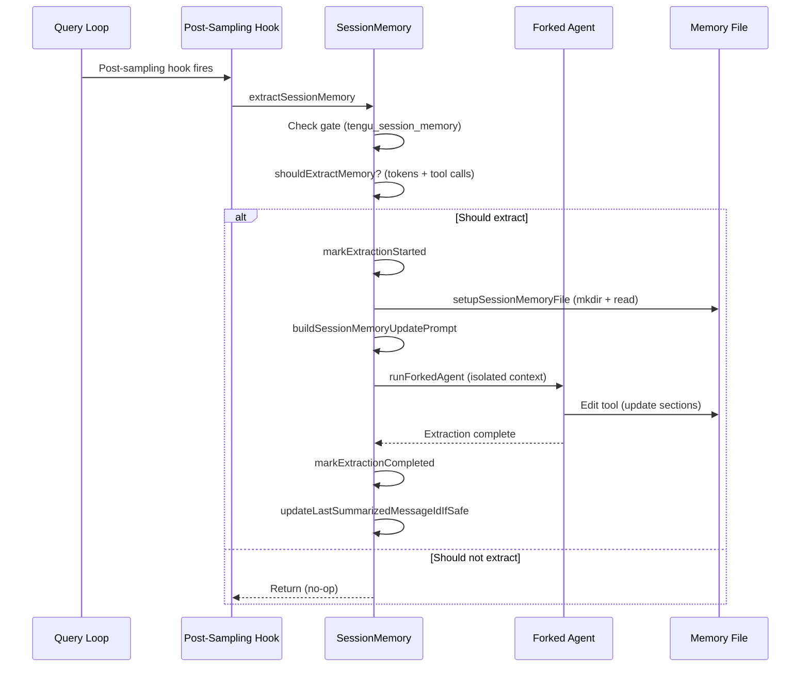
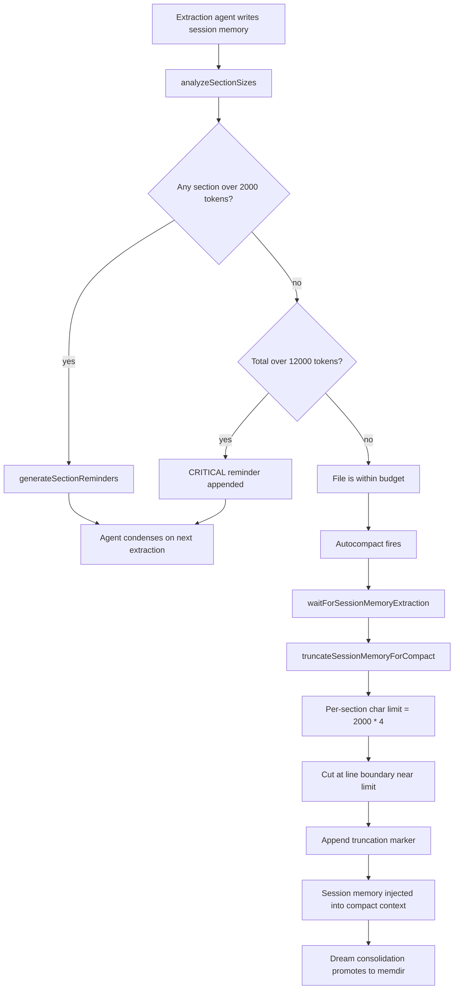

# Session Memory and Memory Extraction

## Overview

Session memory is cc's mechanism for automatically maintaining structured notes about the current conversation. Unlike memdir's persistent cross-session memory (Chapter 26), session memory operates within a single conversation, extracting key information at regular intervals via a forked subagent. The extracted notes serve as the primary input for the session-memory compaction path (Chapter 28), providing a structured alternative to the model-generated summaries used by legacy compaction.

The implementation lives in `src/services/SessionMemory/`, with three files: `sessionMemory.ts` (~495 LOC) handling the extraction lifecycle, `prompts.ts` (~325 LOC) defining the note template and update instructions, and `sessionMemoryUtils.ts` (~207 LOC) holding configuration types and shared state. This chapter examines how cc decides when to extract, how the extraction subagent is isolated from the main conversation, how the resulting notes feed into the compaction pipeline, and how session memory is promoted into persistent memdir storage.

Session memory exists because of a fundamental tension in long-running agents: the model needs a compact representation of the conversation to stay coherent, but generating that representation requires an API call that costs tokens and time. cc resolves this tension by extracting notes incrementally, updating a structured file at regular intervals rather than summarizing the entire conversation at compaction time. When compaction fires, the notes are already available, eliminating the need for a separate summarization call.

The entire feature is gated by a GrowthBook feature flag `tengu_session_memory`, checked via a cached (non-blocking) read. A second flag `tengu_sm_compact` controls whether session-memory compaction is used instead of legacy compaction. Both flags are evaluated through `getFeatureValue_CACHED_MAY_BE_STALE`, which returns immediately from cache rather than blocking on GrowthBook initialization. This design ensures that the extraction hook -- which fires on every model response -- never introduces latency waiting for a remote config service.

## Data structures and contracts

### Session memory configuration

The extraction behavior is governed by a `SessionMemoryConfig` type with three thresholds:

```typescript
// src/services/SessionMemory/sessionMemoryUtils.ts:L18-L29
export type SessionMemoryConfig = {
  /** Minimum context window tokens before initializing session memory.
   * Uses the same token counting as autocompact (input + output + cache tokens)
   * to ensure consistent behavior between the two features. */
  minimumMessageTokensToInit: number
  /** Minimum context window growth (in tokens) between session memory updates.
   * Uses the same token counting as autocompact (tokenCountWithEstimation)
   * to measure actual context growth, not cumulative API usage. */
  minimumTokensBetweenUpdate: number
  /** Number of tool calls between session memory updates */
  toolCallsBetweenUpdates: number
}
```

The defaults are 10,000 tokens for initialization, 5,000 tokens between updates, and 3 tool calls between updates, defined in `src/services/SessionMemory/sessionMemoryUtils.ts:L32-L36`. These values are lazy-initialized from GrowthBook's `tengu_sm_config` remote config, but only non-zero positive remote values override the defaults, preventing misconfigured zero values from disabling extraction.

### Session memory template

The session memory file follows a structured Markdown template with ten fixed sections. The default template is defined in `src/services/SessionMemory/prompts.ts:L11-L41`:

```typescript
// src/services/SessionMemory/prompts.ts:L11-L41
export const DEFAULT_SESSION_MEMORY_TEMPLATE = `
# Session Title
_A short and distinctive 5-10 word descriptive title for the session. Super info dense, no filler_

# Current State
_What is actively being worked on right now? Pending tasks not yet completed. Immediate next steps._

# Task specification
_What did the user ask to build? Any design decisions or other explanatory context_

# Files and Functions
_What are the important files? In short, what do they contain and why are they relevant?_

# Workflow
_What bash commands are usually run and in what order? How to interpret their output if not obvious?_

# Errors & Corrections
_Errors encountered and how they were fixed. What did the user correct? What approaches failed and should not be tried again?_

# Codebase and System Documentation
_What are the important system components? How do they work/fit together?_

# Learnings
_What has worked well? What has not? What to avoid? Do not duplicate items from other sections_

# Key results
_If the user asked a specific output such as an answer to a question, a table, or other document, repeat the exact result here_

# Worklog
_Step by step, what was attempted, done? Very terse summary for each step_
`
```

Each section has an italic description that serves as an invariant: the extraction agent is instructed never to modify, delete, or add section headers or their italic descriptions. This structural preservation ensures that downstream consumers (compaction, resume, display) can always parse the file by section headings. The ten sections cover the full lifecycle of a development session: what was asked (Task specification), what was done (Worklog), what was learned (Errors & Corrections, Learnings), and what the current state is (Current State).

### Section size budgets

The template enforces two size constraints that prevent any single extraction from consuming too much of the post-compact context budget:

```typescript
// src/services/SessionMemory/prompts.ts:L8-L9
const MAX_SECTION_LENGTH = 2000
const MAX_TOTAL_SESSION_MEMORY_TOKENS = 12000
```

The per-section cap of 2,000 tokens prevents any single section from dominating the file, while the total cap of 12,000 tokens ensures the session memory file does not consume more than a fraction of the post-compact context budget. When sections exceed these limits, the extraction agent receives explicit reminders to condense them.

## Control flow

### Extraction lifecycle

The session memory extraction follows a well-defined lifecycle, registered as a post-sampling hook that fires after every model response:



The hook is registered during initialization in `initSessionMemory`, which is called once at session startup:

```typescript
// src/services/SessionMemory/sessionMemory.ts:L357-L375
export function initSessionMemory(): void {
  if (getIsRemoteMode()) return
  const autoCompactEnabled = isAutoCompactEnabled()
  if (process.env.USER_TYPE === 'ant') {
    logEvent('tengu_session_memory_init', {
      auto_compact_enabled: autoCompactEnabled,
    })
  }
  if (!autoCompactEnabled) {
    return
  }
  registerPostSamplingHook(extractSessionMemory)
}
```

The function is synchronous to avoid race conditions during startup. The gate check and config loading happen lazily when the hook runs, not at registration time.

### GrowthBook feature gate integration

The `tengu_session_memory` feature gate is checked on every hook invocation, not at registration time. This is intentional: if the gate is checked once at startup and the flag is later enabled via GrowthBook refresh, the session would miss the change. By checking on every invocation, cc ensures that session memory activates as soon as the flag is enabled.

The gate check uses `getFeatureValue_CACHED_MAY_BE_STALE` from `src/services/analytics/growthbook.ts`, which reads from an in-memory cache populated by a background GrowthBook polling loop. The "may be stale" naming is explicit: the value could be stale by up to the GrowthBook polling interval, but the alternative -- calling `getFeatureValue_BLOCKS_ON_INIT` -- would block the query loop on every model response, adding unacceptable latency.

```typescript
// src/services/SessionMemory/sessionMemory.ts:L80-L82
function isSessionMemoryGateEnabled(): boolean {
  return getFeatureValue_CACHED_MAY_BE_STALE('tengu_session_memory', false)
}
```

If the gate returns false, the hook logs a single `tengu_session_memory_gate_disabled` event per session (for internal analytics) and returns without further work. The single-log guard `hasLoggedGateFailure` prevents event spam on every model response.

### Extraction trigger logic

The `shouldExtractMemory` function implements a dual-threshold trigger that balances extraction frequency against cost:

```typescript
// src/services/SessionMemory/sessionMemory.ts:L134-L181
export function shouldExtractMemory(messages: Message[]): boolean {
  const currentTokenCount = tokenCountWithEstimation(messages)
  if (!isSessionMemoryInitialized()) {
    if (!hasMetInitializationThreshold(currentTokenCount)) {
      return false
    }
    markSessionMemoryInitialized()
  }

  const hasMetTokenThreshold = hasMetUpdateThreshold(currentTokenCount)
  const toolCallsSinceLastUpdate = countToolCallsSince(
    messages,
    lastMemoryMessageUuid,
  )
  const hasMetToolCallThreshold =
    toolCallsSinceLastUpdate >= getToolCallsBetweenUpdates()
  const hasToolCallsInLastTurn = hasToolCallsInLastAssistantTurn(messages)

  const shouldExtract =
    (hasMetTokenThreshold && hasMetToolCallThreshold) ||
    (hasMetTokenThreshold && !hasToolCallsInLastTurn)

  if (shouldExtract) {
    const lastMessage = messages[messages.length - 1]
    if (lastMessage?.uuid) {
      lastMemoryMessageUuid = lastMessage.uuid
    }
    return true
  }
  return false
}
```

The trigger requires the token threshold to be met in all cases. This prevents excessive extractions when the conversation is short or when the model is making many tool calls without meaningful new information. The tool-call threshold provides a secondary trigger for active sessions where the model is making many calls, while the "no tool calls in last turn" condition ensures extraction happens at natural conversation breaks -- when the model has just produced a text response rather than a tool call, which typically means it has completed a unit of work.

The token threshold measures context window growth since the last extraction using `hasMetUpdateThreshold`, which subtracts the previously recorded token count from the current count. This is the same metric used by autocompact and the initialization threshold, ensuring consistent behavior across the two features.

### Forked agent isolation

The extraction runs in a forked subagent with tightly scoped permissions:

```typescript
// src/services/SessionMemory/sessionMemory.ts:L318-L325
await runForkedAgent({
  promptMessages: [createUserMessage({ content: userPrompt })],
  cacheSafeParams: createCacheSafeParams(context),
  canUseTool: createMemoryFileCanUseTool(memoryPath),
  querySource: 'session_memory',
  forkLabel: 'session_memory',
  overrides: { readFileState: setupContext.readFileState },
})
```

The `createMemoryFileCanUseTool` function restricts the forked agent to a single capability: editing the session memory file with the Edit tool:

```typescript
// src/services/SessionMemory/sessionMemory.ts:L460-L482
export function createMemoryFileCanUseTool(memoryPath: string): CanUseToolFn {
  return async (tool: Tool, input: unknown) => {
    if (
      tool.name === FILE_EDIT_TOOL_NAME &&
      typeof input === 'object' &&
      input !== null &&
      'file_path' in input
    ) {
      const filePath = input.file_path
      if (typeof filePath === 'string' && filePath === memoryPath) {
        return { behavior: 'allow' as const, updatedInput: input }
      }
    }
    return {
      behavior: 'deny' as const,
      message: `only ${FILE_EDIT_TOOL_NAME} on ${memoryPath} is allowed`,
      decisionReason: {
        type: 'other' as const,
        reason: `only ${FILE_EDIT_TOOL_NAME} on ${memoryPath} is allowed`,
      },
    }
  }
}
```

This is a direct implementation of HER Pattern 7 (Context-Isolated Subagents): the extraction agent operates in a separate context window with read-only access to the conversation and write access limited to a single file. If the extraction agent were compromised (e.g., by a prompt injection in a tool result), the damage would be confined to the session memory file. The `querySource: 'session_memory'` parameter prevents the extraction from triggering recursive compaction or other session-memory extractions.

### Update prompt construction

The extraction prompt instructs the model to update each section of the template based on the conversation so far. The prompt is loaded from a custom file at `~/.claude/session-memory/config/prompt.md` if it exists, otherwise from the default `getDefaultUpdatePrompt()`. The `{{currentNotes}}` variable is substituted with the current content of the memory file, enabling incremental updates rather than full rewrites. The `{{notesPath}}` variable tells the extraction agent which file to edit, scoping its write access.

The default prompt contains explicit rules about structural preservation: never modify section headers (lines starting with `#`), never modify or delete italic description lines, and only update the content that appears below the italic descriptions within each existing section. It also instructs the agent to write detailed, info-dense content with specifics like file paths, function names, error messages, and exact commands.

### Section size enforcement

When sections grow too large, `generateSectionReminders` appends explicit size warnings to the extraction prompt:

```typescript
// src/services/SessionMemory/prompts.ts:L164-L196
function generateSectionReminders(
  sectionSizes: Record<string, number>,
  totalTokens: number,
): string {
  const overBudget = totalTokens > MAX_TOTAL_SESSION_MEMORY_TOKENS
  const oversizedSections = Object.entries(sectionSizes)
    .filter(([_, tokens]) => tokens > MAX_SECTION_LENGTH)
    .sort(([, a], [, b]) => b - a)
    .map(
      ([section, tokens]) =>
        `- "${section}" is ~${tokens} tokens (limit: ${MAX_SECTION_LENGTH})`,
    )
  if (oversizedSections.length === 0 && !overBudget) {
    return ''
  }
  const parts: string[] = []
  if (overBudget) {
    parts.push(
      `\n\nCRITICAL: The session memory file is currently ~${totalTokens} tokens, which exceeds the maximum of ${MAX_TOTAL_SESSION_MEMORY_TOKENS} tokens. You MUST condense the file to fit within this budget. Aggressively shorten oversized sections by removing less important details, merging related items, and summarizing older entries. Prioritize keeping "Current State" and "Errors & Corrections" accurate and detailed.`,
    )
  }
  if (oversizedSections.length > 0) {
    parts.push(
      `\n\n${overBudget ? 'Oversized sections to condense' : 'IMPORTANT: The following sections exceed the per-section limit and MUST be condensed'}:\n${oversizedSections.join('\n')}`,
    )
  }
  return parts.join('')
}
```

This is a form of observation masking (HER Section 8.1): by surfacing size violations to the extraction agent, cc ensures the agent condenses sections proactively rather than waiting for a post-hoc truncation that loses information indiscriminately. The `analyzeSectionSizes` function parses the current notes and estimates token counts per section using `roughTokenCountEstimation`, providing the data for these reminders.

### Truncation for compact injection

When session memory is injected into compact messages, oversized sections are truncated to prevent them from consuming the entire post-compact token budget:

```typescript
// src/services/SessionMemory/prompts.ts:L256-L296
export function truncateSessionMemoryForCompact(content: string): {
  truncatedContent: string
  wasTruncated: boolean
} {
  const lines = content.split('\n')
  const maxCharsPerSection = MAX_SECTION_LENGTH * 4
  const outputLines: string[] = []
  let currentSectionLines: string[] = []
  let currentSectionHeader = ''
  let wasTruncated = false

  for (const line of lines) {
    if (line.startsWith('# ')) {
      const result = flushSessionSection(
        currentSectionHeader,
        currentSectionLines,
        maxCharsPerSection,
      )
      outputLines.push(...result.lines)
      wasTruncated = wasTruncated || result.wasTruncated
      currentSectionHeader = line
      currentSectionLines = []
    } else {
      currentSectionLines.push(line)
    }
  }
  const result = flushSessionSection(
    currentSectionHeader,
    currentSectionLines,
    maxCharsPerSection,
  )
  outputLines.push(...result.lines)
  wasTruncated = wasTruncated || result.wasTruncated
  return { truncatedContent: outputLines.join('\n'), wasTruncated }
}
```

The truncation operates at the section level via `flushSessionSection`, cutting at a line boundary near the character limit and appending a `[... section truncated for length ...]` marker. This preserves the section header and description while condensing the body, a more precise approach than whole-file truncation.

### Memory promotion: session memory to persistent memdir

Session memory is inherently ephemeral -- it captures the current conversation and is discarded when the session ends. However, the compaction pipeline creates an opportunity to promote session memory content into persistent memdir storage, ensuring that valuable information survives across sessions.

The promotion pipeline works through the session-memory compaction path. When `trySessionMemoryCompaction` in `src/services/compact/sessionMemoryCompact.ts` fires, it reads the current session memory content via `getSessionMemoryContent()`, truncates oversized sections via `truncateSessionMemoryForCompact`, and creates a compaction result that replaces the summarized portion of the conversation with the session memory summary. The summary message is created with `isCompactSummary: true` and `isVisibleInTranscriptOnly: true`, marking it as a synthetic message that provides context but should not be confused with actual user or model messages.



The dream consolidation system (Chapter 24) can further promote key session memory content into persistent memory files. When the dream task runs during idle time, it reviews the session memory file along with other context, extracting information that should persist beyond the current session into new memdir entries. This creates a two-tier promotion path: session memory captures ephemeral state, and dream consolidation selects the most valuable portions for long-term retention.

### Custom template and prompt support

Users can customize the template and update prompt by placing files at `~/.claude/session-memory/config/template.md` and `~/.claude/session-memory/config/prompt.md`:

```typescript
// src/services/SessionMemory/prompts.ts:L86-L104
export async function loadSessionMemoryTemplate(): Promise<string> {
  const templatePath = join(
    getClaudeConfigHomeDir(),
    'session-memory',
    'config',
    'template.md',
  )
  try {
    return await readFile(templatePath, { encoding: 'utf-8' })
  } catch (e: unknown) {
    const code = getErrnoCode(e)
    if (code === 'ENOENT') {
      return DEFAULT_SESSION_MEMORY_TEMPLATE
    }
    logError(toError(e))
    return DEFAULT_SESSION_MEMORY_TEMPLATE
  }
}
```

This enables teams to add project-specific sections (e.g., "# Deployment Checklist", "# Compliance Requirements") or modify the extraction instructions to emphasize certain types of information. The variable substitution syntax (`{{currentNotes}}`, `{{notesPath}}`) supports dynamic content injection in custom prompts. The `substituteVariables` function performs single-pass replacement to avoid both `$` backreference corruption and double-substitution when user content happens to contain `{{varName}}` matching a later variable.

## Edge cases and failure modes

### Self-evaluation bias

HER Failure Mode 6.3 (Self-Evaluation Bias) warns that agents rate their own work too generously. The session memory extraction is vulnerable to this bias: the extraction agent might overstate progress or understate errors. cc mitigates this by running the extraction in a forked context with no access to the model's internal reasoning, forcing the extraction to rely solely on the observable conversation (tool calls, results, user messages). The "Errors & Corrections" section is structured to capture both positive and negative feedback, with explicit instructions to record corrections AND confirmations, preventing the drift toward over-caution that occurs when only failures are recorded.

### Resumed sessions without lastSummarizedMessageId

When a session is resumed from a previous conversation, the `lastSummarizedMessageId` may not be available. The `trySessionMemoryCompaction` function handles this by setting `lastSummarizedIndex` to the last message in the array:

```typescript
// src/services/compact/sessionMemoryCompact.ts:L561-L565
    } else {
      // Resumed session case: session memory has content but we don't know the boundary
      // Set lastSummarizedIndex to last message so startIndex becomes messages.length (no messages kept initially)
      lastSummarizedIndex = messages.length - 1
      logEvent('tengu_sm_compact_resumed_session', {})
    }
```

This is a conservative fallback: rather than risk discarding unsummarized messages, the compaction preserves everything and uses the session memory as an overlay. The tradeoff is that resumed sessions may not benefit from the full token savings of session-memory compaction.

### Extraction race conditions

The extraction runs as a post-sampling hook, which means it fires after every model response. To prevent concurrent extractions, the `sequential` wrapper is applied:

```typescript
// src/services/SessionMemory/sessionMemory.ts:L272-L274
const extractSessionMemory = sequential(async function (
  context: REPLHookContext,
): Promise<void> {
```

The `sequential` function ensures that only one extraction runs at a time, serializing overlapping hook invocations. Without this, two concurrent extractions could produce conflicting edits to the session memory file, resulting in a corrupted file that does not accurately reflect the conversation state.

When autocompact fires, it calls `waitForSessionMemoryExtraction` from `src/services/SessionMemory/sessionMemoryUtils.ts:L89-L105`, which polls the extraction-in-progress flag at 1-second intervals with a 15-second timeout and a 60-second staleness threshold. If the extraction has been running for more than 60 seconds, the wait returns immediately (the extraction is considered stale). If the 15-second timeout expires, the wait also returns, ensuring that compaction never blocks indefinitely.

### Template matching for empty detection

The `isSessionMemoryEmpty` function detects whether the session memory file contains any actual content or just the template:

```typescript
// src/services/SessionMemory/prompts.ts:L220-L224
export async function isSessionMemoryEmpty(content: string): Promise<boolean> {
  const template = await loadSessionMemoryTemplate()
  return content.trim() === template.trim()
}
```

This comparison is straightforward but has a subtle edge case: if the user customizes the template after the first extraction, the comparison will fail because the file content will not match the new template. cc handles this by loading the template at comparison time rather than at initialization time, so the comparison always uses the current template. When the session memory is empty, the compaction pipeline falls back to legacy compaction, preventing a compaction that would produce an empty summary.

### Manual extraction for the /summary command

The `manuallyExtractSessionMemory` function bypasses the threshold checks for the `/summary` command, allowing users to trigger extraction at any time. Unlike the automatic path, which uses `createCacheSafeParams` to share the parent's prompt cache, the manual path constructs fresh system prompt, user context, and system context via `getSystemPrompt`, `getUserContext`, and `getSystemContext`. This is necessary because the manual path is not triggered from the query loop and does not have access to the current cache state.

### Session memory file setup

Before extraction can run, the session memory file must be initialized. The `setupSessionMemoryFile` function handles this initialization by creating the session memory directory (`~/.claude/session-memory/`) with mode `0o700` and the memory file with mode `0o600`, then loading the template. The file creation uses the `wx` flag (O_CREAT | O_EXCL) to atomically create the file only if it does not exist, preventing a race between the existence check and the write.

After creating or reading the file, the function calls `FileReadTool.call` to populate the `readFileState` with the file content. This state is passed to the forked agent via `overrides: { readFileState: setupContext.readFileState }`, enabling the agent to use the Edit tool without first reading the file (since it already has the content in its state). The `readFileState.delete(memoryPath)` call before reading ensures that the FileReadTool's dedup does not return a stale `file_unchanged` stub.

### API invariant preservation during compaction

The `adjustIndexToPreserveAPIInvariants` function in `src/services/compact/sessionMemoryCompact.ts:L232-L314` handles a subtle but critical edge case: when the compaction boundary splits streaming messages that share the same `message.id` but have different `uuid` values. Streaming yields separate messages per content block (thinking, tool_use, etc.) with the same `message.id` but different `uuid` values. If the compaction boundary lands between these messages, the `normalizeMessagesForAPI` function will fail to merge them correctly, resulting in orphaned `tool_result` blocks or lost thinking blocks that cause API errors.

The function solves this in two steps: first, it looks backward from the boundary to find any `tool_use` blocks whose matching `tool_result` blocks would be orphaned; second, it looks backward for any assistant messages that share a `message.id` with kept messages but contain thinking blocks. Both adjustments expand the kept range to ensure API structural invariants are preserved.

## Where cc diverges from the published pattern

### Structured template vs. free-form notes

Many published agent architectures recommend free-form notes that the agent maintains as it works. cc uses a fixed-section template with invariant headers and descriptions. This reduces the model's degrees of freedom and ensures that each section has a clear purpose, but it also means that information that does not fit neatly into one of the ten sections may be lost or misplaced. The custom template support partially addresses this by allowing teams to add sections, but the core tradeoff remains: structure constrains expression.

### Forked extraction vs. inline summarization

cc runs the extraction in a forked subagent rather than as part of the main conversation loop. This is a direct implementation of HER Pattern 7 (Context-Isolated Subagents): the extraction agent has its own context window and cannot contaminate the main conversation with extraction artifacts. The tradeoff is cost: each extraction requires a separate API call. cc mitigates this by running extraction only when the dual thresholds (tokens + tool calls) are met, and by using prompt cache sharing with the main conversation via `createCacheSafeParams`.

### Cached (non-blocking) gate checks vs. blocking flag evaluation

cc uses `getFeatureValue_CACHED_MAY_BE_STALE` for the session memory gate, accepting potentially stale flag values to avoid blocking the query loop. Most GrowthBook integrations use blocking evaluation to ensure fresh values, but this is impractical for a hook that fires on every model response. The tradeoff is that session memory may activate a few polling intervals late after the flag is enabled, but this is acceptable for a feature that provides incremental value rather than safety guarantees.

### Section-level size enforcement vs. whole-file truncation

cc enforces size limits at the section level (2,000 tokens per section) rather than truncating the entire file when it exceeds a budget. This is more precise than whole-file truncation because it preserves sections that are within budget and condenses only the sections that are oversized. The per-section approach aligns with HER's recommendation for per-tool-type summarization (Section 8.1 technique 6): different sections have different compression strategies based on their content type.

## Developer takeaways for building a long-running agent

1. **Run extraction in an isolated context.** The forked-agent pattern prevents extraction artifacts from polluting the main conversation and limits the blast radius of a compromised extraction agent. The `createMemoryFileCanUseTool` function demonstrates how to scope a subagent's permissions to a single file.

2. **Use dual-threshold triggers to balance frequency and relevance.** The combination of token count and tool-call count ensures extraction happens frequently enough to capture progress but not so frequently that it wastes API calls. The token threshold is always required, preventing excessive extractions.

3. **Enforce structural invariants in the template.** The fixed-section template with invariant headers prevents the model from reorganizing or removing sections. This makes the notes parseable by downstream consumers without needing to interpret free-form text.

4. **Surface size violations to the extraction agent.** The `generateSectionReminders` function tells the extraction agent which sections are oversized, enabling targeted condensation rather than indiscriminate truncation. This is more effective than post-hoc truncation because the agent can choose which details to preserve.

5. **Make extraction sequential to prevent race conditions.** The `sequential` wrapper ensures that only one extraction runs at a time, and `waitForSessionMemoryExtraction` ensures that compaction waits for any in-progress extraction to complete.

6. **Use cached (non-blocking) feature gates for hot-path checks.** When a gate is checked on every model response, blocking on GrowthBook initialization would add unacceptable latency. Accepting potentially stale values is a reasonable tradeoff for non-safety-critical features.

7. **Support custom templates for project-specific needs.** The file-based template override allows teams to add sections without modifying the codebase. This is essential for projects that need domain-specific notes.
