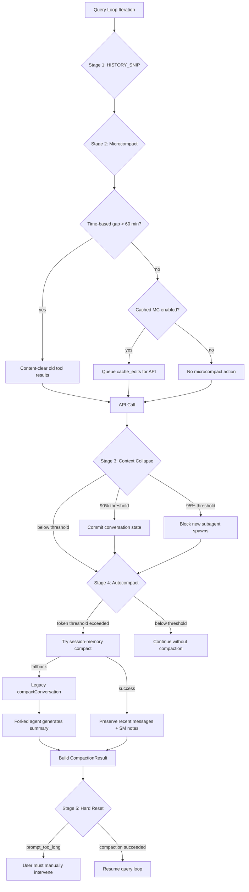
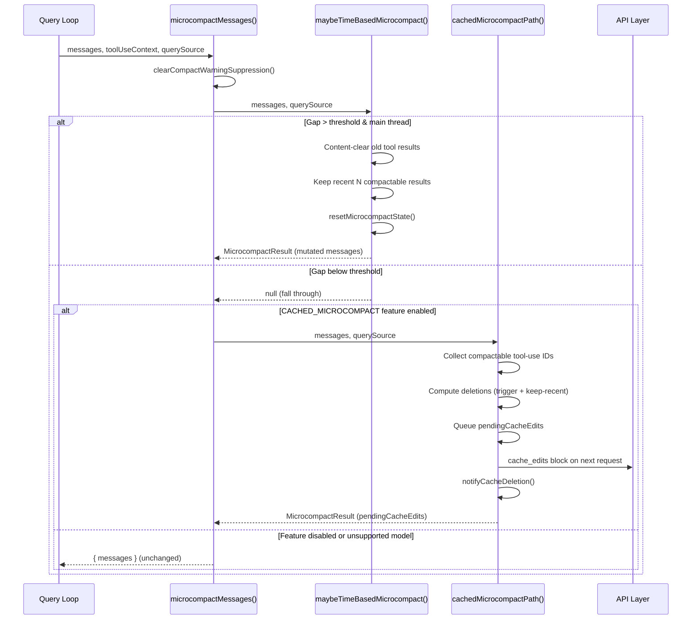
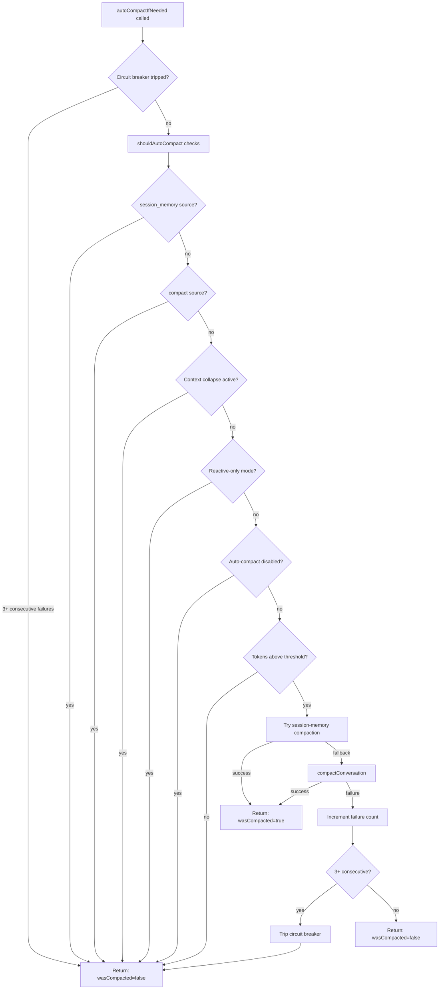
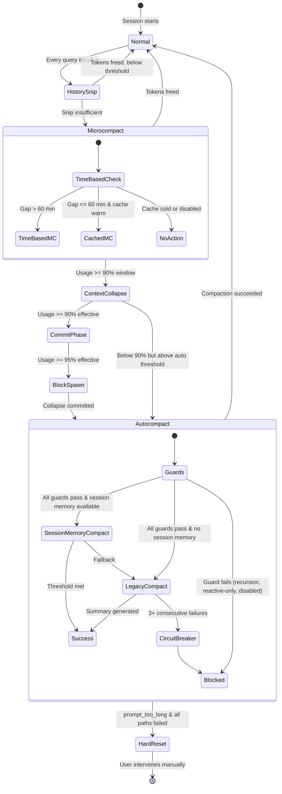

# Compaction Hierarchy: Five Stages of Context Rescue

## Overview

Long-running agent sessions inevitably exceed their context window. A coding session that starts with a simple bug fix can grow to thousands of turns as the agent reads files, runs tests, edits code, and responds to feedback. Without intervention, the conversation would hit the model's token limit and crash. cc addresses this with a five-stage compaction hierarchy that progressively reduces context size, from the lightest touch (trimming stale tool results without model involvement) to the heaviest intervention (summarizing the entire conversation via a forked API call).

The five stages are: (1) history_snip, a deterministic message-pruning pass; (2) microcompact, which clears old tool results either via cache-editing or content-replacement; (3) context collapse, an aggressive server-side compaction triggered at critical token thresholds; (4) autocompact, a model-summarization pass initiated when the context window approaches capacity; and (5) hard reset, the fallback when no other strategy succeeds. Each stage operates at a different point in the query loop and has different cost, latency, and information-loss profiles.



The diagram shows the progressive escalation from lightweight pruning (stage 1) through model-summarization (stage 4) to the hard-reset fallback (stage 5). Each stage can short-circuit the pipeline: if history snip frees enough tokens, later stages may not fire; if microcompact clears enough tool results, autocompact may not trigger; if session-memory compaction succeeds, the legacy model-summarization path is skipped.

The implementation spans `src/services/compact/` (compact.ts at ~1705 LOC, autoCompact.ts at ~351 LOC, microCompact.ts at ~530 LOC, sessionMemoryCompact.ts at ~630 LOC, postCompactCleanup.ts at ~77 LOC, apiMicrocompact.ts at ~153 LOC, grouping.ts, compactWarningHook.ts, compactWarningState.ts). The history-snip module is feature-gated behind `feature('HISTORY_SNIP')` and loaded via `require()` at runtime; the context-collapse module is similarly gated behind `feature('CONTEXT_COLLAPSE')` with a dynamic import to break a circular dependency. This chapter examines each stage's trigger conditions, data structures, control flow, and the invariants that must hold across stage boundaries.

## Data structures and contracts

### CompactionResult interface

All compaction stages that produce model-visible output converge on the `CompactionResult` interface defined in `src/services/compact/compact.ts`:

```typescript
// src/services/compact/compact.ts:L299-L310
export interface CompactionResult {
  boundaryMarker: SystemMessage
  summaryMessages: UserMessage[]
  attachments: AttachmentMessage[]
  hookResults: HookResultMessage[]
  messagesToKeep?: Message[]
  userDisplayMessage?: string
  preCompactTokenCount?: number
  postCompactTokenCount?: number
  truePostCompactTokenCount?: number
  compactionUsage?: ReturnType<typeof getTokenUsage>
}
```

The `boundaryMarker` is a `SystemCompactBoundaryMessage` that records the compaction type (auto or manual), the pre-compact token count, the UUID of the last message before compaction, and optional metadata about preserved segments and discovered tools. The `summaryMessages` array contains the compressed representation of the conversation (either a model-generated summary or session memory content). The `attachments` array carries re-injected file references, plan content, invoked skills, and tool-delta attachments that restore context lost during compaction. The `messagesToKeep` field is populated by partial compaction and session-memory compaction; when present, it holds the verbatim recent messages that survive summarization.

The `buildPostCompactMessages` function enforces a canonical ordering across all compaction paths:

```typescript
// src/services/compact/compact.ts:L330-L338
export function buildPostCompactMessages(result: CompactionResult): Message[] {
  return [
    result.boundaryMarker,
    ...result.summaryMessages,
    ...(result.messagesToKeep ?? []),
    ...result.attachments,
    ...result.hookResults,
  ]
}
```

Boundary marker first, then summary, then preserved messages, then attachments, then hook results. This ordering matters for the session JSONL loader, which walks the list from tail to head when reconstructing the conversation chain.

### MicrocompactResult and PendingCacheEdits

The microcompact stage uses a lighter result type since it does not invoke the model:

```typescript
// src/services/compact/microCompact.ts:L215-L220
export type MicrocompactResult = {
  messages: Message[]
  compactionInfo?: {
    pendingCacheEdits?: PendingCacheEdits
  }
}
```

The `PendingCacheEdits` type carries the list of tool-use IDs to be deleted via the cache-editing API, along with a baseline cumulative `cache_deleted_input_tokens` value for computing per-operation deltas:

```typescript
// src/services/compact/microCompact.ts:L207-L213
export type PendingCacheEdits = {
  trigger: 'auto'
  deletedToolIds: string[]
  baselineCacheDeletedTokens: number
}
```

This separation exists because cached microcompact does not modify local message content. Instead, it queues a `cache_edits` block that the API layer inserts into the next request. The actual content deletion happens server-side, preserving the client-side message array for the UI while reducing the tokens the model processes.

### RecompactionInfo

When compaction fires on a turn that already follows a previous compaction, cc records diagnostic metadata to help the telemetry pipeline distinguish same-chain loops from cross-agent and manual-vs-auto compactions:

```typescript
// src/services/compact/compact.ts:L317-L323
export type RecompactionInfo = {
  isRecompactionInChain: boolean
  turnsSincePreviousCompact: number
  previousCompactTurnId?: string
  autoCompactThreshold: number
  querySource?: QuerySource
}
```

The `isRecompactionInChain` flag is true when the current compaction is triggered on a turn where the previous turn also compacted. The `turnsSincePreviousCompact` counter tracks the gap between compaction events. These fields feed into the `tengu_compact` analytics event, enabling post-hoc analysis of compaction chains without requiring expensive cross-session joins.

### TimeBasedMCConfig

The time-based microcompact path is controlled by a GrowthBook configuration type:

```typescript
// src/services/compact/timeBasedMCConfig.ts:L18-L28
export type TimeBasedMCConfig = {
  enabled: boolean
  gapThresholdMinutes: number
  keepRecent: number
}
```

The defaults are `enabled: false`, `gapThresholdMinutes: 60`, `keepRecent: 5`. The 60-minute threshold is chosen to match the server-side prompt-cache TTL: if the gap since the last assistant message exceeds 60 minutes, the cached prefix has almost certainly expired, so the full prompt will be rewritten regardless. Clearing old tool results before that rewrite shrinks what gets rewritten, saving cache-creation tokens.

### SessionMemoryCompactConfig

Session-memory compaction uses its own configuration type with three thresholds:

```typescript
// src/services/compact/sessionMemoryCompact.ts:L47-L54
export type SessionMemoryCompactConfig = {
  minTokens: number
  minTextBlockMessages: number
  maxTokens: number
}
```

The defaults are `minTokens: 10_000`, `minTextBlockMessages: 5`, `maxTokens: 40_000`. The `minTokens` floor ensures the model retains enough working context to continue its task. The `minTextBlockMessages` floor ensures at least five messages with text blocks survive, preventing the model from losing its most recent instructions. The `maxTokens` cap prevents the preserved tail from consuming too much of the post-compact context budget.

## Control flow

### Stage 1: History snip (HISTORY_SNIP)

History snip is the lightest compaction stage. It runs deterministically at the start of each query loop iteration, before the API call, and prunes messages that are no longer needed for the conversation to remain coherent. The implementation is feature-gated behind `feature('HISTORY_SNIP')` and lazily loaded via `require()` in `src/query.ts` to avoid pulling in its dependency chain in builds where the feature is disabled.

The query loop in `src/query.ts` invokes snip before microcompact:

```typescript
// src/query.ts:L396-L408
// Apply snip before microcompact (both may run — they are not mutually exclusive).
// snipTokensFreed is plumbed to autocompact so its threshold check reflects
// what snip removed; tokenCountWithEstimation alone can't see it (reads usage
// from the protected-tail assistant, which survives snip unchanged).
let snipTokensFreed = 0
if (feature('HISTORY_SNIP')) {
  queryCheckpoint('query_snip_start')
  const snipResult = snipModule!.snipCompactIfNeeded(messagesForQuery)
  messagesForQuery = snipResult.messages
  snipTokensFreed = snipResult.tokensFreed
  if (snipResult.boundaryMessage) {
    yield snipResult.boundaryMessage
  }
}
```

The `snipTokensFreed` value is threaded through to the autocompact threshold check because snip removes messages from the conversation array but the surviving assistant message's `usage` field still reflects the pre-snip token count. Without this correction, autocompact would see inflated token usage and trigger unnecessarily.

History snip's key design principle is that it operates on messages the model has already processed. It does not change what the model sees on the current turn; it only removes messages that are no longer needed for future turns. This makes it safe to run on every iteration without risk of disrupting the current API call.

### Stage 2: Microcompact

Microcompact runs after history snip but before the API call. It has two sub-paths: cached microcompact (which uses the cache-editing API to delete tool results without invalidating the cached prompt prefix) and time-based microcompact (which content-clears old tool results when the server cache has expired). The entry point is `microcompactMessages` in `src/services/compact/microCompact.ts`:

```typescript
// src/services/compact/microCompact.ts:L253-L293
export async function microcompactMessages(
  messages: Message[],
  toolUseContext?: ToolUseContext,
  querySource?: QuerySource,
): Promise<MicrocompactResult> {
  clearCompactWarningSuppression()

  const timeBasedResult = maybeTimeBasedMicrocompact(messages, querySource)
  if (timeBasedResult) {
    return timeBasedResult
  }

  if (feature('CACHED_MICROCOMPACT')) {
    const mod = await getCachedMCModule()
    const model = toolUseContext?.options.mainLoopModel ?? getMainLoopModel()
    if (
      mod.isCachedMicrocompactEnabled() &&
      mod.isModelSupportedForCacheEditing(model) &&
      isMainThreadSource(querySource)
    ) {
      return await cachedMicrocompactPath(messages, querySource)
    }
  }

  return { messages }
}
```

The function first attempts time-based microcompact, which short-circuits if the gap since the last assistant message exceeds the configured threshold. If time-based does not fire, it falls through to cached microcompact, which uses cache-editing to delete tool results from the server's cached prefix. Both paths are main-thread-only: subagents (session_memory, prompt_suggestion, marble_origami) are excluded because they share the process's module-level state, and allowing them to register tool results in the global `cachedMCState` would cause the main thread to attempt deleting tools that do not exist in its own conversation.

The set of compactable tools is defined as a constant:

```typescript
// src/services/compact/microCompact.ts:L41-L50
const COMPACTABLE_TOOLS = new Set<string>([
  FILE_READ_TOOL_NAME,
  ...SHELL_TOOL_NAMES,
  GREP_TOOL_NAME,
  GLOB_TOOL_NAME,
  WEB_SEARCH_TOOL_NAME,
  WEB_FETCH_TOOL_NAME,
  FILE_EDIT_TOOL_NAME,
  FILE_WRITE_TOOL_NAME,
])
```

These are the tools whose results are most likely to be large and least likely to be needed on subsequent turns. A file read result, for instance, can consume thousands of tokens but is usually consumed by the model on the turn it was produced. By contrast, tool results from tools like AgentTool or SkillTool contain structured data that the model may reference later and are not compactable.

#### Cached microcompact path

The cached microcompact path uses the Anthropic cache-editing API to remove tool results from the server's cached prompt prefix without invalidating the cache. This is the preferred path when the cache is warm (the gap since the last request is under the server's TTL). The path works by:

1. Collecting all compactable tool-use IDs from assistant messages.
2. Registering tool results grouped by user message, tracking which have already been registered and which are new.
3. Computing which tool results to delete based on GrowthBook-configured trigger and keep-recent thresholds.
4. Creating a `CacheEditsBlock` that is queued as `pendingCacheEdits`.
5. Returning messages unchanged; the cache edits are applied at the API layer.

A critical detail is that after a successful cached microcompact, the code notifies the prompt-cache-break detection system:

```typescript
// src/services/compact/microCompact.ts:L362-L367
if (feature('PROMPT_CACHE_BREAK_DETECTION')) {
  notifyCacheDeletion(querySource ?? 'repl_main_thread')
}
```

This prevents the cache-break detector from flagging the legitimate drop in cache-read tokens that follows a cache edit as a false-positive "cache break" event.

#### Time-based microcompact path

The time-based path fires when the gap since the last main-loop assistant message exceeds the configured threshold (default 60 minutes). Unlike cached microcompact, it mutates message content directly, replacing tool result content with a sentinel string:

```typescript
// src/services/compact/microCompact.ts:L36
export const TIME_BASED_MC_CLEARED_MESSAGE = '[Old tool result content cleared]'
```

The path keeps at least the most recent `keepRecent` (default 5) compactable tool results intact. The floor is clamped to 1 because `slice(-0)` returns the full array (keeping everything), and clearing all results would leave the model with zero working context.

After time-based microcompact fires, it resets the cached microcompact state:

```typescript
// src/services/compact/microCompact.ts:L517
resetMicrocompactState()
```

This is necessary because the cached-MC state holds tool IDs registered on prior turns. Content-clearing some of those tools and invalidating the server cache means that if cached-MC runs on the next turn with stale state, it would attempt to cache-edit tools whose server-side entries no longer exist.

The following diagram illustrates the full microcompact pass, showing how the two sub-paths branch and merge:



The diagram shows the two-phase decision: time-based microcompact is tried first because it handles the case where the server cache has expired (making cache-editing pointless). Cached microcompact runs only when the cache is still warm, queuing server-side deletions that reduce tokens without invalidating the cached prefix.

### Compact warning suppression

Microcompact and autocompact interact with a compact-warning suppression mechanism implemented in `src/services/compact/compactWarningHook.ts` and `src/services/compact/compactWarningState.ts`. The `compactWarningStore` is a tiny boolean store that tracks whether the "context left until autocompact" warning should be suppressed:

```typescript
// src/services/compact/compactWarningState.ts:L8-L18
export const compactWarningStore = createStore<boolean>(false)

export function suppressCompactWarning(): void {
  compactWarningStore.setState(() => true)
}

export function clearCompactWarningSuppression(): void {
  compactWarningStore.setState(() => false)
}
```

Suppression is activated immediately after successful compaction because token counts are not accurate until the next API response. Without suppression, the UI would flash a warning for the one or two turns between compaction completing and the first post-compact API call returning an updated usage count. The `useCompactWarningSuppression` React hook in `compactWarningHook.ts` subscribes to the store so the UI re-renders when suppression state changes. This hook is separated into its own file to keep `compactWarningState.ts` React-free, since `microCompact.ts` imports the pure state functions and pulling React into that module graph would drag it into the print-mode startup path.

### Stage 3: Context collapse

Context collapse is the most aggressive compaction stage short of a full hard reset. It is triggered when token usage exceeds critical thresholds (90% of the effective context window for the commit phase, 95% for the blocking-spawn phase). When active, context collapse suppresses both autocompact and time-based microcompact, owning the headroom problem entirely.

The suppression logic lives in `shouldAutoCompact` in `src/services/compact/autoCompact.ts`:

```typescript
// src/services/compact/autoCompact.ts:L215-L223
if (feature('CONTEXT_COLLAPSE')) {
  const { isContextCollapseEnabled } =
    require('../contextCollapse/index.js') as typeof import('../contextCollapse/index.js')
  if (isContextCollapseEnabled()) {
    return false
  }
}
```

The `require()` call is used instead of a static import to break a circular dependency: `autoCompact.ts` exports `getEffectiveContextWindowSize`, which context collapse's index module imports. A static import would create an init-time cycle. The `feature('CONTEXT_COLLAPSE')` gate ensures the string and the `require()` are eliminated from external builds via dead code elimination.

Context collapse operates differently from the other stages. Rather than summarizing or trimming messages, it commits the current conversation state to a persistent log and then prunes the in-memory conversation to a minimal working set. The committed log preserves the full conversation history for the session transcript, while the in-memory conversation carries only the most recent context needed to continue the task. This approach trades disk space for context-window headroom, ensuring the model can continue working even when the conversation has grown far beyond the context window.

The context-collapse module also handles the blocking-spawn phase. When token usage reaches 95% of the effective context window, the system blocks the spawning of new subagents, preventing the conversation from growing further. This is a back-pressure mechanism: rather than allowing the conversation to grow until it crashes, the system throttles the inflow of new content.

### Stage 4: Autocompact

Autocompact is the most commonly encountered compaction stage. It fires when the context window approaches capacity, initiating a model-summarization pass that replaces the conversation with a compressed summary. The entry point is `autoCompactIfNeeded` in `src/services/compact/autoCompact.ts`.

#### Threshold calculation

The autocompact threshold is computed relative to the effective context window size:

```typescript
// src/services/compact/autoCompact.ts:L72-L91
export function getAutoCompactThreshold(model: string): number {
  const effectiveContextWindow = getEffectiveContextWindowSize(model)
  const autocompactThreshold =
    effectiveContextWindow - AUTOCOMPACT_BUFFER_TOKENS
  // ...
  return autocompactThreshold
}
```

The `AUTOCOMPACT_BUFFER_TOKENS` constant is set to 13,000. This buffer accounts for the system prompt, tool definitions, and user context that are not counted in the message-level token estimate but still consume context-window space. The effective context window itself is the model's full context window minus a reserve for the compaction summary output:

```typescript
// src/services/compact/autoCompact.ts:L33-L49
export function getEffectiveContextWindowSize(model: string): number {
  const reservedTokensForSummary = Math.min(
    getMaxOutputTokensForModel(model),
    MAX_OUTPUT_TOKENS_FOR_SUMMARY,
  )
  let contextWindow = getContextWindowForModel(model, getSdkBetas())
  const autoCompactWindow = process.env.CLAUDE_CODE_AUTO_COMPACT_WINDOW
  if (autoCompactWindow) {
    const parsed = parseInt(autoCompactWindow, 10)
    if (!isNaN(parsed) && parsed > 0) {
      contextWindow = Math.min(contextWindow, parsed)
    }
  }
  return contextWindow - reservedTokensForSummary
}
```

The `MAX_OUTPUT_TOKENS_FOR_SUMMARY` constant is 20,000, based on the p99.99 of compact summary output being 17,387 tokens. The `CLAUDE_CODE_AUTO_COMPACT_WINDOW` environment variable allows overriding the effective window for testing purposes.

#### Should-fire checks

The `shouldAutoCompact` function implements a series of guard checks before deciding whether compaction should proceed:

1. **Recursion guards**: Compaction is suppressed for `session_memory` and `compact` query sources to prevent deadlocks (a compact agent trying to compact itself would loop forever).

2. **Context collapse guard**: When context collapse is enabled and active, autocompact is suppressed because collapse owns the headroom problem. Autocompact at the effective-13k threshold (~93% of effective) would race collapse's commit-start (90%) and usually win, destroying granular context that collapse was about to save.

3. **Reactive-only mode**: When the `REACTIVE_COMPACT` feature flag is active and the `tengu_cobalt_raccoon` GrowthBook flag is true, proactive autocompact is suppressed. Only reactive compaction (triggered by the API's `prompt_too_long` error) is allowed.

4. **Environment overrides**: `DISABLE_COMPACT` disables all compaction; `DISABLE_AUTO_COMPACT` disables automatic compaction while keeping manual `/compact` working.

5. **Token threshold check**: After all guards pass, the function estimates the current token count and compares it against the autocompact threshold.

The following diagram illustrates the autocompact decision flow:



This decision tree shows the multiple guard checks that prevent unnecessary or dangerous compaction. The circuit breaker at the top prevents unbounded retries in sessions where compaction consistently fails.

The following state diagram captures the complete compaction trigger hierarchy, showing how the five stages relate as states and what transitions cause escalation from one stage to the next:



The diagram shows the key property of the hierarchy: each stage can succeed and return the system to normal operation, or fail and escalate to the next stage. Context collapse is the only stage that blocks lower stages (it suppresses autocompact and time-based microcompact while active). The hard reset is a terminal state requiring manual intervention; there is no automatic recovery path.

#### Session-memory compaction first

When autocompact does fire, it first attempts session-memory compaction before falling back to the legacy model-summarization path:

```typescript
// src/services/compact/autoCompact.ts:L288-L310
const sessionMemoryResult = await trySessionMemoryCompaction(
  messages,
  toolUseContext.agentId,
  recompactionInfo.autoCompactThreshold,
)
if (sessionMemoryResult) {
  setLastSummarizedMessageId(undefined)
  runPostCompactCleanup(querySource)
  if (feature('PROMPT_CACHE_BREAK_DETECTION')) {
    notifyCompaction(querySource ?? 'compact', toolUseContext.agentId)
  }
  markPostCompaction()
  return {
    wasCompacted: true,
    compactionResult: sessionMemoryResult,
  }
}
```

Session-memory compaction uses the notes extracted by the session memory system (Chapter 27) instead of invoking the model to generate a new summary. This eliminates the compaction API call entirely, reducing cost and latency. The `trySessionMemoryCompaction` function (in `src/services/compact/sessionMemoryCompact.ts`) checks whether session memory is available and non-empty, waits for any in-progress extraction to complete, and then computes the messages to keep.

The key calculation is `calculateMessagesToKeepIndex`, which determines the boundary between summarized and preserved messages:

```typescript
// src/services/compact/sessionMemoryCompact.ts:L324-L397
export function calculateMessagesToKeepIndex(
  messages: Message[],
  lastSummarizedIndex: number,
): number {
  // Start from the message after lastSummarizedIndex
  let startIndex =
    lastSummarizedIndex >= 0 ? lastSummarizedIndex + 1 : messages.length

  // Calculate current tokens and text-block message count
  let totalTokens = 0
  let textBlockMessageCount = 0
  for (let i = startIndex; i < messages.length; i++) {
    const msg = messages[i]!
    totalTokens += estimateMessageTokens([msg])
    if (hasTextBlocks(msg)) {
      textBlockMessageCount++
    }
  }

  // Expand backwards until we meet both minimums or hit max cap
  const idx = messages.findLastIndex(m => isCompactBoundaryMessage(m))
  const floor = idx === -1 ? 0 : idx + 1
  for (let i = startIndex - 1; i >= floor; i--) {
    // ... expand backwards
  }

  return adjustIndexToPreserveAPIInvariants(messages, startIndex)
}
```

The expansion stops at the last compact boundary (the "floor"), ensuring that the preserved segment does not cross a compaction discontinuity. This is important because the session JSONL loader uses a tail-to-head walk to reconstruct the conversation chain, and crossing a boundary would create an invalid chain.

The `adjustIndexToPreserveAPIInvariants` function handles two edge cases that arise from the streaming protocol's message-id merging behavior:

1. **Tool-use/tool-result pairs**: If the preserved messages contain a `tool_result` whose matching `tool_use` falls before the computed start index, the index is adjusted backward to include the `tool_use`. Otherwise, `normalizeMessagesForAPI` would produce an orphan `tool_result` that the API rejects.

2. **Thinking blocks sharing message.id**: Streaming yields separate messages per content block (thinking, tool_use) with the same `message.id` but different UUIDs. If the start index lands on one of these streaming messages, the function adjusts backward to include all messages with the same `message.id`, ensuring thinking blocks are properly merged during normalization.

#### Legacy compaction (model summarization)

When session-memory compaction is unavailable (no session memory file, empty template, or threshold exceeded), autocompact falls back to the legacy path via `compactConversation`. This function:

1. **Executes pre-compact hooks**: Allows hooks to modify custom instructions or display messages.
2. **Prepares the summary request**: Creates a user message containing the compact prompt.
3. **Streams the compact summary**: Attempts the forked-agent path first (for cache sharing), falling back to regular streaming if that fails.
4. **Handles prompt-too-long retries**: If the compact request itself exceeds the context limit, `truncateHeadForPTLRetry` drops the oldest API-round groups and retries up to three times.
5. **Creates post-compact attachments**: Re-injects file references, plan content, invoked skills, and tool-delta attachments.
6. **Executes session-start and post-compact hooks**: Restores CLAUDE.md context and runs user-specified hooks.

The compact prompt is defined in `src/services/compact/prompt.ts`. It instructs the model to produce an `<analysis>` block (a drafting scratchpad) followed by a `<summary>` block with nine standard sections. The `formatCompactSummary` function strips the analysis block and converts the summary XML tags to readable section headers before the summary enters the post-compact conversation.

The prompt includes a critical preamble designed to prevent the model from calling tools during compaction:

```typescript
// src/services/compact/prompt.ts:L19-L24
const NO_TOOLS_PREAMBLE = `CRITICAL: Respond with TEXT ONLY. Do NOT call any tools.

- Do NOT use Read, Bash, Grep, Glob, Edit, Write, or ANY other tool.
- You already have all the context you need in the conversation above.
- Tool calls will be REJECTED and will waste your only turn — you will fail the task.
- Your entire response must be plain text: an <analysis> block followed by a <summary> block.`
```

This preamble was added because adaptive-thinking models (Sonnet 4.6+) sometimes attempt tool calls despite the trailer instruction. With `maxTurns: 1`, a denied tool call means no text output, causing the fork to fall through to the streaming fallback path (2.79% on 4.6 vs. 0.01% on 4.5).

#### Circuit breaker

Autocompact includes a circuit breaker that stops retrying after a configurable number of consecutive failures:

```typescript
// src/services/compact/autoCompact.ts:L68-L70
const MAX_CONSECUTIVE_AUTOCOMPACT_FAILURES = 3
```

Without this guard, sessions where the context is irrecoverably over the limit would hammer the API with doomed compaction attempts on every turn. Data from March 2026 showed 1,279 sessions with 50+ consecutive failures (up to 3,272), wasting approximately 250K API calls per day globally. The circuit breaker threads the failure count through `AutoCompactTrackingState`, which is carried across query loop iterations.

### Stage 5: Hard reset

Hard reset is the fallback when all other compaction stages have failed or are disabled. It occurs when the API returns a `prompt_too_long` error and no compaction strategy can reduce the context enough to proceed. The user sees the error message:

```typescript
// src/services/compact/compact.ts:L293-L294
export const ERROR_MESSAGE_PROMPT_TOO_LONG =
  'Conversation too long. Press esc twice to go up a few messages and try again.'
```

Hard reset is not a programmatic stage but a user-facing escape hatch. The user must manually intervene, typically by using the message selector to remove old messages or by starting a new session with `--resume` to continue from a checkpoint.

### Partial compaction

In addition to the five automatic stages, cc supports partial compaction via the message selector UI. The `partialCompactConversation` function in `src/services/compact/compact.ts` allows users to summarize only a portion of the conversation, preserving either the prefix or the suffix:

```typescript
// src/services/compact/compact.ts:L772-L779
export async function partialCompactConversation(
  allMessages: Message[],
  pivotIndex: number,
  context: ToolUseContext,
  cacheSafeParams: CacheSafeParams,
  userFeedback?: string,
  direction: PartialCompactDirection = 'from',
): Promise<CompactionResult>
```

The `direction` parameter controls which half is summarized:

- **'from'**: Summarizes messages after the pivot index, keeping earlier ones. The prompt cache for kept (earlier) messages is preserved.
- **'up_to'**: Summarizes messages before the pivot index, keeping later ones. The prompt cache is invalidated since the summary precedes the kept messages.

For 'up_to' direction, old compact boundary messages and compact summaries are stripped from the kept portion. This prevents a stale boundary from the old half from winning `findLastCompactBoundaryIndex`'s backward scan and causing the loader to drop the new summary.

The boundary marker for partial compaction includes a `preservedSegment` annotation that records the head, anchor, and tail UUIDs of the preserved messages:

```typescript
// src/services/compact/compact.ts:L349-L367
export function annotateBoundaryWithPreservedSegment(
  boundary: SystemCompactBoundaryMessage,
  anchorUuid: UUID,
  messagesToKeep: readonly Message[] | undefined,
): SystemCompactBoundaryMessage {
  const keep = messagesToKeep ?? []
  if (keep.length === 0) return boundary
  return {
    ...boundary,
    compactMetadata: {
      ...boundary.compactMetadata,
      preservedSegment: {
        headUuid: keep[0]!.uuid,
        anchorUuid,
        tailUuid: keep.at(-1)!.uuid,
      },
    },
  }
}
```

This annotation is used by the session JSONL loader to patch the chain links when messages survive compaction but are repositioned in the conversation array. Without it, the loader's tail-to-head walk would skip preserved messages that were dedup-skipped during the write phase.

## Edge cases and failure modes

### Prompt-too-long during compaction itself

One of the most insidious failure modes is when the compaction API call itself exceeds the context limit. This happens when the conversation is so large that even the summarization request cannot fit within the model's context window. The `truncateHeadForPTLRetry` function handles this by dropping the oldest API-round groups until the estimated token count falls below the gap reported by the API:

```typescript
// src/services/compact/compact.ts:L243-L291
export function truncateHeadForPTLRetry(
  messages: Message[],
  ptlResponse: AssistantMessage,
): Message[] | null {
  // Strip synthetic marker from a previous retry before grouping
  const input =
    messages[0]?.type === 'user' &&
    messages[0].isMeta &&
    messages[0].message.content === PTL_RETRY_MARKER
      ? messages.slice(1)
      : messages

  const groups = groupMessagesByApiRound(input)
  if (groups.length < 2) return null

  const tokenGap = getPromptTooLongTokenGap(ptlResponse)
  let dropCount: number
  if (tokenGap !== undefined) {
    let acc = 0
    dropCount = 0
    for (const g of groups) {
      acc += roughTokenCountEstimationForMessages(g)
      dropCount++
      if (acc >= tokenGap) break
    }
  } else {
    dropCount = Math.max(1, Math.floor(groups.length * 0.2))
  }
  // ...
}
```

The function groups messages by API round (one group per API round-trip) and drops groups from the oldest end. When the token gap is unparseable (some Vertex/Bedrock error formats), it falls back to dropping 20% of groups. If the resulting sequence starts with an assistant message (which the API rejects), a synthetic user marker is prepended.

This is a lossy but unblocking escape hatch. The user would otherwise be stuck in a state where compaction cannot proceed (too many tokens) and the conversation cannot continue (also too many tokens). Dropping the oldest context is the only way out.

### Subagent compaction isolation

Subagents (session_memory, prompt_suggestion, marble_origami) are excluded from autocompact and microcompact to prevent corruption of the main thread's module-level state. The `shouldAutoCompact` function checks the query source:

```typescript
// src/services/compact/autoCompact.ts:L170-L173
if (querySource === 'session_memory' || querySource === 'compact') {
  return false
}
```

And the `isMainThreadSource` function in microcompact uses prefix matching to exclude non-main-thread sources:

```typescript
// src/services/compact/microCompact.ts:L249-L251
function isMainThreadSource(querySource: QuerySource | undefined): boolean {
  return !querySource || querySource.startsWith('repl_main_thread')
}
```

The prefix-match approach (rather than strict equality) is intentional. The `promptCategory.ts` module sets the query source to `'repl_main_thread:outputStyle:<style>'` when a non-default output style is active. The bare `'repl_main_thread'` is only used for the default style. A strict equality check would silently exclude users with a non-default output style from cached microcompact, a latent bug that was fixed during the time-based microcompact implementation.

### Post-compact cleanup and main-thread guard

The `runPostCompactCleanup` function in `src/services/compact/postCompactCleanup.ts` resets caches and tracking state after compaction. It includes a critical main-thread guard:

```typescript
// src/services/compact/postCompactCleanup.ts:L31-L40
export function runPostCompactCleanup(querySource?: QuerySource): void {
  const isMainThreadCompact =
    querySource === undefined ||
    querySource.startsWith('repl_main_thread') ||
    querySource === 'sdk'

  resetMicrocompactState()
  if (feature('CONTEXT_COLLAPSE')) {
    if (isMainThreadCompact) {
      require('../contextCollapse/index.js').resetContextCollapse()
    }
  }
  if (isMainThreadCompact) {
    getUserContext.cache.clear?.()
    resetGetMemoryFilesCache('compact')
  }
  // ...
}
```

Subagents run in the same process and share module-level state with the main thread. Resetting context-collapse state or the memory-file cache when a subagent compacts would corrupt the main thread's state. The `isMainThreadCompact` check ensures only main-thread compactions trigger these resets.

### Session-memory compaction fallback chain

The `trySessionMemoryCompaction` function has multiple fallback paths:

1. **Feature flags not enabled**: Returns `null` immediately.
2. **No session memory file**: Returns `null` after logging `tengu_sm_compact_no_session_memory`.
3. **Session memory matches template (empty)**: Returns `null` after logging `tengu_sm_compact_empty_template`. This handles the case where the session memory file exists but the extraction agent failed to write any content.
4. **`lastSummarizedMessageId` not found in current messages**: Returns `null` after logging `tengu_sm_compact_summarized_id_not_found`. This can happen if messages were modified between extraction and compaction.
5. **Post-compact tokens exceed threshold**: Returns `null` after logging `tengu_sm_compact_threshold_exceeded`. This prevents session-memory compaction from producing a result that would immediately trigger another compaction.
6. **Any error**: Catches the exception, logs `tengu_sm_compact_error`, and returns `null`.

In all fallback cases, the caller (autocompact) proceeds to the legacy model-summarization path. This design ensures that session-memory compaction is an optimization, not a requirement: the system degrades gracefully when session memory is unavailable.

### Image stripping before compaction

Images in user messages are stripped before sending to the compaction summarizer to prevent the compact API call itself from hitting the prompt-too-long limit. This is especially important in CCD sessions where users frequently attach images:

```typescript
// src/services/compact/compact.ts:L145-L200
export function stripImagesFromMessages(messages: Message[]): Message[] {
  return messages.map(message => {
    if (message.type !== 'user') return message
    // ... replaces image blocks with [image] text markers
    // ... also strips images nested inside tool_result content arrays
  })
}
```

Images are replaced with `[image]` text markers so the summary still notes that an image was shared. The function also strips images nested inside tool_result content arrays, which can occur when tools return image data.

### Re-injected attachments

After compaction, several types of attachments are re-injected to restore context lost during summarization:

1. **File attachments**: The five most recently read files are re-read and attached, subject to a 50,000-token budget and a 5,000-token per-file cap. Files already present in preserved messages are skipped to avoid duplicating content the model can already see.

2. **Plan attachment**: If a plan file exists, its content is attached to ensure the model retains awareness of the current plan.

3. **Invoked skills**: Skills used during the session are re-injected with a 25,000-token total budget and a 5,000-token per-skill cap. Each skill is truncated to its head (where setup/usage instructions typically live) rather than dropped entirely.

4. **Tool-delta attachments**: Deferred tools, agent listings, and MCP instructions are re-announced so the model has tool and instruction context on the first post-compact turn.

5. **Plan mode attachment**: If the user is in plan mode, the plan-mode instructions are re-injected so the model continues operating in plan mode after compaction.

6. **Async agent attachments**: Running or completed-but-unretrieved subagents are re-announced so the model does not spawn a duplicate.

## Where cc diverges from the published pattern

### Five stages, not four

The HER (Chapter 28, Pattern 5) describes "Four layers: HISTORY_SNIP, Microcompact, CONTEXT_COLLAPSE, Autocompact." The implementation actually has five stages, with session-memory compaction as a distinct stage between context collapse and the legacy model-summarization autocompact. Session-memory compaction shares autocompact's trigger (token threshold) but uses a fundamentally different mechanism (pre-extracted notes vs. on-demand model summarization). It also preserves recent messages verbatim rather than replacing the entire conversation with a summary, making it a qualitatively different operation.

### Observation masking via API context management

The HER ranks observation masking as the most cost-efficient technique (52% reduction from JetBrains Research). cc implements this not through client-side content replacement alone but through the API's native context management system. The `getAPIContextManagement` function in `src/services/compact/apiMicrocompact.ts` configures server-side context-editing strategies:

```typescript
// src/services/compact/apiMicrocompact.ts:L35-L56
export type ContextEditStrategy =
  | {
      type: 'clear_tool_uses_20250919'
      trigger?: {
        type: 'input_tokens'
        value: number
      }
      keep?: {
        type: 'tool_uses'
        value: number
      }
      clear_tool_inputs?: boolean | string[]
      exclude_tools?: string[]
      clear_at_least?: {
        type: 'input_tokens'
        value: number
      }
    }
  | {
      type: 'clear_thinking_20251015'
      keep: { type: 'thinking_turns'; value: number } | 'all'
    }
```

The `clear_tool_uses_20250919` strategy triggers when input tokens exceed a threshold (default 180,000) and clears at least enough tool results to bring tokens down to a target (default 40,000). The `clear_thinking_20251015` strategy preserves thinking blocks in previous assistant turns (unless redact-thinking is active or the session has been idle for over an hour). This server-side approach is more efficient than client-side content replacement because it avoids the round-trip of modifying and re-sending messages.

### The analysis-scratchpad pattern

The compact prompt uses a two-phase output structure (`<analysis>` followed by `<summary>`) that is stripped before the summary enters the post-compact conversation. This pattern, where the model is given a scratchpad for drafting that is discarded from the final output, appears in several places in cc's architecture but is not documented in the HER. The scratchpad improves summary quality by giving the model space to organize its thoughts before producing the structured output, without consuming post-compact context with the drafting process.

### Streaming-retry for compaction

The compact streaming path includes a retry mechanism for failed streaming attempts:

```typescript
// src/services/compact/compact.ts:L131
const MAX_COMPACT_STREAMING_RETRIES = 2
```

This is not mentioned in the HER's description of progressive compaction. The retry is controlled by the `tengu_compact_streaming_retry` GrowthBook flag and only fires when the streaming attempt produces no response. It uses exponential backoff via `getRetryDelay` and is distinct from the prompt-too-long retry loop (which handles a different failure mode).

## Developer takeaways

1. **Compaction is a hierarchy, not a single event.** Each stage has different trigger conditions, latency profiles, and information-loss characteristics. History snip is free (deterministic), microcompact is cheap (no model call for the cached path), and autocompact is expensive (requires an API call).

2. **Preserve API invariants when slicing messages.** The API requires strict tool-use/tool-result pairing and consistent message-id grouping. Naive slicing by index will violate these invariants with streaming-style message decomposition. The `adjustIndexToPreserveAPIInvariants` function shows how to handle this.

3. **Use circuit breakers for retry loops.** The `MAX_CONSECUTIVE_AUTOCOMPACT_FAILURES` guard prevents unbounded API waste when context is irrecoverably over the limit. Any system that retries on failure should include a similar bound.

4. **Separate main-thread and subagent state.** Subagents share the process's module-level state. Compaction code that resets caches must check the query source before modifying shared state. This applies to any multi-agent architecture with shared-process agents.

5. **Cache-editing beats content replacement.** The cached microcompact path uses the cache-editing API to remove tool results without invalidating the cached prefix, saving both cache-creation tokens and latency. The tradeoff is careful state management: cached-MC state must be reset when the cache is invalidated by other means.

6. **Session memory enables zero-API-call compaction.** Pre-extracting structured notes lets cc compact without invoking the model, eliminating the compaction API call entirely. The extraction cost is amortized across many turns rather than paid as a lump sum at compaction time.

7. **Post-compact re-injection and PTL escape hatches are essential.** Re-injecting recently read files (50K total budget) prevents redundant I/O after compaction. When even compaction fails, truncating the oldest context via `truncateHeadForPTLRetry` is a lossy but necessary escape hatch.
