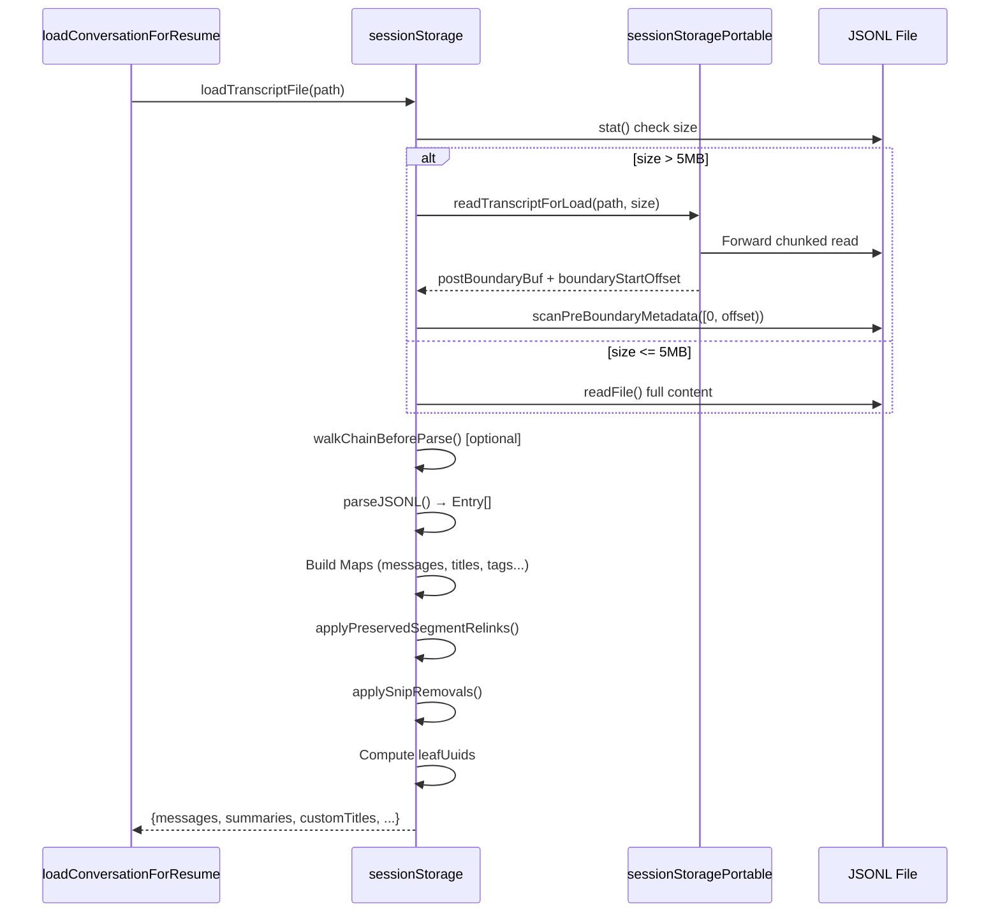
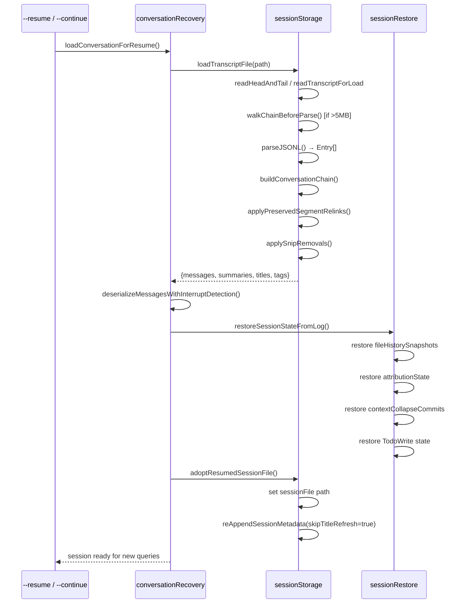
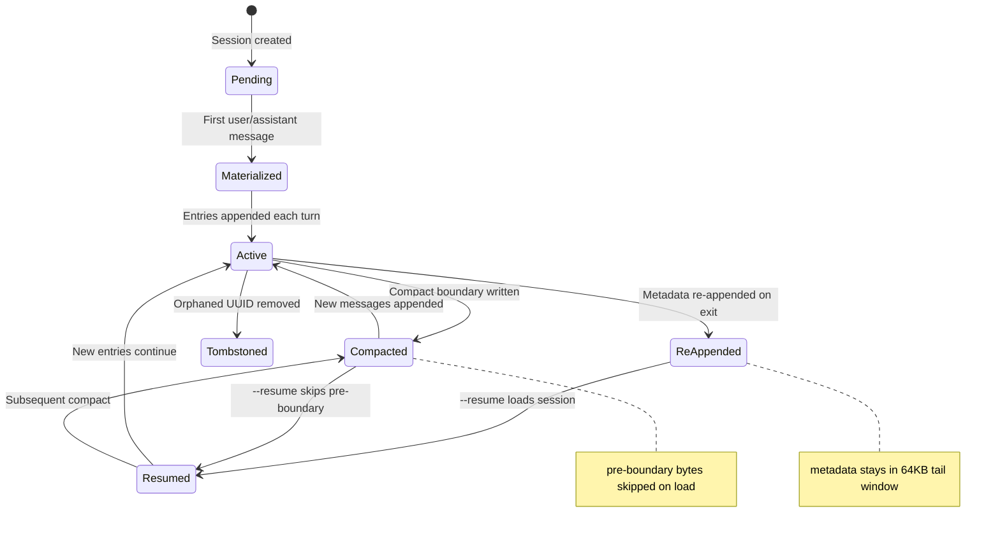

# Session Persistence and Resume

## Overview

A long-running agent that dies with the process is useless. cc solves this with a JSONL-based session persistence layer that survives crashes, network partitions, and user-initiated restarts. Every conversation turn, tool result, compaction boundary, and metadata mutation is appended to a newline-delimited JSON file. On resume, a chain-reconstruction algorithm walks the parent-linked graph from leaf to root, filtering out dead branches, applying snip removals, and re-linking preserved segments — producing a conversation that the model can continue as if nothing happened.

The persistence system is cc's answer to the checkpoint-restore problem defined in the terminology registry: *the ability to save and resume agent state across sessions, implemented via JSONL session persistence and tombstone entries*. The design reflects a specific set of constraints: append-only files (no in-place mutation), multi-process writers (CLI + VS Code SDK), multi-gigabyte session files, and the need to reconstruct a DAG-shaped conversation from a linear sequence of lines.

This chapter covers the two files that implement this system: `src/utils/sessionStoragePortable.ts` (793 LOC) — a pure-Node dependency-free layer shared with the VS Code extension — and `src/utils/sessionStorage.ts` (5105 LOC) — the full persistence engine with write queuing, remote hydration, dedup, and tombstoning. Together they answer: what goes on disk, how it comes back, and what can go wrong. The chapter integrates two HER cross-references: §6.16 Checkpoint-Restore Side Effects (ACRFence), which identifies replay and authority-resurrection attacks specific to agent checkpoint-restore; and §10.3 Session Protocol, which prescribes an 8-step ORIENT→EXIT discipline for session lifecycle management.

## Data structures and contracts

### The Entry union type

Every line in the JSONL file is a serialized `Entry`. The type union in `src/types/logs.ts:L297-L317` enumerates 19 variants:

```typescript
// src/types/logs.ts:L297-L317
export type Entry =
  | TranscriptMessage
  | SummaryMessage
  | CustomTitleMessage
  | AiTitleMessage
  | LastPromptMessage
  | TaskSummaryMessage
  | TagMessage
  | AgentNameMessage
  | AgentColorMessage
  | AgentSettingMessage
  | PRLinkMessage
  | FileHistorySnapshotMessage
  | AttributionSnapshotMessage
  | QueueOperationMessage
  | SpeculationAcceptMessage
  | ModeEntry
  | WorktreeStateEntry
  | ContentReplacementEntry
  | ContextCollapseCommitEntry
  | ContextCollapseSnapshotEntry
```

Four of these are *transcript messages* — the user/assistant/attachment/system entries that form the conversation chain. The remaining 15 are *metadata entries* — sideband records for session state that must survive resume (titles, tags, worktree state, PR links, file history, attribution snapshots, context-collapse commits). The separation matters for the read path: metadata entries are session-scoped and last-wins; transcript messages are chain-scoped and position-dependent.

### TranscriptMessage and the parent chain

The `TranscriptMessage` type extends `SerializedMessage` with the fields that enable chain reconstruction (`src/types/logs.ts:L221-L231`):

```typescript
// src/types/logs.ts:L221-L231
export type TranscriptMessage = SerializedMessage & {
  parentUuid: UUID | null
  logicalParentUuid?: UUID | null
  isSidechain: boolean
  gitBranch?: string
  agentId?: string
  teamName?: string
  agentName?: string
  agentColor?: string
  promptId?: string
}
```

The `parentUuid` field forms a singly-linked list from leaf to root. Compact boundaries null out `parentUuid` to truncate the chain; `logicalParentUuid` preserves the pre-boundary link for reconstruction. The `isSidechain` flag separates main-thread entries from subagent transcripts, which live in separate `.jsonl` files under `subagents/`. The `gitBranch` field is stamped once per message chain via `getBranch()` in `insertMessageChain` (`src/utils/sessionStorage.ts:L1014-L1019`), enabling the session picker to display which branch a conversation was on. The `promptId` field correlates with OpenTelemetry prompt.id for user prompt messages, linking the transcript to observability traces.

The `isTranscriptMessage()` type guard (`src/utils/sessionStorage.ts:L139-L146`) is the single source of truth for what constitutes a transcript message. It was defined in response to bug #14373 and #23537, where progress messages were incorrectly included in the parent chain, creating chain forks that orphaned real conversation messages on resume. The companion `isChainParticipant()` function (`src/utils/sessionStorage.ts:L154-L156`) excludes progress from the parentUuid assignment on the write path, preventing the same class of bugs from recurring.

### Project directory layout

Sessions are stored under `~/.claude/projects/<sanitized-path>/<session-id>.jsonl`. The path sanitization replaces non-alphanumeric characters with hyphens and truncates long paths with a hash suffix (`src/utils/sessionStoragePortable.ts:L311-L319`). Subagent transcripts live in `<project-dir>/<session-id>/subagents/agent-<agentId>.jsonl` with sibling `.meta.json` files for agent type metadata (`src/utils/sessionStorage.ts:L247-L262`). Remote agent metadata occupies a separate directory tree under `remote-agents/`.

```erDiagram
    PROJECT_DIR ||--o{ SESSION_FILE : contains
    PROJECT_DIR ||--o{ SUBAGENT_DIR : contains
    SUBAGENT_DIR ||--o{ AGENT_TRANSCRIPT : contains
    SUBAGENT_DIR ||--o{ AGENT_METADATA : contains
    PROJECT_DIR ||--o{ REMOTE_AGENT_DIR : contains
    REMOTE_AGENT_DIR ||--o{ REMOTE_AGENT_META : contains

    PROJECT_DIR {
        string path "sanitized cwd"
    }
    SESSION_FILE {
        uuid sessionId "PK"
        string jsonl "append-only entries"
    }
    AGENT_TRANSCRIPT {
        uuid agentId "PK"
        string jsonl "sidechain entries"
    }
    AGENT_METADATA {
        uuid agentId "PK"
        string agentType "fork/sync/remote"
        string worktreePath "optional"
        string description "optional"
    }
    REMOTE_AGENT_META {
        string taskId "PK"
        string remoteSessionId "CCR session"
    }
```

### Agent metadata sidecars

When a subagent is spawned, its type and worktree path are persisted to a `.meta.json` sidecar file via `writeAgentMetadata()` (`src/utils/sessionStorage.ts:L283-L290`). On resume, `readAgentMetadata()` restores the agent type so a forked subagent routes to its correct handler rather than degrading silently to general-purpose. The sidecar pattern avoids JSONL schema changes — the transcript file's format remains stable while metadata evolves independently.

Similarly, remote agent metadata is persisted via `writeRemoteAgentMetadata()` (`src/utils/sessionStorage.ts:L337-L344`) and restored on resume to reconnect to still-running CCR sessions. The `listRemoteAgentMetadata()` function (`src/utils/sessionStorage.ts:L373-L399`) scans the directory for all `.meta.json` files, skipping corrupt entries from crashed fire-and-forget writes.

## Control flow

### The write path: append-only with queued batching

Every mutation — a new message, a title change, a compaction boundary — flows through `Project.appendEntry()` (`src/utils/sessionStorage.ts:L1128-L1265`). The method classifies the entry type and routes it:

1. **Metadata entries** (custom-title, tag, mode, agent-name, etc.) are always appended — they never deduplicate because last-wins semantics are correct for session-scoped state.
2. **Transcript messages** (user/assistant/attachment/system) check the `getSessionMessages()` memoized set for UUID dedup. If the UUID is new, it's enqueued for write and added to the set.
3. **Sidechain entries** bypass dedup — forked subagents inherit parent UUIDs from the main session, and deduping against the main set would drop them, leaving the sidechain transcript incomplete (`src/utils/sessionStorage.ts:L1234-L1261`).

Writes are batched through `enqueueWrite()` with a 100ms flush interval (`src/utils/sessionStorage.ts:L567`). The drain loop concatenates entries into a single string, splits at a 100MB chunk boundary, and appends via `fsAppendFile` with mode 0o600 (`src/utils/sessionStorage.ts:L634-L686`):

```typescript
// src/utils/sessionStorage.ts:L606-L616
private enqueueWrite(filePath: string, entry: Entry): Promise<void> {
  return new Promise<void>(resolve => {
    let queue = this.writeQueues.get(filePath)
    if (!queue) {
      queue = []
      this.writeQueues.set(filePath, queue)
    }
    queue.push({ entry, resolve })
    this.scheduleDrain()
  })
}
```

The session file is created lazily: `sessionFile` starts as `null`, entries are buffered in `pendingEntries`, and `materializeSessionFile()` fires on the first user/assistant message (`src/utils/sessionStorage.ts:L976-L991`). This prevents orphan metadata-only files when the user launches with `--name` but quits before sending a message. The guard in `shouldSkipPersistence()` (`src/utils/sessionStorage.ts:L960-L970`) also suppresses writes in test environments, when `cleanupPeriodDays === 0`, or when `--no-session-persistence` is set.

### Remote persistence: Session Ingress and CCR v2

For cloud-connected sessions, transcript messages are also persisted remotely. Two paths exist:

- **v1 Session Ingress**: entries are POSTed to a remote endpoint via `sessionIngress.appendSessionLog()`. If the POST fails, `gracefulShutdownSync(1)` is called — remote persistence failure is treated as fatal because it means the session is irrecoverable on the server side (`src/utils/sessionStorage.ts:L1333-L1343`). The v1 path is gated on `ENABLE_SESSION_PERSISTENCE` env var and the presence of a `remoteIngressUrl`.
- **CCR v2 Internal Events**: entries are written as internal worker events via a registered `InternalEventWriter`. This path uses a 10ms flush interval (vs. 100ms for local-only) to minimize write latency (`src/utils/sessionStorage.ts:L530`). The v2 writer is registered via `setInternalEventWriter()` and takes priority over v1 when both are configured — the v2 path returns early, skipping the v1 POST entirely.

On resume from a cloud session, `hydrateRemoteSession()` (`src/utils/sessionStorage.ts:L1587-L1622`) fetches all remote logs and replaces the local file wholesale. The function calls `switchSession()` to set the session ID, writes the remote entries as concatenated JSONL lines, and then sets the remote ingress URL — ordering matters because persistence must be enabled *after* the local file is hydrated to avoid overwriting fresh data with stale state. `hydrateFromCCRv2InternalEvents()` (`src/utils/sessionStorage.ts:L1632-L1723`) does the same for CCR v2, additionally fetching and writing subagent events grouped by `agent_id` into their respective agent transcript files. Both hydration paths create the project directory with mode 0o700 before writing.

### The read path: head/tail for metadata, full scan for resume

Session listing uses a *lite* read that only touches the first and last 64KB of each file. The `readLiteMetadata()` function (`src/utils/sessionStorage.ts:L4739-L4789`) extracts metadata via raw string search without full JSON parsing — `extractLastJsonStringField()` finds the last occurrence of a key in the tail buffer, naturally implementing last-wins semantics. The head buffer provides the first prompt (via `extractFirstPromptFromChunk`); the tail provides the most recent title, tag, and mode. This avoids parsing megabytes of transcript content just to display the session picker.

The portable layer's `readHeadAndTail()` (`src/utils/sessionStoragePortable.ts:L215-L242`) opens a single file handle, reads the first 64KB, then seeks to the tail offset for the last 64KB — two reads total, one fd, no memory pressure:

```typescript
// src/utils/sessionStoragePortable.ts:L215-L242
export async function readHeadAndTail(
  filePath: string,
  fileSize: number,
  buf: Buffer,
): Promise<{ head: string; tail: string }> {
  try {
    const fh = await fsOpen(filePath, 'r')
    try {
      const headResult = await fh.read(buf, 0, LITE_READ_BUF_SIZE, 0)
      if (headResult.bytesRead === 0) return { head: '', tail: '' }
      const head = buf.toString('utf8', 0, headResult.bytesRead)
      const tailOffset = Math.max(0, fileSize - LITE_READ_BUF_SIZE)
      let tail = head
      if (tailOffset > 0) {
        const tailResult = await fh.read(buf, 0, LITE_READ_BUF_SIZE, tailOffset)
        tail = buf.toString('utf8', 0, tailResult.bytesRead)
      }
      return { head, tail }
    } finally {
      await fh.close()
    }
  } catch {
    return { head: '', tail: '' }
  }
}
```

Full resume uses `loadTranscriptFile()` (`src/utils/sessionStorage.ts:L3472-L3813`), which orchestrates a multi-stage pipeline:



For files exceeding 5MB (the `SKIP_PRECOMPACT_THRESHOLD` in `src/utils/sessionStoragePortable.ts:L480`), `readTranscriptForLoad()` performs a single forward chunked read that strips attribution snapshots at the fd level and truncates on compact boundaries in-stream (`src/utils/sessionStoragePortable.ts:L717-L793`). Peak memory is the *output* size, not the file size — a 151MB session that is 84% stale attr-snaps allocates ~32MB instead of 223MB. The implementation uses a custom `Sink` type with in-place buffer growth and a series of scan functions (`scanChunkLines`, `processStraddle`, `captureSnap`, `captureCarry`, `finalizeOutput`) that process 1MB chunks with O(1) overhead per chunk.

After parsing, two structural fixups run on the in-memory map:

1. **`applyPreservedSegmentRelinks()`** (`src/utils/sessionStorage.ts:L1839-L1956`): When compaction preserves a segment of messages, those entries keep their original `parentUuid` on disk (append-only discipline prevents rewriting). This function splices the preserved chain back into the main chain by patching the head's `parentUuid` to point at the anchor and relinking the anchor's other children to the tail. It also zeroes stale usage tokens in preserved assistant messages to prevent an autocompact spiral on resume.

2. **`applySnipRemovals()`** (`src/utils/sessionStorage.ts:L1982-L2038`): History-snip operations record `removedUuids` in the boundary's `snipMetadata`. This function deletes those entries and relinks survivors across the gap using path compression (`resolve()` walks backward through the deleted region and caches the result for O(1) subsequent lookups).

### Chain reconstruction and dedup

The `buildConversationChain()` function (`src/utils/sessionStorage.ts:L2069-L2094`) walks `parentUuid` from a leaf message to root, detects cycles (logging `tengu_chain_parent_cycle`), and then runs `recoverOrphanedParallelToolResults()` (`src/utils/sessionStorage.ts:L2118-L2206`) to rescue sibling assistant blocks and tool results that the single-parent walk dropped. This is necessary because parallel tool uses create a DAG, not a tree — streaming emits one `AssistantMessage` per `content_block_stop`, so N parallel tool uses produce N messages with distinct UUIDs but the same `message.id`. The walk follows one branch and orphans the rest.

Before parsing, `walkChainBeforeParse()` (`src/utils/sessionStorage.ts:L3306-L3466`) performs a byte-level pre-filter that excises dead fork branches. It builds a stride-3 flat index of transcript messages, walks the parent chain from the last non-sidechain leaf, and produces a stitched buffer containing only chain entries and metadata. Measured impact: a 41MB file with 99% dead branches goes from 56ms parse time to 3.9ms — a 93% reduction. The optimization is gated on buffer size (only runs when `> SKIP_PRECOMPACT_THRESHOLD`) and is skipped when a preserved segment exists (those messages keep pre-compact `parentUuid` that would appear orphaned to the pre-parse walk).

### The resume flow

When `--resume` or `--continue` is invoked, `loadConversationForResume()` in `src/utils/conversationRecovery.ts:L456` orchestrates the full pipeline: load the session log, build the chain, deserialize messages (filtering unresolved tool uses and orphaned thinking blocks via `deserializeMessagesWithInterruptDetection`), then restore all session state via `restoreSessionStateFromLog()` in `src/utils/sessionRestore.ts:L99-L150` — file history snapshots, attribution state, context-collapse commits, and TodoWrite state.



The session file pointer is adopted (not created fresh) via `adoptResumedSessionFile()` (`src/utils/sessionStorage.ts:L1530-L1534`), which sets the in-memory path and re-appends metadata with `skipTitleRefresh = true` — since `restoreSessionMetadata()` populated the cache from the same disk read microseconds ago, refreshing from the tail would be a no-op unless `--name` was used (in which case it would clobber the fresh CLI title with a stale disk value).



### Metadata re-append: keeping the tail window valid

The `reAppendSessionMetadata()` method (`src/utils/sessionStorage.ts:L721-L839`) is called in two contexts: after compaction and on session exit. Its purpose is to ensure that metadata entries (custom-title, tag, agent-name, mode, worktree-state, pr-link) remain within the 64KB tail window that `readLiteMetadata` scans. The cleanup handler registered in `getProject()` (`src/utils/sessionStorage.ts:L449-L466`) flushes queued writes first, then re-appends metadata — ensuring the entries always appear in the last 64KB tail window.

Before re-appending, the method performs a sync tail read via `readFileTailSync()` (`src/utils/sessionStorage.ts:L2592-L2614`) to absorb any fresher values written by an external process (e.g., the VS Code SDK's `renameSession` or `tagSession`). The tail read uses `openSync` / `fstatSync` / `readSync` / `closeSync` — a synchronous fast path that avoids the overhead of the async fs API during shutdown. This external-writer safety ensures that a CLI re-append doesn't clobber an SDK-written title — the tail is authoritative for SDK-mutable fields; the in-memory cache is authoritative for CLI-only fields (last-prompt, agent-*, mode, pr-link). The distinction between SDK-mutable and CLI-only fields is enforced by which fields the tail scan refreshes: only `customTitle` and `tag` are refreshed from the tail (`src/utils/sessionStorage.ts:L741-L762`); all other fields use the cache as-is.

Re-append is unconditional even when the value is already in the tail: during compaction, a title 40KB from EOF is inside the current tail window but will fall out once the post-compaction session grows. Skipping the re-append would defeat the purpose (`src/utils/sessionStorage.ts:L714-L719`). The metadata entries are written in a specific order: `last-prompt` first, then `custom-title`, `tag`, `agent-name`, `agent-color`, `agent-setting`, `mode`, `worktree-state`, and `pr-link` last. This ordering places the most critical fields (custom-title, tag) closer to EOF where they are most likely to be found by the tail scan.

## Edge cases and failure modes

### Tombstone removal and the 50MB guard

When an orphaned message needs to be removed (e.g., a failed streaming attempt), `removeMessageByUuid()` reads the tail, locates the line by UUID needle search (`"uuid":"<targetUuid>"`), and splices it out with `ftruncate` + positional write (`src/utils/sessionStorage.ts:L871-L951`). The needle is the full `"uuid":"<targetUuid>"` pattern, not just the bare UUID — this avoids false matches where the same UUID value appears in a `parentUuid` field of a child entry. The byte-level search is safe because UUIDs are pure ASCII, so no UTF-8 multi-byte sequences need special handling.

For messages not in the last 64KB, a slow path reads the entire file and rewrites it — but this is gated at 50MB (`src/utils/sessionStorage.ts:L121-L123`) to prevent OOM on multi-gigabyte session files (inc-3930). Files larger than 50MB silently skip the tombstone, accepting a small amount of orphaned data rather than crashing. The `removeMessageByUuid` operation is wrapped in `trackWrite()` to coordinate with the flush mechanism — callers can `await flush()` to ensure the removal is durable before proceeding.

```typescript
// src/utils/sessionStorage.ts:L841-L861
async flush(): Promise<void> {
  // Cancel pending timer
  if (this.flushTimer) {
    clearTimeout(this.flushTimer)
    this.flushTimer = null
  }
  // Wait for any in-flight drain to finish
  if (this.activeDrain) {
    await this.activeDrain
  }
  // Drain anything remaining in the queues
  await this.drainWriteQueue()

  // Wait for non-queue tracked operations (e.g. removeMessageByUuid)
  if (this.pendingWriteCount === 0) {
    return
  }
  return new Promise<void>(resolve => {
    this.flushResolvers.push(resolve)
  })
}
```

### Precompact skip and metadata recovery

When `readTranscriptForLoad` truncates at a compact boundary, any metadata entries (agent-setting, mode, pr-link) written before that boundary are lost from the post-boundary buffer. The `scanPreBoundaryMetadata()` function (`src/utils/sessionStorage.ts:L3157-L3224`) performs a cheap byte-level forward scan of `[0, boundaryOffset)` collecting only metadata lines — using raw Buffer matching against `METADATA_MARKER_BUFS` without full JSON parsing. The marker list in `src/utils/sessionStorage.ts:L3113-L3123` includes nine metadata types as raw JSON string patterns (e.g., `"type":"summary"`, `"type":"custom-title"`, `"type":"mode"`). The fast path skips chunks that contain zero markers (the common case — metadata entries are <50 per session). This recovers session-scoped state that would otherwise disappear on resume.

The scan uses `resolveMetadataBuf()` (`src/utils/sessionStorage.ts:L3131-L3147`) to handle lines that straddle chunk boundaries. For carry buffers shorter than the `METADATA_PREFIX_BOUND` (25 bytes), it conservatively concatenates with the next chunk — the carry might be the start of a metadata line. For longer carries, it checks whether the carry starts with `{` and matches a known metadata prefix; if not, it skips to the next newline in the next chunk, avoiding the concatenation entirely. A 64KB guard prevents quadratic carry growth from pathological huge lines — real metadata entries are under 1KB, so anything beyond that is guaranteed to be message content.

### Checkpoint-restore side effects (ACRFence)

HER §6.16 identifies a critical failure mode specific to agent checkpoint-restore: the LLM may re-synthesize subtly different requests after restore, causing duplicate payments, unauthorized credential reuse, or other irreversible side effects. The ACRFence paper (arXiv:2603.20625) names two attack classes — *Action Replay* and *Authority Resurrection*.

cc's current defense is partial. The JSONL format records every tool call, but there is no built-in idempotency key system for external tool calls, no replay-or-fork semantics for irreversible operations, and no explicit marking of which tool effects are externally visible. A resumed session that was interrupted mid-payment could re-execute the payment tool. Developers building long-running agents on top of cc should add idempotency keys to any tool that mutates external state — see HER §12.6 for the full defense-in-depth recommendation.

### Session Protocol alignment

HER §10.3 prescribes an 8-step session protocol (ORIENT → SETUP → VERIFY → SELECT → IMPLEMENT → TEST → UPDATE → EXIT). cc's resume flow implicitly covers ORIENT (loading workspace state from the transcript) and EXIT (graceful shutdown with `reAppendSessionMetadata` + `flush`), but does not enforce SETUP or VERIFY. A resumed agent jumps straight to IMPLEMENT without re-running baseline tests — a potential source of silent divergence if the environment changed between sessions. The `checkResumeConsistency()` function (`src/utils/sessionStorage.ts:L2224-L2243`) emits a `tengu_resume_consistency_delta` metric comparing the reconstructed chain length against recorded checkpoints, but this is observational, not corrective.

### Worktree session state

Worktree state is persisted as a `worktree-state` entry with a tri-state field: `undefined` = never entered, `null` = exited, `object` = currently inside (`src/utils/sessionStorage.ts:L544-L545`). On resume, `null` is distinguished from `undefined` — the former tells the harness not to cd back into a worktree the user explicitly exited. The `PersistedWorktreeSession` type strips ephemeral fields like `creationDurationMs` and `usedSparsePaths` before serialization (`src/utils/sessionStorage.ts:L2893-L2907`) because TypeScript structural typing allows callers to pass full `WorktreeSession` objects, but we don't want those fields in the transcript.

### Ephemeral progress and the chain bridge

Progress entries (`bash_progress`, `powershell_progress`, `mcp_progress`) were removed from the `Entry` type union in PR #24099. But old transcripts still contain them in the `parentUuid` chain. `loadTranscriptFile` builds a `progressBridge` map that chains through consecutive progress entries and rewrites any subsequent message's `parentUuid` to skip past them (`src/utils/sessionStorage.ts:L3623-L3646`). The bridge performs path compression: if a progress entry's parent is itself a progress entry already in the bridge, the lookup resolves to the nearest non-progress ancestor in one step — O(1) chain resolution for any depth of consecutive progress entries. Without this, `buildConversationChain` would terminate at the first progress entry and orphan everything after it. The `isLegacyProgressEntry()` guard (`src/utils/sessionStorage.ts:L169-L178`) runs before the Entry-typed else-if chain because progress is no longer in the union — checking after TypeScript narrows `entry` would intersect with `never`.

The `isEphemeralToolProgress()` function (`src/utils/sessionStorage.ts:L186-L196`) defines the set of high-frequency tool progress types that are UI-only — not sent to the API and not rendered after the tool completes. The set includes `bash_progress`, `powershell_progress`, and `mcp_progress`, with `sleep_progress` conditionally added when the `PROACTIVE` or `KAIROS` feature flags are active. This distinction matters for the REPL's replace-in-place rendering: ephemeral progress updates replace the previous line instead of appending, keeping the terminal output compact.

### AI titles and custom-title precedence

AI-generated titles and user-renamed titles use distinct entry types (`ai-title` vs `custom-title`) and distinct field names (`aiTitle` vs `customTitle`). This separation is load-bearing (`src/utils/sessionStorage.ts:L2643-L2665`): `loadTranscriptFile` only populates `customTitles` from `custom-title` entries, so `restoreSessionMetadata` never caches an AI title and `reAppendSessionMetadata` never re-appends one — preventing the clobber-on-resume bug where a stale AI title overwrites a mid-session user rename. The `readLiteMetadata` function (`src/utils/sessionStorage.ts:L4771-L4775`) naturally disambiguates by checking `customTitle` first, then falling back to `aiTitle`.

## Where cc diverges from the published pattern

### Append-only discipline versus mutable state

The standard database approach to session persistence would use UPDATE-in-place. cc strictly uses append-only JSONL — no entry is ever modified after write. Deletions are represented by omission (chain walks skip orphaned branches) or explicit removal (`removeMessageByUuid` which truncates and re-appends the tail). This design simplifies crash recovery (a partially-written line is just ignored on parse by `parseJSONL`) but creates complexity for chain reconstruction: `applyPreservedSegmentRelinks` and `applySnipRemovals` are pure in-memory fixups that compensate for the gap between what's on disk and what the conversation chain should look like.

### Split portable/main architecture

`sessionStoragePortable.ts` is a deliberate dependency-free extraction shared with the VS Code extension. It contains only path sanitization, UUID validation, JSON string field extraction (`extractJsonStringField` / `extractLastJsonStringField`), first-prompt extraction, and the `readTranscriptForLoad` chunked reader. All cc-specific logic (write queuing, dedup, remote hydration, metadata caching) lives in `sessionStorage.ts`. This split means the extension can list sessions and extract metadata without pulling in the entire cc runtime, but it also means the extension cannot write sessions — that remains a CLI-only capability. The `resolveSessionFilePath()` function (`src/utils/sessionStoragePortable.ts:L403-L466`) is particularly interesting: it handles the Bun/Node hash mismatch for long paths by falling back to prefix-based directory scanning.

### No WAL, no checksums

cc does not use a write-ahead log or per-entry checksums. A crash mid-`fsAppendFile` can produce a partial line at the end of the JSONL. The `parseJSONL` function silently skips unparseable lines, so this is recovered gracefully — the last entry may be lost, but the chain up to the penultimate entry is intact. The tradeoff is simplicity versus durability: for a coding assistant, losing the very last tool result is acceptable; for a payment-processing agent, it would not be.

A subtler form of data loss occurs when the process is killed during `drainWriteQueue`. The drain batches multiple entries into a single `fsAppendFile` call (`src/utils/sessionStorage.ts:L645-L686`); a crash mid-batch loses all entries in that batch, not just the one being written. The `flush()` method (`src/utils/sessionStorage.ts:L841-L861`) cancels the pending timer, waits for any in-flight drain, drains the remaining queue, and then waits for tracked operations to complete — providing a best-effort guarantee that all queued writes land before the process exits. The `registerCleanup()` call in `getProject()` wires this flush into the graceful shutdown path.

### Record transcript with prefix-aware dedup

The `recordTranscript()` function (`src/utils/sessionStorage.ts:L1408-L1449`) implements a subtle dedup strategy. Compaction returns `messagesToKeep` — the same UUIDs as pre-compact messages — which `appendEntry` would skip (they're already in `messageSet`). But `insertMessageChain` still advances the `parentUuid` cursor for skipped messages, which would chain new messages to pre-compact UUIDs instead of the post-compact summary. The fix tracks skipped messages only when they form a *prefix* (appear before any new message). After compaction, new boundary/summary messages appear first, so skipped `messagesToKeep` are not a prefix and don't advance the cursor — the boundary correctly gets `parentUuid = null`.

### Session stamping: per-message provenance

Every transcript message written via `insertMessageChain` is stamped with a set of provenance fields after the message spread (`src/utils/sessionStorage.ts:L1049-L1064`): `userType`, `entrypoint`, `cwd`, `sessionId`, `version`, `gitBranch`, and `slug`. These fields MUST come after the spread to ensure they override any values inherited from forked or resumed messages. The `adoptResumedSessionFile()` function illustrates this principle concisely:

```typescript
// src/utils/sessionStorage.ts:L1530-L1534
export function adoptResumedSessionFile(): void {
  const project = getProject()
  project.sessionFile = getTranscriptPath()
  project.reAppendSessionMetadata(true)
}
```

The comment at `src/utils/sessionStorage.ts:L1049-L1056` documents a concrete bug: without re-stamping, `--fork-session` produces a new session file with messages stamped `sessionId=A` but content-replacement entries stamped `sessionId=FRESH`, causing `loadFullLog`'s sessionId-keyed lookup to miss the replacement records — leading to FROZEN misclassification.

The `sessionId` stamp is particularly important for multi-session files. A single JSONL file can contain messages from multiple sessions (forked branches share the same file), so the `sessionId` field allows `loadTranscriptFile` to partition entries correctly. Metadata maps (customTitles, tags, agentNames, etc.) are all keyed by `sessionId`, not by file path.

## Developer takeaways for building a long-running agent

1. **Append-only is your friend.** The JSONL append discipline means crashes never corrupt earlier entries. Design your entry types upfront because you can never change what's already on disk — only add new entry types and handle old ones gracefully in the loader. cc's 19-entry-type union grew incrementally; each new type (worktree-state, context-collapse-commit, etc.) was added without modifying the loader's handling of existing types. The invariant is simple: every new entry type must be handled by a new branch in the type guard, and the loader's `else` path (unrecognized entries) must log a warning and skip, not crash.

2. **Parent chains beat sequential ordering.** Sequential message lists break on rewind, fork, and compaction. A `parentUuid`-linked chain supports branching, compaction truncation, and chain reconstruction from any leaf — essential for any agent that lets users undo, fork, or compact. The `logicalParentUuid` field preserves pre-boundary links for cases where you need to reconstruct the full topology. The investment in chain-aware data structures pays off immediately: cc's `walkChainBeforeParse` pre-filter reduces parse time by 93% on files with heavy forking, and `recoverOrphanedParallelToolResults` silently rescues DAG-shaped tool results that a tree walk would drop.

3. **Head/tail reads make session listing tractable.** Reading 64KB from each end of the file gives you first prompt, last title, and last tag without parsing megabytes. For agents with sessions that grow to hundreds of megabytes, this is the difference between a snappy session picker and a multi-second stall. The `extractJsonStringField` function extracts values without full JSON parsing — it scans for `"key":"value"` patterns at the byte level. The 64KB buffer size is a deliberate tradeoff: large enough to contain all metadata entries for a typical session (titles, tags, mode, agent settings), small enough to keep I/O under 1ms even on spinning disks.

4. **Lazy file materialization prevents orphans.** Buffering entries in memory until the first real user message means `--name` + quit-before-typing doesn't leave a zero-content file in the session list. This pattern applies anywhere a user can create a named session but abandon it before any substantive work. The `pendingEntries` array acts as a write buffer: if the session is abandoned, the buffer is silently discarded and no file is created on disk.

5. **Idempotency keys for external side effects are not optional.** HER §6.16's ACRFence finding is clear: checkpoint-restore without idempotency is a loaded gun. If your agent calls payment APIs, sends emails, or deploys infrastructure, add idempotency keys at the tool level *before* you enable resume. The JSONL format records what happened; it does not prevent it from happening again. cc's current implementation lacks this — developers building on top should add idempotency annotations to tool schemas and check them in the dispatch pipeline before tool execution, not after.

6. **Plan for chain topology, not just sequence.** Parallel tool uses create DAGs. Compaction creates truncation boundaries. Snip creates gaps. Rewind creates dead branches. Your chain reconstruction must handle all four — cc's `recoverOrphanedParallelToolResults`, `applyPreservedSegmentRelinks`, `applySnipRemovals`, and `walkChainBeforeParse` are not nice-to-haves; they are load-bearing code that was written in response to production failures (e.g., #14373, #23537 — progress entries in the parent chain orphaning real conversation messages on resume). Test your chain reconstruction with adversarial topologies: deeply nested forks, consecutive compaction boundaries, and interleaved progress entries from legacy sessions.

7. **Metadata re-append keeps tail-window reads working.** After compaction, a title entry 40KB from EOF is inside the current tail window but will fall out once the session grows. Unconditional re-append on exit and after compaction ensures metadata stays discoverable. If your agent uses a tail-window read optimization, you need this pattern — without it, `--resume` shows stale titles. The ordering of re-appended fields matters too: cc places the most frequently accessed fields (custom-title, tag) closest to EOF, where the tail scan is most likely to find them.

8. **External-writer safety requires tail-before-cache.** When multiple processes can write to the same JSONL file (CLI + VS Code SDK), the CLI must read the tail before re-appending to avoid clobbering a fresher SDK-written value. The `reAppendSessionMetadata` pattern — read tail, absorb fresher values into cache, then re-append — is a form of last-writer-wins coordination that works without distributed locks because both writers append (never overwrite in-place). The field-level split between SDK-mutable (customTitle, tag) and CLI-only (last-prompt, agent-*, mode) prevents accidental overwrites even when both processes write concurrently.

9. **Session stamping prevents cross-session contamination.** When messages are copied between sessions (fork, resume), every provenance field (sessionId, cwd, entrypoint, version) must be re-stamped after the spread to override inherited values. Without this, a forked session's messages retain the parent's sessionId, breaking metadata lookups and content-replacement resolution. The lesson: never trust inherited metadata in an append-only system — always re-stamp at the write boundary. cc's `insertMessageChain` enforces this by stamping provenance fields after the object spread, not before, ensuring the new session's identity wins.

10. **Graceful shutdown is a persistence concern, not just a UX concern.** The `registerCleanup` + `flush` + `reAppendSessionMetadata` chain ensures that buffered writes land and metadata stays in the tail window. A killed process that doesn't flush can lose the last batch of entries AND have metadata pushed out of the tail window. For any agent that needs durable persistence, graceful shutdown must be wired into every exit path (SIGTERM, SIGINT, uncaught exceptions) — not just the happy path. The `flush()` method's three-phase approach (cancel timer, await in-flight drain, drain remaining queue) provides a model: each phase handles a different class of in-flight write, and skipping any phase risks data loss.

11. **Guard your write path against pathological input.** The 50MB tombstone guard and the 64KB carry-buffer guard exist because production sessions can reach multi-gigabyte sizes. Without size gates, a single `removeMessageByUuid` on a 2GB file would read the entire file into memory and rewrite it — an OOM in waiting. Similarly, the `METADATA_PREFIX_BOUND` (25 bytes) in `resolveMetadataBuf` prevents quadratic carry growth from pathological huge lines. Size guards are not premature optimization; they are production hardening that prevents the worst-case scenario (crash on resume) from occurring on the most valuable sessions (long-running, large files).
