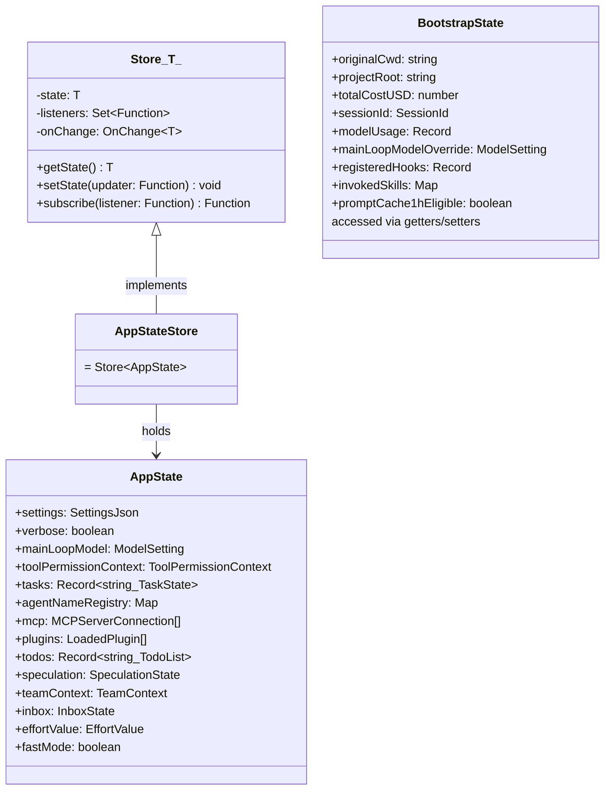
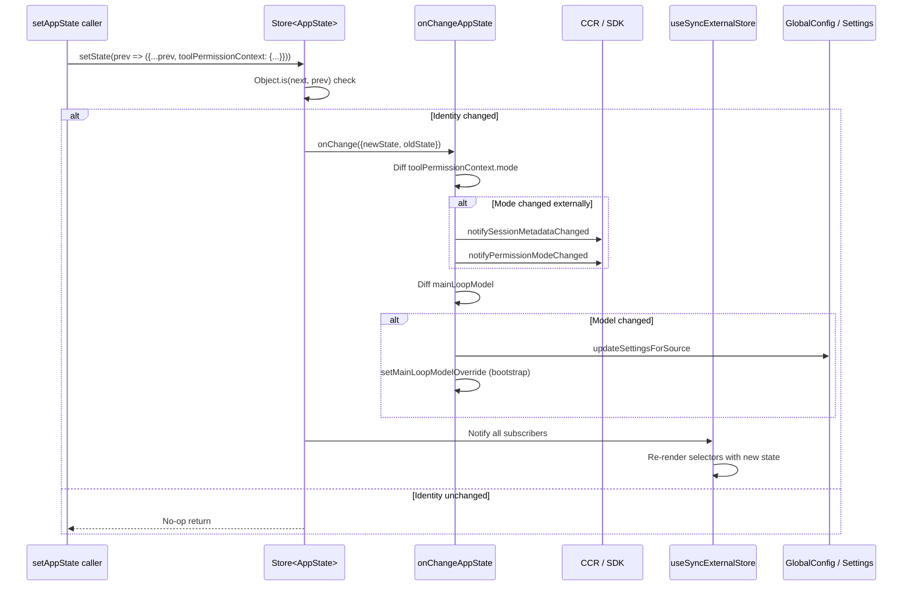

# AppState: The Redux-like Store

## Overview

Every long-running agent needs a single source of truth for its runtime state. In cc, that role is filled by two cooperating systems: a React-context-backed **AppState store** (`src/state/AppStateStore.ts`, `src/state/AppState.tsx`) for UI-reactive state, and a module-scope **bootstrap state** (`src/bootstrap/state.ts`) for infrastructure-level values that must exist before React mounts. Together they form a Redux-like architecture — centralized state, functional updates, subscriber notification — but without the boilerplate of actions, dispatchers, or middleware.

This chapter dissects both layers. The AppState store is the one your React components subscribe to via `useAppState(selector)`. The bootstrap state is the mutable singleton that holds cost counters, session IDs, telemetry providers, and other values that must survive across the React tree's lifecycle (including headless and SDK mode, where React never mounts). Understanding how they interact — and where they deliberately don't — is essential for anyone building a harness that needs both reactivity and durability.

The HER reference architecture's Layer 2 (Session Management) calls for a "session startup protocol" and "clean exit protocol" that update state, commit, and persist notes. cc's dual-state system is its concrete answer: AppState for the live session's reactive picture, bootstrap state for the cross-session durable counters.

## Data structures and contracts

### The AppState type

`AppState` is a deeply immutable object (wrapped with `DeepImmutable<>`) that holds every piece of reactive state the terminal UI needs. It is defined across approximately 450 lines of type declarations in `src/state/AppStateStore.ts:L89-L452`.

```typescript
// src/state/AppStateStore.ts:L89-L158
export type AppState = DeepImmutable<{
  settings: SettingsJson
  verbose: boolean
  mainLoopModel: ModelSetting
  mainLoopModelForSession: ModelSetting
  statusLineText: string | undefined
  expandedView: 'none' | 'tasks' | 'teammates'
  isBriefOnly: boolean
  showTeammateMessagePreview?: boolean
  selectedIPAgentIndex: number
  coordinatorTaskIndex: number
  viewSelectionMode: 'none' | 'selecting-agent' | 'viewing-agent'
  footerSelection: FooterItem | null
  toolPermissionContext: ToolPermissionContext
  spinnerTip?: string
  agent: string | undefined
  kairosEnabled: boolean
  remoteSessionUrl: string | undefined
  remoteConnectionStatus:
    | 'connecting'
    | 'connected'
    | 'reconnecting'
    | 'disconnected'
  remoteBackgroundTaskCount: number
  replBridgeEnabled: boolean
  replBridgeExplicit: boolean
  replBridgeOutboundOnly: boolean
  replBridgeConnected: boolean
  replBridgeSessionActive: boolean
  replBridgeReconnecting: boolean
  // ... many more fields
}>
```

The type is split into two parts: the `DeepImmutable<>`-wrapped core (UI-reactive, structural-sharing-friendly) and an intersection with a set of fields that cannot be made deeply immutable because they contain function types or `Map` instances.

```typescript
// src/state/AppStateStore.ts:L159-L167
}> & {
  tasks: { [taskId: string]: TaskState }
  agentNameRegistry: Map<string, AgentId>
  foregroundedTaskId?: string
  viewingAgentTaskId?: string
  companionReaction?: string
  companionPetAt?: number
  // ...
}
```

The intersection hack exists because `TaskState` contains function references (abort callbacks) and `Map` is not deeply readonly-friendly. This split is intentional: the `DeepImmutable` wrapper catches accidental mutations at compile time for the majority of fields, while the mutable escape hatch acknowledges runtime reality.

Notable fields within AppState include:

- **`toolPermissionContext`** — the active permission mode and its derived rules. This is the single most-watched field because it controls tool-access behavior for the entire session. Changes to its `mode` property trigger the most complex side effects in `onChangeAppState`.
- **`teamContext`** — the swarm/team membership registry (`src/state/AppStateStore.ts:L323-L345`). Contains the team name, file path, lead agent ID, and a map of teammate descriptors indexed by ID. Each teammate entry tracks its tmux session, pane ID, working directory, worktree path, and spawn timestamp. This field is only populated when `ENABLE_AGENT_SWARMS` is true.
- **`speculation`** — the speculative execution state machine (`src/state/AppStateStore.ts:L59-L77`). Tracks whether the agent is speculatively executing a tool call ahead of user confirmation, including a mutable messages reference and written-paths overlay that avoids array spreading per message.
- **`mcp`** — the MCP connection registry with clients, tools, commands, resources, and a `pluginReconnectKey` counter that is incremented by `/reload-plugins` to trigger MCP effects to re-run and pick up newly-enabled plugin MCP servers (`src/state/AppStateStore.ts:L173-L184`).

### The Store contract

The actual store is a 34-line function in `src/state/store.ts` that implements the same interface as Redux's store, minus the action/reducer ceremony:

```typescript
// src/state/store.ts:L1-L34
type Listener = () => void
type OnChange<T> = (args: { newState: T; oldState: T }) => void

export type Store<T> = {
  getState: () => T
  setState: (updater: (prev: T) => T) => void
  subscribe: (listener: Listener) => () => void
}

export function createStore<T>(
  initialState: T,
  onChange?: OnChange<T>,
): Store<T> {
  let state = initialState
  const listeners = new Set<Listener>()

  return {
    getState: () => state,
    setState: (updater: (prev: T) => T) => {
      const prev = state
      const next = updater(prev)
      if (Object.is(next, prev)) return
      state = next
      onChange?.({ newState: next, oldState: prev })
      for (const listener of listeners) listener()
    },
    subscribe: (listener: Listener) => {
      listeners.add(listener)
      return () => listeners.delete(listener)
    },
  }
}
```

Three design choices deserve attention. First, `setState` takes an **updater function** `(prev: T) => T`, not a partial object. This forces callers to explicitly spread the previous state, making mutations traceable. Second, the `Object.is` identity check means that returning the same reference is a no-op — a critical optimization for `useSyncExternalStore`, which relies on reference equality to skip re-renders. Third, the optional `onChange` callback fires **before** listeners are notified, giving the system a single choke point for side effects.

### The bootstrap State type

In contrast to AppState's immutable snapshots, the bootstrap state (`src/bootstrap/state.ts`) is a mutable singleton accessed through getter/setter pairs. Its type spans over 250 fields:

```typescript
// src/bootstrap/state.ts:L45-L257
type State = {
  originalCwd: string
  projectRoot: string
  totalCostUSD: number
  totalAPIDuration: number
  totalAPIDurationWithoutRetries: number
  totalToolDuration: number
  turnHookDurationMs: number
  turnToolDurationMs: number
  turnClassifierDurationMs: number
  turnToolCount: number
  turnHookCount: number
  turnClassifierCount: number
  startTime: number
  lastInteractionTime: number
  totalLinesAdded: number
  totalLinesRemoved: number
  hasUnknownModelCost: boolean
  cwd: string
  modelUsage: { [modelName: string]: ModelUsage }
  mainLoopModelOverride: ModelSetting | undefined
  initialMainLoopModel: ModelSetting
  // ... telemetry, session, color, cache, and feature-flag state
  sessionId: SessionId
  parentSessionId: SessionId | undefined
  // ...
}
```

The bootstrap state's comment at `src/bootstrap/state.ts:L31` says it plainly: `// DO NOT ADD MORE STATE HERE - BE JUDICIOUS WITH GLOBAL STATE`. This is not a suggestion — the file is a DAG leaf in the import graph, and every new field ripples through the module's getter/setter surface.

```typescript
// src/bootstrap/state.ts:L429
const STATE: State = getInitialState()
```

The singleton is a module-scoped `const`. There is no `subscribe` mechanism, no change notification, and no structural sharing. When code calls `addToTotalCostState(cost, modelUsage, model)`, it mutates `STATE.totalCostUSD` in place and walks away.

### The class diagram



## Control flow

### State creation and injection

The `AppStateProvider` React component creates the store once and injects it via context. The relevant source-mapped code (the on-disk file is React compiler output; the original source is recovered via the embedded source map) shows:

```typescript
// src/state/AppState.tsx — source-mapped from L37-L57
const [store] = useState(() =>
  createStore<AppState>(
    initialState ?? getDefaultAppState(),
    onChangeAppState,
  ),
)
```

The `useState` initializer runs once per mount. The `onChangeAppState` callback is passed as the store's `onChange` parameter, meaning it fires on every `setState` call that produces a new reference. The store itself is a stable reference — `AppStoreContext.Provider` receives it, and consumers read it via `useContext`. Note that on disk, the React compiler transforms this into memo-cache checks (`$[0] !== initialState || $[1] !== onChangeAppState`) that guard the initializer, but the semantics are identical.

The `getDefaultAppState()` function in `src/state/AppStateStore.ts:L456-L569` constructs the initial state, including a dynamic check for teammate plan-mode requirements:

```typescript
// src/state/AppStateStore.ts:L459-L467
const teammateUtils =
  require('../utils/teammate.js') as typeof import('../utils/teammate.js')
const initialMode: PermissionMode =
  teammateUtils.isTeammate() && teammateUtils.isPlanModeRequired()
    ? 'plan'
    : 'default'
```

The lazy `require` avoids a circular dependency: `AppStateStore` is imported early in the module graph, and `teammate.js` transitively imports state-consuming code.

### Subscriber notification: the onChangeAppState side-effect pipeline

When `setState` produces a new reference, `onChangeAppState` receives both old and new state. This function in `src/state/onChangeAppState.ts:L43-L171` is the single choke point for state-derived side effects. Its most critical responsibility is synchronizing the permission mode to CCR (the remote agent controller) and the SDK status stream:

```typescript
// src/state/onChangeAppState.ts:L65-L92
const prevMode = oldState.toolPermissionContext.mode
const newMode = newState.toolPermissionContext.mode
if (prevMode !== newMode) {
  const prevExternal = toExternalPermissionMode(prevMode)
  const newExternal = toExternalPermissionMode(newMode)
  if (prevExternal !== newExternal) {
    const isUltraplan =
      newExternal === 'plan' &&
      newState.isUltraplanMode &&
      !oldState.isUltraplanMode
        ? true
        : null
    notifySessionMetadataChanged({
      permission_mode: newExternal,
      is_ultraplan_mode: isUltraplan,
    })
  }
  notifyPermissionModeChanged(newMode)
}
```

The comment block above this code explains why it exists: before this centralized diff, mode changes were relayed by only 2 of 8+ mutation paths. Shift+Tab cycling, ExitPlanMode dialog choices, the `/plan` slash command, rewind, and the REPL bridge all mutated `AppState` without notifying CCR, leaving `external_metadata.permission_mode` stale. Hooking the diff here means **any** `setState` call that changes the mode automatically propagates.

The function also handles persistence side effects:

- **Model override → settings**: When `mainLoopModel` changes, the new value is persisted to user settings and propagated to the bootstrap state via `setMainLoopModelOverride` (`src/state/onChangeAppState.ts:L96-L112`).
- **Expanded view → global config**: `expandedView` changes are translated to `showExpandedTodos` / `showSpinnerTree` and persisted (`src/state/onChangeAppState.ts:L115-L128`).
- **Verbose → global config**: Verbose toggle is persisted (`src/state/onChangeAppState.ts:L131-L140`).
- **Settings → cache invalidation**: When the `settings` object changes, auth caches (API key, AWS, GCP) are cleared, and environment variables are re-applied (`src/state/onChangeAppState.ts:L156-L170`).

### The useAppState subscription hook

React components subscribe to slices of AppState via `useAppState`, which wraps `useSyncExternalStore`. The source-mapped original (the on-disk file is React compiler output) reads:

```typescript
// src/state/AppState.tsx — source-mapped from L142-L163
export function useAppState<T>(selector: (state: AppState) => T): T {
  const store = useAppStore()
  const get = () => {
    const state = store.getState()
    const selected = selector(state)
    return selected
  }
  return useSyncExternalStore(store.subscribe, get, get)
}
```

The `selector` pattern means components only re-render when their specific slice changes (compared via `Object.is`). The JSDoc warns against returning new objects from selectors — `Object.is` would see them as changed on every call, triggering infinite re-renders. Instead, callers should select existing sub-object references.

For write-only access, `useSetAppState()` returns the `setState` function directly with zero subscription overhead. The source-mapped version:

```typescript
// src/state/AppState.tsx — source-mapped from L170-L172
export function useSetAppState() {
  return useAppStore().setState
}
```

### The bootstrap state: getter/setter mutation

The bootstrap state has no subscription mechanism. Code reads it via getters like `getSessionId()` and mutates it via setters like `addToTotalCostState()`. This is by design: the bootstrap state holds values that either (a) don't change during a session (session ID, project root), (b) change too frequently for React re-renders (cost counters, token budgets), or (c) must be accessible before React mounts (telemetry providers, CLI flags).

The session ID switch illustrates the atomicity contract:

```typescript
// src/bootstrap/state.ts:L468-L479
export function switchSession(
  sessionId: SessionId,
  projectDir: string | null = null,
): void {
  STATE.planSlugCache.delete(STATE.sessionId)
  STATE.sessionId = sessionId
  STATE.sessionProjectDir = projectDir
  sessionSwitched.emit(sessionId)
}
```

`sessionId` and `sessionProjectDir` always change together — there is no separate setter for either. The signal-based `onSessionSwitch` subscription replaces the missing `onChange` hook for the few consumers that need to react to session switches.

### The external settings bridge

AppState and the filesystem share a bidirectional synchronization channel, but the two directions use different mechanisms. State-to-disk is handled by `onChangeAppState` as described above. Disk-to-state is handled by a `useSettingsChange` hook that fires when the file watcher detects changes to `settings.json`. The source-mapped original:

```typescript
// src/state/AppState.tsx — source-mapped from L84-L91
const onSettingsChange = useEffectEvent(
  (source: SettingSource) => applySettingsChange(source, store.setState),
)
useSettingsChange(onSettingsChange)
```

The `useEffectEvent` wrapper ensures the callback uses the latest `store.setState` reference without causing the effect to re-run. When a settings file changes on disk (user edit, external process, managed policy push), `applySettingsChange` reads the new settings and calls `store.setState` to merge them into AppState. This then triggers `onChangeAppState`, which may fire additional side effects (cache invalidation, CCR notification) — creating a full round-trip: disk → state → side effects → disk.

The bridge also handles the case where remote settings arrive before React mounts. The `useSettingsChange` hook is registered in `AppStateProvider`, but on the first session the GrowthBook fetch may complete before the component tree renders. The mount-time `useEffect` (source-mapped from `src/state/AppState.tsx:L62-L70`) catches this edge case by checking `isBypassPermissionsModeDisabled()` synchronously.

### Cost accumulation: why it lives in bootstrap

The most frequently mutated fields in the entire codebase are `totalCostUSD`, `totalAPIDuration`, and the per-model `modelUsage` map. These are updated after every API response in `src/bootstrap/state.ts:L557-L564`:

```typescript
// src/bootstrap/state.ts:L557-L564
export function addToTotalCostState(
  cost: number,
  modelUsage: ModelUsage,
  model: string,
): void {
  STATE.modelUsage[model] = modelUsage
  STATE.totalCostUSD += cost
}
```

If these counters lived in AppState, each API response would trigger `setState` → `onChange` → subscriber notification → potential React re-renders. The UI only reads cost values at render boundaries (the footer status line), so the re-renders would be wasted work. By keeping them in the mutable bootstrap singleton, the API layer increments counters in O(1) time with zero React overhead. The UI reads the latest values via `getTotalCostUSD()` during its own render cycle, which is already scheduled by other state changes (streaming tokens, tool results).

### Sequence diagram: state change propagation



## Edge cases and failure modes

### Nested AppStateProvider guard

If `AppStateProvider` is accidentally nested (a common React mistake), the code throws immediately. The source-mapped original:

```typescript
// src/state/AppState.tsx — source-mapped from L44-L48
const hasAppStateContext = useContext(HasAppStateContext)
if (hasAppStateContext) {
  throw new Error(
    'AppStateProvider can not be nested within another AppStateProvider',
  )
}
```

Without this guard, two stores would exist simultaneously, and `useAppState` would subscribe to the inner one while parent components read from the outer one — a silently broken state that is extremely difficult to debug.

### Race condition: remote settings before mount

The `useEffect` that checks bypass-permissions disable handles a subtle timing issue documented at `src/state/AppState.tsx:L62-L70`:

```typescript
// src/state/AppState.tsx:L62-L70
useEffect(() => {
  const { toolPermissionContext } = store.getState()
  if (
    toolPermissionContext.isBypassPermissionsModeAvailable &&
    isBypassPermissionsModeDisabled()
  ) {
    logForDebugging(
      'Disabling bypass permissions mode on mount (remote settings loaded before mount)',
    )
    store.setState(prev => ({
      ...prev,
      toolPermissionContext: createDisabledBypassPermissionsContext(
        prev.toolPermissionContext,
      ),
    }))
  }
}, [])
```

On the first session, remote settings (managed policies) may arrive via a GrowthBook fetch that completes **before** React mounts. The settings change notification fires into the void because no listeners are subscribed. This mount-time check catches the stale state by reading the current `isBypassPermissionsModeDisabled()` value (which reflects the remote fetch) and applying it retroactively.

### Selector returning the whole state

The `useAppState` hook includes a dev-only guard against selectors that return the entire state object. On disk, the compiled output reads:

```typescript
// src/state/AppState.tsx:L150-L151 (compiled output)
if ("external" === "ant" && state === selected) {
  throw new Error(
    `Your selector in \`useAppState(${selector.toString()})\` returned the original state, which is not allowed. You must instead return a property for optimised rendering.`,
  )
}
```

The `"external" === "ant"` condition is a dead-code-eliminated feature gate: in external builds the comparison is always `false`, so the guard is a no-op in production. In the internal ("ant") build, returning the full state from a selector would cause the component to re-render on **every** `setState` call, defeating the purpose of slice-based subscriptions. The pattern to use instead is destructuring: `const { text, promptId } = useAppState(s => s.promptSuggestion)`.

### Bootstrap state has no test isolation by default

The bootstrap singleton (`const STATE: State = getInitialState()`) is shared across all tests unless `resetStateForTests()` is called explicitly. The function itself has a guard:

```typescript
// src/bootstrap/state.ts:L919-L921
export function resetStateForTests(): void {
  if (process.env.NODE_ENV !== 'test') {
    throw new Error('resetStateForTests can only be called in tests')
  }
```

Missing a reset call between tests can cause state leakage — a test that mutates `STATE.sessionId` can poison the next test's assertions. The AppState store does not have this problem because each `AppStateProvider` mount creates a fresh store instance.

The reset function itself is blunt: it iterates over `getInitialState()` entries and overwrites every field:

```typescript
// src/bootstrap/state.ts:L923-L929
Object.entries(getInitialState()).forEach(([key, value]) => {
  STATE[key as keyof State] = value as never
})
outputTokensAtTurnStart = 0
currentTurnTokenBudget = null
budgetContinuationCount = 0
sessionSwitched.clear()
```

The `as never` cast bypasses TypeScript's type checker — a pragmatic choice for a test-only utility. The function also resets module-scoped variables (`outputTokensAtTurnStart`, `currentTurnTokenBudget`) that are not part of the `State` type but affect cost computation. This is a maintenance hazard: any new module-scoped variable added to `bootstrap/state.ts` must be manually added to the reset function, or tests will silently carry stale values.

### The `useAppStateMaybeOutsideOfProvider` escape hatch

Some components may render in contexts where `AppStateProvider` isn't available (e.g., bridge-related UI that renders before the full React tree). The `useAppStateMaybeOutsideOfProvider` hook (source-mapped from `src/state/AppState.tsx:L186-L199`) handles this by returning `undefined` instead of throwing. The source-mapped original:

```typescript
// src/state/AppState.tsx — source-mapped from L186-L199
export function useAppStateMaybeOutsideOfProvider<T>(
  selector: (state: AppState) => T,
): T | undefined {
  const store = useContext(AppStoreContext)
  return useSyncExternalStore(
    store ? store.subscribe : NOOP_SUBSCRIBE,
    () => store ? selector(store.getState()) : undefined,
  )
}
```

When no store is available, the hook subscribes to a no-op listener (`NOOP_SUBSCRIBE = () => () => {}`) and returns `undefined`. This avoids the `ReferenceError` that `useAppState` would throw, at the cost of requiring callers to handle the `undefined` case.

### Settings change → cache invalidation error handling

The `onChangeAppState` settings-diff handler wraps cache invalidation in a try/catch:

```typescript
// src/state/onChangeAppState.ts:L156-L170
if (newState.settings !== oldState.settings) {
  try {
    clearApiKeyHelperCache()
    clearAwsCredentialsCache()
    clearGcpCredentialsCache()
    if (newState.settings.env !== oldState.settings.env) {
      applyConfigEnvironmentVariables()
    }
  } catch (error) {
    logError(toError(error))
  }
}
```

If any cache clear fails, the error is logged but does not propagate. This is intentional: a failed cache invalidation should not crash the entire state-update cycle. The next API call will re-authenticate from scratch, which is a safe fallback.

## Where cc diverges from the published pattern

### No action types or dispatcher

Redux mandates named action types (`{ type: 'SET_VERBOSE', payload: true }`) that flow through a dispatcher and are handled by pure reducer functions. cc's `setState(updater)` accepts an arbitrary function. This eliminates the action-type enumeration, the switch/case reducer boilerplate, and the middleware pipeline — but it also eliminates the debugging affordance of a serialized action log. When something goes wrong in state, you cannot replay a sequence of named actions; you must inspect the `onChange` diff.

### Two state systems instead of one

The HER reference architecture's Layer 2 envisions a single session state object that is updated atomically on startup and shutdown. cc splits this into AppState (React-reactive, immutable snapshots) and bootstrap state (mutable singleton, no reactivity). The split exists because:

1. **Headless/SDK mode never mounts React.** The bootstrap state must hold cost counters and session metadata that are written by the API layer, which runs before any React component exists.
2. **Performance.** Cost and token counters increment on every API response. If these lived in AppState, every `setState` would trigger subscriber notification and potential re-renders, even though the UI only reads these values at render boundaries.
3. **Import graph isolation.** `bootstrap/state.ts` is a DAG leaf — it cannot import React or any React-dependent module. AppState depends on React.

The tradeoff is synchronization complexity: `onChangeAppState` bridges the two systems by pushing some AppState changes into bootstrap setters (e.g., `setMainLoopModelOverride`), but the bridge is one-directional. Bootstrap state changes do not automatically propagate to AppState.

### DeepImmutable vs. mutable escape hatch

Redux enforces immutability at runtime via `Object.is` checks in its middleware. cc uses TypeScript's `DeepImmutable<>` wrapper for compile-time enforcement, but carves out exceptions for fields containing functions, `Map` instances, and `Set` instances. This is a pragmatic compromise — `TaskState` includes abort callbacks that cannot be deeply frozen — but it means the immutability guarantee is partial, and runtime enforcement is limited to the `Object.is` identity check in `setState`.

### No middleware, no enhancers

Redux's store enhancer and middleware system allows cross-cutting concerns (logging, analytics, persistence) to be composed into the dispatch pipeline. cc's `onChange` callback is a single function. Cross-cutting concerns are handled inline within `onChangeAppState`, which sequentially checks every field diff. This is simpler but less extensible — adding a new side effect requires editing `onChangeAppState` rather than composing a new middleware.

### The external metadata reverse bridge

The HER reference architecture's Layer 2 specifies that session state should be restorable from structured files. cc implements a partial version of this via `externalMetadataToAppState` in `src/state/onChangeAppState.ts:L24-L41`:

```typescript
// src/state/onChangeAppState.ts:L24-L41
export function externalMetadataToAppState(
  metadata: SessionExternalMetadata,
): (prev: AppState) => AppState {
  return prev => ({
    ...prev,
    ...(typeof metadata.permission_mode === 'string'
      ? {
          toolPermissionContext: {
            ...prev.toolPermissionContext,
            mode: permissionModeFromString(metadata.permission_mode),
          },
        }
      : {}),
    ...(typeof metadata.is_ultraplan_mode === 'boolean'
      ? { isUltraplanMode: metadata.is_ultraplan_mode }
      : {}),
  })
}
```

This function produces a **state updater** (not a direct mutation) that a worker process applies when it restarts and receives its `external_metadata` from CCR. It translates the external wire format (`permission_mode` as a string) back into the internal `PermissionMode` enum, and restores the ultraplan flag. The function is called on the worker side (not the leader), enabling a freshly-spawned worker to reconstruct the leader's permission state from the CCR metadata payload.

## Developer takeaways for building a long-running agent

**1. Plan for two state systems from day one.** cc's split between AppState (React-reactive) and bootstrap state (mutable singleton) emerged from real constraints: headless mode, performance, and import-graph isolation. Put cost counters, session IDs, and telemetry providers in a React-agnostic module.

**2. The `onChange` diff is your single choke point.** Without centralized diffing, each mutation site must remember to notify every consumer. cc's `onChangeAppState` pattern ensures any `setState` call triggers all side effects regardless of origin.

**3. Selector discipline matters more than store architecture.** The `useAppState(selector)` pattern gives per-slice subscriptions for free, but only if selectors return stable references. A selector creating new objects on every call (`s => ({ a: s.a, b: s.b })`) defeats the optimization entirely.

**4. Keep bootstrap state small and append-only.** Every field added to the bootstrap singleton increases the test-reset surface and synchronization complexity. Prefer AppState for anything that changes during a session; reserve bootstrap state for startup-once or monotonically accumulating values.

**5. Model the state-to-persistence bridge explicitly.** Decide whether state is the source of truth with disk as mirror (cc's approach) or vice versa. The former is simpler but can lose writes during crashes; the latter requires conflict resolution.
