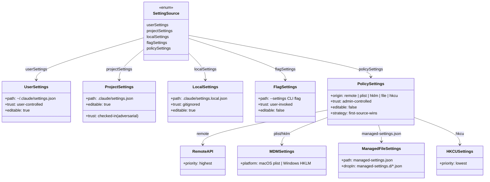
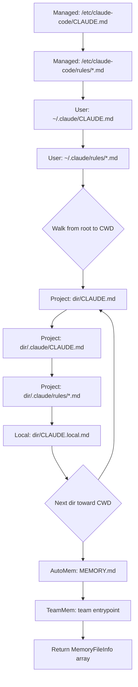
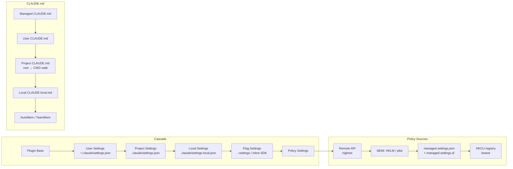

# CLAUDE.md, Settings Cascade, and Managed Settings

## Overview

Every long-running agent needs a way to absorb human intent without requiring a human in the loop on every turn. cc solves this with two complementary mechanisms: a **settings cascade** that merges configuration from six ordered sources, and the **CLAUDE.md** instruction file system that deterministically injects prose instructions into every query's system prompt. The settings cascade controls *structural* behavior — which tools are available, what permissions apply, which MCP servers are trusted. The CLAUDE.md system controls *behavioral* guidance — coding conventions, project context, workflow preferences. Together they form the first and most fundamental of HER's six configuration surfaces (Section 7).

The design reflects a core harness-engineering insight: **more instruction is not always better**. An ETH Zurich study (arXiv:2602.11988, "Evaluating AGENTS.md") found that context files tend to *reduce* task success rates compared to providing no repository context, while also increasing inference cost by over 20%. The paper recommends describing only "minimal requirements" — verbose instructions and detailed directory trees hurt rather than help. cc's cascade and CLAUDE.md systems embody this principle through explicit source gating, content truncation, and the ability for enterprise administrators to lock surfaces down entirely.

The two systems — settings and CLAUDE.md — are deeply intertwined. The settings cascade controls *which* CLAUDE.md sources are loaded: the `--setting-sources` flag can disable project or user sources, the `claudeMdExcludes` field can exclude individual files by glob pattern, and `strictPluginOnlyCustomization` can block all non-managed instruction surfaces. Settings are the meta-layer that governs the instruction layer. This chapter walks through both systems from data structures through control flow to the security model that protects the cascade from abuse.

## Data structures and contracts

### SettingSource and the cascade order

The five canonical sources are defined in `src/utils/settings/constants.ts`:

```typescript
// src/utils/settings/constants.ts:L7-L22
export const SETTING_SOURCES = [
  // User settings (global)
  'userSettings',

  // Project settings (shared per-directory)
  'projectSettings',

  // Local settings (gitignored)
  'localSettings',

  // Flag settings (from --settings flag)
  'flagSettings',

  // Policy settings (managed-settings.json or remote settings from API)
  'policySettings',
] as const
```

Later sources override earlier ones via `lodash.mergeWith` with a custom array-concatenation strategy. The `getEnabledSettingSources()` function always includes `policySettings` and `flagSettings` regardless of what the `--setting-sources` CLI flag specifies, ensuring enterprise and CLI overrides can never be accidentally disabled (`src/utils/settings/constants.ts:L159-L167`). This is a non-negotiable invariant: even if a user passes `--setting-sources user`, policy and flag settings are still loaded and still win.

Each source maps to a specific file path. User settings live at `~/.claude/settings.json` (or `cowork_settings.json` in cowork mode). Project settings live at `<project>/.claude/settings.json`. Local settings — the gitignored sibling — live at `<project>/.claude/settings.local.json`. Flag settings can come from either the `--settings` CLI flag (a path to a JSON file) or from inline SDK settings. Policy settings come from the highest-priority managed source: remote API, MDM, managed-settings.json, or HKCU registry (`src/utils/settings/settings.ts:L274-L296`).

### Settings source class diagram

The relationship between source types, their storage, and their trust boundaries:



This diagram captures the critical trust boundary: `ProjectSettings` is marked adversarial because it is checked into version control and visible to anyone with repository access, while `PolicySettings` uses the first-source-wins strategy rather than deep merge, ensuring enterprise policy is atomic.

### SettingsJson schema

The unified `SettingsSchema` in `src/utils/settings/types.ts` is the single Zod schema that validates every settings file regardless of source. It defines 40+ optional fields covering permissions, hooks, MCP server allowlists/denylists, model overrides, sandbox configuration, plugin management, and enterprise policy controls:

```typescript
// src/utils/settings/types.ts:L255-L265
export const SettingsSchema = lazySchema(() =>
  z
    .object({
      $schema: z
        .literal(CLAUDE_CODE_SETTINGS_SCHEMA_URL)
        .optional()
        .describe('JSON Schema reference for Claude Code settings'),
      apiKeyHelper: z
        .string()
        .optional()
        .describe('Path to a script that outputs authentication values'),
```

The schema uses `lazySchema()` to defer evaluation until first access, avoiding circular-dependency issues during module initialization. The outer `.passthrough()` preserves unknown fields so that downlevel clients reading settings written by newer versions don't silently drop data — a backward-compatibility contract enforced by dedicated tests (`src/utils/settings/types.ts:L1072`). The schema is also gated by feature flags: fields like `autoMode`, `skipAutoPermissionPrompt`, and `useAutoModeDuringPlan` only appear when the `TRANSCRIPT_CLASSIFIER` feature is active, and `xaaIdp` only appears when `CLAUDE_CODE_ENABLE_XAA` is set. This means the schema itself is environment-dependent, which is why `lazySchema()` defers until runtime.

Several fields have significant security semantics. The `permissions` sub-schema contains `allow`, `deny`, and `ask` arrays of permission rules, a `defaultMode` enum, a `disableBypassPermissionsMode` kill switch, and `additionalDirectories` for expanding the permission scope. The `allowedMcpServers` and `deniedMcpServers` arrays implement an enterprise MCP allowlist/denylist with mutual-exclusion validation (each entry must specify exactly one of `serverName`, `serverCommand`, or `serverUrl`). The denylist always takes precedence over the allowlist — if a server appears on both, it is denied (`src/utils/settings/types.ts:L417-L434`).

### MemoryFileInfo and CLAUDE.md discovery

The CLAUDE.md system produces `MemoryFileInfo` records, each representing one instruction file loaded into context:

```typescript
// src/utils/claudemd.ts:L229-L243
export type MemoryFileInfo = {
  path: string
  type: MemoryType
  content: string
  parent?: string // Path of the file that included this one
  globs?: string[] // Glob patterns for file paths this rule applies to
  // True when auto-injection transformed `content` (stripped HTML comments,
  // stripped frontmatter, truncated MEMORY.md) such that it no longer matches
  // the bytes on disk. When set, `rawContent` holds the unmodified disk bytes
  // so callers can cache a `isPartialView` readFileState entry — presence in
  // cache provides dedup + change detection, but Edit/Write still require an
  // explicit Read before proceeding.
  contentDiffersFromDisk?: boolean
  rawContent?: string
}
```

The `type` field classifies files into Managed, User, Project, Local, AutoMem, and TeamMem tiers, each with distinct discovery rules and trust boundaries. The `globs` field enables conditional rules — `.claude/rules/*.md` files with `frontmatter.paths` that only load when the model is operating on matching file paths. The `contentDiffersFromDisk` flag signals when auto-injection transformed the content (stripped HTML comments, removed frontmatter, truncated MEMORY.md) so callers can maintain correct cache entries. When this flag is set, `rawContent` preserves the original on-disk bytes so that Edit/Write tools can still validate that the user has read the file before modifying it — the cache provides dedup and change detection, but content modification still requires an explicit Read.

The CLAUDE.md loading comment at the top of `src/utils/claudemd.ts` documents the four-tier priority system explicitly:

```typescript
// src/utils/claudemd.ts:L1-L9
/**
 * Files are loaded in the following order:
 *
 * 1. Managed memory (eg. /etc/claude-code/CLAUDE.md) - Global instructions for all users
 * 2. User memory (~/.claude/CLAUDE.md) - Private global instructions for all projects
 * 3. Project memory (CLAUDE.md, .claude/CLAUDE.md, and .claude/rules/*.md in project roots) - Instructions checked into the codebase
 * 4. Local memory (CLAUDE.local.md in project roots) - Private project-specific instructions
 */
```

This reverse-priority loading is intentional: later context receives more attention from the model, so files closer to the user's current directory (which are loaded last) effectively override files higher up the tree.

### Settings cache architecture

The three-tier cache in `src/utils/settings/settingsCache.ts` prevents redundant I/O across a session:

```typescript
// src/utils/settings/settingsCache.ts:L5-L13
let sessionSettingsCache: SettingsWithErrors | null = null

export function getSessionSettingsCache(): SettingsWithErrors | null {
  return sessionSettingsCache
}

export function setSessionSettingsCache(value: SettingsWithErrors): void {
  sessionSettingsCache = value
}
```

The tiers are: (1) a session-level `SettingsWithErrors` cache holding the final merged result; (2) a per-source cache keyed by `SettingSource` (using `undefined` for cache miss vs. `null` for "no settings for this source"); and (3) a path-keyed parse cache that deduplicates the Zod validation of individual files. All three are invalidated atomically by `resetSettingsCache()` whenever a settings file is written, a directory is added, or plugins initialize (`src/utils/settings/settingsCache.ts:L55-L59`).

The cache also holds a `pluginSettingsBase` — the lowest-priority layer written by the plugin loader after discovering plugins. This is merged before any file-based source so that plugin-provided settings (e.g., agent names) appear as defaults that can be overridden by user, project, and policy sources (`src/utils/settings/settingsCache.ts:L62-L80`). The separation ensures that plugin settings never win over explicit user configuration.

The `parseSettingsFile()` function clones cached results before returning them, because `mergeWith` mutates its target in place. Without cloning, a caller that mutates the returned settings object would corrupt the cache entry for subsequent callers. The source explains: "Clone so callers (e.g. mergeWith in getSettingsForSourceUncached, updateSettingsForSource) can't mutate the cached entry" (`src/utils/settings/settings.ts:L184-L185`).

## Control flow

### Settings cascade merge

The `loadSettingsFromDisk()` function in `src/utils/settings/settings.ts` is the central merge engine. It iterates through enabled sources in priority order, deep-merging each into an accumulator:

```typescript
// src/utils/settings/settings.ts:L639-L674
let isLoadingSettings = false

/**
 * Load settings from disk without using cache
 * This is the original implementation that actually reads from files
 */
function loadSettingsFromDisk(): SettingsWithErrors {
  // Prevent recursive calls to loadSettingsFromDisk
  if (isLoadingSettings) {
    return { settings: {}, errors: [] }
  }

  const startTime = Date.now()
  profileCheckpoint('loadSettingsFromDisk_start')
  logForDiagnosticsNoPII('info', 'settings_load_started')

  isLoadingSettings = true
  try {
    // Start with plugin settings as the lowest priority base.
    // All file-based sources (user, project, local, flag, policy) override these.
    // Plugin settings only contain allowlisted keys (e.g., agent) that are valid SettingsJson fields.
    const pluginSettings = getPluginSettingsBase()
    let mergedSettings: SettingsJson = {}
    if (pluginSettings) {
      mergedSettings = mergeWith(
        mergedSettings,
        pluginSettings,
        settingsMergeCustomizer,
      )
    }
    const allErrors: ValidationError[] = []
    const seenErrors = new Set<string>()
    const seenFiles = new Set<string>()

    // Merge settings from each source in priority order with deep merging
    for (const source of getEnabledSettingSources()) {
```

The merge uses a custom `settingsMergeCustomizer` that concatenates and deduplicates arrays rather than replacing them, which means `permissions.allow` rules from all sources accumulate rather than shadow:

```typescript
// src/utils/settings/settings.ts:L529-L547
function mergeArrays<T>(targetArray: T[], sourceArray: T[]): T[] {
  return uniq([...targetArray, ...sourceArray])
}

/**
 * Custom merge function for lodash mergeWith when merging settings.
 * Arrays are concatenated and deduplicated; other values use default lodash merge behavior.
 * Exported for testing.
 */
export function settingsMergeCustomizer(
  objValue: unknown,
  srcValue: unknown,
): unknown {
  if (Array.isArray(objValue) && Array.isArray(srcValue)) {
    return mergeArrays(objValue, srcValue)
  }
  // Return undefined to let lodash handle default merge behavior
  return undefined
}
```

This design choice has a security implication: enterprise deny rules in `policySettings` accumulate with rather than override user allow rules, which is why the `permissions.deny` field takes absolute precedence during evaluation (covered in Chapter 32). The array-concatenation behavior also means that `allowedMcpServers` and `deniedMcpServers` lists grow across sources, so an enterprise denylist adds to (rather than replaces) a project denylist. The `mergeArrays` helper uses `uniq()` from lodash to deduplicate, preventing the same rule from appearing twice if both project and user settings specify it.

Error handling during the merge is careful to deduplicate validation errors. Each error is keyed by `${error.file}:${error.path}:${error.message}` and tracked in a `seenErrors` set. This prevents the same Zod validation error from appearing multiple times if the same file is referenced through multiple paths (`src/utils/settings/settings.ts:L751-L758`). Files themselves are deduplicated by resolved path to prevent the same physical file from being parsed twice when multiple source aliases point to the same location.

### Policy settings: first-source-wins

Within the `policySettings` source, cc uses a "first source wins" strategy rather than merge — only the highest-priority policy source that has content is used. The priority chain is: remote API > HKLM/macOS plist MDM > managed-settings.json file > HKCU registry. This is implemented in `getSettingsForSourceUncached()`:

```typescript
// src/utils/settings/settings.ts:L319-L345
function getSettingsForSourceUncached(
  source: SettingSource,
): SettingsJson | null {
  // For policySettings: first source wins (remote > HKLM/plist > file > HKCU)
  if (source === 'policySettings') {
    const remoteSettings = getRemoteManagedSettingsSyncFromCache()
    if (remoteSettings && Object.keys(remoteSettings).length > 0) {
      return remoteSettings
    }

    const mdmResult = getMdmSettings()
    if (Object.keys(mdmResult.settings).length > 0) {
      return mdmResult.settings
    }

    const { settings: fileSettings } = loadManagedFileSettings()
    if (fileSettings) {
      return fileSettings
    }

    const hkcu = getHkcuSettings()
    if (Object.keys(hkcu.settings).length > 0) {
      return hkcu.settings
    }

    return null
  }
```

The `getPolicySettingsOrigin()` function mirrors this logic and returns a string tag (`'remote'`, `'plist'`, `'hklm'`, `'file'`, `'hkcu'`, or `null`) for diagnostic display. The `/status` command uses this to show users which policy source is active — for example, "(remote)" vs. "(file + drop-ins)" vs. "(plist)" (`src/utils/settings/settings.ts:L374-L407`).

The managed-settings.json path also supports a drop-in directory (`managed-settings.d/*.json`) following the systemd/sudoers convention. Drop-in files are sorted alphabetically and merged on top of the base file, allowing separate teams to ship independent policy fragments (e.g., `10-otel.json`, `20-security.json`) without coordinating edits to a single admin-owned file (`src/utils/settings/settings.ts:L74-L121`). The comment in the source explains the rationale: "Separate teams can ship independent policy fragments (e.g. 10-otel.json, 20-security.json) without coordinating edits to a single admin-owned file."

### Settings update and write path

The `updateSettingsForSource()` function handles writes to editable sources (user, project, local — but never policy or flag). It reads the existing file, merges the new settings on top, and writes the result back. A critical detail: it bypasses the per-source cache when reading the existing settings because `mergeWith` mutates its target, and mutating a cached object would leak unpersisted state if the write fails before `resetSettingsCache()` fires (`src/utils/settings/settings.ts:L416-L424`).

If the existing file has a JSON syntax error, the function returns an error rather than overwriting — preserving the user's malformed file so they can fix it manually. If the file does not exist, it creates the directory and writes from scratch. After a successful write, `resetSettingsCache()` invalidates all three cache tiers atomically. For local settings, the function also asynchronously adds `settings.local.json` to `.gitignore` to prevent accidental commits (`src/utils/settings/settings.ts:L508-L514`).

A special merge behavior handles key deletion: setting a value to `undefined` triggers deletion from the merged object. The customizer checks for `srcValue === undefined` and deletes the key from the target. The source comment warns: "To delete a key from a record field, set it to `undefined` — do NOT use `delete`. mergeWith only detects deletion when the key is present with an explicit `undefined` value" (`src/utils/settings/settings.ts:L412-L415`).

### CLAUDE.md discovery and loading

The `getMemoryFiles()` function in `src/utils/claudemd.ts` performs a multi-phase directory walk to discover all instruction files. It is memoized so the walk only happens once per session (or per cache invalidation). The loading order is:



Files closer to the current directory are loaded later, giving them higher effective priority — the model pays more attention to later context. Each source tier can be individually disabled via the `--setting-sources` CLI flag: when `projectSettings` is disabled, the entire Project/Local CLAUDE.md walk is skipped (`src/utils/claudemd.ts:L826-L827`). User memory is always allowed to include external files (the `includeExternal` parameter is hardcoded to `true` for User-type reads), while Project and Local files require explicit approval for external includes via `hasClaudeMdExternalIncludesApproved` (`src/utils/claudemd.ts:L798-L801`).

The walk handles edge cases for nested git worktrees: when a worktree is created inside the main repo (`.claude/worktrees/<name>/`), the upward directory traversal would pass through both the worktree root and the main repo root, causing duplicate loading of checked-in files. The code detects this by comparing `findGitRoot()` with `findCanonicalGitRoot()` and skips Project-type files from directories above the worktree but within the main repo. Local files (`CLAUDE.local.md`) are not skipped because they are gitignored and only exist in the main repo (`src/utils/claudemd.ts:L868-L876`).

After building the full file list, `getMemoryFiles()` fires `InstructionsLoaded` hooks for each instruction file. This is gated by a one-shot `shouldFireHook` flag that is only consumed on eager (non-`forceIncludeExternal`) cache misses, preventing double-fires when the cache is cleared for approval checks. The load reason is tracked: `'session_start'` for initial load, `'compact'` when compaction clears the cache, and `'include'` for files loaded via `@include` directives (`src/utils/claudemd.ts:L1054-L1070`).

### @include directive resolution

CLAUDE.md files can include other files using `@path` syntax. The `extractIncludePathsFromTokens()` function operates on pre-lexed Markdown tokens to extract `@` references from text nodes while respecting code blocks and HTML comments:

```typescript
// src/utils/claudemd.ts:L451-L459
function extractIncludePathsFromTokens(
  tokens: ReturnType<Lexer['lex']>,
  basePath: string,
): string[] {
  const absolutePaths = new Set<string>()

  // Extract @paths from a text string and add resolved paths to absolutePaths.
  function extractPathsFromText(textContent: string) {
    const includeRegex = /(?:^|\s)@((?:[^\s\\]|\\ )+)/g
```

The function uses the `marked` lexer with `gfm: false` specifically so that `~/path` does not tokenize as a strikethrough (the GFM spec treats `~text~` as strikethrough). By lexing once, both HTML comment stripping and `@include` extraction share the same token stream, avoiding a second parse. Circular references are prevented by tracking processed paths in a `Set<string>`, and maximum include depth is capped at 5 (`src/utils/claudemd.ts:L537`). External includes (files outside the project root) require an explicit approval step — `shouldShowClaudeMdExternalIncludesWarning()` gates them behind a user dialog (`src/utils/claudemd.ts:L1420-L1430`).

The `@include` system also supports fragment identifiers (`@path#heading`) — the hash and everything after it is stripped before path resolution, so `@./config.md#database` resolves to `./config.md`. Spaces in paths are supported via backslash escaping (`@./my\ file.md`). Only text file extensions are allowed for includes — binary files (images, PDFs) are silently skipped with a debug log (`src/utils/claudemd.ts:L349-L354`).

### Conditional rules via frontmatter paths

A key feature for keeping context minimal is conditional rules. Files in `.claude/rules/` can declare `frontmatter.paths` with glob patterns that determine when the rule applies. For example, a rule file at `.claude/rules/python-style.md` with `---\npaths: src/**/*.py\n---` only loads when the model is operating on Python files. The `processConditionedMdRules()` function filters rules by matching the target path against the glob patterns using the `ignore` npm package (`src/utils/claudemd.ts:L1354-L1397`).

For Project rules, glob patterns are resolved relative to the directory containing `.claude/`, not the CWD. This ensures that rules in a monorepo subdirectory correctly match paths relative to that subdirectory. For Managed and User rules, patterns are resolved relative to the original CWD. Paths that escape the base directory (starting with `..`) or are absolute are excluded from matching — a security measure preventing rules from matching files outside their intended scope (`src/utils/claudemd.ts:L1382-L1395`).

### HTML comment stripping

Before instruction content reaches the model, block-level HTML comments are stripped. The `stripHtmlComments()` function uses the `marked` lexer to identify comment tokens at the block level only, preserving comments inside inline code spans and fenced code blocks. This allows developers to annotate CLAUDE.md files with editorial notes that will not consume context tokens. Unclosed comments (`<!--` with no matching `-->`) are left intact to prevent a typo from silently swallowing the rest of the file (`src/utils/claudemd.ts:L292-L334`).

### Settings cascade precedence diagram

The full cascade from lowest to highest priority:



The diagram shows the parallel between the settings cascade and the CLAUDE.md cascade — both follow the same Managed > User > Project > Local ordering, with the same trust model: managed sources are admin-controlled, user sources are private to the individual, project sources are checked in (and therefore potentially adversarial), and local sources are gitignored.

## Edge cases and failure modes

### projectSettings as an RCE vector

Several functions intentionally exclude `projectSettings` from security-critical checks because a malicious project could commit a `.claude/settings.json` that auto-bypasses safety dialogs. For example, `hasSkipDangerousModePermissionPrompt()` and `hasAutoModeOptIn()` only consult user, local, flag, and policy sources — never project:

```typescript
// src/utils/settings/settings.ts:L882-L889
export function hasSkipDangerousModePermissionPrompt(): boolean {
  return !!(
    getSettingsForSource('userSettings')?.skipDangerousModePermissionPrompt ||
    getSettingsForSource('localSettings')?.skipDangerousModePermissionPrompt ||
    getSettingsForSource('flagSettings')?.skipDangerousModePermissionPrompt ||
    getSettingsForSource('policySettings')?.skipDangerousModePermissionPrompt
  )
}
```

This is a deliberate trust boundary: project settings are checked into version control and visible to anyone with repository access, making them unsuitable for security-sensitive opt-outs. The `getUseAutoModeDuringPlan()` function applies the same pattern — it checks policy, flag, user, and local sources, and defaults to `true` unless any trusted source explicitly sets `false`. Project settings are excluded because a malicious project could otherwise force auto mode during plan mode, bypassing the human review that plan mode is designed to enforce (`src/utils/settings/settings.ts:L918-L928`).

### Strict plugin-only customization

Enterprise administrators can lock customization surfaces (skills, agents, hooks, MCP) so that only plugin-provided and managed sources are respected. The `strictPluginOnlyCustomization` field in managed settings uses a `.catch(undefined)` pattern to ensure that invalid values (e.g., a future enum value on an older client) degrade gracefully to "unlocked for this field" rather than nulling the entire managed-settings file:

```typescript
// src/utils/settings/types.ts:L518-L540
strictPluginOnlyCustomization: z
  .preprocess(
    // Forwards-compat: drop unknown surface names so a future enum
    // value (e.g. 'commands') doesn't fail safeParse and null out the
    // ENTIRE managed-settings file (settings.ts:101). ["skills",
    // "commands"] on an old client → ["skills"] → locks what it knows,
    // ignores what it doesn't. Degrades to less-locked, never to
    // everything-unlocked.
    v =>
      Array.isArray(v)
        ? v.filter(x =>
            (CUSTOMIZATION_SURFACES as readonly string[]).includes(x),
          )
        : v,
    z.union([z.boolean(), z.array(z.enum(CUSTOMIZATION_SURFACES))]),
  )
  .optional()
  // Non-array invalid values ("skills" string, {object}) pass through
  // the preprocess unchanged and would fail the union → null the whole
  // managed-settings file. .catch drops the field to undefined instead.
  // Degrades to unlocked-for-this-field, never to everything-broken.
  // Doctor flags the raw value.
  .catch(undefined)
```

The preprocess filter strips unknown surface names, and `.catch(undefined)` ensures a malformed value does not take down the whole settings file. This is the "degrades to less-locked, never to everything-broken" principle. The `CUSTOMIZATION_SURFACES` constant — `['skills', 'agents', 'hooks', 'mcp']` — is the single source of truth for both the schema preprocess and the runtime helper (`src/utils/settings/types.ts:L248-L253`).

The `allowManagedPermissionRulesOnly` and `allowManagedHooksOnly` flags operate similarly: when set in managed settings, they strip user/project/local permission rules or hooks entirely. The `allowManagedMcpServersOnly` flag restricts the MCP server allowlist to only the admin-defined list — users can still add their own MCP servers, but only admin-approved servers are allowed to connect (`src/utils/settings/types.ts:L501-L516`). These three flags together allow an enterprise to fully lock down the agent's trust boundary: only managed permission rules apply, only managed hooks execute, and only managed MCP servers connect.

### CLAUDE.md content truncation

Memory files are capped at 40,000 characters (`MAX_MEMORY_CHARACTER_COUNT`). AutoMem and TeamMem entrypoints (MEMORY.md) undergo additional truncation via `truncateEntrypointContent()`, which enforces both a line cap and a byte cap. When truncation occurs, `contentDiffersFromDisk` is set to `true` and `rawContent` preserves the original bytes so that the file-state cache can still detect on-disk changes correctly (`src/utils/claudemd.ts:L383-L399`).

The `claudeMdExcludes` setting provides another minimization mechanism. It accepts an array of glob patterns (matched with picomatch) that exclude specific CLAUDE.md files from loading. Only User, Project, and Local types are subject to exclusion — Managed, AutoMem, and TeamMem files are never excluded because they represent policy or internal memory systems. The function also resolves symlinks in absolute pattern prefixes to handle macOS's `/tmp /private/tmp` symlink, ensuring that a user's exclude pattern matches the real filesystem path (`src/utils/claudemd.ts:L547-L612`).

### Broken symlinks and ENOENT handling

Both the settings loader and CLAUDE.md walker handle missing files silently (ENOENT is expected — not all settings files exist on every machine). However, broken symlinks are logged differently: `handleFileSystemError()` in settings.ts specifically checks for ENOENT on a resolved path and logs it as a "Broken symlink or missing file encountered" for debugging, while other errors (EACCES, I/O) propagate normally (`src/utils/settings/settings.ts:L157-L170`). In the CLAUDE.md walker, EACCES errors trigger analytics events (`tengu_claude_md_permission_error`) to help administrators identify misconfigured permissions without exposing file paths in logs (`src/utils/claudemd.ts:L409-L416`).

### Recursive loading prevention

The `isLoadingSettings` guard in `loadSettingsFromDisk()` prevents infinite recursion when a settings file references a path that triggers another settings load. If recursion is detected, the function returns empty settings rather than crashing — a safe degradation. The guard is released in a `finally` block to ensure it is always cleared even if an exception propagates (`src/utils/settings/settings.ts:L639-L649`).

### Validation errors do not block loading

When `parseSettingsFile()` encounters a Zod validation error, it returns `{ settings: null, errors: [...] }` for that source, but the merge continues with the remaining sources. The error is collected into `allErrors` and surfaced to the user via diagnostics, but it does not prevent the agent from starting. This design choice means that a single malformed settings file degrades gracefully — the user sees the error, the rest of the cascade still works. The `filterInvalidPermissionRules()` function also runs before Zod validation to strip out bad permission rules without rejecting the entire file, following the same "lose the field, not the file" principle (`src/utils/settings/settings.ts:L217-L218`).

## Where cc diverges from the published pattern

### First-source-wins vs. deep merge for policy

HER Section 7.1 describes CLAUDE.md and settings files as "deterministically injected" with a simple cascade. cc's implementation is more nuanced: the five setting sources deep-merge (arrays concatenate, objects merge), but *within* the policy source, it uses first-source-wins. This hybrid approach means that enterprise MDM settings do not partially merge with managed-settings.json — the first policy source with content takes over entirely. This diverges from the typical Unix convention (where all sources merge) but matches the security requirement that enterprise policy should be an all-or-nothing layer. The rationale is that partial merges of security policy can produce unintended configurations — for example, if MDM sets `permissions.deny: ["Bash(rm:*)"]` and managed-settings.json sets `permissions.allow: ["Bash(rm:*)"]`, merging them would create a contradiction. First-source-wins avoids this entirely.

### CLAUDE.md vs. AGENTS.md

The ETH Zurich study evaluated AGENTS.md files specifically. cc's CLAUDE.md system predates and differs from the AGENTS.md convention in several ways: (1) cc supports multiple discovery tiers (Managed/User/Project/Local/AutoMem/TeamMem) rather than a single project-root file; (2) cc supports `@include` directives for modular composition; (3) cc supports conditional rules via frontmatter `paths` globs in `.claude/rules/*.md`; (4) cc has explicit enterprise controls (`claudeMdExcludes`, `strictPluginOnlyCustomization`) that can disable user/project CLAUDE.md files entirely. These additions address the study's finding that "verbose instructions hurt" by providing mechanisms for targeted, minimal context delivery. The conditional rules system in particular directly addresses the study's recommendation: rather than loading a monolithic instruction file, teams can split instructions into path-scoped fragments that only load when relevant.

### Settings as a supply-chain surface

HER Section 7.2 notes that MCP servers are a supply-chain attack surface. cc extends this principle to settings themselves: the `allowManagedPermissionRulesOnly` and `allowManagedHooksOnly` flags in managed settings can strip user/project/local permission rules and hooks entirely, treating those sources as untrusted. This goes beyond what HER describes — the settings cascade itself has a kill switch that can neuter lower-priority sources, effectively turning a merge-based system into a policy-only system for security-sensitive fields. The `strictPluginOnlyCustomization` flag goes even further, blocking non-plugin customization for specified surfaces (skills, agents, hooks, MCP). Combined with `strictKnownMarketplaces` (which gates which plugin sources are allowed), an enterprise can achieve end-to-end admin control: only managed plugins from approved marketplaces can customize the agent, and everything else is locked down.

### Back-pressure on instruction loading

HER Section 7.6 describes back-pressure mechanisms where "success is silent; only failures produce verbose output." cc applies this principle to CLAUDE.md loading: the `MEMORY_INSTRUCTION_PROMPT` preamble ("These instructions OVERRIDE default behavior") is the only framing — no per-file success messages, no loading indicators. If a file fails to load due to permissions, an analytics event fires (`tengu_claude_md_permission_error`), but the user sees nothing in the REPL. If a file exceeds the character limit, it is silently truncated. This keeps the instruction channel narrow and predictable, avoiding the context-flooding pattern that HER warns against.

## Developer takeaways for building a long-running agent

1. **Order your cascade explicitly and document it.** cc's five-source cascade (plugin then user then project then local then flag then policy) is defined in a single constant (`SETTING_SOURCES`) and the order is load-bearing. Any reordering changes behavior silently. For your own agent, write the precedence table down and test it. The `getEnabledSettingSources()` function should enforce non-removable sources — cc always includes policy and flag settings regardless of user preference.

2. **Make enterprise policy non-mergeable at the source level.** cc's first-source-wins for policy prevents a partial-merge scenario where a user's HKCU setting accidentally combines with an admin's MDM setting to produce an unintended configuration. If you need enterprise control, make it atomic. The alternative — deep-merging all policy sources — creates contradictions when deny rules from one source clash with allow rules from another.

3. **Treat project-level settings as untrusted.** cc's security-sensitive checks (dangerous-mode bypass, auto-mode opt-in) explicitly skip `projectSettings` because checked-in files are an RCE vector. Your agent should have the same trust boundary: anything committed to version control is attacker-controlled. This applies doubly to CLAUDE.md files — a malicious project can inject instructions that redirect the model, which is why `strictPluginOnlyCustomization` can block them entirely.

4. **Degrade gracefully on schema mismatches.** cc's `.passthrough()` on the settings schema, `.catch(undefined)` on strict-plugin-only, and preprocess filters that drop unknown enum values all serve the same principle: an older client reading a newer settings file should lose features, not crash. This is essential for any agent that auto-updates or runs in mixed-version environments. The specific pattern of "degrades to less-locked, never to everything-broken" should be your default for security-sensitive fields.

5. **Cap instruction content and enforce it.** The 40,000-character limit on CLAUDE.md files and the additional truncation on AutoMem/TeamMem entrypoints exist because unbounded context injection degrades model performance. The ETH Zurich study confirms this empirically. Set hard limits and truncate rather than letting instruction bloat push your agent into "the dumb zone." Consider conditional rules (path-scoped loading) as a structural solution to minimize what is loaded per turn.

6. **Support drop-in directories for composable policy.** cc's `managed-settings.d/*.json` follows the systemd convention and solves a real operational problem: multiple teams need to ship independent policy fragments without coordinating on a single file. If your agent has enterprise customers, they will need this. The alphabetical sort with later files winning provides predictable override semantics.

7. **Cache aggressively, invalidate atomically.** The three-tier settings cache (session then per-source then per-file) means that a typical query does not re-read any settings files from disk. The `resetSettingsCache()` function invalidates all three tiers at once, preventing inconsistencies. For any agent that reads configuration on every turn, this pattern is table stakes — stale config is worse than no config. Clone cached objects before returning them to prevent mutation-based cache corruption.

8. **Separate the meta-layer from the instruction layer.** cc's settings cascade controls *which* CLAUDE.md sources load, *which* rules apply, and *what* the trust boundaries are. The CLAUDE.md files themselves provide the behavioral instructions. This separation of concerns means that enterprise administrators can lock down the meta-layer (via managed settings) without needing to curate every instruction file. Your agent should have the same two-level architecture: a trusted meta-layer that gates an untrusted instruction layer.
