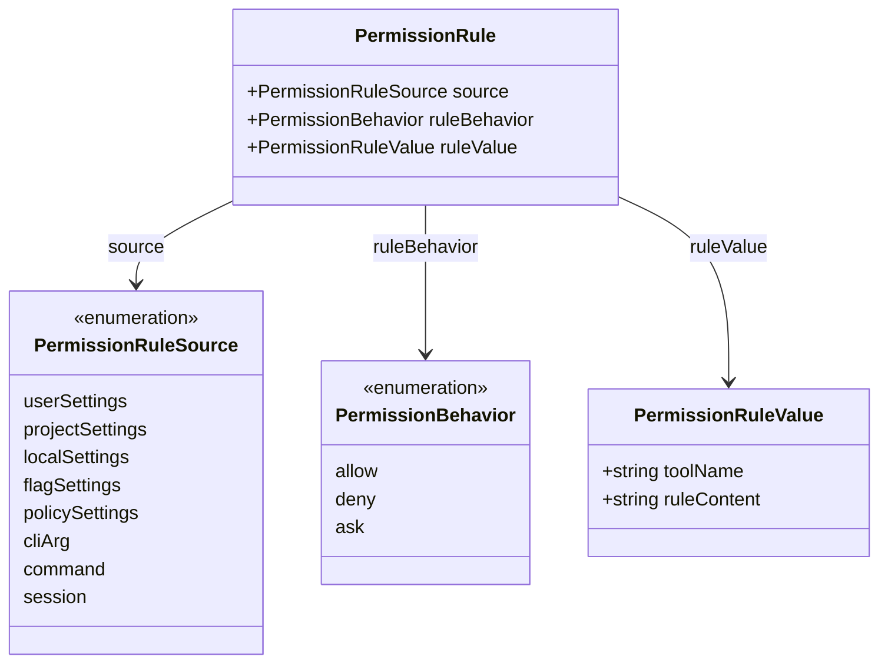
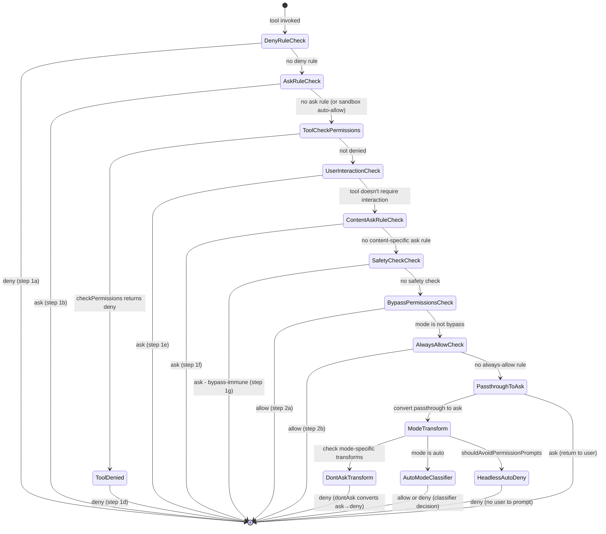
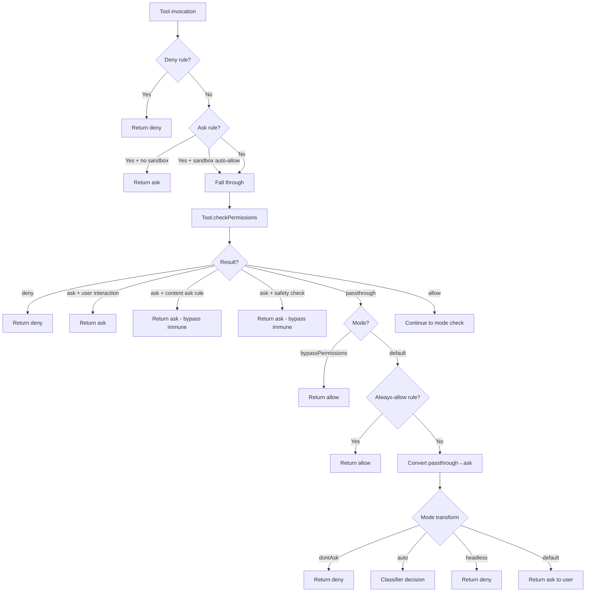

# The Permission Model: Modes and Rules

## Overview

Every tool invocation in cc passes through a permission gate before execution. This gate is not a single `if` statement but a layered decision engine that weighs six permission modes, rule sets from eight different sources, per-tool `checkPermissions()` callbacks, classifier-based risk assessment, denial-tracking heuristics, and human-in-the-loop prompts. The entire system lives in three files: `src/utils/permissions/permissions.ts` (~1,486 LOC), `src/utils/permissions/PermissionMode.ts` (~141 LOC), and `src/utils/permissions/PermissionRule.ts` (~40 LOC), with supporting types in `src/types/permissions.ts` and rule parsing in `src/utils/permissions/permissionRuleParser.ts` (~198 LOC).

The permission model is cc's answer to HER's §12 guardrails thesis: the five-layer defense-in-depth (prompt-level, schema-level, runtime approval, tool-level validation, lifecycle hooks) maps directly onto cc's pipeline. Modes determine *which* layers are active; rules determine *what* passes through each layer; the classifier adds an AI-driven gate for auto mode; and denial tracking prevents the agent from spiraling through infinite permission loops.

The relationship to HER's §11 human-in-the-loop patterns is equally direct. cc's `default` mode implements tiered escalation — deterministic rule checks (Tier 1), then tool-level validation (Tier 2), then human prompts (Tier 3). The `auto` mode adds a confidence-based routing layer (Tier 2.5): the YOLO classifier acts as a confidence estimator that decides whether the agent can proceed autonomously or must escalate to the human.

This chapter dissects the six permission modes, the rule evaluation pipeline, and the auto mode classifier integration. Chapters 33–37 cover the downstream consumers: the bash classifier, filesystem guards, the `useCanUseTool` hook, and the hook schema.

## Data structures and contracts

### PermissionMode: the mode enum

The core mode type is a union of six string literals, split into external (user-addressable) and internal (ant-only) sets:

```typescript
// src/types/permissions.ts:L16-L38
export const EXTERNAL_PERMISSION_MODES = [
  'acceptEdits',
  'bypassPermissions',
  'default',
  'dontAsk',
  'plan',
] as const

export type ExternalPermissionMode = (typeof EXTERNAL_PERMISSION_MODES)[number]

// Exhaustive mode union for typechecking. The user-addressable runtime set
// is INTERNAL_PERMISSION_MODES below.
export type InternalPermissionMode = ExternalPermissionMode | 'auto' | 'bubble'
export type PermissionMode = InternalPermissionMode

// Runtime validation set: modes that are user-addressable (settings.json
// defaultMode, --permission-mode CLI flag, conversation recovery).
export const INTERNAL_PERMISSION_MODES = [
  ...EXTERNAL_PERMISSION_MODES,
  ...(feature('TRANSCRIPT_CLASSIFIER') ? (['auto'] as const) : ([] as const)),
] as const satisfies readonly PermissionMode[]

export const PERMISSION_MODES = INTERNAL_PERMISSION_MODES
```

The five external modes correspond to distinct trust levels:

- **`default`** — the baseline. Every potentially destructive tool requires human approval. Read-only tools may auto-approve depending on rules.
- **`plan`** — read-only mode. The agent can explore and plan but cannot modify files. File writes, bash commands, and edits are blocked. See Chapter 45 for the full plan-mode V2 architecture.
- **`acceptEdits`** — a middle ground. File reads, writes, and edits are auto-approved; bash commands still require approval. This is the "I trust the agent to edit my files but not to run arbitrary shell commands" mode.
- **`bypassPermissions`** — everything is auto-approved. No prompts, no checks beyond the rule-based deny/ask enforcement at steps 1a–1g. The UI displays this with the `error` color to signal its danger.
- **`dontAsk`** — the inverse of bypass: instead of allowing everything, it silently denies everything that would require a prompt. This is useful for CI pipelines where the agent should only perform operations that are pre-approved by rules, failing quietly on anything else.

The `auto` mode is feature-gated behind `feature('TRANSCRIPT_CLASSIFIER')` — it only appears in the `PERMISSION_MODES` runtime array when that build flag is enabled (`src/types/permissions.ts:L33-L36`). The `bubble` mode exists in the type union but has no runtime config entry, making it a reserved slot for future use.

Each mode carries display metadata — title, short title, symbol, and color — in the `PERMISSION_MODE_CONFIG` map. Notably, `bypassPermissions` and `dontAsk` both use the `error` color, signaling their danger, while `auto` uses `warning`:

```typescript
// src/utils/permissions/PermissionMode.ts:L42-L91
const PERMISSION_MODE_CONFIG: Partial<
  Record<PermissionMode, PermissionModeConfig>
> = {
  default: {
    title: 'Default',
    shortTitle: 'Default',
    symbol: '',
    color: 'text',
    external: 'default',
  },
  plan: {
    title: 'Plan Mode',
    shortTitle: 'Plan',
    symbol: PAUSE_ICON,
    color: 'planMode',
    external: 'plan',
  },
  acceptEdits: {
    title: 'Accept edits',
    shortTitle: 'Accept',
    symbol: '⏵⏵',
    color: 'autoAccept',
    external: 'acceptEdits',
  },
  bypassPermissions: {
    title: 'Bypass Permissions',
    shortTitle: 'Bypass',
    symbol: '⏵⏵',
    color: 'error',
    external: 'bypassPermissions',
  },
  dontAsk: {
    title: "Don't Ask",
    shortTitle: 'DontAsk',
    symbol: '⏵⏵',
    color: 'error',
    external: 'dontAsk',
  },
  ...(feature('TRANSCRIPT_CLASSIFIER')
    ? {
        auto: {
          title: 'Auto mode',
          shortTitle: 'Auto',
          symbol: '⏵⏵',
          color: 'warning' as ModeColorKey,
          external: 'default' as ExternalPermissionMode,
        },
      }
    : {}),
}
```

The `external` field on the `auto` mode is `'default'`, not `'auto'` — this is critical: external consumers (the API, the CLI flags) never see `auto` as a valid mode; it's an ant-internal escalation of `default` that adds AI classification. The function `isExternalPermissionMode` enforces this boundary at `src/utils/permissions/PermissionMode.ts:L97-L105`. When `USER_TYPE` is not `'ant'`, every mode is external; when it is `'ant'`, `auto` and `bubble` are stripped from the external set.

The mode configuration also supports the `isDefaultMode` helper, which returns true for both `'default'` and `undefined` — an important edge case when the mode hasn't been set yet during bootstrap (`src/utils/permissions/PermissionMode.ts:L127-L129`).

### PermissionRule: the rule record

A rule is a triple: *where it came from*, *what behavior it mandates*, and *which tool (and optionally which content) it targets*:

```typescript
// src/types/permissions.ts:L54-L79
export type PermissionRuleSource =
  | 'userSettings'
  | 'projectSettings'
  | 'localSettings'
  | 'flagSettings'
  | 'policySettings'
  | 'cliArg'
  | 'command'
  | 'session'

export type PermissionRuleValue = {
  toolName: string
  ruleContent?: string
}

export type PermissionRule = {
  source: PermissionRuleSource
  ruleBehavior: PermissionBehavior
  ruleValue: PermissionRuleValue
}
```

The eight `PermissionRuleSource` values form a cascade that mirrors the settings hierarchy (Chapter 31). The first five (`userSettings`, `projectSettings`, `localSettings`, `flagSettings`, `policySettings`) correspond to the settings files on disk. The last three (`cliArg`, `command`, `session`) are in-memory sources that exist only for the current invocation. The `policySettings` source is the enterprise managed-settings layer — when `shouldAllowManagedPermissionRulesOnly` is true, all rules from other sources are stripped during `syncPermissionRulesFromDisk` (`src/utils/permissions/permissions.ts:L1426-L1446`).

The `PermissionBehavior` is one of `'allow' | 'deny' | 'ask'` (`src/types/permissions.ts:L44`). The `ruleContent` field enables content-scoped rules like `Bash(npm install)` — allow or deny a specific command prefix rather than the entire Bash tool. The parser at `src/utils/permissions/permissionRuleParser.ts:L93-L133` handles the string serialization format `ToolName(content)`, including escaped parentheses within content.



The Zod schemas for these types are defined in `PermissionRule.ts`:

```typescript
// src/utils/permissions/PermissionRule.ts:L25-L40
export const permissionBehaviorSchema = lazySchema(() =>
  z.enum(['allow', 'deny', 'ask']),
)

export const permissionRuleValueSchema = lazySchema(() =>
  z.object({
    toolName: z.string(),
    ruleContent: z.string().optional(),
  }),
)
```

The `lazySchema` wrapper breaks circular import dependencies that would otherwise arise from the permission module graph. The `permissionBehaviorSchema` validates the three-behavior enum at runtime, while `permissionRuleValueSchema` validates the structure of rule content.

### ToolPermissionContext: the aggregated permission state

The `ToolPermissionContext` type bundles the mode, all rule sets (allow/deny/ask, keyed by source), and auxiliary flags into a single immutable context object passed through the entire permission pipeline:

```typescript
// src/types/permissions.ts:L427-L441
export type ToolPermissionContext = {
  readonly mode: PermissionMode
  readonly additionalWorkingDirectories: ReadonlyMap<
    string,
    AdditionalWorkingDirectory
  >
  readonly alwaysAllowRules: ToolPermissionRulesBySource
  readonly alwaysDenyRules: ToolPermissionRulesBySource
  readonly alwaysAskRules: ToolPermissionRulesBySource
  readonly isBypassPermissionsModeAvailable: boolean
  readonly strippedDangerousRules?: ToolPermissionRulesBySource
  readonly shouldAvoidPermissionPrompts?: boolean
  readonly awaitAutomatedChecksBeforeDialog?: boolean
  readonly prePlanMode?: PermissionMode
}
```

The three rule maps — `alwaysAllowRules`, `alwaysDenyRules`, `alwaysAskRules` — are each keyed by `PermissionRuleSource`, storing string arrays of rule values. This means the context holds up to 3 × 8 = 24 rule arrays. The `getAllowRules`, `getDenyRules`, and `getAskRules` functions at `src/utils/permissions/permissions.ts:L124-L231` flatten these across all sources, producing a single `PermissionRule[]` for evaluation.

The `shouldAvoidPermissionPrompts` flag is the headless-agent escape hatch — when true, the pipeline auto-denies instead of prompting the user (who doesn't exist in a background agent). The `isBypassPermissionsModeAvailable` flag lets plan mode inherit bypass permissions from the session's original mode. The `strippedDangerousRules` field tracks rules that were removed from user/project settings by the managed-settings system, enabling visibility into what was taken away. The `prePlanMode` field stores the mode that was active before entering plan mode, enabling restoration when the agent exits plan mode.

### DenialTrackingState: the runaway guard

Auto mode tracks how many classifier denials have accumulated, falling back to interactive prompting when thresholds are exceeded:

```typescript
// src/utils/permissions/denialTracking.ts:L7-L15
export type DenialTrackingState = {
  consecutiveDenials: number
  totalDenials: number
}

export const DENIAL_LIMITS = {
  maxConsecutive: 3,
  maxTotal: 20,
} as const
```

Three consecutive denials or 20 total denials in a session force the system to fall back to prompting (`shouldFallbackToPrompting` at `src/utils/permissions/denialTracking.ts:L40-L44`). The `recordSuccess` function resets the consecutive count but not the total — a single allowed action breaks the consecutive streak but doesn't erase the history (`src/utils/permissions/denialTracking.ts:L32-L38`). This is cc's implementation of HER's §12.4 rate-limiting pattern — a safeguard against the agent getting stuck in an auto-approve/auto-deny loop with no human oversight.

### PermissionDecisionReason: explaining every decision

Every permission decision carries a `decisionReason` that explains *why* the decision was made. The type is a discriminated union with 10 variants (`src/types/permissions.ts:L271-L324`):

```typescript
// src/types/permissions.ts:L271-L282 (partial)
export type PermissionDecisionReason =
  | { type: 'rule'; rule: PermissionRule }
  | { type: 'mode'; mode: PermissionMode }
  | { type: 'subcommandResults'; reasons: Map<string, PermissionResult> }
  | { type: 'permissionPromptTool'; permissionPromptToolName: string; toolResult: unknown }
  | { type: 'hook'; hookName: string; hookSource?: string; reason?: string }
  | { type: 'asyncAgent'; reason: string }
  | ...
```

The `rule` variant traces the decision back to a specific rule and its source, enabling the UI to display "Denied by policy rule 'Bash(rm:*)' from policySettings." The `mode` variant identifies which mode triggered the decision. The `classifier` variant carries the classifier name and reason, enabling analytics on classifier accuracy. The `safetyCheck` variant includes a `classifierApprovable` boolean that determines whether auto mode can route the check to the classifier or must always prompt the user.

## Control flow

### The permission pipeline

The core function `hasPermissionsToUseTool` at `src/utils/permissions/permissions.ts:L473-L956` is the entry point for every tool permission check. It delegates to `hasPermissionsToUseToolInner` (steps 1–3), then applies mode-based transformations (steps 4+). The pipeline proceeds in strict order; earlier steps short-circuit later ones:



### Step-by-step walkthrough

**Step 1a — Deny rules.** The pipeline first checks if the entire tool is denied via `getDenyRuleForTool`. This iterates all eight rule sources looking for a deny rule matching the tool name (`src/utils/permissions/permissions.ts:L1171-L1181`). If found, the tool is immediately blocked with a `decisionReason` of `{type: 'rule', rule}`. Deny rules are checked first because they represent hard security boundaries — nothing should override them.

**Step 1b — Ask rules.** Next, `getAskRuleForTool` checks if an ask rule covers the tool. There's one exception: if the tool is Bash, sandboxing is enabled, `autoAllowBashIfSandboxed` is on, and the specific command will run in a sandbox, the ask rule is bypassed and the pipeline falls through to tool-specific checks (`src/utils/permissions/permissions.ts:L1184-L1206`). This is a pragmatic trade-off: sandboxed commands are already constrained, so forcing a prompt adds friction without meaningful safety improvement.

**Step 1c — Tool.checkPermissions().** Each tool implements its own `checkPermissions()` method. For Bash, this runs the command classifier pipeline (Chapter 14). For file tools, this checks path safety. The result is a `PermissionResult` — allow, deny, ask, or passthrough (`src/utils/permissions/permissions.ts:L1210-L1223`). This step is where the tool itself participates in the permission decision, implementing HER's layer 4 (tool-level validation).

**Step 1d — Tool denial.** If `checkPermissions` returns `deny`, the pipeline returns immediately (`src/utils/permissions/permissions.ts:L1226-L1228`). This catches bash subcommand denies wrapped in `subcommandResults` — no need to inspect `decisionReason.type`.

**Step 1e — User interaction required.** Some tools (like `AskUserQuestion`) must interact with the user even in bypass mode. The `requiresUserInteraction()` method flags these, and the pipeline respects it unconditionally (`src/utils/permissions/permissions.ts:L1231-L1236`). This prevents `bypassPermissions` from breaking tools that are structurally designed around human interaction.

**Step 1f — Content-specific ask rules.** When `checkPermissions` returns `ask` with a `decisionReason` of `{type: 'rule', ruleBehavior: 'ask'}`, this means a content-scoped rule (e.g., `Bash(npm publish:*)`) explicitly requires approval. This takes precedence even over `bypassPermissions` mode (`src/utils/permissions/permissions.ts:L1244-L1250`). The comment in the source explains the rationale: "When a user explicitly configures a content-specific ask rule, the tool's checkPermissions returns `{behavior:'ask', decisionReason:{type:'rule', rule:{ruleBehavior:'ask'}}}`. This must be respected even in bypass mode, just as deny rules are respected at step 1d."

**Step 1g — Safety checks.** Safety checks for protected paths (`.git/`, `.claude/`, `.vscode/`, shell configs) are *bypass-immune*. Even if a PreToolUse hook returns `allow`, these must still prompt (`src/utils/permissions/permissions.ts:L1255-L1260`). The `safetyCheck` decision reason includes a `classifierApprovable` boolean that determines whether auto mode can route the check to the YOLO classifier. This implements HER's §12.3 privilege boundary pattern — certain system paths are treated as security-critical regardless of the permission mode.

**Step 2a — Bypass permissions.** After all rule-based checks pass, the pipeline checks whether `bypassPermissions` mode is active (or whether plan mode was entered from a bypass session via `isBypassPermissionsModeAvailable`). If so, everything is allowed (`src/utils/permissions/permissions.ts:L1268-L1281`). The `isBypassPermissionsModeAvailable` flag is stored in `ToolPermissionContext` and persists across mode transitions, allowing plan mode to "remember" that the original session was in bypass mode.

**Step 2b — Always-allow rules.** If a rule explicitly allows the entire tool, the pipeline returns allow with the matching rule as the `decisionReason` (`src/utils/permissions/permissions.ts:L1284-L1297`). The `toolAlwaysAllowedRule` function checks for whole-tool matches — a rule like `Bash(npm install)` does *not* match here because it has content; only `Bash` or `Bash(*)` match.

**Step 3 — Passthrough to ask.** If the tool's `checkPermissions` returned `passthrough` (meaning the tool has no opinion), the pipeline converts it to `ask` — the user must be prompted (`src/utils/permissions/permissions.ts:L1300-L1318`). The `passthrough` behavior exists so that tools without a custom `checkPermissions` override don't need to explicitly return `ask` with a manufactured `decisionReason`.

**Post-step — Mode transformations.** The outer `hasPermissionsToUseTool` function then applies mode-specific transformations on any `ask` result:

1. **dontAsk mode**: Converts `ask` to `deny`, silently rejecting the tool (`src/utils/permissions/permissions.ts:L506-L517`). The `DONT_ASK_REJECT_MESSAGE` helper provides a user-facing message.
2. **Auto mode**: Routes the decision to the YOLO classifier, with multiple fast-path optimizations before invoking the AI classifier (`src/utils/permissions/permissions.ts:L519-L927`).
3. **Headless agents**: When `shouldAvoidPermissionPrompts` is true and no classifier is available, runs `PermissionRequest` hooks first, then auto-denies (`src/utils/permissions/permissions.ts:L932-L952`).

### Rule evaluation flow

Rules are evaluated from eight sources in a flat order — there is no priority system between sources. The `PERMISSION_RULE_SOURCES` array at `src/utils/permissions/permissions.ts:L109-L114` defines the source order used for iteration, but since each source is checked independently, the effective priority is: deny > ask > allow (because deny and ask short-circuit before allow is checked).

The rule-matching logic is implemented in `toolMatchesRule` at `src/utils/permissions/permissions.ts:L238-L269`. This function handles three cases: direct tool-name match, MCP server-level match, and MCP wildcard match. A rule like `mcp__server1` matches all tools from that server; `mcp__server1__*` provides the same effect explicitly. Content-scoped rules (those with `ruleContent` defined) are excluded from whole-tool matching:

```typescript
// src/utils/permissions/permissions.ts:L238-L269
function toolMatchesRule(
  tool: Pick<Tool, 'name' | 'mcpInfo'>,
  rule: PermissionRule,
): boolean {
  // Rule must not have content to match the entire tool
  if (rule.ruleValue.ruleContent !== undefined) {
    return false
  }

  const nameForRuleMatch = getToolNameForPermissionCheck(tool)

  // Direct tool name match
  if (rule.ruleValue.toolName === nameForRuleMatch) {
    return true
  }

  // MCP server-level permission: rule "mcp__server1" matches tool "mcp__server1__tool1"
  const ruleInfo = mcpInfoFromString(rule.ruleValue.toolName)
  const toolInfo = mcpInfoFromString(nameForRuleMatch)

  return (
    ruleInfo !== null &&
    toolInfo !== null &&
    (ruleInfo.toolName === undefined || ruleInfo.toolName === '*') &&
    ruleInfo.serverName === toolInfo.serverName
  )
}
```

When content-scoped rules are needed, the `getRuleByContentsForTool` function at `src/utils/permissions/permissions.ts:L349-L390` builds a `Map<string, PermissionRule>` keyed by rule content, enabling tools like Bash to look up prefix rules efficiently.



### Auto mode's multi-layer fast-path

Auto mode is the most complex permission path. Before invoking the expensive YOLO classifier (which makes a separate API call), it tries three fast paths:

1. **acceptEdits fast-path** — If the tool would be allowed under `acceptEdits` mode (checked by temporarily swapping the mode in the context), the classifier is skipped. This avoids an API call for safe operations like file edits in the working directory. Agent and REPL tools are excluded from this fast-path because their `checkPermissions` returns `allow` for `acceptEdits`, which would silently bypass the classifier for code that could contain VM escapes (`src/utils/permissions/permissions.ts:L600-L656`). The implementation temporarily overrides `getAppState` to return a context with `mode: 'acceptEdits'`, runs `checkPermissions` under that context, and checks if the result is `allow`.

2. **Safe-tool allowlist** — A hardcoded list of tools that are considered safe in auto mode (e.g., read-only tools). Tools on this list are auto-allowed without classifier consultation (`src/utils/permissions/permissions.ts:L660-L686`). The allowlist is maintained in `classifierDecision.ts` (loaded conditionally via `feature('TRANSCRIPT_CLASSIFIER')`).

3. **YOLO classifier** — The fallback. The `classifyYoloAction` function at `src/utils/permissions/yoloClassifier.ts` formats the tool action as a classifier prompt, sends it to the model, and respects the result. If the classifier is unavailable (API error), behavior depends on the `tengu_iron_gate_closed` GrowthBook feature flag: when true (fail-closed), the action is denied; when false (fail-open), the pipeline falls back to normal permission handling (`src/utils/permissions/permissions.ts:L846-L876`). The `CLASSIFIER_FAIL_CLOSED_REFRESH_MS` constant at `src/utils/permissions/permissions.ts:L107` sets a 30-minute refresh interval for the flag.

The classifier also has a transcript-too-long escape: if the conversation context exceeds the classifier model's window, the pipeline falls back to interactive prompting rather than retrying a doomed API call (`src/utils/permissions/permissions.ts:L819-L842`). This is a deterministic condition (the transcript only grows), so retry would never succeed.

### The checkRuleBasedPermissions subset

For scenarios that need only the rule-based steps (without mode transformations, classifiers, or prompts), cc provides `checkRuleBasedPermissions` at `src/utils/permissions/permissions.ts:L1071-L1156`. This function runs steps 1a, 1b, 1c, 1d, 1f, and 1g but skips steps 1e, 2a, 2b, and all post-step mode transformations. It's used by `bypassPermissions` mode to enforce deny rules and ask rules even when the mode would otherwise allow everything. The function returns `null` when no rule objects — meaning the tool can proceed — or a deny/ask decision when a rule blocks it.

### Rule synchronization from disk

When settings change on disk (e.g., a user edits `settings.json` while cc is running), the `syncPermissionRulesFromDisk` function at `src/utils/permissions/permissions.ts:L1419-L1471` replaces all disk-based rules in the context. The implementation first clears all rules from the three disk sources (`userSettings`, `projectSettings`, `localSettings`) for all three behaviors, then applies the new rules. This two-step approach prevents stale rules from persisting when a rule is removed from settings — a simpler "only add" approach would leave deleted rules in the context.

When `shouldAllowManagedPermissionRulesOnly` is true, the function also clears all non-policy sources (`userSettings`, `projectSettings`, `localSettings`, `cliArg`, `session`) before applying the new rules, effectively making policy rules the only source of truth (`src/utils/permissions/permissions.ts:L1426-L1446`).

### Auto mode state management

The `autoModeState` module at `src/utils/permissions/autoModeState.ts` manages three pieces of global state for auto mode: `autoModeActive` (whether auto mode is currently running), `autoModeFlagCli` (whether the `--auto` flag was passed on the CLI), and `autoModeCircuitBroken` (whether GrowthBook has remotely disabled auto mode). The circuit breaker is set by the async `verifyAutoModeGateAccess` check, which reads the `tengu_auto_mode_config.enabled` flag from GrowthBook. If the flag is `'disabled'`, the circuit breaker trips and auto mode cannot be re-entered, even via SDK or explicit user action (`src/utils/permissions/autoModeState.ts:L7-L33`).

## Edge cases and failure modes

### PowerShell in auto mode

PowerShell is excluded from auto mode classification unless the `POWERSHELL_AUTO_MODE` build flag is enabled. Without it, PowerShell always requires interactive approval — the classifier is never invoked. This is a defense-in-depth measure: PowerShell's `iex (iwr ...)` patterns are download-and-execute vectors that the classifier might not reliably catch. When `POWERSHELL_AUTO_MODE` is enabled, the classifier prompt appends `POWERSHELL_DENY_GUIDANCE` so it recognizes patterns like `iex (iwr ...)` as dangerous (`src/utils/permissions/permissions.ts:L572-L591`).

### Non-classifier-approvable safety checks

Some safety checks are `classifierApprovable: true` (e.g., sensitive-file paths like `.claude/` or `.git/`) — the classifier can evaluate these because the context tells it whether the access is legitimate. Others are `classifierApprovable: false` (e.g., Windows path bypass attempts, cross-machine bridge messages) — these are always immune to auto-approval paths and must prompt the user regardless (`src/utils/permissions/permissions.ts:L532-L548`). This two-tier safety check system implements HER's §11.2 tiered escalation: non-classifier-approvable checks are Tier 4 (human expert required), while classifier-approvable checks are Tier 2.5 (classifier can decide, with human fallback).

### MCP server-level rules

Rules can match MCP tools at the server level: a rule targeting `mcp__server1` matches all tools from that server (`mcp__server1__tool1`, `mcp__server1__tool2`, etc.), and the wildcard `mcp__server1__*` provides the same effect explicitly. In skip-prefix mode (`CLAUDE_AGENT_SDK_MCP_NO_PREFIX`), MCP tools have unprefixed display names that could collide with builtin names, so the rule-matching logic uses `getToolNameForPermissionCheck` to resolve the fully qualified name before matching. This prevents a user's `Bash` allow rule from accidentally allowing an MCP tool that replaced the builtin Bash tool.

### Legacy tool name aliasing

When tools are renamed (e.g., `Task` → `Agent`, `KillShell` → `TaskStop`), old rule strings would silently break. The `LEGACY_TOOL_NAME_ALIASES` map translates old names to canonical names during parsing:

```typescript
// src/utils/permissions/permissionRuleParser.ts:L21-L29
const LEGACY_TOOL_NAME_ALIASES: Record<string, string> = {
  Task: AGENT_TOOL_NAME,
  KillShell: TASK_STOP_TOOL_NAME,
  AgentOutputTool: TASK_OUTPUT_TOOL_NAME,
  BashOutputTool: TASK_OUTPUT_TOOL_NAME,
  ...((feature('KAIROS') || feature('KAIROS_BRIEF')) && BRIEF_TOOL_NAME
    ? { Brief: BRIEF_TOOL_NAME }
    : {}),
}
```

The `normalizeLegacyToolName` function is called during `permissionRuleValueFromString`, so a `settings.json` containing `"Task"` is automatically translated to `"Agent"` at parse time. The reverse mapping `getLegacyToolNames` enables the UI to display both old and new names when showing rule information.

### Headless agent permission hooks

Background agents cannot show permission prompts. When `shouldAvoidPermissionPrompts` is true, the pipeline first runs `PermissionRequest` hooks to give them a chance to allow or deny (`src/utils/permissions/permissions.ts:L400-L471`). Only if no hook provides a decision does the pipeline auto-deny. This enables enterprise deployments to configure automated approval/denial policies via hooks without needing a human in the loop.

The `runPermissionRequestHooksForHeadlessAgent` function iterates hook results, looking for the first one that provides a `permissionRequestResult`. If a hook returns `allow`, the tool proceeds (with optional `updatedInput` and `updatedPermissions`). If a hook returns `deny`, the tool is blocked (with optional `interrupt` flag that aborts the entire agent). If all hooks pass without a decision, the function returns `null` and the caller auto-denies (`src/utils/permissions/permissions.ts:L400-L471`).

### Denial-limit fallback in headless mode

In headless mode, when denial limits are exceeded (3 consecutive or 20 total), the agent is *aborted* rather than falling back to prompting, because there is no user to prompt (`src/utils/permissions/permissions.ts:L1023-L1027`). This prevents a headless agent from burning tokens in an infinite auto-deny loop. The `handleDenialLimitExceeded` function at `src/utils/permissions/permissions.ts:L984-L1058 logs the event with full analytics metadata (tool name, denial counts, message ID) before taking the terminal action.

### Rule content with parentheses

The rule string format `ToolName(content)` creates an ambiguity when content itself contains parentheses (e.g., `Bash(python -c "print(1)")`). The parser uses escaped parentheses (`\(` and `\)`) and finds the *first unescaped* `(` and *last unescaped* `)` to delimit content. The escaping order matters: backslashes are escaped first, then parentheses (`src/utils/permissions/permissionRuleParser.ts:L55-L79`). The reverse operation (unescaping) reverses this order: parentheses first, then backslashes. The helper functions `findFirstUnescapedChar` and `findLastUnescapedChar` count preceding backslashes to determine whether a character is escaped — a character preceded by an odd number of backslashes is escaped (`src/utils/permissions/permissionRuleParser.ts:L158-L198`).

### Agent-specific deny rules

The `getDenyRuleForAgent` function at `src/utils/permissions/permissions.ts:L308-L320 enables denying specific agent types via the `Agent(agentType)` syntax. For example, a deny rule `Agent(Explore)` blocks the Explore agent while allowing all other agents. The `filterDeniedAgents` helper at `src/utils/permissions/permissions.ts:L326-L343` uses this to filter agent lists, parsing deny rules once and collecting denied agent types into a `Set` for O(1) lookup — an optimization that replaced an O(agents × rules) implementation.

## Where cc diverges from the published pattern

### The auto mode is not in the public API

HER's §11 describes confidence-based routing and tiered escalation as abstract patterns. cc's `auto` mode implements both concretely — the YOLO classifier is a confidence router, and the acceptEdits fast-path / allowlist / classifier / prompting fallback chain is a tiered escalation. However, `auto` is gated behind `feature('TRANSCRIPT_CLASSIFIER')` and is not exposed in `ExternalPermissionMode`. The published pattern implies these features should be available to all users; cc restricts them to ant-internal builds. This divergence reflects a pragmatic concern: the classifier is not yet reliable enough for general use, and exposing it to external users could create a false sense of security.

### Deny-first evaluation order

Most permission frameworks check allow rules first, then deny rules (deny overrides allow). cc inverts this: deny rules are checked at step 1a, *before* allow rules at step 2b. This means a deny rule always wins over an allow rule, regardless of source. This is a deliberate design choice aligned with HER's §12.3 privilege boundaries — deny rules enforce security boundaries that should not be overridable by permissive allow rules. A more traditional allow-then-deny approach would require explicit conflict resolution (e.g., "deny wins over allow from the same source"), which adds complexity without a corresponding safety improvement.

### No rule priority between sources

The eight `PermissionRuleSource` values have no explicit priority ordering. A `userSettings` deny rule and a `policySettings` deny rule are treated identically — both block the tool. The managed-settings system (`shouldAllowManagedPermissionRulesOnly`) can strip all non-policy rules, effectively giving policy rules priority, but this is an all-or-nothing toggle, not a per-rule priority system. This diverges from HER's §7 configuration surfaces pattern, which recommends a clear precedence order. cc's approach trades fine-grained control for simplicity: within each behavior (allow/deny/ask), all sources are equal; the only precedence is between behaviors (deny > ask > allow).

### Safety checks are bypass-immune even for hooks

HER's §12.1 describes prompt-level guardrails as the first defense layer. In cc, safety checks (step 1g) are immune not just to `bypassPermissions` mode but also to `PreToolUse` hook approvals. A hook returning `allow` does not override a safety check for `.git/` or `.claude/` paths. This diverges from the standard hook-interrupts-everything pattern described in HER's §5 Pattern 12, where hooks are the final arbiter. The divergence is intentional: hooks are powerful but untrustworthy (see HER's §12.4 on supply chain attacks via hooks), and safety checks protect paths where a compromised hook could cause irreparable damage.

### The passthrough behavior

cc's `PermissionResult` includes a fourth behavior — `passthrough` — not present in HER's three-behavior (allow/deny/ask) model. Passthrough means "this tool has no opinion; let the pipeline decide." This is converted to `ask` at step 3. The passthrough behavior exists to allow tools with no `checkPermissions` override to participate in the pipeline without explicitly returning `ask`, which would carry a misleading `decisionReason`. This is a pragmatic simplification: without passthrough, every tool would need to implement `checkPermissions` returning `ask` with a manufactured reason, even for tools (like `Glob`) that have no security-relevant behavior.

### Iron gate is a feature flag, not a compile-time decision

When the auto mode classifier is unavailable, the fail-closed vs. fail-open behavior is controlled by a GrowthBook feature flag (`tengu_iron_gate_closed`), not a compile-time constant. This means the same binary can operate in fail-closed mode for one deployment and fail-open for another, and the behavior can be changed without a new release. This diverges from the typical approach of baking fail-safe behavior into the code, reflecting cc's operational reality: the right trade-off between security (fail-closed) and usability (fail-open) depends on the user population and deployment context.

## Developer takeaways for building a long-running agent

1. **Deny-first is safer than allow-first.** Evaluate deny rules before allow rules. cc's step-ordering (1a: deny → 2b: allow) ensures a single deny rule from a security policy is never overridden by a permissive allow rule.

2. **Safety checks must be immune to mode changes and hook overrides.** Implement bypass-immune safety checks for critical paths (`.git/`, credentials), not just ask rules. An ask rule can be overridden by `bypassPermissions`; a safety check cannot.

3. **Auto mode needs tiered fast paths before the AI classifier.** The YOLO classifier adds latency and cost. cc avoids both by checking the acceptEdits fast-path and safe-tool allowlist first. Design similar shortcuts: deterministic checks before probabilistic ones.

4. **Denial tracking prevents silent runaway loops.** cc's `DENIAL_LIMITS` (3 consecutive, 20 total) force fallback to human prompting; for headless agents, they trigger abort. Implement similar circuit-breakers.

5. **Separate the rule-based subset for bypass mode.** cc's `checkRuleBasedPermissions` extracts deny/ask/safety-check steps so `bypassPermissions` still respects deny rules and safety checks — it's not a wildcard.
