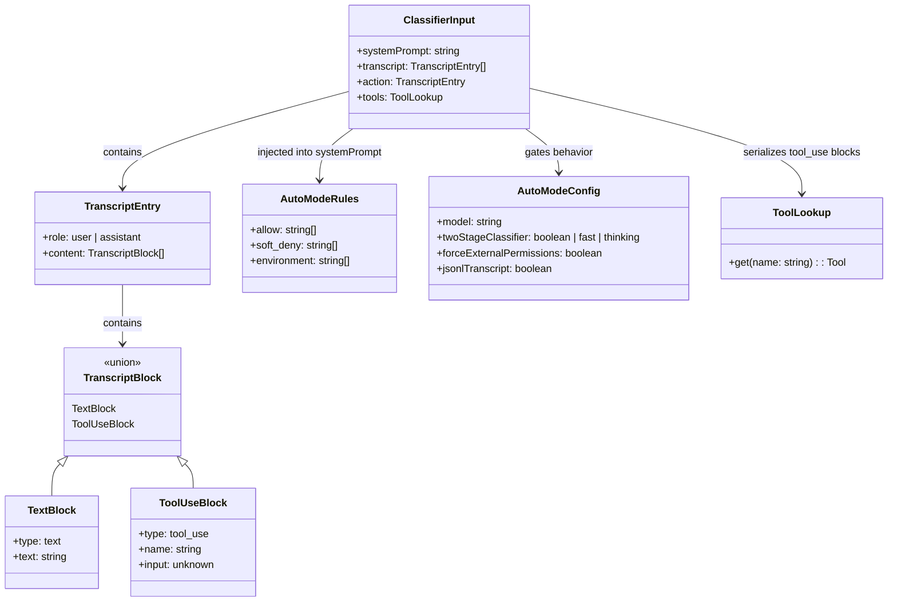
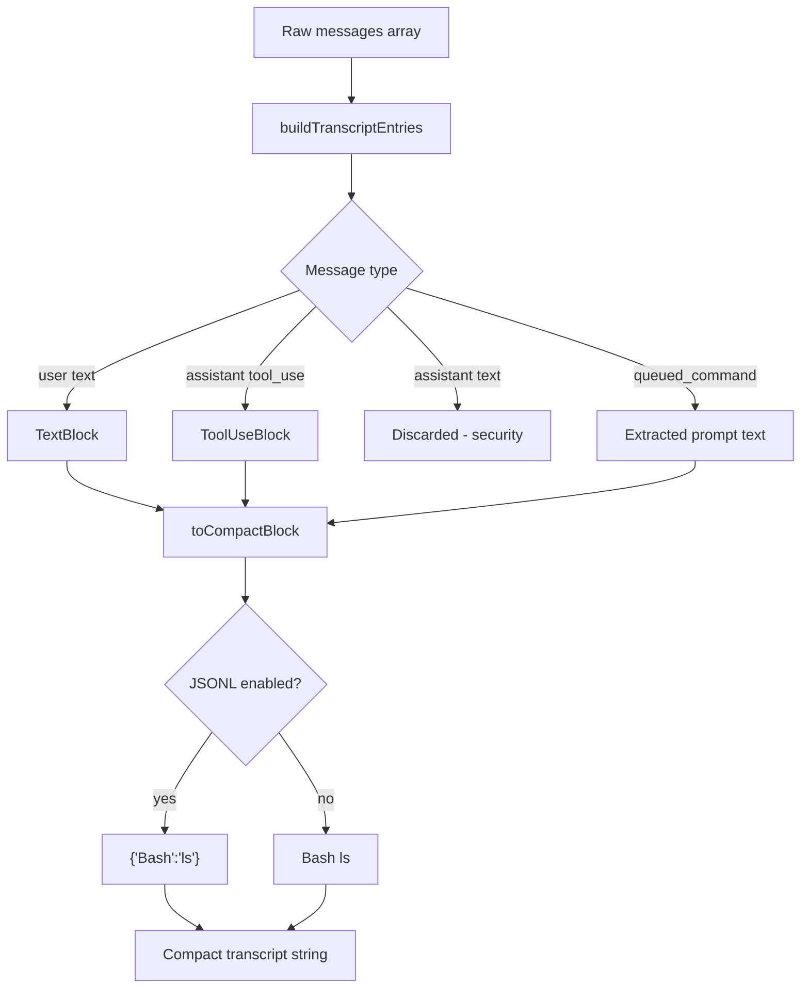
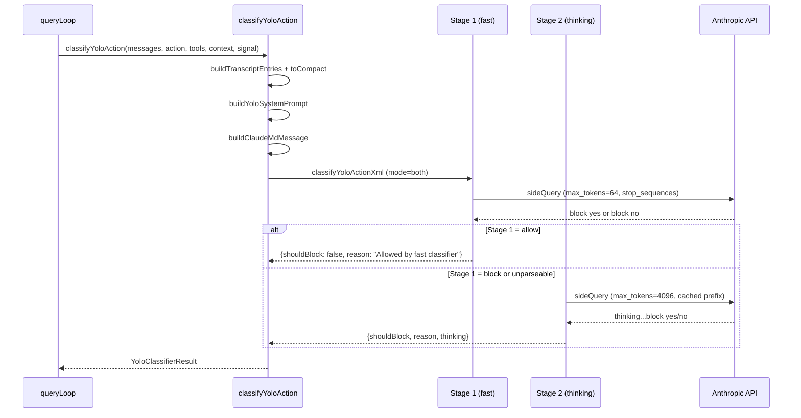

# Bash Classifier and YOLO Scoring

## Overview

Claude Code's auto mode depends on a machine-learning classifier to decide whether each agent action should proceed or be blocked. This chapter examines the two classification subsystems that power that decision: the deterministic Bash classifier (`bashClassifier.ts`) and the LLM-based YOLO classifier (`yoloClassifier.ts`). The Bash classifier provides prompt-driven rule matching for shell commands; the YOLO classifier uses a separate model call to evaluate every tool action against a security policy. Together they implement HER Pattern 10, Command Risk Classification, which calls for deterministic pre-parsing and per-tool permission gating (see HER Section 5, Pattern 10).

The name "YOLO" in the YOLO classifier is an internal code name, not an acronym for "You Only Look Once." Within the codebase it refers to the classifier's ability to make a single, decisive classification call per tool action -- either allowing the action to proceed or blocking it -- rather than the computer-vision architecture. The Bash classifier is a stub in external builds, exposing only type definitions and no-op functions. The YOLO classifier is the production system, implementing a two-stage XML classification pipeline with prompt caching, transcript projection, and comprehensive error handling. The two subsystems serve different threat models: the Bash classifier provides deterministic, rule-based matching for known dangerous command patterns, while the YOLO classifier provides context-aware, probabilistic classification for novel or ambiguous actions.

The classifier maps each action into one of three risk bands: **read** (information retrieval with no side effects, auto-approved), **write** (file modifications or network requests, requires user confirmation in default mode), and **destructive** (irreversible operations like `rm -rf` or force-push, always blocked in auto mode without explicit user confirmation). These bands drive the permission decision in auto mode: read-band actions proceed silently, write-band actions show the user a brief confirmation, and destructive-band actions are blocked unless the user has explicitly allowed them through rules.

Understanding the classifier architecture is critical for anyone building a trustworthy autonomous system, because the classifier is the single point where the harness can intervene before an action becomes irreversible. The classifier sits between the agent's intent and its execution: every tool call must pass through the classifier before the agent is allowed to act. A false negative (allowing a dangerous action) can cause irreversible damage; a false positive (blocking a safe action) interrupts the user and degrades trust. The two-stage pipeline and the fail-safe defaults reflect a design that prioritizes safety over convenience, a philosophy that this chapter will trace through every code path.

## Data structures and contracts

### ClassifierResult and ClassifierBehavior

The Bash classifier stub defines the result shape that external builds use as a no-op. Even in the stub, the type definitions are important because they establish the contract that the full implementation must satisfy:

```typescript
// src/utils/permissions/bashClassifier.ts:L5-L12
export type ClassifierResult = {
  matches: boolean
  matchedDescription?: string
  confidence: 'high' | 'medium' | 'low'
  reason: string
}

export type ClassifierBehavior = 'deny' | 'ask' | 'allow'
```

When `BASH_CLASSIFIER` is enabled, the classifier matches a command against `prompt:` rules declared in the user's permission configuration. Each rule carries a description string; `ClassifierResult.matchedDescription` reports which rule matched, and `confidence` distinguishes high-confidence matches (exact command match) from lower ones. The `ClassifierBehavior` type determines the action taken when a match is found: `deny` blocks the command, `ask` shows the interactive dialog, and `allow` auto-approves. These three behaviors map directly to the risk bands: `deny` corresponds to destructive-band commands, `ask` to write-band commands, and `allow` to read-band commands.

The stub itself demonstrates cc's approach to feature-flagged code: rather than using conditional imports or dynamic dispatch, the entire file is a 61-line stub that returns safe defaults:

```typescript
// src/utils/permissions/bashClassifier.ts:L24-L26
export function isClassifierPermissionsEnabled(): boolean {
  return false
}
```

Every function in the stub returns a safe default -- `false` for booleans, empty arrays for lists, and a "feature disabled" result for classification. This ensures that external builds never accidentally invoke the Anthropic-internal classifier.

### YoloClassifierResult and TranscriptEntry

The YOLO classifier operates on a projected transcript rather than raw messages. The projection strips assistant text (which could influence the classifier) and retains only tool-use blocks and user messages. This is a critical security design choice: the classifier must not be influenced by the agent's own reasoning, which could be crafted to justify a dangerous action.

```typescript
// src/utils/permissions/yoloClassifier.ts:L287-L294
type TranscriptBlock =
  | { type: 'text'; text: string }
  | { type: 'tool_use'; name: string; input: unknown }

export type TranscriptEntry = {
  role: 'user' | 'assistant'
  content: TranscriptBlock[]
}
```

The `TranscriptBlock` union has only two variants. The `text` type carries user messages; the `tool_use` type carries assistant tool invocations. There is no `tool_result` variant in the transcript, because tool results are represented by the next user message (the API convention where tool results are sent as user-turn content). This compact representation keeps the classifier's input small while preserving the essential action sequence.

The final classification result includes usage telemetry, timing, and staging information for observability. The Zod schema for the legacy tool-use classifier response is:

```typescript
// src/utils/permissions/yoloClassifier.ts:L252-L258
const yoloClassifierResponseSchema = lazySchema(() =>
  z.object({
    thinking: z.string(),
    shouldBlock: z.boolean(),
    reason: z.string(),
  }),
)
```

The `lazySchema` wrapper defers Zod schema construction until first use, reducing startup time. The `thinking` field captures the model's chain-of-thought reasoning, which is exposed in the `YoloClassifierResult` as an optional field for debugging and auditing.

### AutoModeRules and the permissions template

User-configurable classifier rules are captured in `AutoModeRules`, which mirrors the three sections of the permissions template:

```typescript
// src/utils/permissions/yoloClassifier.ts:L85-L89
export type AutoModeRules = {
  allow: string[]
  soft_deny: string[]
  environment: string[]
}
```

The `allow` array lists action descriptions that the classifier should auto-approve; `soft_deny` lists descriptions that should trigger blocking; `environment` provides contextual facts about the user's setup that inform classification. These three arrays are interpolated into the classifier's system prompt at runtime, replacing the default values in the `<user_*_to_replace>` template tags.

The `AutoModeConfig` type extends this with classifier-specific settings, each field gated behind the `tengu_auto_mode_config` GrowthBook feature flag:

```typescript
// src/utils/permissions/yoloClassifier.ts:L1310-L1327
type AutoModeConfig = {
  model?: string
  /**
   * Enable XML classifier. `true` runs both stages; `'fast'` and `'thinking'`
   * run only that stage; `false`/undefined uses the tool_use classifier.
   */
  twoStageClassifier?: boolean | 'fast' | 'thinking'
  /**
   * Ant builds normally use permissions_anthropic.txt; when true, use
   * permissions_external.txt instead (dogfood the external template).
   */
  forceExternalPermissions?: boolean
  /**
   * Gate the JSONL transcript format ({"Bash":"ls"} vs `Bash ls`).
   * Default false (old text-prefix format) for slow rollout / quick rollback.
   */
  jsonlTranscript?: boolean
}
```

The JSDoc comments document the semantics of each field. The `twoStageClassifier` field controls whether the XML classifier runs in both-stage mode (the default), fast-only mode, or thinking-only mode. The `jsonlTranscript` field switches the transcript encoding from the legacy text-prefix format to the more compact JSONL format.

### Classifier inputs as a class hierarchy

The various inputs to the classifier form a structured hierarchy. The following diagram shows how the raw conversation, user configuration, and tool metadata flow into the classifier's decision:



## Control flow

### Transcript assembly and projection

The classifier does not see the raw conversation. Instead, `buildTranscriptEntries` walks the message array and emits only user text and assistant tool-use blocks. This is a deliberate security choice: assistant-generated text could contain persuasive content designed to influence the classifier, so it is excluded from the transcript. The function handles several message types:

```typescript
// src/utils/permissions/yoloClassifier.ts:L302-L360
export function buildTranscriptEntries(messages: Message[]): TranscriptEntry[] {
  const transcript: TranscriptEntry[] = []
  for (const msg of messages) {
    if (msg.type === 'attachment' && msg.attachment.type === 'queued_command') {
      const prompt = msg.attachment.prompt
      let text: string | null = null
      if (typeof prompt === 'string') {
        text = prompt
      } else if (Array.isArray(prompt)) {
        text =
          prompt
            .filter(
              (block): block is { type: 'text'; text: string } =>
                block.type === 'text',
            )
            .map(block => block.text)
            .join('\n') || null
      }
      if (text !== null) {
        transcript.push({
          role: 'user',
          content: [{ type: 'text', text }],
        })
      }
    } else if (msg.type === 'user') {
      // ... extract text blocks from user message
    } else if (msg.type === 'assistant') {
      const blocks: TranscriptBlock[] = []
      for (const block of msg.message.content) {
        // Only include tool_use blocks — assistant text is model-authored
        // and could be crafted to influence the classifier's decision.
        if (block.type === 'tool_use') {
          blocks.push({
            type: 'tool_use',
            name: block.name,
            input: block.input,
          })
        }
      }
      if (blocks.length > 0) {
        transcript.push({ role: 'assistant', content: blocks })
      }
    }
  }
  return transcript
}
```

The `queued_command` handling is notable: when a user submits a queued command (via the attachment system), the prompt text is extracted and emitted as a user turn. This ensures that the classifier sees the user's intent even when it arrives through the attachment pipeline rather than a direct message.

Each tool controls what it exposes to the classifier via its `toAutoClassifierInput` method. The `toCompactBlock` function serializes each transcript block into a compact string, either JSONL (`{"Bash":"ls"}`) or the legacy text-prefix format (`Bash ls`), controlled by the `jsonlTranscript` GrowthBook flag. The JSONL format is more robust against parsing ambiguities because JSON escaping prevents hostile content from breaking out of its string context.



### System prompt assembly

`buildYoloSystemPrompt` assembles the classifier's system prompt from three sources: the base prompt template, the permissions template (external or Anthropic-internal), and user-provided rules from `settings.autoMode`. The `<user_*_to_replace>` tag pattern allows user rules to replace defaults entirely (external template) or add to them (Anthropic template).

The prompt template selection depends on the user type and the `forceExternalPermissions` flag:

```typescript
// src/utils/permissions/yoloClassifier.ts:L71-L78
function isUsingExternalPermissions(): boolean {
  if (process.env.USER_TYPE !== 'ant') return true
  const config = getFeatureValue_CACHED_MAY_BE_STALE(
    'tengu_auto_mode_config',
    {} as AutoModeConfig,
  )
  return config?.forceExternalPermissions === true
}
```

External users always get the external permissions template. Anthropic-internal users get the internal template by default, but can opt into the external template via the `forceExternalPermissions` flag for dogfooding purposes.

The three-way substitution replaces each section's defaults with user-provided values:

```typescript
// src/utils/permissions/yoloClassifier.ts:L527-L540
return systemPrompt
  .replace(
    /<user_allow_rules_to_replace>([\s\S]*?)<\/user_allow_rules_to_replace>/,
    (_m, defaults: string) => userAllow ?? defaults,
  )
  .replace(
    /<user_deny_rules_to_replace>([\s\S]*?)<\/user_deny_rules_to_replace>/,
    (_m, defaults: string) => userDeny ?? defaults,
  )
  .replace(
    /<user_environment_to_replace>([\s\S]*?)<\/user_environment_to_replace>/,
    (_m, defaults: string) => userEnvironment ?? defaults,
  )
```

When user-provided values are present, they replace the defaults entirely (for the external template) or are added alongside them (for the Anthropic template, where defaults live outside the tags). The `??` operator falls back to the captured defaults when no user value is provided, ensuring that the classifier always has a complete set of rules.

### CLAUDE.md injection

The classifier also receives the user's CLAUDE.md content as a prefix message. This is wrapped in a delimiter that tells the classifier the content is user-provided configuration:

```typescript
// src/utils/permissions/yoloClassifier.ts:L460-L477
function buildClaudeMdMessage(): Anthropic.MessageParam | null {
  const claudeMd = getCachedClaudeMdContent()
  if (claudeMd === null) return null
  return {
    role: 'user',
    content: [
      {
        type: 'text',
        text:
          `The following is the user's CLAUDE.md configuration. These are ` +
          `instructions the user provided to the agent and should be treated ` +
          `as part of the user's intent when evaluating actions.\n\n` +
          `<user_claude_md>\n${claudeMd}\n</user_claude_md>`,
        cache_control: getCacheControl({ querySource: 'auto_mode' }),
      },
    ],
  }
}
```

The `cache_control` marker on the CLAUDE.md content makes it part of the system prompt cache prefix, so it is not re-processed on every classifier call. This is important because the CLAUDE.md content is static per session -- it is loaded once at startup and does not change during the session. The `getCachedClaudeMdContent` function reads from the bootstrap state cache rather than importing `claudemd.ts` directly, avoiding a circular dependency (claudemd -> permissions/filesystem -> permissions -> yoloClassifier).

### Two-stage XML classifier

When the GrowthBook flag `tengu_auto_mode_config.twoStageClassifier` is enabled, the classifier runs a two-stage pipeline via `classifyYoloActionXml`:

1. **Stage 1 (fast)**: Sends the transcript with a suffix nudging an immediate `<block>yes</block>` or `<block>no</block>` response. Uses `max_tokens=64` and `stop_sequences=['</block>']`. If the response is "no" (allow), the function returns immediately without stage 2. The low token limit and stop sequence ensure a fast response, typically within 1-2 seconds.

2. **Stage 2 (thinking)**: Sends the same transcript with a suffix requesting chain-of-thought reasoning before the block decision. Uses `max_tokens=4096`. This reduces false positives from stage 1 by requiring explicit justification. The thinking suffix reads:

```typescript
// src/utils/permissions/yoloClassifier.ts:L560-L561
const XML_S2_SUFFIX =
  '\nReview the classification process and follow it carefully, making sure you deny actions that should be blocked. As a reminder, explicit (not suggestive or implicit) user confirmation is required to override blocks. Use <thinking> before responding with <block>.'
```

The key insight is that stage 1 and stage 2 share the same system prompt and user content, which means they benefit from prompt caching. The `cache_control` breakpoint on the action block ensures that stage 2 gets a guaranteed cache hit on the full prefix, making the second call significantly cheaper than the first.



The XML response format was chosen over the original tool-use format for the two-stage classifier because XML parsing is more robust than tool-use extraction for short responses. The `stripThinking` function removes any `<thinking>` content before parsing `<block>` tags, preventing chain-of-thought content from being misinterpreted as classification output.

### Tool-use classifier (legacy path)

When the two-stage XML classifier is not enabled, the classifier uses a tool-use response format with the `classify_result` tool. The tool schema enforces structured output through the API's tool-choice constraint:

```typescript
// src/utils/permissions/yoloClassifier.ts:L262-L285
const YOLO_CLASSIFIER_TOOL_SCHEMA: BetaToolUnion = {
  type: 'custom',
  name: YOLO_CLASSIFIER_TOOL_NAME,
  description: 'Report the security classification result for the agent action',
  input_schema: {
    type: 'object',
    properties: {
      thinking: {
        type: 'string',
        description: 'Brief step-by-step reasoning.',
      },
      shouldBlock: {
        type: 'boolean',
        description:
          'Whether the action should be blocked (true) or allowed (false)',
      },
      reason: {
        type: 'string',
        description: 'Brief explanation of the classification decision',
      },
    },
    required: ['thinking', 'shouldBlock', 'reason'],
  },
}
```

The `tool_choice: { type: 'tool', name: 'classify_result' }` parameter forces the model to use the tool, ensuring that the response is always parseable. However, the tool-use format adds overhead (the model must emit the full tool invocation syntax) and does not support the fast/slow two-stage optimization.

### Classifier approvals from the user perspective

From the user's perspective, classifier decisions appear as one of three outcomes in the terminal. When a tool call is auto-approved (the classifier returns `shouldBlock: false`), the user sees a brief checkmark indicator before the action proceeds -- the `checkmark transition` UI pattern. The checkmark fades after a configurable duration that depends on whether the terminal has focus: a focused terminal shows the checkmark for 800ms, while an unfocused terminal shows it for 2000ms, giving the user time to notice it in peripheral vision.

When the classifier blocks an action, the user sees a denial message with the blocking reason extracted from the `reason` field of `YoloClassifierResult`. The reason text comes directly from the classifier model's output, making it intelligible and context-specific rather than a generic "action denied" message. The user can then choose to retry the action with different parameters, modify their auto mode rules to allow similar actions in the future, or switch to a different permission mode.

When the classifier is unavailable (API error, timeout, or transcript overflow), the system falls back to the interactive permission dialog, prompting the user directly. The `useCanUseTool` hook (Chapter 35) orchestrates this fallback: it checks the `unavailable` flag on the classifier result and, when true, shows the interactive dialog instead of silently blocking. This ensures that classifier outages do not cause the agent to grind to a halt -- the user retains the ability to approve or deny each action interactively.

The relationship between risk bands and user-facing behavior is explicit. Read-band actions (file reads, glob searches, grep queries) are auto-approved silently. Write-band actions (file edits, bash commands classified as non-destructive) show the checkmark transition but proceed automatically. Destructive-band actions (`rm -rf`, force-push, `curl | bash`) are blocked with a reason. The user can customize the band boundaries through the `allow` and `soft_deny` arrays in `AutoModeRules`, effectively promoting actions from destructive to write band (by adding to `allow`) or demoting actions from write to destructive band (by adding to `soft_deny`).

## Edge cases and failure modes

**Projection divergence**: The classifier transcript is a projection of the main loop's context, and the two can drift apart. `src/utils/permissions/yoloClassifier.ts:L1073-L1075` estimates classifier tokens as `Math.round(classifierChars / 4)` and compares against the main loop's actual token count. When the classifier exceeds the main loop (ratio > 1.0), auto-compact will not rescue the classifier, because auto-compact fires based on the main loop's token count. This is tracked via the `tengu_auto_mode_outcome` telemetry event, which includes `classifierInputTokens` and `mainLoopTokens` fields that allow monitoring the ratio in production.

**Models with always-on thinking**: Some Anthropic-internal models reject `thinking: { type: 'disabled' }` with a 400 error. `getClassifierThinkingConfig` (`src/utils/permissions/yoloClassifier.ts:L683`) detects these models and passes `thinking: undefined` with a `2048`-token headroom so that server-side adaptive thinking does not exhaust the output budget before the `<block>` tag is emitted. Without this headroom, `stop_reason=max_tokens` would yield an empty text response, which `parseXmlBlock` would interpret as null (unparseable), causing the classifier to block safe commands.

**Bash classifier stub**: In external builds, `bashClassifier.ts` is a 61-line stub that returns `false` for `isClassifierPermissionsEnabled()` and an empty array for all description getters. The full implementation lives behind the `BASH_CLASSIFIER` feature flag, which is Anthropic-internal only. The stub's `classifyBashCommand` function returns a safe default:

```typescript
// src/utils/permissions/bashClassifier.ts:L40-L53
export async function classifyBashCommand(
  _command: string,
  _cwd: string,
  _descriptions: string[],
  _behavior: ClassifierBehavior,
  _signal: AbortSignal,
  _isNonInteractiveSession: boolean,
): Promise<ClassifierResult> {
  return {
    matches: false,
    confidence: 'high',
    reason: 'This feature is disabled',
  }
}
```

**PowerShell denial guidance**: When `POWERSHELL_AUTO_MODE` is enabled, PowerShell-specific deny rules are appended to the classifier prompt. These map PowerShell idioms (`iex (iwr ...)`, `Remove-Item -Recurse -Force`, profile modifications) to existing BLOCK categories. The guidance is defined as a constant array guarded by the `POWERSHELL_AUTO_MODE` feature flag, so the string content is absent from external builds via dead code elimination.

**Transcript format migration**: The `isJsonlTranscriptEnabled` function (`src/utils/permissions/yoloClassifier.ts:L1379`) controls whether the compact transcript uses the newer JSONL format or the legacy text-prefix format. The JSONL format is more robust because JSON escaping prevents hostile content from breaking out of its string context. For example, a user message containing `Bash rm -rf /` would be ambiguous in the text-prefix format (is it a Bash command or a discussion about one?), but in JSONL format the distinction is clear: `{"user":"Bash rm -rf /"}` vs `{"Bash":"rm -rf /"}`. The default is the legacy format (controlled by the `jsonlTranscript` GrowthBook flag), with the JSONL format being rolled out gradually to catch any parsing regressions.

**Malformed tool input**: The `toCompactBlock` function includes a try-catch around `tool.toAutoClassifierInput(input)` because `block.input` is unvalidated model output from history. A tool_use rejected for bad params (e.g., an array emitted as a JSON string) would crash `toAutoClassifierInput` when it assumes a properly typed input. On throw, the function falls back to the raw input object, which gets single-encoded in the JSON stringification wrap. This graceful degradation ensures that the classifier never crashes due to malformed tool input, even though the classification may be less precise.

**Dump-aided debugging**: The `maybeDumpAutoMode` function (`src/utils/permissions/yoloClassifier.ts:L153`) writes classifier request and response bodies to the per-user claude temp directory when the `CLAUDE_CODE_DUMP_AUTO_MODE` environment variable is set. Files are named by unix timestamp with optional suffixes (e.g., `{timestamp}.stage1.req.json`). This is an Anthropic-internal debugging facility that allows engineers to inspect the exact classifier inputs and outputs without needing to reproduce the session state.

**Empty action compact**: Some tools declare no classifier-relevant input by returning an empty string from `toAutoClassifierInput`. The `classifyYoloAction` function checks for this case and returns an immediate allow:

```typescript
// src/utils/permissions/yoloClassifier.ts:L1023-L1029
if (actionCompact === '') {
  return {
    shouldBlock: false,
    reason: 'Tool declares no classifier-relevant input',
    model: getClassifierModel(),
  }
}
```

This optimization avoids an unnecessary API call for tools that the classifier cannot meaningfully evaluate (e.g., internal tools with no security implications).

## Where cc diverges from the published pattern

HER Pattern 10 prescribes deterministic pre-parsing for command risk classification. The Bash classifier follows this directly, mapping commands to risk bands via rule matching. However, the YOLO classifier diverges significantly by using an LLM call for classification rather than deterministic rules. This trades the predictability of deterministic classification for the flexibility of understanding novel command sequences and their intent in context. The two-stage pipeline (fast + thinking) partially mitigates the latency cost, and the fail-safe default (block on any error) preserves safety, but the approach is inherently less auditable than a pure rule system.

The transcript projection also diverges from the pattern's assumption that classification is based solely on the command itself. By including the full conversation history, the YOLO classifier can understand context-dependent risk (e.g., `rm -rf` in a Dockerfile build step vs. on the host), but this also means the classifier's behavior is path-dependent on conversation history, making it harder to reason about in isolation. This is both a strength and a weakness: context-aware classification reduces false positives on commands that look dangerous in isolation but are safe in context, but it also makes the classifier's decisions harder to predict and audit.

HER Section 12.4 identifies indirect prompt injection as a critical threat: malicious instructions embedded in files or tool outputs that the agent processes. The YOLO classifier's transcript projection mitigates this by excluding assistant text (which could contain injected instructions), but the user messages and tool-use blocks in the transcript could themselves contain injected content. The classifier's security policy is the last line of defense against actions that were influenced by injected instructions.

A third divergence concerns the relationship between the classifier and the permission mode system (Chapter 32). In a pure implementation of Pattern 10, the classifier would be the sole authority on whether a command is allowed. In cc's implementation, the classifier is only consulted in auto mode; in other modes (default, plan, acceptEdits), the permission rules and the user's interactive decisions take precedence. This means that the classifier's security guarantees are conditional on the user's choice of permission mode. A user who runs in `bypassPermissions` mode bypasses the classifier entirely, which is by design (the user has explicitly opted out of automated safety checks) but creates a gap in the defense-in-depth model that HER Section 12.4 recommends.

The cost of classification is also a design consideration that the HER pattern does not address. Each classifier call consumes API tokens -- both input tokens (for the system prompt, transcript, and action) and output tokens (for the classification response). For a long-running agent that makes thousands of tool calls, the cumulative classification cost can be significant. cc mitigates this through prompt caching (the system prompt and CLAUDE.md content are cached across calls), the two-stage pipeline (stage 1 uses only 64 output tokens for clearly safe actions), and the `toAutoClassifierInput` contract (tools with no security relevance skip classification entirely). These optimizations reduce the per-call cost from several thousand tokens to a few hundred for the common case.

## Developer takeaways for building a long-running agent

1. **Fail-safe defaults are non-negotiable**: Every error path in the classifier returns `shouldBlock: true`. For a long-running agent that may be unattended for hours, a single misclassification could cause irreversible damage. Block-first semantics ensure that uncertainty always results in human escalation.

2. **Separate the classification model from the action model**: The classifier uses `sideQuery`, which dispatches to a potentially different model than the main loop (`getClassifierModel` at `src/utils/permissions/yoloClassifier.ts:L1334`). This allows using a cheaper, faster model for classification while reserving the expensive model for the agent's actual work. It also creates an isolation boundary: a compromised classification model cannot directly influence the agent's reasoning.

3. **Cache control reduces classification cost**: The classifier places `cache_control` breakpoints on the system prompt, CLAUDE.md prefix, and action block (`src/utils/permissions/yoloClassifier.ts:L1096-L1106`). In the two-stage pipeline, stage 2 gets a guaranteed cache hit on the full prefix, making the second call significantly cheaper.

4. **Projection must stay smaller than the source**: The classifier transcript must remain strictly smaller than the main loop's context window so that auto-compact fires before the classifier overflows. Track the `classifierTokensEst / mainLoopTokens` ratio and alert when it exceeds 0.8.

5. **Feature flags enable incremental rollout**: The two-stage classifier, JSONL transcript format, and PowerShell auto mode are all gated behind GrowthBook feature flags (`tengu_auto_mode_config`). This allows gradual rollout and quick rollback without code changes.
