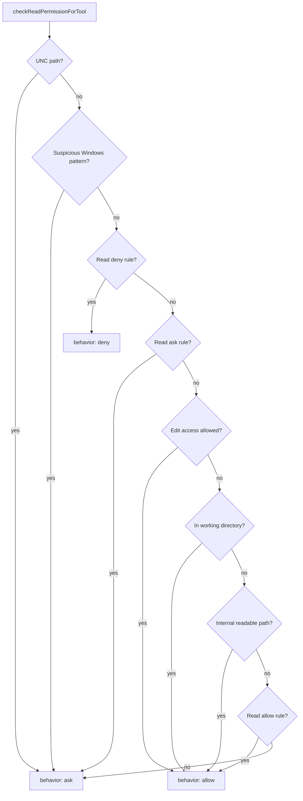
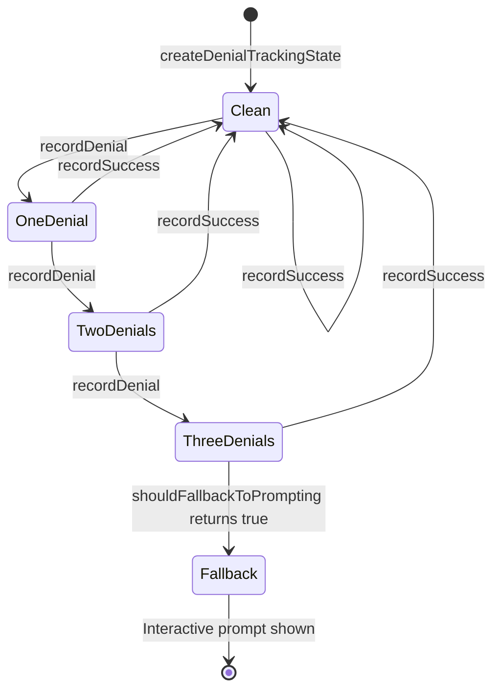

# Filesystem Permissions and Path Guards

## Overview

Filesystem permissions in Claude Code are the second line of defense after the permission mode system described in Chapter 32. While the mode system decides *whether* to ask, the filesystem permission layer decides *what* to ask about. It guards reads and writes against path traversal, symlink attacks, case-insensitive bypasses, and Windows-specific canonicalization exploits. This chapter examines `src/utils/permissions/filesystem.ts` (1,777 LOC) and `src/utils/permissions/denialTracking.ts` (45 LOC), which together implement the path validation and denial-tracking subsystems.

The filesystem permission layer maps directly to HER's threat model for data exfiltration (Section 12.4) and data leakage between contexts (Section 6.15). By controlling which files the agent can read and write, the filesystem guards prevent the agent from exfiltrating sensitive data through file operations and from leaking information between isolated contexts. The guards also protect against supply chain attacks (HER Section 12.4) by blocking writes to configuration files that could grant persistent access or modify the agent's behavior.

The design philosophy is defense-in-depth: multiple overlapping checks ensure that no single bypass can compromise the system. A path that passes the working-directory check must also pass the dangerous-file check, the symlink-resolution check, and the Windows-pattern check. A failure at any level results in an interactive permission prompt, not a silent allow. This layered approach is essential for a long-running agent that operates on user code for hours at a time, where a single misstep could corrupt a project or leak credentials.

## Data structures and contracts

### DANGEROUS_FILES and DANGEROUS_DIRECTORIES

The core safety lists define files and directories that require explicit human approval before the agent can edit them:

```typescript
// src/utils/permissions/filesystem.ts:L57-L79
export const DANGEROUS_FILES = [
  '.gitconfig',
  '.gitmodules',
  '.bashrc',
  '.bash_profile',
  '.zshrc',
  '.zprofile',
  '.profile',
  '.ripgreprc',
  '.mcp.json',
  '.claude.json',
] as const

export const DANGEROUS_DIRECTORIES = [
  '.git',
  '.vscode',
  '.idea',
  '.claude',
] as const
```

These lists protect shell configuration files (which could grant persistent access through shell hooks or environment variable manipulation), git configuration (which could redirect pushes to a malicious remote, embed pre-commit hooks that execute arbitrary code, or modify `.gitmodules` to clone hostile repositories), IDE settings (which could execute arbitrary code on project open through tasks or launch configurations), and Claude's own configuration (which could modify the agent's behavior through settings, hooks, or custom commands).

The `as const` assertion makes these arrays readonly and enables literal type inference, preventing accidental modification at runtime. New entries can only be added through code changes, not through user configuration -- this is a deliberate choice to prevent users from accidentally removing safety-critical entries.

### DenialTrackingState

When the classifier or rules engine denies a tool call, the denial tracking subsystem records the event and determines when the system should fall back to prompting the user:

```typescript
// src/utils/permissions/denialTracking.ts:L7-L15
export type DenialTrackingState = {
  consecutiveDenials: number
  totalDenials: number
}

export const DENIAL_LIMITS = {
  maxConsecutive: 3,
  maxTotal: 20,
} as const
```

After three consecutive denials or twenty total denials, `shouldFallbackToPrompting` returns `true`, overriding the classifier and showing the interactive permission dialog. This prevents the classifier from entering a denial loop where it repeatedly blocks the agent from making progress. The `recordSuccess` function resets `consecutiveDenials` to zero but does not reset `totalDenials`, so the total counter tracks the overall denial rate across the entire session:

```typescript
// src/utils/permissions/denialTracking.ts:L32-L38
export function recordSuccess(state: DenialTrackingState): DenialTrackingState {
  if (state.consecutiveDenials === 0) return state // No change needed
  return {
    ...state,
    consecutiveDenials: 0,
  }
}
```

The immutable state pattern (returning a new object rather than mutating the existing one) makes the denial tracking safe for concurrent access and simplifies testing.

### PermissionDecision and PermissionResult

The filesystem layer returns `PermissionDecision` objects with a `behavior` field (`allow`, `deny`, or `ask`) plus optional `suggestions` for the UI and `decisionReason` for telemetry. The `checkPathSafetyForAutoEdit` function adds a `classifierApprovable` boolean to distinguish paths that the classifier may auto-approve from those that always require human confirmation:

```typescript
// src/utils/permissions/filesystem.ts:L620-L665
export function checkPathSafetyForAutoEdit(
  path: string,
  precomputedPathsToCheck?: readonly string[],
):
  | { safe: true }
  | { safe: false; message: string; classifierApprovable: boolean } {
  // Get all paths to check (original + symlink resolved paths)
  const pathsToCheck =
    precomputedPathsToCheck ?? getPathsForPermissionCheck(path)

  // Check for suspicious Windows path patterns on all paths
  for (const pathToCheck of pathsToCheck) {
    if (hasSuspiciousWindowsPathPattern(pathToCheck)) {
      return {
        safe: false,
        message: `Claude requested permissions to write to ${path}, which contains a suspicious Windows path pattern that requires manual approval.`,
        classifierApprovable: false,
      }
    }
  }

  // Check for Claude config files on all paths
  for (const pathToCheck of pathsToCheck) {
    if (isClaudeConfigFilePath(pathToCheck)) {
      return {
        safe: false,
        message: `Claude requested permissions to write to ${path}, but you haven't granted it yet.`,
        classifierApprovable: true,
      }
    }
  }

  // Check for dangerous files on all paths
  for (const pathToCheck of pathsToCheck) {
    if (isDangerousFilePathToAutoEdit(pathToCheck)) {
      return {
        safe: false,
        message: `Claude requested permissions to edit ${path} which is a sensitive file.`,
        classifierApprovable: true,
      }
    }
  }

  // All safety checks passed
  return { safe: true }
}
```

When `classifierApprovable` is `false` (e.g., for suspicious Windows path patterns), the interactive dialog is the only option; the classifier cannot override the safety check. When `classifierApprovable` is `true` (e.g., for `.claude/settings.json` edits), the classifier may auto-approve the action if the auto-mode security policy permits it.

## Control flow

### Read permission check

`checkReadPermissionForTool` (`src/utils/permissions/filesystem.ts:L1030`) implements an eight-step decision cascade for read access. Each step is a distinct security layer, and the order matters: earlier checks take precedence over later ones, and some checks must come before others to prevent bypasses:

1. **UNC path defense-in-depth**: Block paths starting with `\\` or `//` before any other checks. UNC paths can access network resources and leak credentials.
2. **Suspicious Windows patterns**: Detect NTFS alternate data streams, 8.3 short names, long path prefixes, trailing dots, DOS device names, and triple-dot sequences.
3. **Read-specific deny rules**: Check both original and resolved symlink paths against deny rules. This must come before allow checks to prevent bypassing explicit read denials.
4. **Read-specific ask rules**: Honor explicit ask rules before implicit allow checks.
5. **Edit access implies read access**: If write access is already granted, read is allowed (but only if no read-specific deny or ask rules exist).
6. **Working directory check**: Allow reads within the project's working directories.
7. **Internal readable paths**: Allow reads from session memory, project directory, plan files, tool results, scratchpad, project temp, agent memory, memdir, tasks, teams, and bundled skills.
8. **Allow rules and default**: Check explicit allow rules; otherwise default to asking.



### Write permission check

`checkWritePermissionForTool` (`src/utils/permissions/filesystem.ts:L1205`) follows a similar but more restrictive cascade with additional safety layers. The key difference from the read check is the `checkEditableInternalPath` function, which carves out internal paths that the agent can write without asking, and the `.claude/` session-level allow bypass, which allows session-scoped rules to override the dangerous-directory check for `.claude/` paths.

The `.claude/` bypass is carefully scoped: only session-level rules (not user or project settings) can bypass the safety check, and the rule content must end with `/**` and not contain `..`. This prevents users from accidentally granting permanent access to their `.claude/` directory through a user-level settings file:

```typescript
// src/utils/permissions/filesystem.ts:L1262-L1300
const claudeFolderAllowRule = matchingRuleForInput(
  path,
  {
    ...toolPermissionContext,
    alwaysAllowRules: {
      session: toolPermissionContext.alwaysAllowRules.session ?? [],
    },
  },
  'edit',
  'allow',
)
if (claudeFolderAllowRule) {
  const ruleContent = claudeFolderAllowRule.ruleValue.ruleContent
  if (
    ruleContent &&
    (ruleContent.startsWith(CLAUDE_FOLDER_PERMISSION_PATTERN.slice(0, -2)) ||
      ruleContent.startsWith(
        GLOBAL_CLAUDE_FOLDER_PERMISSION_PATTERN.slice(0, -2),
      )) &&
    !ruleContent.includes('..') &&
    ruleContent.endsWith('/**')
  ) {
    return {
      behavior: 'allow',
      updatedInput: input,
      decisionReason: {
        type: 'rule',
        rule: claudeFolderAllowRule,
      },
    }
  }
}
```

The `alwaysAllowRules` override scopes the search to session-only rules, so the dialog's "allow Claude to edit its own settings for this session" option actually works even if broader user-level rules exist.

### Pattern matching with the ignore library

The `matchingRuleForInput` function (`src/utils/permissions/filesystem.ts:L955`) uses the `ignore` npm package (which implements gitignore-style pattern matching) to match file paths against permission rules. Each rule is resolved relative to its source root (user settings, project settings, etc.) and then converted to a POSIX-style relative path for matching:

```typescript
// src/utils/permissions/filesystem.ts:L988-L1020
const ig = ignore().add(patterns)
const relativePathStr = relativePath(
  root ?? getCwd(),
  fileAbsolutePath ?? getCwd(),
)
if (relativePathStr.startsWith(`..${DIR_SEP}`)) {
  // The path is outside the root, so ignore it
  continue
}
if (!relativePathStr) {
  continue
}
const igResult = ig.test(relativePathStr)
if (igResult.ignored && igResult.rule) {
  const originalPattern = igResult.rule.pattern
  const withWildcard = originalPattern + '/**'
  if (patternMap.has(withWildcard)) {
    return patternMap.get(withWildcard) ?? null
  }
  return patternMap.get(originalPattern) ?? null
}
```

The `/**` suffix handling is important: the `ignore` library treats a bare path like `.env` as matching both the file itself and everything inside it (if it is a directory). When the original rule is `.env/**`, the code strips the `/**` before adding the pattern to the `ignore` instance, then checks both the stripped pattern and the original pattern with `/**` when a match is found. This ensures that `.env/**` matches `.env/foo` while `.env` matches only the `.env` file or directory itself.

### Path safety validation

`checkPathSafetyForAutoEdit` checks both the original path and all resolved symlink paths against three safety categories: suspicious Windows patterns, Claude configuration files, and dangerous files/directories. The symlink resolution is critical -- without it, a symlink pointing from a safe location to `.bashrc` would bypass the dangerous file check. The function also handles the `.claude/worktrees/` exception: the `.claude` directory is in `DANGEROUS_DIRECTORIES`, but worktree directories (which the agent creates and manages) are allowed:

```typescript
// src/utils/permissions/filesystem.ts:L460-L468
if (dir === '.claude') {
  const nextSegment = pathSegments[i + 1]
  if (
    nextSegment &&
    normalizeCaseForComparison(nextSegment) === 'worktrees'
  ) {
    break // Skip this .claude, continue checking other segments
  }
}
```

### Denial tracking state machine

The denial tracking subsystem implements a simple two-counter state machine:



The `totalDenials` counter never resets, providing a session-long view of the denial rate. If the total reaches 20, the system falls back to prompting regardless of consecutive denials. This catches slow-burn denial patterns where the classifier denies occasionally (but not consecutively) over a long session.

### Internal path carve-outs

The `checkEditableInternalPath` and `checkReadableInternalPath` functions define which internal paths the agent can access without explicit permission. These carve-outs are essential because many internal paths live under directories that are otherwise dangerous (e.g., session memory under `~/.claude/`, tool results under `/tmp/`). Without the carve-outs, every internal access would trigger a permission prompt. The edit check covers plan files, scratchpad, job directories, agent memory, memdir, and `.claude/launch.json`:

```typescript
// src/utils/permissions/filesystem.ts:L1479-L1498
export function checkEditableInternalPath(
  absolutePath: string,
  input: { [key: string]: unknown },
): PermissionResult {
  // SECURITY: Normalize path to prevent traversal bypasses via .. segments
  // This is defense-in-depth; individual helper functions also normalize
  const normalizedPath = normalize(absolutePath)

  // Plan files for current session
  if (isSessionPlanFile(normalizedPath)) {
    return {
      behavior: 'allow',
      updatedInput: input,
      decisionReason: {
        type: 'other',
        reason: 'Plan files for current session are allowed for writing',
      },
    }
  }

  // Scratchpad directory for current session
  if (isScratchpadPath(normalizedPath)) {
    return {
      behavior: 'allow',
      updatedInput: input,
      decisionReason: {
        type: 'other',
        reason: 'Scratchpad files for current session are allowed for writing',
      },
    }
  }
```

The read check extends the edit carve-outs with additional readable paths: session memory, project directory, tool results, project temp, tasks, teams, and bundled skills:

```typescript
// src/utils/permissions/filesystem.ts:L1611-L1631
export function checkReadableInternalPath(
  absolutePath: string,
  input: { [key: string]: unknown },
): PermissionResult {
  // SECURITY: Normalize path to prevent traversal bypasses via .. segments
  // This is defense-in-depth; individual helper functions also normalize
  const normalizedPath = normalize(absolutePath)

  // Session memory directory
  if (isSessionMemoryPath(normalizedPath)) {
    return {
      behavior: 'allow',
      updatedInput: input,
      decisionReason: {
        type: 'other',
        reason: 'Session memory files are allowed for reading',
      },
    }
  }

  // Project directory (for reading past session memories)
  // Path format: ~/.claude/projects/{sanitized-cwd}/...
  if (isProjectDirPath(normalizedPath)) {
    return {
      behavior: 'allow',
      updatedInput: input,
      decisionReason: {
        type: 'other',
        reason: 'Project directory files are allowed for reading',
      },
    }
  }
```

Both functions normalize the input path before checking, providing defense-in-depth against traversal bypasses via `..` segments. The `checkEditableInternalPath` function also includes a sophisticated hijack guard for the template job directory: every resolved form of the job directory must sit under some resolved form of the jobs root, and every resolved form of the write target must sit under the job directory. This prevents symlinks inside a job directory from granting writes to arbitrary locations.

### Path-in-working-directory check

The `pathInWorkingPath` function (`src/utils/permissions/filesystem.ts:L709`) determines whether a given path falls within a working directory. This is the primary allow mechanism for the default permission mode: reads within the working directory are allowed, and writes within the working directory are allowed in acceptEdits mode. The function handles macOS symlink issues by normalizing `/private/var/` to `/var/` and `/private/tmp/` to `/tmp/` on both sides of the comparison:

```typescript
// src/utils/permissions/filesystem.ts:L716-L743
  const normalizedPath = absolutePath
    .replace(/^\/private\/var\//, '/var/')
    .replace(/^\/private\/tmp(\/|$)/, '/tmp$1')
  const normalizedWorkingPath = absoluteWorkingPath
    .replace(/^\/private\/var\//, '/var/')
    .replace(/^\/private\/tmp(\/|$)/, '/tmp$1')

  // Normalize case for case-insensitive comparison to prevent bypassing security
  // checks on case-insensitive filesystems (macOS/Windows) like .cLauDe/CoMmAnDs
  const caseNormalizedPath = normalizeCaseForComparison(normalizedPath)
  const caseNormalizedWorkingPath = normalizeCaseForComparison(
    normalizedWorkingPath,
  )

  // Use cross-platform relative path helper
  const relative = relativePath(caseNormalizedWorkingPath, caseNormalizedPath)

  // Same path
  if (relative === '') {
    return true
  }

  if (containsPathTraversal(relative)) {
    return false
  }

  // Path is inside (relative path that doesn't go up)
  return !posix.isAbsolute(relative)
}
```

The `containsPathTraversal` check ensures that a path like `project/../../etc/passwd` is rejected even if it starts within the working directory. The final `!posix.isAbsolute(relative)` check ensures that the relative path does not escape upward (a relative path that goes up would be absolute from the working directory's perspective, starting with `..`).

### Suggestion generation

When a permission check results in an `ask` decision, the `generateSuggestions` function (`src/utils/permissions/filesystem.ts:L1414`) generates actionable suggestions for the user. For reads outside the working directory, it suggests adding a Read rule for the directory (including both the original and symlink-resolved paths). For writes, it suggests switching to acceptEdits mode (but only when it would be an upgrade from default or plan mode, not a downgrade from auto or bypassPermissions):

```typescript
// src/utils/permissions/filesystem.ts:L1443-L1447
const shouldSuggestAcceptEdits =
  toolPermissionContext.mode === 'default' ||
  toolPermissionContext.mode === 'plan'
```

This prevents a subtle bug where suggesting acceptEdits in auto mode would silently downgrade the user from classifier-based auto-approval to blanket edit approval, which then prompts for MCP and Bash operations that auto mode would have handled automatically.

The editable internal paths, scratchpad files, job directory files (for the template system), agent memory files, memdir files (but only the default path, not user-overridden paths), and `.claude/launch.json` (for the desktop preview workflow). The readable internal paths include all of these plus the project directory, tool results directory, project temp directory, tasks directory, teams directory, and bundled skills directory.

The scratchpad carve-out includes secure directory creation:

```typescript
// src/utils/permissions/filesystem.ts:L394-L407
export async function ensureScratchpadDir(): Promise<string> {
  if (!isScratchpadEnabled()) {
    throw new Error('Scratchpad directory feature is not enabled')
  }

  const fs = getFsImplementation()
  const scratchpadDir = getScratchpadDir()

  // Create directory recursively with secure permissions (owner-only access)
  // FsOperations.mkdir handles recursive: true internally and is a no-op if dir exists
  await fs.mkdir(scratchpadDir, { mode: 0o700 })

  return scratchpadDir
}
```

The `0o700` mode ensures that only the current user can read, write, or execute files in the scratchpad directory. This is a defense-in-depth measure: even though the scratchpad is inside the per-user temp directory (which is already scoped by UID), the restrictive permissions prevent other users on the same system from reading the agent's temporary files.

The bundled skills directory also has a security-critical design: the `getBundledSkillsRoot` function includes a per-process random nonce that makes the extraction directory unpredictable. The function is memoized so that the extraction writes and the permission check agree on the path for the life of the process:

```typescript
// src/utils/permissions/filesystem.ts:L365-L370
export const getBundledSkillsRoot = memoize(
  function getBundledSkillsRoot(): string {
    const nonce = randomBytes(16).toString('hex')
    return join(getClaudeTempDir(), 'bundled-skills', MACRO.VERSION, nonce)
  },
)
```

The `MACRO.VERSION` component ensures that stale extractions from other binary versions do not fall under the allowlist. The nonce ensures that a local attacker cannot pre-create the tree on a shared `/tmp` -- the sticky bit prevents deletion but not creation, and `O_NOFOLLOW` only checks the final component of the path.

## Edge cases and failure modes

**Case-insensitive bypass on macOS/Windows**: A path like `.cLauDe/Settings.locaL.json` would bypass a naive string comparison against `.claude`. The `normalizeCaseForComparison` function (`src/utils/permissions/filesystem.ts:L90`) always lowercases paths for comparison, regardless of platform, ensuring consistent security on case-insensitive filesystems:

```typescript
// src/utils/permissions/filesystem.ts:L90-L92
export function normalizeCaseForComparison(path: string): string {
  return path.toLowerCase()
}
```

The function is used in every path comparison, including `isClaudeSettingsPath`, `isDangerousFilePathToAutoEdit`, `pathInWorkingPath`, and the `.claude/` session bypass check.

**Symlink traversal to dangerous files**: A symlink at `project/innocent.txt` pointing to `~/.bashrc` must still be blocked. The `getPathsForPermissionCheck` function resolves symlink chains and returns all canonical paths, which are then checked against the safety lists. The `.claude/worktrees/` exception (`src/utils/permissions/filesystem.ts:L460`) allows the agent to write inside worktree directories even though `.claude` is normally dangerous. Any nested `.claude` directories within the worktree (not followed by `worktrees`) are still blocked.

**NTFS alternate data streams**: On Windows, `file.txt:hidden` creates an alternate data stream. The `hasSuspiciousWindowsPathPattern` function (`src/utils/permissions/filesystem.ts:L537`) detects colons after position 2 (to skip drive letters like `C:\`) and blocks the path. On Linux/macOS, even with NTFS mounted, ADS is accessed via xattrs rather than colon syntax, so the colon check is limited to Windows/WSL.

**8.3 short names**: `GIT~1` or `CLAUDE~1` could bypass string checks. The regex `/~\d/` catches any tilde-digit sequence. Similarly, long path prefixes (`\\?\C:\...`), trailing dots (`.git.`), DOS device names (`.git.CON`), and triple-dot sequences (`.../file`) are all detected and blocked. The `hasSuspiciousWindowsPathPattern` function (`src/utils/permissions/filesystem.ts:L537`) implements all of these checks in a single function, and it is called on all platforms (not just Windows) because NTFS filesystems can be mounted on Linux and macOS:

```typescript
// src/utils/permissions/filesystem.ts:L546-L601
function hasSuspiciousWindowsPathPattern(path: string): boolean {
  // Check for NTFS Alternate Data Streams
  if (getPlatform() === 'windows' || getPlatform() === 'wsl') {
    const colonIndex = path.indexOf(':', 2)
    if (colonIndex !== -1) {
      return true
    }
  }

  // Check for 8.3 short names
  // Look for '~' followed by a digit
  // Examples: GIT~1, CLAUDE~1, SETTIN~1.JSON, BASHRC~1
  if (/~\d/.test(path)) {
    return true
  }

  // Check for long path prefixes (both backslash and forward slash variants)
  // Examples: \\?\C:\Users\..., \\.\C:\..., //?/C:/..., //./C:/...
  if (
    path.startsWith('\\\\?\\') ||
    path.startsWith('\\\\.\\') ||
    path.startsWith('//?/') ||
    path.startsWith('//./')
  ) {
    return true
  }

  // Check for trailing dots and spaces that Windows strips during path resolution
  // Examples: .git., .claude , .bashrc..., settings.json.
  // This can bypass string matching if ".git" is blocked but ".git." is used
  if (/[.\s]+$/.test(path)) {
    return true
  }

  // Check for DOS device names that Windows treats as special devices
  // Examples: .git.CON, settings.json.PRN, .bashrc.AUX
  // Device names: CON, PRN, AUX, NUL, COM1-9, LPT1-9
  if (/\.(CON|PRN|AUX|NUL|COM[1-9]|LPT[1-9])$/i.test(path)) {
    return true
  }

  // Check for three or more consecutive dots (...) when used as a path component
  // This pattern can be used to bypass security checks or create confusion
  // Examples: .../file.txt, path/.../file
  // Only block when dots are preceded AND followed by path separators (/ or \)
  // This allows legitimate uses like Next.js catch-all routes [...]name]
  if (/(^|\/|\\)\.{3,}(\/|\\|$)/.test(path)) {
    return true
  }

  // Check for UNC paths (on all platforms for defense-in-depth)
  // Examples: \\server\share, \\foo.com\file, //server/share, \\192.168.1.1\share
  // UNC paths can access remote resources, leak credentials, and bypass working directory restrictions
  if (containsVulnerableUncPath(path)) {
    return true
  }

  return false
}
```

The comment in the source code explains why detection is preferred over normalization: filesystem-dependent normalization has TOCTOU (Time-Of-Check-Time-Of-Use) vulnerabilities, because the filesystem state can change between normalization and actual file access. Pattern detection is more predictable and does not depend on external system state.

**macOS symlink resolution**: `/tmp` is a symlink to `/private/tmp` on macOS. The `pathInWorkingPath` function (`src/utils/permissions/filesystem.ts:L709`) normalizes both sides by replacing `/private/var/` with `/var/` and `/private/tmp` with `/tmp` before comparison. `getClaudeTempDir` (`src/utils/permissions/filesystem.ts:L331`) also resolves the base tmpdir symlink so that permission checks agree on the canonical path.

**Bundled skills nonce defense**: The `getBundledSkillsRoot` function (`src/utils/permissions/filesystem.ts:L365`) generates a per-process random nonce that forms part of the extraction directory path. This prevents local attackers from pre-creating the directory tree on a shared `/tmp` and either symlinking intermediate directories or swapping file contents for prompt injection. The nonce is memoized so the extraction writes and the permission check agree on the path for the life of the process.

**CLAUDE skill scope narrowing**: When a file is under `.claude/skills/{name}/`, the `getClaudeSkillScope` function (`src/utils/permissions/filesystem.ts:L101`) generates a narrowed permission pattern scoped to just that skill directory. This allows users to grant session access to a single skill without exposing all of `.claude/`. The function checks both the project-local and home-directory skill roots, rejects skill names containing `..` or glob metacharacters to prevent traversal attacks and pattern injection, and requires a separator after the skill name (so a file directly under `skills/` does not receive a scoped pattern):

```typescript
// src/utils/permissions/filesystem.ts:L101-L157
export function getClaudeSkillScope(
  filePath: string,
): { skillName: string; pattern: string } | null {
  const absolutePath = expandPath(filePath)
  const absolutePathLower = normalizeCaseForComparison(absolutePath)

  const bases = [
    {
      dir: expandPath(join(getOriginalCwd(), '.claude', 'skills')),
      prefix: '/.claude/skills/',
    },
    {
      dir: expandPath(join(homedir(), '.claude', 'skills')),
      prefix: '~/.claude/skills/',
    },
  ]

  for (const { dir, prefix } of bases) {
    const dirLower = normalizeCaseForComparison(dir)
    // Try both path separators (Windows paths may not be normalized to /)
    for (const s of [sep, '/']) {
      if (absolutePathLower.startsWith(dirLower + s.toLowerCase())) {
        const rest = absolutePath.slice(dir.length + s.length)
        const slash = rest.indexOf('/')
        const bslash = sep === '\\' ? rest.indexOf('\\') : -1
        const cut =
          slash === -1
            ? bslash
            : bslash === -1
              ? slash
              : Math.min(slash, bslash)
        // Require a separator: file must be INSIDE the skill dir
        if (cut <= 0) return null
        const skillName = rest.slice(0, cut)
        // Reject traversal and empty
        if (!skillName || skillName === '.' || skillName.includes('..')) {
          return null
        }
        // Reject glob metacharacters
        if (/[*?[\]]/.test(skillName)) return null
        return { skillName, pattern: prefix + skillName + '/**' }
      }
    }
  }

  return null
}
```

The `pattern` field produces a gitignore-style glob like `/.claude/skills/my-skill/**`, which the `matchingRuleForInput` function can match against the file path. The `..` rejection mirrors the `ruleContent.includes('..')` guard in the `.claude/` session bypass check, ensuring that a skill name like `v2..beta` cannot produce a suggestion that the bypass check would always reject (which would create a dead suggestion and infinite re-prompt).

## Where cc diverges from the published pattern

HER Section 12.4 recommends allowlisting external endpoints and monitoring tool call parameters for sensitive data patterns. cc's filesystem layer implements a stronger version of this: rather than monitoring for patterns, it proactively blocks entire categories of dangerous paths and requires explicit allow rules to bypass them. This is more restrictive but also more predictable. The `classifierApprovable` flag on safety checks provides a middle ground: paths that are dangerous but not inherently malicious can be auto-approved by the classifier, while paths that require human judgment (like suspicious Windows patterns) cannot.

HER Section 6.15 identifies file-based communication as a source of data leakage between contexts. cc's `checkEditableInternalPath` and `checkReadableInternalPath` functions mitigate this by allowing the agent to read/write internal paths without explicit permission, but only within the current session's namespace. Cross-session file access is limited to the project directory (for reading past sessions) and project temp directory, both of which are scoped to the project root. However, the project temp directory intentionally allows reading files from all sessions in the same project, which could leak information between concurrent sessions.

The denial tracking subsystem diverges from HER's tiered escalation model (Section 11.2) by using a simple counter-based approach rather than a multi-tier system. After three consecutive denials or twenty total denials, the system falls back to prompting, but there is no intermediate tier where the agent can self-correct before escalating to the user. This simplification may cause more interruptions than necessary in long-running sessions, but it also prevents the classifier from entering an infinite denial loop.

## Developer takeaways for building a long-running agent

1. **Check resolved paths, not original paths**: Symlinks can redirect an apparently safe path to a dangerous target. Always resolve the full symlink chain and check every canonical path against your safety lists. The `getPathsForPermissionCheck` helper in cc does this once per operation and threads the result through all subsequent checks to avoid redundant syscalls.

2. **Case-insensitive comparison on all platforms**: Even if your primary target is Linux, users may mount case-insensitive filesystems or run WSL. Always normalize case for security comparisons, not just on Windows.

3. **Denial tracking prevents classifier death spirals**: Without a fallback mechanism, a misconfigured classifier can block the agent indefinitely. Track consecutive and total denials, and escalate to the user after a threshold. cc's thresholds of 3 consecutive and 20 total are conservative; tune these based on your agent's typical denial rate.

4. **Per-process nonces prevent tmp squatting**: If you extract content to shared temp directories, include a random nonce in the path to prevent pre-creation attacks. The nonce must be memoized so that the extraction and permission check agree on the path.

5. **Internal path carve-outs must come before safety checks**: cc's `.claude/` directory is in `DANGEROUS_DIRECTORIES`, but internal paths like plan files and scratchpads live under `.claude/`. The `checkEditableInternalPath` function runs before the safety check, so these paths get auto-approved despite being in a "dangerous" directory. Without this ordering, every plan write would prompt the user.

6. **Skill-scoped permission narrowing reduces blast radius**: When iterating on a single skill, users should not need to grant access to all of `.claude/`. The `getClaudeSkillScope` function generates a pattern scoped to just the skill directory, allowing fine-grained permission grants. This pattern applies broadly: any hierarchical permission system should support both broad and narrow grants.

7. **The `classifierApprovable` flag enables defense-in-depth with escape hatches**: Not all dangerous paths are equally dangerous. Editing `.bashrc` is genuinely risky and should always require human confirmation (`classifierApprovable: true`), but suspicious Windows path patterns indicate potential exploitation attempts and should never be auto-approved (`classifierApprovable: false`). Distinguishing these cases allows the classifier to reduce interruption fatigue while maintaining security for the most critical paths.
