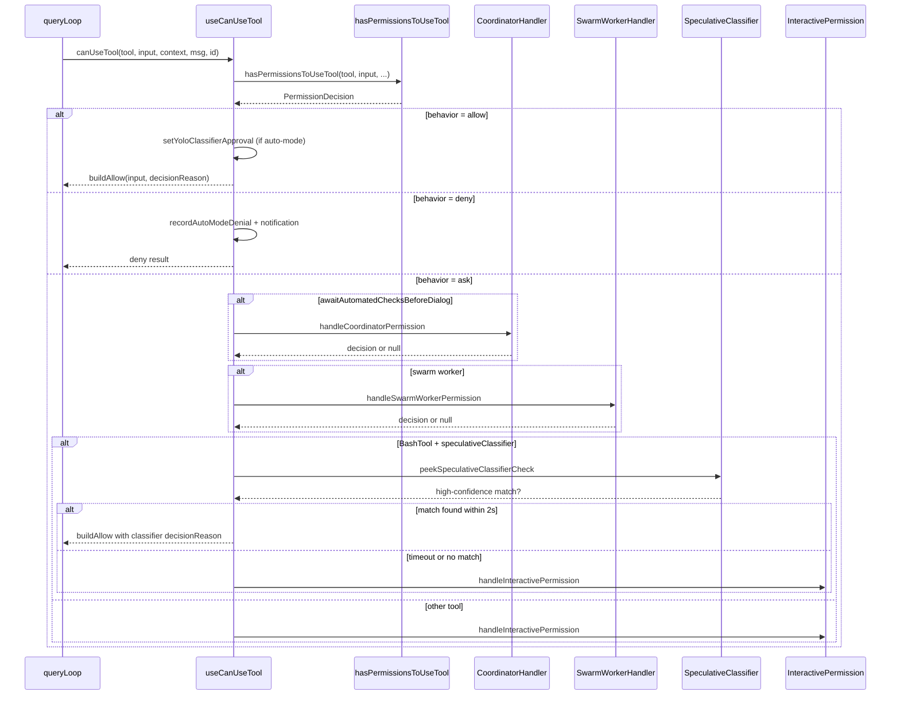
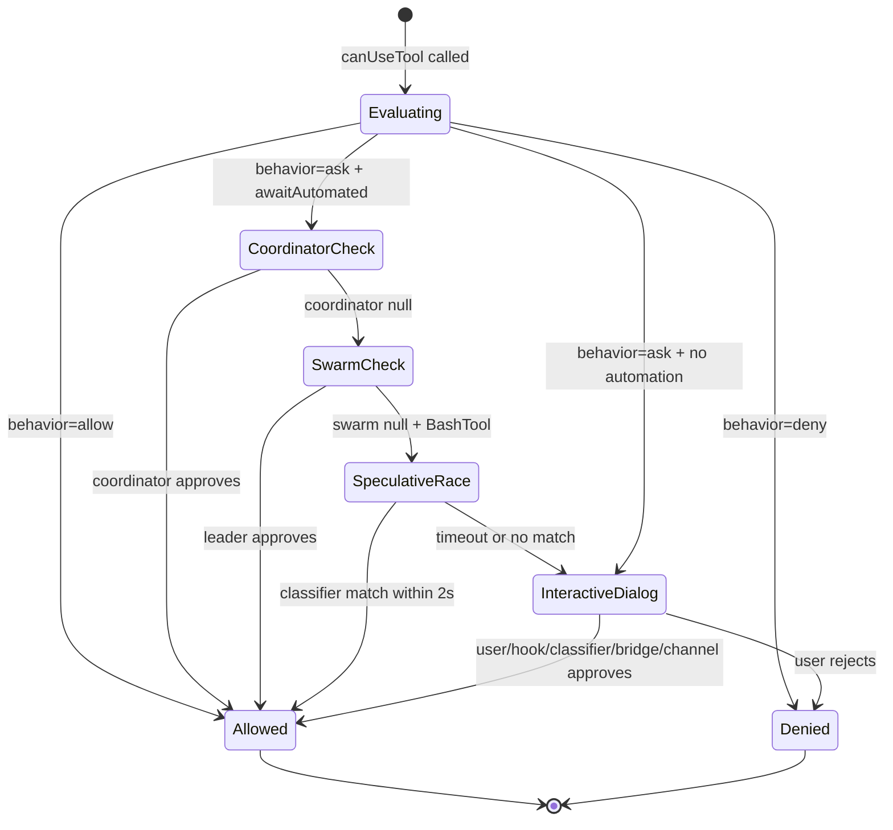

# `useCanUseTool`: The Engine Hook

## Overview

`useCanUseTool` is a ~200 LOC React hook that serves as the bridge between the permission decision engine and the interactive UI. Every tool invocation in Claude Code passes through this hook, which evaluates the decision from `hasPermissionsToUseTool` and then routes to the appropriate handler: auto-approve for allowed actions, denial recording for blocked ones, and interactive permission dialogs for actions requiring human input. The hook also manages speculative classifier checks for Bash commands and coordinates with swarm worker and coordinator handlers.

This chapter maps the hook's logic to HER's tiered escalation model (Section 11.2) and async approval pattern (Section 11.3). The hook implements a four-tier escalation path: deterministic rule evaluation (Tier 1), classifier auto-approval/denial (Tier 2), coordinator and swarm worker automated checks (Tier 2-3), and interactive human approval (Tier 4). Understanding this escalation path is essential for anyone building a permission system that must balance safety with usability in a long-running agent.

The hook is implemented as a React hook rather than a plain function because it needs access to React state setters (`setToolUseConfirmQueue` and `setToolPermissionContext`) that drive the permission dialog UI. The React Compiler's `_c` runtime caches the callback across renders, preventing unnecessary re-creation of the permission evaluation function. This design choice means that the permission evaluation is tightly coupled to the React rendering cycle, which has implications for testing and for any non-React execution contexts.

## Data structures and contracts

### CanUseToolFn type

The hook's return type is a function signature that accepts a tool, input, context, assistant message, tool use ID, and optional forced decision:

```typescript
// src/hooks/useCanUseTool.tsx:L27
export type CanUseToolFn<Input extends Record<string, unknown> = Record<string, unknown>> = (
  tool: ToolType, input: Input, toolUseContext: ToolUseContext,
  assistantMessage: AssistantMessage, toolUseID: string,
  forceDecision?: PermissionDecision<Input>,
) => Promise<PermissionDecision<Input>>
```

The `forceDecision` parameter allows callers (e.g., test harnesses or programmatic tool dispatch) to bypass the normal permission evaluation and directly resolve with a specific decision. This is the only escape hatch in the permission pipeline: when `forceDecision` is provided, the `hasPermissionsToUseTool` call is skipped entirely, and the forced decision is used directly.

### PermissionDecision variants

The decision engine returns one of three `behavior` values:

- **`allow`**: The tool may proceed. Optionally includes `updatedInput` (e.g., when a classifier sanitizes a command) and `decisionReason` (tracking whether the decision came from a rule, the classifier, or a mode setting).
- **`deny`**: The tool is blocked. Includes a `message` explaining the denial. In auto mode, the denial is recorded for telemetry and the user is notified via an inline notification.
- **`ask`**: The tool requires human approval. Includes `message`, optional `suggestions` for the UI, and `decisionReason`. The `suggestions` array provides actionable options like switching to acceptEdits mode or adding a directory to the allow list.

### PermissionContext helper

The `createPermissionContext` helper (`src/hooks/toolPermission/PermissionContext.ts:L96`) encapsulates the resolve function, abort detection, logging, and queue operations into a single frozen object that is threaded through all the handlers. The context is created at the top of the permission promise and provides the methods that every handler uses to resolve, log, or cancel:

```typescript
// src/hooks/toolPermission/PermissionContext.ts:L106-L347
const ctx = {
  tool,
  input,
  toolUseContext,
  assistantMessage,
  messageId,
  toolUseID,
  logDecision(
    args: PermissionDecisionArgs,
    opts?: { input?: Record<string, unknown>; permissionPromptStartTimeMs?: number },
  ) {
    logPermissionDecision(
      { tool, input: opts?.input ?? input, toolUseContext, messageId, toolUseID },
      args,
      opts?.permissionPromptStartTimeMs,
    )
  },
  logCancelled() {
    logEvent('tengu_tool_use_cancelled', {
      messageID: messageId as AnalyticsMetadata_I_VERIFIED_THIS_IS_NOT_CODE_OR_FILEPATHS,
      toolName: sanitizeToolNameForAnalytics(tool.name),
    })
  },
  async persistPermissions(updates: PermissionUpdate[]) {
    if (updates.length === 0) return false
    persistPermissionUpdates(updates)
    const appState = toolUseContext.getAppState()
    setToolPermissionContext(
      applyPermissionUpdates(appState.toolPermissionContext, updates),
    )
    return updates.some(update => supportsPersistence(update.destination))
  },
  resolveIfAborted(resolve: (decision: PermissionDecision) => void) {
    if (!toolUseContext.abortController.signal.aborted) return false
    this.logCancelled()
    resolve(this.cancelAndAbort(undefined, true))
    return true
  },
  cancelAndAbort(
    feedback?: string,
    isAbort?: boolean,
    contentBlocks?: ContentBlockParam[],
  ): PermissionDecision {
    const sub = !!toolUseContext.agentId
    const baseMessage = feedback
      ? `${sub ? SUBAGENT_REJECT_MESSAGE_WITH_REASON_PREFIX : REJECT_MESSAGE_WITH_REASON_PREFIX}${feedback}`
      : sub
        ? SUBAGENT_REJECT_MESSAGE
        : REJECT_MESSAGE
    const message = sub ? baseMessage : withMemoryCorrectionHint(baseMessage)
    if (isAbort || (!feedback && !contentBlocks?.length && !sub)) {
      logForDebugging(
        `Aborting: tool=${tool.name} isAbort=${isAbort} hasFeedback=${!!feedback} isSubagent=${sub}`,
      )
      toolUseContext.abortController.abort()
    }
    return { behavior: 'ask', message, contentBlocks }
  },
  // ... tryClassifier, runHooks, buildAllow, buildDeny, handleUserAllow,
  //     handleHookAllow, pushToQueue, removeFromQueue, updateQueueItem
}
```

The `resolveIfAborted` check runs before every potentially long operation, ensuring that a user abort is handled promptly. The `cancelAndAbort` method constructs a denial message with subagent-awareness (using different rejection message templates for subagent vs main-agent contexts) and conditionally aborts the tool's `AbortController` when the cancellation is a true abort (no feedback, no content blocks, not a subagent).

### ResolveOnce: the atomic claim guard

The `createResolveOnce` helper (`src/hooks/toolPermission/PermissionContext.ts:L75-L94`) provides an atomic check-and-mark primitive that prevents multiple racers from resolving the same permission promise:

```typescript
// src/hooks/toolPermission/PermissionContext.ts:L75-L94
function createResolveOnce<T>(resolve: (value: T) => void): ResolveOnce<T> {
  let claimed = false
  let delivered = false
  return {
    resolve(value: T) {
      if (delivered) return
      delivered = true
      claimed = true
      resolve(value)
    },
    isResolved() {
      return claimed
    },
    claim() {
      if (claimed) return false
      claimed = true
      return true
    },
  }
}
```

The `claim()` method is the key innovation: it atomically checks whether the race has already been won and marks it as claimed in a single operation. This closes the window between checking `isResolved()` and calling `resolve()`, which is critical in the interactive handler where up to five racers (local user, bridge, channel, hook, classifier) compete for the same resolve function. Without `claim()`, two racers could both observe `isResolved() === false` and then both call `resolve()`, causing a double-resolution that would corrupt the permission state.

## Control flow

### Main decision flow

The hook wraps its logic in a React `useCallback` via the React Compiler's `_c` runtime. When called, it creates a `PermissionContext` object and then evaluates the decision:

```typescript
// src/hooks/useCanUseTool.tsx:L32-L37
async (tool, input, toolUseContext, assistantMessage, toolUseID, forceDecision) =>
  new Promise(resolve => {
    const ctx = createPermissionContext(tool, input, toolUseContext, assistantMessage, toolUseID, setToolPermissionContext, createPermissionQueueOps(setToolUseConfirmQueue))
    if (ctx.resolveIfAborted(resolve)) { return; }
    const decisionPromise = forceDecision !== undefined ? Promise.resolve(forceDecision) : hasPermissionsToUseTool(tool, input, toolUseContext, assistantMessage, toolUseID);
```

The `createPermissionQueueOps` helper bridges React's `setToolUseConfirmQueue` state setter to the generic `PermissionQueueOps` interface used by `PermissionContext`. The bridge provides three operations -- `push`, `remove`, and `update` -- each implemented as a React state update:

```typescript
// src/hooks/toolPermission/PermissionContext.ts:L357-L379
function createPermissionQueueOps(
  setToolUseConfirmQueue: React.Dispatch<React.SetStateAction<ToolUseConfirm[]>>,
): PermissionQueueOps {
  return {
    push(item: ToolUseConfirm) {
      setToolUseConfirmQueue(queue => [...queue, item])
    },
    remove(toolUseID: string) {
      setToolUseConfirmQueue(queue =>
        queue.filter(item => item.toolUseID !== toolUseID),
      )
    },
    update(toolUseID: string, patch: Partial<ToolUseConfirm>) {
      setToolUseConfirmQueue(queue =>
        queue.map(item =>
          item.toolUseID === toolUseID ? { ...item, ...patch } : item,
        ),
      )
    },
  }
}
```

If the decision is `allow`, the hook checks whether it came from the auto-mode classifier and records the approval for UI display via `setYoloClassifierApproval`. If the decision is `deny`, it records auto-mode denials for telemetry and shows a notification. If the decision is `ask`, it enters the escalation pipeline.



### Plan mode enforcement

The hook enforces plan mode restrictions through the `hasPermissionsToUseTool` function, which consults the current permission mode stored in `appState.toolPermissionContext.mode`. When plan mode is active, `hasPermissionsToUseTool` returns `deny` for any tool that performs writes or side effects (Edit, Write, Bash with write-classified commands, etc.) and `allow` for read-only tools (Read, Glob, Grep). This gating is the primary mechanism by which plan mode ensures the agent cannot make filesystem changes while planning.

The enforcement works through the tool's own `isReadOnly` property and the permission rule system. Tools that declare `isReadOnly: true` (like Read, Glob, and Grep) are automatically allowed in plan mode. Tools without this property are treated as potentially destructive and are denied unless the user has explicitly allowed them through permission rules. The Bash tool receives special treatment: the command classifier determines whether a specific command is read-only or write-classified, and only read-only commands (like `ls`, `cat`, `git status`) are allowed in plan mode.

The hook itself does not re-check plan mode after the initial `hasPermissionsToUseTool` call. If the user switches into or out of plan mode while a permission dialog is displayed, the `recheckPermission` callback re-evaluates the decision by calling `hasPermissionsToUseTool` again with the current mode. This ensures that a mode switch mid-dialog is respected: if the user switches from default mode to plan mode while a Bash command is pending, the recheck will deny the command even though the original evaluation returned `ask`. Conversely, if the user exits plan mode while a read-only tool was auto-approved, the next write-classified tool call will correctly show an `ask` decision because the mode has changed.

The `EnterPlanModeTool` and `ExitPlanModeV2Tool` (Chapter 45) trigger the mode switch by updating `appState.toolPermissionContext.mode`. Because the hook reads this state on each invocation rather than capturing it in a closure, the plan mode restriction takes effect on the very next tool call without requiring a React re-render or a callback recreation. This is a subtle but important design point: if the hook captured the permission mode in its closure at creation time, switching to plan mode would have no effect until the next React re-render created a new callback instance. By reading the mode from the app state on each call, the hook ensures that plan mode enforcement is immediate and consistent.

### Coordinator handler

When `appState.toolPermissionContext.awaitAutomatedChecksBeforeDialog` is true (typically for swarm worker contexts), the coordinator handler intercepts `ask` decisions before they reach the user. This implements HER's principle that automated checks should resolve before interrupting the user (Section 11.2, Tier 1-2). The coordinator runs two automated checks sequentially:

```typescript
// src/hooks/toolPermission/handlers/coordinatorHandler.ts:L31-L46
try {
  // 1. Try permission hooks first (fast, local)
  const hookResult = await ctx.runHooks(
    permissionMode,
    suggestions,
    updatedInput,
  )
  if (hookResult) return hookResult

  // 2. Try classifier (slow, inference -- bash only)
  const classifierResult = feature('BASH_CLASSIFIER')
    ? await ctx.tryClassifier?.(params.pendingClassifierCheck, updatedInput)
    : null
  if (classifierResult) {
    return classifierResult
  }
```

The hooks check runs first because it is fast and local (no network calls). The classifier check runs second because it may require an API call with significant latency. If both return null, the handler falls through to the interactive dialog. If either check throws an unexpected error, the handler logs it and falls through rather than blocking the permission pipeline:

```typescript
// src/hooks/toolPermission/handlers/coordinatorHandler.ts:L47-L57
} catch (error) {
  if (error instanceof Error) {
    logError(error)
  } else {
    logError(new Error(`Automated permission check failed: ${String(error)}`))
  }
}
return null
```

The error handling intentionally avoids `toError()` for non-Error throws, adding a context prefix so the log is traceable. This is a defensive choice: the coordinator should never prevent the user from seeing the dialog, even if an automated check throws an unexpected value.

### Swarm worker handler

Swarm workers forward permission requests to the team leader via the mailbox system. If the leader auto-approves, the worker proceeds without showing a dialog. This implements HER's async approval pattern (Section 11.3): the worker does not fully block on human input but instead continues with other work while waiting for the leader's response. The handler first checks whether swarms are enabled and whether this instance is a swarm worker:

```typescript
// src/hooks/toolPermission/handlers/swarmWorkerHandler.ts:L43-L45
if (!isAgentSwarmsEnabled() || !isSwarmWorker()) {
  return null
}
```

If both conditions are true, the handler tries classifier auto-approval first (for Bash commands), then forwards the request to the leader. The critical implementation detail is the callback registration order: the callback is registered *before* the request is sent to avoid a race condition where the leader responds before the callback is registered:

```typescript
// src/hooks/toolPermission/handlers/swarmWorkerHandler.ts:L81-L123
registerPermissionCallback({
  requestId: request.id,
  toolUseId: ctx.toolUseID,
  async onAllow(
    allowedInput: Record<string, unknown> | undefined,
    permissionUpdates: PermissionUpdate[],
    feedback?: string,
    contentBlocks?: ContentBlockParam[],
  ) {
    if (!claim()) return // atomic check-and-mark before await
    clearPendingRequest()

    // Merge the updated input with the original input
    const finalInput =
      allowedInput && Object.keys(allowedInput).length > 0
        ? allowedInput
        : ctx.input

    resolveOnce(
      await ctx.handleUserAllow(
        finalInput,
        permissionUpdates,
        feedback,
        undefined,
        contentBlocks,
      ),
    )
  },
  onReject(feedback?: string, contentBlocks?: ContentBlockParam[]) {
    if (!claim()) return
    clearPendingRequest()

    ctx.logDecision({
      decision: 'reject',
      source: { type: 'user_reject', hasFeedback: !!feedback },
    })

    resolveOnce(ctx.cancelAndAbort(feedback, undefined, contentBlocks))
  },
})

// Now that callback is registered, send the request to the leader
void sendPermissionRequestViaMailbox(request)
```

While waiting for the leader's response, the handler sets a visual indicator (`pendingWorkerRequest`) in the app state and registers an abort listener that cancels the pending request if the user aborts the session. The `claim()` guard in both `onAllow` and `onReject` prevents double-resolution if the abort fires simultaneously with the leader's response.

### Speculative classifier race

For Bash commands in the main agent (not swarm workers), the hook races the speculative classifier check against a 2-second timeout. The speculative classifier is a pre-computed check that runs in parallel with the dialog display, allowing the dialog to be skipped if the classifier returns a high-confidence match quickly:

```typescript
// src/hooks/useCanUseTool.tsx:L127-L131
const speculativePromise = peekSpeculativeClassifierCheck(
  (input as { command: string }).command,
)
if (speculativePromise) {
  const raceResult = await Promise.race([
    speculativePromise.then(r => ({ type: 'result' as const, result: r })),
    new Promise<{ type: 'timeout' }>(res =>
      setTimeout(res, 2000, { type: 'timeout' as const }),
    ),
  ])
```

If the classifier returns a high-confidence match within the grace period, the dialog is skipped and the command is auto-approved with a `bash_allow` decision reason. The `consumeSpeculativeClassifierCheck` function removes the pre-computed result to prevent it from being used again. This avoids the latency of showing an interactive dialog for commands that the classifier can confidently approve.

The race only fires when four conditions are met: the `BASH_CLASSIFIER` feature flag is enabled, the decision includes a `pendingClassifierCheck`, the tool is the Bash tool, and `awaitAutomatedChecksBeforeDialog` is false (i.e., this is the main agent, not a coordinator worker). When any of these conditions is false, the hook falls directly to the interactive handler.

### Interactive permission handler

The `handleInteractivePermission` function (`src/hooks/toolPermission/handlers/interactiveHandler.ts:L57`) is the most complex handler, managing up to five concurrent racers that compete for the permission resolve. It pushes a `ToolUseConfirm` entry to the confirm queue and sets up callbacks for user interaction, abort, allow, reject, and permission recheck. The function does not return a Promise; instead, it accepts the `resolve` function from the outer Promise and calls it when any racer wins.

The five racers are:

1. **Local user interaction**: The user approves or denies through the terminal's interactive dialog. The `onUserInteraction` callback is called when the user starts interacting (arrow keys, tab, typing feedback), which cancels the background classifier check via `clearClassifierChecking`. A 200ms grace period prevents accidental keypresses from canceling the classifier prematurely.

2. **Bridge permission response**: When running in VS Code bridge mode, the permission request is forwarded to CCR (Claude Code Remote). Whichever side (CLI or CCR) responds first wins via `claim()`.

3. **Channel permission relay**: When running in KAIROS channel mode, permission prompts are sent to active channels (Telegram, iMessage, etc.) via MCP notifications. Channel replies are intercepted before they reach Claude as conversation turns.

4. **Permission request hooks**: `executePermissionRequestHooks` runs hooks registered for the `PermissionRequest` event. If a hook returns a decision before the user responds, the hook wins.

5. **Async classifier check**: For Bash commands, the classifier runs asynchronously in the background after the dialog is displayed. If it returns a high-confidence match, the dialog transitions to a "checkmark" state (dimmed options showing auto-approved) before being removed after a timed delay.

The checkmark transition timer uses different durations depending on terminal focus: 3 seconds if the terminal is focused (the user can see it), 1 second if not. The user can dismiss early with Esc via the `onDismissCheckmark` callback. The timer is also cleaned up if a sibling Bash error fires the abort signal, preventing a stale checkmark from blocking the next queued item.

#### The ToolUseConfirm UI component

The `ToolUseConfirm` entry pushed to the queue is rendered by the `PermissionRequest` component (`src/components/permissions/PermissionRequest.tsx`). This component renders the interactive permission dialog that the user sees in the terminal. It receives the tool name, description, input preview, and the permission result (including suggestions) and presents a set of options: approve once, approve and remember the decision, deny, or switch permission modes via the suggestions.

The component subscribes to classifier checking state via `subscribeClassifierChecking` and updates its UI reactively: while the classifier is running, it shows a spinner indicator; when the classifier auto-approves, it transitions to the dimmed checkmark state. The `onUserInteraction` callback is wired to the Ink `useInput` hook, which fires on any keypress. This is why the grace period exists: Ink delivers keypress events synchronously, and without the grace period, a stale keypress from a previous tool invocation could cancel the classifier before it starts.

The component also handles the bridge and channel permission prompts indirectly: the bridge's `sendRequest` call sends the same tool metadata to the CCR web UI, which renders its own permission modal. The channel relay sends a notification to the configured channels. Both of these remote UIs are independent of the terminal's Ink-rendered dialog; the first response from any UI wins the race.

An important detail about the `ToolUseConfirm` entry is that it carries the `permissionResult` (the full `ask` decision, including suggestions and the decision reason) as well as the callbacks. This means the UI component has all the context it needs to render the dialog without making additional calls to the permission system. The suggestions are rendered as actionable buttons: for example, if the denial reason is that a path is not in the allow list, the suggestions might include "Add path to allow list" or "Switch to acceptEdits mode." Each suggestion corresponds to a `PermissionUpdate` that, if selected, is applied by the `handleUserAllow` method on the context.

```mermaid
flowchart TD
    A[handleInteractivePermission called] --> B[Push ToolUseConfirm to queue]
    B --> C{Bridge mode?}
    C -->|yes| D[Send request to CCR]
    C -->|no| E{Channel mode?}
    E -->|yes| F[Send notification to channels]
    E -->|no| G[Wait for local interaction]
    D --> G
    F --> G
    G --> H{awaitAutomatedChecksBeforeDialog?}
    H -->|no| I[Run PermissionRequest hooks async]
    H -->|yes| J[Skip hooks - already ran]
    I --> K{Bash + classifier?}
    J --> K
    K -->|yes| L[Execute async classifier check]
    K -->|no| M[Wait for first racer]
    L --> M
    M --> N{Which racer wins?}
    N --> O[claim() + resolveOnce()]
    O --> P[Remove from queue + cleanup]
```

### Auto-mode denial handling

When the auto-mode classifier denies a tool call, the hook records the denial for telemetry and shows an inline notification:

```typescript
// src/hooks/useCanUseTool.tsx:L77-L89
if (feature("TRANSCRIPT_CLASSIFIER") && result.decisionReason?.type === "classifier" && result.decisionReason.classifier === "auto-mode") {
  recordAutoModeDenial({
    toolName: tool.name,
    display: description,
    reason: result.decisionReason.reason ?? "",
    timestamp: Date.now()
  })
  toolUseContext.addNotification?.({
    key: "auto-mode-denied",
    priority: "immediate",
    jsx: <><Text color="error">{tool.userFacingName(input).toLowerCase()} denied by auto mode</Text><Text dimColor={true}> · /permissions</Text></>
  })
}
```

The notification includes the tool's user-facing name and a hint to use `/permissions` to adjust the rules. The `recordAutoModeDenials` function writes to a session-scoped list that can be queried later for debugging or for the denial tracking subsystem (Chapter 34). The `key: "auto-mode-denied"` ensures that multiple denials coalesce into a single notification rather than stacking.

### Permission recheck

The `recheckPermission` callback in the interactive handler allows the permission state to be re-evaluated after it changes. This is used when a user switches permission modes via the dialog's suggestions (e.g., switching from default to acceptEdits mode). The recheck calls `hasPermissionsToUseTool` again with the current input and context:

```typescript
// src/hooks/toolPermission/handlers/interactiveHandler.ts:L204-L231
async recheckPermission() {
  if (isResolved()) return
  const freshResult = await hasPermissionsToUseTool(
    ctx.tool,
    ctx.input,
    ctx.toolUseContext,
    ctx.assistantMessage,
    ctx.toolUseID,
  )
  if (freshResult.behavior === 'allow') {
    if (!claim()) return
    if (bridgeCallbacks && bridgeRequestId) {
      bridgeCallbacks.cancelRequest(bridgeRequestId)
    }
    channelUnsubscribe?.()
    ctx.removeFromQueue()
    ctx.logDecision({ decision: 'accept', source: 'config' })
    resolveOnce(ctx.buildAllow(freshResult.updatedInput ?? ctx.input))
  }
}
```

The `claim()` guard (not `isResolved()`) is used here because the async `hasPermissionsToUseTool` call opens a window where a bridge or channel response could have resolved the race in flight. Using `claim()` ensures that only one winner exists.

### Error handling

Errors during permission evaluation are caught and resolved as cancellations:

```typescript
// src/hooks/useCanUseTool.tsx:L171-L182
.catch(error => {
  if (error instanceof AbortError || error instanceof APIUserAbortError) {
    logForDebugging(`Permission check threw ${error.constructor.name} for tool=${tool.name}: ${error.message}`);
    ctx.logCancelled();
    resolve(ctx.cancelAndAbort(undefined, true));
  } else {
    logError(error);
    resolve(ctx.cancelAndAbort(undefined, true));
  }
}).finally(() => {
  clearClassifierChecking(toolUseID);
})
```

Both abort errors and unexpected errors resolve with `cancelAndAbort`, which signals the query loop to stop processing the current tool call. The `clearClassifierChecking` call in the `finally` block ensures that the classifier checking state is always cleaned up, even if the permission evaluation throws an unexpected error.



### Non-React execution contexts

Because `useCanUseTool` is a React hook, its permission evaluation is only available within the React rendering tree. In non-interactive contexts -- headless mode (`--print`), SDK mode, and daemon mode -- there is no React component tree and therefore no `useCanUseTool` instance. These contexts use a different permission path entirely. Understanding this split is important for anyone building a harness that needs to work both interactively and non-interactively: the permission logic is shared (via `hasPermissionsToUseTool` and `PermissionContext`), but the interactive escalation path (the five racers, the `ToolUseConfirm` queue, the Ink-rendered dialog) is React-specific and must be replaced with an alternative in non-React contexts.

In headless mode, the `hasPermissionsToUseTool` function is called directly from the query loop without going through the hook. The decision is resolved immediately: `allow` decisions proceed, `deny` decisions are logged and the tool call is skipped, and `ask` decisions are treated as `deny` because there is no interactive UI to display. This is why headless mode is typically used with `acceptEdits` or `bypassPermissions` mode -- the agent cannot prompt the user for permission. If the user runs headless mode in default permission mode and the agent attempts a write operation, the tool call will be silently denied, which can lead to confusing behavior where the agent's edits are not applied.

In SDK mode (when cc is embedded as a library), the host application provides its own permission callback via `toolUseContext.addNotification` and `toolUseContext.abortController`. The SDK host can intercept `ask` decisions and display its own permission UI, or it can use `forceDecision` to bypass the permission pipeline entirely for trusted operations. The `forceDecision` parameter is the SDK host's primary mechanism for programmatic tool dispatch. When building an SDK integration, you must decide whether to implement a permission UI (replicating the five-racer pattern) or to use a permissive mode with `forceDecision` for trusted operations. The former is safer but more complex; the latter is simpler but requires careful trust boundaries.

In daemon mode (when cc runs as a background service with cron/scheduled tasks), the `isNonInteractiveSession` flag is set on the `toolUseContext`. The permission system checks this flag and skips the interactive dialog, resolving `ask` decisions as denials unless the tool was explicitly allowlisted via permission rules. This prevents a daemon-mode agent from hanging indefinitely on a permission prompt that no user will see. The daemon mode also interacts with the dream task system (Chapter 24): dream tasks are always non-interactive, and they use a restricted set of tools that are pre-approved for memory consolidation operations, so the permission system rarely needs to intervene.

## Edge cases and failure modes

**Race between classifier and dialog**: The speculative classifier race has a 2-second window. If the classifier is slow (e.g., due to API latency or a cold cache), the race times out and the dialog is shown. The classifier result is then discarded, even if it arrives shortly after. This is a deliberate tradeoff: the user experience of waiting for a dialog is worse than showing the dialog immediately. The `consumeSpeculativeClassifierCheck` function removes the pre-computed result to prevent it from being used on a subsequent call with different input.

**Swarm worker permission forwarding deadlock**: If a swarm worker's permission request is forwarded to the leader, but the leader is itself waiting for a permission decision, a deadlock can occur. The `handleSwarmWorkerPermission` handler does not implement a timeout on the leader's response, so a stuck leader could indefinitely block the worker. The `awaitAutomatedChecksBeforeDialog` flag mitigates this by ensuring that automated checks run before any dialog is shown, but it does not prevent the deadlock case. The abort listener provides a partial escape: if the user aborts the session, the pending request is cancelled and the worker's permission promise resolves with a cancellation.

**Force decision bypass**: The `forceDecision` parameter allows callers to bypass the entire permission pipeline. This is intended for programmatic tool dispatch (e.g., tests, SDK integrations) but could be misused to bypass safety checks. The parameter is not exposed to the model; only the harness code can set it. This is a necessary escape hatch for any agent that needs to perform programmatic tool calls (e.g., the SDK host that drives cc from an external application).

**Abort during permission evaluation**: If the user aborts the session while a permission dialog is displayed, the `resolveIfAborted` check catches the abort and resolves with a cancellation. However, if the abort occurs after the user has already interacted with the dialog but before the result is processed, the tool call is still cancelled, and the user's approval is lost. This is a tradeoff between consistency (the abort always takes effect) and user experience (the approval is wasted). The `resolveIfAborted` checks are placed strategically before every potentially long operation to minimize this window.

**Classifier checking state cleanup**: The `clearClassifierChecking` call in the `finally` block ensures that the per-tool-use-ID classifier checking state is always cleaned up. Without this cleanup, a tool use ID that was marked as "checking" would prevent subsequent permission evaluations for the same tool from running the speculative classifier, because `peekSpeculativeClassifierCheck` only returns a promise for IDs that are currently being checked.

**Bridge and channel cleanup on abort**: When the local user or classifier wins the race, the bridge request and channel subscription must be cleaned up. The interactive handler handles this at every resolution site: `bridgeCallbacks.cancelRequest(bridgeRequestId)` tells the CCR to dismiss its prompt, and `channelUnsubscribe?.()` removes both the map entry and the abort listener. Without the channel unsubscribe wrapper, the dead closure would stay registered on the session-scoped abort signal until the session ended -- not a functional bug (Map.delete is idempotent), but it held the closure alive unnecessarily.

## Where cc diverges from the published pattern

HER Section 11.2 prescribes a four-tier escalation model: deterministic checks (Tier 1), agent self-correction (Tier 2), human front-line (Tier 3), and human expert (Tier 4). cc's implementation conflates Tiers 2 and 3: the classifier auto-approval/denial and the interactive permission dialog occupy the same code path, with the coordinator and swarm handlers acting as intermediate automated checks. There is no explicit "agent self-correction" tier where the agent can revise its action before escalation. The denial tracking subsystem (Chapter 34) provides a partial implementation: after three consecutive denials, the system falls back to the interactive dialog, but the agent does not get a chance to revise its input.

HER Section 11.3 describes async approval where the agent parks a blocked action and continues with non-blocked work. cc's swarm worker handler partially implements this by forwarding permission requests to the leader, but the main agent does not have an async approval mechanism. When the main agent encounters an `ask` decision, it blocks entirely until the user responds. For a long-running agent, this means a single permission prompt can halt all progress. An alternative design would be to park the blocked action and continue with other tool calls, resuming the blocked action when the user responds. This would require significant changes to the query loop's execution model, but it would dramatically reduce idle time during multi-hour sessions.

The bridge and channel permission callbacks provide an alternative path for non-interactive approval. When running in VS Code bridge mode or KAIROS channel mode, the permission request can be routed to the IDE's permission UI or to a channel-based approval system, rather than the terminal's interactive dialog. This is a partial implementation of async approval: the request is still blocking from the agent's perspective, but the user can respond from a different UI surface. The channel relay has a notable limitation: it only supports yes/no responses with no `updatedInput` path, which means it cannot handle tools that require user-modified inputs (like plan edits).

## Developer takeaways for building a long-running agent

1. **Race conditions between automated and manual approval**: When automated checks and human approval compete, you need a clear timeout and fallback. Set the timeout based on your user experience budget, not the expected classifier latency. A 2-second timeout means the user sees the dialog after 2 seconds even if the classifier would have approved at 2.5 seconds.

2. **Swarm workers need permission forwarding with timeouts**: Without a timeout on the leader's response, a stuck leader can deadlock the entire swarm. Implement a bounded wait with a fallback to the interactive dialog.

3. **Record every decision for auditability**: The `logPermissionDecision` call at every branch point ensures that every permission decision is captured for telemetry. This audit trail is essential for post-incident analysis.

4. **The `claim()` atomic guard prevents double-resolution**: When multiple approval paths race for the same resolve function, an atomic check-and-mark primitive is essential. The `createResolveOnce` helper provides this guarantee with a single `claimed` boolean.

5. **Non-React contexts need a separate permission path**: The React hook design does not generalize to headless, SDK, or daemon modes. Plan for a direct-call path that resolves `ask` decisions without a UI, using `forceDecision` or the `isNonInteractiveSession` flag.

6. **Grace periods prevent accidental classifier cancellation**: The 200ms grace period prevents a stray keypress from canceling a classifier check that is about to auto-approve.

## Supporting subsystems

### Permission logging and telemetry

The `logPermissionDecision` function (`src/hooks/toolPermission/permissionLogging.ts:L181`) is the single entry point for all permission decision logging. It is called by every handler after every approve or reject decision. The function fans out to four destinations:

1. **Analytics events**: Distinct event names per approval source enable funnel analysis. Config auto-approvals emit `tengu_tool_use_granted_in_config`, classifier approvals emit `tengu_tool_use_granted_by_classifier`, user approvals emit either `tengu_tool_use_granted_in_prompt_permanent` or `tengu_tool_use_granted_in_prompt_temporary`, and hook approvals emit `tengu_tool_use_granted_by_permission_hook`. Rejections share a single event name (`tengu_tool_use_rejected_in_prompt`) but are differentiated by metadata fields (`isHook`, `hasFeedback`).

2. **OTel telemetry**: Every decision emits a `tool_decision` OpenTelemetry event with the decision, source, and tool name.

3. **Code-edit OTel counters**: For code-editing tools (Edit, Write, NotebookEdit), the function builds counter attributes including the file language (derived from the file path via `getLanguageName`) and increments a dedicated counter.

4. **Context decision storage**: The decision is persisted on `toolUseContext.toolDecisions` so downstream code can inspect what happened for a specific tool use ID:

```typescript
// src/hooks/toolPermission/permissionLogging.ts:L221-L228
if (!toolUseContext.toolDecisions) {
  toolUseContext.toolDecisions = new Map()
}
toolUseContext.toolDecisions.set(toolUseID, {
  source: sourceString,
  decision,
  timestamp: Date.now(),
})
```

The `waiting_for_user_permission_ms` field measures how long the user took to respond, calculated from the `permissionPromptStartTimeMs` timestamp set when the dialog was pushed. This metric is only included when the user was actually prompted (not for auto-approved decisions).

### Auto-mode denial tracking

The `autoModeDenials` module (`src/utils/autoModeDenials.ts`) maintains a session-scoped list of denials from the auto-mode classifier. It is a simple append-only log with a maximum of 20 entries:

```typescript
// src/utils/autoModeDenials.ts:L16-L22
let DENIALS: readonly AutoModeDenial[] = []
const MAX_DENIALS = 20

export function recordAutoModeDenial(denial: AutoModeDenial): void {
  if (!feature('TRANSCRIPT_CLASSIFIER')) return
  DENIALS = [denial, ...DENIALS.slice(0, MAX_DENIALS - 1)]
}
```

The denial list is read from the `/permissions` UI's `RecentDenialsTab`, which shows the user what the classifier has blocked. This provides transparency into the classifier's behavior and helps users adjust their permission rules to reduce false positives. The `MAX_DENIALS` cap prevents unbounded memory growth in long-running sessions.

### Classifier approval tracking

The `classifierApprovals` module (`src/utils/classifierApprovals.ts`) tracks which tool uses were auto-approved by classifiers, enabling the UI to display a visual indicator (a dimmed checkmark) for auto-approved actions. The module maintains two data structures:

- `CLASSIFIER_APPROVALS`: A `Map<string, ClassifierApproval>` keyed by tool use ID, storing whether the approval came from the Bash classifier (`bash`) or the YOLO classifier (`auto-mode`) and the matched rule or reason.
- `CLASSIFIER_CHECKING`: A `Set<string>` of tool use IDs currently being checked by the classifier, used to show a spinner in the permission dialog.

The `createSignal` primitive provides a reactive subscription mechanism so that UI components can re-render when the checking state changes. The checking state is managed by two separate functions:

```typescript
// src/utils/classifierApprovals.ts:L62-L72
export function setClassifierChecking(toolUseID: string): void {
  if (!feature('BASH_CLASSIFIER') && !feature('TRANSCRIPT_CLASSIFIER')) return
  CLASSIFIER_CHECKING.add(toolUseID)
  classifierChecking.emit()
}

export function clearClassifierChecking(toolUseID: string): void {
  if (!feature('BASH_CLASSIFIER') && !feature('TRANSCRIPT_CLASSIFIER')) return
  CLASSIFIER_CHECKING.delete(toolUseID)
  classifierChecking.emit()
}
```

The `setClassifierApproval` and `setYoloClassifierApproval` functions are called from different code paths: the former from the speculative classifier race in `useCanUseTool`, the latter from the allow branch when the YOLO classifier approves an action. The `getClassifierApproval` and `getYoloClassifierApproval` functions are called from the UI to display the approval reason. The separation between Bash classifier and YOLO classifier approvals ensures that the UI can display the correct information for each type of auto-approval.

The `deleteClassifierApproval` function removes a single approval entry, used when the tool result is processed and the approval indicator is no longer needed. The `clearClassifierApprovals` function clears both the approvals map and the checking set, called when the session ends or when the conversation is cleared. This cleanup prevents stale approval entries from one session from leaking into the next.

### The React Compiler cache and render stability

The `useCanUseTool` hook uses the React Compiler's `_c` runtime to cache the returned callback across renders. The cache key is derived from the two state setters passed as arguments:

```typescript
// src/hooks/useCanUseTool.tsx:L29-L31
const $ = _c(3);
let t0;
if ($[0] !== setToolPermissionContext || $[1] !== setToolUseConfirmQueue) {
```

When neither setter has changed (which is the common case, since React guarantees stable identity for `useState` setters), the cached callback is returned without re-creation. This is important because the callback is passed to the query loop as a stable reference; if it changed on every render, the query loop would need to re-subscribe to the new callback, potentially causing duplicate permission evaluations.

The cache also has implications for closure freshness: the callback captures the two setters in its closure, but it does not capture any other state. All dynamic state (like the current permission mode, the classifier feature flags, and the app state) is accessed through the `toolUseContext` parameter that is passed to each invocation. This design ensures that the cached callback always uses the latest state, even though it was created in a previous render.
