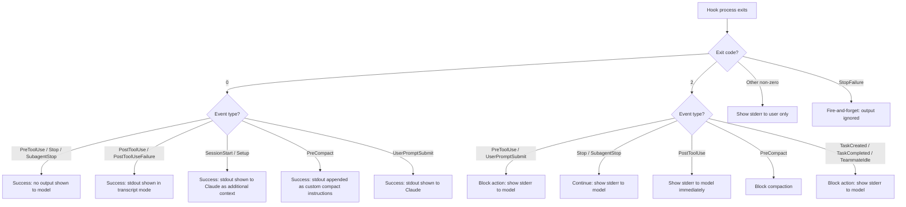
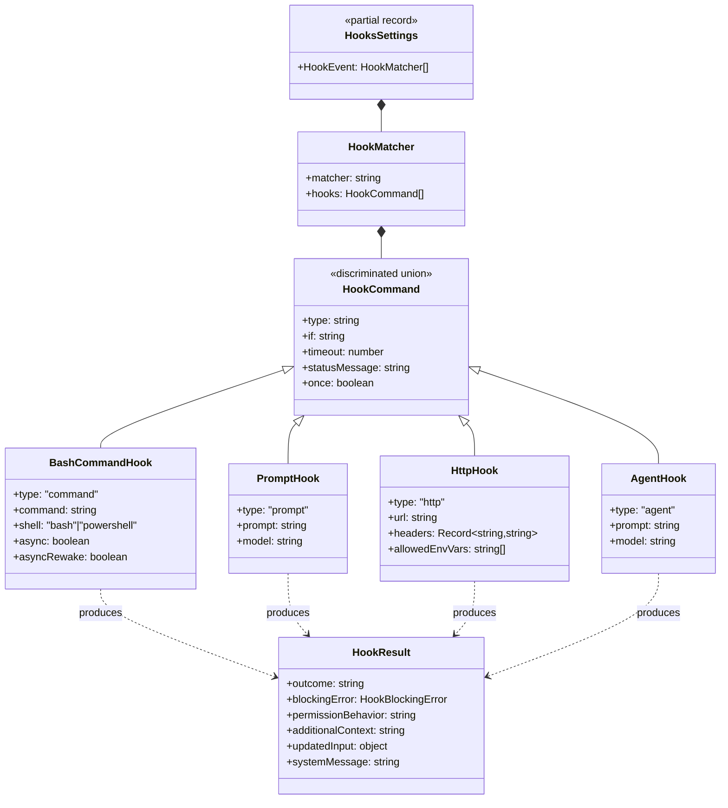

# The Hook Schema and Lifecycle Events

## Overview

Hooks are deterministic lifecycle event handlers embedded at 27 defined points across cc's execution. They are cc's implementation of HER Pattern 12 (Deterministic Lifecycle Hooks) and constitute one of the six configuration surfaces identified in HER Section 7.5. A hook is a user-defined command, LLM prompt, HTTP request, or agent verification that fires at a specific lifecycle event -- before a tool executes (`PreToolUse`), after compaction completes (`PostCompact`), when a file changes on disk (`FileChanged`), and so on. The hook system transforms what would otherwise be opaque model decisions into inspectable, overrideable, and auditable control points.

The schema definitions live in `src/schemas/hooks.ts` (~222 LOC), which defines the four hook-type schemas and the matcher/configuration structures. The event catalogue and per-event metadata are declared in `src/utils/hooks/hooksConfigManager.ts` (~400 LOC) and `src/entrypoints/sdk/coreTypes.ts`. The execution runtime -- the engine that spawns processes, parses JSON output, enforces timeouts, and routes results back into the query loop -- resides in `src/utils/hooks.ts` (~5000 LOC), the largest file in the hook subsystem. Settings and source-resolution logic live in `src/utils/hooks/hooksSettings.ts` (~272 LOC).

This chapter walks through the type schemas, the complete event catalogue with trigger semantics and exit-code handling, the execution runtime, and the ways cc diverges from the published HER pattern.

## Data structures and contracts

### The four hook types

Every hook is a discriminated union member keyed on the `type` field. The factory `buildHookSchemas()` in `src/schemas/hooks.ts:L31-L170` constructs four Zod object schemas that share a common set of optional fields (`if`, `timeout`, `statusMessage`, `once`) but differ in their domain-specific fields:

```typescript
// src/schemas/hooks.ts:L32-L65 — BashCommandHookSchema
const BashCommandHookSchema = z.object({
  type: z.literal('command').describe('Shell command hook type'),
  command: z.string().describe('Shell command to execute'),
  if: IfConditionSchema(),
  shell: z
    .enum(SHELL_TYPES)
    .optional()
    .describe(
      "Shell interpreter. 'bash' uses your $SHELL (bash/zsh/sh); 'powershell' uses pwsh. Defaults to bash.",
    ),
  timeout: z
    .number()
    .positive()
    .optional()
    .describe('Timeout in seconds for this specific command'),
  statusMessage: z
    .string()
    .optional()
    .describe('Custom status message to display in spinner while hook runs'),
  once: z
    .boolean()
    .optional()
    .describe('If true, hook runs once and is removed after execution'),
  async: z
    .boolean()
    .optional()
    .describe('If true, hook runs in background without blocking'),
  asyncRewake: z
    .boolean()
    .optional()
    .describe(
      'If true, hook runs in background and wakes the model on exit code 2 (blocking error). Implies async.',
    ),
})
```

The `command` type is the most feature-rich: it supports shell selection (`shell`), background execution (`async`), and the async-rewake pattern (`asyncRewake`) that re-injects blocking errors into the model's context after the hook finishes. The `prompt` type delegates to an LLM evaluation, the `http` type POSTs hook input JSON to a URL with optional env-var interpolation in headers, and the `agent` type spawns a subagent verifier. The discriminated union is exported via `HookCommandSchema` at `src/schemas/hooks.ts:L176-L189`:

```typescript
// src/schemas/hooks.ts:L176-L189 — HookCommandSchema discriminated union
export const HookCommandSchema = lazySchema(() => {
  const {
    BashCommandHookSchema,
    PromptHookSchema,
    AgentHookSchema,
    HttpHookSchema,
  } = buildHookSchemas()
  return z.discriminatedUnion('type', [
    BashCommandHookSchema,
    PromptHookSchema,
    AgentHookSchema,
    HttpHookSchema,
  ])
})
```

The `prompt` type at `src/schemas/hooks.ts:L67-L95` delegates evaluation to an LLM. Its required `prompt` field contains the prompt text, with `$ARGUMENTS` as a placeholder for the hook input JSON. An optional `model` field specifies which model to use (e.g., `"claude-sonnet-4-6"`), defaulting to a small fast model if not specified. Prompt hooks are useful for intelligent gate decisions that require semantic understanding of tool inputs -- for example, determining whether a file write introduces a security vulnerability.

The `http` type at `src/schemas/hooks.ts:L97-L126` POSTs the hook input JSON to a specified URL. It supports custom headers with environment variable interpolation, gated by an `allowedEnvVars` allowlist. The `headers` field at `src/schemas/hooks.ts:L107-L111` uses `z.record(z.string(), z.string())` for arbitrary key-value pairs, with values that may reference environment variables using `$VAR_NAME` or `${VAR_NAME}` syntax:

```typescript
// src/schemas/hooks.ts:L107-L117 — HTTP headers and allowedEnvVars
headers: z
  .record(z.string(), z.string())
  .optional()
  .describe(
    'Additional headers to include in the request. Values may reference environment variables using $VAR_NAME or ${VAR_NAME} syntax (e.g., "Authorization": "Bearer $MY_TOKEN"). Only variables listed in allowedEnvVars will be interpolated.',
  ),
allowedEnvVars: z
  .array(z.string())
  .optional()
  .describe(
    'Explicit list of environment variable names that may be interpolated in header values. Only variables listed here will be resolved; all other $VAR references are left as empty strings. Required for env var interpolation to work.',
  ),
```

Without an `allowedEnvVars` entry, all `$VAR` references in header values are left as empty strings. This design prevents accidental leakage of sensitive environment variables through HTTP hook configurations. HTTP hooks are executed with SSRF protection via `src/utils/hooks/ssrfGuard.ts`, which blocks connections to private, link-local, and CGNAT address ranges.

The `agent` type at `src/schemas/hooks.ts:L128-L163` spawns a subagent verifier. Its `prompt` field describes what the agent should verify (e.g., "Verify that unit tests ran and passed"), with `$ARGUMENTS` as a placeholder for hook input. An optional `model` field specifies the agent's model, defaulting to Haiku as documented in the schema description at `src/schemas/hooks.ts:L149-L153`. A notable design constraint is documented in the comment at `src/schemas/hooks.ts:L130-L137`: DO NOT add `.transform()` to the prompt field because the schema is used by `parseSettingsFile`, and `updateSettingsForSource` round-trips the parsed result through `JSON.stringify` -- a transformed function value would be silently dropped, deleting the user's prompt from `settings.json`. This was a real regression (gh-24920, CC-79) that prompted the explicit comment.

A fifth type -- `function` -- exists at runtime but is excluded from `HookCommandSchema` because function hooks are in-memory callbacks that cannot be persisted to settings files. The comment at `src/schemas/hooks.ts:L174` makes this explicit: "Schema for hook command (excludes function hooks - they can't be persisted)." Function hooks are registered programmatically via the session hook registry and exist only for the duration of a session.

### The `if` condition field

All four hook types share an `if` field defined by `IfConditionSchema` at `src/schemas/hooks.ts:L19-L27`. This field uses permission-rule syntax (e.g., `"Bash(git *)"`, `"Read(*.ts)"`) to filter which tool invocations trigger the hook, evaluated against the hook input's `tool_name` and `tool_input`. Without an `if` condition, the hook fires for every invocation of its parent event. The `if` field is part of hook identity: two hooks with the same command but different `if` conditions are distinct entries (e.g., `setup.sh` with `if=Bash(git *)` versus `if=Bash(npm *)`), as enforced by `isHookEqual()` at `src/utils/hooks/hooksSettings.ts:L43-L44`.

### Hook matchers and settings structure

Hooks are grouped by event and matcher in the settings file. The `HookMatcherSchema` at `src/schemas/hooks.ts:L194-L204` pairs an optional `matcher` string with an array of hooks:

```typescript
// src/schemas/hooks.ts:L194-L204 — HookMatcherSchema
export const HookMatcherSchema = lazySchema(() =>
  z.object({
    matcher: z
      .string()
      .optional()
      .describe('String pattern to match (e.g. tool names like "Write")'),
    hooks: z
      .array(HookCommandSchema())
      .describe('List of hooks to execute when the matcher matches'),
  }),
)
```

The top-level `HooksSchema` at `src/schemas/hooks.ts:L211-L213` maps event names to arrays of matchers, using `z.partialRecord` so that only the events a user configures need to be present:

```typescript
// src/schemas/hooks.ts:L211-L213 — HooksSchema
export const HooksSchema = lazySchema(() =>
  z.partialRecord(z.enum(HOOK_EVENTS), z.array(HookMatcherSchema())),
)
```

### Hook result type

The execution runtime returns a `HookResult` defined in `src/utils/hooks.ts:L338-L357`. This is the three-outcome model: every hook execution produces one of `success`, `blocking`, or `non_blocking_error` (plus `cancelled` for external interruption). The result can carry a `blockingError`, a `systemMessage`, a `permissionBehavior` override, updated tool input (`updatedInput`), additional context for the model, and event-specific payloads like `elicitationResponse` or `watchPaths`.

```typescript
// src/utils/hooks.ts:L338-L357 — HookResult interface
export interface HookResult {
  message?: HookResultMessage
  systemMessage?: string
  blockingError?: HookBlockingError
  outcome: 'success' | 'blocking' | 'non_blocking_error' | 'cancelled'
  preventContinuation?: boolean
  stopReason?: string
  permissionBehavior?: 'ask' | 'deny' | 'allow' | 'passthrough'
  hookPermissionDecisionReason?: string
  additionalContext?: string
  initialUserMessage?: string
  updatedInput?: Record<string, unknown>
  updatedMCPToolOutput?: unknown
  permissionRequestResult?: PermissionRequestResult
  elicitationResponse?: ElicitationResponse
  watchPaths?: string[]
  elicitationResultResponse?: ElicitationResponse
  retry?: boolean
  hook: HookCommand | HookCallback | FunctionHook
}
```

When multiple hooks fire for the same event, their results are aggregated into an `AggregatedHookResult` at `src/utils/hooks.ts:L359-L376`. The aggregation follows a conservative merge strategy: if any hook returns a `blockingError`, the aggregated result includes it. If multiple hooks provide `additionalContext`, all contexts are collected into the `additionalContexts` array. Permission behaviors are merged with deny taking precedence over allow, consistent with cc's deny-first evaluation principle.

## Control flow

### The 27 lifecycle events

The complete event list is defined as a const array in `src/entrypoints/sdk/coreTypes.ts:L25-L53`. There are 27 events:

```typescript
// src/entrypoints/sdk/coreTypes.ts:L25-L53 — HOOK_EVENTS
export const HOOK_EVENTS = [
  'PreToolUse',
  'PostToolUse',
  'PostToolUseFailure',
  'PermissionDenied',
  'Notification',
  'UserPromptSubmit',
  'SessionStart',
  'SessionEnd',
  'Stop',
  'StopFailure',
  'SubagentStart',
  'SubagentStop',
  'PreCompact',
  'PostCompact',
  'PermissionRequest',
  'Setup',
  'TeammateIdle',
  'TaskCreated',
  'TaskCompleted',
  'Elicitation',
  'ElicitationResult',
  'ConfigChange',
  'WorktreeCreate',
  'WorktreeRemove',
  'InstructionsLoaded',
  'CwdChanged',
  'FileChanged',
] as const
```

These events group by functional domain:

| Domain | Events |
|--------|--------|
| Tool dispatch | PreToolUse, PostToolUse, PostToolUseFailure |
| Permissions | PermissionRequest, PermissionDenied |
| Session lifecycle | SessionStart, SessionEnd, Setup |
| Model completion | Stop, StopFailure |
| Subagents | SubagentStart, SubagentStop |
| Context compaction | PreCompact, PostCompact |
| User interaction | UserPromptSubmit, Notification, Elicitation, ElicitationResult |
| Task management | TaskCreated, TaskCompleted, TeammateIdle |
| Filesystem/watch | CwdChanged, FileChanged, WorktreeCreate, WorktreeRemove |
| Configuration | ConfigChange, InstructionsLoaded |

### Per-event metadata and matcher semantics

Each event has associated metadata defined in `getHookEventMetadata()` in `src/utils/hooks/hooksConfigManager.ts:L26-L267`. This metadata includes a human-readable summary, a description of exit-code semantics, and optional `matcherMetadata` that defines what the `matcher` field matches against for that event. For example:

- `PreToolUse` and `PostToolUse` match against `tool_name` (the list of available tool names).
- `Notification` matches against `notification_type` (e.g., `permission_prompt`, `idle_prompt`, `auth_success`, `elicitation_dialog`, `elicitation_complete`, `elicitation_response`).
- `PreCompact` and `PostCompact` match against `trigger` (`manual` or `auto`).
- `InstructionsLoaded` matches against `load_reason` (`session_start`, `nested_traversal`, `path_glob_match`, `include`, `compact`).
- `Stop` and `UserPromptSubmit` have no matcher -- they fire unconditionally.

The `PreToolUse` entry at `src/utils/hooks/hooksConfigManager.ts:L29-L37` illustrates the pattern:

```typescript
// src/utils/hooks/hooksConfigManager.ts:L29-L37 — PreToolUse metadata
PreToolUse: {
  summary: 'Before tool execution',
  description:
    'Input to command is JSON of tool call arguments.\nExit code 0 - stdout/stderr not shown\nExit code 2 - show stderr to model and block tool call\nOther exit codes - show stderr to user only but continue with tool call',
  matcherMetadata: {
    fieldToMatch: 'tool_name',
    values: toolNames,
  },
},
```

The `Notification` event at `src/utils/hooks/hooksConfigManager.ts:L65-L79` matches against `notification_type` values including `permission_prompt`, `idle_prompt`, `auth_success`, `elicitation_dialog`, `elicitation_complete`, and `elicitation_response`:

```typescript
// src/utils/hooks/hooksConfigManager.ts:L65-L79 — Notification metadata
Notification: {
  summary: 'When notifications are sent',
  description:
    'Input to command is JSON with notification message and type.\nExit code 0 - stdout/stderr not shown\nOther exit codes - show stderr to user only',
  matcherMetadata: {
    fieldToMatch: 'notification_type',
    values: [
      'permission_prompt',
      'idle_prompt',
      'auth_success',
      'elicitation_dialog',
      'elicitation_complete',
      'elicitation_response',
    ],
  },
},
```

### Exit-code semantics

Exit-code handling varies by event and follows three patterns:

1. **Block-on-2** (PreToolUse, Stop, SubagentStop, TaskCreated, TaskCompleted, TeammateIdle, UserPromptSubmit): Exit code 2 causes the hook's stderr to be shown to the model and the action is blocked or the conversation continues. Exit code 0 means success with no output shown to the model.

2. **Show-on-2** (PostToolUse, PostToolUseFailure, PermissionDenied): Exit code 2 shows stderr to the model immediately. Other non-zero codes show stderr to the user only.

3. **Output-as-input** (SessionStart, PreCompact): Exit code 0 means stdout is fed back as additional context (custom compact instructions for PreCompact, additional context for SessionStart).



The `StopFailure` event at `src/utils/hooks/hooksConfigManager.ts:L100-L116` is unique: it fires instead of `Stop` when an API error (rate limit, auth failure, etc.) ended the turn, and it is fire-and-forget -- hook output and exit codes are ignored entirely. This prevents a misbehaving StopFailure hook from blocking the agent from reporting errors.

### The complete event catalogue as an entity relationship

The following diagram maps every event to its trigger point, matcher field, and the hook types that commonly handle it:

```mermaid
erDiagram
    EVENT ||--o{ MATCHER : "filtered by"
    EVENT ||--o{ HOOK : "triggers"
    HOOK {
        string type
        string command_or_prompt_or_url
        string if_condition
        number timeout
        boolean once
        boolean async
    }
    EVENT {
        string name
        string summary
        string matcher_field
    }
    PreToolUse ||--o{ HOOK : "before tool call"
    PostToolUse ||--o{ HOOK : "after tool call"
    PostToolUseFailure ||--o{ HOOK : "after tool failure"
    PermissionDenied ||--o{ HOOK : "after classifier deny"
    PermissionRequest ||--o{ HOOK : "on permission dialog"
    Notification ||--o{ HOOK : "on notification"
    UserPromptSubmit ||--o{ HOOK : "on user input"
    SessionStart ||--o{ HOOK : "on session begin"
    SessionEnd ||--o{ HOOK : "on session close"
    Stop ||--o{ HOOK : "before model concludes"
    StopFailure ||--o{ HOOK : "on API error"
    SubagentStart ||--o{ HOOK : "before subagent runs"
    SubagentStop ||--o{ HOOK : "before subagent ends"
    PreCompact ||--o{ HOOK : "before compaction"
    PostCompact ||--o{ HOOK : "after compaction"
    Setup ||--o{ HOOK : "on repo init"
    TeammateIdle ||--o{ HOOK : "before teammate idles"
    TaskCreated ||--o{ HOOK : "on task creation"
    TaskCompleted ||--o{ HOOK : "on task completion"
    Elicitation ||--o{ HOOK : "on MCP elicitation"
    ElicitationResult ||--o{ HOOK : "after MCP elicitation"
    ConfigChange ||--o{ HOOK : "on settings file change"
    WorktreeCreate ||--o{ HOOK : "on worktree creation"
    WorktreeRemove ||--o{ HOOK : "on worktree removal"
    InstructionsLoaded ||--o{ HOOK : "on CLAUDE.md load"
    CwdChanged ||--o{ HOOK : "on directory change"
    FileChanged ||--o{ HOOK : "on watched file change"
```



### Hook execution runtime

The execution engine in `src/utils/hooks.ts` handles the full lifecycle of spawning a hook process, feeding it input, collecting output, parsing JSON responses, enforcing timeouts, and routing results back into the query loop.

**Command hook execution.** The `execCommandHook()` function at `src/utils/hooks.ts:L747-L894` is the primary execution path for command-type hooks. It resolves the shell (bash or PowerShell), substitutes plugin variables, sets environment variables (including `CLAUDE_PROJECT_DIR`, `CLAUDE_PLUGIN_ROOT`, `CLAUDE_ENV_FILE`), spawns a child process, and manages the stdout/stderr collection. The default timeout is `TOOL_HOOK_EXECUTION_TIMEOUT_MS` (10 minutes) at `src/utils/hooks.ts:L166`, with a tighter bound of 1500ms for `SessionEnd` hooks at `src/utils/hooks.ts:L175`.

**JSON output parsing.** After a hook exits, its stdout is parsed by `parseHookOutput()` at `src/utils/hooks.ts:L399-L451`. If the output starts with `{`, it is validated against `hookJSONOutputSchema` via `validateHookJson()` at `src/utils/hooks.ts:L382-L397`. Structured JSON output can carry `decision` (approve/block), `permissionDecision` (allow/deny/ask), `continue` (boolean), `systemMessage`, `stopReason`, and `hookSpecificOutput` with event-specific fields. Non-JSON output is treated as plain text.

**Hook result processing.** The `processHookJSONOutput()` function at `src/utils/hooks.ts:L489-L737` interprets the structured JSON output and produces a `HookResult`. It handles the common fields (`continue`, `decision`, `systemMessage`), then dispatches on `hookSpecificOutput.hookEventName` to extract event-specific data: `PreToolUse` can carry `updatedInput` to modify the tool call before execution; `PostToolUse` can carry `additionalContext` and `updatedMCPToolOutput`; `PermissionDenied` can set `retry: true`; `Elicitation` and `ElicitationResult` can override the user's response.

**Async and async-rewake hooks.** When `hook.async` or `hook.asyncRewake` is true, `execCommandHook()` writes the JSON input to stdin and transfers the `ShellCommand` to the background via `executeInBackground()` at `src/utils/hooks.ts:L184-L265`. Standard async hooks are registered in the `AsyncHookRegistry` (imported at `src/utils/hooks.ts:L133`) and their results are collected at the end of the turn. Async-rewake hooks bypass the registry entirely: on exit code 2, they enqueue a task-notification via `enqueuePendingNotification()` at `src/utils/hooks.ts:L237-L244`, which wakes the model if it is idle or injects the error mid-query if the model is busy. This design is documented at `src/utils/hooks.ts:L205-L217`:

```typescript
// src/utils/hooks.ts:L205-L217 — asyncRewake bypasses the registry
if (asyncRewake) {
  // asyncRewake hooks bypass the registry entirely. On completion, if exit
  // code 2 (blocking error), enqueue as a task-notification so it wakes the
  // model via useQueueProcessor (idle) or gets injected mid-query via
  // queued_command attachments (busy).
  //
  // NOTE: We deliberately do NOT call shellCommand.background() here, because
  // it calls taskOutput.spillToDisk() which breaks in-memory stdout/stderr
  // capture (getStderr() returns '' in disk mode). The StreamWrappers stay
  // attached and pipe data into the in-memory TaskOutput buffers.
  void shellCommand.result.then(async result => { /* ... */ })
  return true
}
```

**Timeout enforcement.** All hook executions are bounded by a combined abort signal created via `createCombinedAbortSignal()` (imported at `src/utils/hooks.ts:L131`), which merges a parent abort signal with a timeout signal. The default timeout is 10 minutes for tool hooks and 1.5 seconds for `SessionEnd` hooks. When a timeout fires, the child process receives SIGTERM; if it does not exit within a grace period, SIGKILL is sent.

**Trust gating.** The `shouldSkipHookDueToTrust()` function at `src/utils/hooks.ts:L286-L296` enforces that no hooks execute in interactive mode until the user has accepted the workspace trust dialog. This is a defense-in-depth measure: hooks are captured before the trust dialog, so without this check, SessionEnd or SubagentStop hooks could execute even when the user declines trust.

**Hook input serialization.** Each event constructs a typed input object via `createBaseHookInput()` at `src/utils/hooks.ts:L301-L328`, which includes `session_id`, `transcript_path`, `cwd`, `permission_mode`, and optionally `agent_id` and `agent_type`. The `agent_type` field uses a priority resolution at `src/utils/hooks.ts:L319`: a subagent's type (from `toolUseContext`) takes precedence over the session's `--agent` flag. This distinction allows hooks to differentiate between subagent calls (which have both `agent_id` and `agent_type`) and main-thread calls in `--agent` sessions (which have only `agent_type`). Event-specific fields (e.g., `tool_name`, `tool_input`, `tool_use_id` for PreToolUse) are added by the caller. The complete input is serialized as JSON and written to the hook process's stdin with a trailing newline.

**Environment variables for command hooks.** The `execCommandHook()` function sets several environment variables before spawning the hook process at `src/utils/hooks.ts:L882-L926`. The `CLAUDE_PROJECT_DIR` variable points to the stable project root (not the worktree path) because `getProjectRoot()` is never updated when entering a worktree. The `CLAUDE_ENV_FILE` variable is set only for specific events (`SessionStart`, `Setup`, `CwdChanged`, `FileChanged`) and only for bash hooks (not PowerShell), pointing to a `.sh` file where the hook can write env var definitions that will be injected into subsequent BashTool commands. Plugin hooks receive `CLAUDE_PLUGIN_ROOT` and `CLAUDE_PLUGIN_DATA` variables, plus `CLAUDE_PLUGIN_OPTION_*` variables for each user-configured option.

**Shell selection on Windows.** On Windows, command hooks run via Git Bash by default, not `cmd.exe`. The shell resolution at `src/utils/hooks.ts:L976-L983` uses `findGitBashPath()` to locate the Git Bash executable explicitly. When `shell` is set to `'powershell'`, the code at `src/utils/hooks.ts:L958-L972` spawns `pwsh` with `-NoProfile -NonInteractive -Command` flags. The `-NoProfile` flag skips user profile scripts for faster, more deterministic execution, and `-NonInteractive` fails fast instead of prompting. Windows path conversion is handled differently for each shell: bash hooks use `windowsPathToPosixPath()` (a pure-JS regex conversion, memoized with LRU-500), while PowerShell hooks use native paths.

**The `once` flag.** Hooks with `once: true` are removed after their first execution. This is useful for one-time setup commands that should run at `SessionStart` or `Setup` but not on every subsequent event. The removal is handled by the execution runtime after the hook completes, ensuring the hook fires exactly once per session even if the event triggers multiple times.

### Matcher pattern matching

The `matchesPattern()` function in `src/utils/hooks.ts:L1346-L1381` evaluates whether a hook's matcher matches a given query string. It supports three matcher formats:

1. **Empty or wildcard** (`""` or `"*"`): matches everything.
2. **Simple string or pipe-separated list** (`"Write"` or `"Write|Edit"`): exact match against one or more tool names, with pipe-separated names treated as alternatives. Legacy tool names are normalized via `normalizeLegacyToolName()`.
3. **Regex pattern** (`"^Write.*"` or `"^(Write|Edit)$"`): tested against both the primary tool name and any legacy names returned by `getLegacyToolNames()`. Invalid regex patterns are caught and logged rather than crashing the hook execution.

The `if` condition field uses a different matching system based on permission-rule syntax. The `prepareIfConditionMatcher()` function (near `src/utils/hooks.ts:L1390`) performs the expensive work of tool lookup, Zod validation, and tree-sitter parsing for Bash commands once, returning a closure that is called per hook. This optimization is significant because the `if` condition must be evaluated for every hook on every event, and the parsing work is constant regardless of how many hooks use the same `if` condition.

### Prompt-request protocol for interactive hooks

A sophisticated feature of the command hook execution path is the prompt-request protocol. When a `requestPrompt` callback is provided to `execCommandHook()`, the runtime monitors the hook's stdout for JSON lines matching `promptRequestSchema()`. When detected, the runtime invokes `requestPrompt()` with the parsed request, waits for the response, and writes it back to the hook's stdin as JSON. This creates a bidirectional communication channel between the hook process and the agent's user interface.

The implementation at `src/utils/hooks.ts:L1068-L1109` processes stdout line-by-line, maintaining a `lineBuffer` for incomplete lines and a `promptChain` promise that serializes prompt responses to prevent race conditions. After a hook completes, any processed prompt-request lines are stripped from the final stdout at `src/utils/hooks.ts:L1243-L1249` using content matching against the `processedPromptLines` set, so `parseHookOutput()` sees only the final hook result.

### Async detection from first output line

The async hook protocol allows a hook to declare itself asynchronous at runtime by emitting `{"async":true,...}` as its first line of output. The detection logic at `src/utils/hooks.ts:L1112-L1164` checks only the first line of stdout for the async marker. If detected, the hook process is transferred to the background via `executeInBackground()`, the `shellCommandTransferred` flag is set so the finally block does not clean up the process, and the async resolve is called with a zero-status result so the caller does not block.

The comment at `src/utils/hooks.ts:L1112-L1117` explains a subtle timing issue: if the process is fast and writes more output before the 'data' event fires, parsing the full accumulated stdout would fail. Only the first line should be parsed for the async check.

### Hook source resolution and aggregation

The `getAllHooks()` function in `src/utils/hooks/hooksSettings.ts:L92-L161` aggregates hooks from multiple sources with the following priority order: user settings (`~/.claude/settings.json`), project settings (`.claude/settings.json`), local settings (`.claude/settings.local.json`), and session hooks (in-memory, ephemeral). If the enterprise policy `allowManagedHooksOnly` is set, all user/project/local hooks are suppressed and only managed and session hooks are visible.

The function tracks seen file paths with a `Set<string>` at `src/utils/hooks/hooksSettings.ts:L110-L112` to avoid processing duplicates when running from the home directory (where `userSettings` and `projectSettings` both resolve to `~/.claude/settings.json`). Each hook is tagged with its source (`HookSource`) for display in the UI and for priority-based sorting.

The `isHookEqual()` function at `src/utils/hooks/hooksSettings.ts:L33-L65` determines hook identity by comparing type-specific content (command string + shell for command hooks, prompt for prompt/agent hooks, URL for http hooks) and the `if` condition. Timeout is deliberately excluded from identity comparison -- two hooks with the same command but different timeouts are considered the same hook. Shell is part of identity for command hooks: the same command string with different shells (bash vs PowerShell) is treated as distinct hooks, with the default `'bash'` normalizing `undefined` to `'bash'`.

### Grouped hooks by event and matcher

The `groupHooksByEventAndMatcher()` function at `src/utils/hooks/hooksConfigManager.ts:L273-L365` builds a nested record structure: `Record<HookEvent, Record<string, IndividualHookConfig[]>>`, where the outer key is the event name and the inner key is the matcher string (or empty string for events without matchers). This structure supports the hooks configuration UI and is also used by the execution runtime to look up which hooks to fire for a given event and matcher combination.

Plugin hooks are included via `getRegisteredHooks()` at `src/utils/hooks/hooksConfigManager.ts:L324-L361`. Hooks from `PluginHookMatcher` (which has a `pluginRoot` field) are added with `source: 'pluginHook'`. Hooks from `HookCallbackMatcher` (internal callbacks) are shown only when `USER_TYPE === 'ant'`, displayed as `[ANT-ONLY] Built-in Hook` at `src/utils/hooks/hooksConfigManager.ts:L346-L357`.

The `sortMatchersByPriority()` function at `src/utils/hooks/hooksSettings.ts:L230-L271` sorts matcher names by the highest-priority source of their hooks, using the `SOURCES` order. Plugin and builtin hooks receive the lowest priority (index 999), ensuring that user-configured hooks take precedence in the display ordering.

### The hook classDiagram



### The executeHooks async generator

The main entry point for hook execution is the `executeHooks()` async generator at `src/utils/hooks.ts:L1952-L1977`. It accepts a `HookInput`, a `toolUseID`, an optional `matchQuery` and `signal`, and yields `AggregatedHookResult` messages. The function first checks two short-circuit conditions: `shouldDisableAllHooksIncludingManaged()` from `src/utils/hooks/hooksConfigSnapshot.ts` (enterprise lockdown), and `CLAUDE_CODE_SIMPLE` mode (stripped-down execution). It then checks workspace trust via `shouldSkipHookDueToTrust()`, resolves matching hooks via `getMatchingHooks()`, and runs them in parallel with individual timeouts.

An important optimization at `src/utils/hooks.ts:L2019-L2067`: when all matching hooks are internal callbacks (e.g., `sessionFileAccessHooks`, `attributionHooks`), the runtime skips span/progress/abortSignal/result-processing overhead. This fast-path measured 6.01 microseconds down to 1.8 microseconds per PostToolUse hit, a 70% reduction.

## Edge cases and failure modes

### Workspace trust gating blocks all hooks

The `shouldSkipHookDueToTrust()` check at `src/utils/hooks.ts:L286-L296` was introduced after historical vulnerabilities where SessionEnd hooks executed when a user declined the trust dialog, and SubagentStop hooks executed when a subagent completed before trust was established. The fix is blanket: in interactive mode, ALL hooks require trust acceptance. In non-interactive (SDK) mode, trust is implicit.

### Plugin directory gone at execution time

When a plugin hook's `pluginRoot` directory no longer exists at execution time (orphan GC race, concurrent session deletion), `execCommandHook()` at `src/utils/hooks.ts:L831-L836` throws an error instead of spawning. This is critical because a missing script would exit with code 2 -- the "block" signal in the hook protocol -- which would brick `UserPromptSubmit` and `Stop` hooks until restart. The pre-check makes this case distinguishable from an intentional block.

### Async-rewake stdin race

For async hooks, the JSON input must be written to stdin before the process is backgrounded. The comment at `src/utils/hooks.ts:L1001-L1006` explains that without the trailing newline, bash `read -r line` returns exit 1 (EOF before delimiter) even though the variable IS populated. The `if read -r line; then ...` pattern would skip the branch, causing hooks to silently fail on standard bash read idioms.

### SessionEnd timeout bound

`SessionEnd` hooks run during shutdown and must complete quickly. The default timeout is 1500ms (`SESSION_END_HOOK_TIMEOUT_MS_DEFAULT` at `src/utils/hooks.ts:L175`), overridable via the `CLAUDE_CODE_SESSIONEND_HOOKS_TIMEOUT_MS` environment variable. This tight bound prevents shutdown from hanging on misbehaving hooks.

### CWD validation before spawn

When an agent worktree is removed, `getCwd()` may return a deleted path via `AsyncLocalStorage`. The spawn would emit an async 'error' event rather than throwing synchronously. The code at `src/utils/hooks.ts:L931-L938` validates the CWD with `pathExists()` and falls back to `getOriginalCwd()` if the current working directory has been deleted.

### JSON output schema enforcement

The `hookJSONOutputSchema` validation at `src/utils/hooks.ts:L382-L397` catches malformed JSON output early. When validation fails, the error message includes the expected schema shape with examples for each `hookSpecificOutput` variant, making it easier for hook authors to debug their scripts.

### Function hooks cannot be persisted

Function hooks (in-memory JavaScript callbacks) are excluded from `HookCommandSchema` because they cannot survive serialization to `settings.json`. The `isHookEqual()` function at `src/utils/hooks/hooksSettings.ts:L62-L63` returns `false` for function hooks since they have no stable identifier for comparison. They exist only in the session hook registry.

### EPIPE error during stdin write

When a hook command exits before reading all of its stdin, the `child.stdin.write()` call emits an EPIPE error. The code at `src/utils/hooks.ts:L1288-L1300` catches EPIPE errors specifically and returns a non-blocking error result rather than crashing. The error message explains that the hook closed stdin before the input was fully written, which typically indicates a hook script that exits immediately without reading its input. When `requestPrompt` is provided (the interactive prompt-request protocol), stdin stays open for prompt responses and EPIPE errors from later writes are suppressed as expected, since the process may have already exited.

### Managed hooks only mode

Enterprise deployments can restrict hook configuration via the `allowManagedHooksOnly` policy setting. When enabled, `getAllHooks()` at `src/utils/hooks/hooksSettings.ts:L97-L101` skips user, project, and local settings entirely, returning only managed and session hooks. This prevents users from installing hooks that could bypass security controls or exfiltrate data, while still allowing enterprise-managed hooks to run. Additionally, `shouldDisableAllHooksIncludingManaged()` from `src/utils/hooks/hooksConfigSnapshot.ts` can disable all hooks (including managed ones) for maximum lockdown.

### HTTP hooks not supported for SessionStart/Setup

HTTP hooks are filtered out for `SessionStart` and `Setup` events. In headless mode, the sandbox ask callback deadlocks because the structuredInput consumer has not started yet when these hooks fire. The filtering happens at `src/utils/hooks.ts:L1853-L1864` where HTTP hooks are removed from the matched list for these two events.

### Hooks and the permission pipeline

Hooks do not exist in isolation from cc's permission system -- they are wired into the permission decision flow at multiple points, and understanding this interaction is essential for building safe harnesses.

The `PreToolUse` hook fires before `useCanUseTool` (Chapter 35) has made its final permission decision. When a PreToolUse hook returns `permissionDecision: 'allow'` in its `hookSpecificOutput`, it sets `permissionBehavior` to `'allow'` in the `HookResult` at `src/utils/hooks.ts:L555-L558`. When it returns `permissionDecision: 'deny'`, it sets `permissionBehavior` to `'deny'` and creates a `blockingError` at `src/utils/hooks.ts:L559-L564`. The `'ask'` value is also supported, which forces the permission dialog to appear even if an auto-mode classifier would have approved the action.

However, hooks are not the final arbiter for safety-critical paths. The `bypassPermissions` mode (Chapter 32) does not bypass hooks -- hooks run regardless of the permission mode -- but hook approvals can be overridden by `bypass-immune` safety checks. A hook's `permissionDecision: 'allow'` cannot override a deny from a safety check with `decisionReason.type === 'safetyCheck'`, which makes certain tools immune to both bypass mode and hook approvals (notably `SendMessage` for cross-machine communication). This two-layer design ensures that hooks provide a configurable control plane while structural controls remain the hard backstop.

The `PermissionRequest` event at `src/utils/hooks/hooksConfigManager.ts:L162-L176` provides a different interaction point. It fires when the permission dialog is displayed to the user, allowing a hook to programmatically supply the decision. The hook's `hookSpecificOutput.decision` can carry an `allow` with optional `updatedInput` (modifying the tool call before execution) or a `deny`. The result processing at `src/utils/hooks.ts:L658-L673` maps this to a `permissionRequestResult` and updates `permissionBehavior` accordingly. This mechanism enables enterprise automation: a hook can approve low-risk operations (e.g., reading files in a known-safe directory) without user interaction, while still deferring high-risk operations to the interactive dialog.

The `PermissionDenied` event at `src/utils/hooks/hooksConfigManager.ts:L47-L55` fires after the auto-mode classifier or a permission dialog denies a tool call. Its `hookSpecificOutput` supports `retry: true` at `src/utils/hooks.ts:L655-L656`, which tells the model it may retry the denied action. This creates a feedback loop: a hook can observe that the classifier denied an action and signal the model to try a different approach, without the model having to infer from the denial message alone.

The deny-first evaluation principle (Chapter 32) extends to hook results. When multiple hooks fire for the same event, the `AggregatedHookResult` at `src/utils/hooks.ts:L359-L376` merges permission behaviors with deny taking precedence over allow. If one hook approves an action and another denies it, the result is denial. This conservative merge strategy prevents a permissive hook from overriding a restrictive one -- consistent with the principle that denial is always safer than permission in security-critical code paths.

## Where cc diverges from the published pattern

HER Section 5 Pattern 12 describes "shell commands at 25+ lifecycle points." cc's implementation diverges in several substantive ways:

**27 events, not "25+."** The actual event count is 27, including events not mentioned in HER's original enumeration: `PostToolUseFailure`, `PermissionDenied`, `StopFailure`, `TeammateIdle`, `Elicitation`, `ElicitationResult`, `ConfigChange`, `InstructionsLoaded`, and `FileChanged`. These additions reflect cc's maturation beyond the pattern's initial scope -- particularly the MCP integration events (Elicitation/ElicitationResult) and the file-watching subsystem (CwdChanged/FileChanged). The "25+" in HER was a lower-bound estimate; cc's 27 events exceed that threshold and cover lifecycle stages HER did not anticipate.

**Five hook types, not merely shell commands.** HER's description implies shell commands only. cc supports four persisted types (command, prompt, http, agent) plus an in-memory function type. The `prompt` type delegates to an LLM, the `http` type sends web requests with SSRF protection, and the `agent` type spawns a subagent verifier. These go well beyond "run a shell script at a lifecycle point."

Each type exists for a distinct trust-vs-capability tradeoff. The `command` type is the baseline: it runs arbitrary shell code in a child process with the same privileges as the cc process itself, making it the most powerful but also the most dangerous -- a malicious command hook can read any file the user can read, exfiltrate data via network, or modify any file the user can write. The `http` type restricts this surface: the hook cannot execute local code, it can only POST data to a URL, and the SSRF guard at `src/utils/hooks/ssrfGuard.ts` prevents connections to cloud metadata endpoints and private networks. The `prompt` type trades execution capability for semantic judgment: it cannot execute code or make network requests, but it can evaluate tool inputs against a policy using LLM reasoning. The `agent` type at `src/schemas/hooks.ts:L128-L163` is the most semantically powerful: it spawns a full subagent with its own tool access, enabling verification tasks like "run the test suite and check for failures." This power comes at a cost -- an agent hook can itself invoke tools (including Bash), creating a recursive trust boundary. The subagent runs with the parent session's permissions, so an agent hook inherits the same privilege level as the parent agent. The `function` type exists only in memory and is registered programmatically by cc's internal code (e.g., `sessionFileAccessHooks`, `attributionHooks`). It cannot be configured by users, which makes it the most constrained type from a supply-chain perspective: there is no vector for a malicious actor to inject a function hook via a settings file or plugin. The exclusion from `HookCommandSchema` at `src/schemas/hooks.ts:L174` is a security design decision, not merely a serialization limitation.

**Async-rewake is novel.** The `asyncRewake` flag on command hooks at `src/schemas/hooks.ts:L59-L64` is not described in HER. It enables a pattern where a long-running background hook can re-inject blocking errors into the model's context, waking the model from idle or interrupting an in-progress query. This creates a feedback loop from asynchronous hook results back into the agent's decision-making -- something the HER pattern does not account for.

**Structured JSON output replaces exit-code-only communication.** While exit codes remain the primary control flow, hooks can also emit structured JSON with fields like `decision`, `permissionDecision`, `updatedInput`, and `hookSpecificOutput`. This allows hooks to modify tool inputs before execution (`PreToolUse` + `updatedInput`), override permission decisions (`PermissionRequest` + `decision`), and inject additional context into the model's conversation. HER's pattern implies binary block/pass semantics; cc's hooks are programmable control planes.

**Cross-ref with HER Section 7.5.** HER Section 7.5 identifies hooks as one of six configuration surfaces and lists common patterns: auto-format after file edits, file protection via PreToolUse, premature-completion prevention via Stop hooks, and quality gates via TaskCompleted hooks. cc implements all four of these patterns and extends them with the `if` condition field for matcher-based filtering, the `once` flag for one-time setup hooks, and the `matcher` system that allows per-tool or per-notification-type hook targeting.

**Back-pressure integration.** HER Section 7.6 describes the back-pressure principle: "Swallow the output and only surface errors." cc's hook system implements this principle through the exit-code semantics. For most events, exit code 0 means success with no output shown to the model (stdout/stderr are suppressed). Only error conditions (exit code 2 or non-zero) surface information to the model or the user. This design prevents hook output from flooding the model's context window -- a critical concern for long-running agents where every additional token in context increases cost and reduces available working memory.

**The `PreCompact` event is unique.** The `PreCompact` event at `src/utils/hooks/hooksConfigManager.ts:L133-L144` is the only event where exit code 0 causes stdout to be appended as custom compact instructions. This creates a feedback loop: a hook can inject context that influences how compaction summarizes the conversation, effectively allowing the harness to steer what the model remembers after compaction. This is a form of observation masking (HER Section 8.1) where the hook acts as a selective filter on what information survives compaction. The exit code 2 semantics for PreCompact block the compaction entirely, which is a last-resort mechanism when the hook determines that compaction would destroy critical context.

## Developer takeaways for building a long-running agent

1. **Treat hooks as a control plane, not merely lifecycle callbacks.** Hooks can modify inputs, override permissions, inject context, and wake the model from idle. Design your hook system to support structured output, not merely exit codes.

2. **Invest in matcher semantics early.** The difference between a PreToolUse hook that fires for every tool call and one that fires only for `Bash(git *)` is the difference between a blunt instrument and a surgical control. Define what each event's matcher matches against before implementing the runtime.

3. **Gate on trust.** Hooks execute arbitrary code from settings files. If your agent has a workspace-trust concept, enforce it for all hooks. cc's historical vulnerabilities (SessionEnd firing before trust, SubagentStop in untrusted workspaces) demonstrate that hook timing is unpredictable.
