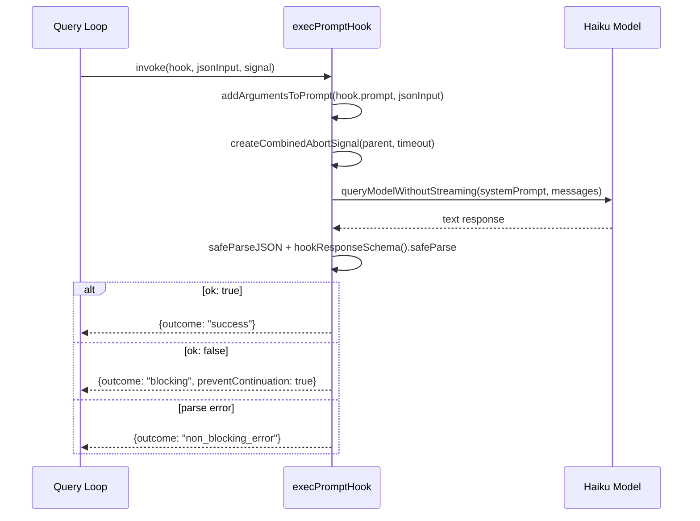
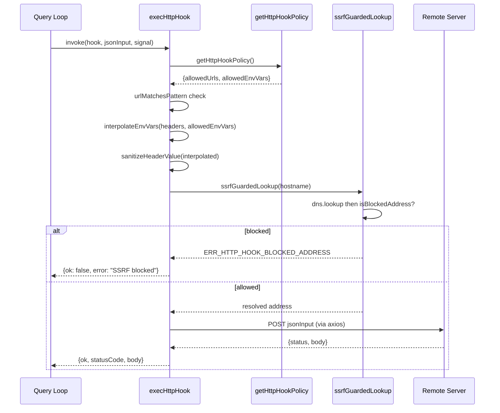

# Hook Execution: Command, Prompt, HTTP, Agent, Function

## Overview

Chapter 36 introduced the hook schema and lifecycle events that define *when* hooks fire. This chapter examines *how* each of the five hook types executes once triggered. The execution path differs dramatically: command hooks spawn a subprocess and parse its exit code; prompt hooks invoke a lightweight LLM call with structured JSON output; HTTP hooks POST JSON to a remote endpoint with SSRF protection; agent hooks launch a full multi-turn subagent query; and function hooks run an in-process TypeScript callback. Despite these differences, all five paths converge on the same `HookResult` type and the same three-outcome model: success, blocking, or non-blocking error.

The hook execution pipeline is the runtime arm of HER Pattern 12 (Deterministic Lifecycle Hooks). Where the schema defines the contract, the exec modules enforce it. Each execution path must handle timeouts, abort signals, and error isolation so that a misbehaving hook cannot crash the main agent loop. This is a critical invariant for a long-running agent: hooks are user-configured extensions, and the harness must guarantee that a broken or malicious hook cannot compromise the agent's core loop.

The five execution paths also represent a progression in complexity and capability. Command hooks are the simplest and most deterministic -- they spawn a process and parse its exit code. Prompt hooks introduce nondeterminism by delegating the decision to an LLM, but they constrain the output via structured JSON schemas. HTTP hooks add network I/O and the full spectrum of SSRF, header injection, and secrets exfiltration risks. Agent hooks are the most powerful: they give the hook a full tool-using agent that can inspect the codebase, read files, and verify complex conditions. Function hooks trade persistence for speed: they run in-process TypeScript callbacks that can access shared state but cannot survive a restart.

## Data structures and contracts

The central contract is the `HookResult` type returned by every execution function. It captures the three possible outcomes and the data each outcome carries. The `outcome` field is the discriminating key: `success` means the hook passed, `blocking` means the hook explicitly denied the action, `non_blocking_error` means the hook failed but the action should proceed, and `cancelled` means the hook was aborted (typically due to timeout or user cancellation).

```typescript
// src/utils/hooks.ts:L338 — HookResult interface
export interface HookResult {
  message?: HookResultMessage
  systemMessage?: string
  blockingError?: HookBlockingError
  outcome: 'success' | 'blocking' | 'non_blocking_error' | 'cancelled'
  preventContinuation?: boolean
  stopReason?: string
  permissionBehavior?: 'ask' | 'deny' | 'allow' | 'passthrough'
  hookPermissionDecisionReason?: string
  additionalContext?: string
  initialUserMessage?: string
  updatedInput?: Record<string, unknown>
  updatedMCPToolOutput?: unknown
  permissionRequestResult?: PermissionRequestResult
  elicitationResponse?: ElicitationResponse
  watchPaths?: string[]
  hook: HookCommand | HookCallback | FunctionHook
}

// src/utils/hooks.ts:L359 — AggregatedHookResult type
export type AggregatedHookResult = {
  message?: HookResultMessage
  blockingError?: HookBlockingError
  preventContinuation?: boolean
  stopReason?: string
  hookPermissionDecisionReason?: string
  hookSource?: string
  permissionBehavior?: PermissionResult['behavior']
  additionalContexts?: string[]
  initialUserMessage?: string
  updatedInput?: Record<string, unknown>
  // ... additional fields for combining results from multiple hooks
}
```

The `blockingError` field is populated only when `outcome === 'blocking'`. It carries the human-readable reason and the command that triggered the block. The `preventContinuation` flag is set to `true` when the hook determines that the agent must stop the current action entirely -- for example, a `PreToolUse` prompt hook that detects a policy violation. The `stopReason` field provides additional context for why the agent was stopped.

The `FunctionHook` type extends the contract for in-process callbacks. It is session-scoped only and cannot be persisted to `settings.json`, which makes it fundamentally different from command, prompt, HTTP, and agent hooks that are configured declaratively and survive restarts.

```typescript
// src/utils/hooks/sessionHooks.ts:L15-L31 — Function hook type
export type FunctionHookCallback = (
  messages: Message[],
  signal?: AbortSignal,
) => boolean | Promise<boolean>

export type FunctionHook = {
  type: 'function'
  id?: string
  timeout?: number
  callback: FunctionHookCallback
  errorMessage: string
  statusMessage?: string
}
```

The `FunctionHookCallback` signature is deliberately simple: it receives the current message array and an optional abort signal, and returns a boolean. This minimal interface makes function hooks easy to implement but limits their capability -- they cannot produce attachment messages or structured error reports like the other hook types can. The `errorMessage` and `statusMessage` fields on `FunctionHook` provide static text for UI display when the callback returns `false`.

The `SessionHooksState` uses a `Map` rather than a `Record` for a critical performance reason under high concurrency. This choice was made after a real-world performance problem was identified with parallel schema-mode agents.

```typescript
// src/utils/hooks/sessionHooks.ts:L49-L62 — Map-based session hooks state
export type SessionHooksState = Map<string, SessionStore>
// Map (not Record) so .set/.delete don't change the container's identity.
// Mutator functions mutate the Map and return prev unchanged, letting
// store.ts's Object.is(next, prev) check short-circuit and skip listener
// notification. Session hooks are ephemeral per-agent runtime callbacks,
// never reactively read (only getAppState() snapshots in the query loop).
// Same pattern as agentControllers on LocalWorkflowTaskState.
//
// This matters under high-concurrency workflows: parallel() with N
// schema-mode agents fires N addFunctionHook calls in one synchronous
// tick. With a Record + spread, each call cost O(N) to copy the growing
// map (O(N^2) total) plus fired all ~30 store listeners. With Map: .set()
// is O(1), return prev means zero listener fires.
```

The `HookExecutionEvent` type powers the real-time event system that broadcasts hook progress to SDK consumers and the UI. Three event types cover the full lifecycle: `started` (when a hook begins execution), `progress` (periodic updates during long-running hooks), and `response` (the final result).

```typescript
// src/utils/hooks/hookEvents.ts:L22-L55 — Event types
export type HookStartedEvent = {
  type: 'started'
  hookId: string
  hookName: string
  hookEvent: string
}

export type HookProgressEvent = {
  type: 'progress'
  hookId: string
  hookName: string
  hookEvent: string
  stdout: string
  stderr: string
  output: string
}

export type HookResponseEvent = {
  type: 'response'
  hookId: string
  hookName: string
  hookEvent: string
  output: string
  stdout: string
  stderr: string
  exitCode?: number
  outcome: 'success' | 'error' | 'cancelled'
}
```

The event system uses a buffering strategy: when no handler is registered, events accumulate in a `pendingEvents` array (capped at `MAX_PENDING_EVENTS = 100`, oldest discarded on overflow). When a handler registers later, the buffer is drained. This ensures that events emitted before the UI or SDK is ready are not lost.

## Control flow

### Command hook execution

Command hooks are the original and simplest hook type. The main `hooks.ts` module spawns a child process with the hook's shell command, pipes stdin (the JSON-serialized hook input), and reads stdout/stderr. The process exit code maps directly to the three-outcome model: exit 0 is success, exit 2 is blocking, and any other non-zero exit is a non-blocking error. The `TOOL_HOOK_EXECUTION_TIMEOUT_MS` constant (10 minutes) guards against hung commands, enforced via `createCombinedAbortSignal` which combines the parent abort signal with a timeout signal.

The command hook path also supports async hooks via the `AsyncHookJSONOutput` schema. When a command hook returns JSON on stdout with `{"decision": "approve", "reason": "..."}` and an `async: true` flag, the hook result is processed as an async response. Async hooks are used for long-running background checks (like running a test suite) that should not block the agent's turn.

The `executeInBackground` function handles the async dispatch: it spawns the subprocess, reads stdout incrementally, and re-awakens the agent when the hook completes. The `registerPendingAsyncHook` function in `AsyncHookRegistry.ts` tracks in-flight async hooks so that the agent knows to wait for their results before finalizing a turn.

### Async hook registry

The async hook registry in `src/utils/hooks/AsyncHookRegistry.ts` manages the lifecycle of in-flight async command hooks. Unlike synchronous command hooks that block the agent's turn until the subprocess exits, async hooks return an interim `{"decision": "approve", "async": true}` response and continue running in the background. The registry tracks these hooks so that the agent can check for completed results between turns.

The registry is a module-scoped `Map<string, PendingAsyncHook>` keyed by `processId`. Each entry records the hook's identity (`hookId`, `hookName`, `hookEvent`), timing (`startTime`, `timeout`), the `ShellCommand` object for I/O access, and a `responseAttachmentSent` flag that prevents duplicate delivery of results.

```typescript
// src/utils/hooks/AsyncHookRegistry.ts:L12-L25 — PendingAsyncHook type
export type PendingAsyncHook = {
  processId: string
  hookId: string
  hookName: string
  hookEvent: HookEvent | 'StatusLine' | 'FileSuggestion'
  toolName?: string
  pluginId?: string
  startTime: number
  timeout: number
  command: string
  responseAttachmentSent: boolean
  shellCommand?: ShellCommand
  stopProgressInterval: () => void
}
```

The `registerPendingAsyncHook` function is called when a command hook produces an async response. It creates a `PendingAsyncHook` entry with a default timeout of 15 seconds (overridable via `asyncTimeout` in the hook's JSON output), starts a progress interval for event broadcasting, and inserts the entry into the Map. The `stopProgressInterval` callback is stored on the entry so it can be cleaned up when the hook completes or is cancelled.

The `checkForAsyncHookResponses` function is the polling mechanism that the query loop calls between turns. It snapshots all pending hooks, then uses `Promise.allSettled` to check each one concurrently. For each hook, it inspects the `ShellCommand.status`: if `completed`, it parses stdout for the first JSON line that does not contain an `async` field (the final sync response), marks `responseAttachmentSent`, emits a `HookResponseEvent` via `finalizeHook`, and returns the parsed result. If `killed`, it cleans up and removes the entry. If still running, it skips. The `allSettled` pattern isolates failures: one throwing callback does not orphan side effects (like `responseAttachmentSent` or `finalizeHook`) from other hooks in the same batch.

A subtle but important interaction: when a `SessionStart` async hook completes, the registry calls `invalidateSessionEnvCache()`. This is because `SessionStart` hooks often modify the environment (e.g., setting up PATH entries or activating virtual environments), and the session environment cache must be refreshed so that subsequent tool calls see the updated state. The `sessionStartCompleted` flag is tracked across the `allSettled` results to trigger this invalidation once per batch.

The `finalizePendingAsyncHooks` function is the shutdown path. Called when the session ends, it iterates all remaining hooks: completed ones are finalized normally, while still-running ones are killed and finalized with outcome `cancelled`. The registry is then cleared. The `removeDeliveredAsyncHooks` function removes entries that have already been marked as delivered (`responseAttachmentSent === true`), used by the dispatch layer after results have been processed into hook outcomes.

### Prompt hook execution

Prompt hooks invoke a lightweight LLM call rather than a subprocess. The `execPromptHook` function in `src/utils/hooks/execPromptHook.ts` constructs a system prompt that instructs the model to return JSON matching `{ok: boolean, reason?: string}`. It uses `queryModelWithoutStreaming` with a small fast model (typically Haiku) and disables thinking to minimize latency and cost.

The prompt template is constructed via `addArgumentsToPrompt`, which replaces `$ARGUMENTS` placeholders in the hook's `prompt` field with the JSON-serialized hook input. This allows prompt hooks to reference the specific tool name, file path, or other context from the triggering event.

```typescript
// src/utils/hooks/execPromptHook.ts:L55-L100 — Model query with structured output
const hookTimeoutMs = hook.timeout ? hook.timeout * 1000 : 30000
const { signal: combinedSignal, cleanup: cleanupSignal } =
  createCombinedAbortSignal(signal, { timeoutMs: hookTimeoutMs })

const response = await queryModelWithoutStreaming({
  messages: messagesToQuery,
  systemPrompt: asSystemPrompt([
    `You are evaluating a hook in Claude Code.

Your response must be a JSON object matching one of the following schemas:
1. If the condition is met, return: {"ok": true}
2. If the condition is not met, return: {"ok": false, "reason": "Reason for why it is not met"}`,
  ]),
  thinkingConfig: { type: 'disabled' as const },
  tools: toolUseContext.options.tools,
  signal: combinedSignal,
  options: {
    async getToolPermissionContext() {
      const appState = toolUseContext.getAppState()
      return appState.toolPermissionContext
    },
    model: hook.model ?? getSmallFastModel(),
    toolChoice: undefined,
    isNonInteractiveSession: true,
    hasAppendSystemPrompt: false,
    agents: [],
    querySource: 'hook_prompt',
    mcpTools: [],
    agentId: toolUseContext.agentId,
    outputFormat: {
      type: 'json_schema',
      schema: {
        type: 'object',
        properties: { ok: { type: 'boolean' }, reason: { type: 'string' } },
        required: ['ok'],
        additionalProperties: false,
      },
    },
  },
})
```

The `outputFormat` field uses the Anthropic API's `json_schema` mode to force the model's output to conform to the expected schema. This is more reliable than prompting for JSON and hoping the model complies -- the API enforces the schema at the token level. The `additionalProperties: false` constraint prevents the model from adding unexpected fields.

The response is validated against `hookResponseSchema()` via Zod. If the model returns `{ok: false}`, the hook outcome is `blocking` with `preventContinuation: true`. If the response fails JSON parsing or schema validation, the outcome is `non_blocking_error` -- the agent continues but the user sees a diagnostic attachment with the raw response and the parse error. This is a deliberate design choice: a misconfigured prompt hook (e.g., one that produces free-text output instead of JSON) should not block the agent from working.

The `createCombinedAbortSignal` function merges two abort sources: the parent signal (which fires when the user cancels or the session ends) and a timeout signal (which fires after `hookTimeoutMs`). The timeout defaults to 30 seconds but can be overridden via the hook's `timeout` field in settings. The `cleanup` function returned by `createCombinedAbortSignal` must be called in both the success and error paths to prevent memory leaks from dangling event listeners.



### HTTP hook execution

HTTP hooks POST the hook input JSON to a configured URL. The `execHttpHook` function in `src/utils/hooks/execHttpHook.ts` implements three layers of defense: URL allowlisting, SSRF protection, and environment variable interpolation controls.

The URL allowlist follows the same pattern as the MCP server allowlist: `undefined` means no restriction, an empty array blocks all URLs, and a non-empty array requires a pattern match. The `urlMatchesPattern` function converts glob-style patterns (where `*` matches any characters) into regular expressions.

```typescript
// src/utils/hooks/execHttpHook.ts:L123-L145 — URL allowlist check and SSRF guard
export async function execHttpHook(
  hook: HttpHook, _hookEvent: HookEvent, jsonInput: string, signal?: AbortSignal,
): Promise<{ok: boolean; statusCode?: number; body: string; error?: string; aborted?: boolean}> {
  const policy = getHttpHookPolicy()
  if (policy.allowedUrls !== undefined) {
    const matched = policy.allowedUrls.some(p => urlMatchesPattern(hook.url, p))
    if (!matched) {
      return { ok: false, body: '', error: `HTTP hook blocked: ${hook.url} does not match any pattern in allowedHttpHookUrls` }
    }
  }
  // ... axios.post with lookup: ssrfGuardedLookup
```

The SSRF guard in `src/utils/hooks/ssrfGuard.ts` resolves DNS before connecting and rejects private/link-local addresses. Critically, loopback (127.0.0.0/8, ::1) is intentionally allowed because local dev policy servers are a primary HTTP hook use case. The guard also handles IPv4-mapped IPv6 addresses to prevent bypass via `::ffff:169.254.169.254`.

```typescript
// src/utils/hooks/ssrfGuard.ts:L42-L86 — Address blocking logic
export function isBlockedAddress(address: string): boolean {
  const v = isIP(address)
  if (v === 4) return isBlockedV4(address)
  if (v === 6) return isBlockedV6(address)
  return false
}

function isBlockedV4(address: string): boolean {
  const parts = address.split('.').map(Number)
  const [a, b] = parts
  if (a === 127) return false  // loopback explicitly allowed
  if (a === 0) return true     // 0.0.0.0/8
  if (a === 10) return true    // 10.0.0.0/8 private
  if (a === 169 && b === 254) return true  // link-local, cloud metadata
  if (a === 172 && b >= 16 && b <= 31) return true  // 172.16.0.0/12
  if (a === 100 && b >= 64 && b <= 127) return true  // CGNAT / Alibaba metadata
  if (a === 192 && b === 168) return true  // 192.168.0.0/16
  return false
}
```

The blocked IPv4 ranges deserve explanation. The `0.0.0.0/8` range is the "this network" address. The `10.0.0.0/8`, `172.16.0.0/12`, and `192.168.0.0/16` ranges are RFC 1918 private addresses commonly used in corporate networks. The `169.254.0.0/16` range is link-local, used by cloud metadata endpoints (AWS, GCP, Azure all expose metadata at `169.254.169.254`). The `100.64.0.0/10` range is shared address space (RFC 6598, CGNAT), which some cloud providers use for metadata endpoints -- notably Alibaba Cloud at `100.100.100.200`.

The `ssrfGuardedLookup` function integrates with axios's `lookup` option. When axios resolves a hostname, it calls this function instead of the default `dns.lookup`. The function resolves DNS first, validates the resulting IP addresses, and then returns them to axios for connection. This eliminates the TOCTOU window between DNS resolution and connection that exists in naive SSRF guards that validate the hostname but not the resolved IP.

Environment variable interpolation in HTTP hook headers is restricted to variables explicitly listed in `allowedEnvVars`. This prevents project-configured hooks from exfiltrating secrets via `$AWS_SECRET_ACCESS_KEY` in a header value. The `interpolateEnvVars` function replaces `$VAR_NAME` and `${VAR_NAME}` patterns with values from `process.env`, but only for variables present in the allowlist. Variables not in the allowlist are replaced with empty strings, and a warning is logged. The `sanitizeHeaderValue` function strips CR/LF/NUL bytes to prevent CRLF header injection via malicious environment variable values.

The timeout for HTTP hooks defaults to `DEFAULT_HTTP_HOOK_TIMEOUT_MS` (10 minutes), matching the tool hook timeout. This generous default accommodates slow policy servers that may queue requests. The hook can specify a custom timeout in seconds via the `timeout` field.



### Agent hook execution

Agent hooks are the most complex execution path. The `execAgentHook` function in `src/utils/hooks/execAgentHook.ts` launches a full multi-turn LLM query using the `query()` async generator. The agent can use tools (filtered to exclude `ALL_AGENT_DISALLOWED_TOOLS` and duplicate `StructuredOutputTool` instances) to inspect the codebase and verify a condition. It must return its result via a `StructuredOutputTool` call.

The agent hook is primarily used for stop hooks -- verification that the agent has actually completed its assigned task before the session ends. This is a critical quality gate in long-running autonomous sessions where the model might claim to be done prematurely.

```typescript
// src/utils/hooks/execAgentHook.ts:L87-L121 — Agent setup
const structuredOutputTool = createStructuredOutputTool()
const filteredTools = toolUseContext.options.tools.filter(
  tool => !toolMatchesName(tool, SYNTHETIC_OUTPUT_TOOL_NAME),
)
const tools: Tool[] = [
  ...filteredTools.filter(
    tool => !ALL_AGENT_DISALLOWED_TOOLS.has(tool.name),
  ),
  structuredOutputTool,
]

const systemPrompt = asSystemPrompt([
  `You are verifying a stop condition in Claude Code. Your task is to verify that the agent completed the given plan. The conversation transcript is available at: ${transcriptPath}
You can read this file to analyze the conversation history if needed.

Use the available tools to inspect the codebase and verify the condition.
Use as few steps as possible - be efficient and direct.

When done, return your result using the ${SYNTHETIC_OUTPUT_TOOL_NAME} tool with:
- ok: true if the condition is met
- ok: false with reason if the condition is not met`,
])

const model = hook.model ?? getSmallFastModel()
const MAX_AGENT_TURNS = 50

// Create unique agentId for this hook agent
const hookAgentId = asAgentId(`hook-agent-${randomUUID()}`)

// Create a modified toolUseContext for the agent
const agentToolUseContext: ToolUseContext = {
  ...toolUseContext,
  agentId: hookAgentId,
  abortController: hookAbortController,
  options: {
```

The tool filtering serves two purposes. First, `ALL_AGENT_DISALLOWED_TOOLS` excludes tools that would allow the verification agent to spawn subagents, enter plan mode, or otherwise escalate its privileges. A stop-hook agent should verify, not act. Second, removing existing `StructuredOutputTool` instances prevents conflicts with the one created specifically for this hook.

The agent runs inside a `for await` loop over `query()`. Each assistant turn increments a counter; if it reaches `MAX_AGENT_TURNS` (50), the agent is aborted and the hook returns `cancelled`. A `registerStructuredOutputEnforcement` session hook ensures the agent calls the structured output tool rather than free-texting a response. This enforcement hook is registered before the query loop starts and cleaned up afterward via `clearSessionHooks`.

The agent hook creates its own `AbortController` and combines it with the parent signal via `createCombinedAbortSignal`. The combined signal is used for the entire multi-turn query, with a default timeout of 60 seconds (twice the prompt hook timeout). The agent's `toolUseContext` is modified to run in `dontAsk` permission mode with an additional session rule allowing the agent to read the transcript file without prompting.

The analytics events `tengu_agent_stop_hook_success`, `tengu_agent_stop_hook_max_turns`, and `tengu_agent_stop_hook_error` track the agent hook's performance and failure modes. The `durationMs` and `turnCount` fields provide observability into how long verification takes and whether agents are hitting the turn limit.

### Function hook execution

Function hooks are the simplest path: an in-process TypeScript callback. The `FunctionHookCallback` type takes a `messages` array and an optional `AbortSignal`, returning a boolean synchronously or via Promise. True means the condition passes; false means block. Function hooks are registered via `addFunctionHook` in `sessionHooks.ts` and live only in memory -- they cannot be persisted to `settings.json`.

The primary use case for function hooks is programmatic enforcement of conditions that would be difficult or unreliable to express as shell commands or LLM prompts. For example, `registerStructuredOutputEnforcement` (used by agent hooks) registers a `PostToolUse` function hook that checks whether the agent has called the `StructuredOutputTool` and, if not, blocks the response and prompts the agent to use it.

The session hook registry uses a `Map<string, SessionStore>` keyed by session ID. This Map-based design avoids O(N^2) listener notification under high concurrency: when `N` parallel schema-mode agents each call `addFunctionHook` in one synchronous tick, `Map.set()` is O(1) and returns the previous state object unchanged, causing `Object.is(next, prev)` checks to short-circuit. The comment in `sessionHooks.ts` documents the performance analysis that led to this choice: with a `Record` + spread approach, each mutation cost O(N) to copy the growing map (O(N^2) total across N agents) plus fired all approximately 30 store listeners.

Function hooks can be removed by ID via `removeFunctionHook`, which filters the hook array within each matcher and removes empty matchers. The `clearSessionHooks` function deletes the entire session entry from the Map.

### Skill hook registration

The `registerSkillHooks` function in `src/utils/hooks/registerSkillHooks.ts` bridges skill frontmatter and the session hook registry. When a skill with hooks in its frontmatter is invoked, `registerSkillHooks` iterates over all hook events and matchers, calling `addSessionHook` for each. Skills with `once: true` hooks get an `onHookSuccess` callback that removes the hook after its first successful execution.

```typescript
// src/utils/hooks/registerSkillHooks.ts:L20-L63 — Skill hook registration
export function registerSkillHooks(
  setAppState, sessionId, hooks, skillName, skillRoot?,
): void {
  let registeredCount = 0
  for (const eventName of HOOK_EVENTS) {
    const matchers = hooks[eventName]
    if (!matchers) continue
    for (const matcher of matchers) {
      for (const hook of matcher.hooks) {
        const onHookSuccess = hook.once
          ? () => { removeSessionHook(setAppState, sessionId, eventName, hook) }
          : undefined
        addSessionHook(setAppState, sessionId, eventName, matcher.matcher || '', hook, onHookSuccess, skillRoot)
        registeredCount++
      }
    }
  }
}
```

The `skillRoot` parameter is passed through to `addSessionHook` so that the hook's `CLAUDE_PLUGIN_ROOT` environment variable can be set to the skill's base directory. This allows skill hooks to reference scripts and data files relative to the skill's location.

### Hook event broadcasting

The `hookEvents.ts` module provides a lightweight pub/sub system for hook execution events. Handlers register via `registerHookEventHandler` and receive `HookStartedEvent`, `HookProgressEvent`, and `HookResponseEvent` objects. Events are buffered up to `MAX_PENDING_EVENTS` (100) when no handler is registered yet, then drained when one registers.

The `shouldEmit` function gates which events are broadcast. `SessionStart` and `Setup` are always emitted (listed in `ALWAYS_EMITTED_HOOK_EVENTS`). All other events require `allHookEventsEnabled`, which is set by the SDK `includeHookEvents` option or when running in `CLAUDE_CODE_REMOTE` mode. This gating prevents high-frequency hook events from flooding the event system when no consumer is interested.

The `startHookProgressInterval` function provides periodic progress updates for long-running hooks. It polls the hook's output at a configurable interval (default 1 second) and emits a `HookProgressEvent` only when the output has changed. The interval is created with `setInterval` and its `unref()` method is called to prevent it from keeping the Node.js event loop alive. This is a significant design consideration for daemon-mode agents: without `unref()`, a long-running hook with a progress interval would prevent the process from exiting even after all work is complete.

The event system's design reflects a lesson learned from earlier versions of the hook infrastructure. Initially, hook events were emitted directly from the subprocess handling code, which meant that events fired before any consumer could register a handler. The buffering strategy with `pendingEvents` was introduced to solve this bootstrap problem. The cap of 100 pending events prevents unbounded memory growth if a consumer never registers (e.g., when running in a non-interactive mode where no UI is present).

The relationship between the event system and the async hook registry is worth noting. When `registerPendingAsyncHook` is called, it invokes `startHookProgressInterval` to begin emitting progress events for the background hook. When the hook completes and `finalizeHook` is called, it emits a `HookResponseEvent` as the final event for that hook's lifecycle. This means the event system serves as the unified notification channel for both synchronous and asynchronous hook results, allowing SDK consumers to observe hook progress without needing to know whether the hook is sync or async.

## Edge cases and failure modes

**Prompt hook JSON validation failure.** If the model returns malformed JSON or a response that does not match `hookResponseSchema`, the hook returns `non_blocking_error`. The agent continues, but a diagnostic attachment is created with the raw response and the parse error details. This is a deliberate design choice: a broken hook should not block the agent from working. The diagnostic attachment includes the hook name, the event that triggered it, the stderr field set to "JSON validation failed" or "Schema validation failed", and the stdout field set to the raw response text.

**HTTP hook SSRF bypass via IPv6-mapped IPv4.** The `extractMappedIPv4` function in `ssrfGuard.ts` handles the case where an attacker specifies `::ffff:169.254.169.254` to reach cloud metadata. The function expands the IPv6 address into 8 hextets, checks the IPv4-mapped prefix (80 zero bits + 0xffff), and delegates to the IPv4 blocker. Without this check, hex-form mapped addresses would bypass the v4 guard entirely. The `expandIPv6Groups` helper handles all valid IPv6 representations -- compressed (`::`), expanded, and trailing dotted-decimal -- so that the prefix check works regardless of how the address is formatted.

**Agent hook hitting the turn limit.** If an agent hook reaches `MAX_AGENT_TURNS` (50) without calling `StructuredOutputTool`, the hook returns `cancelled` with no UI message. The analytics event `tengu_agent_stop_hook_max_turns` is emitted for observability, including `durationMs` and `turnCount`. This prevents a runaway verification agent from consuming resources indefinitely. The `cancelled` outcome (as opposed to `blocking`) means the agent is not prevented from stopping -- the verification was inconclusive, not negative.

**Function hook identity semantics.** Because `SessionHooksState` uses a `Map` and mutators return the previous `AppState` object unchanged, concurrent `addFunctionHook` calls from parallel agents do not trigger reactive store listeners. This is a performance-critical design choice: with `N` parallel agents, `Record` + spread would cost O(N^2) listener notifications versus zero with `Map`. The `isHookEqual` function in `hooksSettings.ts` is used when removing hooks to match by value rather than by reference, ensuring that the hook object stored in the matcher can be compared with the one passed to `removeSessionHook`.

**HTTP hook proxy interaction.** When a global proxy (HTTP_PROXY/HTTPS_PROXY) or sandbox network proxy is active, the SSRF guard is skipped because the proxy performs DNS resolution. Applying the guard would validate the proxy's own IP instead of the target, breaking connections to corporate proxies on private networks. The `envProxyActive` flag is computed by checking `getProxyUrl()` and `shouldBypassProxy(hook.url)`. When any proxy is active, the `lookup` option in the axios request config is set to `undefined`, which allows axios to use its default DNS resolution.

**HTTP hook CRLF injection via environment variables.** The `sanitizeHeaderValue` function strips `\r`, `\n`, and `\x00` bytes from interpolated header values. Without this, a malicious environment variable like `TOKEN="value\r\nX-Evil: injected-header"` would inject a second header into the HTTP request. The regex `[\r\n\x00]` covers all three problematic byte sequences.

**HTTP hook environment variable exfiltration.** The `interpolateEnvVars` function only resolves variables present in the `allowedEnvVars` set. Variables not in the set are replaced with empty strings, and a debug warning is logged. This prevents a project-configured HTTP hook from reading `AWS_SECRET_ACCESS_KEY` or other sensitive environment variables and sending them to an external server in a header. The allowlist is the intersection of the hook's declared `allowedEnvVars` and the policy-level `httpHookAllowedEnvVars`, so enterprise administrators can further restrict which variables are available.

## Where cc diverges from the published pattern

HER Pattern 12 describes deterministic lifecycle hooks as shell commands at defined lifecycle points. CC's implementation goes substantially further:

1. **Multiple execution modes.** The pattern describes command hooks only. CC adds prompt (LLM-evaluated), HTTP (remote webhook), agent (multi-turn verification), and function (in-process callback) types. This gives hooks far more expressive power but also increases the attack surface. Each new execution mode introduces new failure modes and security considerations that the pattern does not address.

2. **SSRF defense for HTTP hooks.** The pattern does not address network-level security for hooks. CC's `ssrfGuard.ts` implements DNS-level SSRF protection with IPv6-mapped IPv4 handling and CGNAT range blocking. This is a defense-in-depth measure against supply chain attacks via project-configured hooks (HER Section 12.4). The CGNAT range blocking (100.64.0.0/10) is particularly important because some cloud providers (notably Alibaba Cloud) use this range for metadata endpoints, which attackers could target to steal cloud credentials.

3. **Environment variable interpolation controls.** HTTP hook headers support `$VAR_NAME` interpolation, but only for variables in an explicit allowlist. This prevents secrets exfiltration via project-configured hooks, addressing HER's supply chain attack vector. The intersection of the hook's declared allowlist and the policy-level allowlist provides a two-tier restriction model.

4. **Function hooks as in-process callbacks.** No other harness in the comparison table (Cursor, Devin) exposes an in-process hook API. Function hooks enable features like `registerStructuredOutputEnforcement` that would be impossible or impractical as subprocess commands. The tradeoff is that function hooks cannot be persisted to `settings.json` and are lost on session restart.

5. **Session-scoped hook registry.** The `SessionHooksState` Map provides per-session hook isolation and O(1) concurrent mutation. This is an implementation optimization not described in the pattern literature but essential for multi-agent parallelism. The Map-based design was chosen after a real performance problem was identified with parallel schema-mode agents.

6. **Event broadcasting for SDK consumers.** The `hookEvents.ts` module provides a real-time event stream for hook execution. This is not described in the pattern but is essential for IDE integrations and SDK consumers that need to display hook progress in their own UI.

7. **Async hook registry for background verification.** The pattern describes hooks as synchronous gates: the agent waits for the hook result before proceeding. CC's `AsyncHookRegistry` introduces an async mode where command hooks can return an interim approval and continue running in the background. The registry tracks in-flight hooks, polls for completion between agent turns, and delivers results when the background process finishes. This is essential for hooks that perform expensive checks (e.g., running a full test suite as a `PostToolUse` gate) that would otherwise block the agent for minutes. The tradeoff is that the agent proceeds before the hook has fully verified the action, which means a late-blocking result may need to interrupt a subsequent turn. The `SessionStart` hook special case (where completion triggers `invalidateSessionEnvCache()`) demonstrates how async hooks can have side effects that go beyond simple approval/denial.

## Developer takeaways for building a long-running agent

1. **Converge on a unified result type.** All five hook execution paths return the same `HookResult` shape. This lets the dispatch layer in `hooks.ts` handle outcomes uniformly regardless of hook type. If you add a new hook type, implement the same return contract. The `outcome` field should be an enum, not a boolean, to distinguish between "failed" and "explicitly blocked."

2. **Isolate failures to non-blocking errors by default.** CC's design philosophy is that a broken hook should not crash or block the agent. The `non_blocking_error` outcome preserves forward progress while surfacing diagnostics. Reserve `blocking` for intentional gate-keeping (e.g., prompt hooks that enforce policies). The `cancelled` outcome should be used when the hook was interrupted by an external event (timeout, user cancellation), not when the hook produced a negative result.

3. **Guard network-facing hooks with SSRF protection.** Any hook type that makes outbound network requests (HTTP now, perhaps gRPC later) must validate resolved IP addresses before connecting. Loopback should be explicitly allowed for local dev use cases. IPv4-mapped IPv6 addresses must be handled to prevent bypass. The `ssrfGuardedLookup` function's approach of intercepting DNS resolution at the axios level eliminates the TOCTOU window.

4. **Use Map-based state for concurrent mutation.** When multiple agents can register hooks in the same tick, `Map.set()` + return-prev-unchanged avoids O(N^2) reactive listener notifications. This pattern applies broadly to any store where ephemeral, session-scoped state is mutated from parallel contexts. The key insight is that `Object.is(next, prev)` checks in reactive stores can be leveraged to skip notification when the store's identity has not changed.

5. **Cap agent hook turns.** Multi-turn verification agents must have a hard turn limit. CC uses 50 turns, which is generous for verification but finite. Without a cap, a misconfigured or adversarial agent hook could run indefinitely, consuming API credits and blocking the user's session. The `cancelled` outcome (rather than `blocking`) ensures that a timeout does not prevent the agent from completing its task.

6. **Treat skill-provided hooks as untrusted.** The `registerSkillHooks` function registers hooks from skill frontmatter into the session registry. Skills are user-provided and potentially malicious (HER Section 12.4). The `once: true` mechanism auto-removes one-shot hooks after execution, reducing the window for abuse. Enterprise deployments should use `allowManagedHooksOnly` to restrict hook registration to admin-defined sources.

7. **Support async hooks for long-running checks.** Not every hook can complete in milliseconds. A `PostToolUse` hook that runs a test suite or a `PreToolUse` hook that queries a remote policy server may take minutes. Without an async path, the agent would block, consuming no resources but also making no progress. The async hook registry pattern -- interim approval, background execution, between-turn polling -- allows the agent to continue while the check runs. The key invariant is that the registry must handle shutdown cleanly: `finalizePendingAsyncHooks` kills running processes and delivers `cancelled` outcomes so that no orphaned subprocesses survive session end.
