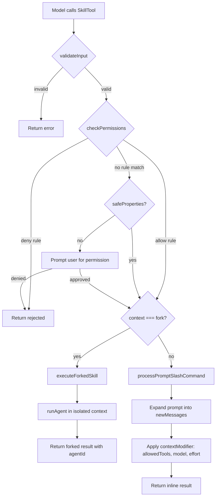
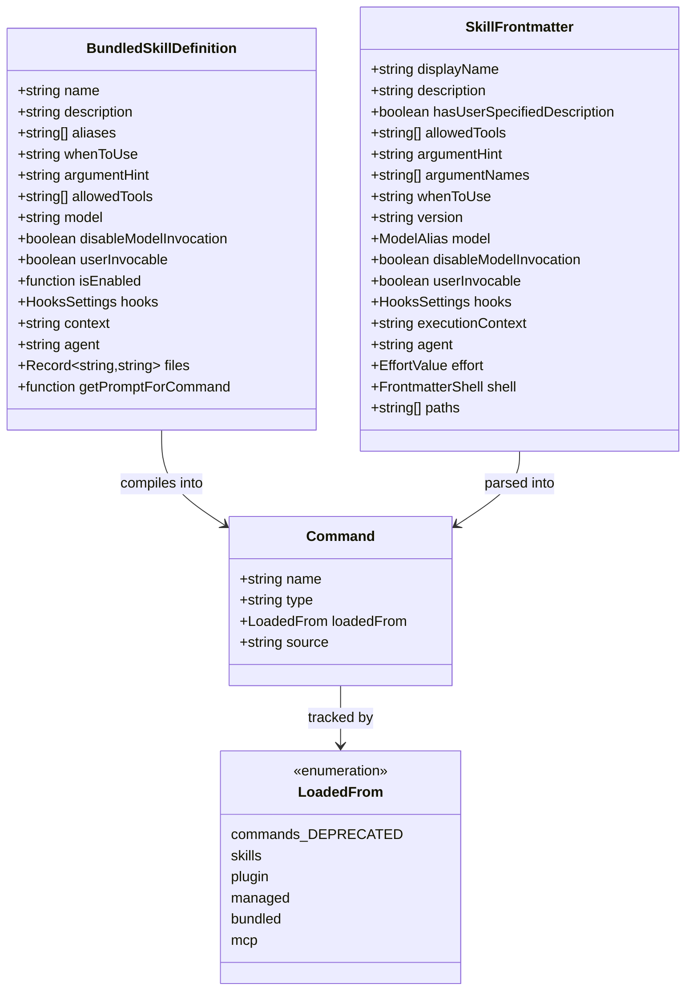
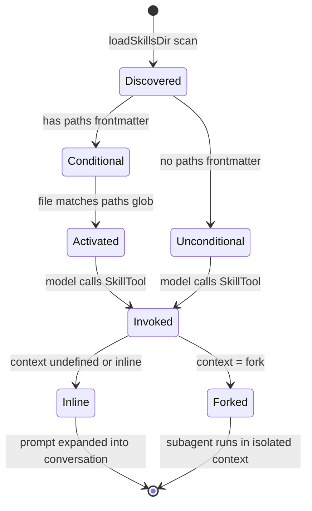
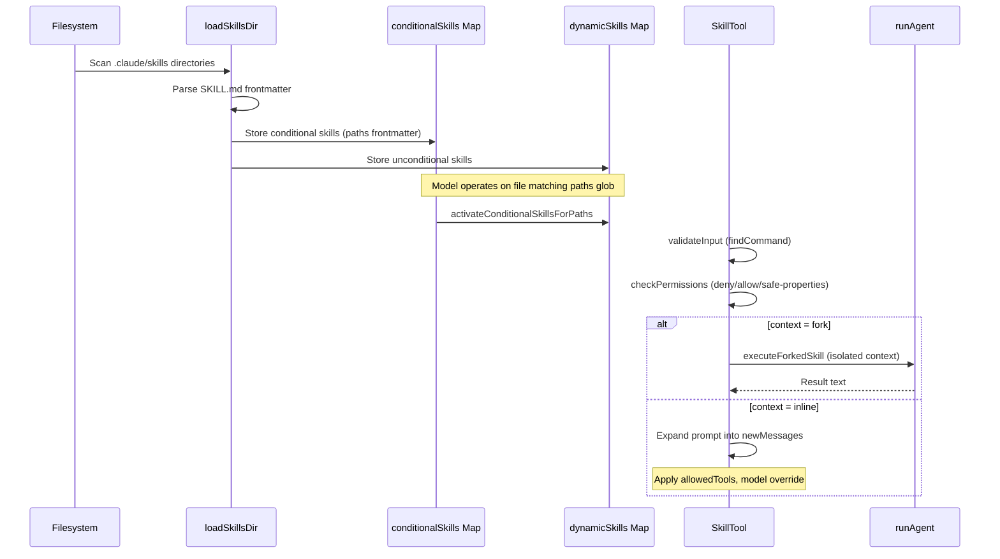

# Skills: Discovery, Frontmatter, Progressive Disclosure

## Overview

Skills are the primary mechanism by which cc extends its capabilities at runtime without modifying the core codebase. A skill is a Markdown file (SKILL.md) with YAML frontmatter that defines metadata (name, description, allowed tools, model override, hooks) and a body that becomes the prompt injected into the conversation when the skill is invoked. Skills are discovered from multiple directory sources, loaded with precedence rules, and surfaced to the model via the `SkillTool` -- which itself implements HER Pattern 9 (Progressive Tool Expansion) by exposing only frontmatter metadata in the tool listing and loading full content lazily on invocation.

This chapter traces the full lifecycle: how skills are discovered from disk and MCP servers, how frontmatter fields are parsed and validated, how conditional skills activate on path patterns, and how the `SkillTool` dispatches inline versus forked execution. The security implications of treating skills as untrusted input (HER Section 12.4) are woven throughout, with particular attention to the safe-properties auto-allow system and the MCP skill shell-execution bypass.

## Data structures and contracts

The central type is the `Command` union, of which `PromptCommand` is the variant used for skills. The `BundledSkillDefinition` type defines the contract for skills compiled into the CLI binary.

```typescript
// src/skills/bundledSkills.ts:L15-L41 — Bundled skill definition
export type BundledSkillDefinition = {
  name: string
  description: string
  aliases?: string[]
  whenToUse?: string
  argumentHint?: string
  allowedTools?: string[]
  model?: string
  disableModelInvocation?: boolean
  userInvocable?: boolean
  isEnabled?: () => boolean
  hooks?: HooksSettings
  context?: 'inline' | 'fork'
  agent?: string
  files?: Record<string, string>
  getPromptForCommand: (
    args: string,
    context: ToolUseContext,
  ) => Promise<ContentBlockParam[]>
}
```

Each `BundledSkillDefinition` field maps directly to a `Command` property. The `files` field is unique to bundled skills: it declares reference files that are extracted to disk on first invocation, giving the skill's prompt access to supplementary data (configuration templates, schema definitions, reference implementations) that would be too large to embed in the prompt itself. The `getPromptForCommand` function is the deferred-content mechanism: it returns the full skill prompt only when invoked, not at registration time.

The `LoadedFrom` type tracks where a skill was discovered, which determines precedence, security treatment, and telemetry.

```typescript
// src/skills/loadSkillsDir.ts:L67-L74 — Skill source tracking
export type LoadedFrom =
  | 'commands_DEPRECATED'
  | 'skills'
  | 'plugin'
  | 'managed'
  | 'bundled'
  | 'mcp'
```

The `LoadedFrom` hierarchy encodes security assumptions. Skills loaded from `'bundled'` are compiled into the binary and implicitly trusted. Skills from `'managed'` come from enterprise policy and are IT-approved. Skills from `'skills'` and `'commands_DEPRECATED'` are user-authored local files -- trusted by the user who created them, but not by the system. Skills from `'mcp'` are remote and inherently untrusted: their markdown content is injected as-is, without processing shell injection commands (HER Section 12.4).

The `parseSkillFrontmatterFields` function parses all shared frontmatter fields and returns a validated object. This is the single source of truth for what a skill can declare.

```typescript
// src/skills/loadSkillsDir.ts:L185-L265 — Frontmatter parsing
export function parseSkillFrontmatterFields(
  frontmatter: FrontmatterData,
  markdownContent: string,
  resolvedName: string,
  descriptionFallbackLabel: 'Skill' | 'Custom command' = 'Skill',
): {
  displayName: string | undefined
  description: string
  hasUserSpecifiedDescription: boolean
  allowedTools: string[]
  argumentHint: string | undefined
  argumentNames: string[]
  whenToUse: string | undefined
  version: string | undefined
  model: ReturnType<typeof parseUserSpecifiedModel> | undefined
  disableModelInvocation: boolean
  userInvocable: boolean
  hooks: HooksSettings | undefined
  executionContext: 'fork' | undefined
  agent: string | undefined
  effort: EffortValue | undefined
  shell: FrontmatterShell | undefined
}
```

The `description` field is special: if the frontmatter does not declare one explicitly, `extractDescriptionFromMarkdown` pulls the first paragraph of the Markdown body as a fallback. The `hasUserSpecifiedDescription` boolean distinguishes these cases, because a skill without an explicit description is excluded from the `SkillTool` listing (the model cannot discover it unless the user types the slash command directly).

The `model` field accepts the special value `'inherit'`, which resolves to `undefined` -- meaning the skill inherits the session's current model rather than overriding it. Any other string is parsed by `parseUserSpecifiedModel`, which validates it against the known model alias table.

The `effort` field allows a skill to pin a reasoning-effort level (`low`, `medium`, `high`, or an integer). When a forked skill declares `effort: high`, the subagent runs with that effort level regardless of the parent session's setting. Invalid effort values are logged and silently ignored, rather than failing the skill load.

## Control flow

### Skill discovery from directories

The `getSkillDirCommands` function (memoized by cwd) is the primary entry point for skill discovery. It loads skills from five sources in parallel: managed (enterprise policy), user (~/.claude/skills), project (.claude/skills in project dirs), additional (--add-dir), and legacy commands directories.

```typescript
// src/skills/loadSkillsDir.ts:L679-L714 — Parallel loading from all sources
const [
  managedSkills,
  userSkills,
  projectSkillsNested,
  additionalSkillsNested,
  legacyCommands,
] = await Promise.all([
  isEnvTruthy(process.env.CLAUDE_CODE_DISABLE_POLICY_SKILLS)
    ? Promise.resolve([])
    : loadSkillsFromSkillsDir(managedSkillsDir, 'policySettings'),
  isSettingSourceEnabled('userSettings') && !skillsLocked
    ? loadSkillsFromSkillsDir(userSkillsDir, 'userSettings')
    : Promise.resolve([]),
  projectSettingsEnabled
    ? Promise.all(projectSkillsDirs.map(dir =>
        loadSkillsFromSkillsDir(dir, 'projectSettings'),
      ))
    : Promise.resolve([]),
  projectSettingsEnabled
    ? Promise.all(additionalDirs.map(dir =>
        loadSkillsFromSkillsDir(join(dir, '.claude', 'skills'), 'projectSettings'),
      ))
    : Promise.resolve([]),
  skillsLocked ? Promise.resolve([]) : loadSkillsFromCommandsDir(cwd),
])
```

Within `loadSkillsFromSkillsDir`, only the directory format is supported: `skill-name/SKILL.md`. Single `.md` files in the `/skills/` directory are ignored. The loader reads the directory entries, filters for directories and symbolic links, then attempts to read `SKILL.md` from each subdirectory. Non-ENOENT errors (permission denied, I/O errors) are logged at `warn` level so that misconfigured skill directories are diagnosable without crashing the load.

The legacy `/commands/` directory still supports both formats. The `transformSkillFiles` function handles the legacy directory's dual format: when a subdirectory contains a `SKILL.md`, that file is used and takes the name of its parent directory; otherwise, each `.md` file becomes a separate command named after the file (minus the `.md` extension). This legacy path is marked `commands_DEPRECATED` in the `LoadedFrom` type and will be removed in a future release.

After loading, skills are deduplicated by resolved file path (using `realpath` to handle symlinks). The deduplication uses `getFileIdentity`, which resolves symlinks to canonical paths. This is filesystem-agnostic and avoids the inode-0 problem on virtual/container/NFS filesystems where `stat.ino` is unreliable.

```typescript
// src/skills/loadSkillsDir.ts:L117-L124 — File identity resolution
async function getFileIdentity(filePath: string): Promise<string | null> {
  try {
    return await realpath(filePath)
  } catch {
    return null
  }
}
```

The first-seen source wins in the precedence order: managed > user > project > additional > legacy. The `seenFileIds` Map tracks which file identities have already been encountered; subsequent encounters log a debug message and skip the duplicate.

### Bare mode and policy locking

The `--bare` CLI flag restricts skill discovery to only `--add-dir` paths, skipping all managed, user, project, and legacy directory walks. This is useful for constrained environments (CI, containers) where only explicitly-specified skills should be loaded. The `isRestrictedToPluginOnly('skills')` check enforces enterprise policy: when the policy is active, no skills are loaded from any source except plugin-provided ones. This is the same policy mechanism that gates CLAUDE.md loading (HER Section 7.2), applied consistently to the skill surface.

### Conditional skill activation

Skills with a `paths` frontmatter field are conditional -- they are not loaded into the model's tool listing at startup. Instead, they are stored in a `conditionalSkills` Map and activated when the model operates on files matching the declared glob patterns.

```typescript
// src/skills/loadSkillsDir.ts:L997-L1058 — Conditional skill activation
export function activateConditionalSkillsForPaths(
  filePaths: string[], cwd: string,
): string[] {
  if (conditionalSkills.size === 0) return []
  const activated: string[] = []
  for (const [name, skill] of conditionalSkills) {
    if (skill.type !== 'prompt' || !skill.paths || skill.paths.length === 0) continue
    const skillIgnore = ignore().add(skill.paths)
    for (const filePath of filePaths) {
      const relativePath = isAbsolute(filePath) ? relative(cwd, filePath) : filePath
      if (skillIgnore.ignores(relativePath)) {
        dynamicSkills.set(name, skill)
        conditionalSkills.delete(name)
        activatedConditionalSkillNames.add(name)
        activated.push(name)
        break
      }
    }
  }
  return activated
}
```

The `paths` frontmatter uses gitignore-style glob patterns, processed by the `ignore` library. The `parseSkillPaths` function strips the `/**` suffix from patterns because the `ignore` library treats a bare directory name as matching both the directory and all its contents. If all patterns reduce to `**` (match-all), the skill is treated as unconditional.

The activation is one-directional: once a conditional skill matches a file, it moves from `conditionalSkills` to `dynamicSkills` and stays there for the rest of the session. The `activatedConditionalSkillNames` set survives cache clears, so that re-loading the skill directory does not re-activate already-activated skills.

The `ignore()` library throws on empty strings, paths with `..`, and absolute paths on Windows. The `activateConditionalSkillsForPaths` function skips these edge cases rather than crashing. Files outside the cwd cannot match cwd-relative patterns.

### Dynamic skill discovery

Beyond the startup scan, cc discovers skills dynamically during file operations. The `discoverSkillDirsForPaths` function walks from the file being operated on upward to the project root, checking for `.claude/skills` directories at each level.

```typescript
// src/skills/loadSkillsDir.ts:L861-L915 — Dynamic skill discovery
export async function discoverSkillDirsForPaths(
  filePaths: string[], cwd: string,
): Promise<string[]> {
  const fs = getFsImplementation()
  const resolvedCwd = cwd.endsWith(pathSep) ? cwd.slice(0, -1) : cwd
  const newDirs: string[] = []

  for (const filePath of filePaths) {
    let currentDir = dirname(filePath)
    while (currentDir.startsWith(resolvedCwd + pathSep)) {
      const skillDir = join(currentDir, '.claude', 'skills')
      if (!dynamicSkillDirs.has(skillDir)) {
        dynamicSkillDirs.add(skillDir)
        try {
          await fs.stat(skillDir)
          if (await isPathGitignored(currentDir, resolvedCwd)) {
            logForDebugging(`[skills] Skipped gitignored skills dir: ${skillDir}`)
            continue
          }
          newDirs.push(skillDir)
        } catch {
          // Directory doesn't exist
        }
      }
      const parent = dirname(currentDir)
      if (parent === currentDir) break
      currentDir = parent
    }
  }

  return newDirs.sort(
    (a, b) => b.split(pathSep).length - a.split(pathSep).length,
  )
}
```

The walk stops at the cwd boundary (not including cwd-level skills, which are already loaded at startup). The `dynamicSkillDirs` Set acts as a negative cache: once a directory path has been checked, it is never checked again, avoiding repeated `stat` calls on every file operation when the directory does not exist (the common case).

The gitignore check prevents `node_modules/pkg/.claude/skills` from loading silently. The `isPathGitignored` function runs `git check-ignore` on the containing directory, which handles nested `.gitignore`, `.git/info/exclude`, and global gitignore rules. Outside a git repository, the check fails open (exit code 128 is treated as "not ignored"), relying on the invocation-time trust dialog as the security boundary.

Newly discovered directories are sorted deepest-first so that skills closer to the file take precedence. The `addSkillDirectories` function loads skills from these directories and merges them into the `dynamicSkills` Map. Because the Map uses skill name as key, deeper paths (processed last) override shallower ones with the same name.

The `skillsLoaded` signal fires after dynamic skill addition, notifying other modules (such as the command cache) to clear their memoized state so the new skills appear in the tool listing.

### SkillTool dispatch: inline vs fork

The `SkillTool` in `src/tools/SkillTool/SkillTool.ts` is the model-facing interface for invoking skills. It validates the skill name, checks permissions, and dispatches either inline or forked execution based on the skill's `context` frontmatter field.

```typescript
// src/tools/SkillTool/SkillTool.ts:L291-L298 — Input schema
export const inputSchema = lazySchema(() =>
  z.object({
    skill: z.string().describe('The skill name. E.g., "commit", "review-pr", or "pdf"'),
    args: z.string().optional().describe('Optional arguments for the skill'),
  }),
)
```

The `validateInput` method normalizes the skill name (stripping a leading `/` if present), looks up the command in the registry, and checks that it is a `type: 'prompt'` command with `disableModelInvocation` set to false. Unknown skills return `errorCode: 2`, disabled skills return `errorCode: 4`, and non-prompt commands return `errorCode: 5`.

The `checkPermissions` method implements a three-tier decision process. First, it checks deny rules from the permission context, which can block specific skills by name or prefix (`review:*` blocks all skills whose name starts with `review`). Second, it checks allow rules. Third, if neither deny nor allow rules match, it applies the safe-properties auto-allow optimization.

```typescript
// src/tools/SkillTool/SkillTool.ts:L525-L538 — Safe-properties auto-allow
if (
  commandObj?.type === 'prompt' &&
  skillHasOnlySafeProperties(commandObj)
) {
  return {
    behavior: 'allow',
    updatedInput: { skill, args },
    decisionReason: undefined,
  }
}
```

The `skillHasOnlySafeProperties` function iterates over all keys of the command object. Properties in the `SAFE_SKILL_PROPERTIES` set (type, progressMessage, contentLength, argNames, model, effort, source, pluginInfo, disableNonInteractive, and a few others) are always safe. Properties not in the set are checked for "meaningful" values: `undefined`, `null`, empty arrays, and empty objects are considered non-meaningful and skipped. Any property with a meaningful value outside the safe set causes the function to return `false`, requiring explicit user permission.

This design ensures that skills declaring `allowedTools` (which could grant dangerous capabilities), `hooks` (which could run arbitrary code), or `shell` (which could execute commands) always require explicit permission. Future properties added to the `Command` type automatically fall into the "requires permission" category because they are not in the safe set, following the principle of default-deny.

For forked execution, the `executeForkedSkill` function prepares an isolated subagent context:

```typescript
// src/tools/SkillTool/SkillTool.ts:L122-L289 — Forked skill execution
async function executeForkedSkill(
  command: Command & { type: 'prompt' },
  commandName: string,
  args: string | undefined,
  context: ToolUseContext,
  canUseTool: CanUseToolFn,
  parentMessage: AssistantMessage,
  onProgress?: ToolCallProgress<Progress>,
): Promise<ToolResult<Output>> {
  const startTime = Date.now()
  const agentId = createAgentId()
  const isBuiltIn = builtInCommandNames().has(commandName)
  const isOfficialSkill = isOfficialMarketplaceSkill(command)
  const isBundled = command.source === 'bundled'
  const forkedSanitizedName =
    isBuiltIn || isBundled || isOfficialSkill ? commandName : 'custom'
  // ... telemetry fields elided for brevity ...
  logEvent('tengu_skill_tool_invocation', {
    command_name: forkedSanitizedName,
    _PROTO_skill_name: commandName,
    execution_context: 'fork',
    invocation_trigger: (queryDepth > 0 ? 'nested-skill' : 'claude-proactive'),
    query_depth: queryDepth,
    ...wasDiscoveredField,
    ...(command.pluginInfo && {
      _PROTO_plugin_name: command.pluginInfo.pluginManifest.name,
      plugin_name: isOfficialSkill
        ? command.pluginInfo.pluginManifest.name : 'third-party',
      plugin_repository: isOfficialSkill
        ? command.pluginInfo.repository : 'third-party',
      ...buildPluginCommandTelemetryFields(command.pluginInfo),
    }),
  })

  const { modifiedGetAppState, baseAgent, promptMessages, skillContent } =
    await prepareForkedCommandContext(command, args || '', context)

  const agentDefinition = command.effort !== undefined
    ? { ...baseAgent, effort: command.effort }
    : baseAgent

  const agentMessages: Message[] = []
  for await (const message of runAgent({
    agentDefinition,
    promptMessages,
    toolUseContext: { ...context, getAppState: modifiedGetAppState },
    canUseTool,
    isAsync: false,
    querySource: 'agent:custom',
    model: command.model as ModelAlias | undefined,
    availableTools: context.options.tools,
    override: { agentId },
  })) {
    agentMessages.push(message)
    // Report progress for tool uses (like AgentTool does)
    if ((message.type === 'assistant' || message.type === 'user') && onProgress) {
      const normalizedNew = normalizeMessages([message])
      for (const m of normalizedNew) {
        const hasToolContent = m.message.content.some(
          c => c.type === 'tool_use' || c.type === 'tool_result',
        )
        if (hasToolContent) {
          onProgress({
            toolUseID: `skill_${parentMessage.message.id}`,
            data: { message: m, type: 'skill_progress', prompt: skillContent, agentId },
          })
        }
      }
    }
  }

  const resultText = extractResultText(agentMessages, 'Skill execution completed')
  agentMessages.length = 0 // Release message memory

  return {
    data: {
      success: true,
      commandName,
      status: 'forked',
      agentId,
      result: resultText,
    },
  }
}
```

The forked path uses `prepareForkedCommandContext` to construct the subagent's state: the `modifiedGetAppState` applies the skill's `allowedTools` and model override to the tool permission context. The subagent runs via `runAgent` with its own token budget and message stream. After completion, `extractResultText` pulls the final text from the agent's message stream, and `clearInvokedSkillsForAgent` releases the skill content from the invoked-skills state to avoid memory leaks.

For inline execution, the skill's prompt content is expanded into new user messages appended to the current conversation. The `contextModifier` function updates the tool permission context to include the skill's `allowedTools` and applies the skill's `model` override. The inline path does not create a new agent; it modifies the current turn's context so that the model sees the skill prompt as additional user input.

### Skill prompt content generation

When `getPromptForCommand` is called (either for inline or forked execution), several transformations are applied to the raw Markdown content:

1. **Base directory prefix.** If the skill has a `skillRoot` (directory on disk), the content is prefixed with `Base directory for this skill: <dir>`. This tells the model that Read/Grep operations should resolve relative paths against the skill's directory, not the project root.

2. **Argument substitution.** `substituteArguments` replaces `$ARGUMENTS` and named argument placeholders (`$1`, `$2`, or named arguments from the frontmatter `arguments` field) with the actual arguments passed to the skill invocation.

3. **Variable interpolation.** `${CLAUDE_SKILL_DIR}` is replaced with the skill's own directory path (backslashes normalized to forward slashes on Windows). `${CLAUDE_SESSION_ID}` is replaced with the current session's ID.

4. **Shell command execution.** For non-MCP skills, `executeShellCommandsInPrompt` processes `!` backtick injection and `shell` frontmatter commands, executing them and substituting their output into the prompt content. The tool permission context is temporarily modified to include the skill's `allowedTools` so that shell commands can invoke approved tools.

```typescript
// src/skills/loadSkillsDir.ts:L372-L396 — MCP skill shell execution bypass
// Security: MCP skills are remote and untrusted — never execute inline
// shell commands (!`...` / ```! ... ```) from their markdown body.
// ${CLAUDE_SKILL_DIR} is meaningless for MCP skills anyway.
if (loadedFrom !== 'mcp') {
  finalContent = await executeShellCommandsInPrompt(
    finalContent,
    { ...toolUseContext, getAppState() { /* modified with allowedTools */ } },
    `/${skillName}`,
    shell,
  )
}
```

The MCP skill bypass is a critical security boundary. MCP servers are remote and potentially malicious. If their skill content contained `!` backtick commands, those commands would execute on the client machine with the user's full permissions. The `loadedFrom !== 'mcp'` check prevents this entirely.

### Bundled skill extraction

Bundled skills (compiled into the CLI binary) can declare `files` -- reference files extracted to disk on first invocation. The extraction uses `O_WRONLY | O_CREAT | O_EXCL | O_NOFOLLOW` flags and 0o600 permissions to prevent symlink attacks and ensure owner-only access.

```typescript
// src/skills/bundledSkills.ts:L178-L193 — Safe file extraction
const SAFE_WRITE_FLAGS =
  process.platform === 'win32'
    ? 'wx'
    : fsConstants.O_WRONLY | fsConstants.O_CREAT | fsConstants.O_EXCL | O_NOFOLLOW

async function safeWriteFile(p: string, content: string): Promise<void> {
  const fh = await open(p, SAFE_WRITE_FLAGS, 0o600)
  try { await fh.writeFile(content, 'utf8') }
  finally { await fh.close() }
}
```

The `O_EXCL` flag ensures that the extraction fails if the file already exists, preventing a TOCTOU race where an attacker creates a symlink at the target path between the check and the write. The `O_NOFOLLOW` flag prevents symlink following, so a symbolic link at the target path causes the write to fail rather than overwriting an arbitrary file. The 0o600 permissions restrict the file to owner-only read/write.

The extraction directory is deterministic and includes a per-process nonce from `getBundledSkillsRoot()`. The `resolveSkillFilePath` function validates that relative paths in the `files` map do not escape the skill's extraction directory. Absolute paths and `..` components are rejected with an error.

The `registerBundledSkill` function wraps the `getPromptForCommand` callback with closure-local memoization: the extraction promise is created on first invocation and shared across concurrent callers, so multiple parallel invocations of the same skill do not race to extract the same files.

### MCP skill discovery

MCP-provided skills are discovered through a separate path. The `getAllCommands` function in `SkillTool.ts` merges local commands with MCP skills, filtering for `type: 'prompt'` commands with `loadedFrom === 'mcp'`. The `uniqBy` call deduplicates by name, with local commands taking precedence (they appear first in the merged array). This means an MCP server cannot override a local skill, which is the correct security default.

The `registerMCPSkillBuilders` function at the bottom of `loadSkillsDir.ts` exposes `createSkillCommand` and `parseSkillFrontmatterFields` to the MCP skill discovery module via a leaf registry pattern. The indirection exists to avoid import cycle violations: a direct import from `mcpSkills.ts` would pull in too many transitive dependencies, while a variable-specifier dynamic import passes dep-cruiser but fails to resolve in Bun-bundled binaries at runtime.

### Skill token estimation

The `estimateSkillFrontmatterTokens` function provides a token count estimate for the frontmatter-only representation of a skill:

```typescript
// src/skills/loadSkillsDir.ts:L100-L105 — Frontmatter token estimation
export function estimateSkillFrontmatterTokens(skill: Command): number {
  const frontmatterText = [skill.name, skill.description, skill.whenToUse]
    .filter(Boolean)
    .join(' ')
  return roughTokenCountEstimation(frontmatterText)
}
```

This estimation is used by the tool listing to budget how many skills can be included before exceeding the token limit. The frontmatter-only representation is compact: approximately 1-5 tokens per skill, compared to hundreds of tokens for the full prompt content. For an agent with 50+ skills, this is the difference between a manageable and an unusable tool listing.



## Edge cases and failure modes

**Duplicate skills across sources.** When the same skill file is reachable through multiple paths (e.g., a symlink from `~/.claude/skills` to a project directory), deduplication by `realpath` ensures only one copy is loaded. The first source in the load order wins, so managed skills take precedence over user skills. However, if two different files in different directories produce skills with the same name (not the same file, but a naming collision), both are loaded, and `findCommand` returns the first match based on the load order.

**Conditional skill path matching outside cwd.** The `ignore()` library throws on empty strings, paths with `..`, and absolute paths on Windows. The `activateConditionalSkillsForPaths` function skips these edge cases rather than crashing. Files outside the cwd cannot match cwd-relative patterns. This means a conditional skill declared in `~/.claude/skills/react/SKILL.md` with `paths: ["*.tsx"]` will only activate when the model operates on `.tsx` files within the cwd, not in arbitrary directories.

**MCP skills are untrusted for shell execution.** When `loadedFrom === 'mcp'`, the `executeShellCommandsInPrompt` function is skipped entirely. MCP skill content is injected as-is, without processing `!` backtick shell injection or `$ARGUMENTS` substitution. This prevents a malicious MCP server from executing arbitrary commands on the client machine. The `${CLAUDE_SKILL_DIR}` variable is also meaningless for MCP skills, since they have no local directory.

**Bundled skill file path traversal.** The `resolveSkillFilePath` function validates that relative paths in the `files` map do not escape the skill's extraction directory. Absolute paths and `..` components are rejected with an error. Without this check, a malicious bundled skill could declare `files: { "../../../etc/passwd": "malicious content" }`, overwriting arbitrary files on the system.

**Legacy commands directory overlap.** Skills discovered from both `/skills/` and the legacy `/commands/` directory could collide on name. The deduplication logic resolves this by file identity, but the legacy format's flat `.md` file naming can produce different command names than the directory-format skill loader. A file named `my-skill.md` in `/commands/` becomes the command `my-skill`, while a directory named `my-skill/SKILL.md` in `/skills/` also becomes `my-skill`. If both exist, the `/skills/` version takes precedence because it appears earlier in the load order.

**Skill content length and token budgets.** The `contentLength` field on each `Command` object stores the character count of the Markdown body. While not directly used for token budgeting at load time, it provides a signal for the `SkillTool` prompt generator to estimate how many skills can be listed before exceeding the model's context window. Skills with very large content are not penalized in the listing (only frontmatter is shown), but their invocation cost is proportional to `contentLength`.

**Dynamic skill discovery in gitignored directories.** The `isPathGitignored` check prevents `node_modules/pkg/.claude/skills` from loading silently when the model reads a file inside `node_modules`. However, the check fails open outside a git repository (exit code 128), meaning that in non-git directories, skill directories are not filtered. The invocation-time trust dialog is the fallback security boundary.

## Where cc diverges from the published pattern

HER Pattern 9 (Progressive Tool Expansion) describes starting with fewer than 20 tools and activating more on demand. CC's skill system implements this at two levels:

1. **Frontmatter-only listing.** When the model sees the `SkillTool` listing, it sees only the skill name, description, and `whenToUse` -- not the full prompt content. The full content is loaded only when the skill is invoked. This is a direct implementation of progressive tool expansion: the tool listing is compact, and the cost of each skill's full content is deferred to invocation time. The `estimateSkillFrontmatterTokens` function quantifies this savings: approximately 1-5 tokens per skill in the listing versus hundreds for the full prompt.

2. **Conditional skills.** Skills with a `paths` frontmatter field are not even listed until the model operates on matching files. This is a stricter form of progressive tool expansion than the pattern describes: the model cannot discover or request the skill until the context demands it. The `activateConditionalSkillsForPaths` function implements the activation gate, using gitignore-style glob matching against the file paths being operated on.

However, CC diverges from the pattern in several important ways:

1. **Skills as prompts, not tools.** The pattern describes progressive tool expansion -- adding new callable tools to the model's action space. CC skills are prompt injections: they expand the model's context, not its action space. A skill's `allowedTools` field can expand the permission surface, but the skill itself does not appear as a separate tool. This means the model's tool count does not grow with skill invocation; instead, the model's context window grows.

2. **No automatic skill suggestion.** The pattern implies that the harness should suggest tools when the model encounters a relevant situation. CC relies on the model to discover and invoke skills autonomously via the `SkillTool`. The `whenToUse` frontmatter field provides a hint, but there is no harness-level matching of task to skill. This places the burden of skill discovery on the model's reasoning, which can fail if the model does not recognize a situation as skill-relevant.

3. **Supply chain risk from project skills.** HER Section 12.4 warns that MCP servers/skills are a supply chain attack surface. CC treats MCP skills as untrusted (no shell execution), but locally-discovered skills from project directories run with full shell access. A malicious `.claude/skills/exploit/SKILL.md` committed to a repository could execute arbitrary code when invoked. The safe-properties auto-allow system mitigates this by requiring explicit permission for skills with `allowedTools`, `hooks`, or `shell` properties, but a skill that only injects misleading prompt content (without declaring any dangerous properties) is auto-allowed and can still mislead the model.

4. **Three-tier permission model, not binary.** The pattern implies a binary allow/deny for skill invocation. CC implements three tiers: deny rules (always block), allow rules (always allow), and safe-properties auto-allow (allow without prompting if the skill has only trivial properties). Skills that fall through all three tiers require an interactive permission prompt. This three-tier model reduces permission fatigue for safe skills while maintaining a security boundary for dangerous ones.

### SkillTool output schema and result types

The `SkillTool` defines a discriminated-union output schema that distinguishes inline from forked execution results. The `outputSchema` function in `SkillTool.ts` constructs two Zod object schemas and unions them:

```typescript
// src/tools/SkillTool/SkillTool.ts:L301-L326 — Output schema
const inlineOutputSchema = z.object({
  success: z.boolean().describe('Whether the skill is valid'),
  commandName: z.string().describe('The name of the skill'),
  allowedTools: z.array(z.string()).optional()
    .describe('Tools allowed by this skill'),
  model: z.string().optional().describe('Model override if specified'),
  status: z.literal('inline').optional().describe('Execution status'),
})

const forkedOutputSchema = z.object({
  success: z.boolean().describe('Whether the skill completed successfully'),
  commandName: z.string().describe('The name of the skill'),
  status: z.literal('forked').describe('Execution status'),
  agentId: z.string()
    .describe('The ID of the sub-agent that executed the skill'),
  result: z.string()
    .describe('The result from the forked skill execution'),
})

return z.union([inlineOutputSchema, forkedOutputSchema])
```

The inline result carries `allowedTools` and `model` overrides so that downstream consumers (the permission system, the query loop) can apply the skill's expanded permission surface and model selection. The forked result carries `agentId` and `result` text, because the forked execution ran in a separate subagent context and its output must be surfaced as a completed text block.

The `status` discriminator (`'inline'` vs `'forked'`) lets the query loop handle the two paths differently: inline results modify the current turn's context in place, while forked results are appended as a completed tool-result message. The `success` field in both schemas allows the tool to report validation failures (unknown skill, disabled skill, non-prompt command) without throwing an exception, keeping the query loop's error handling consistent with other tools.

### SkillTool description and prompt text

The `SkillTool` presents two distinct text surfaces to the model: the `description` callback and the `prompt` callback. The `description` is a short, dynamic string shown in the model's tool listing. It is parameterized by the input schema and returns `Execute skill: ${skill}`, providing the model with a just-in-time confirmation of which skill it is about to invoke.

The `prompt` callback returns a longer instructional text that tells the model how to use the SkillTool. This text is generated by the `getPrompt` function in `src/tools/SkillTool/prompt.ts`, which is memoized by the project root directory. The prompt instructs the model that users referencing "slash commands" or `/<something>` are referring to skills, and that the tool should be invoked before generating any other response about the task. It also warns the model not to re-invoke a skill that has already been loaded (indicated by a `<command_name>` XML tag in the conversation).

The available skills listing is not embedded in the `prompt` text itself. Instead, it is injected into the conversation via `system-reminder` messages that the harness adds to each turn. The `formatCommandsWithinBudget` function in `prompt.ts` generates this listing, respecting a character budget derived from the context window size (1% of the context window, approximately 8,000 characters at 200k tokens). Each skill entry shows its name, description, and optional `whenToUse` hint, truncated to a 250-character hard cap per entry (`MAX_LISTING_DESC_CHARS`).

The budget algorithm preserves bundled skill descriptions in full, truncating only non-bundled skills when the total exceeds the budget. In extreme cases (very many skills, small context window), non-bundled skills are reduced to name-only entries. This tiered truncation ensures that the core built-in skills the model needs for common tasks are always fully described, while user and project skills degrade gracefully under space pressure.



## Developer takeaways for building a long-running agent

1. **Separate discovery from invocation.** CC's two-phase model (frontmatter listing at startup, full content on invocation) keeps the tool listing compact. For an agent with 50+ skills, this is the difference between a manageable and an unusable tool listing.

2. **Use conditional activation for large catalogs.** Conditional skills (via `paths` frontmatter) ensure that only contextually relevant skills appear. This reduces both token cost and the risk of the model invoking an inappropriate skill.

3. **Treat user-provided skills as untrusted code.** The safe-properties auto-allow optimization auto-allows skills with only trivial properties; anything dangerous requires explicit user permission. The `SAFE_SKILL_PROPERTIES` allowlist is deliberately conservative so that new properties default to requiring permission.

4. **Deduplicate by file identity, not by name.** Using `realpath` for deduplication prevents double registration of hooks and permission rules when the same skill file is reachable through multiple paths.

5. **Budget the skill listing.** The 1% context-window budget with per-entry truncation caps ensures the listing stays compact. Bundled skills are always fully described; non-bundled skills degrade gracefully under space pressure.

6. **MCP skills must never execute shell commands.** The `loadedFrom !== 'mcp'` guard enforces this at the content-generation level, mitigating the supply chain attack vector from HER Section 12.4.

7. **Use closure-local memoization for expensive extraction.** The `registerBundledSkill` function memoizes the extraction promise so that concurrent callers await the same extraction instead of racing into separate writes.




