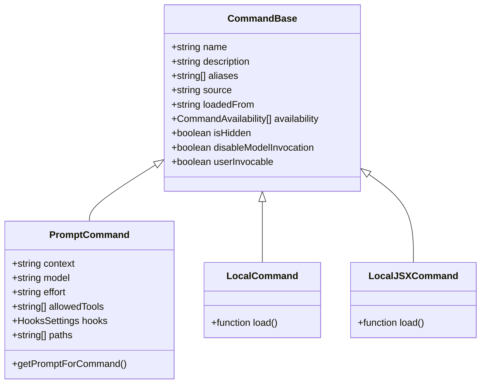
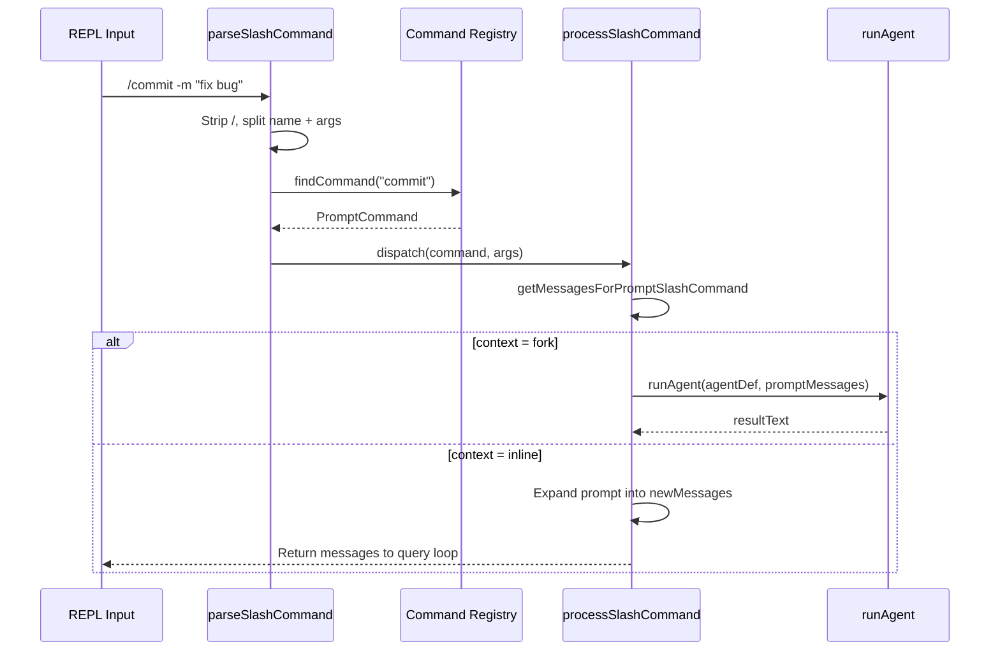

# Slash Commands: 90+ Commands and the Registry

## Overview

Slash commands are the user-facing entry point for cc's interaction surfaces. When a user types `/commit`, `/review`, `/doctor`, or any of the 90+ registered commands in the REPL, the input is parsed, matched against the command registry, and dispatched either as a prompt expansion (for `type: 'prompt'` commands) or as a local JSX callback (for `type: 'local'` and `type: 'local-jsx'` commands). The command registry in `src/commands.ts` is the central hub that loads, filters, and serves all command sources: built-in commands, skills from directories, plugin commands, bundled skills, and MCP-provided skills.

This chapter traces the full lifecycle: how commands are registered at module initialization, how the registry loads and filters commands at runtime, how slash command parsing works, and how the dispatch path differs between prompt, local, and local-jsx command types. The interaction between the command registry and the `SkillTool` (which surfaces prompt-type commands to the model) is a key design tension: the same `Command` type serves both the user's `/` input and the model's tool-call surface.

## Data structures and contracts

The foundational type is `Command`, a discriminated union with three variants: `prompt`, `local`, and `local-jsx`. Each variant shares the `CommandBase` fields and adds variant-specific properties. The `isMcp?: boolean` field on `CommandBase` marks commands that originate from MCP servers, enabling the registry and dispatch code to apply MCP-specific handling (such as the `(MCP)` suffix in autocomplete and separate filtering in `getMcpSkillCommands`).

```typescript
// src/types/command.ts:L175-L206 — Command type hierarchy
export type CommandBase = {
  availability?: CommandAvailability[]
  description: string
  hasUserSpecifiedDescription?: boolean
  isEnabled?: () => boolean
  isHidden?: boolean
  name: string
  aliases?: string[]
  isMcp?: boolean
  argumentHint?: string
  whenToUse?: string
  version?: string
  disableModelInvocation?: boolean
  userInvocable?: boolean
  loadedFrom?:
    | 'commands_DEPRECATED'
    | 'skills'
    | 'plugin'
    | 'managed'
    | 'bundled'
    | 'mcp'
  kind?: 'workflow'
  immediate?: boolean
  isSensitive?: boolean
  userFacingName?: () => string
}

export type Command = CommandBase &
  (PromptCommand | LocalCommand | LocalJSXCommand)
```

The `PromptCommand` variant adds skill-specific fields: `allowedTools`, `model`, `hooks`, `context` (inline or fork), `agent`, `effort`, `paths`, and the deferred `getPromptForCommand` callback. This callback is the progressive-disclosure mechanism: the full prompt content is loaded only when the skill is invoked, not at registration time.

The `LocalCommand` variant provides a `load()` function that returns a module with a `call()` function. This lazy-loading pattern defers heavy dependencies until the command is invoked. The `call()` function takes arguments and a context object, returning a `LocalCommandResult` (text, compact, or skip).

The `LocalJSXCommand` variant provides a `load()` function that returns a module with a `call()` function taking an `onDone` callback, a context object, and arguments. The `call()` function returns a `React.ReactNode`, which is rendered by the Ink framework. The `onDone` callback accepts optional result text and display options (skip, system, user), plus `shouldQuery` (whether to send the result to the model), `metaMessages` (model-visible hidden messages), and `nextInput`/`submitNextInput` (auto-submit follow-up input after the command completes).

The `CommandAvailability` type gates commands by authentication status:

```typescript
// src/types/command.ts:L163-L176 — Availability gating and CommandBase
 * Example: `availability: ['claude-ai', 'console']` shows the command to
 * claude.ai subscribers and direct Console API key users (api.anthropic.com),
 * but hides it from Bedrock/Vertex/Foundry users and custom base URL users.
export type CommandAvailability =
  // claude.ai OAuth subscriber (Pro/Max/Team/Enterprise via claude.ai)
  | 'claude-ai'
  // Console API key user (direct api.anthropic.com, not via claude.ai OAuth)
  | 'console'

export type CommandBase = {
  availability?: CommandAvailability[]
  description: string
```

Commands without an `availability` field are universal; those declaring `availability: ['claude-ai']` or `availability: ['console']` are filtered based on the current user's subscription and API key type. The `meetsAvailabilityRequirement` function checks this at runtime on every `getCommands()` call, so authentication changes (e.g., after `/login`) take effect immediately.

Each built-in command is a module-level constant imported at the top of `commands.ts`. The `COMMANDS` function (memoized) returns the full array, which includes feature-gated commands conditionally added via the `feature()` Bun bundle macro.

```typescript
// src/commands.ts:L258-L346 — Command registry construction
const COMMANDS = memoize((): Command[] => [
  addDir, advisor, agents, branch, btw, chrome, clear, color,
  compact, config, copy, desktop, context, cost, diff, doctor,
  effort, exit, fast, files, heapDump, help, ide, init,
  keybindings, installGitHubApp, installSlackApp, mcp, memory,
  // ... 90+ commands total, with feature-gated additions:
  ...(webCmd ? [webCmd] : []),
  ...(forkCmd ? [forkCmd] : []),
  ...(buddy ? [buddy] : []),
  ...(proactive ? [proactive] : []),
  // ... etc.
])
```

Feature-gated commands use the `feature()` Bun bundle macro for dead code elimination. When a feature flag is disabled at build time, the command does not exist in the registry at all. The conditional requires at the top of the file use `require()` with a type assertion to pull in heavy modules only when the feature is enabled, avoiding bundling unnecessary code into the CLI binary.

The `findCommand` function matches by name or alias, providing a single lookup path for both user-typed and model-invoked commands.

```typescript
// src/commands.ts:L688-L698 — Command lookup
export function findCommand(
  commandName: string, commands: Command[],
): Command | undefined {
  return commands.find(
    _ => _.name === commandName ||
         getCommandName(_) === commandName ||
         _.aliases?.includes(commandName),
  )
}
```

## Control flow

### Command registry loading

The `loadAllCommands` function (memoized by cwd) assembles the full command list from all sources. Built-in commands come last in the array, which means user/project/plugin skills of the same name shadow built-in commands during `findCommand` lookup (first match wins).

```typescript
// src/commands.ts:L449-L469 — Full command loading
const loadAllCommands = memoize(async (cwd: string): Promise<Command[]> => {
  const [
    { skillDirCommands, pluginSkills, bundledSkills, builtinPluginSkills },
    pluginCommands,
    workflowCommands,
  ] = await Promise.all([
    getSkills(cwd),
    getPluginCommands(),
    getWorkflowCommands ? getWorkflowCommands(cwd) : Promise.resolve([]),
  ])

  return [
    ...bundledSkills,
    ...builtinPluginSkills,
    ...skillDirCommands,
    ...workflowCommands,
    ...pluginCommands,
    ...pluginSkills,
    ...COMMANDS(),
  ]
})
```

The `getSkills` function loads skills from four sources in parallel, catching errors at the Promise level so that a failure in one source (e.g., a corrupt skill directory) does not prevent the others from loading. Bundled skills are loaded synchronously (they are already registered in memory), while skill-directory and plugin skills require disk I/O and dynamic imports.

The `getCommands` function wraps `loadAllCommands` with fresh availability and `isEnabled` checks on every call, so that authentication changes (e.g., after `/login`) take effect immediately. It also merges in dynamic skills discovered during file operations, inserting them after plugin skills but before built-in commands in the array.

```typescript
// src/commands.ts:L476-L517 — Fresh filtering with dynamic skill merge
export async function getCommands(cwd: string): Promise<Command[]> {
  const allCommands = await loadAllCommands(cwd)
  const dynamicSkills = getDynamicSkills()

  const baseCommands = allCommands.filter(
    _ => meetsAvailabilityRequirement(_) && isCommandEnabled(_),
  )

  if (dynamicSkills.length === 0) return baseCommands

  // Dedupe dynamic skills - only add if not already present
  const baseCommandNames = new Set(baseCommands.map(c => c.name))
  const uniqueDynamicSkills = dynamicSkills.filter(
    s => !baseCommandNames.has(s.name) &&
         meetsAvailabilityRequirement(s) &&
         isCommandEnabled(s),
  )

  // Insert dynamic skills after plugin skills but before built-in commands
  const builtInNames = new Set(COMMANDS().map(c => c.name))
  const insertIndex = baseCommands.findIndex(c => builtInNames.has(c.name))
  // ... splice in uniqueDynamicSkills at insertIndex
}
```

The dynamic-skill insertion point is significant: dynamic skills appear before built-in commands in the array, so they shadow built-in commands during `findCommand` lookup. This means a dynamically-discovered skill with the same name as a built-in command will take precedence, which is the correct behavior for project-specific skill overrides.

### Skill tool command filtering

The `getSkillToolCommands` and `getSlashCommandToolSkills` functions filter the full command list down to the subset surfaced to the model via `SkillTool`. Only `type: 'prompt'` commands with either an explicit description or `whenToUse` are included. Built-in commands (`source: 'builtin'`) are excluded from the skill listing but remain available via user-typed slash commands.

```typescript
// src/commands.ts:L563-L581 — Skill tool command filtering
export const getSkillToolCommands = memoize(
  async (cwd: string): Promise<Command[]> => {
    const allCommands = await getCommands(cwd)
    return allCommands.filter(
      cmd => cmd.type === 'prompt' &&
             !cmd.disableModelInvocation &&
             cmd.source !== 'builtin' &&
             (cmd.loadedFrom === 'bundled' ||
              cmd.loadedFrom === 'skills' ||
              cmd.loadedFrom === 'commands_DEPRECATED' ||
              cmd.hasUserSpecifiedDescription ||
              cmd.whenToUse),
    )
  },
)
```

The filtering logic distinguishes between skills that always appear in the listing (bundled, from `/skills/` directories, from legacy `/commands/` directories) and those that require explicit metadata (plugin and MCP commands must have `hasUserSpecifiedDescription` or `whenToUse`). This is because bundled and directory-based skills get an auto-derived description from the first line of their Markdown body, while plugin and MCP commands do not have a reliable auto-description mechanism.

The `getSlashCommandToolSkills` function applies stricter filtering, returning only skills that have `loadedFrom` of 'skills', 'plugin', or 'bundled', plus `hasUserSpecifiedDescription` or `whenToUse`. This subset is used for the model-facing skill listing in contexts where only true skills (not commands) should be shown.

### Slash command parsing

The `parseSlashCommand` function in `src/utils/slashCommandParsing.ts` handles the raw input parsing: stripping the leading `/`, extracting the command name and arguments, and detecting MCP commands marked with `(MCP)`.

```typescript
// src/utils/slashCommandParsing.ts:L25-L60 — Slash command parsing
export function parseSlashCommand(input: string): ParsedSlashCommand | null {
  const trimmedInput = input.trim()
  if (!trimmedInput.startsWith('/')) return null

  const withoutSlash = trimmedInput.slice(1)
  const words = withoutSlash.split(' ')
  if (!words[0]) return null

  let commandName = words[0]
  let isMcp = false
  let argsStartIndex = 1

  if (words.length > 1 && words[1] === '(MCP)') {
    commandName = commandName + ' (MCP)'
    isMcp = true
    argsStartIndex = 2
  }

  const args = words.slice(argsStartIndex).join(' ')
  return { commandName, args, isMcp }
}
```

The MCP detection is a special case: MCP-provided commands appear in the autocomplete with a `(MCP)` suffix to distinguish them from local commands. When the user selects an MCP command, the `(MCP)` token is consumed during parsing and the command name is reconstructed with it appended. This ensures `findCommand` matches the full `name (MCP)` string used in the MCP command registry.

The parsing is deliberately simple: a single space split, with no quoted-argument support. This keeps the parser predictable and avoids the complexity of shell-style argument parsing (quoting, escaping, variable expansion). Arguments are treated as an opaque string that the skill's `getPromptForCommand` function interprets according to its own conventions. The `argumentHint` field on the `CommandBase` type provides a hint to the user about expected argument syntax (e.g., `"<message>"` for `/commit` or `"<pr-number>"` for `/review`).

### Slash command dispatch

The `processSlashCommand.tsx` module handles the full dispatch path. For prompt-type commands, it calls `getMessagesForPromptSlashCommand` to expand the skill's prompt content into user messages. For local/local-jsx commands, it executes the callback directly and returns the result. For forked commands (`context: 'fork'`), it launches a subagent via `runAgent()`. The `getMessagesForSlashCommand` function is the central dispatcher: it looks up the command by name, checks `userInvocable` (returning a "can only be invoked by Claude" message for model-only skills), then switches on `command.type` to route to the appropriate handler.

The dispatch path for prompt-type commands involves several steps:

1. **Prompt expansion.** The `getPromptForCommand` callback is called with the user's arguments and the current tool-use context. This returns `ContentBlockParam[]` (typically a single text block with the expanded prompt).

2. **Argument substitution.** `$ARGUMENTS`, named arguments (`$1`, `$2`), `${CLAUDE_SKILL_DIR}`, and `${CLAUDE_SESSION_ID}` are replaced in the prompt content.

3. **Shell command execution.** For non-MCP skills, `executeShellCommandsInPrompt` processes `!` backtick injection, executing shell commands and substituting their output.

4. **Message construction.** The expanded prompt is wrapped in a user message and returned to the query loop. The model processes this message as part of its normal turn.

The forked slash command path includes a special assistant-mode optimization: when `kairosEnabled` is true, forked commands run as fire-and-forget background tasks that re-enqueue their results as hidden prompts. This prevents N scheduled tasks from blocking the user's input with N serial subagent runs.

### Argument substitution and shell command injection

When a prompt-type command is invoked, the skill's Markdown content goes through two expansion passes before being sent to the model. The first pass substitutes argument placeholders using `substituteArguments` from `src/utils/argumentSubstitution.ts`. The `$ARGUMENTS` placeholder is replaced with the full arguments string the user typed after the command name. Indexed forms like `$ARGUMENTS[0]` and `$1` are replaced with individual shell-parsed tokens. Named arguments (e.g., `$foo`) are replaced when the skill's frontmatter declares an `arguments` field mapping names to positions. If the content contains no placeholders at all and the user provided arguments, the args are appended as `ARGUMENTS: {args}` so the model still sees them.

```typescript
// src/utils/argumentSubstitution.ts:L94-L145 — Argument substitution
export function substituteArguments(
  content: string,
  args: string | undefined,
  appendIfNoPlaceholder = true,
  argumentNames: string[] = [],
): string {
  if (args === undefined || args === null) {
    return content
  }
  const parsedArgs = parseArguments(args)
  const originalContent = content

  // Replace named arguments (e.g., $foo, $bar) with their values
  for (let i = 0; i < argumentNames.length; i++) {
    const name = argumentNames[i]
    if (!name) continue
    content = content.replace(
      new RegExp(`\\$${name}(?![\\[\\w])`, 'g'),
      parsedArgs[i] ?? '',
    )
  }

  // Replace indexed arguments ($ARGUMENTS[0], $ARGUMENTS[1], etc.)
  content = content.replace(/\$ARGUMENTS\[(\d+)\]/g, (_, indexStr: string) => {
    const index = parseInt(indexStr, 10)
    return parsedArgs[index] ?? ''
  })

  // Replace shorthand indexed arguments ($0, $1, etc.)
  content = content.replace(/\$(\d+)(?!\w)/g, (_, indexStr: string) => {
    const index = parseInt(indexStr, 10)
    return parsedArgs[index] ?? ''
  })

  // Replace $ARGUMENTS with the full arguments string
  content = content.replaceAll('$ARGUMENTS', args)

  if (content === originalContent && appendIfNoPlaceholder && args) {
    content = content + `\n\nARGUMENTS: ${args}`
  }
  return content
}
```

The second pass executes embedded shell commands via `executeShellCommandsInPrompt` from `src/utils/promptShellExecution.ts`. This function processes two syntaxes for shell injection: block form (triple-backtick blocks prefixed with `!`, matching the regex `` /```!\s*\n?([\s\S]*?)\n?```/g ``) and inline form (`` !`command` `` matching `/(?<=^|\s)!`([^`]+)`/gm`). Each matched command is executed through BashTool (or PowerShellTool when the skill's frontmatter specifies `shell: powershell` and the runtime gate allows it). The command's stdout replaces the original pattern in the prompt text. Permissions are checked before execution: `hasPermissionsToUseTool` must return `allow`, otherwise a `MalformedCommandError` is thrown. This means shell command injection in skills is subject to the same permission model as direct Bash tool calls, preventing a skill from executing destructive commands that the user has not approved.

For local-jsx commands, the `load()` function is called first to lazy-load the command implementation, then `call()` is invoked with the `onDone` callback, context, and arguments. The `call()` function returns a React node that Ink renders in the terminal. When the command completes, `onDone` is called with the result text and display options. If `shouldQuery` is true, the result is sent to the model as a user message.

The `LocalJSXCommandContext` extends `ToolUseContext` with additional UI-specific methods: `setMessages` (for updating the message list from within a command), `onChangeAPIKey` (for triggering a re-authentication flow), `onChangeDynamicMcpConfig` (for updating MCP server configuration), and `onInstallIDEExtension` (for triggering IDE extension installation). These methods are only available to local-jsx commands because they require direct access to the TUI state; they are not exposed to prompt-type commands (which are mediated through the model) or local commands (which are text-only).

The `LocalJSXCommandContext` type is defined in `src/types/command.ts` and threaded through the dispatch path via the `ProcessUserInputContext` type in `src/utils/processUserInput/processUserInput.ts`, which composes `ToolUseContext & LocalJSXCommandContext`. When a local-jsx command is dispatched, the `processSlashCommand.tsx` handler calls `command.load().then(mod => mod.call(onDone, { ...context, canUseTool }, args))`, spreading the full `ProcessUserInputContext` into the command's call function. The `canUseTool` function is added at dispatch time rather than being part of the static context, because it depends on the current tool-use session state (which permission mode is active, whether the tool is on the allowlist). The `setMessages` method enables commands like `/compact` to replace the entire message history mid-command, while `onChangeAPIKey` allows `/login` to trigger a full re-authentication cycle that updates the API key and refreshes the command registry's availability checks.

The `LocalCommandResult` discriminated union has three variants. The `text` variant returns a plain string to display. The `compact` variant returns a compaction result that triggers context compaction. The `skip` variant returns nothing, allowing the command to produce side effects without adding any output to the conversation. This three-variant system enables commands like `/compact` to trigger compaction directly (bypassing the model) while commands like `/clear` can produce side effects (clearing the screen) without adding any messages.

### Remote and bridge command safety

Not all commands are safe for remote execution. The `REMOTE_SAFE_COMMANDS` set lists commands that work in `--remote` mode (they only affect TUI state and do not depend on local filesystem or git). The `BRIDGE_SAFE_COMMANDS` set lists `type: 'local'` commands that produce text output safe for mobile/web clients. The `isBridgeSafeCommand` predicate allows all prompt-type commands (they expand to text), blocks all local-jsx commands (they render Ink UI), and requires explicit opt-in for local commands.

```typescript
// src/commands.ts:L668-L686 — Bridge safety predicate and remote filter
 * that with an explicit allowlist: 'prompt' commands (skills) expand to text
 * and are safe by construction; 'local' commands need an explicit opt-in via
 * BRIDGE_SAFE_COMMANDS; 'local-jsx' commands render Ink UI and stay blocked.
export function isBridgeSafeCommand(cmd: Command): boolean {
  if (cmd.type === 'local-jsx') return false
  if (cmd.type === 'prompt') return true
  return BRIDGE_SAFE_COMMANDS.has(cmd)
}

/**
 * Filter commands to only include those safe for remote mode.
 * Used to pre-filter commands when rendering the REPL in --remote mode,
 * preventing local-only commands from being briefly available before
 * the CCR init message arrives.
 */
export function filterCommandsForRemoteMode(commands: Command[]): Command[] {
  return commands.filter(cmd => REMOTE_SAFE_COMMANDS.has(cmd))
}
```

The three-tier safety model reflects the underlying risk profile of each command type. Prompt-type commands expand to text that is sent to the model; they cannot directly affect the local system (their effect is mediated through the model's tool calls, which go through their own permission checks). Local-jsx commands render interactive Ink UI (pickers, forms, status screens) that only makes sense in a terminal. Local commands execute arbitrary code and need individual review.

The `BRIDGE_SAFE_COMMANDS` set includes `compact`, `clear`, `cost`, `summary`, `releaseNotes`, and `files`. These produce text output that streams back to the mobile/web client and have no terminal-only side effects. The set is deliberately small, following the default-deny principle: new `local` commands require explicit review before they are exposed over the bridge.

The `REMOTE_SAFE_COMMANDS` set includes `session`, `exit`, `clear`, `help`, `theme`, `color`, `vim`, `cost`, `usage`, `copy`, `btw`, `feedback`, `plan`, `keybindings`, `statusline`, `stickers`, and `mobile`. These commands only affect local TUI state and do not depend on local filesystem access, git operations, shell execution, IDE integration, MCP servers, or other local execution context.

The `filterCommandsForRemoteMode` function pre-filters commands when rendering the REPL in `--remote` mode, preventing local-only commands from being briefly available before the CCR init message arrives. This prevents a race condition where the user could type a local-only command during the brief window before remote initialization completes.

### MCP skill commands

MCP-provided skills are filtered separately from the main command registry. The `getMcpSkillCommands` function returns only prompt-type, model-invocable, MCP-loaded commands when the `MCP_SKILLS` feature flag is enabled. These commands are merged into the `SkillTool`'s listing via `getAllCommands` in `SkillTool.ts`, which concatenates local commands with MCP skills and deduplicates by name.

```typescript
// src/commands.ts:L547-L559 — MCP skill filtering
export function getMcpSkillCommands(
  mcpCommands: readonly Command[],
): readonly Command[] {
  if (feature('MCP_SKILLS')) {
    return mcpCommands.filter(
      cmd =>
        cmd.type === 'prompt' &&
        cmd.loadedFrom === 'mcp' &&
        !cmd.disableModelInvocation,
    )
  }
  return []
}
```

MCP skills live outside the `getCommands()` pipeline because they come from `AppState.mcp.commands`, which is populated asynchronously as MCP servers connect. The `SkillTool.getAllCommands` function threads them through separately, concatenating local commands with MCP skills and deduplicating by name with local commands taking precedence. This means an MCP server cannot override a local skill, which is the correct security default (HER Section 12.4).

### Internal-only commands

The `INTERNAL_ONLY_COMMANDS` array collects commands that are eliminated from the external build: `backfillSessions`, `bughunter`, `commit`, `commitPushPr`, `mockLimits`, `ctx_viz`, `goodClaude`, `issue`, `initVerifiers`, `forceSnip`, `bridgeKick`, `version`, `ultraplan`, `subscribePr`, `resetLimits`, `onboarding`, `share`, `summary`, `teleport`, `antTrace`, `perfIssue`, `env`, `oauthRefresh`, `debugToolCall`, `agentsPlatform`, and `autofixPr`. These are only included when `process.env.USER_TYPE === 'ant'` and the session is not a demo.

The `builtInCommandNames` function memoizes the set of all built-in command names (including aliases) for quick lookup in telemetry and permission checks. This set is used by the `SkillTool` to distinguish built-in skills from custom skills in telemetry events, allowing the team to track usage patterns separately for internal and external users.

### Description formatting with source annotation

The `formatDescriptionWithSource` function annotates command descriptions with their source for user-facing UI. Workflow commands get a `(workflow)` badge. Plugin commands get a `(plugin name)` or `(plugin)` badge. Bundled commands get a `(bundled)` badge. User/project commands get their setting source name (e.g., `(user)` or `(project)`). Built-in and MCP commands are shown without annotation. This annotation is used in typeahead, help screens, and other user-facing displays, but not in model-facing prompts (which use `cmd.description` directly).



## Edge cases and failure modes

**Command name shadowing.** Because `findCommand` uses `Array.find` (first match), a user skill with the same name as a built-in command will shadow the built-in. The load order (bundled, builtin-plugin, skill-dir, workflow, plugin, built-in) means that user skills appear before built-in commands in the array, so they take precedence. This is intentional but can cause confusion when a user's `/commit` skill shadows the built-in commit command. The `formatDescriptionWithSource` function helps by annotating the source, so the user can see which version of the command they are invoking. The shadowing is by design: it allows users and projects to customize behavior without modifying the built-in commands, following the open-closed principle.

**Feature-gated command availability.** Many commands are conditionally registered based on `feature()` flags. If a feature flag is disabled at build time, the command does not exist in the registry at all -- there is no graceful fallback. Users who reference feature-gated commands in scripts or CLAUDE.md files will get "unknown command" errors if the flag is off. The `feature()` macro eliminates code at compile time, so even the `require()` calls for feature-gated modules are removed from the binary. This dead-code elimination is a performance optimization: it keeps the CLI binary small by excluding unused features, but it sacrifices runtime flexibility. The alternative (runtime feature flags with all commands always present) would bloat the binary and the command registry with commands that are never available.

**MCP command name collision.** MCP skills can collide with local skill names. The `uniqBy` call in `SkillTool.getAllCommands` deduplicates by name, with local commands taking precedence (they appear first in the merged array). This means an MCP server cannot override a local skill, which is the correct security default per HER Section 12.4. If two MCP servers expose skills with the same name, the first one registered wins (the `AppState.mcp.commands` array preserves insertion order). This is a weaker guarantee than the local-vs-MCP deduplication, and a malicious MCP server could potentially shadow another MCP server's skill by registering first.

**Bridge command injection.** The `isBridgeSafeCommand` predicate is the primary defense against command injection from mobile/web clients. Without it, a malicious client could send `/model` to pop a local Ink picker or `/config` to modify local settings. The allowlist approach (default deny) ensures that new commands require explicit review before they are exposed over the bridge. The PR #19134 that introduced this predicate was triggered by a real incident: `/model` from iOS was popping the local Ink picker on the host machine. The three-tier classification (prompt = safe, local-jsx = blocked, local = allowlist) provides a principled framework for evaluating new commands.

**Forked command MCP settle race.** In assistant mode, forked commands fire as background tasks. If MCP servers have not finished connecting when the task starts, the subagent may not have access to MCP tools. The `MCP_SETTLE_POLL_MS` (200ms) and `MCP_SETTLE_TIMEOUT_MS` (10s) constants define a polling loop that waits for MCP clients to reach non-pending state before launching the subagent. Without this settle period, the subagent would start without MCP tools and fail to complete tasks that require them. The 10-second timeout is a compromise: too short and slow SSE handshakes are not covered, too long and the user perceives unresponsiveness.

**Lazy-load failure.** Both `LocalCommand` and `LocalJSXCommand` use lazy-loading via the `load()` function. If the module fails to load (e.g., a missing dependency or a syntax error in the command module), the error is caught at the dispatch level and surfaced as a user-visible error message. The `getSkills` function wraps skill loading in try/catch at the Promise level, so a failure in one skill source does not prevent others from loading. This defensive pattern ensures that a single corrupt skill file does not break the entire command registry.

**Availability check timing.** The `meetsAvailabilityRequirement` function is not memoized, because auth state can change mid-session (e.g., after `/login`). This means it runs on every `getCommands()` call. However, the expensive part (disk I/O for skill loading) is memoized by `loadAllCommands`, so the fresh filtering adds negligible cost: it iterates the already-loaded array and checks boolean predicates. The separation of memoized loading from fresh filtering is a deliberate design choice that balances performance (avoiding redundant disk I/O) with correctness (reflecting auth state changes immediately).

**Command registration order vs. array ordering.** The `COMMANDS()` function returns commands in a fixed order determined by the source file's import order. This ordering is stable across sessions but not documented as part of the public API. If a new built-in command is added to the source file between existing commands, all subsequent commands shift their position in the array. This does not affect `findCommand` (which matches by name, not position), but it does affect the order of commands in typeahead and help displays. The `formatDescriptionWithSource` function's annotation helps users identify commands regardless of ordering.

## Where cc diverges from the published pattern

HER Section 7 (Configuration Surfaces) describes slash commands as one of six configuration surfaces, but the treatment is brief. CC's implementation differs in several ways:

1. **Three command types, not one.** The pattern implies a single command type (prompt expansion). CC supports three: prompt (expanded into the conversation), local (synchronous callback returning text), and local-jsx (callback that renders Ink UI). This three-type system enables both lightweight text commands (like `/cost`) and rich interactive UI (like `/doctor`). The discriminated union makes the type distinction explicit in the type system, preventing accidental misuse.

2. **Progressive disclosure via SkillTool.** The pattern does not describe a separate model-facing tool for command invocation. CC's `SkillTool` acts as an intermediary: the model sees a compact listing of available skills, and the full prompt content is loaded only on invocation. This is a direct implementation of HER Pattern 9 (Progressive Tool Expansion) applied to the command surface. The `getSkillToolCommands` function implements the filtering, excluding built-in commands and commands without descriptions from the model-facing listing.

3. **Feature-gated command registration.** CC uses the `feature()` Bun bundle macro to eliminate commands at compile time. This is more aggressive than runtime feature flags: commands that do not exist in the registry cannot be discovered or invoked. The pattern does not address build-time gating. The tradeoff is that feature-gated commands have no graceful degradation -- they are either fully available or completely absent.

4. **Bridge safety classification.** The pattern does not address remote access security for commands. CC's `REMOTE_SAFE_COMMANDS`, `BRIDGE_SAFE_COMMANDS`, and `isBridgeSafeCommand` implement a three-tier security model: some commands are safe for remote mode, some are safe for bridge (mobile/web) clients, and the rest are local-only. The default-deny approach ensures that new commands require explicit review before being exposed over any external interface.

5. **Dynamic skill discovery.** The pattern treats the command registry as static. CC's dynamic skill discovery (via `discoverSkillDirsForPaths` and `activateConditionalSkillsForPaths`) adds commands to the registry at runtime based on the files being operated on. This is an extension of the pattern's concept of "progressive disclosure" from the model's perspective to the filesystem's perspective: the registry grows as the agent explores the codebase.

6. **Internal-only commands.** The pattern does not address the need for internal-only tools that are not exposed to external users. CC's `INTERNAL_ONLY_COMMANDS` array and the `USER_TYPE === 'ant'` check create a separate command surface for internal users, enabling tools like `bughunter`, `commit`, and `autofixPr` that are too specialized or risky for general availability. The `IS_DEMO` environment variable provides an additional layer of exclusion, preventing internal commands from appearing in demo sessions even when the user type is correct.

7. **Lazy-loading as a bundle-size optimization.** The pattern does not discuss the impact of command registration on binary size. CC's lazy-loading pattern (via `load()` functions and conditional `require()` calls) keeps the CLI binary lean by deferring heavy dependencies until a specific command is invoked. The `usageReport` command is a notable example: its 113KB dependency is loaded only when `/insights` is actually invoked, saving 113KB from every CLI invocation that does not use insights. The conditional `require()` calls at the top of `commands.ts` follow the same pattern: feature-gated modules are only `require()`d when the feature flag is enabled, so the binary does not include their code when the flag is off.

## Developer takeaways for building a long-running agent

A discriminated-union command type (`prompt | local | local-jsx`) enables type-safe dispatch without runtime checks: each variant carries its own required fields while `CommandBase` guarantees consistency. Load order determines precedence: because `findCommand` uses `Array.find`, placing higher-priority sources (user skills, plugins) before built-in commands in the array makes shadowing automatic and predictable. The model-facing command listing must be a filtered subset of the full registry -- not every user-facing command should be model-facing -- and fields like `hasUserSpecifiedDescription` and `whenToUse` provide the filtering criteria. Any command surface exposed to external clients (bridge, remote mode, MCP) requires an explicit allowlist with default deny; the three-tier bridge-safety predicate (prompt = safe, local-jsx = blocked, local = allowlist) provides a principled framework. When launching subagents from background tasks, poll for MCP client readiness before starting to avoid silent failures from missing tools. Cache command loading aggressively (memoize disk I/O in `loadAllCommands`) but invalidate on auth changes by re-evaluating availability and `isEnabled` on every `getCommands` call. Use `CommandAvailability` for static auth requirements and `isEnabled()` for dynamic feature-flag checks; mixing these concerns causes slow or inconsistent registry behavior. Finally, lazy-load heavy command dependencies via `load()` functions to keep the CLI binary lean -- the `usageReport` command's 113KB dependency is a concrete example of deferring imports until invocation.

```mermaid
flowchart
    A[User types /command] --> B{parseSlashCommand}
    B -->|No slash| C[Normal input]
    B -->|Has slash| D{findCommand}
    D -->|Not found| E[Unknown command error]
    D -->|Found| F{Command type?}
    F -->|prompt| G{context = fork?}
    G -->|yes| H[executeForkedSkill: runAgent]
    G -->|no| I[Expand prompt into messages]
    F -->|local| J[load + call: return text]
    F -->|local-jsx| K[load + call: render Ink UI]
    H --> L[Return forked result]
    I --> M[Send to model as user message]
    J --> N[Display text result]
    K --> O[Render interactive UI]
```




