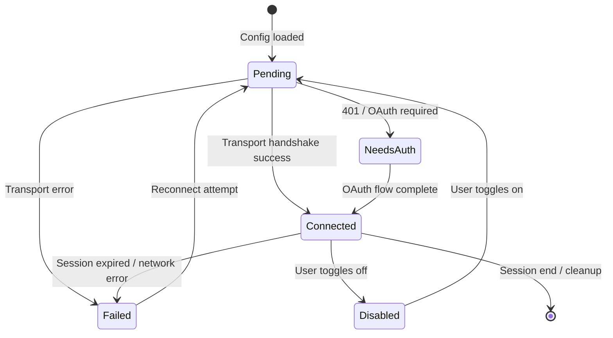
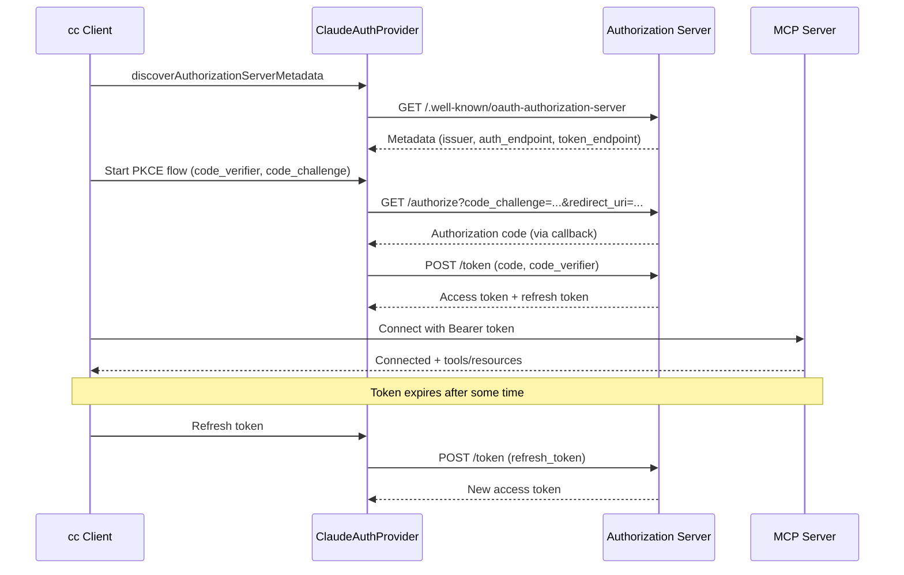
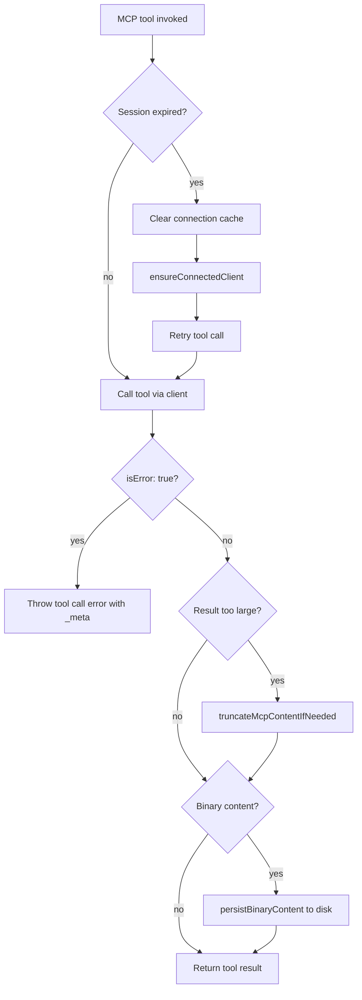

# MCP: Clients, Transports, and Lifecycle

## Overview

The Model Context Protocol (MCP) is cc's primary extension mechanism for adding external tools and capabilities at runtime. An MCP server exposes tools, resources, and prompts over a standardized JSON-RPC transport. cc acts as an MCP client, connecting to configured servers at startup and surfacing their capabilities as first-class tools in the agent's action space. The MCP subsystem spans six source files: `client.ts` (connection management and tool invocation), `config.ts` (server configuration loading), `auth.ts` (OAuth and Cross-App Access flows), `types.ts` (schema definitions), `MCPConnectionManager.tsx` (React context for UI), and `mcp.ts` (the cc-as-MCP-server entrypoint).

This chapter examines the transport layer (stdio, SSE, HTTP, WebSocket, SDK), the connection lifecycle (pending to connected, reconnect strategies, auth-gated flows), the OAuth implementation (including Cross-App Access via IdP), and the security model that treats MCP servers as untrusted third-party code (HER Section 12.4). The interaction between MCP tool discovery and `ToolSearch` (HER Pattern 9) is covered: MCP tools are deferred by default and loaded lazily when the model requests them.

## Data structures and contracts

The `MCPServerConnection` discriminated union tracks the state of each server connection. A server progresses through five states: pending, connected, failed, needs-auth, and disabled.

```typescript
// src/services/mcp/types.ts:L180-L227 — Server connection states
export type ConnectedMCPServer = {
  client: Client
  name: string
  type: 'connected'
  capabilities: ServerCapabilities
  serverInfo?: {
    name: string
    version: string
  }
  instructions?: string
  config: ScopedMcpServerConfig
  cleanup: () => Promise<void>
}

export type FailedMCPServer = {
  name: string
  type: 'failed'
  config: ScopedMcpServerConfig
  error?: string
}

export type NeedsAuthMCPServer = {
  name: string
  type: 'needs-auth'
  config: ScopedMcpServerConfig
}

export type PendingMCPServer = {
  name: string
  type: 'pending'
  config: ScopedMcpServerConfig
  reconnectAttempt?: number
  maxReconnectAttempts?: number
}

export type DisabledMCPServer = {
  name: string
  type: 'disabled'
  config: ScopedMcpServerConfig
}

export type MCPServerConnection =
  | ConnectedMCPServer
  | FailedMCPServer
  | NeedsAuthMCPServer
  | PendingMCPServer
  | DisabledMCPServer
```

The `ConnectedMCPServer` variant carries the MCP SDK `Client` instance, the server's declared `capabilities`, optional `serverInfo` and `instructions`, and a `cleanup` function that gracefully disconnects the client and removes event listeners. The `FailedMCPServer` variant includes an optional `error` string for diagnostics. The `NeedsAuthMCPServer` variant signals that the server requires OAuth authentication and the user has not yet authorized. The `PendingMCPServer` variant tracks reconnection state with `reconnectAttempt` and `maxReconnectAttempts` counters. The `DisabledMCPServer` variant represents a server that the user has explicitly toggled off.

The `ScopedMcpServerConfig` type augments the base `McpServerConfig` with a `scope` field and an optional `pluginSource` for plugin-provided servers:

```typescript
// src/services/mcp/types.ts:L163-L169 — Scoped config with source tracking
export type ScopedMcpServerConfig = McpServerConfig & {
  scope: ConfigScope
  // For plugin-provided servers: the providing plugin's LoadedPlugin.source
  // (e.g. 'slack@anthropic'). Stashed at config-build time so the channel
  // gate doesn't have to race AppState.plugins.enabled hydration.
  pluginSource?: string
}
```

The scope determines precedence when the same server is configured in multiple sources: enterprise policy overrides user settings, which override project settings. The seven config scopes are defined by the `ConfigScopeSchema` enum at `src/services/mcp/types.ts:L10-L20`.

The transport types are defined as a Zod enum:

```typescript
// src/services/mcp/types.ts:L23-L26 — Transport types
export const TransportSchema = lazySchema(() =>
  z.enum(['stdio', 'sse', 'sse-ide', 'http', 'ws', 'sdk']),
)
```

Each transport type has its own config schema. The most common is `McpStdioServerConfig` (for local process-based servers):

```typescript
// src/services/mcp/types.ts:L28-L35 — Stdio server config
export const McpStdioServerConfigSchema = lazySchema(() =>
  z.object({
    type: z.literal('stdio').optional(), // Optional for backwards compatibility
    command: z.string().min(1, 'Command cannot be empty'),
    args: z.array(z.string()).default([]),
    env: z.record(z.string(), z.string()).optional(),
  }),
)
```

The `sse-ide` transport type is a variant of SSE used by the IDE bridge, which injects an IDE-specific URL instead of reading it from the server config. The `sdk` transport type is used for in-process servers registered by the IDE bridge, which bypass the network layer entirely.

## Control flow

### Server configuration loading

The `config.ts` module loads MCP server configurations from multiple sources with a defined precedence. The `getAllMcpConfigs` function merges configs from: managed enterprise policy, user settings (`~/.claude.json`), project settings (`.claude/settings.json`), `.mcp.json` files (in the project root), claude.ai connectors, and plugin-provided servers. Each config is annotated with its `scope` so that the UI can display where a server was configured.

The `addScopeToServers` utility annotates each server config with its scope:

```typescript
// src/services/mcp/config.ts:L69-L81 — Scope annotation
function addScopeToServers(
  servers: Record<string, McpServerConfig> | undefined,
  scope: ConfigScope,
): Record<string, ScopedMcpServerConfig> {
  if (!servers) {
    return {}
  }
  const scopedServers: Record<string, ScopedMcpServerConfig> = {}
  for (const [name, config] of Object.entries(servers)) {
    scopedServers[name] = { ...config, scope }
  }
  return scopedServers
}
```

The `writeMcpjsonFile` function atomically writes `.mcp.json` using a temp file + rename pattern. It preserves existing file permissions and flushes to disk before renaming, preventing partial writes from corrupting the config:

```typescript
// src/services/mcp/config.ts:L88-L131 — Atomic .mcp.json write
async function writeMcpjsonFile(config: McpJsonConfig): Promise<void> {
  const mcpJsonPath = join(getCwd(), '.mcp.json')

  // Read existing file permissions to preserve them
  let existingMode: number | undefined
  try {
    const stats = await stat(mcpJsonPath)
    existingMode = stats.mode
  } catch (e: unknown) {
    const code = getErrnoCode(e)
    if (code !== 'ENOENT') {
      throw e
    }
    // File doesn't exist yet -- no permissions to preserve
  }

  // Write to temp file, flush to disk, then atomic rename
  const tempPath = `${mcpJsonPath}.tmp.${process.pid}.${Date.now()}`
  const handle = await open(tempPath, 'w', existingMode ?? 0o644)
  try {
    await handle.writeFile(jsonStringify(config, null, 2), {
      encoding: 'utf8',
    })
    await handle.datasync()
  } finally {
    await handle.close()
  }

  try {
    // Restore original file permissions on the temp file before rename
    if (existingMode !== undefined) {
      await chmod(tempPath, existingMode)
    }
    await rename(tempPath, mcpJsonPath)
  } catch (e: unknown) {
    // Clean up temp file on failure
    try {
      await unlink(tempPath)
    } catch {
      // Best-effort cleanup
    }
    throw e
  }
}
```

The temp file name includes both the process ID and a timestamp to ensure uniqueness across concurrent writes from different processes. The `datasync()` call flushes the file's data to stable storage before the rename, ensuring that the file contents are durable even if the system crashes immediately after the rename. The `chmod` call before rename preserves the original file's permissions, so a `.mcp.json` with restrictive permissions (e.g., 0o600) does not become world-readable after a config update.

### Plugin MCP server deduplication

The `dedupPluginMcpServers` function prevents plugin-provided MCP servers from duplicating manually-configured servers. The deduplication uses a signature-based approach: two server configs with the same signature (computed by `getMcpServerSignature`) are considered "the same server." For stdio servers, the signature is `stdio:` followed by the JSON-encoded command array. For URL-based servers, the signature is `url:` followed by the unwrapped CCR proxy URL.

```typescript
// src/services/mcp/config.ts:L202-L212 — Server signature computation
export function getMcpServerSignature(config: McpServerConfig): string | null {
  const cmd = getServerCommandArray(config)
  if (cmd) {
    return `stdio:${jsonStringify(cmd)}`
  }
  const url = getServerUrl(config)
  if (url) {
    return `url:${unwrapCcrProxyUrl(url)}`
  }
  return null
}
```

Plugin servers are namespaced with a `plugin:name:server` prefix so they never key-collide with manual servers in the merge. The content-based deduplication catches the case where both a manual server and a plugin server launch the same underlying process or connect to the same URL. Manual servers always win; between plugins, the first-loaded server wins. Suppressed servers are reported in the `suppressed` array for logging and diagnostics.

### Transport connection establishment

The `client.ts` module creates transport instances based on the server config type. For `stdio` servers, it uses `StdioClientTransport` from the MCP SDK, which spawns the configured command as a child process. The child process inherits environment variables from the cc process, augmented by the `env` field in the server config. For `sse` and `http` servers, it uses `SSEClientTransport` and `StreamableHTTPClientTransport` respectively, with proxy and TLS configuration. For `ws` servers, cc provides its own `WebSocketTransport` implementation with TLS and proxy support. The `sdk` transport type is used for in-process servers registered by the IDE bridge.

The connection process handles several failure modes:

1. **Auth-gated servers.** If the server requires OAuth and no tokens are available, the connection transitions to `needs-auth` rather than `failed`. The `McpAuthTool` surfaces a re-authentication flow to the user. The `handleRemoteAuthFailure` function emits a `tengu_mcp_server_needs_auth` analytics event, caches the needs-auth entry (with a 15-minute TTL to avoid repeated auth prompts), and returns the `NeedsAuthMCPServer` variant. The auth cache is stored in `~/.claude/mcp-needs-auth-cache.json` and checked via `isMcpAuthCached` before attempting reconnection. The cache serialization uses a `writeChain` promise chain to prevent concurrent read-modify-write races when multiple servers return 401 in the same batch.

2. **Disabled servers.** The `isMcpServerDisabled` function checks whether the user has explicitly disabled a server via the MCP settings UI. Disabled servers are skipped during the connection phase and appear as `DisabledMCPServer` in the connection registry. The user can re-enable a server via the `toggleMcpServer` function in the `MCPConnectionManager` context, which transitions the server back to `PendingMCPServer` and starts the connection process from scratch.

3. **Session expiry.** MCP servers return HTTP 404 with JSON-RPC code -32001 when a session ID is no longer valid. The `isMcpSessionExpiredError` function detects this pattern and triggers a reconnect:

```typescript
// src/services/mcp/client.ts:L193-L206 — Session expiry detection
export function isMcpSessionExpiredError(error: Error): boolean {
  const httpStatus =
    'code' in error ? (error as Error & { code?: number }).code : undefined
  if (httpStatus !== 404) {
    return false
  }
  // The SDK embeds the response body text in the error message.
  // MCP servers return: {"error":{"code":-32001,"message":"Session not found"},...}
  // Check for the JSON-RPC error code to distinguish from generic web server 404s.
  return (
    error.message.includes('"code":-32001') ||
    error.message.includes('"code": -32001')
  )
}
```

The dual-signal check (HTTP 404 + JSON-RPC code -32001) avoids false positives from generic web server 404s (wrong URL, server decommissioned, etc.). The string-matching approach (checking for the code in the error message) is used because the MCP SDK embeds the response body text in the error message rather than parsing it into a structured error object.

4. **Tool call errors.** When an MCP tool returns `isError: true`, cc throws a tool call error class which carries the result's `_meta` field so SDK consumers can still receive it. Per the MCP specification, `_meta` is on the base Result type and is valid on error results. The base class ensures that the error message is safe for analytics logging (no PII or sensitive data). The `mcpMeta` field preserves the `_meta` property from the MCP result, which is important for structured error reporting where the error itself contains actionable information (e.g., a redirect URL or a retry-after value).

### OAuth flow

The `auth.ts` module implements the full OAuth 2.0 Authorization Code flow with PKCE for MCP servers that require authentication. The `ClaudeAuthProvider` class implements the MCP SDK's `OAuthClientProvider` interface.

The flow handles several edge cases specific to real-world OAuth deployments:

1. **Non-standard error codes.** Some OAuth servers (notably Slack) return HTTP 200 with `{"error": "invalid_refresh_token"}` in the body, where RFC 6749 specifies `invalid_grant`. The `normalizeOAuthErrorBody` function rewrites these 200 responses to 400 so that the SDK's error-class mapping applies correctly.

```typescript
// src/services/mcp/auth.ts:L147-L151 — Non-standard error normalization
const NONSTANDARD_INVALID_GRANT_ALIASES = new Set([
  'invalid_refresh_token',
  'expired_refresh_token',
  'token_expired',
])
```

The normalization is applied at the HTTP layer, before the SDK's error-handling logic sees the response. This ensures that the SDK's retry and token-refresh logic works correctly regardless of the server's error code conventions. The `NONSTANDARD_INVALID_GRANT_ALIASES` set is deliberately extensible: as new servers with non-standard error codes are discovered, their error strings can be added to the set without modifying the normalization logic.

2. **OAuth discovery failure.** The `discoverAuthorizationServerMetadata` function fetches the server's `/.well-known/oauth-authorization-server` endpoint. If the server does not support OAuth discovery (returns 404 or does not have the endpoint), the `ClaudeAuthProvider` falls back to using the server's base URL as the authorization and token endpoints. This fallback is necessary for MCP servers that implement OAuth but do not support the discovery protocol.

3. **Cross-App Access (XAA).** Enterprise users can authenticate MCP servers through a corporate Identity Provider (IdP) rather than the server's own OAuth flow. The `isXaaEnabled` function checks settings, and `acquireIdpIdToken` obtains a token from the configured OIDC provider. This enables single sign-on across all MCP servers in an enterprise deployment. The `performCrossAppAccess` function in `xaa.ts` exchanges the IdP token for the MCP server's access token, handling the OIDC flow and token caching.

4. **Sensitive parameter redaction.** The `redactSensitiveUrlParams` function strips `state`, `nonce`, `code_challenge`, `code_verifier`, and `code` from URLs before logging, preventing CSRF and session fixation attack vectors from appearing in debug logs. The `SENSITIVE_OAUTH_PARAMS` constant at `src/services/mcp/auth.ts:L100-L106` defines the set of parameters to redact.

5. **Auth cache with TTL.** The `isMcpAuthCached` function checks a 15-minute cache before prompting the user for authentication. Without this cache, a server that returns 401 on every connection attempt would generate an auth prompt on every startup. The cache is stored in `~/.claude/mcp-needs-auth-cache.json` and serialized through a promise chain (`writeChain`) to prevent concurrent read-modify-write races when multiple servers return 401 in the same batch. The cache read is memoized (`authCachePromise`) so that N concurrent `isMcpAuthCached` calls during batched connection share a single file read instead of N reads of the same file.

6. **Claude.ai proxy fetch with retry.** The `createClaudeAiProxyFetch` function wraps the fetch function for claude.ai proxy connections. It attaches the OAuth bearer token and retries once on 401 via `handleOAuth401Error` (force-refresh). The retry is gated on whether the token actually changed: if the keychain has a newer token or the force-refresh succeeds, the request is retried; otherwise, the 401 is propagated. This prevents a single stale token from mass-401ing every claude.ai connector. The function captures the exact token that was sent before the request, not reading it again after a concurrent 401, to avoid a subtle race where another connector's `handleOAuth401Error` clears the memoize cache between the request and the retry decision.

### MCP server mode (cc as server)

The `mcp.ts` entrypoint exposes cc's own tools as an MCP server. It creates an MCP `Server` instance with `ListToolsRequestSchema` and `CallToolRequestSchema` handlers, connects via `StdioServerTransport`, and exposes all cc tools (excluding MCP tools to prevent recursion) with their Zod schemas converted to JSON Schema via `zodToJsonSchema`.

```typescript
// src/entrypoints/mcp.ts:L35-L57 — MCP server setup
export async function startMCPServer(
  cwd: string,
  debug: boolean,
  verbose: boolean,
): Promise<void> {
  // Use size-limited LRU cache for readFileState to prevent unbounded memory growth
  // 100 files and 25MB limit should be sufficient for MCP server operations
  const READ_FILE_STATE_CACHE_SIZE = 100
  const readFileStateCache = createFileStateCacheWithSizeLimit(
    READ_FILE_STATE_CACHE_SIZE,
  )
  setCwd(cwd)
  const server = new Server(
    {
      name: 'claude/tengu',
      version: MACRO.VERSION,
    },
    {
      capabilities: {
        tools: {},
      },
    },
  )
```

The `createFileStateCacheWithSizeLimit` call at line 43 sets up a size-limited LRU cache for the read-before-write contract, and `setCwd(cwd)` at line 46 establishes the working directory for tool execution. The server mode is useful for integrating cc into other tools (IDEs, CI systems) that act as MCP clients. The tool exclusion (removing MCP tools from the listing) prevents infinite recursion: if cc connected to itself as an MCP server, it would expose the same MCP tools it uses as a client, creating a loop.

### MCPConnectionManager React context

The `MCPConnectionManager.tsx` component provides a React context with `reconnectMcpServer` and `toggleMcpServer` functions. These are consumed by the MCP settings UI to allow users to reconnect failed servers or toggle servers on/off without restarting the session. The context uses `useMemo` to stabilize the context value and prevent unnecessary re-renders.

```typescript
// src/services/mcp/MCPConnectionManager.tsx:L7-L15 — Context interface
interface MCPConnectionContextValue {
  reconnectMcpServer: (serverName: string) => Promise<{
    client: MCPServerConnection;
    tools: Tool[];
    commands: Command[];
    resources?: ServerResource[];
  }>;
  toggleMcpServer: (serverName: string) => Promise<void>;
}
```

The `reconnectMcpServer` function returns the updated connection state, tools, commands, and resources after reconnection. This allows the UI to update immediately without waiting for the next render cycle. The `toggleMcpServer` function transitions between `connected` and `disabled` states. When a server is disabled, it is disconnected and its tools are removed from the model's action space. When re-enabled, the connection process starts from scratch (pending -> connected/failed/needs-auth). The `reconnectMcpServer` function forces a reconnection for servers in the `failed` state, incrementing the `reconnectAttempt` counter and retrying the transport handshake.

The `useMcpReconnect` and `useMcpToggleEnabled` hooks provide type-safe access to the context functions. They throw if used outside the `MCPConnectionManager` provider, which prevents accidental use in components that are not descendants of the provider.

### Tool invocation and output handling

When the model invokes an MCP tool, the `MCPTool.call()` method in `src/tools/MCPTool/MCPTool.ts` routes the request to the appropriate connected MCP client. The tool result is processed through several layers:

1. **Description length capping.** OpenAPI-generated MCP servers have been observed dumping 15-60KB of endpoint documentation into `tool.description`. The `MAX_MCP_DESCRIPTION_LENGTH` (2048 characters) constant at `src/services/mcp/client.ts:L218` caps the p95 tail without losing the intent. This is a direct mitigation for the "too many tools is bad" warning from HER Section 7.2: excessively long tool descriptions push the model into "the dumb zone" by consuming context window tokens without adding actionable information.

2. **Content size estimation.** `getContentSizeEstimate` checks if the result exceeds token limits.

3. **Truncation.** `truncateMcpContentIfNeeded` truncates large results with a summary. The truncation preserves the beginning and end of the result, with a summary of what was removed. This is a form of observation masking (HER Section 8.1) applied to MCP outputs.

4. **Binary content persistence.** `persistBinaryContent` saves binary data (images, files) to disk and returns a reference instead of embedding it inline. Without this, a large image returned by an MCP tool would consume thousands of tokens in the model's context window.

5. **Image resizing.** `maybeResizeAndDownsampleImageBuffer` downsamples large images to reduce token cost. The resizing is applied before the image is added to the conversation, so the model never sees the full-resolution version.

6. **Elicitation handling.** If the MCP server sends an `ElicitRequest`, the `runElicitationHooks` function in `src/services/mcp/elicitationHandler.ts` prompts the user for input and returns it to the server. Elicitation is a server-initiated request for user input, allowing MCP servers to ask clarifying questions during tool execution. The elicitation handler also runs `runElicitationResultHooks` to allow hooks to intercept or modify the user's response before it is sent back to the server.

7. **Unicode sanitization.** `recursivelySanitizeUnicode` removes invalid Unicode sequences from MCP tool results. Some MCP servers return malformed UTF-8 that would cause JSON parsing errors downstream.

8. **Tool timeout.** The default MCP tool timeout is effectively infinite, defined by `DEFAULT_MCP_TOOL_TIMEOUT_MS` at `src/services/mcp/client.ts:L211` as 100 million milliseconds (approximately 27.8 hours), configurable via the `MCP_TOOL_TIMEOUT` environment variable. The infinite default is intentional: MCP tools can perform long-running operations (running test suites, building projects, waiting for CI). The timeout is per-tool-call, not per-connection, so a slow tool call does not affect other tools from the same server.

9. **Recursive tool exclusion.** When cc runs as an MCP server (the `mcp.ts` entrypoint), it excludes MCP tools from its own tool listing to prevent infinite recursion. If cc connected to itself as an MCP server, it would expose the same MCP tools it uses as a client, creating a loop where each tool invocation triggers another server connection.

### MCP tool collapse classification

The `classifyMcpToolForCollapse` function in `src/tools/MCPTool/classifyForCollapse.ts` categorizes MCP tools for compaction. When context is compacted, less-important MCP tool results are summarized more aggressively, reducing the token cost of MCP-sourced content. The classification uses heuristics (tool name patterns, result size, recency) to determine which results can be safely summarized without losing critical information. This is another application of HER Pattern 9: even after tools are loaded, their results can be progressively summarized as they age in the context window.

## Edge cases and failure modes

**Session expiry during tool invocation.** MCP servers that use session-based transports (SSE, HTTP) can expire sessions between tool calls. The `McpSessionExpiredError` class signals that the connection cache must be cleared and a new client obtained via `ensureConnectedClient`. The caller retries the tool call with the fresh client. The session-expiry detection uses a dual-signal check (HTTP 404 + JSON-RPC code -32001) to avoid false positives from generic 404 errors.

**OAuth token refresh failure.** The `tengu_mcp_oauth_refresh_failure` analytics event tracks six distinct failure reasons: `metadata_discovery_failed`, `no_client_info`, `no_tokens_returned`, `invalid_grant`, `transient_retries_exhausted`, and `request_failed`. The `invalid_grant` case triggers token invalidation, forcing a full re-authorization flow. The `transient_retries_exhausted` case indicates that the server is temporarily unavailable; the auth cache (15-minute TTL) prevents repeated prompt spam.

**MCP server returning isError.** Per the MCP specification, `_meta` is valid on error results. The tool call error class preserves `_meta` so that SDK consumers can still access it. This is important for structured error reporting where the error itself contains actionable information (e.g., a validation error with field-level details, or a rate-limit error with a `retry-after` header).

**Tool result truncation.** Large MCP tool results are truncated with `truncateMcpContentIfNeeded` to stay within token budgets. The truncation preserves the beginning and end of the result, with a summary of what was removed. This is a form of observation masking (HER Section 8.1) applied to MCP outputs. The truncation is applied at the tool-result level, not at the context-compaction level, so it takes effect immediately rather than waiting for the next compaction cycle.

**CCR proxy URL unwrapping.** In remote sessions, MCP server URLs are rewritten to route through the CCR session ingress proxy. The `unwrapCcrProxyUrl` function extracts the original vendor URL from the `mcp_url` query parameter for deduplication. Without this, the same MCP server would appear twice in the registry: once with the raw URL and once with the proxy URL. The `CCR_PROXY_PATH_MARKERS` array at `src/services/mcp/config.ts:L171-L174` defines the URL path patterns that identify CCR proxy URLs: `/v2/session_ingress/shttp/mcp/` and `/v2/ccr-sessions/`.

**Plugin server deduplication.** The `dedupPluginMcpServers` function prevents plugin-provided MCP servers from duplicating manually-configured servers. The deduplication is signature-based: two configs with the same `stdio:` or `url:` signature are considered "the same server." Manual servers always win; between plugins, first-loaded wins. The deduplication is necessary because plugin servers are namespaced with a `plugin:name:server` prefix (so they never key-collide in the merge), but they may launch the same underlying process or connect to the same URL as a manually-configured server.

**Data leakage between contexts.** HER Section 6.15 warns that file-based communication between contexts can leak sensitive data. MCP resources (accessed via `ListMcpResourcesTool` and `ReadMcpResourceTool`) are a potential leakage vector: an MCP server could expose resources from one context that the model then incorporates into another. CC mitigates this by requiring explicit tool invocation to read MCP resources, but the model's context window is shared across all tool results.

**MCP tool timeout.** The default MCP tool timeout is effectively infinite (`DEFAULT_MCP_TOOL_TIMEOUT_MS` = 100,000,000 ms at `src/services/mcp/client.ts:L211`). This is intentional: MCP tools can perform long-running operations (running test suites, building projects, waiting for CI). The `MCP_TOOL_TIMEOUT` environment variable allows users to configure a shorter timeout. The timeout is per-tool-call, not per-connection, so a slow tool call does not affect other tools from the same server. The tradeoff is that a hung MCP tool can block the agent indefinitely, but the alternative (a short timeout) would prematurely terminate legitimate long-running operations.

**Auth cache race conditions.** The `writeChain` promise chain serializes cache writes to prevent concurrent read-modify-write races when multiple servers return 401 in the same batch. Without serialization, two concurrent `setMcpAuthCacheEntry` calls could read the same stale cache data, each add their own entry, and one write would overwrite the other. The chain also invalidates the read cache (`authCachePromise = null`) after each write, so subsequent reads see the new entry. The memoized read cache (`authCachePromise`) ensures that N concurrent `isMcpAuthCached` calls during batched connection share a single file read instead of N reads of the same file.

**MCP server name collision.** When two MCP servers are configured with the same name but different configs (e.g., a user-configured server and a project-configured server with the same name), the merge order (enterprise > user > project > plugin > claude.ai) determines which one wins. The first source in the precedence order takes the name; subsequent sources with the same name are silently dropped. This is different from the command registry's shadowing behavior (where both are loaded but `findCommand` returns the first match), because MCP servers with the same name would create confusion in the connection registry.

## Where cc diverges from the published pattern

HER Section 7.2 describes MCP servers as one of six configuration surfaces and warns that "too many tools is bad" because excess tool descriptions push agents into "the dumb zone." CC's implementation addresses this concern directly:

1. **Deferred MCP tool loading.** MCP tools are not included in the initial prompt. They are loaded lazily via `ToolSearch` when the model requests them. This implements HER Pattern 9 (Progressive Tool Expansion) and keeps the initial tool listing compact. The `classifyMcpToolForCollapse` function further reduces the token cost of MCP-sourced content by summarizing less-important results during compaction.

2. **MCP tool description capping.** The `MAX_MCP_DESCRIPTION_LENGTH` (2048 characters) constant caps tool descriptions, preventing OpenAPI-generated servers from consuming excessive context window tokens. This is a direct mitigation for the "dumb zone" problem described in HER Section 7.2.

3. **Security model.** HER Section 12.4 warns that MCP servers are a supply chain attack surface. CC treats MCP servers as untrusted npm packages: they run in separate processes (stdio transport) or over the network (HTTP/SSE transport), and their tool results are treated as untrusted input. The SSRF guard in `src/utils/hooks/ssrfGuard.ts` protects against MCP servers that attempt to reach internal network resources. The `normalizeOAuthErrorBody` function prevents malicious OAuth servers from injecting unexpected responses.

However, CC diverges from the ideal in several important ways:

1. **No sandboxing for stdio MCP servers.** Stdio-based MCP servers run as local child processes with the same permissions as the cc process. A compromised MCP server could read files, access the network, or modify the filesystem. The sandbox network proxy is available for HTTP-based servers, but stdio servers bypass it entirely. This is a known security gap that is accepted as a tradeoff: sandboxing stdio servers would require container-level isolation (e.g., running each MCP server in a separate Docker container), which adds significant complexity and startup latency.

2. **MCP tool execution bypass.** While CC correctly prevents MCP skills from executing shell commands (the `loadedFrom !== 'mcp'` guard in skill command generation), MCP tools themselves have no such restriction. An MCP tool can execute arbitrary code on the server side, and the model has no way to distinguish a safe tool from a malicious one based on the tool description alone. The `allowedTools` permission model mitigates this by requiring explicit user approval for each tool, but the approval is based on the tool's declared description, which could be misleading. A malicious MCP server could declare a tool with an innocuous description (e.g., "Format the current file") that actually exfiltrates data to an external server.

3. **MCP resource access is not sandboxed.** The `ListMcpResourcesTool` and `ReadMcpResourceTool` allow the model to browse and read resources exposed by MCP servers. While this requires explicit tool invocation (not automatic), the model's context window is shared across all tool results. An MCP server could expose sensitive resources (internal documents, API keys, user data) that the model then incorporates into its response, potentially leaking data to other MCP servers through subsequent tool calls. This is the data-leakage vector described in HER Section 6.15, applied to the MCP surface.

## Developer takeaways for building a long-running agent

1. **Model server connections as state machines.** The five-state `MCPServerConnection` union (pending, connected, failed, needs-auth, disabled) makes the lifecycle explicit. Each state transition is handled by a specific code path, and the UI can render different controls for each state. This pattern scales well: add new states (e.g., `rate-limited`) without restructuring the existing logic.

2. **Separate configuration from connection.** `ScopedMcpServerConfig` is immutable data loaded from disk. `MCPServerConnection` is mutable runtime state. Keeping these separate means you can display config even when the server is disconnected, and you can reconnect without re-reading config.

3. **Handle OAuth edge cases explicitly.** Real-world OAuth servers do not follow the spec. Slack returns 200 with error objects. Some servers use non-standard error codes. Normalize these at the HTTP layer (`normalizeOAuthErrorBody`) so that the SDK's token-refresh logic works correctly.

4. **Truncate MCP tool results aggressively.** MCP servers can return arbitrarily large results. The observation masking pattern (HER Section 8.1) applies: summarize old results, preserve recent ones, and persist binary content to disk rather than embedding it inline. The `MAX_MCP_DESCRIPTION_LENGTH` constant caps tool descriptions at 2048 characters.

5. **Treat MCP servers as untrusted.** HER Section 12.4 is correct: MCP servers are a supply chain attack surface. Run them in separate processes. Validate their output. Never trust their tool descriptions to be accurate (the model can be misled by a malicious `description` field). Use SSRF guards for any HTTP-based servers.

6. **Support XAA for enterprise deployments.** Cross-App Access through a corporate IdP enables SSO across all MCP servers. This is critical for enterprise adoption: IT departments will not allow each MCP server to have its own OAuth flow.

7. **Cap MCP tool descriptions.** OpenAPI-generated servers can produce 15-60KB tool descriptions. Cap these at a reasonable length (cc uses 2048 characters) to prevent "the dumb zone" described in HER Section 7.2.

8. **Cache auth state with TTL.** The `isMcpAuthCached` function prevents repeated auth prompts for servers that recently returned 401. A 15-minute TTL is a reasonable default: short enough that the user can retry after fixing their credentials, long enough to prevent prompt spam during a server outage. Serialize cache writes through a promise chain to prevent concurrent race conditions.

9. **Deduplicate plugin MCP servers by signature.** Plugin-provided MCP servers may duplicate manually-configured servers. Use a signature-based deduplication (command array for stdio servers, unwrapped URL for remote servers) to detect and suppress duplicates. Manual servers always take precedence; between plugins, first-loaded wins.

10. **Write MCP config atomically.** The `.mcp.json` file should be written using a temp file + rename pattern. Flush to disk before renaming (via `datasync()`) to ensure durability. Preserve existing file permissions (via `chmod` before rename) so that restrictive permissions are not widened. Clean up the temp file on rename failure to avoid orphaned temp files.






