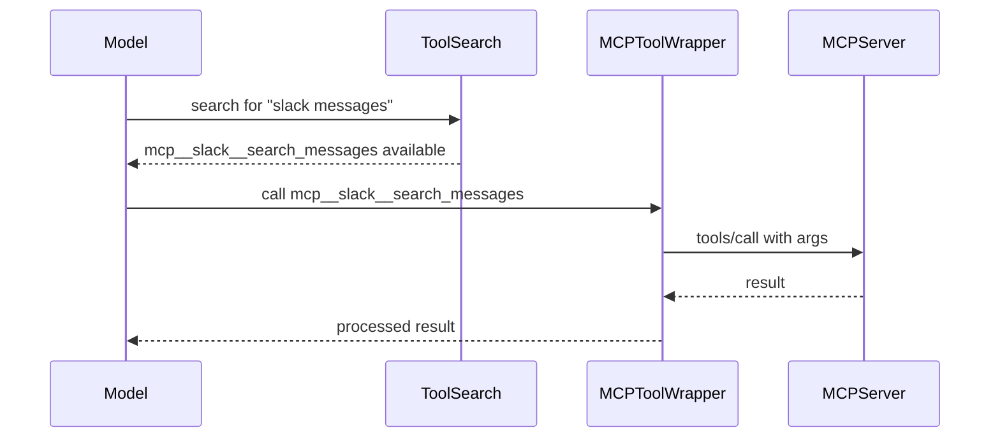
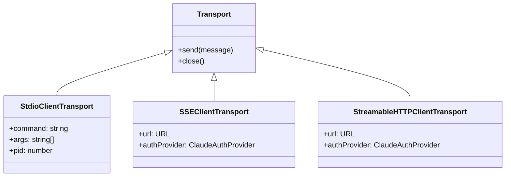

# MCP Tools: Passthrough Permissions and Deferred Loading

## Overview

Claude Code's Model Context Protocol (MCP) integration exposes external tools, resources, and commands from third-party servers to the agent. But unlike built-in tools where cc controls every line of code, MCP tools arrive from untrusted processes over network or stdio transports. The harness must solve two opposing constraints: (1) MCP tools must be available so the model can leverage external capabilities, and (2) their untrusted nature demands isolation, deferral, and a permission model that does not grant implicit trust. This chapter examines the three MCP-facing tools -- `MCPTool`, `ListMcpResourcesTool`, and `ReadMcpResourceTool` -- and the `McpAuthTool` used for OAuth-gated servers. It traces how cc implements HER Pattern 9 (Progressive Tool Expansion) through deferred loading, how passthrough permissions avoid over-promising on safety, and how the `ToolSearch` system surfaces MCP tools only when contextually needed.

The design embodies a core harness principle: minimize the model's cognitive surface at startup, then expand it on demand. MCP tools are deferred not via a `shouldDefer` flag on the tool itself, but through the `isMcp: true` property. The `isDeferredTool()` function in `src/tools/ToolSearchTool/prompt.ts:L62-L108` checks `tool.isMcp === true` before examining `tool.shouldDefer`, so all MCP tools are automatically deferred by category. The model discovers deferred tools through `ToolSearchTool`, which lists each by name. This keeps the prompt compact when no MCP interaction is needed, and expands the surface only when the task requires it.

## Data structures and contracts

### MCPTool: the passthrough shell

`MCPTool` in `src/tools/MCPTool/MCPTool.ts` is a minimal scaffold. It does not implement real tool logic; instead, it serves as a template that `fetchToolsForClient` in `src/services/mcp/client.ts` clones for each discovered MCP tool:

```typescript
// src/tools/MCPTool/MCPTool.ts:L27-L61
export const MCPTool = buildTool({
  isMcp: true,
  isOpenWorld() {
    return false
  },
  name: 'mcp',
  maxResultSizeChars: 100_000,
  async description() {
    return DESCRIPTION
  },
  async prompt() {
    return PROMPT
  },
  get inputSchema(): InputSchema {
    return inputSchema()
  },
  get outputSchema(): OutputSchema {
    return outputSchema()
  },
  async call() {
    return {
      data: '',
    }
  },
  async checkPermissions(): Promise<PermissionResult> {
    return {
      behavior: 'passthrough',
      message: 'MCPTool requires permission.',
    }
  },
  // ...
})
```

Key observations: `inputSchema` uses `z.object({}).passthrough()`, allowing any key-value input because MCP tools define their own schemas. The `call()` method returns empty data -- it is overridden per-tool at connection time in `src/services/mcp/client.ts:L1833-L1971`. The `checkPermissions()` returns `behavior: 'passthrough'` with a suggestion to add a permission rule, meaning every MCP tool invocation goes through the standard permission pipeline but defaults to requiring user approval unless a rule explicitly allows it. Note that `MCPTool` does not set `shouldDefer: true`; instead, deferral is determined by the `isMcp: true` property, which `isDeferredTool()` in `src/tools/ToolSearchTool/prompt.ts:L62-L108` checks: `if (tool.isMcp === true) return true`. This means all MCP tools are automatically deferred regardless of any `shouldDefer` flag.

### The per-tool override in fetchToolsForClient

When `fetchToolsForClient` discovers tools from a connected MCP server, it spreads `MCPTool` as the base and overrides each field with server-specific values:

```typescript
// src/services/mcp/client.ts:L1766-L1799
return toolsToProcess
        .map((tool): Tool => {
  const fullyQualifiedName = buildMcpToolName(client.name, tool.name)
  return {
    ...MCPTool,
    name: skipPrefix ? tool.name : fullyQualifiedName,
    mcpInfo: { serverName: client.name, toolName: tool.name },
    isMcp: true,
    searchHint:
      typeof tool._meta?.['anthropic/searchHint'] === 'string'
        ? tool._meta['anthropic/searchHint'].replace(/\s+/g, ' ').trim() || undefined
        : undefined,
    alwaysLoad: tool._meta?.['anthropic/alwaysLoad'] === true,
    async description() {
      return tool.description ?? ''
    },
    async prompt() {
      const desc = tool.description ?? ''
      return desc.length > MAX_MCP_DESCRIPTION_LENGTH
        ? desc.slice(0, MAX_MCP_DESCRIPTION_LENGTH) + '… [truncated]'
        : desc
    },
    isConcurrencySafe() {
      return tool.annotations?.readOnlyHint ?? false
    },
    isReadOnly() {
      return tool.annotations?.readOnlyHint ?? false
    },
    // ...
  }
})
```

The `fullyQualifiedName` follows the `mcp__<server>__<tool>` convention (e.g., `mcp__slack__search_messages`). The `mcpInfo` field carries the server/tool pair so the permission system can match rules while the dispatch pipeline knows which MCP server to route the call to. The `searchHint` and `alwaysLoad` fields come from the `_meta` annotation on the MCP tool definition, giving server authors a way to control progressive disclosure.

### ListMcpResourcesTool and ReadMcpResourceTool

These two tools expose MCP's resources protocol. `ListMcpResourcesTool` in `src/tools/ListMcpResourcesTool/ListMcpResourcesTool.ts` takes an optional `server` filter and returns an array of resource descriptors:

```typescript
// src/tools/ListMcpResourcesTool/ListMcpResourcesTool.ts:L15-L35
const inputSchema = lazySchema(() =>
  z.object({
    server: z.string().optional().describe('Optional server name to filter resources by'),
  }),
)
const outputSchema = lazySchema(() =>
  z.array(
    z.object({
      uri: z.string().describe('Resource URI'),
      name: z.string().describe('Resource name'),
      mimeType: z.string().optional().describe('MIME type of the resource'),
      description: z.string().optional().describe('Resource description'),
      server: z.string().describe('Server that provides this resource'),
    }),
  ),
)
```

The tool's prompt in `src/tools/ListMcpResourcesTool/prompt.ts` defines two exported constants. `DESCRIPTION` provides a short summary for the tool registry: "Lists available resources from configured MCP servers." `PROMPT` provides the model-facing prompt that describes the `server` parameter (optional, for filtering by server name) and explains that each returned resource includes all standard MCP resource fields plus a `server` field indicating which server the resource belongs to. The prompt includes two usage examples: `listMcpResources` (all servers) and `listMcpResources({ server: "myserver" })` (specific server).

The tool's UI rendering in `src/tools/ListMcpResourcesTool/UI.tsx` uses Ink's `MessageResponse` and `OutputLine` components. The `renderToolUseMessage` function displays either "List MCP resources from server X" or "List all MCP resources" depending on whether a server filter is provided. The `renderToolResultMessage` function formats the output as pretty-printed JSON via `jsonStringify` and renders it through `OutputLine`, or shows "(No resources found)" in a dimmed `Text` component when the result array is empty.

`ReadMcpResourceTool` in `src/tools/ReadMcpResourceTool/ReadMcpResourceTool.ts` takes a `server` name and `uri` and returns the resource content, with special handling for binary blobs:

```typescript
// src/tools/ReadMcpResourceTool/ReadMcpResourceTool.ts:L22-L45
export const inputSchema = lazySchema(() =>
  z.object({
    server: z.string().describe('The MCP server name'),
    uri: z.string().describe('The resource URI to read'),
  }),
)
export const outputSchema = lazySchema(() =>
  z.object({
    contents: z.array(
      z.object({
        uri: z.string().describe('Resource URI'),
        mimeType: z.string().optional().describe('MIME type of the content'),
        text: z.string().optional().describe('Text content of the resource'),
        blobSavedTo: z.string().optional().describe('Path where binary blob content was saved'),
      }),
    ),
  }),
)
```

The prompt in `src/tools/ReadMcpResourceTool/prompt.ts` defines `DESCRIPTION` and `PROMPT` exports similar to its list counterpart. The `DESCRIPTION` summarizes the tool as reading a specific resource from an MCP server, listing the `server` and `uri` parameters. The `PROMPT` provides the model-facing documentation that describes both parameters as required and includes a usage example: `readMcpResource({ server: "myserver", uri: "my-resource-uri" })`.

The UI in `src/tools/ReadMcpResourceTool/UI.tsx` renders tool-use messages as `Read resource "uri" from server "name"`, with a `userFacingName` function returning `readMcpResource`. The `renderToolResultMessage` function handles empty outputs by showing "(No content)" in a dimmed `Text` component wrapped in a `Box` container, and non-empty outputs by formatting them as pretty-printed JSON through `OutputLine`. The `renderToolUseMessage` function returns `null` if either `uri` or `server` is missing from the input, providing a graceful degradation when the model sends an incomplete request.

Both tools have `isMcp: true` (inherited from `MCPTool`), which means they are deferred by `isDeferredTool()`. They also set `isConcurrencySafe: true` and `isReadOnly: true` -- they are read-only, safe to run concurrently, and excluded from the initial prompt.

### Permission result with rule suggestions

The `checkPermissions()` on the per-tool overrides returns a passthrough result that includes a suggestion to add a rule to local settings:

```typescript
// src/services/mcp/client.ts:L1814-L1831
async checkPermissions() {
  return {
    behavior: 'passthrough' as const,
    message: 'MCPTool requires permission.',
    suggestions: [
      {
        type: 'addRules' as const,
        rules: [
          {
            toolName: fullyQualifiedName,
            ruleContent: undefined,
          },
        ],
        behavior: 'allow' as const,
        destination: 'localSettings' as const,
      },
    ],
  }
}
```

This means the first time the model calls an MCP tool, the user sees the permission prompt with a one-click option to auto-approve future calls to that tool by adding a rule. The rule is stored in local settings (not project settings), preventing accidental commits of overly permissive rules.

## Control flow

### Deferred loading and ToolSearch integration

The deferred loading mechanism follows HER Pattern 9: start with fewer than 20 tools, activate more on demand. All three MCP tool types have `isMcp: true`, which causes `isDeferredTool()` in `src/tools/ToolSearchTool/prompt.ts` to return `true`, excluding them from the initial tool list. Instead, they are cataloged by `ToolSearchTool` with their names and optional `searchHint` strings.

The impact on prompt size is substantial. An MCP server exposing 20 tools, each with a 500-character description and a 200-character input schema, would add roughly 14,000 tokens to the system prompt if loaded eagerly. By deferring, those tokens are spent only when the model actually requests the tool. For a session where the user asks cc to refactor a Python module, the Slack MCP tools, the database MCP tools, and the Jira MCP tools remain deferred -- they are never loaded into context.



The `ToolSearchTool` in `src/tools/ToolSearchTool/ToolSearchTool.ts` implements a multi-strategy search over deferred tools. The `searchToolsWithKeywords` function uses a tiered scoring algorithm that examines three signals: the parsed tool name parts, the `searchHint` string, and the tool's description. For MCP tools, the `parseToolName` helper splits the `mcp__<server>__<tool>` name into searchable parts by stripping the `mcp__` prefix and splitting on `__` and `_`. The algorithm also supports required terms prefixed with `+` (e.g., `+slack send` requires "slack" to appear), and a `select:` prefix for direct tool selection. When the model calls `ToolSearch`, the search matches against these signals, and if the model then requests the deferred tool, the harness loads it into the active tool set. This two-step process ensures that MCP tool schemas and descriptions only consume context tokens when the model actually needs them.

The `alwaysLoad` field from `_meta['anthropic/alwaysLoad']` provides an escape hatch: servers can mark critical tools that should be loaded immediately. The `isDeferredTool()` function checks `alwaysLoad` first -- `if (tool.alwaysLoad === true) return false` -- before checking `isMcp`.

### MCP tool call execution

The `call()` override in `fetchToolsForClient` implements session-retry logic. When an MCP tool call fails with `McpSessionExpiredError`, the code retries once after the connection cache is cleared and a fresh client is obtained:

```typescript
// src/services/mcp/client.ts:L1859-L1922
const startTime = Date.now()
const MAX_SESSION_RETRIES = 1
for (let attempt = 0; ; attempt++) {
  try {
    const connectedClient = await ensureConnectedClient(client)
    const mcpResult = await callMCPToolWithUrlElicitationRetry({
      client: connectedClient,
      clientConnection: client,
      tool: tool.name,
      args,
      meta,
      signal: context.abortController.signal,
      setAppState: context.setAppState,
      onProgress: onProgress && toolUseId
        ? progressData => {
            onProgress({ toolUseID: toolUseId, data: progressData })
          }
        : undefined,
      handleElicitation: context.handleElicitation,
    })
    return { data: mcpResult.content, ... }
  } catch (error) {
    if (error instanceof McpSessionExpiredError && attempt < MAX_SESSION_RETRIES) {
      logMCPDebug(client.name, `Retrying tool '${tool.name}' after session recovery`)
      continue
    }
    // ... error wrapping
    throw error
  }
}
```

The `ensureConnectedClient` function checks whether the memoized connection is still valid. If the cache was cleared (e.g., by an `onclose` handler), it reconnects transparently:

```typescript
// src/services/mcp/client.ts:L1688-L1704
export async function ensureConnectedClient(
  client: ConnectedMCPServer,
): Promise<ConnectedMCPServer> {
  if (client.config.type === 'sdk') {
    return client
  }
  const connectedClient = await connectToServer(client.name, client.config)
  if (connectedClient.type !== 'connected') {
    throw new TelemetrySafeError_I_VERIFIED_THIS_IS_NOT_CODE_OR_FILEPATHS(
      `MCP server "${client.name}" is not connected`,
      'MCP server not connected',
    )
  }
  return connectedClient
}
```

### Connection lifecycle and reconnection

The MCP client manages the full connection lifecycle in `src/services/mcp/client.ts`. The `connectToServer` function is memoized by a cache key derived from the server name and configuration. When the server disconnects, the `onclose` handler clears both the connection cache and the downstream fetch caches:

```typescript
// src/services/mcp/client.ts:L1374-L1397
client.onclose = () => {
  const key = getServerCacheKey(name, serverRef)
  fetchToolsForClient.cache.delete(name)
  fetchResourcesForClient.cache.delete(name)
  fetchCommandsForClient.cache.delete(name)
  if (feature('MCP_SKILLS')) {
    fetchMcpSkillsForClient!.cache.delete(name)
  }
  connectToServer.cache.delete(key)
}
```

This cache-clearing is critical: without it, a reconnection would return stale tools from the old connection, which may have a different tool set if the server was updated between connections. The fetch caches are keyed by server name (stable across reconnects) rather than by connection object identity, so they must be explicitly invalidated.

The connection error handler implements a counter for terminal connection errors. After `MAX_ERRORS_BEFORE_RECONNECT = 3` consecutive terminal errors, the handler closes the transport, which triggers `onclose`. The terminal error classification at `src/services/mcp/client.ts:L1249-L1263` checks for specific network error substrings (`ECONNRESET`, `ETIMEDOUT`, `EPIPE`, `EHOSTUNREACH`, `ECONNREFUSED`, `Body Timeout Error`, `terminated`, `SSE stream disconnected`, `Failed to reconnect SSE stream`), mapping error messages to deterministic reconnection decisions without heuristics or timeouts.

### Transport selection at connection time

The `connectToServer` function selects the transport based on the server configuration type. The MCP SDK provides several standard transports:



For `stdio` servers, cc spawns a child process using `StdioClientTransport`. For `sse` and `http` servers, it creates network transports with OAuth via `ClaudeAuthProvider`. The `claudeai-proxy` type routes through Anthropic's MCP proxy. The `wrapFetchWithTimeout` function wraps every fetch call with a fresh 60-second timeout, avoiding a bug where a single `AbortSignal.timeout()` becomes stale after 60 seconds.

### Resource listing with LRU caching

`ListMcpResourcesTool.call()` iterates over connected MCP clients, calls `ensureConnectedClient` and `fetchResourcesForClient` for each, and collects results. The `fetchResourcesForClient` function is LRU-cached by server name, so repeated listings do not hit the MCP server:

```typescript
// src/tools/ListMcpResourcesTool/ListMcpResourcesTool.ts:L66-L101
async call(input, { options: { mcpClients } }) {
  const { server: targetServer } = input
  const clientsToProcess = targetServer
    ? mcpClients.filter(client => client.name === targetServer)
    : mcpClients
  if (targetServer && clientsToProcess.length === 0) {
    throw new Error(
      `Server "${targetServer}" not found. Available servers: ${mcpClients.map(c => c.name).join(', ')}`,
    )
  }
  const results = await Promise.all(
    clientsToProcess.map(async client => {
      if (client.type !== 'connected') return []
      try {
        const fresh = await ensureConnectedClient(client)
        return await fetchResourcesForClient(fresh)
      } catch (error) {
        logMCPError(client.name, errorMessage(error))
        return []
      }
    }),
  )
  return { data: results.flat() }
}
```

If one server's reconnection fails, the error is logged but does not sink the entire result -- the tool returns whatever resources could be fetched from the remaining servers.

### Binary blob persistence in ReadMcpResourceTool

`ReadMcpResourceTool` intercepts binary blob responses from MCP servers. Instead of injecting raw base64 into the model's context (which wastes tokens and is unreadable), it decodes the blob, writes it to disk, and returns a path reference:

```typescript
// src/tools/ReadMcpResourceTool/ReadMcpResourceTool.ts:L106-L139
const contents = await Promise.all(
  result.contents.map(async (c, i) => {
    if ('text' in c) {
      return { uri: c.uri, mimeType: c.mimeType, text: c.text }
    }
    if (!('blob' in c) || typeof c.blob !== 'string') {
      return { uri: c.uri, mimeType: c.mimeType }
    }
    const persistId = `mcp-resource-${Date.now()}-${i}-${Math.random().toString(36).slice(2, 8)}`
    const persisted = await persistBinaryContent(
      Buffer.from(c.blob, 'base64'),
      c.mimeType,
      persistId,
    )
    if ('error' in persisted) {
      return {
        uri: c.uri,
        mimeType: c.mimeType,
        text: `Binary content could not be saved to disk: ${persisted.error}`,
      }
    }
    return {
      uri: c.uri,
      mimeType: c.mimeType,
      blobSavedTo: persisted.filepath,
      text: getBinaryBlobSavedMessage(persisted.filepath, c.mimeType, persisted.size, ...),
    }
  }),
)
```

This is a concrete instance of observation masking: the model receives a compact text reference (file path and size) instead of potentially megabytes of base64 data. The model can then use `FileReadTool` to inspect the file if needed.

## Edge cases and failure modes

### Prompt injection via MCP responses

HER Section 6.13 identifies prompt injection via MCP tool responses as a critical vulnerability. A malicious MCP server can return tool results containing instructions that manipulate agent behavior. The cc codebase addresses this through several layers:

1. **Passthrough permissions**: MCP tools require explicit user approval, preventing automatic execution of untrusted tool outputs.
2. **Content truncation**: The `MAX_MCP_DESCRIPTION_LENGTH` cap of 2048 characters (`src/services/mcp/client.ts:L218`) limits the attack surface of tool descriptions.
3. **Server instructions truncation**: Server instructions from MCP servers are truncated at 2048 characters (`src/services/mcp/client.ts:L1161-L1170`).
4. **Binary blob persistence**: Large or binary outputs are persisted to disk rather than injected into context.
5. **Unicode sanitization**: MCP tool data is passed through `recursivelySanitizeUnicode` before processing (`src/services/mcp/client.ts:L1758`).

Despite these mitigations, cc does not implement full input sanitization on MCP tool results. A compromised MCP server that returns carefully crafted text in a tool result could still influence the model's behavior. This is a known gap documented in HER Section 12.4.

### Connection loss during tool execution

MCP servers can disconnect mid-call. The `connectToServer` memoization cache is cleared on `onclose`, so subsequent calls reconnect transparently. But an in-flight `callTool()` promise rejects with `McpError -32000 "Connection closed"`. The session-retry loop in the `call()` override handles `McpSessionExpiredError` but does not automatically retry on generic connection closures -- those propagate as errors to the model, which can decide whether to retry.

### Stale auth caches and the 15-minute TTL

When a remote MCP server returns a 401, cc caches the "needs-auth" state for 15 minutes (`MCP_AUTH_CACHE_TTL_MS` in `src/services/mcp/client.ts:L257`). This prevents repeated failed connection attempts for servers that require manual authentication. But if the user authenticates outside cc (e.g., by running `mcp auth` in another terminal), the cache entry is not invalidated, and cc will skip connection attempts for up to 15 minutes.

The auth cache is stored in a JSON file at `~/.claude/mcp-needs-auth-cache.json` with entries keyed by server name and a timestamp:

```typescript
// src/services/mcp/client.ts:L259-L309
type McpAuthCacheData = Record<string, { timestamp: number }>

function setMcpAuthCacheEntry(serverId: string): void {
  writeChain = writeChain
    .then(async () => {
      const cache = await getMcpAuthCache()
      cache[serverId] = { timestamp: Date.now() }
      const cachePath = getMcpAuthCachePath()
      await mkdir(dirname(cachePath), { recursive: true })
      await writeFile(cachePath, jsonStringify(cache))
      authCachePromise = null
    })
    .catch(() => {})
}
```

The `writeChain` promise serialization prevents concurrent read-modify-write races when multiple servers return 401 in the same batch. After writing, the read cache is invalidated (`authCachePromise = null`) so subsequent reads see the new entry.

### Process cleanup for stdio MCP servers

When a stdio MCP server is shut down, cc follows an escalating signal sequence: SIGINT, then SIGTERM after 100ms, then SIGKILL after another 400ms. The total cleanup time is capped at 600ms to keep the CLI responsive. The implementation at `src/services/mcp/client.ts:L1429-L1530` uses a polling interval (50ms) to detect early process exit and a 600ms absolute failsafe timeout:

```typescript
// src/services/mcp/client.ts:L1435-L1526
logMCPDebug(name, 'Sending SIGINT to MCP server process')
try {
  process.kill(childPid, 'SIGINT')
} catch (error) { /* ... */ }
await new Promise<void>(async resolve => {
  let resolved = false
  const checkInterval = setInterval(() => {
    try { process.kill(childPid, 0) } catch {
      if (!resolved) {
        resolved = true; clearInterval(checkInterval); clearTimeout(failsafeTimeout); resolve()
      }
    }
  }, 50)
  const failsafeTimeout = setTimeout(() => {
    if (!resolved) { resolved = true; clearInterval(checkInterval); resolve() }
  }, 600)
  try {
    await sleep(100)
    if (!resolved) {
      try { process.kill(childPid, 0) } catch { /* already exited */ }
      logMCPDebug(name, 'SIGINT failed, sending SIGTERM')
      try { process.kill(childPid, 'SIGTERM') } catch { /* ... */ }
      await sleep(400)
      if (!resolved) {
        try { process.kill(childPid, 'SIGKILL') } catch { /* ... */ }
      }
    }
  } catch { /* handle errors in escalation */ }
})
```

This escalation is necessary because Docker containers running MCP servers often ignore SIGINT and require SIGTERM for graceful shutdown, while some processes need the final SIGKILL guarantee.

### Resource tool deduplication

When multiple MCP servers support resources, `ListMcpResourcesTool` and `ReadMcpResourceTool` are added only once, alongside the first server that reports resource support (`src/services/mcp/client.ts:L2361-L2364`). This prevents the model from seeing duplicate resource tools in its tool list. However, if the first resource-capable server disconnects, the resource tools remain in the tool list but may fail when the model tries to use them with that server's name.

### Batched connection processing

The `getMcpToolsCommandsAndResources` function in `src/services/mcp/client.ts:L2226-L2403` orchestrates the startup connection of all configured MCP servers. It partitions servers into local (stdio/sdk) and remote (sse/http/claudeai-proxy) groups, then processes each group with its own concurrency limit. Local servers use lower concurrency (`MCP_SERVER_CONNECTION_BATCH_SIZE`, default 3) to avoid process spawning contention, while remote servers use higher concurrency (`MCP_REMOTE_SERVER_CONNECTION_BATCH_SIZE`, default 20).

For each server that connects successfully, the function fetches tools, commands, skills (if feature-gated), and resources in parallel. It also adds the `ListMcpResourcesTool` and `ReadMcpResourceTool` exactly once, when the first resource-capable server is encountered.

### McpAuthTool for OAuth-gated servers

When a remote MCP server requires authentication, cc creates an `McpAuthTool` that appears in the tool list as a placeholder. This tool guides the user through the OAuth flow and, once authentication is complete, triggers a reconnection to the server. The `McpAuthTool` is created by `createMcpAuthTool` in `src/tools/McpAuthTool/McpAuthTool.ts` and is the only tool that appears for servers in the `'needs-auth'` state.

The `createMcpAuthTool` function at `src/tools/McpAuthTool/McpAuthTool.ts:L49-L84` returns a tool object with `name: buildMcpToolName(serverName, 'authenticate')` and `isMcp: true`. Its `checkPermissions()` returns `{ behavior: 'allow' }` -- since the whole point is to let the model invoke the auth flow without additional gating. This makes it the only MCP-derived tool that auto-approves, an intentional design choice: the tool exists solely to bootstrap the loading of the real tools, and gating it behind a permission prompt would create a circular dependency (the user cannot approve the tool without seeing it, but cannot see it without the tool being available).

```typescript
// src/tools/McpAuthTool/McpAuthTool.ts:L49-L84
export function createMcpAuthTool(
  serverName: string,
  config: ScopedMcpServerConfig,
): Tool<InputSchema, McpAuthOutput> {
  const url = getConfigUrl(config)
  const transport = config.type ?? 'stdio'
  const location = url ? `${transport} at ${url}` : transport
  const description =
    `The \`${serverName}\` MCP server (${location}) is installed but requires authentication. ` +
    `Call this tool to start the OAuth flow — you'll receive an authorization URL to share with the user. ` +
    `Once the user completes authorization in their browser, the server's real tools will become available automatically.`
  return {
    name: buildMcpToolName(serverName, 'authenticate'),
    isMcp: true,
    mcpInfo: { serverName, toolName: 'authenticate' },
    isEnabled: () => true,
    isConcurrencySafe: () => false,
    isReadOnly: () => false,
    toAutoClassifierInput: () => serverName,
    userFacingName: () => `${serverName} - authenticate (MCP)`,
    maxResultSizeChars: 10_000,
    renderToolUseMessage: () => `Authenticate ${serverName} MCP server`,
    async description() { return description },
    async prompt() { return description },
    get inputSchema(): InputSchema { return inputSchema() },
    async checkPermissions(input): Promise<PermissionDecision> {
      return { behavior: 'allow', updatedInput: input }
    },
    // ...
  }
}
```

The `call()` method starts `performMCPOAuthFlow` with `skipBrowserOpen: true` and captures the authorization URL via a `resolveAuthUrl` callback wired into the `onAuthorizationUrl` parameter. The URL is returned to the model immediately as `{ status: 'auth_url', authUrl }`, while the OAuth flow continues in the background. The `call()` method handles three transport cases: for `claudeai-proxy` servers it returns `{ status: 'unsupported' }` directing the user to `/mcp`, for non-HTTP transports (stdio, sdk) it also returns `{ status: 'unsupported' }` since OAuth only applies to `sse` and `http` transports, and for supported transports it starts the OAuth flow. If the flow completes without needing a URL (e.g., silent auth with cached IdP tokens), the tool returns `{ status: 'auth_url', message: 'Authentication completed silently...' }`.

Once authentication completes, the tool's background continuation clears the auth cache and calls `reconnectMcpServerImpl`, which swaps the real tools into `appState.mcp.tools` using prefix-based replacement:

```typescript
// src/tools/McpAuthTool/McpAuthTool.ts:L137-L166
void oauthPromise
  .then(async () => {
    clearMcpAuthCache()
    const result = await reconnectMcpServerImpl(serverName, config)
    const prefix = getMcpPrefix(serverName)
    setAppState(prev => ({
      ...prev,
      mcp: {
        ...prev.mcp,
        clients: prev.mcp.clients.map(c =>
          c.name === serverName ? result.client : c,
        ),
        tools: [
          ...reject(prev.mcp.tools, t => t.name?.startsWith(prefix)),
          ...result.tools,
        ],
        commands: [
          ...reject(prev.mcp.commands, c => c.name?.startsWith(prefix)),
          ...result.commands,
        ],
        resources: result.resources
          ? { ...prev.mcp.resources, [serverName]: result.resources }
          : prev.mcp.resources,
      },
    }))
  })
```

The `reject` call removes any existing tools matching the `mcp__<server>__` prefix (including the `McpAuthTool` itself, which shares that prefix), then appends the newly connected tools. For `claudeai-proxy` servers, the tool returns `{ status: 'unsupported' }` and instructs the model to direct the user to `/mcp`, since those connectors use a separate auth flow handled by the `MCPRemoteServerMenu` UI component.

The auth-caching mechanism in `src/services/mcp/client.ts:L280-L316` prevents cc from repeatedly attempting to connect to servers that have recently returned 401. The `isMcpAuthCached` function checks whether a server's needs-auth entry is still within the 15-minute TTL. If so, the server is skipped during the batch connection process, and only the `McpAuthTool` is added to the tool list. This avoids wasting network round-trips on servers that cannot succeed until the user authenticates.

### MCP tools during context compaction

When the compaction subsystem runs (Chapter 28), MCP tools are classified alongside built-in tools. The compaction logic in `src/services/compact/compact.ts` does not special-case MCP tools for collapse; instead, it applies the same tool-result summarization rules regardless of whether the tool is built-in or MCP-sourced. However, the larger result sizes typical of MCP tools (database query results, API responses) make them more likely candidates for the large-output persistence path described in the next section. During micro-compaction, MCP tool results that have already been persisted to disk are represented by their file path reference, which compacts efficiently. The `isMcp: true` flag on each MCP tool wrapper ensures that the compaction logic can distinguish MCP tool results from built-in tool results when needed for logging and analytics, even though the core compaction algorithm treats them uniformly.

The UI collapse classification for MCP tools follows a different path. The `classifyMcpToolForCollapse` function in `src/tools/MCPTool/classifyForCollapse.ts` categorizes each MCP tool as search, read, or neither. This classification drives the terminal UI's decision to collapse verbose tool results into a single line. The function uses explicit per-tool allowlists -- `SEARCH_TOOLS` and `READ_TOOLS` are `Set<string>` instances containing over 500 normalized tool names across 30+ MCP server implementations (Slack, GitHub, Linear, Datadog, Sentry, Notion, Gmail, Google Drive, Atlassian, Asana, and many more).

The classification works by normalizing the tool name (converting camelCase and kebab-case to snake_case) and checking membership in the appropriate set. The `normalize` function at `src/tools/MCPTool/classifyForCollapse.ts:L588-L593` applies two transformations: splitting CamelCase words with underscores and replacing hyphens with underscores. The server name is passed as a parameter but currently unused (`_serverName`), reserved for future server-scoped classification. Unknown tool names return `{ isSearch: false, isRead: false }`, a conservative default that avoids collapsing results the user might need to see in full. The `isSearchOrReadCommand()` method on each MCP tool wrapper delegates to this classifier, so the UI layer can decide how to render tool results independently of the compaction subsystem.

### ToolSearch keyword matching for MCP tools

The `searchToolsWithKeywords` function in `src/tools/ToolSearchTool/ToolSearchTool.ts:L186-L302` implements the search algorithm that surfaces MCP tools when the model needs them. The algorithm handles MCP tools differently from built-in tools at several points:

First, the `parseToolName` function at `src/tools/ToolSearchTool/ToolSearchTool.ts:L132-L161` recognizes MCP tools by the `mcp__` prefix and splits the name differently. For an MCP tool like `mcp__slack__search_messages`, it strips the `mcp__` prefix, splits on `__` to get `['slack', 'search']`, then further splits each part on `_` to get `['slack', 'search', 'messages']`. This produces searchable tokens from both the server name and the tool action. For regular tools (CamelCase names like `FileReadTool`), it splits on case boundaries and underscores instead.

Second, MCP tools receive a scoring boost. An exact part match on an MCP tool name scores 12 points versus 10 for non-MCP tools. A partial part match scores 6 versus 5. This boost reflects the higher signal value of MCP server names: when the model searches for "slack", it is almost certainly looking for the Slack MCP server's tools, not a built-in tool with "slack" in its description.

Third, the algorithm supports two fast-path shortcuts for MCP tools. If the query exactly matches a deferred tool name (case-insensitive), the tool is returned immediately without scoring. If the query starts with `mcp__` and is longer than 5 characters, the algorithm filters deferred tools by prefix match.

Fourth, the `searchHint` field provides a curated capability phrase that scores 4 points on match (higher than description matches at 2 points). MCP servers can set `searchHint` via the `_meta['anthropic/searchHint']` annotation on their tool definitions, giving server authors a way to improve discoverability without modifying the tool name.

## Where cc diverges from the published pattern

### Passthrough permissions vs. capability-based trust

HER Pattern 9 (Progressive Tool Expansion) recommends starting with a minimal tool set and expanding on demand. cc implements this faithfully through the `isMcp` flag and `ToolSearchTool`. However, the pattern does not prescribe a permission model for expanded tools. cc's choice of "passthrough" permissions -- requiring user approval for every MCP tool call unless a rule explicitly allows it -- is more conservative than some harnesses. For example, Cursor's IDE-integrated permission model auto-approves tools from trusted extensions, while cc treats all MCP servers as untrusted by default.

### No per-server permission scoping

The permission system in cc uses fully qualified tool names (`mcp__<server>__<tool>`) for rule matching. This means a user can allow or deny individual tools, but there is no way to express "trust all tools from server X." Users must add a rule per tool, which becomes cumbersome for servers with many tools. The `checkPermissions()` suggestions include the fully qualified name, making one-click approval possible, but bulk approval requires editing settings manually.

### Description truncation as a safety measure

The `MAX_MCP_DESCRIPTION_LENGTH` of 2048 characters is a practical constraint, not a safety boundary. OpenAPI-generated MCP servers have been observed dumping 15-60 KB of endpoint documentation into `tool.description` (`src/services/mcp/client.ts:L215-L218`). The truncation prevents context bloat, but it also removes potentially useful documentation. The tradeoff favors compact prompts over completeness, aligning with HER's observation that "too many tools is bad" and excess tool descriptions push agents into a degraded performance regime.

### The `mcp__` prefix and tool name normalization

The `buildMcpToolName` function in `src/services/mcp/mcpStringUtils.ts` constructs fully qualified tool names following the `mcp__<server>__<tool>` convention. The `normalizeNameForMCP` function in `src/services/mcp/normalization.ts` sanitizes server and tool names to produce valid identifiers, replacing characters that are not allowed in tool names (spaces, special characters, etc.) with underscores or removing them.

There is an escape hatch for SDK MCP servers: when the `CLAUDE_AGENT_SDK_MCP_NO_PREFIX` environment variable is set, the prefix is skipped, and the original tool name is used directly. This allows SDK MCP tools to override built-in tools by name, which is useful when an SDK consumer wants to replace a default tool with a custom implementation:

```typescript
// src/services/mcp/client.ts:L1761-L1763
const skipPrefix =
  client.config.type === 'sdk' &&
  isEnvTruthy(process.env.CLAUDE_AGENT_SDK_MCP_NO_PREFIX)
```

When the prefix is skipped, the `mcpInfo` field still carries the server/tool pair, so the permission system can match rules against the fully qualified name even though the model invokes the tool by its short name.

### Elicitation handling for MCP servers

MCP servers can send elicitation requests to the client, asking for user input during tool execution. The `callMCPToolWithUrlElicitationRetry` function in `src/services/mcp/client.ts` wraps the tool call with elicitation handling. When a server sends an elicitation request, cc displays a dialog in the terminal (via the `ElicitationDialog` component) that allows the user to provide the requested input.

The `registerElicitationHandler` in the connection setup registers a default elicitation handler that returns "cancel" during the initialization window (before the UI handler is registered). This prevents elicitation requests from hanging during the brief period between connection establishment and UI setup:

```typescript
// src/services/mcp/client.ts:L1188-L1197
client.setRequestHandler(ElicitRequestSchema, async request => {
  logMCPDebug(name, `Elicitation request received during initialization: ${jsonStringify(request)}`)
  return { action: 'cancel' as const }
})
```

### Large result handling and persistence

When an MCP tool returns a result that exceeds the token budget, cc persists it to disk and returns a reference instead of injecting the full content into the model's context. The `processMCPResult` function in `src/services/mcp/client.ts:L2720-L2799` implements this logic:

1. Transform the result into a normalized format via `transformMCPResult`.
2. Check if the content needs truncation via `mcpContentNeedsTruncation`.
3. If the large-output-files feature is enabled and the content does not contain images, persist it to disk via `persistToolResult`.
4. Return a compact message with the file path and format description, instructing the model to use `FileReadTool` to access the content.

This persistence strategy is a critical optimization for MCP servers that return large structured data (e.g., database query results, API responses). Without it, a single large result could consume the entire context window, leaving no room for the model's reasoning.

## Developer takeaways for building a long-running agent

1. **Defer aggressively, load lazily.** The `isMcp: true` + `isDeferredTool()` + `ToolSearch` pattern keeps the initial prompt compact. For a harness with 60+ tools (the cc baseline), deferring MCP tools reduces startup token cost by thousands of tokens. Implement deferred loading for any tool the model might not need in the first turn. Use a property on the tool object (like `isMcp`) rather than requiring each tool to set a `shouldDefer` flag, so that entire categories of tools can be deferred by policy.

2. **Treat external tools as untrusted.** The passthrough permission model is the correct default for tools whose code you do not control. Never auto-approve MCP tool calls. Instead, provide a smooth UX for adding per-tool permission rules (cc's `suggestions` field in `checkPermissions()` is a good pattern).

3. **Persist large outputs to disk.** Binary blobs and large text results should never be injected verbatim into the model's context. Write them to a temporary file and return a path reference. This is observation masking in action: the model gets enough metadata to decide whether to read the file, without paying the token cost upfront.

4. **Cache connection state with invalidation.** The memoization of `connectToServer` with cache clearing on `onclose` gives you transparent reconnection. But you must also clear the downstream caches (`fetchToolsForClient`, `fetchResourcesForClient`, `fetchCommandsForClient`) because reconnection creates a new connection object whose tools may differ from the stale cache.

5. **Cap descriptions and instructions from untrusted sources.** MCP servers can return arbitrarily long descriptions and instructions. Truncate aggressively (cc uses 2048 characters) to prevent context pollution. Log the truncation so developers can diagnose missing information.

6. **Design for partial failure in batched operations.** When listing resources from multiple MCP servers, one server's failure should not sink the entire result. The `Promise.all` with per-server try/catch in `ListMcpResourcesTool.call()` is a robust pattern for aggregating partial results.

7. **Separate tool identity from tool implementation.** The `MCPTool` base + spread-override pattern cleanly separates the generic tool contract from the server-specific implementation. This makes it straightforward to add new MCP servers without modifying the tool infrastructure.

8. **Provide a self-healing auth flow.** The `McpAuthTool` pattern -- where a pseudo-tool appears in place of the real tools for unauthenticated servers, and the model can trigger OAuth by calling it -- removes the need for the user to leave the session to authenticate. Once authentication completes, the real tools are swapped in automatically via prefix-based replacement in app state.
