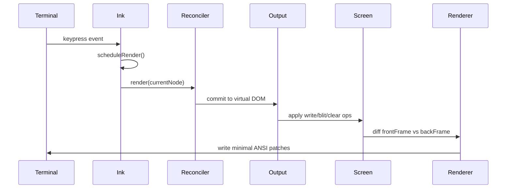
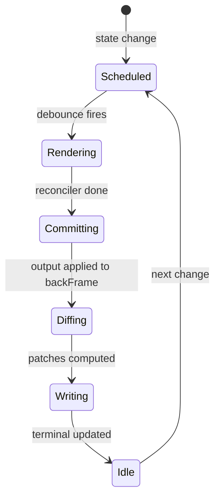
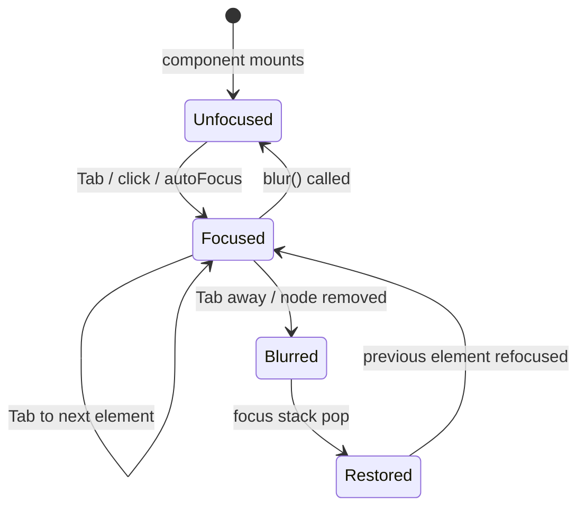
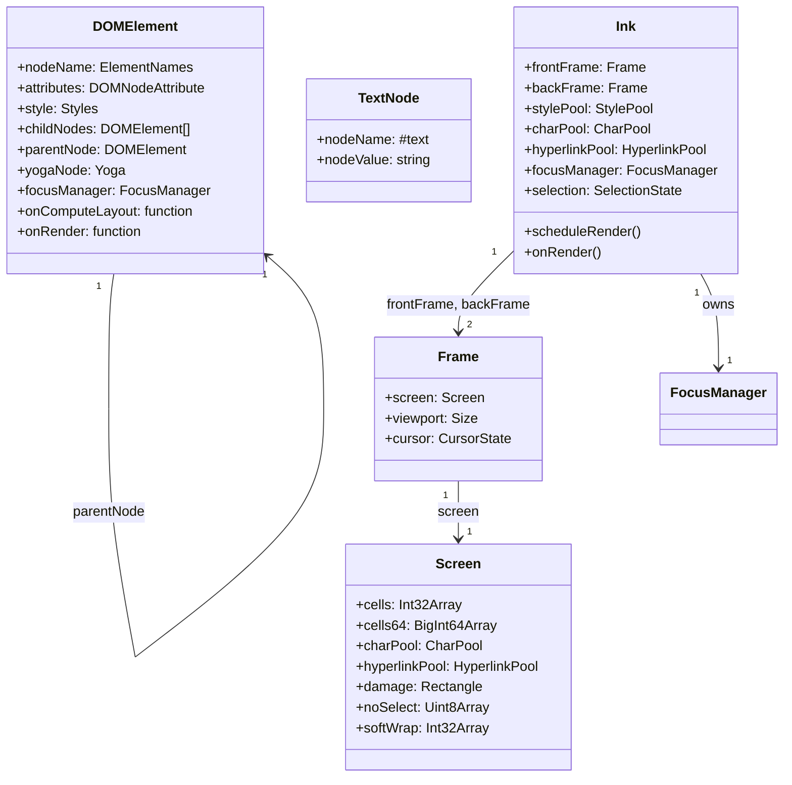

# The Ink Renderer and Terminal Engine

## Overview

Claude Code's user interface runs entirely in the terminal, yet it delivers a rich, interactive experience: syntax-highlighted code, scrollable output, text selection, search highlighting, focus management, and keybinding-driven navigation. This is possible because cc does not use Ink off-the-shelf -- it runs a deeply customized fork that replaces Ink's rendering pipeline with a double-buffered screen differencing engine, a custom Yoga layout integration, and a React reconciler tuned for terminal frame rates. The result is a terminal UI that feels like a native application, not a retro text interface.

HER Section 21's reference architecture identifies Layer 7 as the UX layer: "the harness is the outer runtime layer that orchestrates the model's interactions with tools, permissions, hooks, memory, and the user." The Ink renderer is the primary orchestration surface between the model and the user, and its performance characteristics directly affect the perceived responsiveness of the entire system. A harness that cannot render tokens as they stream, or that flickers on every frame, breaks the real-time feedback loop that makes long-running agents usable.

This chapter examines the four source files that form the rendering spine: `src/ink/ink.tsx` (the top-level Ink class that owns the render loop), `src/ink/screen.ts` (the screen buffer with interned character, style, and hyperlink pools), `src/ink/output.ts` (the operation collector that maps React component trees to screen writes), and `src/ink/Ansi.tsx` (the ANSI escape code parser component). It also covers `src/ink/reconciler.ts` (the custom React reconciler that integrates Yoga layout), `src/ink/renderer.ts` (the diff-to-terminal bridge), and `src/ink/focus.ts` (the DOM-like focus manager). Together, they form a pipeline: React components declare what should appear, the reconciler commits to a virtual DOM, the output engine translates the DOM into write/blit/clear operations on a screen buffer, and the renderer diffs two screen buffers to emit minimal terminal escape sequences.

## Data structures and contracts

### The Ink class: render loop owner

The `Ink` class in `src/ink/ink.tsx` is the orchestrator. It owns the React `FiberRoot`, the `FocusManager`, the `StylePool`, `CharPool`, and `HyperlinkPool`, and two `Frame` objects used for double-buffered diffing:

```typescript
// src/ink/ink.tsx:L76-L179
export default class Ink {
  private readonly log: LogUpdate;
  private readonly terminal: Terminal;
  private scheduleRender: (() => void) & { cancel?: () => void; };
  private isUnmounted = false;
  private isPaused = false;
  private readonly container: FiberRoot;
  private rootNode: dom.DOMElement;
  readonly focusManager: FocusManager;
  private renderer: Renderer;
  private readonly stylePool: StylePool;
  private charPool: CharPool;
  private hyperlinkPool: HyperlinkPool;
  private exitPromise?: Promise<void>;
  private restoreConsole?: () => void;
  private restoreStderr?: () => void;
  private readonly unsubscribeTTYHandlers?: () => void;
  private terminalColumns: number;
  private terminalRows: number;
  private currentNode: ReactNode = null;
  private frontFrame: Frame;
  private backFrame: Frame;
  private lastPoolResetTime = performance.now();
  private drainTimer: ReturnType<typeof setTimeout> | null = null;
  private lastYogaCounters: {
    ms: number;
    visited: number;
    measured: number;
    cacheHits: number;
    live: number;
  } = { ms: 0, visited: 0, measured: 0, cacheHits: 0, live: 0 };
  private altScreenParkPatch: Readonly<{ type: 'stdout'; content: string; }>;
  readonly selection: SelectionState = createSelectionState();
  private searchHighlightQuery = '';
  private searchPositions: {
    positions: MatchPosition[];
    rowOffset: number;
    currentIdx: number;
  } | null = null;
  private readonly selectionListeners = new Set<() => void>();
  private readonly hoveredNodes = new Set<dom.DOMElement>();
  private altScreenActive = false;
  private altScreenMouseTracking = false;
  private prevFrameContaminated = false;
  private needsEraseBeforePaint = false;
  private cursorDeclaration: CursorDeclaration | null = null;
  private displayCursor: { x: number; y: number; } | null = null;
```

The `frontFrame` and `backFrame` are swapped each render: the back frame is written to by the current render, and the front frame holds the previous state for diffing. The `selection` object tracks text selection state (anchor, focus, range) for the alt-screen mode. The `cursorDeclaration` field enables components to declare where the terminal cursor should be parked after each frame, which is critical for IME input (CJK character composition) and screen reader tracking. The `displayCursor` field tracks the physical cursor position after the declared-cursor move, separate from `frame.cursor` which must stay at content-bottom for log-update's relative-move invariants.

### Screen buffer with shared pools

The `Screen` type and its associated pools are defined in `src/ink/screen.ts`. The screen is a 2D grid of cells, where each cell is a packed integer encoding a character ID, style ID, cell width, and hyperlink ID:

```typescript
// src/ink/screen.ts:L21-L53
export class CharPool {
  private strings: string[] = [' ', '']
  private stringMap = new Map<string, number>([[' ', 0], ['', 1]])
  private ascii: Int32Array = initCharAscii()

  intern(char: string): number {
    if (char.length === 1) {
      const code = char.charCodeAt(0)
      if (code < 128) {
        const cached = this.ascii[code]!
        if (cached !== -1) return cached
        const index = this.strings.length
        this.strings.push(char)
        this.ascii[code] = index
        return index
      }
    }
    const existing = this.stringMap.get(char)
    if (existing !== undefined) return existing
    const index = this.strings.length
    this.strings.push(char)
    this.stringMap.set(char, index)
    return index
  }

  get(index: number): string {
    return this.strings[index] ?? ' '
  }
}
```

The `CharPool` interns every unique character string to an integer ID. ASCII characters (code < 128) use a fixed `Int32Array` lookup for O(1) intern speed. Non-ASCII characters (CJK, emoji) fall through to a `Map`. Because the pool is session-lived and shared across all screens, blit operations can copy character IDs directly between screens without re-interning.

The `StylePool` interns arrays of ANSI SGR codes into integer IDs with a bit-0 flag encoding whether the style has a visible effect on space characters (background, inverse, underline). This lets the renderer skip invisible spaces with a single bitmask check:

```typescript
// src/ink/screen.ts:L112-L162
export class StylePool {
  private ids = new Map<string, number>()
  private styles: AnsiCode[][] = []
  private transitionCache = new Map<number, string>()
  readonly none: number

  intern(styles: AnsiCode[]): number {
    const key = styles.length === 0 ? '' : styles.map(s => s.code).join('\0')
    let id = this.ids.get(key)
    if (id === undefined) {
      const rawId = this.styles.length
      this.styles.push(styles.length === 0 ? [] : styles)
      id = (rawId << 1) | (styles.length > 0 && hasVisibleSpaceEffect(styles) ? 1 : 0)
      this.ids.set(key, id)
    }
    return id
  }

  transition(fromId: number, toId: number): string {
    if (fromId === toId) return ''
    const key = fromId * 0x100000 + toId
    let str = this.transitionCache.get(key)
    if (str === undefined) {
      str = ansiCodesToString(diffAnsiCodes(this.get(fromId), this.get(toId)))
      this.transitionCache.set(key, str)
    }
    return str
  }
}
```

The `transition()` method pre-computes the ANSI escape sequence needed to transition from one style to another, cached by `(fromId, toId)` pair. After the first call for a given pair, all subsequent transitions are a single `Map.get` lookup with zero allocations.

### Output: operation collector

The `Output` class in `src/ink/output.ts` collects rendering operations (write, blit, clip, clear, shift) from the React component tree, then applies them to a screen buffer in `get()`:

```typescript
// src/ink/output.ts:L62-L168
export type Operation =
  | WriteOperation
  | ClipOperation
  | UnclipOperation
  | BlitOperation
  | ClearOperation
  | NoSelectOperation
  | ShiftOperation

type WriteOperation = {
  type: 'write'
  x: number
  y: number
  text: string
  softWrap?: boolean[]
}

type BlitOperation = {
  type: 'blit'
  src: Screen
  x: number
  y: number
  width: number
  height: number
}

type ClearOperation = {
  type: 'clear'
  region: Rectangle
  fromAbsolute?: boolean
}
```

The `WriteOperation` carries `softWrap` flags to distinguish line breaks inserted by word-wrap from explicit newlines in the source. This is used by the selection system to reconstruct the logical line structure. The `BlitOperation` copies a region from one screen to another, used for absolute-positioned overlays. The `ClearOperation` with `fromAbsolute: true` handles stale paint from absolutely-positioned nodes that overlay normal-flow siblings.

The `Output` class also maintains a `charCache` that memoizes the tokenization and grapheme-clustering of line strings across frames. Because most lines do not change between renders, the `charCache` turns the expensive tokenize + grapheme-clustering step into a cache hit for the majority of lines:

```typescript
// src/ink/output.ts:L170-L205
export default class Output {
  width: number
  height: number
  private readonly stylePool: StylePool
  private screen: Screen
  private readonly operations: Operation[] = []
  private charCache: Map<string, ClusteredChar[]> = new Map()

  reset(width: number, height: number, screen: Screen): void {
    this.width = width
    this.height = height
    this.screen = screen
    this.operations.length = 0
    resetScreen(screen, width, height)
    if (this.charCache.size > 16384) this.charCache.clear()
  }
}
```

The `charCache` is capped at 16,384 entries to prevent unbounded growth, and cleared entirely when the cap is exceeded. The `reset()` method preserves the `charCache` across frames but zeroes the screen buffer and clears the operation list.

### Ansi component

The `Ansi` component in `src/ink/Ansi.tsx` is the escape hatch for pre-formatted ANSI strings from external tools. It parses ANSI escape codes using the `termio` parser and renders them as a sequence of `Text` components with appropriate styling. The compiled output uses React's compiler runtime (`_c` memo slots) for automatic memoization:

```typescript
// src/ink/Ansi.tsx:L32-L109
export const Ansi = React.memo(function Ansi(t0) {
  const $ = _c(12);
  const { children, dimColor } = t0;
  if (typeof children !== "string") {
    let t1;
    if ($[0] !== children || $[1] !== dimColor) {
      t1 = dimColor ? <Text dim={true}>{String(children)}</Text> : <Text>{String(children)}</Text>;
      $[0] = children; $[1] = dimColor; $[2] = t1;
    } else { t1 = $[2]; }
    return t1;
  }
  if (children === "") { return null; }
  let t1; let t2;
  if ($[3] !== children || $[4] !== dimColor) {
    t2 = Symbol.for("react.early_return_sentinel");
    bb0: {
      const spans = parseToSpans(children);
      if (spans.length === 0) { t2 = null; break bb0; }
      if (spans.length === 1 && !hasAnyProps(spans[0].props)) {
        t2 = dimColor ? <Text dim={true}>{spans[0].text}</Text> : <Text>{spans[0].text}</Text>;
        break bb0;
      }
      // ... map spans to StyledText/Link components
    }
    $[3] = children; $[4] = dimColor; $[5] = t1; $[6] = t2;
  } else { t1 = $[5]; t2 = $[6]; }
  if (t2 !== Symbol.for("react.early_return_sentinel")) { return t2; }
  // ... wrap content in <Text dim={dimColor}>
  return t3;
});
```

The `$` array is the React compiler's memo cache: each slot pair `($[n], $[n+1])` stores the inputs and `($[n+2])` stores the output. When inputs match the cached values, the cached result is reused without re-evaluation. The `Symbol.for("react.early_return_sentinel")` pattern enables early returns from the memoized block without breaking the cache protocol. The `parseToSpans` function merges adjacent spans with identical styling to minimize React element count.

## Control flow

### Keypress to render cycle

The render cycle is triggered by user input (keypress, mouse event) or by state changes from the agent. The flow from keystroke to terminal update goes through several stages:



1. The terminal emits a keypress event (or the model streams a response, or a tool produces output).
2. `Ink.scheduleRender()` is called, debounced to `FRAME_INTERVAL_MS` (typically 16ms for 60fps).
3. The React reconciler processes pending state updates and commits to the virtual DOM.
4. `renderNodeToOutput` walks the DOM tree and collects `Output` operations.
5. `Output.get()` applies the operations to the back-frame screen buffer.
6. The renderer diffs the front frame (previous state) against the back frame (new state).
7. Minimal ANSI escape sequences are written to the terminal to transition from the old state to the new state.

### Double-buffered diffing

The diffing algorithm compares two screen buffers cell-by-cell. For each cell that changed, it emits the style transition (via `StylePool.transition()`) and the character. Because style transitions are cached, most cells require zero allocations. The diff also handles row shifts (when content scrolls) by emitting cursor-move sequences instead of rewriting the entire screen.



The `prevFrameContaminated` flag handles cases where the previous frame's screen buffer cannot be trusted for diffing (e.g., after selection overlay mutations or `forceRedraw()`). When set, the renderer performs a full repaint instead of a diff.

### The custom reconciler and Yoga layout

The original Ink library uses React's built-in reconciler with a custom host config. cc replaces this with a custom reconciler (`src/ink/reconciler.ts`) built on `react-reconciler` that adds performance tracking, commit timing, and deep Yoga layout integration. The reconciler defines a host config that maps React primitives to the terminal DOM: `createNode`, `appendChildNode`, `removeChildNode`, `setAttribute`, `setStyle`, and `setTextNodeValue`. These operations build the virtual DOM tree that the output engine later walks.

The critical addition is the `onComputeLayout` callback, which fires during the React commit phase but before layout effects. The Ink class sets this callback to invoke Yoga's `calculateLayout` synchronously:

```typescript
// src/ink/ink.tsx:L239-L258
this.rootNode.onComputeLayout = () => {
  if (this.isUnmounted) return;
  if (this.rootNode.yogaNode) {
    const t0 = performance.now();
    this.rootNode.yogaNode.setWidth(this.terminalColumns);
    this.rootNode.yogaNode.calculateLayout(this.terminalColumns);
    const ms = performance.now() - t0;
    recordYogaMs(ms);
    const c = getYogaCounters();
    this.lastYogaCounters = { ms, ...c };
  }
};
```

The layout is calculated synchronously during the commit phase, so `useLayoutEffect` hooks have access to fresh layout data. The `recordYogaMs` and `getYogaCounters` functions track layout performance (time, nodes visited, nodes measured, cache hits, live nodes), which is exposed to the debug overlay for profiling render bottlenecks. Layout times exceeding 16ms indicate that the component tree is too deep or too wide for smooth 60fps rendering.

The reconciler also handles style diffing (`diff(before, after)`) to compute minimal attribute updates, markDirty propagation for scroll drain continuation, and devtools integration gated behind `NODE_ENV === 'development'`.

### The renderer: diff-to-terminal bridge

The `createRenderer` function in `src/ink/renderer.ts` is the final stage that transforms the output's screen buffer into a frame. It reuses the `Output` instance across frames so the `charCache` persists. On each call, it:

1. Validates Yoga dimensions (guarding against NaN, negative, or Infinity from invalid layout).
2. Clamps alt-screen height to `terminalRows` (sibling-of-AlternateScreen bugs can cause yogaHeight to exceed rows, which desyncs the cursor model).
3. Resets or creates the `Output`, then calls `renderNodeToOutput` to walk the DOM tree.
4. Calls `output.get()` to apply operations and return the rendered screen.
5. Returns a `Frame` with the screen, viewport dimensions, and cursor position.

The `prevFrameContaminated` flag is consumed here: when true (or when an absolute-positioned node was removed), the previous frame's screen is passed as `undefined` to `renderNodeToOutput`, preventing the blit optimization from copying stale inverted cells. When clean, blit restores the O(unchanged) fast path for steady-state frames (spinner tick, text stream).

The renderer also handles scroll drain: after rendering, it checks `getScrollDrainNode()` and calls `markDirty` on the drain node so the next frame descends into scrollboxes that were cleared during the current render.

### Focus management

The `FocusManager` in `src/ink/focus.ts` provides DOM-like focus management for the terminal UI. It tracks the `activeElement` and a focus stack (capped at `MAX_FOCUS_STACK = 32` entries) for restoration when elements are removed. Focus is propagated through the component tree via a React context: components like `<Box focusable>` declare a `tabIndex` attribute, and Tab/Shift-Tab cycles through focusable elements via `focusNext`/`focusPrevious`.



The `focus()` method dispatches `FocusEvent` with `'blur'` on the previous element and `'focus'` on the new one, mirroring the browser's focus event lifecycle. The `handleNodeRemoved` method is called by the reconciler when a node is removed from the tree: it filters the focus stack to remove the deleted node and any descendants, then dispatches blur and restores focus from the stack. This ensures that removing a focused component (e.g., a tool result that disappears) does not leave the focus system in an orphaned state.

The `collectTabbable` function walks the tree depth-first, collecting all nodes with a numeric `tabIndex >= 0`. The `moveFocus` method cycles through this list, wrapping around at the ends. The `handleAutoFocus` and `handleClickFocus` methods support `autoFocus` and click-to-focus respectively. The `enable()`/`disable()` methods gate all focus operations, used when the Ink instance is paused or in a non-interactive mode.

### Alt-screen mode

When cc enters the interactive REPL, it switches the terminal to alternate screen mode (using the `\x1b[?1049h` escape sequence). This gives cc a private screen buffer that does not share history with the user's shell. In alt-screen mode:

- The cursor is hidden (content fills the screen, no prompt cursor needed).
- Mouse tracking is enabled for click, drag, and hover events.
- Text selection is handled in-process rather than by the terminal emulator.
- The cursor is "parked" at the bottom-right corner after each frame to prevent the terminal from scrolling.

The `altScreenActive` flag gates all alt-screen-specific behavior. When the user exits cc, the terminal is restored to the primary screen buffer.

The alt-screen cursor parking uses a pre-computed patch object to avoid allocations on each frame. Since the cursor position in alt-screen is always at the bottom row, the patch is a simple cursor-position escape sequence:

```typescript
// src/ink/ink.tsx:L45-L66
const ALT_SCREEN_ANCHOR_CURSOR = Object.freeze({
  x: 0,
  y: 0,
  visible: false
})

function makeAltScreenParkPatch(terminalRows: number) {
  return Object.freeze({
    type: 'stdout' as const,
    content: cursorPosition(terminalRows, 1)
  })
}
```

The `Object.freeze` ensures these objects are never accidentally mutated, and the `makeAltScreenParkPatch` factory creates a fresh frozen object when the terminal is resized.

### Synchronized updates for atomic rendering

The renderer uses the BSU/ESU (Begin Synchronized Update / End Synchronized Update) protocol to ensure that multi-patch frame updates appear atomically on the terminal. Without synchronized updates, a frame that requires 10 patches could be partially rendered (showing some patches from the new frame and some from the old frame) if the terminal processes the output in the middle of writing. The BSU/ESU escapes tell the terminal to buffer all output until the ESU is received, then apply it all at once.

This is especially important for resize handling. The `handleResize` method sets `needsEraseBeforePaint = true`, which prepends an ERASE_SCREEN sequence to the next frame's patches inside the BSU/ESU block. Writing ERASE_SCREEN synchronously in the resize handler would leave the screen blank for the approximately 80ms it takes for the next render to complete; deferring it into the atomic block means old content stays visible until the new frame is fully ready.

### Search highlight and selection overlay

The Ink class manages two overlay systems that modify the screen buffer after the content render:

1. **Search highlight**: When the user searches in transcript mode, the `applySearchHighlight` function scans the screen buffer for matching cells and applies an inverse+bold+yellow style. The "current" match gets a distinct yellow background (via the fg-then-inverse swap trick in `StylePool.withCurrentMatch`) so it stands out from other matches.

2. **Text selection**: The `applySelectionOverlay` function applies an inverse style to the selected region of cells. The selection is managed by the `SelectionState` object, which tracks the anchor, focus, and selection range.

Both overlays modify the front-frame screen buffer directly. This creates a problem: the diffing algorithm compares the front frame (which now has overlay styles) against the back frame (which does not), producing incorrect diffs that include the overlay styles as changes. The `prevFrameContaminated` flag forces a full repaint after overlay mutations, ensuring the clean back-frame state is used for the next diff.

## Edge cases and failure modes

### Terminal resize during render

Terminal resize events arrive asynchronously. If a resize occurs mid-render, the front and back frame dimensions become inconsistent. The Ink class handles this by deferring the resize into the next render cycle: `handleResize` sets `needsEraseBeforePaint = true` and updates `terminalColumns`/`terminalRows`, and the next `onRender` prepends an ERASE_SCREEN sequence inside the BSU/ESU (Begin Synchronized Update / End Synchronized Update) block so the clear and repaint are atomic. The `handleResize` method is intentionally not debounced: a debounce would open a window where `stdout.columns` is new but the Yoga dimensions are old, causing log-update to detect a width change and clear the screen, then the debounce fires and clears again (double blank-to-paint flicker).

### Wide characters and grapheme clusters

CJK characters, emoji, and combining marks occupy more than one terminal column. The `Output` class uses a grapheme segmenter to split strings into grapheme clusters, then computes the terminal width of each cluster. The `CellWidth` enum in `screen.ts` marks cells as `Narrow` (1 column), `Wide` (2 columns), `SpacerTail` (the second column of a wide character), or `SpacerHead` (spacer at the end of a soft-wrapped line indicating that a wide character continues on the next line). The diffing algorithm skips spacer cells when writing characters, preventing double-writes that would corrupt the display.

### Pool growth and memory

The `CharPool`, `StylePool`, and `HyperlinkPool` grow monotonically during a session. The `charCache` in `Output` is capped at 16,384 entries to prevent unbounded growth, and the pools are reset periodically (triggered by `lastPoolResetTime`). The `HyperlinkPool` resets every 5 minutes because OSC8 hyperlinks are transient (browser-style link IDs that expire). The `StylePool` is session-lived because styles are stable (the same bold+yellow combination always maps to the same ID).

### Selection overlay contamination

The text selection overlay modifies cells directly on the front-frame screen buffer (applying inverse style). If the next render diffs against this contaminated buffer, the diff incorrectly sees the selection overlay as the "previous" state. The `prevFrameContaminated` flag forces a full repaint after selection mutations, ensuring the clean back-frame state is used for diffing.

### Invalid Yoga dimensions

The renderer guards against invalid Yoga dimensions before creating screen buffers. If `getComputedHeight()` or `getComputedWidth()` returns NaN, Infinity, or a negative number (which can happen when Yoga is called before `calculateLayout()` or when a component tree is malformed), the renderer returns an empty frame with a zero-height screen. This prevents `RangeError` from array allocation with invalid sizes. The invalid dimensions are logged via `logForDebugging` so the `--debug` flag surfaces the root cause.

### Alt-screen height overflow

In alt-screen mode, the renderer clamps the screen height to `terminalRows`. If something renders as a sibling of the `<AlternateScreen>` wrapper (a known bug pattern: `MessageSelector` outside `<FullscreenLayout>`), yogaHeight exceeds rows and every downstream assumption (viewport +1 hack, cursor.y clamp, log-update's heightDelta fast path) breaks, desyncing virtual and physical cursors. The clamping enforces the invariant: overflow writes land at `y >= screen.height` and `setCellAt` drops them. The sibling is invisible (obvious, easy to find) instead of corrupting the whole terminal.

## Where cc diverges from the published pattern

### Style transition caching and the yellow-fg-via-inverse trick

The `StylePool.withCurrentMatch` method implements a clever visual trick for highlighting the current search match. It filters both foreground and background from the base style, then adds yellow-fg, inverse, bold, and underline codes. When the terminal renders these codes, the inverse swaps foreground and background, so the yellow foreground becomes a yellow background. This gives the current match a distinctive yellow highlight that stands out from other inverse-only matches:

```typescript
// src/ink/screen.ts:L189-L220
private currentMatchCache = new Map<number, number>()
withCurrentMatch(baseId: number): number {
  let id = this.currentMatchCache.get(baseId)
  if (id === undefined) {
    const baseCodes = this.get(baseId)
    const codes = baseCodes.filter(
      c => c.endCode !== '\x1b[39m' && c.endCode !== '\x1b[49m',
    )
    codes.push(YELLOW_FG_CODE)
    if (!baseCodes.some(c => c.endCode === '\x1b[27m'))
      codes.push(INVERSE_CODE)
    if (!baseCodes.some(c => c.endCode === '\x1b[22m')) codes.push(BOLD_CODE)
    if (!baseCodes.some(c => c.endCode === '\x1b[24m'))
      codes.push(UNDERLINE_CODE)
    id = this.intern(codes)
    this.currentMatchCache.set(baseId, id)
  }
  return id
}
```

The method filters both foreground and background from the base style so the yellow-via-inverse is unambiguous. Without this filtering, a cell with an explicit background (like the user-prompt grey box) would produce inconsistent results across terminals when inverted with yellow. The underline code is added as an unambiguous visible marker because yellow-bg can clash with existing bg styling -- if you see underline but no yellow on a match, the overlay is finding it; the yellow is just losing a styling fight.

### Custom reconciler vs. Ink's built-in

The original Ink library uses React's built-in reconciler with a custom host config. cc replaces this with a custom reconciler (`src/ink/reconciler.ts`) that adds performance tracking, commit timing, and Yoga layout integration. This divergence is necessary because Ink's original reconciler does not support the double-buffered screen model or the operation-based rendering pipeline. The cc reconciler integrates `onComputeLayout` into the commit phase, ensuring that `useLayoutEffect` hooks (notably `useDeclaredCursor`) have access to fresh layout data before the render proceeds. Without this integration, the native cursor would lag one commit behind, breaking IME input for CJK characters.

### Screen differencing vs. full repaint

Standard terminal UI libraries (including upstream Ink) repaint the entire screen on each frame. cc's double-buffered diffing emits only the cells that changed, reducing the number of bytes written to the terminal by an order of magnitude. This is critical for cc's real-time streaming output, where the model produces tokens at 30-60 per second and each token triggers a render. HER Section 21's Layer 7 (Multi-Agent Coordination) notes that "the harness is the outer runtime layer that orchestrates the model's interactions with tools, permissions, hooks, memory, and the user" -- a harness that cannot render faster than the model streams breaks the real-time feedback loop and degrades the perceived quality of the entire system, regardless of how well the underlying agent logic works.

### Interned pools vs. string-per-cell

The use of `CharPool`, `StylePool`, and `HyperlinkPool` with integer IDs instead of per-cell string storage is a significant memory optimization. A screen of 80x24 cells stored as strings would require ~1920 string allocations per frame; with interned IDs, the same screen requires 1920 integer writes plus a shared string table. The diffing algorithm compares integers (O(1)) instead of strings (O(n)), and the `StylePool.transition()` cache eliminates redundant SGR sequence generation.

### Packed cell layout: two Int32s per cell

The `Screen` type stores cell data in a packed `Int32Array` rather than as per-cell objects. Each cell occupies two consecutive Int32 elements: `word0` holds the character ID (full 32 bits, an index into `CharPool`), and `word1` packs style ID (bits 31-17), hyperlink ID (bits 16-2), and cell width (bits 1-0) into a single integer:

```typescript
// src/ink/screen.ts:L332-L348
const STYLE_SHIFT = 17
const HYPERLINK_SHIFT = 2
const HYPERLINK_MASK = 0x7fff // 15 bits
const WIDTH_MASK = 3 // 2 bits

function packWord1(
  styleId: number,
  hyperlinkId: number,
  width: number,
): number {
  return (styleId << STYLE_SHIFT) | (hyperlinkId << HYPERLINK_SHIFT) | width
}
```

This layout halves memory accesses in the diff loop (2 int loads per cell vs. 4 for separate arrays) and enables future SIMD comparison via `Bun.indexOfFirstDifference`. For a 200x120 terminal, this avoids allocating 24,000 `Cell` objects per frame. An empty/unwritten cell is encoded as two zero words, which a `BigInt64Array.fill(0n)` clears in bulk:

```typescript
// src/ink/screen.ts:L350-L353
const EMPTY_CELL_VALUE = 0n
// Used by BigInt64Array.fill() for bulk clears (resetScreen, clearRegion).
```

The `isEmptyCellByIndex` function checks whether both words are zero, enabling the diff loop to skip unwritten cells without unpacking them into `Cell` view objects. This tight inner-loop optimization is critical because the diff runs on every frame.

### Damage tracking for limited diff

Rather than comparing every cell in the screen buffer on each frame, the `Screen` type maintains a `damage` bounding rectangle that tracks which region of cells was written to (not blitted) during the current render. The diff algorithm iterates only over the damage region, skipping cells that were copied from the previous frame via blit operations. The damage rectangle is expanded by the `unionRect` function when new write or clear operations fall outside the current bounds.

The `Output.get()` method performs two passes over the operation list. Pass 1 expands the damage region to cover all `clear` operations (since cleared cells must be diffed against the previous frame to detect that they changed). Pass 2 applies the actual operations -- writes, blits, shifts, and clips -- to the screen buffer. The two-pass design ensures that `absoluteClears` from absolutely-positioned nodes are collected before blit operations run, preventing stale paint from ghosting through when an absolute overlay shrinks.

### Clip regions and overflow handling

The `Clip` operation implements `overflow: hidden` for terminal UI boxes. When a component's rendered content exceeds its allocated width or height, the clip region restricts write operations to the visible area. Nested clips are intersected using `intersectClip`, which ensures that a child box with its own `overflow: hidden` cannot write outside its parent's clip region:

```typescript
// src/ink/output.ts:L104-L111
function intersectClip(parent: Clip | undefined, child: Clip): Clip {
  if (!parent) return child
  return {
    x1: maxDefined(parent.x1, child.x1),
    x2: minDefined(parent.x2, child.x2),
    y1: maxDefined(parent.y1, child.y1),
    y2: minDefined(parent.y2, child.y2),
  }
}
```

The clip stack is maintained as a simple array: `clip` pushes, `unclip` pops. Each write operation intersects its output with the current clip. Vertical clipping truncates lines, and the special `softWrap[from] === true` check preserves the soft-wrap continuation marker even when the preceding line was clipped, ensuring that the selection system can reconstruct the logical line structure across clip boundaries.

Horizontal clipping handles wide characters (CJK, emoji) by re-slicing when a clip boundary falls on the first cell of a double-wide character. The `sliceAnsi` function includes the entire glyph by default, overflowing the clip by one cell; a single retry with `to - 1` always fits because wide characters are exactly 2 cells.

### Shift operations for scroll

The `ShiftOperation` mirrors what DECSTBM (set scrolling region) and SU/SD (scroll up/scroll down) do in the terminal. When a `ScrollBox` component scrolls, the `shiftRows` function moves cell data within the packed array using `TypedArray.copyWithin`, which is a single memcpy call. The shift is paired with a `blit` that copies the previous frame's content into the newly exposed rows, avoiding a full child re-render for pure scroll:

```typescript
// src/ink/output.ts:L219-L221
shift(top: number, bottom: number, n: number): void {
  this.operations.push({ type: 'shift', top, bottom, n })
}
```

The `softWrap` array is shifted alongside the cell data, preserving the word-wrap continuation markers. When row `r` scrolls off the top and row `r+1` shifts to row `r`, `softWrap[r]` receives the old `softWrap[r+1]`, which correctly records whether the new row `r` is a continuation of what scrolled above.

### NoSelect: exclusion regions for gutters

The `NoSelectOperation` marks a region of cells as excluded from text selection (copy and highlight). This is used by the `<NoSelect>` component to fence off gutters (line numbers, diff sigils) so that click-drag over a diff yields clean, copyable code without the prefix numbers. The `noSelect` bitmap is a `Uint8Array` with one byte per cell, fully reset each frame in `resetScreen`. The `blitRegion` function copies it alongside cells so the blit optimization preserves selection-exclusion marks across frames:

```typescript
// src/ink/screen.ts:L386-L392
noSelect: Uint8Array
// Per-cell noSelect bitmap -- 1 byte per cell, 1 = exclude from text
// selection (copy + highlight). Used by <NoSelect> to mark gutters
// (line numbers, diff sigils) so click-drag over a diff yields clean
// copyable code. Fully reset each frame in resetScreen; blitRegion
// copies it alongside cells so the blit optimization preserves marks.
```

### Selection background: solid color vs. inverse

The `withSelectionBg` method in `StylePool` implements a selection overlay that replaces the cell's background with a solid color while preserving its foreground (color, bold, italic, dim, underline). This matches native terminal selection behavior, which uses a dedicated background color rather than SGR-7 inverse. The inverse approach (used by the search highlight for non-current matches) swaps foreground and background per-cell, which fragments visually over syntax-highlighted text because every foreground color becomes a different background stripe:

```typescript
// src/ink/screen.ts:L244-L258
withSelectionBg(baseId: number): number {
  const bg = this.selectionBgCode
  if (bg === null) return this.withInverse(baseId)
  let id = this.selectionBgCache.get(baseId)
  if (id === undefined) {
    const kept = this.get(baseId).filter(
      c => c.endCode !== '\x1b[49m' && c.endCode !== '\x1b[27m',
    )
    kept.push(bg)
    id = this.intern(kept)
    this.selectionBgCache.set(baseId, id)
  }
  return id
}
```

The method strips any existing background (endCode `\x1b[49m`) and inverse (endCode `\x1b[27m`) from the base style, then pushes the selection background code. This ensures that the selection overlay always appears as a consistent color regardless of the underlying cell's styling. The cache is cleared when `setSelectionBg` is called with a different color (e.g., on theme change).

### Render scheduling: microtask deferral and throttling

The `scheduleRender` function is debounced with `throttle` at `FRAME_INTERVAL_MS` (16ms), with both leading and trailing edges enabled. The leading edge ensures the first state change renders immediately; the trailing edge ensures the last state change in a burst is not dropped. A critical subtlety is that `scheduleRender` defers the actual render to a microtask:

```typescript
// src/ink/ink.tsx:L212-L216
const deferredRender = (): void => queueMicrotask(this.onRender)
this.scheduleRender = throttle(deferredRender, FRAME_INTERVAL_MS, {
  leading: true,
  trailing: true
})
```

The microtask deferral runs `onRender` after React's layout effects have committed. Without this, `useLayoutEffect` hooks (notably the `cursorDeclaration` from `useDeclaredCursor`) would lag one commit behind because `scheduleRender` is called from the reconciler's `resetAfterCommit`, which runs before React's layout phase. The microtask ensures the native cursor tracks the caret without a one-keystroke lag, while staying on the same event-loop tick so throughput is unchanged.

### Terminal handoff: enterAlternateScreen and exitAlternateScreen

The Ink class supports handing the terminal over to an external TUI (such as a git commit editor or `less` pager) and restoring it afterward. The `enterAlternateScreen` method pauses Ink, suspends stdin, and writes escape sequences to disable extended key reporting, disable mouse tracking, enter alternate screen, disable focus reporting, reset attributes, show cursor, clear screen, and home the cursor. The key insight is that editors like `nano` do not speak CSI-u (the Kitty keyboard protocol), so `DISABLE_KITTY_KEYBOARD` must be written before the handoff to prevent "Unknown sequence" errors.

The `exitAlternateScreen` method re-enters alt-screen mode after the external editor exits. This is necessary because terminal editors write their own `smcup/rmcup` (enter/exit alternate screen) sequences, and the editor's `rmcup` on exit drops the terminal back to the main screen. Without re-entering, the `2J` clear would wipe the user's main-screen scrollback, and subsequent renders would land on the main screen. After re-entering, Ink re-enables focus reporting and extended key reporting with a "pop-before-push" strategy on the Kitty keyboard stack, keeping the stack balanced across multiple editor round-trips.

### Selection scroll-following: capture and shift

When the `ScrollBox` auto-follows new content (sticky scroll), the selection must be translated by the same delta so the highlight stays anchored to the text. The `consumeFollowScroll` function reports the scroll delta, and the Ink class calls `shiftAnchor` or `shiftSelectionForFollow` to move the selection endpoints. The `captureScrolledRows` function copies the rows about to scroll off into a `scrolledOffAbove` buffer before they are overwritten, ensuring that text stays copyable until the selection scrolls entirely off the top of the viewport:

```typescript
// src/ink/ink.tsx:L462-L512
const follow = consumeFollowScroll();
if (follow && this.selection.anchor &&
this.selection.anchor.row >= follow.viewportTop && this.selection.anchor.row <= follow.viewportBottom) {
  const { delta, viewportTop, viewportBottom } = follow;
  if (this.selection.isDragging) {
    if (hasSelection(this.selection)) {
      captureScrolledRows(this.selection, this.frontFrame.screen,
        viewportTop, viewportTop + delta - 1, 'above');
    }
    shiftAnchor(this.selection, -delta, viewportTop, viewportBottom);
  } else if (
  !this.selection.focus || this.selection.focus.row >= viewportTop && this.selection.focus.row <= viewportBottom) {
    if (hasSelection(this.selection)) {
      captureScrolledRows(this.selection, this.frontFrame.screen,
        viewportTop, viewportTop + delta - 1, 'above');
    }
    const cleared = shiftSelectionForFollow(this.selection, -delta, viewportTop, viewportBottom);
    if (cleared) for (const cb of this.selectionListeners) cb();
  }
}
```

A guard prevents shifting selections that straddle the scrollbox boundary (one endpoint on scrollbox content, the other on the static footer). Without this guard, the footer endpoint would be clamped to `viewportBottom`, teleporting the highlight from the footer into the scrollbox. The `captureScrolledRows` and `shiftAnchor` calls are a pair: capture grabs rows about to scroll off, shift moves the selection endpoint so the same rows will not intersect again next frame. Capturing without shifting leaves the endpoint in place, causing the same viewport rows to re-intersect every frame and `scrolledOffAbove` to grow without bound.

### log-update: the terminal write provider

The Ink class uses `log-update` (imported as `LogUpdate`) as the final sink for terminal output. The `log-update` module manages the physical cursor position and provides the `done()` method that clears the "currently rendered" line when the application exits. In alt-screen mode, `log-update` is mostly bypassed because the Ink class manages the cursor directly via the `altScreenParkPatch` mechanism. In non-alt-screen (main screen) mode, `log-update` handles the clear-and-rewrite pattern that keeps the Ink output pinned to the bottom of the terminal scrollback.

The `log.reset()` call in `handleResume` clears `log-update`'s internal state after a SIGCONT, preventing stale cursor position data from corrupting the next frame. Similarly, `handleResize` does not call `log.reset()` directly; instead, it sets `needsEraseBeforePaint = true`, which prepends an ERASE_SCREEN to the next frame's BSU/ESU block, ensuring the clear and repaint appear as a single atomic update. This separation between `log-update` and the Ink render pipeline means that `log-update` is only responsible for the physical terminal write, not for the logical screen state.

## The Ink virtual DOM

The Ink rendering pipeline is built around a virtual DOM that maps React components to terminal output. The DOM types are defined in `src/ink/dom.ts`:



The `DOMElement` type is the core node in the virtual DOM tree. Each element has a `yogaNode` for flexbox layout, a `style` object for Ink-specific styling (color, bold, dim, etc.), and `attributes` for properties like `tabIndex`. The `Ink` class owns two `Frame` objects, each containing a `Screen` buffer, viewport dimensions, and cursor state. The reconciler builds the DOM tree, Yoga computes layout, the output engine walks the tree to produce screen operations, and the renderer diffs the resulting screen against the previous frame.

## Developer takeaways for building a long-running agent

1. **Double-buffer your terminal output.** Never repaint the full screen on each frame. Maintain two screen buffers, diff them, and emit only the changes. This reduces terminal I/O by 10x or more and eliminates visible flicker. HER Section 21's Layer 7 notes that the UX layer is the outermost orchestration surface -- a flickering or laggy renderer degrades trust in the entire system.

2. **Intern your data.** Characters, styles, and hyperlinks repeat heavily across frames. Interning them to integer IDs turns string comparisons into integer comparisons and eliminates redundant escape sequence generation. The `StylePool.transition()` cache is especially valuable -- style changes account for the majority of terminal output bytes.

3. **Handle wide characters correctly.** CJK characters and emoji occupy two terminal columns. If your rendering pipeline does not account for this, you will get misaligned output that cascades through the rest of the screen. Use a grapheme segmenter to split strings and compute terminal widths before writing to the screen buffer.

4. **Debounce rendering.** Terminal updates are expensive relative to state changes. Debounce the render schedule to 16ms (60fps) and batch all pending state changes into a single render. This prevents redundant renders when the model streams tokens at high frequency.

5. **Make resize atomic.** Terminal resize events can arrive mid-render. Defer the resize into the next render cycle and use synchronized update escapes (BSU/ESU) to ensure the clear and repaint appear as a single atomic update.

6. **Separate selection from content.** Text selection is an overlay on the screen buffer, not part of the content. Apply it after the content render and track whether the overlay contaminated the previous frame so the diffing algorithm can recover.

7. **Use alt-screen mode for interactive sessions.** The alternate screen buffer gives you a private canvas that does not interfere with the user's shell history. It also enables mouse tracking and in-process text selection, which are essential for a professional terminal UI.

8. **Integrate layout into the commit phase.** Compute flexbox layout synchronously during the React commit phase so that layout-dependent hooks (cursor positioning, measurement) have fresh data. Without this, the cursor lags one commit behind, breaking IME input for CJK characters.

9. **Implement DOM-like focus management.** A focus stack with automatic restoration on node removal prevents orphaned focus states when dynamic content (tool results, messages) appears and disappears. Tab cycling through focusable elements gives keyboard users a navigable interface.
