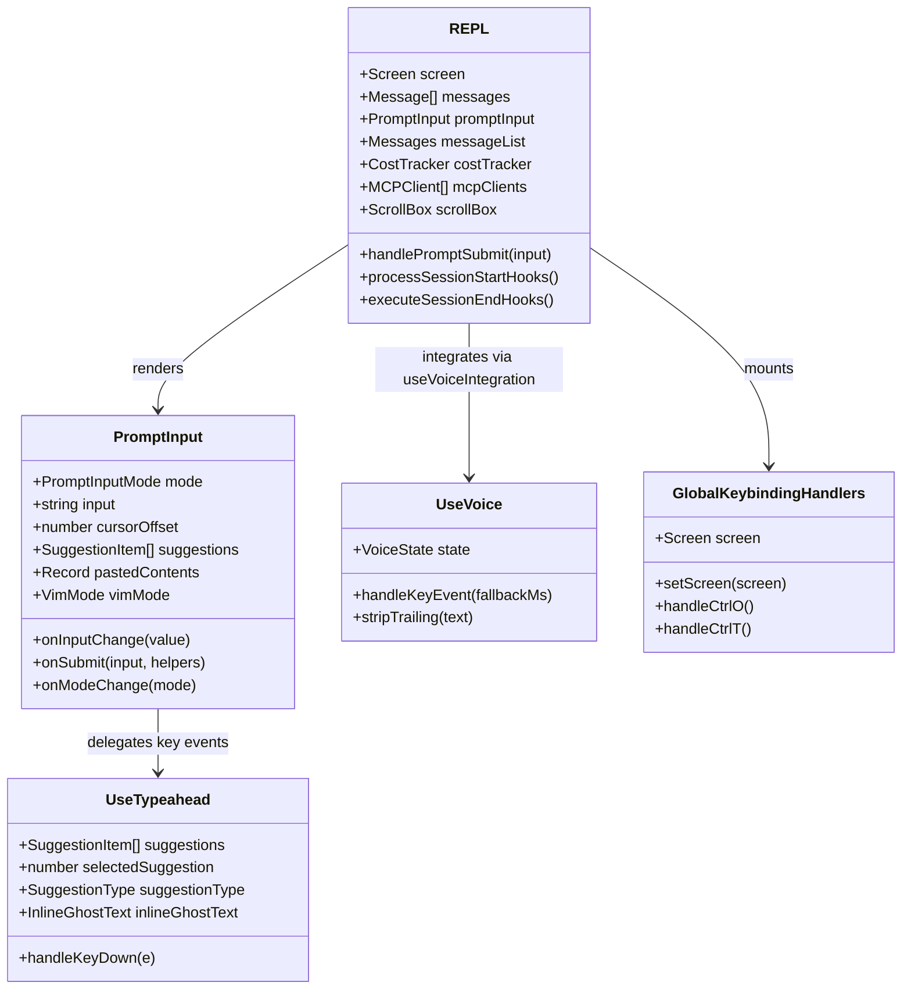
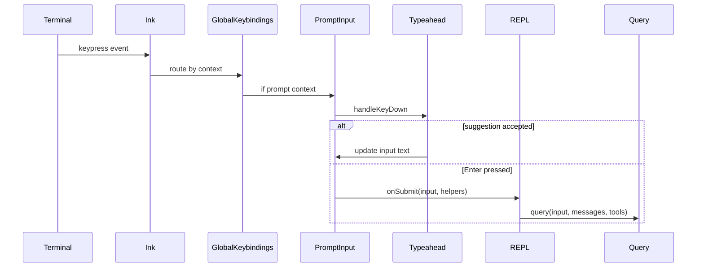
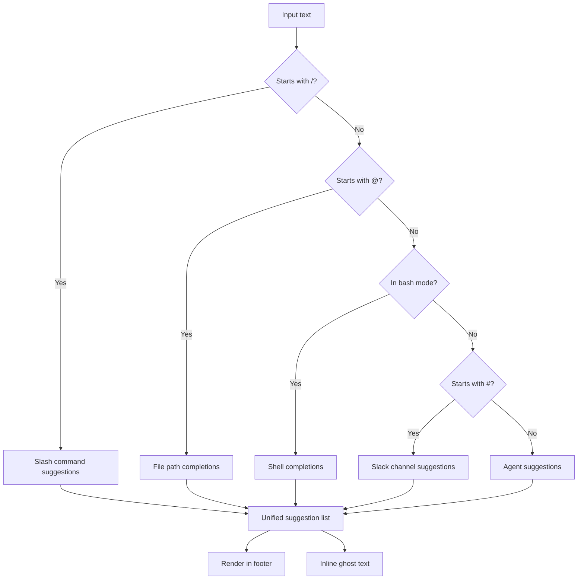
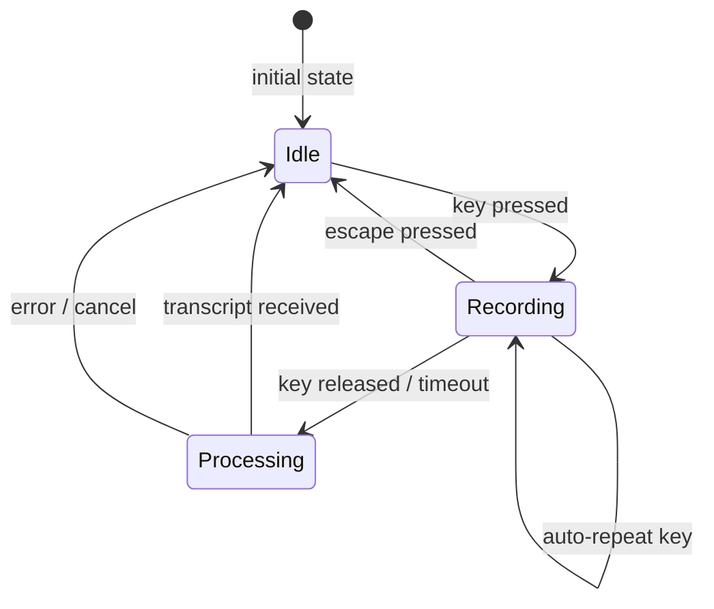

# REPL, PromptInput, Typeahead, Voice, Keybindings

## Overview

The Read-Eval-Print Loop (REPL) is the primary interaction surface between the human operator and the agent. At approximately 5,000 lines of code, `src/screens/REPL.tsx` is the largest single component in cc, orchestrating message display, prompt input, tool permission flows, session management, MCP connections, cost tracking, and dozens of notification hooks. Beneath it sits `src/components/PromptInput/PromptInput.tsx` (~2,300 LOC), the interactive prompt composer that handles text input, mode switching, image pasting, suggestion navigation, and keybinding dispatch. Two powerful hooks complete the interaction layer: `src/hooks/useTypeahead.tsx` (~1,400 LOC) provides context-aware autocomplete for slash commands, file paths, and shell history, while `src/hooks/useVoice.ts` (~1,100 LOC) implements hold-to-talk voice input using Anthropic's `voice_stream` STT endpoint. Together these components embody HER Section 11's human-in-the-loop design patterns: the REPL is the primary channel through which the human operator reviews, approves, and redirects agent actions (HER section 11.2, tiered escalation), and the keybinding, typeahead, and voice systems are configuration surfaces (HER Section 7) that shape how the human interacts with the harness.

This chapter traces the flow from keystroke to model submission, examines the typeahead engine's multi-source suggestion pipeline, details the voice integration's hold-to-talk protocol, and maps the keybinding context system that routes keyboard input to the correct handler based on which UI element has focus.

## Data structures and contracts

### The REPL screen and its state

The `REPL` component manages several distinct screen modes. The `Screen` type (defined in `src/screens/REPL.tsx:L571`) enumerates the possible views:

```typescript
// src/screens/REPL.tsx - Screen type used by keybindings
type Screen = 'prompt' | 'transcript'
```

The primary screen is `'prompt'`, which shows the interactive prompt with streaming model output. The `'transcript'` screen provides a scrollable, searchable view of the full conversation history. Switching between them is handled by `ctrl+o`, registered in `src/hooks/useGlobalKeybindings.tsx`.



The REPL's state is distributed across multiple React hooks and the `AppState` store. Key state fields include:

- `input`: the current prompt text
- `mode`: the `PromptInputMode` (`prompt`, `bash`, `vim`, `agent`)
- `messages`: the conversation history
- `mcpClients`: connected MCP server clients
- `toolPermissionContext`: current permission state for tool gating
- `pastedContents`: clipboard images and text awaiting submission

### PromptInput modes and input handling

`PromptInput` supports multiple input modes, each with distinct behavior:

```typescript
// src/components/PromptInput/PromptInput.tsx:L124-L184
type Props = {
  debug: boolean;
  ideSelection: IDESelection | undefined;
  toolPermissionContext: ToolPermissionContext;
  setToolPermissionContext: (ctx: ToolPermissionContext) => void;
  apiKeyStatus: VerificationStatus;
  commands: Command[];
  agents: AgentDefinition[];
  isLoading: boolean;
  verbose: boolean;
  messages: Message[];
  input: string;
  onInputChange: (value: string) => void;
  mode: PromptInputMode;
  onModeChange: (mode: PromptInputMode) => void;
  mcpClients: MCPServerConnection[];
  pastedContents: Record<number, PastedContent>;
  setPastedContents: React.Dispatch<React.SetStateAction<Record<number, PastedContent>>>;
  vimMode: VimMode;
  setVimMode: (mode: VimMode) => void;
  onSubmit: (input: string, helpers: PromptInputHelpers, speculationAccept?: {...}, options?: {...}) => Promise<void>;
  // ... 30+ additional fields for full configuration surface
};
```

The `mode` field controls the prompt prefix and submission behavior: `'prompt'` mode sends the input to the agent, `'bash'` mode wraps it in a Bash tool call, `'vim'` mode enables modal editing, and `'agent'` mode routes input to a specific subagent. The `suggestionsState` tracks the current typeahead suggestions and which one is selected, enabling Tab/arrow-key navigation through completions.

### PromptInput internal architecture

Internally, `PromptInput` is composed of several sub-components that each handle a distinct aspect of the prompt experience. The `VimTextInput` component wraps the text input with modal editing support, dispatching `VimMode` changes via the `setVimMode` callback. The `PromptInputFooter` renders the status bar below the prompt, showing the current mode indicator, cost, and model name. The `PromptInputFooterSuggestions` component renders the typeahead suggestion list in the footer area, highlighting the selected suggestion and displaying argument hints.

The submission pipeline within `PromptInput` follows a multi-stage process. When the user presses Enter, the component first checks whether the input is a slash command by calling `processSlashCommand`. If the input starts with `/` and matches a registered command, the command's callback is invoked instead of submitting to the model. For bash mode, the input is wrapped in a Bash tool call structure before being passed to `onSubmit`. The `PromptInputHelpers` object passed to `onSubmit` contains utility functions for cursor manipulation, pasted content management, and stash/restore operations that allow the REPL to save and restore the prompt state across mode switches.

The `stashedPrompt` mechanism allows the user to switch to bash mode without losing their current prompt text. When the mode changes from `'prompt'` to `'bash'`, the current input and cursor offset are stashed. When the mode switches back, the stash is restored. This is a small but critical detail: without it, toggling to bash mode for a quick command would erase a half-composed prompt.

### UseTypeahead: multi-source suggestion engine

The `useTypeahead` hook aggregates suggestions from multiple sources into a unified list:

```typescript
// src/hooks/useTypeahead.tsx:L108-L116
type UseTypeaheadResult = {
  suggestions: SuggestionItem[];
  selectedSuggestion: number;
  suggestionType: SuggestionType;
  maxColumnWidth?: number;
  commandArgumentHint?: string;
  inlineGhostText?: InlineGhostText;
  handleKeyDown: (e: KeyboardEvent) => void;
};
```

The `suggestionType` discriminates between different categories (slash commands, file paths, shell completions, Slack channels). The `inlineGhostText` provides inline completion hints that appear as dimmed text after the cursor (similar to GitHub Copilot's ghost text). The `handleKeyDown` function intercepts key events to navigate and accept suggestions.

### UseVoice: hold-to-talk STT integration

The `useVoice` hook implements a hold-to-talk voice input protocol:

```typescript
// src/hooks/useVoice.ts:L143-L155
type VoiceState = 'idle' | 'recording' | 'processing'

type UseVoiceOptions = {
  onTranscript: (text: string) => void
  onError?: (message: string) => void
  enabled: boolean
  focusMode: boolean
}

type UseVoiceReturn = {
  state: VoiceState
  handleKeyEvent: (fallbackMs?: number) => void
}
```

The `VoiceState` transitions from `'idle'` to `'recording'` when the key is held, then to `'processing'` when the key is released and the audio is sent to Anthropic's `voice_stream` endpoint for transcription. The `focusMode` flag keeps the WebSocket connection alive between utterances, reducing latency for continuous voice input. This hold-to-talk design is a concrete instance of HER Section 11's human-in-the-loop principle: the operator must explicitly and continuously signal intent to record, preventing accidental audio capture when the voice key is brushed.

The language normalization system supports 20 languages with both English and native name mappings, plus ASCII transliterations for accents:

```typescript
// src/hooks/useVoice.ts:L42-L89
const LANGUAGE_NAME_TO_CODE: Record<string, string> = {
  english: 'en',
  spanish: 'es',
  español: 'es',
  espanol: 'es',
  french: 'fr',
  français: 'fr',
  francais: 'fr',
  japanese: 'ja',
  日本語: 'ja',
  german: 'de',
  deutsch: 'de',
  portuguese: 'pt',
  português: 'pt',
  portugues: 'pt',
  italian: 'it',
  italiano: 'it',
  korean: 'ko',
  한국어: 'ko',
  hindi: 'hi',
  हिन्दी: 'hi',
  हिंदी: 'hi',
  indonesian: 'id',
  'bahasa indonesia': 'id',
  bahasa: 'id',
  russian: 'ru',
  русский: 'ru',
  polish: 'pl',
  polski: 'pl',
  turkish: 'tr',
  türkçe: 'tr',
  turkce: 'tr',
  dutch: 'nl',
  nederlands: 'nl',
  ukrainian: 'uk',
  українська: 'uk',
  greek: 'el',
  ελληνικά: 'el',
  czech: 'cs',
  čeština: 'cs',
  cestina: 'cs',
  danish: 'da',
  dansk: 'da',
  swedish: 'sv',
  svenska: 'sv',
  norwegian: 'no',
  norsk: 'no',
}
```

### GlobalKeybindingHandlers: context-aware key routing

The `GlobalKeybindingHandlers` component registers keybindings that operate at the application level:

```typescript
// src/hooks/useGlobalKeybindings.tsx:L36-L46
export function GlobalKeybindingHandlers({
  screen,
  setScreen,
  showAllInTranscript,
  setShowAllInTranscript,
  messageCount,
  onEnterTranscript,
  onExitTranscript,
  virtualScrollActive,
  searchBarOpen = false
}: Props): null
```

It renders nothing (`null`) but registers handlers for `ctrl+t` (toggle task list), `ctrl+o` (toggle transcript mode), `ctrl+e` (toggle show all in transcript), and `ctrl+c`/Escape (exit transcript mode). Each handler is registered with a `context` string (`'Global'`) that determines when it is active.

## Control flow

### Keystroke to model submission

The full flow from a keystroke to the model receiving a prompt goes through several layers:



1. The terminal emits a keypress event.
2. The Ink event system routes it to the focused component.
3. `GlobalKeybindingHandlers` checks if the key matches a global shortcut (e.g., `ctrl+o`). If so, it handles it and stops propagation.
4. `PromptInput` receives the key event. It first passes it to `useTypeahead`'s `handleKeyDown` for suggestion navigation.
5. If the typeahead does not consume the event, `PromptInput` handles it directly (character input, cursor movement, mode switching).
6. On Enter, `PromptInput.onSubmit` is called with the final input text.
7. `REPL.onSubmit` processes the input through `handlePromptSubmit`, which handles slash commands, mode prefixes, and agent routing.
8. The input is sent to `query()` in `src/query.ts` for model processing.

### Typeahead suggestion pipeline

The typeahead engine aggregates suggestions from multiple sources based on the current input context. The `useTypeahead` hook examines the input text and cursor position to determine which suggestion sources are relevant. It supports five primary trigger patterns:

1. **Slash commands**: Triggered when the input starts with `/`, matched against the registered command list via `generateCommandSuggestions`. The engine fuzzy-matches the partial command name and returns ranked suggestions with argument hints.

2. **File path completions**: Triggered by `@` followed by a path token, matched against the filesystem via `getPathCompletions`. The `@` prefix distinguishes file references from regular text. Paths with spaces are handled using a quoted syntax (`@"path with spaces"`).

3. **Shell completions**: Triggered in bash mode, providing command names, environment variables, and path completions via `getShellCompletions` and `getShellHistoryCompletion`.

4. **Slack channel suggestions**: Triggered by `#` followed by a channel name pattern, matched against known Slack channels from the Slack MCP server via `getSlackChannelSuggestions`.

5. **Agent suggestions**: When the user is composing a message to a teammate, the engine suggests agent names and descriptions.



For slash commands, the engine calls `generateCommandSuggestions` which fuzzy-matches against the registered command list. For file paths triggered by `@`, it calls `getPathCompletions` which scans the filesystem. In bash mode, it calls `getShellCompletions` which provides command, variable, and path completions. All sources are merged by `generateUnifiedSuggestions` into a single ranked list.

The `applyCommandSuggestion` function handles the insertion of the selected suggestion into the input buffer, replacing the partial token with the full completion. The `commandArgumentHint` field shows the expected arguments for the selected slash command, generated by `generateProgressiveArgumentHint`.

The `findMidInputSlashCommand` function detects slash commands that appear in the middle of input text (not only at the start), enabling suggestions even when the user types additional text after the command name. The `getBestCommandMatch` function ranks command matches by edit distance and prefix length, ensuring the most relevant suggestion appears first.

The file suggestion system uses a background cache refresh mechanism via `startBackgroundCacheRefresh` and an `onIndexBuildComplete` callback. This ensures that file path suggestions are available immediately when the user types `@`, without waiting for a filesystem scan. The cache is invalidated on file system changes and refreshed in the background.

The `applyFileSuggestion` function handles the insertion of file path suggestions, using the `findLongestCommonPrefix` function to enable incremental completion. When the user presses Tab on a partial path that matches multiple files, the common prefix is inserted, reducing the remaining ambiguity.

### Voice input lifecycle

The voice input follows a hold-to-talk protocol. When the voice feature is enabled (gated by the `VOICE_MODE` feature flag), the `useVoiceIntegration` hook integrates with the prompt input system. The hook provides a `handleKeyEvent` function that is called from a keybinding handler, and a `stripTrailing` function that removes trailing whitespace from the transcribed text before insertion:

```typescript
// src/screens/REPL.tsx:L98-L103
const useVoiceIntegration = feature('VOICE_MODE')
  ? require('../hooks/useVoiceIntegration.js').useVoiceIntegration
  : () => ({
      stripTrailing: () => 0,
      handleKeyEvent: () => {},
      resetAnchor: () => {}
    })
```

The conditional require with feature flag ensures that the voice module and its native audio-capture dependency are not loaded in builds that do not support voice input, eliminating the bundle size overhead.



When the user presses the voice key, `handleKeyEvent` is called. The hook starts audio recording and connects to the `voice_stream` WebSocket endpoint. Auto-repeat key events (from holding the key) reset an internal release timer (`RELEASE_TIMEOUT_MS = 200ms`). When no key event arrives within the timeout, recording stops and the audio buffer is sent for transcription. The `FIRST_PRESS_FALLBACK_MS = 2000ms` handles the initial press-to-repeat delay on macOS.

The `focusMode` optimization keeps the WebSocket connection alive between utterances. When the terminal loses focus (user switches to another app), the connection is torn down after `FOCUS_SILENCE_TIMEOUT_MS = 5000ms` of silence, freeing the WebSocket resource.

The `computeLevel` function extracts an RMS audio level from 16-bit PCM buffers for the recording waveform visualizer:

```typescript
// src/hooks/useVoice.ts:L185-L197
export function computeLevel(chunk: Buffer): number {
  const samples = chunk.length >> 1 // 16-bit = 2 bytes per sample
  if (samples === 0) return 0
  let sumSq = 0
  for (let i = 0; i < chunk.length - 1; i += 2) {
    // Read 16-bit signed little-endian
    const sample = ((chunk[i]! | (chunk[i + 1]! << 8)) << 16) >> 16
    sumSq += sample * sample
  }
  const rms = Math.sqrt(sumSq / samples)
  const normalized = Math.min(rms / 2000, 1)
  return Math.sqrt(normalized)
}
```

The `Math.sqrt(normalized)` applies a perceptual curve that spreads quieter levels across more of the visual range, making the 16-bar waveform visualizer responsive even at low volumes.

The voice module is lazy-loaded to avoid triggering the macOS TCC microphone permission prompt at startup:

```typescript
// src/hooks/useVoice.ts:L140-L141
type VoiceModule = typeof import('../services/voice.js')
let voiceModule: VoiceModule | null = null
```

The `voiceModule` variable starts as `null` and is loaded on first use. This is critical because loading the native audio module (`audio-capture-napi`) on macOS triggers a system permission dialog. By deferring the import until the user actually activates voice input, cc avoids surprising the user with a permission prompt during startup.

### REPL message display and virtual scrolling

The REPL uses a virtual scrolling system for the message list. When a session has hundreds of messages, rendering all of them as React components would be prohibitively expensive. Instead, the `Messages` component in `src/components/Messages.tsx` renders only the visible messages plus a buffer above and below the viewport. The `ScrollBox` component manages the scroll position and reports resize events.

The virtual scroll system is integrated with the type-into-empty behavior: when the model is streaming output and the user is scrolled to the bottom, new messages automatically scroll into view. But if the user has scrolled up to read earlier output, the view stays pinned to the current position. The `RECENT_SCROLL_REPIN_WINDOW_MS = 3000` constant prevents the repin from snapping to the bottom if the user has recently scrolled up:

```typescript
// src/screens/REPL.tsx:L303-L305
// Window after a user-initiated scroll during which type-into-empty does NOT
// repin to bottom. Josh Rosen's workflow: Claude emits long output → scroll
// up to read the start → start typing → before this fix, snapped to bottom.
const RECENT_SCROLL_REPIN_WINDOW_MS = 3000
```

This is a concrete example of HER's human-in-the-loop principle: the harness must respect the user's intentional scroll position and not override it with automated behavior, even when the automated behavior seems helpful.

### REPL session lifecycle

The REPL manages the full session lifecycle: startup, message processing, compaction, and shutdown. On startup, it calls `processSessionStartHooks` to execute user-defined hooks at session initialization. During the session, it manages the query loop through the `query` function in `src/query.ts`, processes tool permission requests through the `useCanUseTool` hook, and tracks cost through the `cost-tracker.ts` module.

On shutdown, the REPL calls `executeSessionEndHooks` with a timeout (`getSessionEndHookTimeoutMs`) to ensure hooks complete within a reasonable time. The `gracefulShutdownSync` function handles SIGTERM/SIGINT signals, saving session costs and archiving the session before exiting.

### Bridge and inbox communication

The REPL integrates with the bridge system (`src/bridge/replBridge.ts` and `src/bridge/bridgeMain.ts`) to communicate with external IDE extensions such as VS Code and JetBrains. The bridge operates over a local IPC channel and supports two primary communication patterns: outbound notifications (cc pushes status updates, tool results, and cost data to the IDE) and inbound attachments (the IDE sends selection context, file references, and approval decisions back to cc).

The bridge's inbound attachment system is the mechanism by which IDE extensions inject context into the REPL. When the user selects code in VS Code and triggers a "Send to Claude" action, the selected text is packaged as an `IDESelection` object and delivered to the REPL via the bridge. The REPL then inserts this selection into the prompt input, treating it as a user-provided context attachment. This pathway is gated by the `ideSelection` prop on the REPL component, which is set during bridge initialization.

The bridge also supports a "trusted device" model where the IDE can auto-approve certain tool calls that would normally require explicit user confirmation. This is controlled by the `trusted` flag in the bridge configuration and is a configuration surface (HER Section 7) that shapes the permission behavior without modifying the underlying permission rules.

### MCP integration in the REPL

The REPL directly manages the lifecycle of MCP server connections through the `mcpClients` prop and the `MCPConnectionManager`. On mount, the REPL initializes the configured MCP servers and monitors their connection state. The `useMcpConnectivityStatus` hook (listed in the notification hooks above) watches for disconnections and displays an error notification when a configured server becomes unreachable.

MCP tools are surfaced in the typeahead system through the `ToolSearch` mechanism (see Chapter 15). When the user types a slash command that triggers tool search, the engine queries available MCP tools and returns them as suggestions. This is a concrete example of HER Pattern 9 (Progressive Tool Expansion): MCP tools are not loaded eagerly but are surfaced on demand when the user's input context matches.

The REPL also handles MCP resource browsing through the `ListMcpResourcesTool` and `ReadMcpResourceTool`. When the user navigates to an MCP resource URI (e.g., `mcp://server/resource`), the REPL resolves it through the connected MCP client and displays the content. The `strictMcpConfig` flag controls whether MCP configuration errors are fatal (strict mode) or merely logged (permissive mode), giving enterprise administrators control over how MCP misconfigurations affect the REPL startup.

### Keybinding context system

cc uses a context-aware keybinding system that routes keyboard input to the correct handler. The `useKeybinding` hook registers a handler with a context string (e.g., `'Global'`, `'Transcript'`, `'Prompt'`). When a key event arrives, the system checks handlers in order from most specific context to least specific. A handler registered in `'Transcript'` context takes priority over one in `'Global'` context when the transcript screen is active. This context system is a configuration surface (HER Section 7): keybinding contexts determine which handlers are active, effectively configuring the keyboard interaction layer based on the UI state.

The `GlobalKeybindingHandlers` component demonstrates the pattern: it registers `ctrl+o` in `'Global'` context, but the transcript screen registers its own `ctrl+o` handler in `'Transcript'` context that toggles back to the prompt view. The context system ensures the right handler fires without the components needing to know about each other.

## Edge cases and failure modes

### Auto-repeat key handling in voice mode

Terminal auto-repeat fires key events every 30-80ms while a key is held. The `useVoice` hook uses these auto-repeat events to detect that the key is still held. But on macOS, the initial repeat delay can be up to 2 seconds (with the slider at "Long"). The `FIRST_PRESS_FALLBACK_MS = 2000ms` constant ensures that the release timer is armed even if no auto-repeat event arrives. Without this fallback, a quick tap-and-release that finishes before auto-repeat starts would never stop recording.

### Typeahead suggestion staleness

Suggestions are computed on every input change, but file system scans (`getPathCompletions`) and shell completion requests (`getShellCompletions`) are asynchronous. If the user types quickly, a suggestion from a previous input may arrive after the input has changed. The `getPreservedSelection` function in `useTypeahead.tsx` handles this by preserving the user's selection index when the suggestion list is refreshed:

```typescript
// src/hooks/useTypeahead.tsx:L52-L74
function getPreservedSelection(
  prevSuggestions: SuggestionItem[],
  prevSelection: number,
  newSuggestions: SuggestionItem[],
): number {
  if (newSuggestions.length === 0) return -1
  if (prevSelection < 0) return 0
  const prevSelectedItem = prevSuggestions[prevSelection]
  if (!prevSelectedItem) return 0
  const newIndex = newSuggestions.findIndex(item => item.id === prevSelectedItem.id)
  return newIndex >= 0 ? newIndex : 0
}
```

### Image paste handling

`PromptInput` intercepts bracket-paste mode sequences to detect pasted images. When an image is detected in the clipboard, it is saved to a temporary file and a reference is stored in `pastedContents`. The image is then included as a `ContentBlockParam` in the next user message. The `PASTE_THRESHOLD` constant distinguishes between text paste and image paste based on the data size.

### Vim mode interactions

The `vimMode` state in `PromptInput` enables modal editing (normal, insert, visual modes) via the `VimTextInput` component. In normal mode, keystrokes are interpreted as Vim commands (h/j/k/l for movement, i for insert, etc.) rather than text input. The `useKeybinding` system must be aware of Vim mode to avoid routing Vim navigation keys as global shortcuts. This is handled by the `useOptionalKeybindingContext` hook, which returns a different context when Vim normal mode is active.

### REPL notification system

The REPL component mounts over a dozen notification hooks that monitor system health and prompt the user with actionable alerts. Each hook follows the same pattern: it observes some aspect of the system state (MCP connectivity, IDE status, rate limits, plugin updates, model deprecation) and calls `addNotification` when a condition warrants user attention. The notification system is deliberately decoupled from the REPL's main render path -- notifications render in a separate overlay that does not trigger a full REPL re-render:

```typescript
// src/screens/REPL.tsx:L745-L768
useModelMigrationNotifications()
useCanSwitchToExistingSubscription()
useIDEStatusIndicator({ ideSelection, mcpClients, ideInstallationStatus })
useMcpConnectivityStatus({ mcpClients })
useAutoModeUnavailableNotification()
usePluginInstallationStatus()
usePluginAutoupdateNotification()
useSettingsErrors()
useRateLimitWarningNotification(mainLoopModel)
useFastModeNotification()
useDeprecationWarningNotification(mainLoopModel)
useNpmDeprecationNotification()
useAntOrgWarningNotification()
useInstallMessages()
useChromeExtensionNotification()
useOfficialMarketplaceNotification()
useLspInitializationNotification()
useTeammateLifecycleNotification()
```

The `useRateLimitWarningNotification` hook monitors the API rate limit headers and displays a warning when the remaining quota drops below a threshold. The `useDeprecationWarningNotification` hook checks whether the current model version is deprecated and prompts the user to switch. The `useMcpConnectivityStatus` hook monitors MCP server connections and displays an error when a configured server is unreachable.

### REPL cost tracking and token accounting

The REPL tracks the cost of each API call through the `cost-tracker.ts` module, which accumulates input token counts, output token counts, and cache read/write token counts across all turns. The cost tracker is initialized on REPL mount and updated after each model response. The `useAppState` hook exposes the cost data to the UI for display in the status bar.

The cost tracking integrates with the session archive system: when a session is archived, the total cost is written to the session metadata. This allows the claude.ai web UI to display per-session cost breakdowns. The `gracefulShutdownSync` function ensures that the final cost is written before the process exits, even on SIGTERM/SIGINT.

### Command queue and startup hooks

The REPL processes a command queue on mount, enabling CLI arguments and IDE extensions to inject initial commands (such as `/remote-control` or `/compact`) before the first user interaction. The `useCommandQueue` hook returns the queued commands and clears them after processing:

```typescript
// src/screens/REPL.tsx:L625
const queuedCommands = useCommandQueue()
```

The `processSessionStartHooks` function executes user-defined hooks at session initialization. These hooks run before the first API call, allowing users to set up MCP connections, configure permissions, or inject system prompt modifications. The hooks are executed with a timeout to prevent a misconfigured hook from blocking the REPL startup. The `executeSessionEndHooks` function runs at shutdown with a separate timeout (`getSessionEndHookTimeoutMs`), ensuring that cleanup operations complete within a reasonable time.

### Terminal title animation

The `AnimatedTerminalTitle` component sets the terminal tab title with an animated prefix glyph while a query is running. This component is isolated from the REPL so that the 960ms animation tick re-renders only this leaf component (which returns `null` -- it is a pure side-effect) instead of the entire REPL tree. Before extraction, the animation tick caused approximately one full REPL re-render per second for the duration of every turn, dragging `PromptInput` and its children along:

```typescript
// src/screens/REPL.tsx:L473-L476
const TITLE_ANIMATION_FRAMES = ['⠂', '⠐']
const TITLE_STATIC_PREFIX = '✳'
const TITLE_ANIMATION_INTERVAL_MS = 960
```

The animation uses a braille dot pattern that cycles at 960ms intervals, which is slow enough to avoid excessive re-renders but fast enough to be visually perceptible. The `useTerminalFocus` hook ensures the animation only runs when the terminal window is focused, reducing unnecessary renders when the user is looking at another application.

### Search index warm-up and cost gating

The REPL's search functionality uses a pre-built text index for fast string matching across the full conversation. The index is built asynchronously on first entry into transcript mode, and the `warmSearchIndex` method measures the build time. If the build takes less than 20ms, the index status is suppressed (imperceptible latency does not need a progress indicator). If it takes longer, the elapsed time is displayed for 2 seconds so the user understands the initial delay:

```typescript
// src/screens/REPL.tsx:L410-L437
const [indexStatus, setIndexStatus] = React.useState<'building' | { ms: number } | null>('building')
React.useEffect(() => {
  let alive = true
  const warm = jumpRef.current?.warmSearchIndex
  if (!warm) {
    setIndexStatus(null)
    return
  }
  setIndexStatus('building')
  warm().then(ms => {
    if (!alive) return
    if (ms < 20) {
      setIndexStatus(null)
    } else {
      setIndexStatus({ ms })
      setTimeout(() => alive && setIndexStatus(null), 2000)
    }
  })
  return () => { alive = false }
}, [])
```

The search query effect is gated on warm completion. `setHighlight` (the screen-space overlay) stays instant because it does not require indexing. `setSearchQuery` (the full scan) waits for the warm promise to resolve, preventing a scenario where the user types a search query, the scan fills the cache, and then the warm reports approximately 0ms while the user already felt the real lag.

### File suggestion index pre-warming

The typeahead engine pre-warms the file index on mount so the first `@`-mention does not block on a filesystem scan. The `startBackgroundCacheRefresh` function runs the index build in the background with approximately 4ms event-loop yields, so it does not delay the first render. If the user types `@` before the build finishes, partial results from the ready chunks are shown; when the build completes, the last search is re-fired so the partial results upgrade to full results:

```typescript
// src/hooks/useTypeahead.tsx:L494-L505
useEffect(() => {
  if ("production" !== 'test') {
    startBackgroundCacheRefresh()
  }
  return onIndexBuildComplete(() => {
    const token = latestSearchTokenRef.current
    if (token !== null) {
      latestSearchTokenRef.current = null
      void fetchFileSuggestions(token, token === '')
    }
  })
}, [fetchFileSuggestions])
```

The index build is skipped in test environments because REPL-mounting tests would spawn `git ls-files` against the real CI workspace (270k+ files on Windows runners), and the background build's `setImmediate` chain would leak into subsequent tests in the shard.

### Typeahead debouncing and stale result filtering

The typeahead engine uses multiple debounce and stale-result-filtering strategies to handle the asynchrony of suggestion sources. File suggestions are debounced at 50ms, which sits slightly above the macOS default key-repeat interval (approximately 33ms) so that held-delete/backspace coalesces into one search instead of stuttering on each repeated key. The search itself takes approximately 8-15ms on a 270k-file index.

Slack channel suggestions are debounced at 150ms because the first keystroke after `#` requires an MCP round-trip; subsequent keystrokes that share the same first-word segment hit the cache synchronously. Shell completions use an `AbortController` to cancel in-flight requests when the input changes:

```typescript
// src/hooks/useTypeahead.tsx:L206-L224
let currentShellCompletionAbortController: AbortController | null = null
async function generateBashSuggestions(input: string, cursorOffset: number): Promise<SuggestionItem[]> {
  try {
    if (currentShellCompletionAbortController) {
      currentShellCompletionAbortController.abort()
    }
    currentShellCompletionAbortController = new AbortController()
    const suggestions = await getShellCompletions(input, cursorOffset,
      currentShellCompletionAbortController.signal)
    return suggestions
  } catch {
    logEvent('tengu_shell_completion_failed', {})
    return []
  }
}
```

Each async operation tracks the latest request token via a ref (`latestSearchTokenRef`, `latestPathTokenRef`, `latestBashInputRef`, `latestSlackTokenRef`). When a result arrives, it is checked against the current token; if the token has changed (meaning the user typed more characters), the stale result is discarded. This pattern prevents stale suggestions from overwriting fresher ones that were computed from a more recent input state.

### ExtractCompletionToken: @-mention and path tokenization

The `extractCompletionToken` function parses the input text around the cursor to extract the completable token. It handles several cases:

1. **Quoted @-mentions**: The regex `/@"([^"]*)"?$/` matches `@"path with spaces"` patterns where spaces are legal inside quotes.

2. **Unquoted @-tokens**: The `lastIndexOf('@')` fast path avoids an expensive `$`-anchored regex scan by finding the last `@` before the cursor and checking if it is preceded by whitespace (or is at the start of the input).

3. **Non-@ tokens**: Falls back to a `$`-anchored regex that matches the token under the cursor, extending it forward past the cursor position to include characters after the caret.

The function also handles the special case where the cursor is in the middle of a token (more word characters after the cursor position). In this case, the token is extended to include all characters until whitespace or the end of the string, so that completing the token replaces the entire word rather than only the prefix before the cursor.

### REPL Props: the surface area of configuration

The `REPL` component's `Props` type reveals the full surface area of configuration that external callers can inject. With over 30 fields, it is one of the most heavily parameterized components in the codebase. Key configuration categories include:

- **Session identity**: `initialMessages`, `pendingHookMessages`, `initialContentReplacements`, `initialAgentName`, `initialAgentColor` -- these seed the conversation state for session resume.
- **MCP integration**: `mcpClients`, `dynamicMcpConfig`, `strictMcpConfig` -- these control which MCP servers are connected and how configuration errors are handled.
- **Remote execution**: `remoteSessionConfig`, `directConnectConfig`, `sshSession` -- these enable the REPL to operate in remote mode where tools execute on a different machine.
- **Lifecycle hooks**: `onBeforeQuery` (return false to prevent execution), `onTurnComplete` (called after each model response) -- these allow callers to intercept the query loop without modifying the REPL source.
- **Feature gates**: `disableSlashCommands`, `disabled` (hides prompt entirely), `taskListId` (enables autonomous task processing mode) -- these control which REPL features are active.

The `pendingHookMessages` promise is particularly noteworthy: it allows the REPL to render immediately with an empty conversation and inject hook messages when they resolve, ensuring that the UI is responsive during the async hook evaluation phase. The `onBeforeQuery` callback is awaited before each API call, giving the caller an opportunity to block execution (e.g., when a required MCP server is still connecting).

## Where cc diverges from the published pattern

### Typeahead as progressive disclosure

HER Pattern 9 (Progressive Tool Expansion) recommends exposing capabilities progressively rather than all at once. cc's typeahead system extends this principle to the prompt interface: slash commands, file paths, and shell completions are surfaced only when the user's input context matches. This is a more aggressive form of progressive disclosure than what HER describes, which focuses on tool expansion rather than input assistance. The inline ghost text feature goes even further, suggesting the most likely completion directly in the input buffer without requiring the user to open a suggestion menu.

### Voice as a configuration surface

HER Section 7 identifies six configuration surfaces for a harness. Voice input is not listed among them, but cc's implementation demonstrates that voice is effectively a configuration surface: the language preference (from `settings.language`) controls which STT model is used, and the `focusMode` flag controls connection lifecycle behavior. This suggests that HER's configuration surface taxonomy should be expanded to include input modality preferences.

### Keybinding contexts vs. HER's tiered escalation

HER Section 11.2 describes a tiered escalation model for human-in-the-loop interactions. cc's keybinding context system implements a related but distinct concept: instead of escalating from automated to human, it routes keyboard input based on which UI element has focus. This is closer to a focus management pattern than an escalation pattern. The overlap is that both systems must handle the case where multiple handlers are eligible for the same input -- cc resolves this with context priority, while HER resolves it with tier precedence.

## Developer takeaways for building a long-running agent

1. **Use a keybinding context system.** Global keyboard shortcuts conflict with text input. Implement a context-aware routing system where handlers declare their activation context, and the most specific context wins. This prevents a `ctrl+c` handler from interfering with text selection in the prompt.

2. **Aggregate suggestions from multiple sources.** A unified suggestion engine that merges slash commands, file paths, shell completions, and agent names into a single ranked list provides a better UX than separate suggestion mechanisms. Use `suggestionType` to track which source a suggestion came from, and preserve the user's selection index when the list refreshes.

3. **Handle auto-repeat in hold-to-talk protocols.** Terminal auto-repeat fires key events at 30-80ms intervals. Use these events to detect that a key is still held, and arm a release timer with a fallback for the initial press-to-repeat delay (up to 2 seconds on macOS).

4. **Lazy-load native audio modules.** The voice module's native dependency (`audio-capture-napi`) can trigger OS permission prompts on import. Defer loading until the user actually activates voice input to avoid surprising microphone permission dialogs at startup.

5. **Support language normalization for STT.** Users may configure their language preference as a native name (e.g., "日本語") rather than a BCP-47 code. Map both English and native names to server-supported codes, and fall back to a default language when the preference is unsupported.

6. **Debounce input-driven suggestion computation.** Suggestion sources (file system scans, shell completions) are asynchronous and may return stale results if the user types quickly. Debounce the computation and preserve selection state across refreshes.

7. **Separate prompt mode from prompt content.** The `PromptInputMode` (`prompt`, `bash`, `vim`, `agent`) controls how the input is interpreted, not what it contains. This separation makes it straightforward to add new modes (e.g., a SQL mode) without modifying the suggestion engine or the submission pipeline.
